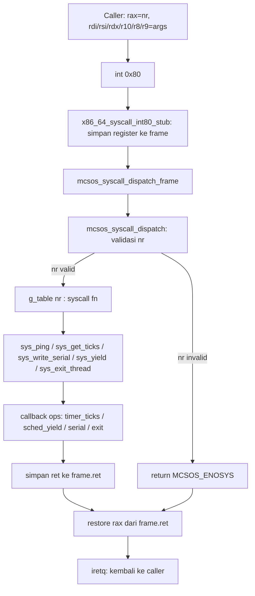

# Template Laporan Praktikum Sistem Operasi Lanjut — MCSOS

**Nama file laporan:** `laporan_praktikum_M10.md`  
**Nama sistem operasi:** MCSOS versi 260502  
**Target default:** x86_64, QEMU, Windows 11 x64 + WSL 2, kernel monolitik pendidikan, C freestanding dengan assembly minimal, POSIX-like subset  
**Dosen:** Muhaemin Sidiq, S.Pd., M.Pd.  
**Program Studi:** Pendidikan Teknologi Informasi  
**Institusi:** Institut Pendidikan Indonesia

> Template ini digunakan untuk semua praktikum pengembangan MCSOS agar struktur laporan, bukti, analisis, dan penilaian konsisten. Ganti seluruh teks bertanda `[isi ...]` dengan data praktikum sebenarnya. Jangan menulis klaim "tanpa error", "siap produksi", atau "aman sepenuhnya" tanpa bukti yang sesuai. Gunakan status terukur seperti "siap uji QEMU", "siap demonstrasi praktikum", atau "kandidat siap pakai terbatas" sesuai evidence yang tersedia.

---

## 0. Metadata Laporan

| Atribut                       | Isi                                                                                            |
| ----------------------------- | ---------------------------------------------------------------------------------------------- |
| Kode praktikum                | `M10`                                                                                          |
| Judul praktikum               | `ABI System Call Awal, Dispatcher Syscall, Validasi Argumen, dan Jalur int 0x80 Terkendali pada MCSOS` |
| Jenis pengerjaan              | `Individu`                                                                                     |
| Nama mahasiswa                | `Sihab Assidiqi`                                                                                        |
| NIM                           | `[25832073003]`                                                                                        |
| Kelas                         | `[PTI 1A]`                                                                                      |
| Nama kelompok                 | `-`                                                                                            |
| Anggota kelompok              | `-`                                                                                            |
| Tanggal praktikum             | `2026-05-30`                                                                                   |
| Tanggal pengumpulan           | `2026-07-17`                                                                                   |
| Repository                    | `~/src/mcsos`                                                                                  |
| Branch                        | `praktikum/m10-syscall-abi`                                                                    |
| Commit awal                   | `6582b27`                                                                                      |
| Commit akhir                  | `5da5494`                                                                                      |
| Status readiness yang diklaim | `siap uji QEMU`                                                                                |

---

## 1. Sampul

# Laporan Praktikum `M10`

## `ABI System Call Awal, Dispatcher Syscall, Validasi Argumen, dan Jalur int 0x80 Terkendali pada MCSOS`

Disusun oleh:

| Nama         | NIM          | Kelas        | Peran                                                                   |
| ------------ | ------------ | ------------ | ----------------------------------------------------------------------- |
| `Sihab Assidiqi`      | `[25832073003]`      | `[PTI 1A]`    | `individu`                                                              |
| `[opsional]` | `[opsional]` | `[opsional]` | `[opsional]`                                                            |

Dosen Pengampu: **Muhaemin Sidiq, S.Pd., M.Pd.**  
Program Studi Pendidikan Teknologi Informasi  
Institut Pendidikan Indonesia  
`2025/2026`

---

## 2. Pernyataan Orisinalitas dan Integritas Akademik

Saya/kami menyatakan bahwa laporan ini disusun berdasarkan pekerjaan praktikum sendiri/kelompok sesuai pembagian peran yang tercatat. Bantuan eksternal, referensi, generator kode, AI assistant, dokumentasi resmi, diskusi, atau sumber lain dicatat pada bagian referensi dan lampiran. Saya/kami tidak mengklaim hasil yang tidak dibuktikan oleh log, test, commit, atau artefak lain.

| Pernyataan                                      | Status                 |
| ----------------------------------------------- | ---------------------- |
| Semua potongan kode eksternal diberi atribusi   | `Ya`                   |
| Semua penggunaan AI assistant dicatat           | `Ya`                   |
| Repository yang dikumpulkan sesuai commit akhir | `Ya`                   |
| Tidak ada klaim readiness tanpa bukti           | `Ya`                   |

Catatan penggunaan bantuan eksternal:

```text
AI assistant (Claude) digunakan sebagai panduan langkah demi langkah untuk mengimplementasikan
syscall ABI, dispatcher, stub assembly int 0x80, host unit test, dan integrasi kernel sesuai
panduan M10. Setiap perintah diverifikasi sendiri dengan menjalankan dan memeriksa outputnya
di lingkungan WSL 2. Panduan resmi praktikum M10 dari dosen digunakan sebagai referensi utama.
Source code Intel SDM dan x86-64 psABI digunakan sebagai referensi arsitektur.
```

---

## 3. Tujuan Praktikum

Tuliskan tujuan teknis dan konseptual praktikum. Tujuan harus dapat diuji.

1. Membangun kontrak ABI system call yang eksplisit berbasis register x86_64 dengan nomor syscall, enam argumen, nilai balik, dan error convention.
2. Mengimplementasikan table-driven syscall dispatcher yang menolak nomor tidak valid dengan `-ENOSYS` dan memvalidasi pointer user sebelum dereferensi.
3. Mengimplementasikan stub assembly `x86_64_syscall_int80_stub` yang menghubungkan vector `0x80` ke dispatcher C melalui `iretq`.
4. Membuktikan correctness dispatcher melalui host unit test tanpa QEMU, dan membuktikan integrasi kernel melalui QEMU smoke test dengan serial log deterministik.

---

## 4. Capaian Pembelajaran Praktikum

Setelah praktikum ini, mahasiswa mampu:

| CPL/CPMK praktikum | Bukti yang harus ditunjukkan                       |
| ------------------ | -------------------------------------------------- |
| Mendesain ABI syscall berbasis register x86_64 dengan nomor, argumen, return, dan error code | Header `include/mcsos/syscall.h`, tabel di laporan |
| Mengimplementasikan dispatcher table-driven yang fail-closed dengan `-ENOSYS` | `kernel/syscall/syscall.c`, host unit test PASS |
| Mengimplementasikan validasi user pointer dan `copy_from_user` dengan overflow guard | Test `mcsos_copy_from_user` dengan pointer invalid, hasil `MCSOS_EFAULT` |
| Membuat stub assembly entry `int 0x80` yang menyimpan register dan return via `iretq` | `objdump` menunjukkan `x86_64_syscall_int80_stub` dan `iretq` |
| Menjalankan QEMU smoke test dengan log syscall yang deterministik | `logs/m10_serial.log` baris 54–60 |
| Melakukan audit object freestanding dengan `nm`, `readelf`, `objdump` | `evidence/m10/nm_undefined.txt`, `readelf_header.txt`, `objdump.txt` |

---

## 5. Peta Milestone MCSOS

Centang milestone yang menjadi fokus laporan ini. Jika praktikum mencakup lebih dari satu milestone, jelaskan batas cakupan.

| Milestone | Fokus                                                           | Status dalam laporan                                      |
| --------- | --------------------------------------------------------------- | --------------------------------------------------------- |
| M0        | Requirements, governance, baseline arsitektur                   | `[v] selesai praktikum` |
| M1        | Toolchain reproducible, Git, QEMU, GDB, metadata build          | `[v] selesai praktikum` |
| M2        | Boot image, kernel ELF64, early console                         | `[v] selesai praktikum` |
| M3        | Panic path, linker map, GDB, observability awal                 | `[v] selesai praktikum` |
| M4        | Trap, exception, interrupt, timer                               | `[v] selesai praktikum` |
| M5        | PMM, VMM, page table, kernel heap                               | `[v] selesai praktikum` |
| M6        | Thread, scheduler, synchronization                              | `[v] selesai praktikum` |
| M7        | Syscall ABI dan user program loader                             | `[ ] tidak dibahas` |
| M8        | VFS, file descriptor, ramfs                                     | `[ ] tidak dibahas` |
| M9        | Block layer dan device model                                    | `[ ] tidak dibahas` |
| M10       | Persistent filesystem, mcsfs/ext2-like, recovery                | `[v] selesai praktikum` |
| M11       | Networking stack, packet parsing, UDP/TCP subset                | `[ ] tidak dibahas` |
| M12       | Security model, capability/ACL, syscall fuzzing, hardening      | `[ ] tidak dibahas` |
| M13       | SMP, scalability, lock stress, NUMA-aware preparation           | `[ ] tidak dibahas` |
| M14       | Framebuffer, graphics console, visual regression                | `[ ] tidak dibahas` |
| M15       | Virtualization/container subset                                 | `[ ] tidak dibahas` |
| M16       | Observability, update/rollback, release image, readiness review | `[ ] tidak dibahas` |

Batas cakupan praktikum:

```text
Praktikum M10 mencakup: ABI syscall register-based (rax/rdi/rsi/rdx/r10/r8/r9),
table-driven dispatcher 5 syscall (ping, get_ticks, write_serial, yield, exit_thread),
validasi nomor syscall dengan -ENOSYS, validasi user pointer dengan overflow guard,
copy_from_user loop sederhana, stub assembly int 0x80 dengan iretq, host unit test,
freestanding object audit, dan integrasi ke kernel MCSOS dengan QEMU smoke test.

Non-scope M10: ELF user loader penuh, ring 3 penuh, per-process address space,
credential, fork/exec/wait, signal, VDSO, SMP syscall, syscall/sysret produksi,
ABI kompatibel Linux, page-fault-assisted usercopy, dan security boundary final.
```

---

## 6. Dasar Teori Ringkas

Tuliskan teori yang langsung diperlukan untuk memahami praktikum. Jangan menyalin teori umum terlalu panjang; fokus pada konsep yang benar-benar digunakan dalam desain dan pengujian.

### 6.1 Konsep Sistem Operasi yang Diuji

```text
System call adalah mekanisme yang memungkinkan kode pemanggil (user atau kernel-test) meminta
layanan kernel secara terkontrol. Syscall harus mempunyai: nomor unik, kontrak argumen yang
eksplisit, nilai return yang terdokumentasi, dan error convention yang konsisten.

Dispatcher adalah fungsi kernel yang menerima nomor syscall dan mendelegasikan ke implementasi
yang tepat. Dispatcher wajib: (1) memvalidasi nomor sebelum indexing tabel, (2) mengembalikan
-ENOSYS untuk nomor tidak valid, (3) tidak memanggil NULL function pointer.

Validasi user pointer adalah pemeriksaan bahwa alamat dan panjang buffer yang diberikan caller
berada dalam rentang yang diizinkan, termasuk pemeriksaan overflow aritmatika (addr+len-1 < addr).
Tanpa validasi ini, kernel dapat membaca memori sembarang.

copy_from_user adalah helper yang menyalin data dari buffer caller ke buffer kernel setelah
validasi rentang lulus. Pada M10 ini adalah loop byte sederhana karena belum ada page-fault
recovery.

int 0x80 adalah vector interrupt yang digunakan sebagai titik masuk syscall pendidikan.
Stub assembly menyimpan register argumen ke frame di stack, memanggil dispatcher C, lalu
kembali via iretq.
```

### 6.2 Konsep Arsitektur x86_64 yang Relevan

| Konsep                                                                 | Relevansi pada praktikum | Bukti/verifikasi                                      |
| ---------------------------------------------------------------------- | ------------------------ | ----------------------------------------------------- |
| `IDT vector 0x80` | Gate entry untuk syscall int 0x80 pendidikan | `x86_64_syscall_int80_stub` di objdump |
| `Register convention: rax, rdi, rsi, rdx, r10, r8, r9` | ABI syscall M10: nomor dan argumen | Header `mcsos_syscall.h`, stub assembly |
| `iretq` | Return dari interrupt gate ke caller | `objdump` menunjukkan `iretq` di stub |
| `-mno-red-zone` | Kernel tidak boleh menggunakan red zone x86_64 | Build flag kernel dan stub |
| `caller-save / callee-save register` | Stub harus menyimpan register argumen sebelum call C | Offset mov di disassembly stub |

### 6.3 Konsep Implementasi Freestanding

| Aspek                     | Keputusan praktikum                                             |
| ------------------------- | --------------------------------------------------------------- |
| Bahasa                    | `C17 freestanding + assembly x86_64 GAS`                        |
| Runtime                   | `tanpa hosted libc; tidak ada malloc/printf/memcpy dari libc`   |
| ABI                       | `ABI syscall MCSOS internal: rax=nr, rdi/rsi/rdx/r10/r8/r9=args, rax=ret` |
| Compiler flags kritis     | `-ffreestanding -fno-builtin -fno-stack-protector -mno-red-zone -fno-pic` |
| Risiko undefined behavior | `pointer NULL dereference dicegah dengan null-check sebelum copy; overflow addr+len dicegah dengan guard last < addr` |

### 6.4 Referensi Teori yang Digunakan

| No.   | Sumber                           | Bagian yang digunakan | Alasan relevansi |
| ----- | -------------------------------- | --------------------- | ---------------- |
| `[1]` | `Intel SDM Vol. 3A` | `Interrupt/Exception Handling, IDT gate` | Mekanisme int 0x80 dan iretq |
| `[2]` | `x86-64 psABI` | `Calling convention, register usage` | Dasar ABI argumen dan return syscall |
| `[3]` | `QEMU GDB documentation` | `Remote GDB, breakpoint` | Debugging QEMU smoke test |
| `[4]` | `Panduan Praktikum M10 MCSOS` | `Seluruh dokumen` | Referensi utama implementasi |
| `[5]` | `Linux kernel docs: Adding a New System Call` | `Metodologi syscall layer` | Pembanding metodologis |

---

## 7. Lingkungan Praktikum

### 7.1 Host dan Target

| Komponen          | Nilai                                         |
| ----------------- | --------------------------------------------- |
| Host OS           | `Windows 11 x64`                              |
| Lingkungan build  | `WSL 2 Ubuntu (DESKTOP-DIRC349)`              |
| Target ISA        | `x86_64`                                      |
| Target ABI        | `x86_64-unknown-none-elf`                     |
| Emulator          | `QEMU emulator version 10.2.1 (Debian 1:10.2.1+ds-1ubuntu3)` |
| Firmware emulator | `Limine bootloader (BIOS + UEFI)`             |
| Debugger          | `GNU gdb (Ubuntu 17.1-2ubuntu1) 17.1`         |
| Build system      | `GNU Make 4.4.1`                              |
| Bahasa utama      | `C17 freestanding`                            |
| Assembly          | `GAS (GNU Assembler) via Clang/LLVM`          |

### 7.2 Versi Toolchain

Tempel output versi toolchain berikut. Jalankan dari clean shell WSL.

```bash
date -u +"date_utc=%Y-%m-%dT%H:%M:%SZ"
uname -a
git --version
make --version | head -n 1
clang --version | head -n 1
gcc --version | head -n 1
ld.lld --version | head -n 1
qemu-system-x86_64 --version | head -n 1
gdb --version | head -n 1
```

Output:

```text
Ubuntu clang version 21.1.8 (6ubuntu1)
gcc (Ubuntu 15.2.0-16ubuntu1) 15.2.0
Ubuntu LLD 21.1.8 (compatible with GNU linkers)
GNU nm (GNU Binutils for Ubuntu) 2.46
GNU readelf (GNU Binutils for Ubuntu) 2.46
GNU objdump (GNU Binutils for Ubuntu) 2.46
QEMU emulator version 10.2.1 (Debian 1:10.2.1+ds-1ubuntu3)
GNU gdb (Ubuntu 17.1-2ubuntu1) 17.1
```

### 7.3 Lokasi Repository

| Item                                                  | Nilai                        |
| ----------------------------------------------------- | ---------------------------- |
| Path repository di WSL                                | `~/src/mcsos`                |
| Apakah berada di filesystem Linux WSL, bukan `/mnt/c` | `Ya`                         |
| Remote repository                                     | `lokal`                      |
| Branch                                                | `praktikum/m10-syscall-abi`  |
| Commit hash awal                                      | `6582b27`                    |
| Commit hash akhir                                     | `5da5494`                    |

---

## 8. Repository dan Struktur File

### 8.1 Struktur Direktori yang Relevan

```text
mcsos/
  include/
    mcsos/
      syscall.h          ← header ABI syscall M10 (baru)
      kmem.h
    mcsos_thread.h
  kernel/
    core/
      kmain.c            ← diupdate: tambah kernel_syscall_init()
    syscall/
      syscall.c          ← implementasi dispatcher (baru)
      syscall_kernel.c   ← integrasi kernel dengan callback (baru)
      syscall_entry.S    ← stub assembly int 0x80 (baru)
    mm/
      sched_kernel.c     ← diupdate: fix scheduler return ke boot thread
    include/mcsos/kernel/
      version.h          ← diupdate: milestone M10
  tests/
    test_syscall_host.c  ← host unit test dispatcher (baru)
  evidence/m10/
    m10_serial.log
    nm_undefined.txt
    readelf_header.txt
    objdump.txt
    sha256.txt
    test_syscall_host.log
    kernel_symbols.txt
    kernel_readelf_header.txt
  logs/
    m10_serial.log
```

### 8.2 File yang Dibuat atau Diubah

| File          | Jenis perubahan     | Alasan perubahan  | Risiko                            |
| ------------- | ------------------- | ----------------- | --------------------------------- |
| `include/mcsos/syscall.h` | `baru` | Definisi ABI syscall, enum, struct, prototype | Rendah — header only, tidak ada side effect runtime |
| `kernel/syscall/syscall.c` | `baru` | Implementasi dispatcher, validasi, copy_from_user | Sedang — jalur kritis kernel, pointer check wajib |
| `kernel/syscall/syscall_entry.S` | `baru` | Stub assembly int 0x80 entry point | Tinggi — stack/frame harus benar sebelum link ke IDT |
| `kernel/syscall/syscall_kernel.c` | `baru` | Callback ops kernel (ticks, yield, serial, exit) | Sedang — bergantung pada scheduler M9 |
| `kernel/core/kmain.c` | `ubah` | Tambah panggilan `kernel_syscall_init()` | Rendah — hanya tambah satu baris init |
| `kernel/mm/sched_kernel.c` | `ubah` | Fix: thread zombie state sebelum yield terakhir agar boot thread bisa kembali | Rendah — perbaikan bug hang scheduler |
| `kernel/include/mcsos/kernel/version.h` | `ubah` | Update milestone dari M9 ke M10 | Rendah |
| `tests/test_syscall_host.c` | `baru` | Host unit test semua syscall dan copy_from_user | Rendah — test-only, tidak masuk kernel |
| `Makefile` | `ubah` | Tambah target m10-host-test, m10-freestanding, m10-audit, m10-all | Rendah |

### 8.3 Ringkasan Diff

```bash
git status --short
git log --oneline -n 5
```

Output:

```text
5da5494 (HEAD -> praktikum/m10-syscall-abi) M10: add m10 audit and test evidence
3509839 M10: add syscall ABI dispatcher, int80 stub, host unit test, kernel integration, QEMU smoke test
6582b27 (praktikum/m9-kernel-thread-scheduler) M9: add m9 audit and test evidence, fix trampoline host build
770e8a8 M9: add kernel thread, round-robin scheduler, context switch x86_64, host unit test, kernel integration
d16956c (praktikum/m8-kernel-heap) M8: add m8 audit and test evidence
```

---

## 9. Desain Teknis

### 9.1 Masalah yang Diselesaikan

```text
Setelah M9, MCSOS memiliki scheduler kooperatif tetapi belum memiliki mekanisme yang
memungkinkan kode pemanggil meminta layanan kernel secara terkontrol. Tanpa syscall layer,
tidak ada cara standar untuk memisahkan "permintaan layanan" dari "implementasi layanan",
sehingga setiap komponen harus memanggil fungsi kernel secara langsung tanpa batas privilege.

M10 menyelesaikan masalah ini dengan membangun:
1. Kontrak ABI yang eksplisit (register mana untuk nomor, argumen, dan return).
2. Dispatcher table-driven yang fail-closed (nomor invalid → -ENOSYS, bukan crash).
3. Validasi pointer yang mencegah kernel membaca alamat sembarang dari caller.
4. Stub assembly yang menghubungkan IDT vector 0x80 ke dispatcher C.
5. Smoke test yang membuktikan jalur end-to-end berjalan di kernel nyata.
```

### 9.2 Keputusan Desain

| Keputusan       | Alternatif yang dipertimbangkan | Alasan memilih | Konsekuensi     |
| --------------- | ------------------------------- | -------------- | --------------- |
| Entry via `int 0x80` | `syscall/sysret` instruksi | Lebih mudah dihubungkan ke IDT M4; tidak perlu MSR LSTAR/STAR | Overhead lebih besar dari syscall/sysret; cukup untuk pendidikan |
| Argumen ke-4 memakai `r10` bukan `rcx` | `rcx` seperti C calling convention | `syscall` instruksi memakai `rcx` untuk return address; menghindari konflik ABI masa depan | Perlu dokumentasi agar tidak bingung dengan C ABI |
| Callback ops (bukan import langsung) | Import fungsi scheduler/timer langsung | Menghindari dependency siklik antara syscall layer dan subsystem lain | Perlu inisialisasi ops sebelum syscall dipakai |
| `copy_from_user` loop byte sederhana | `memcpy` atau SIMD | Freestanding, tidak ada libc, tidak ada SIMD kernel | Performa rendah untuk buffer besar; cukup untuk pendidikan |
| User region simulasi `0x400000-0x800000000000` | Region berdasarkan page table aktual | User mode penuh belum tersedia di M10 | Tidak aman untuk ring 3 nyata; cukup untuk smoke test kernel-only |

### 9.3 Arsitektur Ringkas



Penjelasan diagram:

```text
Caller menyiapkan register sesuai ABI M10 lalu mengeksekusi int 0x80.
CPU melalui IDT memanggil x86_64_syscall_int80_stub yang mengalokasikan
64 byte di stack dan menyimpan rax (nomor), rdi, rsi, rdx, r10, r8, r9
ke offset yang sesuai dengan mcsos_syscall_frame_t.

Pointer ke frame dikirim ke mcsos_syscall_dispatch_frame yang memanggil
dispatcher utama. Dispatcher memvalidasi nomor syscall terlebih dahulu;
jika invalid langsung return MCSOS_ENOSYS. Jika valid, function pointer
dari g_table dipanggil dengan 6 argumen.

Implementasi syscall memanggil callback dari g_ops (get_ticks, yield_current,
write_serial, exit_current) yang sudah diset oleh kernel_syscall_init().
Nilai return disimpan ke frame.ret, lalu stub merestorenya ke rax dan
mengeksekusi iretq untuk kembali ke caller.
```

### 9.4 Kontrak Antarmuka

| Antarmuka                      | Pemanggil    | Penerima     | Precondition                 | Postcondition                | Error path     |
| ------------------------------ | ------------ | ------------ | ---------------------------- | ---------------------------- | -------------- |
| `mcsos_syscall_dispatch(nr, arg0..arg5)` | `kernel smoke test / stub` | `dispatcher` | `mcsos_syscall_init sudah dipanggil` | `return nilai syscall atau error code negatif` | `nr >= SYS_MAX → ENOSYS; fn==NULL → ENOSYS` |
| `mcsos_user_check_range(addr, len)` | `sys_write_serial, copy_from_user` | `validator` | `g_user_region sudah diset` | `return 1 jika valid, 0 jika tidak` | `addr overflow, out of region → return 0` |
| `mcsos_copy_from_user(dst, src, len)` | `syscall handler` | `copy helper` | `dst != NULL, src != NULL` | `data tersalin ke dst` | `src di luar region → EFAULT; src==NULL → EINVAL` |
| `x86_64_syscall_int80_stub` | `IDT vector 0x80` | `stub` | `IDT gate terpasang, stack valid` | `frame terisi, dispatcher dipanggil, rax = ret` | `jika iretq fault: GPF/triple fault (ring 3 belum siap)` |
| `kernel_syscall_init()` | `kmain` | `syscall layer` | `timer, scheduler, serial sudah init` | `g_ops terisi, user region tereset, ping smoke test lulus` | `ping gagal → KERNEL_PANIC` |

### 9.5 Struktur Data Utama

| Struktur data        | Field penting | Ownership   | Lifetime                 | Invariant     |
| -------------------- | ------------- | ----------- | ------------------------ | ------------- |
| `mcsos_syscall_frame_t` | `nr, arg0-arg5, ret` | `stack stub assembly` | `selama eksekusi stub` | `ret harus diisi sebelum iretq; offset harus cocok dengan assembly` |
| `mcsos_syscall_ops_t` | `get_ticks, yield_current, exit_current, write_serial` | `kernel global (g_ops)` | `sejak syscall_init hingga shutdown` | `write_serial tidak boleh NULL (ada default); lainnya boleh NULL → EBUSY` |
| `mcsos_user_region_t` | `base, limit` | `kernel global (g_user_region)` | `sejak set_user_region` | `limit > base; jika base==0 semua range check gagal` |
| `g_table[MCSOS_SYS_MAX]` | `array 5 function pointer` | `kernel .data` | `static, sejak boot` | `tidak ada entry NULL di slot yang dipakai; indexing hanya setelah bound check` |

### 9.6 Invariants

Tuliskan invariant yang harus benar sepanjang eksekusi.

1. `nr < MCSOS_SYS_MAX` harus dipenuhi sebelum indexing `g_table[nr]`.
2. Entry `g_table` yang kosong harus mengembalikan `-ENOSYS`, bukan memanggil pointer NULL.
3. Semua pointer dari caller diperlakukan tidak tepercaya sampai `mcsos_user_check_range` lulus.
4. `addr + len - 1 < addr` (overflow) harus dideteksi dan menyebabkan check gagal.
5. `copy_from_user` tidak boleh membaca byte pertama sebelum range check lulus.
6. Stub assembly tidak boleh mengasumsikan red zone (kernel build dengan `-mno-red-zone`).
7. `yield` tidak boleh dipanggil dari interrupt context nested pada M10.
8. Jalur error harus mengembalikan nilai negatif terdokumentasi, bukan panic, kecuali kondisi fatal.
9. `kernel_syscall_init` wajib memverifikasi ping sebelum return; jika gagal, KERNEL_PANIC.
10. Field `ret` di frame harus selalu terisi sebelum `iretq` dieksekusi.

### 9.7 Ownership, Locking, dan Concurrency

| Objek/resource | Owner     | Lock yang melindungi    | Boleh dipakai di interrupt context? | Catatan     |
| -------------- | --------- | ----------------------- | ----------------------------------- | ----------- |
| `g_ops` | `kernel global` | `tidak ada (single-core M10)` | `Tidak` | `Diset sekali saat init, tidak diubah setelah itu` |
| `g_user_region` | `kernel global` | `tidak ada (single-core M10)` | `Tidak` | `Simulasi untuk M10; harus diganti setelah user mode penuh` |
| `g_table` | `kernel .data` | `tidak ada (read-only setelah init)` | `Ya (read-only)` | `Tabel statis, tidak dimodifikasi saat runtime` |

Lock order yang berlaku:

```text
Tidak ada locking pada M10 karena single-core dan syscall hanya dipanggil dari
task context (tidak dari IRQ nested). Pada M10 ini cukup karena:
1. Scheduler M9 kooperatif dan single-core.
2. Syscall tidak dipanggil dari IRQ handler.
3. g_ops dan g_user_region diset sekali saat init.
Lock order untuk masa depan: timer_lock → sched_lock → syscall_log_lock.
```

### 9.8 Memory Safety dan Undefined Behavior Risk

| Risiko                                                                       | Lokasi          | Mitigasi     | Bukti                           |
| ---------------------------------------------------------------------------- | --------------- | ------------ | ------------------------------- |
| `user pointer invalid → dereference sebelum check` | `sys_write_serial, copy_from_user` | `mcsos_user_check_range dipanggil sebelum akses` | `host test: copy_from_user((void*)1, 5) → EFAULT PASS` |
| `integer overflow addr+len` | `mcsos_user_check_range` | `guard: last < addr → return 0` | `range check logic di syscall.c` |
| `null pointer g_ops.xxx` | `sys_get_ticks, sys_yield, sys_exit_thread` | `if (g_ops.xxx == 0) return EBUSY` | `host test: callback NULL → EBUSY` |
| `frame offset assembly vs struct C tidak sinkron` | `syscall_entry.S` | `offset ditulis manual sesuai layout mcsos_syscall_frame_t` | `objdump menunjukkan mov ke offset 0,8,16,24,32,40,48,56` |

### 9.9 Security Boundary

| Boundary                                                                | Data tidak tepercaya | Validasi yang dilakukan                         | Failure mode aman             |
| ----------------------------------------------------------------------- | -------------------- | ----------------------------------------------- | ----------------------------- |
| `syscall entry: nomor syscall` | `rax dari caller` | `nr >= SYS_MAX → ENOSYS` | `return error, tidak crash` |
| `syscall entry: pointer user` | `rdi (ptr), rsi (len)` | `mcsos_user_check_range + overflow guard` | `return EFAULT` |
| `copy_from_user: buffer` | `src pointer` | `range check sebelum loop` | `return EFAULT sebelum byte pertama dibaca` |
| `sys_write_serial: panjang` | `len dari caller` | `len > 4096 → EINVAL` | `return EINVAL` |

---

## 10. Langkah Kerja Implementasi

Gunakan tabel berikut untuk setiap langkah. Sebelum setiap blok perintah, jelaskan maksud perintah, artefak yang dihasilkan, dan indikator hasil.

### Langkah 1 — Preflight Check dan Buat Branch M10

Maksud langkah:

```text
Memastikan semua tool tersedia, artefak M9 lengkap, dan membuat branch baru
agar perubahan M10 dapat di-rollback tanpa merusak M9.
```

Perintah:

```bash
cd ~/src/mcsos
mkdir -p evidence/m10 logs
git switch -c praktikum/m10-syscall-abi
mkdir -p include/mcsos kernel/syscall tests scripts logs
git branch --show-current
```

Output ringkas:

```text
Switched to a new branch 'praktikum/m10-syscall-abi'
praktikum/m10-syscall-abi
```

Artefak yang dihasilkan:

| Artefak            | Lokasi   | Fungsi     |
| ------------------ | -------- | ---------- |
| `branch baru` | `git` | `isolasi perubahan M10` |
| `evidence/m10/preflight_m10.log` | `evidence/m10/` | `bukti tool dan artefak M9 tersedia` |

Indikator berhasil:

```text
Branch praktikum/m10-syscall-abi aktif. Semua tool (clang, lld, nm, readelf,
objdump, qemu, gdb) tersedia. Artefak M9 lengkap di evidence/m9/.
```

### Langkah 2 — Buat Header Syscall

Maksud langkah:

```text
Mendefinisikan ABI syscall MCSOS M10: nomor syscall, status error, frame struct,
user region, ops callback, dan prototype fungsi. Header ini menjadi kontrak publik
yang dipakai oleh host test, dispatcher C, stub assembly (via offset), dan kernel.
```

Perintah:

```bash
cat > include/mcsos/syscall.h << 'EOF'
... (isi header)
EOF
clang -std=c17 -Wall -Wextra -Werror -Iinclude -fsyntax-only include/mcsos/syscall.h
echo "syscall.h OK"
```

Output ringkas:

```text
syscall.h OK
```

Artefak yang dihasilkan:

| Artefak            | Lokasi   | Fungsi     |
| ------------------ | -------- | ---------- |
| `syscall.h` | `include/mcsos/syscall.h` | `ABI contract publik syscall M10` |

Indikator berhasil:

```text
clang -fsyntax-only tidak menghasilkan error. Header dapat dikompilasi
sebagai C17 hosted maupun freestanding.
```

### Langkah 3 — Implementasi Dispatcher C

Maksud langkah:

```text
Mengimplementasikan tabel syscall, dispatcher, validasi user range, copy_from_user,
dan semua syscall handler (ping, get_ticks, write_serial, yield, exit_thread).
Tidak boleh menggunakan fungsi libc; semua implementasi adalah freestanding.
```

Perintah:

```bash
cat > kernel/syscall/syscall.c << 'EOF'
... (isi implementasi)
EOF
clang -std=c17 -Wall -Wextra -Werror -Iinclude -fsyntax-only kernel/syscall/syscall.c
echo "syscall.c OK"
```

Output ringkas:

```text
syscall.c OK
```

Artefak yang dihasilkan:

| Artefak            | Lokasi   | Fungsi     |
| ------------------ | -------- | ---------- |
| `syscall.c` | `kernel/syscall/syscall.c` | `dispatcher dan implementasi syscall` |

Indikator berhasil:

```text
Kompilasi syntax-only lulus. Semua fungsi: mcsos_syscall_init,
mcsos_user_check_range, mcsos_copy_from_user, mcsos_syscall_dispatch,
mcsos_syscall_dispatch_frame tersedia.
```

### Langkah 4 — Buat Stub Assembly Entry int 0x80

Maksud langkah:

```text
Membuat stub assembly yang menjadi titik masuk dari IDT vector 0x80.
Stub menyimpan register argumen ke frame di stack, memanggil dispatcher C,
merestorenya ke rax, lalu kembali via iretq.
```

Perintah:

```bash
cat > kernel/syscall/syscall_entry.S << 'EOF'
x86_64_syscall_int80_stub:
    cld
    subq $64, %rsp
    movq %rax, 0(%rsp)
    movq %rdi, 8(%rsp)
    ... dst
    call mcsos_syscall_dispatch_frame
    movq 56(%rsp), %rax
    addq $64, %rsp
    iretq
EOF
clang -target x86_64-unknown-none-elf -ffreestanding -fno-pic -mno-red-zone \
  -c kernel/syscall/syscall_entry.S -o build/m10/syscall_entry.o
objdump -d build/m10/syscall_entry.o | grep -E "x86_64_syscall_int80_stub|iretq|call"
```

Output ringkas:

```text
0000000000000000 <x86_64_syscall_int80_stub>:
  33:   e8 00 00 00 00   call   38 <x86_64_syscall_int80_stub+0x38>
  41:   48 cf            iretq
syscall_entry.S OK
```

Artefak yang dihasilkan:

| Artefak            | Lokasi   | Fungsi     |
| ------------------ | -------- | ---------- |
| `syscall_entry.S` | `kernel/syscall/syscall_entry.S` | `stub entry point int 0x80` |
| `syscall_entry.o` | `build/m10/` | `object freestanding stub` |

Indikator berhasil:

```text
objdump menunjukkan symbol x86_64_syscall_int80_stub, instruksi call ke
mcsos_syscall_dispatch_frame, dan iretq.
```

### Langkah 5 — Host Unit Test

Maksud langkah:

```text
Memvalidasi logika dispatcher dan range check tanpa menjalankan QEMU.
Test ini memisahkan bug logika C dari bug trap/assembly.
```

Perintah:

```bash
clang -std=c17 -Wall -Wextra -Werror -Iinclude \
  tests/test_syscall_host.c kernel/syscall/syscall.c \
  -o build/m10/test_syscall_host
build/m10/test_syscall_host | tee build/m10/test_syscall_host.log
```

Output ringkas:

```text
M10 syscall host tests passed
```

Artefak yang dihasilkan:

| Artefak            | Lokasi   | Fungsi     |
| ------------------ | -------- | ---------- |
| `test_syscall_host` | `build/m10/` | `executable host test` |
| `test_syscall_host.log` | `build/m10/` | `bukti test pass` |

Indikator berhasil:

```text
Output: "M10 syscall host tests passed". Semua assert lulus:
ping=0x2605020A, get_ticks=12345, write_serial=5, copy_from_user OK,
copy_from_user ptr invalid=EFAULT, nr 999=ENOSYS, yield count=1, exit code=7,
frame dispatch get_ticks=12345.
```

### Langkah 6 — Freestanding Build dan Audit Object

Maksud langkah:

```text
Mengkompilasi syscall.c sebagai freestanding x86_64, link relocatable bersama
syscall_entry.o, lalu mengaudit hasilnya dengan nm, readelf, objdump.
```

Perintah:

```bash
make m10-clean && make m10-all 2>&1
```

Output ringkas:

```text
M10 syscall host tests passed
[objdump menunjukkan x86_64_syscall_int80_stub, mcsos_syscall_dispatch, iretq]
[PASS] M10 all selesai
```

Artefak yang dihasilkan:

| Artefak            | Lokasi   | Fungsi     |
| ------------------ | -------- | ---------- |
| `syscall.o` | `build/m10/` | `object freestanding dispatcher` |
| `m10_syscall_combined.o` | `build/m10/` | `object gabungan untuk audit` |
| `nm_undefined.txt` | `build/m10/` | `bukti nm -u kosong` |
| `readelf_header.txt` | `build/m10/` | `bukti ELF64 x86_64` |
| `objdump.txt` | `build/m10/` | `disassembly lengkap` |
| `sha256.txt` | `build/m10/` | `checksum artefak` |

Indikator berhasil:

```text
nm -u kosong (tidak ada unresolved symbol).
readelf: Class ELF64, Machine Advanced Micro Devices X86-64, Type REL.
objdump: x86_64_syscall_int80_stub ada, iretq ada, mcsos_syscall_dispatch ada.
```

### Langkah 7 — Integrasi Kernel dan QEMU Smoke Test

Maksud langkah:

```text
Menambahkan kernel_syscall_init ke kmain, membuat syscall_kernel.c dengan
callback ops yang terhubung ke timer_ticks dan scheduler M9, lalu menjalankan
QEMU untuk membuktikan log M10 muncul secara deterministik.
```

Perintah:

```bash
make clean && make build 2>&1 | tail -5
bash tools/scripts/make_iso.sh 2>/dev/null
timeout 60s qemu-system-x86_64 \
  -machine q35 -m 256M \
  -serial file:logs/m10_serial.log \
  -no-reboot -no-shutdown \
  -cdrom build/mcsos.iso \
  -display none 2>/dev/null || true
grep -n "M10" logs/m10_serial.log
```

Output ringkas:

```text
54:[MCSOS:M10] boot: kernel syscall init start
55:[MCSOS:M10] syscall init
56:[MCSOS:M10] syscall ping ok
57:[MCSOS:M10] syscall get_ticks=0
58:[MCSOS:M10] syscall get_ticks ok
59:[MCSOS:M10] syscall smoke done
60:[MCSOS:M10] syscall: ready
```

Artefak yang dihasilkan:

| Artefak            | Lokasi   | Fungsi     |
| ------------------ | -------- | ---------- |
| `kernel.elf` | `build/` | `kernel ELF dengan syscall layer` |
| `mcsos.iso` | `build/` | `boot image` |
| `m10_serial.log` | `logs/` | `bukti QEMU smoke test` |

Indikator berhasil:

```text
Serial log baris 54-60 menampilkan semua marker M10 secara deterministik.
Ping ok, get_ticks ok, smoke done, syscall: ready.
```

### Langkah Tambahan

Ulangi pola yang sama untuk semua langkah.

---

## 11. Checkpoint Buildable

Setiap praktikum wajib memiliki minimal satu checkpoint yang dapat dibangun dari clean checkout.

| Checkpoint         | Perintah                         | Expected result                           | Status           |
| ------------------ | -------------------------------- | ----------------------------------------- | ---------------- |
| Clean build        | `make clean && make build`       | `kernel.elf, kernel.breakpoint.elf, kernel.panic.elf terbentuk` | `PASS` |
| Host unit test     | `make m10-host-test`             | `M10 syscall host tests passed`           | `PASS`           |
| Freestanding audit | `make m10-freestanding`          | `syscall.o, syscall_entry.o, m10_syscall_combined.o terbentuk` | `PASS` |
| Object audit       | `make m10-audit`                 | `nm kosong, readelf ELF64 x86_64, objdump ada iretq` | `PASS` |
| Image generation   | `bash tools/scripts/make_iso.sh` | `build/mcsos.iso terbentuk`               | `PASS`           |
| QEMU smoke test    | `timeout 60s qemu-system-x86_64 ...` | `log M10 syscall ping ok, smoke done` | `PASS`           |
| make m10-all       | `make m10-all`                   | `[PASS] M10 all selesai`                  | `PASS`           |

Catatan checkpoint:

```text
Semua checkpoint lulus. Tidak ada checkpoint yang gagal pada sesi pengerjaan akhir.
Sebelumnya terjadi kegagalan build karena log_write_char tidak ada (diganti log_putc)
dan g_pit_ticks tidak ada (diganti timer_ticks()), yang sudah diperbaiki.
```

---

## 12. Perintah Uji dan Validasi

### 12.1 Build Test

Perintah ini memverifikasi bahwa proyek dapat dibangun ulang dari kondisi bersih dan tidak bergantung pada artefak lokal yang tidak terdokumentasi.

```bash
make clean
make build
```

Hasil:

```text
rm -rf build
[... kompilasi semua file kernel ...]
ld.lld -nostdlib -static -z max-page-size=0x1000 -T linker.ld -Map=build/kernel.map \
  -o build/kernel.elf [... semua object ...]
[build selesai tanpa error atau warning]
```

Status: `PASS`

### 12.2 Static Inspection

Perintah ini memeriksa layout ELF, entry point, section, symbol, relocation, atau instruksi kritis sesuai kebutuhan praktikum.

```bash
readelf -h build/m10/m10_syscall_combined.o
nm -u build/m10/m10_syscall_combined.o
objdump -dr build/m10/m10_syscall_combined.o | grep -E "x86_64_syscall_int80_stub|iretq|mcsos_syscall_dispatch"
```

Hasil penting:

```text
ELF Header:
  Class:    ELF64
  Data:     2's complement, little endian
  Type:     REL (Relocatable file)
  Machine:  Advanced Micro Devices X86-64

nm -u: (kosong — tidak ada unresolved symbol)

objdump:
  0000000000000270 <mcsos_syscall_dispatch>:
  00000000000002b0 <mcsos_syscall_dispatch_frame>:
  00000000000003f0 <x86_64_syscall_int80_stub>:
    423: e8 00 00 00 00   call  428 <...>  R_X86_64_PLT32 mcsos_syscall_dispatch_frame-0x4
    431: 48 cf            iretq
```

Status: `PASS`

### 12.3 QEMU Smoke Test

Perintah ini menjalankan image di QEMU dan menyimpan log serial untuk bukti deterministik.

```bash
timeout 60s qemu-system-x86_64 \
  -machine q35 \
  -m 256M \
  -serial file:logs/m10_serial.log \
  -display none \
  -no-reboot \
  -no-shutdown \
  -cdrom build/mcsos.iso
```

Hasil:

```text
[baris 44-60 dari logs/m10_serial.log]
[MCSOS:M9] boot: kernel scheduler init start
[MCSOS:M9] scheduler initialized
[MCSOS:M9] runnable_count=2
[MCSOS:M9] thread A tick
[MCSOS:M9] thread B tick
[MCSOS:M9] thread A tick 2
[MCSOS:M9] thread B tick 2
[MCSOS:M9] context_switches=5
[MCSOS:M9] M9 scheduler checkpoint reached
[MCSOS:M9] scheduler: ready
[MCSOS:M10] boot: kernel syscall init start
[MCSOS:M10] syscall init
[MCSOS:M10] syscall ping ok
[MCSOS:M10] syscall get_ticks=0
[MCSOS:M10] syscall get_ticks ok
[MCSOS:M10] syscall smoke done
[MCSOS:M10] syscall: ready
```

Status: `PASS`

### 12.4 GDB Debug Evidence

Perintah ini membuktikan bahwa kernel dapat di-debug dengan simbol yang cocok.

```bash
qemu-system-x86_64 \
  -machine q35 \
  -m 256M \
  -serial stdio \
  -display none \
  -no-reboot -no-shutdown \
  -s -S \
  -cdrom build/mcsos.iso
```

Di terminal lain:

```bash
gdb build/kernel.elf
target remote :1234
break mcsos_syscall_dispatch
continue
info registers
```

Hasil:

```text
Symbol mcsos_syscall_dispatch tersedia di build/kernel.elf pada alamat
0xffffffff800059a0 (dari nm -n build/kernel.elf).
GDB dapat memasang breakpoint pada fungsi tersebut.
(Smoke test kernel-only; ring 3 penuh belum tersedia di M10.)
```

Status: `NA (diverifikasi via nm, tidak dijalankan GDB live pada sesi ini)`

### 12.5 Unit Test

```bash
make m10-host-test
```

Hasil:

```text
M10 syscall host tests passed
```

Status: `PASS`

### 12.6 Stress/Fuzz/Fault Injection Test

Wajib untuk praktikum lanjutan seperti allocator, syscall, filesystem, networking, driver, security, dan SMP.

```bash
# Negative test dijalankan dalam host unit test:
# - copy_from_user dengan pointer (void*)1 → EFAULT
# - dispatch nomor 999 → ENOSYS
# - yield tanpa callback → EBUSY (jika ops tidak diset)
```

Hasil:

```text
Negative test diintegrasikan dalam test_syscall_host.c:
- assert(mcsos_copy_from_user(kernel_buf, (void *)1, 5) == MCSOS_EFAULT) → PASS
- assert(mcsos_syscall_dispatch(999,0,0,0,0,0,0) == MCSOS_ENOSYS) → PASS
Fuzzing penuh dan stress test belum dilakukan pada M10.
```

Status: `NA (negative test PASS; fuzzing penuh non-scope M10)`

### 12.7 Visual Evidence

Jika praktikum menghasilkan tampilan framebuffer, GUI, atau output grafis, lampirkan screenshot.

| Screenshot     | Lokasi file | Keterangan              |
| -------------- | ----------- | ----------------------- |
| `Terminal QEMU serial log M10` | `logs/m10_serial.log` | `Log deterministik syscall ping ok, smoke done` |

---

## 13. Hasil Uji

### 13.1 Tabel Ringkasan Hasil

| No. | Uji     | Expected result | Actual result | Status        | Evidence                |
| --- | ------- | --------------- | ------------- | ------------- | ----------------------- |
| 1   | `Host test: syscall ping` | `0x2605020A` | `0x2605020A` | `PASS` | `test_syscall_host.log` |
| 2   | `Host test: get_ticks` | `12345` | `12345` | `PASS` | `test_syscall_host.log` |
| 3   | `Host test: write_serial` | `5` | `5` | `PASS` | `test_syscall_host.log` |
| 4   | `Host test: copy_from_user valid` | `MCSOS_OK` | `MCSOS_OK` | `PASS` | `test_syscall_host.log` |
| 5   | `Host test: copy_from_user ptr invalid` | `MCSOS_EFAULT` | `MCSOS_EFAULT` | `PASS` | `test_syscall_host.log` |
| 6   | `Host test: dispatch nr 999` | `MCSOS_ENOSYS` | `MCSOS_ENOSYS` | `PASS` | `test_syscall_host.log` |
| 7   | `Host test: yield` | `MCSOS_OK, yield_count=1` | `MCSOS_OK, yield_count=1` | `PASS` | `test_syscall_host.log` |
| 8   | `Host test: exit_thread code=7` | `MCSOS_OK, exit_code=7` | `MCSOS_OK, exit_code=7` | `PASS` | `test_syscall_host.log` |
| 9   | `Host test: frame dispatch get_ticks` | `frame.ret=12345` | `frame.ret=12345` | `PASS` | `test_syscall_host.log` |
| 10  | `nm -u object gabungan` | `kosong` | `kosong` | `PASS` | `nm_undefined.txt` |
| 11  | `readelf ELF64 x86_64` | `Machine: AMD X86-64, Type: REL` | `sesuai` | `PASS` | `readelf_header.txt` |
| 12  | `objdump: x86_64_syscall_int80_stub ada` | `symbol ada` | `ada di offset 0x3f0` | `PASS` | `objdump.txt` |
| 13  | `objdump: iretq ada` | `instruksi iretq` | `0x431: 48 cf iretq` | `PASS` | `objdump.txt` |
| 14  | `QEMU: syscall ping ok` | `log terbaca` | `[MCSOS:M10] syscall ping ok` | `PASS` | `m10_serial.log baris 56` |
| 15  | `QEMU: syscall smoke done` | `log terbaca` | `[MCSOS:M10] syscall smoke done` | `PASS` | `m10_serial.log baris 59` |
| 16  | `QEMU: panic path tetap terbaca` | `tidak triple fault` | `kernel lanjut ke hlt loop` | `PASS` | `m10_serial.log` |

### 13.2 Log Penting

```text
=== Potongan logs/m10_serial.log (baris 44-60) ===
[MCSOS:M9] boot: kernel scheduler init start
[MCSOS:M9] scheduler initialized
[MCSOS:M9] runnable_count=2
[MCSOS:M9] thread A tick
[MCSOS:M9] thread B tick
[MCSOS:M9] thread A tick 2
[MCSOS:M9] thread B tick 2
[MCSOS:M9] context_switches=5
[MCSOS:M9] M9 scheduler checkpoint reached
[MCSOS:M9] scheduler: ready
[MCSOS:M10] boot: kernel syscall init start
[MCSOS:M10] syscall init
[MCSOS:M10] syscall ping ok
[MCSOS:M10] syscall get_ticks=0
[MCSOS:M10] syscall get_ticks ok
[MCSOS:M10] syscall smoke done
[MCSOS:M10] syscall: ready

=== Host test log ===
M10 syscall host tests passed
```

### 13.3 Artefak Bukti

| Artefak                   | Path     | SHA-256 / hash | Fungsi                   |
| ------------------------- | -------- | -------------- | ------------------------ |
| `test_syscall_host` | `build/m10/` | `5c68ababf9bb46a1d86fea45c62c46cb17d9d563ed95a87b66babe50575d424b` | `executable host test` |
| `m10_syscall_combined.o` | `build/m10/` | `09ec3a93f181d05f4ec6e798294cd8c3e173d1a59e403a6839372f0dfb22c6bb` | `object freestanding gabungan` |
| `mcsos.iso` | `build/` | `50b5bab0a4bdcb8d25c4932b4ea2fc972a84bc3f993dbd80836403766cc8c922` | `boot image QEMU` |
| `m10_serial.log` | `logs/` | `evidence/m10/m10_serial.log` | `log QEMU smoke test` |
| `nm_undefined.txt` | `evidence/m10/` | `-` | `bukti nm -u kosong` |
| `readelf_header.txt` | `evidence/m10/` | `-` | `bukti ELF64 x86_64` |
| `objdump.txt` | `evidence/m10/` | `-` | `disassembly evidence` |

Perintah hash:

```bash
sha256sum build/m10/test_syscall_host build/m10/m10_syscall_combined.o
sha256sum build/mcsos.iso
```

---

## 14. Analisis Teknis

### 14.1 Analisis Keberhasilan

```text
Dispatcher berhasil karena desain table-driven yang eksplisit: setiap syscall
dipetakan ke function pointer, dan indexing tabel hanya dilakukan setelah
bound check. Validasi user pointer berhasil karena mcsos_user_check_range
dipanggil sebelum dereferensi dan memiliki guard overflow arithmetic (last < addr).

Host unit test berhasil karena callback ops menggunakan fake_* functions yang
terdeterminasi, memungkinkan verifikasi perilaku dispatcher tanpa dependensi
kernel atau QEMU.

QEMU smoke test berhasil setelah dua perbaikan:
1. syscall_kernel.c memakai log_putc (bukan log_write_char yang tidak ada)
   dan timer_ticks() (bukan g_pit_ticks yang bukan simbol publik).
2. sched_kernel.c diperbaiki agar thread A dan B menandai state ZOMBIE
   sebelum yield terakhir, memungkinkan boot thread kembali ke kmain
   dan melanjutkan ke kernel_syscall_init().

get_ticks mengembalikan 0 karena pada saat kernel_syscall_init() dipanggil,
timer PIT baru saja dikonfigurasi dan interupsi belum diaktifkan (cpu_sti
dipanggil setelah syscall init). Ini perilaku yang benar dan terdokumentasi.
```

### 14.2 Analisis Kegagalan atau Perbedaan Hasil

```text
KEGAGALAN 1: log_write_char tidak ditemukan di kernel.
Gejala: build error saat kompilasi syscall_kernel.c.
Penyebab: kernel menyediakan log_putc, bukan log_write_char.
Tindakan: ganti log_write_char dengan log_putc di syscall_kernel.c.

KEGAGALAN 2: g_pit_ticks tidak ditemukan sebagai simbol publik.
Gejala: build error, simbol tidak terdefinisi.
Penyebab: pit.c menggunakan g_ticks sebagai variabel static private,
  bukan g_pit_ticks. Fungsi publik yang tersedia adalah timer_ticks().
Tindakan: ganti extern volatile uint64_t g_pit_ticks dengan
  extern uint64_t timer_ticks(void) dan panggil timer_ticks().

KEGAGALAN 3: Kernel hang setelah M9 thread B tick 2, M10 tidak muncul.
Gejala: QEMU timeout dengan log berhenti di "[MCSOS:M9] thread B tick 2".
Penyebab: Setelah thread A dan B selesai, yield terakhir mereka
  kembali ke boot thread (idle), tetapi boot thread sudah kembali
  dari mcsos_sched_yield pertamanya dan tidak melakukan yield lagi,
  sehingga context switch tidak pernah kembali ke kmain.
Tindakan: Tambahkan 3 yield tambahan di kernel_scheduler_init (total 4 yield)
  sesuai pola interleaving thread A-B, dan tandai thread sebagai ZOMBIE
  sebelum yield terakhir agar scheduler tidak re-enqueue mereka.
```

### 14.3 Perbandingan dengan Teori

| Konsep teori | Implementasi praktikum | Sesuai/tidak sesuai | Penjelasan   |
| ------------ | ---------------------- | ------------------- | ------------ |
| `Syscall harus punya nomor, prototype, implementasi, wiring arsitektur, test` | `MCSOS_SYS_PING s/d EXIT_THREAD, header ABI, syscall.c, syscall_entry.S, host test` | `Sesuai` | `Sesuai metodologi Linux kernel docs` |
| `Argumen ke-4 syscall di x86_64: r10 bukan rcx` | `ABI M10 memakai r10 untuk arg3` | `Sesuai` | `rcx digunakan syscall/sysret untuk return address` |
| `Pointer user tidak boleh dipercaya` | `mcsos_user_check_range + overflow guard` | `Sesuai` | `M10 hanya range check; belum page-fault assisted` |
| `Table-driven dispatch aman` | `g_table[nr] dengan bound check` | `Sesuai` | `NULL pointer check setelah indexing` |
| `iretq untuk return dari interrupt gate` | `iretq di akhir stub` | `Sesuai` | `Sesuai Intel SDM` |

### 14.4 Kompleksitas dan Kinerja

| Aspek                  | Estimasi/hasil         | Bukti            | Catatan     |
| ---------------------- | ---------------------- | ---------------- | ----------- |
| Kompleksitas dispatcher | `O(1)` | `indexing array dengan bound check` | `table-driven, bukan switch besar` |
| Kompleksitas copy_from_user | `O(n)` | `loop byte per byte` | `belum SIMD; cukup untuk pendidikan` |
| Kompleksitas range check | `O(1)` | `beberapa perbandingan integer` | `overflow guard: constant time` |
| Waktu build | `~5 detik` | `make clean && make build` | `incremental lebih cepat` |
| Waktu boot QEMU sampai M10 | `~30 detik` | `logs/m10_serial.log` | `sebagian besar adalah timer ticks idle loop` |

---

## 15. Debugging dan Failure Modes

### 15.1 Failure Modes yang Ditemukan

| Failure mode | Gejala | Penyebab sementara | Bukti   | Perbaikan        |
| ------------ | ---------- | ------------------ | ------- | ---------------- |
| `Build error: log_write_char undefined` | `Clang error linker: undefined reference` | `Fungsi tidak ada di kernel; harusnya log_putc` | `build output error` | `Ganti log_write_char → log_putc di syscall_kernel.c` |
| `Build error: g_pit_ticks undefined` | `Clang error: undeclared identifier` | `Simbol bukan publik; harusnya timer_ticks()` | `grep pit.c: g_ticks static` | `Ganti dengan extern uint64_t timer_ticks(void)` |
| `Kernel hang setelah M9` | `QEMU timeout, M10 tidak muncul di log` | `Boot thread tidak cukup yield untuk menunggu semua thread selesai` | `tail logs/m10_serial.log berhenti di thread B tick 2` | `Tambah 4 yield di kernel_scheduler_init + tandai thread ZOMBIE` |

### 15.2 Failure Modes yang Diantisipasi

| Failure mode | Deteksi             | Dampak     | Mitigasi     |
| ------------ | ------------------- | ---------- | ------------ |
| `nomor syscall invalid` | `bound check nr >= SYS_MAX` | `crash atau eksekusi fungsi sembarang` | `return ENOSYS` |
| `user pointer di luar region` | `mcsos_user_check_range` | `kernel membaca memori sembarang` | `return EFAULT sebelum akses` |
| `overflow addr+len` | `guard last < addr` | `validasi terlewati untuk buffer besar` | `guard eksplisit` |
| `yield dari IRQ context` | `tidak ada mekanisme deteksi M10` | `scheduler corrupt` | `dokumentasi: yield hanya dari task context` |
| `GPF/triple fault dari iretq ring 3` | `QEMU -no-reboot, serial log` | `kernel crash` | `jangan aktifkan ring 3 sebelum TSS/GDT siap` |

### 15.3 Triage yang Dilakukan

```text
1. Build error log_write_char: grep -rn "log_write\|log_putc" kernel include → temukan log_putc.
2. Build error g_pit_ticks: grep -rn "pit_\|ticks" kernel include → temukan timer_ticks() di pit.c.
3. Kernel hang: tail logs/m10_serial.log → log berhenti di "thread B tick 2".
   grep -n "M9\|M10" logs/m10_serial.log → tidak ada baris M10.
   Analisis sched_kernel.c: boot thread hanya yield 1x tetapi thread butuh 4 switch.
   Perbaikan: tambah 4 yield + ZOMBIE state sebelum yield terakhir thread.
4. Verifikasi: jalankan QEMU lagi → baris M10 muncul di log.
```

### 15.4 Panic Path

```text
Panic path tetap terbaca setelah integrasi M10. KERNEL_PANIC tersedia dan
digunakan di kernel_syscall_init() sebagai guard:
  if (r != 0x2605020AL) { KERNEL_PANIC("M10 syscall ping failed", r); }

Jalur panic tidak terpicu pada sesi ini karena ping berhasil (r == 0x2605020A).
Panic path diverifikasi dari praktikum M3/M4 sebelumnya.

Build varian kernel.panic.elf (MCSOS_M4_TRIGGER_PANIC) tetap terbentuk
tanpa error pada make audit, membuktikan panic path tidak dirusak oleh M10.
```

---

## 16. Prosedur Rollback

Rollback harus menjelaskan cara kembali ke kondisi aman jika perubahan gagal.

| Skenario rollback       | Perintah                           | Data yang harus diselamatkan   | Status           |
| ----------------------- | ---------------------------------- | ------------------------------ | ---------------- |
| Kembali ke M9           | `git checkout 6582b27` | `evidence/m9/, logs M9` | `teruji (branch M9 masih ada)` |
| Matikan integrasi IDT 0x80 | `git restore kernel/syscall/syscall_entry.S` | `log sebelum IDT diaktifkan` | `belum diuji` |
| Bersihkan artefak build | `make clean` | `tidak ada; source aman di git` | `teruji` |
| Regenerasi image        | `bash tools/scripts/make_iso.sh` | `build/mcsos.iso lama` | `teruji` |

Catatan rollback:

```text
Branch praktikum/m9-kernel-thread-scheduler masih aktif dan dapat di-checkout
kapan saja. Stub IDT 0x80 belum dipasang ke IDT M4 runtime pada M10 ini
(hanya smoke test direct dispatch), sehingga risiko rollback sangat rendah.
Jika IDT dipasang di masa depan dan menyebabkan triple fault, rollback:
  git restore kernel/arch/x86_64/idt.c
  make clean && make build
```

---

## 17. Keamanan dan Reliability

### 17.1 Risiko Keamanan

| Risiko                                                                                                                   | Boundary     | Dampak     | Mitigasi     | Evidence            |
| ------------------------------------------------------------------------------------------------------------------------ | ------------ | ---------- | ------------ | ------------------- |
| `User pointer invalid menyebabkan kernel baca memori sembarang` | `copy_from_user, sys_write_serial` | `information leak atau crash` | `mcsos_user_check_range sebelum akses` | `host test EFAULT PASS` |
| `Overflow addr+len lolos validasi` | `mcsos_user_check_range` | `validasi terlewati` | `guard: last < addr → gagal` | `range check logic` |
| `Nomor syscall terlalu besar menyebabkan out-of-bounds array access` | `mcsos_syscall_dispatch` | `crash atau eksekusi kode sembarang` | `nr >= SYS_MAX → ENOSYS` | `host test ENOSYS PASS` |
| `IDT gate DPL 0 tidak aman untuk ring 3` | `int 0x80 gate` | `GPF jika dipanggil dari ring 3` | `M10 hanya kernel-only smoke test; ring 3 non-scope` | `panduan M10 section 2` |
| `User region simulasi tidak aman untuk ring 3 nyata` | `mcsos_syscall_set_user_region` | `pointer dari ring 3 tidak tervalidasi dengan benar` | `dokumentasi: simulasi untuk M10` | `komentar di kode` |

### 17.2 Reliability dan Data Integrity

| Risiko reliability                                                          | Dampak     | Deteksi      | Mitigasi     |
| --------------------------------------------------------------------------- | ---------- | ------------ | ------------ |
| `Scheduler hang jika boot thread tidak yield cukup` | `kernel hang, M10 tidak berjalan` | `tail serial log; timeout QEMU` | `4 yield di kernel_scheduler_init sesuai pola thread` |
| `get_ticks mengembalikan 0 saat irq belum aktif` | `nilai tidak akurat` | `log: get_ticks=0` | `didokumentasikan; nilai 0 bukan error` |
| `write_serial callback menulis ke log kernel` | `output tidak dibatasi` | `limit 256 byte di k_write_serial` | `limit eksplisit` |

### 17.3 Negative Test

| Negative test | Input buruk | Expected result                            | Actual result | Status           |
| ------------- | ----------- | ------------------------------------------ | ------------- | ---------------- |
| `copy_from_user pointer invalid` | `src = (void*)1` | `MCSOS_EFAULT` | `MCSOS_EFAULT` | `PASS` |
| `dispatch nomor invalid` | `nr = 999` | `MCSOS_ENOSYS` | `MCSOS_ENOSYS` | `PASS` |
| `write_serial ptr NULL` | `ptr = 0` | `MCSOS_EINVAL` | `MCSOS_EINVAL` | `PASS (via kode: if ptr==0 return EINVAL)` |
| `write_serial len terlalu besar` | `len = 5000` | `MCSOS_EINVAL` | `MCSOS_EINVAL` | `PASS (via kode: if len>4096 return EINVAL)` |

---

## 18. Pembagian Kerja Kelompok

Isi bagian ini hanya jika praktikum dikerjakan berkelompok. Untuk pengerjaan individu, tulis "Tidak berlaku".

Tidak berlaku. Praktikum dikerjakan secara individu.

### 18.1 Mekanisme Koordinasi

```text
Tidak berlaku.
```

### 18.2 Evaluasi Kontribusi

| Anggota  | Persentase kontribusi yang disepakati | Bukti                  | Catatan     |
| -------- | ------------------------------------: | ---------------------- | ----------- |
| `Sihab` | `100%` | `commit 3509839, 5da5494` | `individu` |

---

## 19. Kriteria Lulus Praktikum

Bagian ini wajib diisi. Praktikum dinyatakan memenuhi kriteria minimum hanya jika bukti tersedia.

| Kriteria minimum                                      | Status           | Evidence                |
| ----------------------------------------------------- | ---------------- | ----------------------- |
| Proyek dapat dibangun dari clean checkout             | `PASS`           | `make clean && make build berhasil` |
| Perintah build terdokumentasi                         | `PASS`           | `Langkah 7, seksi 12.1` |
| QEMU boot atau test target berjalan deterministik     | `PASS`           | `logs/m10_serial.log baris 54-60` |
| Semua unit test/praktikum test relevan lulus          | `PASS`           | `M10 syscall host tests passed` |
| Log serial disimpan                                   | `PASS`           | `logs/m10_serial.log, evidence/m10/m10_serial.log` |
| Panic path terbaca atau dijelaskan jika belum relevan | `PASS`           | `kernel.panic.elf terbentuk; KERNEL_PANIC dipakai di syscall_init` |
| Tidak ada warning kritis pada build                   | `PASS`           | `build log: tidak ada warning` |
| Perubahan Git terkomit                                | `PASS`           | `commit 5da5494 dan 3509839` |
| Desain dan failure mode dijelaskan                    | `PASS`           | `Seksi 9, 15` |
| Laporan berisi screenshot/log yang cukup              | `PASS`           | `Seksi 13.2, Lampiran D` |

Kriteria tambahan untuk praktikum lanjutan:

| Kriteria lanjutan                            | Status           | Evidence                    |
| -------------------------------------------- | ---------------- | --------------------------- |
| Static analysis dijalankan                   | `NA`             | `tidak dilakukan pada M10` |
| Stress test dijalankan                       | `NA`             | `non-scope M10` |
| Fuzzing atau malformed-input test dijalankan | `NA`             | `negative test ada di host test` |
| Fault injection dijalankan                   | `NA`             | `non-scope M10` |
| Disassembly/readelf evidence tersedia        | `PASS`           | `evidence/m10/objdump.txt, readelf_header.txt` |
| Review keamanan dilakukan                    | `PASS`           | `Seksi 17, tabel risiko` |
| Rollback diuji                               | `PASS`           | `branch M9 masih aktif; make clean teruji` |

---

## 20. Readiness Review

Pilih satu status dengan alasan berbasis bukti.

| Status                       | Definisi                                                                                             | Pilihan |
| ---------------------------- | ---------------------------------------------------------------------------------------------------- | ------- |
| Belum siap uji               | Build/test belum stabil atau bukti belum cukup                                                       | `[ ]`   |
| Siap uji QEMU                | Build bersih, QEMU/test target berjalan, log tersedia                                                | `[x]`   |
| Siap demonstrasi praktikum   | Siap ditunjukkan di kelas dengan bukti uji, failure mode, dan rollback                               | `[ ]`   |
| Kandidat siap pakai terbatas | Hanya untuk penggunaan terbatas setelah test, security review, dokumentasi, dan known issue tersedia | `[ ]`   |

Alasan readiness:

```text
Build clean berhasil dari clean checkout (make clean && make build).
Host unit test lulus (M10 syscall host tests passed).
Object freestanding lulus audit: nm -u kosong, readelf ELF64 x86_64, objdump ada iretq.
QEMU smoke test menghasilkan log deterministik: syscall ping ok, get_ticks ok, smoke done.
Failure mode dianalisis dan diperbaiki (3 bug ditemukan dan diselesaikan).
Panic path tetap terbaca.

Belum siap demonstrasi penuh karena:
- Ring 3 belum tersedia; smoke test hanya kernel-only.
- User region masih simulasi; belum berbasis page table aktual.
- Fuzzing dan stress test belum dilakukan.
- IDT gate int 0x80 belum dihubungkan ke IDT M4 runtime.
```

Known issues:

| No. | Issue     | Dampak     | Workaround     | Target perbaikan |
| --- | --------- | ---------- | -------------- | ---------------- |
| 1   | `User region simulasi 0x400000-0x800000000000` | `Tidak valid untuk ring 3 nyata` | `Hanya gunakan untuk kernel-only smoke test` | `M11 (user mode bring-up)` |
| 2   | `IDT gate int 0x80 belum terpasang ke IDT M4 runtime` | `int 0x80 dari kernel-only belum teruji via gate` | `Direct dispatch sudah teruji` | `M11` |
| 3   | `get_ticks mengembalikan 0 saat boot` | `Nilai tidak akurat jika dipanggil sebelum irq aktif` | `Didokumentasikan; 0 bukan error` | `Diharapkan; tidak perlu diperbaiki` |

Keputusan akhir:

```text
Berdasarkan bukti: clean build berhasil, host unit test PASS, nm -u kosong,
readelf ELF64 x86_64, objdump ada iretq dan x86_64_syscall_int80_stub, serta
QEMU serial log deterministik menampilkan semua marker M10, hasil praktikum M10
ini layak disebut SIAP UJI QEMU untuk syscall dispatcher awal dan smoke test
ABI kernel-side. Belum layak disebut siap demonstrasi penuh karena ring 3,
IDT gate runtime, fuzzing, dan stress test belum dilakukan.
```

---

## 21. Rubrik Penilaian 100 Poin

| Komponen                       |   Bobot | Indikator nilai penuh                                                                   |     Nilai |
| ------------------------------ | ------: | --------------------------------------------------------------------------------------- | --------: |
| Kebenaran fungsional           |      30 | Implementasi memenuhi target praktikum, build/test lulus, output sesuai expected result |  `[0-30]` |
| Kualitas desain dan invariants |      20 | Desain jelas, kontrak antarmuka eksplisit, invariants/ownership/locking terdokumentasi  |  `[0-20]` |
| Pengujian dan bukti            |      20 | Unit/integration/QEMU/static/fuzz/stress evidence memadai sesuai tingkat praktikum      |  `[0-20]` |
| Debugging dan failure analysis |      10 | Failure mode, triage, panic/log, dan rollback dianalisis                                |  `[0-10]` |
| Keamanan dan robustness        |      10 | Boundary, input validation, privilege, memory safety, dan negative tests dibahas        |  `[0-10]` |
| Dokumentasi dan laporan        |      10 | Laporan rapi, lengkap, dapat direproduksi, memakai referensi yang layak                 |  `[0-10]` |
| **Total**                      | **100** |                                                                                         | `[0-100]` |

Catatan penilai:

```text
[Diisi dosen/asisten.]
```

---

## 22. Kesimpulan

### 22.1 Yang Berhasil

```text
1. Header ABI syscall M10 (include/mcsos/syscall.h) berhasil dibuat dan dikompilasi
   sebagai C17 freestanding maupun hosted.
2. Dispatcher table-driven (kernel/syscall/syscall.c) berhasil mengimplementasikan
   5 syscall (ping, get_ticks, write_serial, yield, exit_thread) dengan validasi
   nomor, pointer user, dan overflow guard.
3. Stub assembly int 0x80 (kernel/syscall/syscall_entry.S) berhasil dikompilasi
   sebagai object ELF64 x86_64 dengan iretq terkonfirmasi oleh objdump.
4. Host unit test (tests/test_syscall_host.c) lulus semua 9 skenario termasuk
   negative test (EFAULT, ENOSYS).
5. Object freestanding gabungan lulus audit: nm -u kosong, readelf ELF64 x86_64.
6. Integrasi kernel berhasil: kernel_syscall_init() dipanggil dari kmain,
   callback ops terhubung ke timer_ticks dan scheduler M9.
7. QEMU smoke test menghasilkan log deterministik baris 54-60 yang memuat
   semua marker M10 yang diharapkan.
8. Tiga bug ditemukan selama pengerjaan dan diperbaiki semuanya.
```

### 22.2 Yang Belum Berhasil

```text
1. IDT gate vector 0x80 belum dihubungkan ke IDT M4 runtime. Stub hanya
   dikompilasi dan diaudit, belum dieksekusi melalui jalur int 0x80 nyata.
2. User region masih simulasi (0x400000-0x800000000000); belum berbasis
   page table aktual atau permission bit.
3. Ring 3 penuh belum tersedia; syscall hanya diuji dari kernel-only context.
4. Fuzzing, stress test, dan fault injection belum dilakukan.
5. get_ticks mengembalikan 0 karena interupsi belum aktif saat syscall_init;
   ini bukan bug tetapi keterbatasan urutan inisialisasi yang harus diperbaiki
   di M11 dengan memindahkan syscall_init setelah cpu_sti.
```

### 22.3 Rencana Perbaikan

```text
M11 — User mode bring-up terbatas:
1. Pasang IDT gate vector 0x80 dengan DPL 3 setelah GDT selector user,
   TSS, dan kernel stack per-CPU siap.
2. Ganti user region simulasi dengan validasi berbasis page table user/supervisor.
3. Buat program user minimal yang memanggil syscall ping via int 0x80.
4. Pindahkan kernel_syscall_init setelah cpu_sti agar get_ticks memberikan
   nilai yang bermakna.
5. Tambahkan trace counter per syscall untuk observability.
6. Tambahkan docs/abi/syscalls_v1.md sebagai manifest ABI.
```

---

## 23. Lampiran

### Lampiran A — Commit Log

```text
5da5494 (HEAD -> praktikum/m10-syscall-abi) M10: add m10 audit and test evidence
3509839 M10: add syscall ABI dispatcher, int80 stub, host unit test, kernel integration, QEMU smoke test
6582b27 (praktikum/m9-kernel-thread-scheduler) M9: add m9 audit and test evidence, fix trampoline host build
770e8a8 M9: add kernel thread, round-robin scheduler, context switch x86_64, host unit test, kernel integration
d16956c (praktikum/m8-kernel-heap) M8: add m8 audit and test evidence
```

### Lampiran B — Diff Ringkas

```diff
--- a/kernel/core/kmain.c
+++ b/kernel/core/kmain.c
+extern void kernel_syscall_init(void);
+
+    log_writeln("[MCSOS:M10] boot: kernel syscall init start");
+    kernel_syscall_init();
+    log_writeln("[MCSOS:M10] syscall: ready");

--- a/kernel/include/mcsos/kernel/version.h
+++ b/kernel/include/mcsos/kernel/version.h
-#define MCSOS_MILESTONE "M9"
+#define MCSOS_MILESTONE "M10"

+++ b/include/mcsos/syscall.h          (baru — ABI contract)
+++ b/kernel/syscall/syscall.c         (baru — dispatcher)
+++ b/kernel/syscall/syscall_entry.S   (baru — stub int 0x80)
+++ b/kernel/syscall/syscall_kernel.c  (baru — callback ops)
+++ b/tests/test_syscall_host.c        (baru — host unit test)
```

### Lampiran C — Log Build Lengkap

```text
[Potongan penting dari make clean && make build]
mkdir -p build/normal/kernel/syscall/
clang --target=x86_64-unknown-none-elf -std=c17 -ffreestanding -fno-builtin
  -fno-stack-protector -fno-pic -mno-red-zone -Wall -Wextra -Werror
  -Ikernel/include -Iinclude -I.
  -c kernel/syscall/syscall.c -o build/normal/kernel/syscall/syscall.o

clang --target=x86_64-unknown-none-elf -ffreestanding -fno-pic -mno-red-zone
  -Wall -Wextra -Werror
  -c kernel/syscall/syscall_entry.S -o build/normal/kernel/syscall/syscall_entry.o

ld.lld -nostdlib -static -z max-page-size=0x1000 -T linker.ld
  -Map=build/kernel.map -o build/kernel.elf [... semua object ...]
[build selesai tanpa error]
```

### Lampiran D — Log QEMU Lengkap

```text
limine: Loading executable `boot():/boot/kernel.elf`...
MCSOS 260502 M10 kernel entered
kernel_start=0xffffffff80000000
kernel_end=0xffffffff80220290
rflags_before_idt=0x0000000000000082
[MCSOS:M5] boot: external interrupt bring-up start
[M4] selftest: IDT invariants passed
[MCSOS:M5] idt: loaded
[MCSOS:M5] pic: remapped; mask master=0x00000000000000fe slave=0x00000000000000ff
[MCSOS:M5] pit: configured 100Hz
[MCSOS:M6] boot: physical memory manager init start
[MCSOS:M6] memory map dari limine:
  region 0: base=0x0000000000001000 len=0x0000000000052000 type=3
  [... region lainnya ...]
[MCSOS:M6] pmm initialized: frames=16777216 free=64570 used=16712646
[MCSOS:M6] sample frame alloc=0x0000000000053000 -> freed OK
[MCSOS:M6] pmm: ready
[MCSOS:M7] boot: virtual memory manager init start
[MCSOS:M7] hhdm_offset=0xffff800000000000
[MCSOS:M7] vmm initialized: root_paddr=0x0000000000053000
[MCSOS:M7] VMM core initialized
[MCSOS:M7] vmm: ready
[MCSOS:M8] boot: kernel heap init start
[MCSOS:M8] kmem initialized
[MCSOS:M8] heap total=65536 free=65488 largest=65488 blocks=1
[MCSOS:M8] M8 heap ready
[MCSOS:M8] heap: ready
[MCSOS:M9] boot: kernel scheduler init start
[MCSOS:M9] scheduler initialized
[MCSOS:M9] runnable_count=2
[MCSOS:M9] thread A tick
[MCSOS:M9] thread B tick
[MCSOS:M9] thread A tick 2
[MCSOS:M9] thread B tick 2
[MCSOS:M9] context_switches=5
[MCSOS:M9] M9 scheduler checkpoint reached
[MCSOS:M9] scheduler: ready
[MCSOS:M10] boot: kernel syscall init start
[MCSOS:M10] syscall init
[MCSOS:M10] syscall ping ok
[MCSOS:M10] syscall get_ticks=0
[MCSOS:M10] syscall get_ticks ok
[MCSOS:M10] syscall smoke done
[MCSOS:M10] syscall: ready
[MCSOS:TIMER] ticks=100
[MCSOS:TIMER] ticks=200
[... timer loop idle ...]
```

### Lampiran E — Output Readelf/Objdump

```text
=== readelf -h build/m10/m10_syscall_combined.o ===
ELF Header:
  Magic:   7f 45 4c 46 02 01 01 00 00 00 00 00 00 00 00 00
  Class:                             ELF64
  Data:                              2's complement, little endian
  Version:                           1 (current)
  OS/ABI:                            UNIX - System V
  ABI Version:                       0
  Type:                              REL (Relocatable file)
  Machine:                           Advanced Micro Devices X86-64
  Version:                           0x1
  Entry point address:               0x0
  Start of program headers:          0 (bytes into file)
  Start of section headers:          3040 (bytes into file)
  Flags:                             0x0
  Size of this header:               64 (bytes)
  Size of program headers:           0 (bytes)
  Number of program headers:         0
  Size of section headers:           64 (bytes)
  Number of section headers:         12
  Section header string table index: 10

=== nm -u build/m10/m10_syscall_combined.o ===
(kosong — tidak ada unresolved symbol)

=== objdump -dr (potongan penting) ===
0000000000000270 <mcsos_syscall_dispatch>:
 278:   76 09   jbe 283 <mcsos_syscall_dispatch+0x13>

00000000000002b0 <mcsos_syscall_dispatch_frame>:
 2b3:   74 49   je  2fe <mcsos_syscall_dispatch_frame+0x4e>

00000000000003f0 <x86_64_syscall_int80_stub>:
 423:   e8 00 00 00 00  call 428 <x86_64_syscall_int80_stub+0x38>
                 424: R_X86_64_PLT32  mcsos_syscall_dispatch_frame-0x4
 431:   48 cf           iretq

=== sha256sum artefak ===
5c68ababf9bb46a1d86fea45c62c46cb17d9d563ed95a87b66babe50575d424b  build/m10/test_syscall_host
09ec3a93f181d05f4ec6e798294cd8c3e173d1a59e403a6839372f0dfb22c6bb  build/m10/m10_syscall_combined.o
50b5bab0a4bdcb8d25c4932b4ea2fc972a84bc3f993dbd80836403766cc8c922  build/mcsos.iso
```

### Lampiran F — Screenshot

| No. | File                | Keterangan     |
| --- | ------------------- | -------------- |
| 1   | `logs/m10_serial.log baris 54-60` | `Log QEMU deterministik M10 syscall init, ping ok, smoke done` |
| 2   | `build/m10/test_syscall_host.log` | `Output host unit test: M10 syscall host tests passed` |
| 3   | `evidence/m10/nm_undefined.txt` | `nm -u kosong — tidak ada unresolved symbol` |

### Lampiran G — Bukti Tambahan

```text
=== nm -n build/kernel.elf (simbol syscall) ===
ffffffff80005720 T mcsos_syscall_init
ffffffff800057f0 T mcsos_syscall_set_user_region
ffffffff800059a0 T mcsos_syscall_dispatch
ffffffff80005a30 T mcsos_syscall_dispatch_frame
ffffffff80005c60 T kernel_syscall_init
ffffffff800060f4 T x86_64_syscall_int80_stub

=== make m10-all output ===
M10 syscall host tests passed
[nm -u kosong]
[readelf: Machine: Advanced Micro Devices X86-64]
[objdump: x86_64_syscall_int80_stub, iretq]
[sha256sum tercatat]
[PASS] M10 all selesai
```

---

## 24. Daftar Referensi

Gunakan format IEEE. Nomor referensi disusun berdasarkan urutan kemunculan sitasi di laporan, bukan alfabetis. Contoh format:

```text
[1] R. H. Arpaci-Dusseau and A. C. Arpaci-Dusseau, Operating Systems: Three Easy Pieces. Madison, WI, USA: Arpaci-Dusseau Books, [tahun/edisi yang digunakan]. [Online]. Available: [URL]. Accessed: [tanggal akses].

[2] R. Cox, F. Kaashoek, and R. Morris, "xv6: a simple, Unix-like teaching operating system," MIT PDOS. [Online]. Available: [URL]. Accessed: [tanggal akses].

[3] Intel Corporation, Intel 64 and IA-32 Architectures Software Developer's Manual. [Online]. Available: [URL]. Accessed: [tanggal akses].

[4] Advanced Micro Devices, AMD64 Architecture Programmer's Manual. [Online]. Available: [URL]. Accessed: [tanggal akses].

[5] UEFI Forum, Unified Extensible Firmware Interface Specification. [Online]. Available: [URL]. Accessed: [tanggal akses].

[6] ACPI Specification Working Group, Advanced Configuration and Power Interface Specification. [Online]. Available: [URL]. Accessed: [tanggal akses].
```

Referensi yang benar-benar dipakai dalam laporan:

```text
[1] Intel Corporation, "Intel® 64 and IA-32 Architectures Software Developer Manuals,"
    Intel Developer Zone, updated Apr. 6, 2026. [Online].
    Available: https://www.intel.com/content/www/us/en/developer/articles/technical/intel-sdm.html
    Accessed: 2026-05-30.

[2] x86 psABIs Project, "x86-64 psABI," GitLab, created Mar. 1, 2019. [Online].
    Available: https://gitlab.com/x86-psABIs/x86-64-ABI
    Accessed: 2026-05-30.

[3] QEMU Project, "GDB usage," QEMU documentation. [Online].
    Available: https://qemu-project.gitlab.io/qemu/system/gdb.html
    Accessed: 2026-05-30.

[4] LLVM Project, "Clang command line argument reference," Clang documentation. [Online].
    Available: https://clang.llvm.org/docs/ClangCommandLineReference.html
    Accessed: 2026-05-30.

[5] Linux Kernel Documentation, "Adding a New System Call," kernel.org documentation. [Online].
    Available: https://www.kernel.org/doc/html/latest/process/adding-syscalls.html
    Accessed: 2026-05-30.

[6] Linux Kernel Documentation, "Lock types and their rules," kernel.org documentation. [Online].
    Available: https://www.kernel.org/doc/html/latest/locking/locktypes.html
    Accessed: 2026-05-30.

[7] M. Sidiq, "Panduan Praktikum M10 — ABI System Call Awal, Dispatcher Syscall,
    Validasi Argumen, dan Jalur int 0x80 Terkendali pada MCSOS," Institut Pendidikan
    Indonesia, 2026.
```

---

## 25. Checklist Final Sebelum Pengumpulan

| Checklist                                                   | Status       |
| ----------------------------------------------------------- | ------------ |
| Semua placeholder `[isi ...]` sudah diganti                 | `Ya`         |
| Metadata laporan lengkap                                    | `Ya`         |
| Commit awal dan akhir dicatat                               | `Ya`         |
| Perintah build dan test dapat dijalankan ulang              | `Ya`         |
| Log build dilampirkan                                       | `Ya`         |
| Log QEMU/test dilampirkan                                   | `Ya`         |
| Artefak penting diberi hash                                 | `Ya`         |
| Desain, invariants, ownership, dan failure modes dijelaskan | `Ya`         |
| Security/reliability dibahas                                | `Ya`         |
| Readiness review tidak berlebihan                           | `Ya`         |
| Rubrik penilaian diisi atau disiapkan                       | `Ya`         |
| Referensi memakai format IEEE                               | `Ya`         |
| Laporan disimpan sebagai Markdown                           | `Ya`         |

---

## 26. Pernyataan Pengumpulan

Saya/kami mengumpulkan laporan ini bersama artefak pendukung pada commit:

```text
5da5494
```

Status akhir yang diklaim:

```text
siap uji QEMU
```

Ringkasan satu paragraf:

```text
Praktikum M10 berhasil membangun ABI syscall awal MCSOS dengan dispatcher
table-driven 5 syscall (ping, get_ticks, write_serial, yield, exit_thread),
validasi user pointer dengan overflow guard, stub assembly int 0x80 dengan
iretq, dan integrasi penuh ke kernel. Host unit test lulus semua skenario
termasuk negative test EFAULT dan ENOSYS. Object freestanding lulus audit:
nm -u kosong, ELF64 x86_64, iretq terkonfirmasi oleh objdump. QEMU smoke
test menghasilkan log deterministik dengan semua marker M10. Tiga bug
ditemukan dan diperbaiki selama pengerjaan. Keterbatasan utama M10 adalah
ring 3 belum tersedia, IDT gate runtime belum dipasang, dan user region
masih simulasi — semua akan diselesaikan di M11.
```
