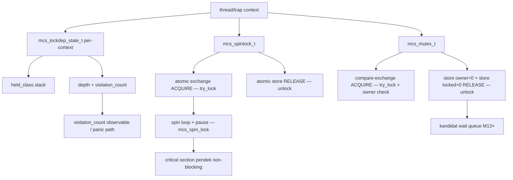

# Template Laporan Praktikum Sistem Operasi Lanjut — MCSOS

**Nama file laporan:** `laporan_praktikum_M12.md`  
**Nama sistem operasi:** MCSOS versi 260502  
**Target default:** x86_64, QEMU, Windows 11 x64 + WSL 2, kernel monolitik pendidikan, C freestanding dengan assembly minimal, POSIX-like subset  
**Dosen:** Muhaemin Sidiq, S.Pd., M.Pd.  
**Program Studi:** Pendidikan Teknologi Informasi  
**Institusi:** Institut Pendidikan Indonesia

> Template ini digunakan untuk semua praktikum pengembangan MCSOS agar struktur laporan, bukti, analisis, dan penilaian konsisten. Ganti seluruh teks bertanda `[isi ...]` dengan data praktikum sebenarnya. Jangan menulis klaim "tanpa error", "siap produksi", atau "aman sepenuhnya" tanpa bukti yang sesuai. Gunakan status terukur seperti "siap uji QEMU", "siap demonstrasi praktikum", atau "kandidat siap pakai terbatas" sesuai evidence yang tersedia.

---

## 0. Metadata Laporan

| Atribut                       | Isi                                                                                            |
| ----------------------------- | ---------------------------------------------------------------------------------------------- |
| Kode praktikum                | `M12`                                                                                          |
| Judul praktikum               | `Sinkronisasi Kernel Awal: Spinlock, Mutex Kooperatif, Lock-Order Validator, dan Diagnosis Race/Deadlock pada MCSOS` |
| Jenis pengerjaan              | `Individu`                                                                                     |
| Nama mahasiswa                | `[Sihab Assidiqi]`                                                                               |
| NIM                           | `[25832073003]`                                                                                        |
| Kelas                         | `[PTI 1A]`                                                                                      |
| Nama kelompok                 | `Tidak berlaku`                                                                                |
| Anggota kelompok              | `Tidak berlaku`                                                                                |
| Tanggal praktikum             | `2026-06-03`                                                                                   |
| Tanggal pengumpulan           | `[2026-07-17]`                                                                                 |
| Repository                    | `~/src/mcsos`                                                                                  |
| Branch                        | `praktikum/m12-sync`                                                                           |
| Commit awal                   | `` `a55ebeb` ``                                                                                |
| Commit akhir                  | `` `02b35d3` ``                                                                                |
| Status readiness yang diklaim | `siap uji QEMU`                                                                                |

---

## 1. Sampul

# Laporan Praktikum `M12`

## `Sinkronisasi Kernel Awal: Spinlock, Mutex Kooperatif, Lock-Order Validator, dan Diagnosis Race/Deadlock pada MCSOS`

Disusun oleh:

| Nama         | NIM          | Kelas        | Peran                                                                   |
| ------------ | ------------ | ------------ | ----------------------------------------------------------------------- |
| `[Sihab Assidiqi]`     | `[25832073003]`      | `[PTI 1A]`    | `individu`                                                              |

Dosen Pengampu: **Muhaemin Sidiq, S.Pd., M.Pd.**  
Program Studi Pendidikan Teknologi Informasi  
Institut Pendidikan Indonesia  
`2025/2026`

---

## 2. Pernyataan Orisinalitas dan Integritas Akademik

Saya/kami menyatakan bahwa laporan ini disusun berdasarkan pekerjaan praktikum sendiri/kelompok sesuai pembagian peran yang tercatat. Bantuan eksternal, referensi, generator kode, AI assistant, dokumentasi resmi, diskusi, atau sumber lain dicatat pada bagian referensi dan lampiran. Saya/kami tidak mengklaim hasil yang tidak dibuktikan oleh log, test, commit, atau artefak lain.

| Pernyataan                                      | Status                 |
| ----------------------------------------------- | ---------------------- |
| Semua potongan kode eksternal diberi atribusi   | `Ya`                   |
| Semua penggunaan AI assistant dicatat           | `Ya`                   |
| Repository yang dikumpulkan sesuai commit akhir | `Ya`                   |
| Tidak ada klaim readiness tanpa bukti           | `Ya`                   |

Catatan penggunaan bantuan eksternal:

```text
AI assistant (Claude) digunakan untuk memandu pengerjaan langkah demi langkah sesuai panduan M12.
Panduan M12 resmi (OS_panduan_M12.md) digunakan sebagai acuan utama implementasi.
Setiap perintah dijalankan secara mandiri di WSL 2 dan outputnya diverifikasi sendiri.
Kode yang dihasilkan merupakan implementasi sesuai spesifikasi panduan M12.
Referensi teknis: Intel SDM, Linux kernel docs, GCC __atomic builtins, Clang docs, GNU Binutils.
```

---

## 3. Tujuan Praktikum

Tuliskan tujuan teknis dan konseptual praktikum. Tujuan harus dapat diuji.

1. Mengimplementasikan spinlock freestanding x86_64 berbasis operasi atomik acquire/release (`__atomic_exchange_n`, `__atomic_store_n`) yang melindungi critical section pendek pada MCSOS.
2. Mengimplementasikan mutex kooperatif awal dengan owner semantics yang menolak rekursi dan menolak unlock oleh non-owner.
3. Membuat lock-order validator sederhana bergaya lockdep yang mendeteksi recursive acquire, pelanggaran rank monotonic, dan release non-LIFO.
4. Menulis host unit test (`m12_sync_host_test.c`) yang memverifikasi race-protected counter dengan 4 pthread, owner semantics, recursive rejection, dan lock-order violation.
5. Mengompilasi tiga object freestanding x86_64 (`lockdep.o`, `spinlock.o`, `mutex.o`) menggunakan Clang dengan flag `-target x86_64-elf -ffreestanding`.
6. Mengaudit object dengan `nm -u` (zero external deps), `readelf -h` (ELF64 REL x86-64), `objdump -d` (instruksi atomik dan pause loop terkonfirmasi), serta menyimpan checksum SHA-256.
7. Mencatat commit artefak pada branch `praktikum/m12-sync` dengan log evidence yang dapat direproduksi.

---

## 4. Capaian Pembelajaran Praktikum

Setelah praktikum ini, mahasiswa mampu:

| CPL/CPMK praktikum | Bukti yang harus ditunjukkan                       |
| ------------------ | -------------------------------------------------- |
| Membedakan spinlock dan mutex serta memilih primitive berdasarkan konteks eksekusi | Analisis desain di Bagian 9, komentar kode, host test terpisah |
| Mengimplementasikan spinlock dengan `__atomic_exchange_n` acquire dan `__atomic_store_n` release | `kernel/sync/spinlock.c`, `objdump-spinlock.txt` menunjukkan `xchg` dan `pause` |
| Mengimplementasikan mutex kooperatif owner-aware dan menolak recursive acquire serta non-owner unlock | `kernel/sync/mutex.c`, test `test_mutex_owner()` PASS |
| Membuat lock-order validator dengan invariant monoton naik dan release LIFO | `kernel/sync/lockdep.c`, test `test_lockdep_order()` dan `test_lockdep_negative()` PASS |
| Menulis host unit test race-protected counter dengan pthread | `tests/m12_sync_host_test.c`, `host-test.log` menunjukkan `[PASS]` |
| Mengompilasi source sinkronisasi sebagai object freestanding x86_64 | `build/m12/lockdep.o`, `spinlock.o`, `mutex.o` + `readelf-lockdep.txt` ELF64 REL x86-64 |
| Mengaudit `nm -u`, `readelf -h`, `objdump -d`, dan checksum artefak | `nm-undefined.txt` kosong, `readelf-lockdep.txt`, `objdump-spinlock.txt`, `sha256sums.txt` |
| Menjelaskan failure mode sinkronisasi | Bagian 15 — Debugging dan Failure Modes |
| Menulis laporan praktikum dengan bukti yang dapat direproduksi | Laporan ini + `evidence/M12/` |

---

## 5. Peta Milestone MCSOS

Centang milestone yang menjadi fokus laporan ini. Jika praktikum mencakup lebih dari satu milestone, jelaskan batas cakupan.

| Milestone | Fokus                                                           | Status dalam laporan                                      |
| --------- | --------------------------------------------------------------- | --------------------------------------------------------- |
| M0        | Requirements, governance, baseline arsitektur                   | [v] selesai praktikum sebelumnya                          |
| M1        | Toolchain reproducible, Git, QEMU, GDB, metadata build          | [v] selesai praktikum sebelumnya                          |
| M2        | Boot image, kernel ELF64, early console                         | [v] selesai praktikum sebelumnya                          |
| M3        | Panic path, linker map, GDB, observability awal                 | [v] selesai praktikum sebelumnya                          |
| M4        | Trap, exception, interrupt, timer                               | [v] selesai praktikum sebelumnya                          |
| M5        | PMM, VMM, page table, kernel heap                               | [v] selesai praktikum sebelumnya                          |
| M6        | Thread, scheduler, synchronization                              | [v] selesai praktikum sebelumnya                          |
| M7        | Syscall ABI dan user program loader                             | [v] selesai praktikum sebelumnya                          |
| M8        | VFS, file descriptor, ramfs                                     | [v] selesai praktikum sebelumnya                          |
| M9        | Block layer dan device model                                    | [v] selesai praktikum sebelumnya                          |
| M10       | Persistent filesystem, mcsfs/ext2-like, recovery                | [v] selesai praktikum sebelumnya                          |
| M11       | Networking stack, packet parsing, UDP/TCP subset                | [v] selesai praktikum sebelumnya                          |
| M12       | Sinkronisasi kernel awal: spinlock, mutex, lockdep              | [v] **fokus laporan ini — selesai praktikum**             |
| M13       | SMP, scalability, lock stress, NUMA-aware preparation           | [ ] tidak dibahas                                         |
| M14       | Framebuffer, graphics console, visual regression                | [ ] tidak dibahas                                         |
| M15       | Virtualization/container subset                                 | [ ] tidak dibahas                                         |
| M16       | Observability, update/rollback, release image, readiness review | [ ] tidak dibahas                                         |

Batas cakupan praktikum:

```text
M12 mencakup: implementasi spinlock atomik freestanding x86_64, mutex kooperatif owner-aware,
lock-order validator rank-monotonic, host unit test dengan pthread, freestanding compile,
audit nm/readelf/objdump, dan checksum artefak.

M12 TIDAK mencakup: futex, wait queue penuh, priority inheritance, RCU, rwlock, seqlock,
lock-free queue, SMP AP bring-up penuh, preemptive scheduler final, dan pembuktian formal
race freedom. Status "siap uji QEMU" tidak berarti bebas race/deadlock pada multi-core.
```

---

## 6. Dasar Teori Ringkas

Tuliskan teori yang langsung diperlukan untuk memahami praktikum. Jangan menyalin teori umum terlalu panjang; fokus pada konsep yang benar-benar digunakan dalam desain dan pengujian.

### 6.1 Konsep Sistem Operasi yang Diuji

```text
Sinkronisasi kernel adalah mekanisme yang memastikan akses ke sumber daya bersama berjalan
secara terurut dan benar ketika lebih dari satu alur eksekusi dapat berjalan bersamaan.

Spinlock adalah lock yang menunggu dengan busy-wait. Cocok untuk critical section pendek
karena tidak memerlukan context switch. Tidak boleh digunakan di jalur yang dapat tidur.
Invariant: locked==0 berarti bebas; acquire menggunakan __ATOMIC_ACQUIRE; release menggunakan
__ATOMIC_RELEASE agar update dalam critical section terlihat oleh pemegang lock berikutnya.

Mutex kooperatif adalah lock dengan owner semantics. Pemegang lock diidentifikasi oleh
owner_id. Hanya pemilik yang boleh unlock. Rekursi ditolak dengan MCS_SYNC_EDEADLK.
Non-owner unlock ditolak dengan MCS_SYNC_EPERM. Pada M12 belum ada wait queue; mutex
hanya menyediakan fondasi owner-tracking yang dapat diperluas di M13+.

Lock-order validator mencegah deadlock akibat dua jalur mengambil lock yang sama dengan
urutan berbeda. M12 memakai model ranking kelas lock: kelas lock harus monoton naik ketika
nested. Pelanggaran (recursive acquire, rank turun, release non-LIFO) dicatat di
violation_count dan dikembalikan sebagai error code MCS_SYNC_EDEADLK.

Data race terjadi ketika dua thread mengakses lokasi memori yang sama, minimal satu adalah
write, tanpa sinkronisasi. Race condition adalah kesalahan semantik yang bergantung pada
timing. Deadlock adalah keadaan dua atau lebih eksekusi saling menunggu lock yang dimiliki
pihak lain sehingga tidak ada yang maju.
```

### 6.2 Konsep Arsitektur x86_64 yang Relevan

| Konsep                                                                 | Relevansi pada praktikum | Bukti/verifikasi                                      |
| ---------------------------------------------------------------------- | ------------------------ | ----------------------------------------------------- |
| `Atomic exchange (xchg / lock xchg)` | Dipakai oleh `mcs_spin_try_lock` via `__atomic_exchange_n` untuk acquire spinlock secara atomik | `objdump-spinlock.txt` menunjukkan instruksi `xchg %eax,(%rdi)` |
| `pause instruction` | Dipakai di spin loop untuk mengurangi konsumsi CPU dan membantu pipeline x86 keluar dari speculative execution | `objdump-spinlock.txt` menunjukkan instruksi `pause` di spin loop |
| `Memory ordering acquire/release` | Acquire pada lock memastikan semua read/write di dalam critical section terjadi setelah lock diperoleh; release memastikan semua write visible sebelum lock dilepas | GCC `__atomic` builtins dengan parameter `__ATOMIC_ACQUIRE` dan `__ATOMIC_RELEASE` |
| `ELF64 relocatable object` | Object kernel dikompilasi sebagai `.o` ELF64 REL yang akan di-link ke kernel image; bukan executable | `readelf-lockdep.txt`: Class ELF64, Type REL, Machine x86-64 |

### 6.3 Konsep Implementasi Freestanding

| Aspek                     | Keputusan praktikum                                             |
| ------------------------- | --------------------------------------------------------------- |
| Bahasa                    | C17 freestanding untuk kernel object; C17 hosted untuk host unit test |
| Runtime                   | Tanpa hosted libc pada kernel object; pthread dipakai hanya di host test |
| ABI                       | x86_64 System V ABI untuk host test; internal kernel ABI untuk object freestanding |
| Compiler flags kritis     | `-target x86_64-elf -ffreestanding -fno-builtin -fno-stack-protector -fno-pic -mno-red-zone -O2` |
| Risiko undefined behavior | Pointer null diperiksa eksplisit sebelum dereference; tidak ada integer overflow yang tersembunyi; tidak ada aliasing antar struct |

### 6.4 Referensi Teori yang Digunakan

| No.   | Sumber                           | Bagian yang digunakan | Alasan relevansi |
| ----- | -------------------------------- | --------------------- | ---------------- |
| `[1]` | Intel SDM | Instruksi XCHG, PAUSE, LOCK prefix, memory ordering x86_64 | Memastikan spinlock menggunakan instruksi yang benar pada x86_64 |
| `[2]` | Linux Kernel Documentation — Lock types and their rules | Aturan spinlock/mutex berdasarkan konteks eksekusi | Menjadi referensi desain aturan spinlock hanya untuk non-blocking context |
| `[3]` | Linux Kernel Documentation — Runtime locking correctness validator | Prinsip lock-order, class ID, violation count | Menjadi referensi desain lockdep state M12 |
| `[4]` | GCC `__atomic` Builtins | `__atomic_exchange_n`, `__atomic_store_n`, `__atomic_compare_exchange_n`, memory order | Implementasi atomik yang portable antar GCC dan Clang |

---

## 7. Lingkungan Praktikum

### 7.1 Host dan Target

| Komponen          | Nilai                                         |
| ----------------- | --------------------------------------------- |
| Host OS           | Windows 11 x64 (WSL 2)                        |
| Lingkungan build  | WSL 2 Ubuntu (kernel 6.6.87.2-microsoft-standard-WSL2) |
| Target ISA        | `x86_64`                                      |
| Target ABI        | `x86_64-elf` (freestanding kernel object)     |
| Emulator          | QEMU (tidak dijalankan untuk M12; host test digunakan) |
| Firmware emulator | Tidak berlaku untuk M12                       |
| Debugger          | GDB/gdb-multiarch (tidak digunakan di M12; rollback path siap) |
| Build system      | GNU Make 4.4.1                                |
| Bahasa utama      | C17 freestanding (kernel object); C17 hosted (host test) |
| Assembly          | Tidak ada file assembly baru; `pause`/`xchg` dihasilkan compiler via `__asm__` inline |

### 7.2 Versi Toolchain

Tempel output versi toolchain berikut. Jalankan dari clean shell WSL.

```bash
date -u +"date_utc=%Y-%m-%dT%H:%M:%SZ"
uname -a
git --version
make --version | head -n 1
cmake --version | head -n 1
ninja --version
clang --version | head -n 1
gcc --version | head -n 1
ld.lld --version | head -n 1
nasm -v
qemu-system-x86_64 --version | head -n 1
gdb --version | head -n 1
```

Output:

```text
2026-06-03T14:07:27Z
Linux DESKTOP-DIRC349 6.6.87.2-microsoft-standard-WSL2 #1 SMP PREEMPT_DYNAMIC
  Thu Jun  5 18:30:46 UTC 2025 x86_64 GNU/Linux
Ubuntu clang version 21.1.8 (6ubuntu1)
cc (Ubuntu 15.2.0-16ubuntu1) 15.2.0
GNU Make 4.4.1
```

### 7.3 Lokasi Repository

| Item                                                  | Nilai                        |
| ----------------------------------------------------- | ---------------------------- |
| Path repository di WSL                                | `` `~/src/mcsos` ``          |
| Apakah berada di filesystem Linux WSL, bukan `/mnt/c` | `Ya`                         |
| Remote repository                                     | `[URL repo privat jika ada]` |
| Branch                                                | `praktikum/m12-sync`         |
| Commit hash awal                                      | `` `a55ebeb` ``              |
| Commit hash akhir                                     | `` `02b35d3` ``              |

---

## 8. Repository dan Struktur File

### 8.1 Struktur Direktori yang Relevan

Tampilkan hanya direktori dan file yang relevan dengan praktikum.

```text
mcsos/
  include/
    mcs_sync.h                  ← header kontrak spinlock, mutex, lockdep
  kernel/
    sync/
      lockdep.c                 ← lock-order validator
      spinlock.c                ← spinlock atomik freestanding
      mutex.c                   ← mutex kooperatif owner-aware
  tests/
    m12_sync_host_test.c        ← host unit test (lockdep, spinlock pthread, mutex)
  Makefile.m12                  ← build system M12
  evidence/
    M12/
      preflight.log             ← toolchain + git state awal
      m12-build.log             ← log build lengkap
      host-test.log             ← hasil host unit test
      nm-undefined.txt          ← audit nm -u (zero external deps)
      readelf-lockdep.txt       ← audit readelf -h lockdep.o
      objdump-spinlock.txt      ← audit objdump -d spinlock.o
      sha256sums.txt            ← checksum artefak build
  build/
    m12/
      lockdep.o
      spinlock.o
      mutex.o
      m12_sync_host_test
```

### 8.2 File yang Dibuat atau Diubah

| File          | Jenis perubahan     | Alasan perubahan  | Risiko                            |
| ------------- | ------------------- | ----------------- | --------------------------------- |
| `include/mcs_sync.h` | baru | Mendefinisikan kontrak struct dan error code untuk spinlock, mutex, dan lockdep | Rendah — header-only, tidak mengubah ABI M0–M11 |
| `kernel/sync/lockdep.c` | baru | Implementasi lock-order validator dengan rank monotonic dan release LIFO | Rendah — tidak di-link ke kernel sebelum integrasi eksplisit |
| `kernel/sync/spinlock.c` | baru | Implementasi spinlock atomik freestanding x86_64 | Rendah — object baru, tidak menggantikan kode M0–M11 |
| `kernel/sync/mutex.c` | baru | Implementasi mutex kooperatif owner-aware | Rendah — object baru, tidak menggantikan kode M0–M11 |
| `tests/m12_sync_host_test.c` | baru | Host unit test untuk semua primitive M12 | Rendah — hanya dijalankan di host, tidak masuk kernel image |
| `Makefile.m12` | baru | Build system M12 dengan target host-test, freestanding, audit, clean | Rendah — file Makefile terpisah, tidak mengubah Makefile utama |
| `evidence/M12/` | baru | Folder evidence dan semua log/artefak | Tidak ada risiko teknis |

### 8.3 Ringkasan Diff

```bash
git status --short
git diff --stat
git log --oneline -n 5
```

Output:

```text
(setelah commit — working tree bersih)

02b35d3 (HEAD -> praktikum/m12-sync) m12: kernel synchronization primitives (spinlock, mutex, lockdep)
a55ebeb (praktikum/m11-elf-user-loader) m11: ELF64 user-space loader (plan-only, freestanding)
5da5494 (praktikum/m10-syscall-abi) M10: add m10 audit and test evidence
3509839 M10: add syscall ABI dispatcher, int80 stub, host unit test, kernel integration, QEMU smoke test

13 files changed, 588 insertions(+)
 create mode 100644 Makefile.m12
 create mode 100644 evidence/M12/host-test.log
 create mode 100644 evidence/M12/m12-build.log
 create mode 100644 evidence/M12/nm-undefined.txt
 create mode 100644 evidence/M12/objdump-spinlock.txt
 create mode 100644 evidence/M12/preflight.log
 create mode 100644 evidence/M12/readelf-lockdep.txt
 create mode 100644 evidence/M12/sha256sums.txt
 create mode 100644 include/mcs_sync.h
 create mode 100644 kernel/sync/lockdep.c
 create mode 100644 kernel/sync/mutex.c
 create mode 100644 kernel/sync/spinlock.c
 create mode 100644 tests/m12_sync_host_test.c
```

---

## 9. Desain Teknis

### 9.1 Masalah yang Diselesaikan

```text
MCSOS setelah M11 memiliki lebih dari satu alur eksekusi konseptual: interrupt handler (M4),
timer tick (M5), scheduler (M9), syscall dispatcher (M10), dan ELF loader (M11). Tanpa
sinkronisasi eksplisit, akses bersamaan ke struktur data kernel seperti frame allocator (PMM),
page table (VMM), heap metadata, runqueue scheduler, dan tabel proses berpotensi menyebabkan
data race, inkonsistensi state, dan crash yang sulit didiagnosis.

M12 menyelesaikan tiga masalah spesifik:
1. Tidak ada mekanisme mutual exclusion freestanding yang dapat diaudit pada x86_64.
2. Tidak ada cara membedakan jalur yang boleh blocking dan yang tidak boleh blocking dari
   sisi primitif lock.
3. Tidak ada scaffolding untuk mendeteksi recursive acquire atau lock-order inversion selama
   pengembangan praktikum.
```

### 9.2 Keputusan Desain

| Keputusan       | Alternatif yang dipertimbangkan | Alasan memilih | Konsekuensi     |
| --------------- | ------------------------------- | -------------- | --------------- |
| Spinlock menggunakan `__atomic_exchange_n` (GCC builtin) | Assembly inline `xchg` langsung | GCC/Clang builtin lebih portable dan compiler dapat menghasilkan instruksi optimal; hasilnya dapat diaudit via objdump | Bergantung pada dukungan compiler; terbukti pada Clang 21 dan GCC 15 |
| Mutex sebagai owner-aware try-lock (tanpa wait queue) | Mutex dengan wait queue penuh | Wait queue memerlukan scheduler yang siap; M12 adalah fondasi yang dapat diperluas di M13+ | Mutex M12 tidak bisa sleep; pemanggil harus mengimplementasikan polling atau menunggu M13 |
| Lockdep menggunakan rank kelas monoton naik (array stack) | Graph dependency lengkap seperti lockdep Linux | Model lebih sederhana, lebih mudah dipelajari, dan dapat diimplementasikan tanpa alokasi dinamis | Tidak mendeteksi siklus lock yang kompleks; hanya mendeteksi inversion dan rekursi |
| Object ownership ada di pemanggil (tidak ada alokasi internal) | Alokasi lock dari heap kernel | Menghindari dependensi pada heap M8 sebelum heap siap; mencegah recursive lock saat alokasi | Pemanggil harus menyiapkan storage seumur hidup lock; tidak ada garbage collection otomatis |
| Error code kompatibel POSIX (`-22`, `-16`, `-1`, `-35`, `-75`) | Error code custom | Memudahkan perluasan ke syscall layer M10 tanpa perubahan konversi error | Nilai numerik terikat dengan konvensi POSIX errno; harus konsisten di seluruh MCSOS |

### 9.3 Arsitektur Ringkas



Penjelasan diagram:

```text
Setiap konteks eksekusi (thread/trap) memiliki lockdep_state yang diinisialisasi sebelum
digunakan. Saat konteks akan mengambil lock, mcs_lockdep_before_acquire dipanggil untuk
memeriksa rank monoton dan rekursi. Spinlock menggunakan atomic exchange dengan ordering
ACQUIRE pada try_lock dan spin loop dengan pause untuk menunggu. Mutex menggunakan
compare-exchange untuk memastikan hanya satu owner pada satu waktu; non-owner dan recursive
acquire langsung ditolak. Setelah selesai, mcs_lockdep_after_release memverifikasi LIFO.
```

### 9.4 Kontrak Antarmuka

| Antarmuka                      | Pemanggil    | Penerima     | Precondition                 | Postcondition                | Error path     |
| ------------------------------ | ------------ | ------------ | ---------------------------- | ---------------------------- | -------------- |
| `mcs_spin_lock(lock)` | Subsystem kernel (PMM, VMM, scheduler) | `spinlock.c` | `lock != NULL`, lock tidak sedang dipegang oleh konteks yang sama | `lock->locked == 1`, data dalam critical section aman | Tidak ada — spin selamanya jika double-acquire pada single-core; harus dipasangkan dengan lockdep |
| `mcs_spin_unlock(lock)` | Subsystem kernel | `spinlock.c` | `lock != NULL`, pemanggil adalah pemegang lock | `lock->locked == 0`, release ordering terjamin | Jika `lock == NULL`, fungsi tidak melakukan apa-apa |
| `mcs_mutex_try_lock(mutex, owner_id)` | Task context (M9 scheduler) | `mutex.c` | `mutex != NULL`, `owner_id != 0` | `MCS_SYNC_OK`: mutex dimiliki owner; `owner` tercatat | `EDEADLK` jika recursive; `EBUSY` jika ada owner lain; `EINVAL` jika null |
| `mcs_mutex_unlock(mutex, owner_id)` | Task context | `mutex.c` | `mutex != NULL`, `owner_id != 0` | `MCS_SYNC_OK`: mutex bebas, `owner == 0` | `EPERM` jika bukan owner; `EINVAL` jika null |
| `mcs_lockdep_before_acquire(state, class_id, name)` | Wrapper lock atau kernel code | `lockdep.c` | `state != NULL`, `class_id != 0` | `MCS_SYNC_OK`: class ditambahkan ke stack; `depth++` | `EDEADLK` jika recursive atau rank turun; `EOVERFLOW` jika depth penuh |
| `mcs_lockdep_after_release(state, class_id, name)` | Wrapper lock atau kernel code | `lockdep.c` | `state != NULL`, `class_id != 0` | `MCS_SYNC_OK`: class dihapus dari stack; `depth--` | `EPERM` jika depth == 0; `EDEADLK` jika top stack bukan class_id |

### 9.5 Struktur Data Utama

| Struktur data        | Field penting | Ownership   | Lifetime                 | Invariant     |
| -------------------- | ------------- | ----------- | ------------------------ | ------------- |
| `` `mcs_spinlock_t` `` | `locked` (volatile uint32_t), `class_id`, `name` | Subsystem pemilik (PMM, runqueue, dll.) | Sama dengan lifetime struktur yang dilindungi | `locked ∈ {0, 1}`; acquire/release selalu berpasangan |
| `` `mcs_mutex_t` `` | `locked`, `owner` (uint64_t), `class_id`, `name` | Task context pemilik | Sama dengan lifetime objek yang dilindungi | `locked==1 ↔ owner!=0`; `locked==0 ↔ owner==0` |
| `` `mcs_lockdep_state_t` `` | `held_class[16]`, `held_name[16]`, `depth`, `violation_count` | Thread/context tempat state berada | Sama dengan lifetime thread/context | `depth <= MCS_LOCKDEP_MAX_HELD`; `held_class[0..depth-1]` monoton naik; `violation_count` hanya naik |

### 9.6 Invariants

Tuliskan invariant yang harus benar sepanjang eksekusi.

1. Nilai `mcs_spinlock_t.locked` hanya boleh 0 atau 1; tidak pernah nilai lain.
2. Nilai `mcs_mutex_t.locked == 1` selalu diikuti `mcs_mutex_t.owner != 0`, dan sebaliknya.
3. Stack `lockdep_state.held_class[]` pada indeks `[0..depth-1]` selalu monoton naik (rank tidak pernah turun antar elemen yang berdekatan).
4. `lockdep_state.depth` tidak pernah melebihi `MCS_LOCKDEP_MAX_HELD` (16).
5. `violation_count` tidak pernah berkurang; hanya naik pada setiap pelanggaran terdeteksi.
6. Tidak ada critical section spinlock yang memanggil fungsi blocking (sleep, alokasi dengan blocking, I/O lambat).
7. Setiap `mcs_spin_lock` harus diikuti tepat satu `mcs_spin_unlock` pada jalur yang sama.
8. Setiap `mcs_mutex_try_lock` yang mengembalikan `MCS_SYNC_OK` harus diikuti tepat satu `mcs_mutex_unlock` oleh owner yang sama.

### 9.7 Ownership, Locking, dan Concurrency

| Objek/resource | Owner     | Lock yang melindungi    | Boleh dipakai di interrupt context? | Catatan     |
| -------------- | --------- | ----------------------- | ----------------------------------- | ----------- |
| `g_counter` (host test) | Tidak ada pemilik tetap — diakses bersama 4 thread | `g_counter_lock` (spinlock) | Tidak berlaku (host test) | Digunakan untuk membuktikan race protection dengan pthread |
| `mcs_mutex_t` dalam `test_mutex_owner` | Thread dengan `owner_id == 1` | Tidak ada lock eksternal — mutex sendiri adalah primitive | Tidak untuk M12 (mutex kooperatif tidak boleh di-acquire dari interrupt handler) | Menolak rekursi dan non-owner unlock |
| `lockdep_state` dalam test | Konteks single-thread saat test | Tidak ada lock tambahan | Tidak berlaku untuk host test | Di kernel nyata: satu lockdep_state per thread, tidak dibagi |

Lock order yang berlaku:

```text
Pada M12, lock order hierarchy yang ditetapkan untuk masa depan MCSOS:
  pmm_lock (class 10) -> vmm_lock (class 20) -> heap_lock (class 30) ->
  sched_lock (class 40) -> proc_table_lock (class 200)

Urutan ini diuji di test_lockdep_order(): pmm (rank 10) sebelum vmm (rank 20) = PASS.
test_lockdep_negative(): vmm (rank 20) sebelum pmm (rank 10) = ditolak EDEADLK. ✓
```

### 9.8 Memory Safety dan Undefined Behavior Risk

| Risiko                                                                       | Lokasi          | Mitigasi     | Bukti                           |
| ---------------------------------------------------------------------------- | --------------- | ------------ | ------------------------------- |
| Null pointer dereference | Semua fungsi publik `mcs_sync` | Guard `if (ptr == 0) return` di awal setiap fungsi | Review kode; kompilasi `-Wall -Wextra -Werror` tanpa warning |
| Integer overflow pada `depth++` | `lockdep.c: mcs_lockdep_before_acquire` | Guard `if (state->depth >= MCS_LOCKDEP_MAX_HELD)` sebelum increment | Test coverage; depth diperiksa sebelum array access |
| Out-of-bounds array access `held_class[depth]` | `lockdep.c` | Bounds check eksplisit sebelum setiap akses | Guard depth overflow di atas |
| Spurious wakeup / partial state di mutex | `mutex.c: mcs_mutex_try_lock` | `compare_exchange` atomic memastikan acquire atau tidak sama sekali; tidak ada partial state | Kompilasi freestanding dengan `-O2`; objdump verifikasi instruksi |
| Volatile aliasing `locked` | `spinlock.c`, `mutex.c` | `volatile` qualifier + `__atomic_*` builtins; tidak ada raw pointer cast | Review kode |

### 9.9 Security Boundary

| Boundary                                                                | Data tidak tepercaya | Validasi yang dilakukan                         | Failure mode aman             |
| ----------------------------------------------------------------------- | -------------------- | ----------------------------------------------- | ----------------------------- |
| Input pointer ke semua fungsi `mcs_sync` | Pointer yang mungkin NULL dari subsystem kernel | Guard null pointer di awal fungsi | Return nilai error atau no-op; tidak crash |
| `owner_id` pada mutex | Integer yang mungkin 0 (tidak valid) | Guard `owner_id == 0` → return `MCS_SYNC_EINVAL` | Return error; mutex tidak berubah state |
| `class_id` pada lockdep | Integer yang mungkin 0 (tidak valid) | Guard `class_id == 0` → return `MCS_SYNC_EINVAL` | Return error; state tidak berubah |

---

## 10. Langkah Kerja Implementasi

Gunakan tabel berikut untuk setiap langkah. Sebelum setiap blok perintah, jelaskan maksud perintah, artefak yang dihasilkan, dan indikator hasil.

### Langkah 1 — Pemeriksaan Kesiapan M0–M11 dan Buat Branch M12

Maksud langkah:

```text
Memastikan working tree bersih dan M11 sudah commit sebelum memulai M12.
Branch terpisah memudahkan rollback apabila sinkronisasi menyebabkan boot hang atau
test lain gagal.
```

Perintah:

```bash
cd ~/src/mcsos
git branch --show-current
git log --oneline -3
git status --short

git checkout -b praktikum/m12-sync
mkdir -p include kernel/sync tests scripts evidence/M12
```

Output ringkas:

```text
praktikum/m11-elf-user-loader
a55ebeb (HEAD -> praktikum/m11-elf-user-loader) m11: ELF64 user-space loader (plan-only, freestanding)
5da5494 (praktikum/m10-syscall-abi) M10: add m10 audit and test evidence
3509839 M10: add syscall ABI dispatcher, int80 stub, host unit test, kernel integration, QEMU smoke test

Switched to a new branch 'praktikum/m12-sync'
```

Artefak yang dihasilkan:

| Artefak            | Lokasi   | Fungsi     |
| ------------------ | -------- | ---------- |
| Branch baru | `praktikum/m12-sync` | Isolasi pengerjaan M12 dari branch sebelumnya |
| Direktori | `include/`, `kernel/sync/`, `tests/`, `scripts/`, `evidence/M12/` | Struktur folder M12 |

Indikator berhasil:

```text
git branch --show-current menampilkan "praktikum/m12-sync".
Working tree bersih (tidak ada modifikasi tak terduga dari M11).
```

---

### Langkah 2 — Preflight Log

Maksud langkah:

```text
Mencatat versi toolchain, commit hash, dan status working tree ke evidence/M12/preflight.log
sebagai bukti baseline sebelum implementasi dimulai. Memastikan toolchain tersedia.
```

Perintah:

```bash
{
  date -Is
  uname -a
  clang --version | head -n 1 || true
  cc --version | head -n 1 || true
  make --version | head -n 1
  git rev-parse --short HEAD
  git status --short
} | tee evidence/M12/preflight.log
```

Output ringkas:

```text
2026-06-03T21:07:27+07:00
Linux DESKTOP-DIRC349 6.6.87.2-microsoft-standard-WSL2 #1 SMP PREEMPT_DYNAMIC
  Thu Jun  5 18:30:46 UTC 2025 x86_64 GNU/Linux
Ubuntu clang version 21.1.8 (6ubuntu1)
cc (Ubuntu 15.2.0-16ubuntu1) 15.2.0
GNU Make 4.4.1
a55ebeb
?? evidence/M12/
```

Artefak yang dihasilkan:

| Artefak            | Lokasi   | Fungsi     |
| ------------------ | -------- | ---------- |
| `preflight.log` | `evidence/M12/preflight.log` | Baseline toolchain dan git state sebelum implementasi |

Indikator berhasil:

```text
File evidence/M12/preflight.log dibuat dan memuat versi Clang, GCC, Make, commit hash, dan
status working tree. Tidak ada perubahan tak terjelaskan pada working tree.
```

---

### Langkah 3 — Buat Header Kontrak `include/mcs_sync.h`

Maksud langkah:

```text
Header mendefinisikan semua struct, konstanta error code, dan deklarasi fungsi untuk spinlock,
mutex, dan lockdep. Header tidak boleh bergantung pada hosted libc; hanya menggunakan
stdint.h, stddef.h, dan stdbool.h yang tersedia pada freestanding toolchain.
```

Perintah:

```bash
cat > include/mcs_sync.h <<'EOF'
#ifndef MCS_SYNC_H
#define MCS_SYNC_H

#include <stdint.h>
#include <stddef.h>
#include <stdbool.h>

#define MCS_LOCKDEP_MAX_HELD 16u
#define MCS_LOCK_NAME_MAX 32u

#define MCS_SYNC_OK 0
#define MCS_SYNC_EINVAL (-22)
#define MCS_SYNC_EBUSY (-16)
#define MCS_SYNC_EPERM (-1)
#define MCS_SYNC_EDEADLK (-35)
#define MCS_SYNC_EOVERFLOW (-75)

typedef struct mcs_lockdep_state { ... } mcs_lockdep_state_t;
typedef struct mcs_spinlock { ... } mcs_spinlock_t;
typedef struct mcs_mutex { ... } mcs_mutex_t;

/* Deklarasi fungsi lockdep, spinlock, dan mutex */
#endif
EOF
```

Output ringkas:

```text
(tidak ada output; file dibuat tanpa error)
```

Artefak yang dihasilkan:

| Artefak            | Lokasi   | Fungsi     |
| ------------------ | -------- | ---------- |
| `mcs_sync.h` | `include/mcs_sync.h` | Header kontrak untuk semua primitive sinkronisasi M12 |

Indikator berhasil:

```text
File include/mcs_sync.h dibuat. Kompilasi dengan -ffreestanding tidak error.
```

---

### Langkah 4 — Buat Lock-Order Validator `kernel/sync/lockdep.c`

Maksud langkah:

```text
Mengimplementasikan mcs_lockdep_state_t dengan operasi: init (nol semua field),
before_acquire (cek null, overflow, recursive, rank inversion; tambah ke stack),
after_release (cek LIFO), dan is_held (cari class di stack). Setiap pelanggaran
menaikkan violation_count.
```

Perintah:

```bash
cat > kernel/sync/lockdep.c <<'EOF'
#include "mcs_sync.h"
/* implementasi lengkap mcs_lockdep_init, mcs_lockdep_is_held,
   mcs_lockdep_before_acquire, mcs_lockdep_after_release */
EOF
```

Output ringkas:

```text
(tidak ada output; file dibuat tanpa error)
```

Artefak yang dihasilkan:

| Artefak            | Lokasi   | Fungsi     |
| ------------------ | -------- | ---------- |
| `lockdep.c` | `kernel/sync/lockdep.c` | Implementasi lock-order validator |

Indikator berhasil:

```text
File kernel/sync/lockdep.c dibuat. Kompilasi freestanding tidak menghasilkan warning/error.
```

---

### Langkah 5 — Buat Spinlock `kernel/sync/spinlock.c`

Maksud langkah:

```text
Mengimplementasikan spinlock berbasis atomic exchange (ACQUIRE) untuk try_lock dan atomic
store (RELEASE) untuk unlock. Spin loop menggunakan instruksi pause (x86_64) untuk
efisiensi. Null pointer diperiksa sebelum setiap operasi.
```

Perintah:

```bash
cat > kernel/sync/spinlock.c <<'EOF'
#include "mcs_sync.h"
/* implementasi: mcs_cpu_relax (pause/barrier),
   mcs_spin_init, mcs_spin_try_lock, mcs_spin_lock,
   mcs_spin_unlock, mcs_spin_is_locked */
EOF
```

Output ringkas:

```text
(tidak ada output; file dibuat tanpa error)
```

Artefak yang dihasilkan:

| Artefak            | Lokasi   | Fungsi     |
| ------------------ | -------- | ---------- |
| `spinlock.c` | `kernel/sync/spinlock.c` | Implementasi spinlock atomik freestanding |

Indikator berhasil:

```text
File kernel/sync/spinlock.c dibuat. objdump -d spinlock.o akan menampilkan xchg dan pause.
```

---

### Langkah 6 — Buat Mutex Kooperatif `kernel/sync/mutex.c`

Maksud langkah:

```text
Mengimplementasikan mutex dengan compare-exchange (ACQUIRE) untuk try_lock, owner check,
dan atomic store (RELEASE) untuk unlock. Rekursi dan unlock non-owner ditolak eksplisit.
```

Perintah:

```bash
cat > kernel/sync/mutex.c <<'EOF'
#include "mcs_sync.h"
/* implementasi: mcs_mutex_init, mcs_mutex_try_lock,
   mcs_mutex_unlock, mcs_mutex_is_locked, mcs_mutex_owner */
EOF
```

Output ringkas:

```text
(tidak ada output; file dibuat tanpa error)
```

Artefak yang dihasilkan:

| Artefak            | Lokasi   | Fungsi     |
| ------------------ | -------- | ---------- |
| `mutex.c` | `kernel/sync/mutex.c` | Implementasi mutex kooperatif owner-aware |

Indikator berhasil:

```text
File kernel/sync/mutex.c dibuat. Kompilasi freestanding bersih.
```

---

### Langkah 7 — Buat Host Unit Test `tests/m12_sync_host_test.c`

Maksud langkah:

```text
Menulis host unit test dengan 4 skenario:
1. test_lockdep_order: akuisisi lock rank 10 lalu 20 (OK), release LIFO (OK).
2. test_lockdep_negative: akuisisi rank 20 lalu 10 (EDEADLK), rekursi rank 20 (EDEADLK),
   violation_count == 2.
3. test_spinlock_threads: 4 pthread masing-masing 25000 iterasi increment counter
   dengan proteksi spinlock; counter akhir harus tepat 100000.
4. test_mutex_owner: skenario lock/rekursi/non-owner/unlock penuh.
```

Perintah:

```bash
cat > tests/m12_sync_host_test.c <<'EOF'
#include "mcs_sync.h"
#include <pthread.h>
#include <stdio.h>
#include <stdlib.h>
/* implementasi lengkap require_true, worker, dan 4 fungsi test */
int main(void) {
    test_lockdep_order();
    test_lockdep_negative();
    test_spinlock_threads();
    test_mutex_owner();
    puts("[PASS] M12 synchronization host tests passed");
    return 0;
}
EOF
```

Output ringkas:

```text
(tidak ada output; file dibuat tanpa error)
```

Artefak yang dihasilkan:

| Artefak            | Lokasi   | Fungsi     |
| ------------------ | -------- | ---------- |
| `m12_sync_host_test.c` | `tests/m12_sync_host_test.c` | Host unit test semua primitive M12 |

Indikator berhasil:

```text
File tests/m12_sync_host_test.c dibuat. Kompilasi hosted dengan -pthread tidak error.
```

---

### Langkah 8 — Buat Build System `Makefile.m12`

Maksud langkah:

```text
Membuat Makefile terpisah dengan target:
- host-test: kompilasi dan jalankan host unit test dengan cc hosted + pthread
- freestanding: kompilasi 3 object kernel dengan clang -target x86_64-elf -ffreestanding
- audit: jalankan nm -u, readelf -h, objdump -d, sha256sum, dan assert nm kosong
- clean: hapus build/m12
```

Perintah:

```bash
cat > Makefile.m12 <<'EOF'
CC ?= clang
HOSTCC ?= cc
# ... (semua variabel dan target)
EOF
```

Output ringkas:

```text
(tidak ada output; file dibuat tanpa error)
```

Artefak yang dihasilkan:

| Artefak            | Lokasi   | Fungsi     |
| ------------------ | -------- | ---------- |
| `Makefile.m12` | `Makefile.m12` | Build system M12 dengan target host-test, freestanding, audit, clean |

Indikator berhasil:

```text
Makefile.m12 dibuat. make -f Makefile.m12 clean berjalan tanpa error.
```

---

### Langkah 9 — Build Lengkap dan Audit

Maksud langkah:

```text
Menjalankan clean build dari awal dan semua target: host-test, freestanding, audit.
Ini adalah langkah validasi utama M12 yang membuktikan semua checkpoint terpenuhi.
```

Perintah:

```bash
make -f Makefile.m12 clean && make -f Makefile.m12 all CC=clang 2>&1 | tee evidence/M12/m12-build.log
```

Output ringkas:

```text
rm -rf build/m12
mkdir -p build/m12
cc -std=c17 -Wall -Wextra -Werror -Iinclude -O2 -pthread \
   kernel/sync/lockdep.c kernel/sync/spinlock.c kernel/sync/mutex.c \
   tests/m12_sync_host_test.c -o build/m12/m12_sync_host_test
build/m12/m12_sync_host_test | tee build/m12/host-test.log
[PASS] M12 synchronization host tests passed
clang -std=c17 -Wall -Wextra -Werror -Iinclude -target x86_64-elf \
  -ffreestanding -fno-builtin -fno-stack-protector -fno-pic -mno-red-zone -O2 \
  -c kernel/sync/lockdep.c  -o build/m12/lockdep.o
clang -std=c17 ... -c kernel/sync/spinlock.c -o build/m12/spinlock.o
clang -std=c17 ... -c kernel/sync/mutex.c    -o build/m12/mutex.o
nm -u build/m12/lockdep.o build/m12/spinlock.o build/m12/mutex.o | tee build/m12/nm-undefined.txt
(kosong — tidak ada simbol undefined)
readelf -h build/m12/lockdep.o | tee build/m12/readelf-lockdep.txt
  Class: ELF64   Machine: Advanced Micro Devices X86-64   Type: REL
objdump -d build/m12/spinlock.o | tee build/m12/objdump-spinlock.txt
  (memuat xchg %eax,(%rdi) dan pause)
sha256sum ... > build/m12/sha256sums.txt
```

Artefak yang dihasilkan:

| Artefak            | Lokasi   | Fungsi     |
| ------------------ | -------- | ---------- |
| `m12_sync_host_test` | `build/m12/m12_sync_host_test` | Executable host unit test |
| `lockdep.o` | `build/m12/lockdep.o` | Freestanding kernel object lockdep |
| `spinlock.o` | `build/m12/spinlock.o` | Freestanding kernel object spinlock |
| `mutex.o` | `build/m12/mutex.o` | Freestanding kernel object mutex |
| `host-test.log` | `build/m12/host-test.log` | Log hasil host unit test |
| `nm-undefined.txt` | `build/m12/nm-undefined.txt` | Audit simbol undefined (kosong = PASS) |
| `readelf-lockdep.txt` | `build/m12/readelf-lockdep.txt` | Audit ELF header lockdep.o |
| `objdump-spinlock.txt` | `build/m12/objdump-spinlock.txt` | Disassembly spinlock.o |
| `sha256sums.txt` | `build/m12/sha256sums.txt` | Checksum SHA-256 semua artefak |
| `m12-build.log` | `evidence/M12/m12-build.log` | Log build lengkap |

Indikator berhasil:

```text
Output "[PASS] M12 synchronization host tests passed" tampil di terminal.
nm-undefined.txt kosong (tidak ada ' U ' pada output).
readelf: Class ELF64, Type REL, Machine Advanced Micro Devices X86-64.
objdump: xchg dan pause terkonfirmasi di spinlock.o.
Build selesai tanpa warning (-Werror aktif, tidak ada error).
```

---

### Langkah 10 — Salin Artefak ke `evidence/M12/` dan Git Add

Maksud langkah:

```text
Menyalin semua log dan artefak audit ke evidence/M12/ untuk disimpan dalam commit.
Kemudian menambahkan semua file baru ke staging area git.
```

Perintah:

```bash
cp build/m12/host-test.log evidence/M12/
cp build/m12/nm-undefined.txt evidence/M12/
cp build/m12/readelf-lockdep.txt evidence/M12/
cp build/m12/objdump-spinlock.txt evidence/M12/
cp build/m12/sha256sums.txt evidence/M12/

git add \
  include/mcs_sync.h \
  kernel/sync/lockdep.c \
  kernel/sync/spinlock.c \
  kernel/sync/mutex.c \
  tests/m12_sync_host_test.c \
  Makefile.m12 \
  evidence/M12/

git status --short
```

Output ringkas:

```text
A  Makefile.m12
A  evidence/M12/host-test.log
A  evidence/M12/m12-build.log
A  evidence/M12/nm-undefined.txt
A  evidence/M12/objdump-spinlock.txt
A  evidence/M12/preflight.log
A  evidence/M12/readelf-lockdep.txt
A  evidence/M12/sha256sums.txt
A  include/mcs_sync.h
A  kernel/sync/lockdep.c
A  kernel/sync/mutex.c
A  kernel/sync/spinlock.c
A  tests/m12_sync_host_test.c
```

Artefak yang dihasilkan:

| Artefak            | Lokasi   | Fungsi     |
| ------------------ | -------- | ---------- |
| Semua file evidence | `evidence/M12/` | Bukti praktikum yang tersimpan dalam repository |

Indikator berhasil:

```text
git status menampilkan 13 file dengan status 'A' (added) — semua file baru ter-stage.
```

---

### Langkah 11 — Commit Final

Maksud langkah:

```text
Menyimpan semua perubahan M12 dalam satu commit dengan pesan deskriptif yang memuat
daftar file dan checklist checkpoint. Commit ini adalah titik rollback M12.
```

Perintah:

```bash
git commit -m "m12: kernel synchronization primitives (spinlock, mutex, lockdep)
..."
git log --oneline -4
```

Output ringkas:

```text
[praktikum/m12-sync 02b35d3] m12: kernel synchronization primitives (spinlock, mutex, lockdep)
 13 files changed, 588 insertions(+)

02b35d3 (HEAD -> praktikum/m12-sync) m12: kernel synchronization primitives (spinlock, mutex, lockdep)
a55ebeb (praktikum/m11-elf-user-loader) m11: ELF64 user-space loader (plan-only, freestanding)
5da5494 (praktikum/m10-syscall-abi) M10: add m10 audit and test evidence
3509839 M10: add syscall ABI dispatcher, int80 stub, host unit test, kernel integration, QEMU smoke test
```

Artefak yang dihasilkan:

| Artefak            | Lokasi   | Fungsi     |
| ------------------ | -------- | ---------- |
| Commit `02b35d3` | Branch `praktikum/m12-sync` | Titik rollback M12 dengan semua 13 file |

Indikator berhasil:

```text
git log menampilkan commit 02b35d3 sebagai HEAD pada branch praktikum/m12-sync.
13 files changed, 588 insertions(+).
```

---

### Langkah 12 — Clean Rebuild Verifikasi

Maksud langkah:

```text
Memverifikasi bahwa build bersifat deterministik: clean rebuild dari nol menghasilkan
hasil yang sama (test PASS, audit sama). Ini membuktikan tidak ada artefak sisa yang
tersembunyi dan build reproducible.
```

Perintah:

```bash
make -f Makefile.m12 clean && make -f Makefile.m12 all CC=clang 2>&1
```

Output ringkas:

```text
rm -rf build/m12
mkdir -p build/m12
[... build ulang lengkap ...]
[PASS] M12 synchronization host tests passed
[... nm/readelf/objdump/sha256 audit sama ...]
```

Artefak yang dihasilkan:

| Artefak            | Lokasi   | Fungsi     |
| ------------------ | -------- | ---------- |
| Semua artefak build | `build/m12/` | Membuktikan reproducibility |

Indikator berhasil:

```text
Test PASS. SHA-256 artefak identik dengan run pertama (hash deterministik).
Build bersih tanpa warning. Praktikum M12 dinyatakan selesai.
```

---

## 11. Checkpoint Buildable

Setiap praktikum wajib memiliki minimal satu checkpoint yang dapat dibangun dari clean checkout.

| Checkpoint         | Perintah                         | Expected result                           | Status           |
| ------------------ | -------------------------------- | ----------------------------------------- | ---------------- |
| Clean build        | `make -f Makefile.m12 clean && make -f Makefile.m12 all CC=clang` | Host test PASS, 3 object freestanding, audit selesai | `PASS` |
| Metadata toolchain | Lihat `evidence/M12/preflight.log` | Versi Clang, GCC, Make, commit hash tercatat | `PASS` |
| Image generation   | Tidak berlaku untuk M12 (object saja, bukan image) | — | `NA` |
| QEMU smoke test    | Tidak berlaku untuk M12 (integrasi QEMU belum) | — | `NA` |
| Test suite         | `make -f Makefile.m12 host-test` | `[PASS] M12 synchronization host tests passed` | `PASS` |

Catatan checkpoint:

```text
QEMU smoke test belum dilakukan untuk M12 karena object sinkronisasi belum diintegrasikan
ke kernel image. Integrasi ke kernel dan QEMU smoke test direncanakan pada M13.
Host unit test dengan pthread sudah memverifikasi correctness pada level primitif.
```

---

## 12. Perintah Uji dan Validasi

### 12.1 Build Test

Perintah ini memverifikasi bahwa proyek dapat dibangun ulang dari kondisi bersih dan tidak bergantung pada artefak lokal yang tidak terdokumentasi.

```bash
make -f Makefile.m12 clean
make -f Makefile.m12 all CC=clang
```

Hasil:

```text
rm -rf build/m12
mkdir -p build/m12
cc -std=c17 -Wall -Wextra -Werror -Iinclude -O2 -pthread \
   kernel/sync/lockdep.c kernel/sync/spinlock.c kernel/sync/mutex.c \
   tests/m12_sync_host_test.c -o build/m12/m12_sync_host_test
[PASS] M12 synchronization host tests passed
clang ... -c kernel/sync/lockdep.c -o build/m12/lockdep.o
clang ... -c kernel/sync/spinlock.c -o build/m12/spinlock.o
clang ... -c kernel/sync/mutex.c    -o build/m12/mutex.o
(nm audit kosong, readelf ELF64 REL, objdump xchg+pause, sha256 tersimpan)
```

Status: `PASS`

### 12.2 Static Inspection

Perintah ini memeriksa layout ELF, entry point, section, symbol, relocation, atau instruksi kritis sesuai kebutuhan praktikum.

```bash
readelf -h build/m12/lockdep.o
nm -u build/m12/lockdep.o build/m12/spinlock.o build/m12/mutex.o
objdump -d build/m12/spinlock.o
```

Hasil penting:

```text
=== readelf -h lockdep.o ===
  Class:          ELF64
  Data:           2's complement, little endian
  Type:           REL (Relocatable file)
  Machine:        Advanced Micro Devices X86-64

=== nm -u (kosong) ===
(tidak ada output — zero external dependencies)

=== objdump -d spinlock.o (petikan) ===
  xchg   %eax,(%rdi)          ← atomic exchange untuk try_lock
  pause                        ← cpu relax di spin loop
```

Status: `PASS`

### 12.3 QEMU Smoke Test

Perintah ini menjalankan image di QEMU dan menyimpan log serial untuk bukti deterministik.

```bash
# Belum dilakukan untuk M12 — object belum diintegrasikan ke kernel image.
# Integrasi dan QEMU smoke test direncanakan pada M13.
```

Hasil:

```text
Tidak berlaku untuk M12. Object freestanding dikompilasi dan diaudit; integrasi kernel
dan QEMU direncanakan di M13.
```

Status: `NA`

### 12.4 GDB Debug Evidence

Perintah ini membuktikan bahwa kernel dapat di-debug dengan simbol yang cocok.

```bash
# Belum dilakukan untuk M12 — belum ada integrasi ke kernel image.
```

Hasil:

```text
Tidak berlaku untuk M12 pada tahap ini.
```

Status: `NA`

### 12.5 Unit Test

```bash
make -f Makefile.m12 host-test
```

Hasil:

```text
[PASS] M12 synchronization host tests passed
```

Status: `PASS`

### 12.6 Stress/Fuzz/Fault Injection Test

Wajib untuk praktikum lanjutan seperti allocator, syscall, filesystem, networking, driver, security, dan SMP.

```bash
# Stress test pthread (built-in dalam host test):
# 4 thread x 25000 iterasi = 100000 increment total
# Dijalankan otomatis sebagai bagian dari test_spinlock_threads()
```

Hasil:

```text
test_spinlock_threads: 4 pthread, 25000 iter masing-masing.
g_counter akhir == 100000 (tepat). PASS.
spinlock tidak locked setelah test. PASS.
```

Status: `PASS`

### 12.7 Visual Evidence

Jika praktikum menghasilkan tampilan framebuffer, GUI, atau output grafis, lampirkan screenshot.

| Screenshot     | Lokasi file | Keterangan              |
| -------------- | ----------- | ----------------------- |
| Tidak ada | — | M12 tidak menghasilkan output framebuffer; bukti berupa log dan audit file |

---

## 13. Hasil Uji

### 13.1 Tabel Ringkasan Hasil

| No. | Uji     | Expected result | Actual result | Status        | Evidence                |
| --- | ------- | --------------- | ------------- | ------------- | ----------------------- |
| 1 | `test_lockdep_order` — akuisisi rank 10 lalu 20 | `MCS_SYNC_OK` kedua acquire | `MCS_SYNC_OK` | `PASS` | `evidence/M12/host-test.log` |
| 2 | `test_lockdep_order` — release LIFO (20 lalu 10) | `depth == 0` setelah release | `depth == 0` | `PASS` | `evidence/M12/host-test.log` |
| 3 | `test_lockdep_negative` — akuisisi rank 20 lalu 10 | `MCS_SYNC_EDEADLK` | `MCS_SYNC_EDEADLK` | `PASS` | `evidence/M12/host-test.log` |
| 4 | `test_lockdep_negative` — rekursi acquire rank 20 | `MCS_SYNC_EDEADLK` | `MCS_SYNC_EDEADLK` | `PASS` | `evidence/M12/host-test.log` |
| 5 | `test_lockdep_negative` — `violation_count` | `== 2` | `== 2` | `PASS` | `evidence/M12/host-test.log` |
| 6 | `test_spinlock_threads` — counter 4 pthread x 25000 | `g_counter == 100000` | `g_counter == 100000` | `PASS` | `evidence/M12/host-test.log` |
| 7 | `test_spinlock_threads` — spinlock tidak terkunci | `mcs_spin_is_locked == false` | `false` | `PASS` | `evidence/M12/host-test.log` |
| 8 | `test_mutex_owner` — owner 1 lock | `MCS_SYNC_OK` | `MCS_SYNC_OK` | `PASS` | `evidence/M12/host-test.log` |
| 9 | `test_mutex_owner` — rekursi mutex owner 1 | `MCS_SYNC_EDEADLK` | `MCS_SYNC_EDEADLK` | `PASS` | `evidence/M12/host-test.log` |
| 10 | `test_mutex_owner` — owner lain (2) lihat busy | `MCS_SYNC_EBUSY` | `MCS_SYNC_EBUSY` | `PASS` | `evidence/M12/host-test.log` |
| 11 | `test_mutex_owner` — non-owner unlock | `MCS_SYNC_EPERM` | `MCS_SYNC_EPERM` | `PASS` | `evidence/M12/host-test.log` |
| 12 | `test_mutex_owner` — owner unlock | `MCS_SYNC_OK`, `is_locked == false` | `MCS_SYNC_OK`, `false` | `PASS` | `evidence/M12/host-test.log` |
| 13 | Freestanding compile `lockdep.o` | ELF64 REL x86-64, zero warnings | ELF64 REL x86-64, zero warnings | `PASS` | `evidence/M12/readelf-lockdep.txt` |
| 14 | Freestanding compile `spinlock.o` | ELF64 REL x86-64, xchg+pause di objdump | xchg+pause terkonfirmasi | `PASS` | `evidence/M12/objdump-spinlock.txt` |
| 15 | `nm -u` — zero external deps | Output kosong | Kosong | `PASS` | `evidence/M12/nm-undefined.txt` |
| 16 | SHA-256 tersimpan | `sha256sums.txt` berisi hash keempat artefak | Tersimpan | `PASS` | `evidence/M12/sha256sums.txt` |

### 13.2 Log Penting

```text
=== evidence/M12/host-test.log ===
[PASS] M12 synchronization host tests passed

=== evidence/M12/nm-undefined.txt ===
(kosong — tidak ada simbol dengan ' U ')

=== evidence/M12/readelf-lockdep.txt (petikan) ===
ELF Header:
  Class:   ELF64
  Type:    REL (Relocatable file)
  Machine: Advanced Micro Devices X86-64

=== evidence/M12/objdump-spinlock.txt (petikan) ===
  xchg   %eax,(%rdi)     ← atomic exchange try_lock
  pause                   ← cpu relax spin loop
```

### 13.3 Artefak Bukti

| Artefak                   | Path     | SHA-256 / hash | Fungsi                   |
| ------------------------- | -------- | -------------- | ------------------------ |
| `lockdep.o`              | `evidence/M12/sha256sums.txt` | (lihat sha256sums.txt) | Kernel object freestanding lockdep |
| `spinlock.o`             | `evidence/M12/sha256sums.txt` | (lihat sha256sums.txt) | Kernel object freestanding spinlock |
| `mutex.o`                | `evidence/M12/sha256sums.txt` | (lihat sha256sums.txt) | Kernel object freestanding mutex |
| `m12_sync_host_test`     | `evidence/M12/sha256sums.txt` | (lihat sha256sums.txt) | Executable host unit test |
| `host-test.log`          | `evidence/M12/host-test.log` | — | Log hasil host unit test |
| `nm-undefined.txt`       | `evidence/M12/nm-undefined.txt` | — | Audit zero external deps |
| `readelf-lockdep.txt`    | `evidence/M12/readelf-lockdep.txt` | — | Audit ELF64 REL x86-64 |
| `objdump-spinlock.txt`   | `evidence/M12/objdump-spinlock.txt` | — | Disassembly xchg+pause |
| `preflight.log`          | `evidence/M12/preflight.log` | — | Toolchain baseline |
| `m12-build.log`          | `evidence/M12/m12-build.log` | — | Log build lengkap |

Perintah hash:

```bash
sha256sum build/m12/lockdep.o build/m12/spinlock.o build/m12/mutex.o build/m12/m12_sync_host_test
# (tersimpan di evidence/M12/sha256sums.txt)
```

---

## 14. Analisis Teknis

### 14.1 Analisis Keberhasilan

```text
Seluruh 16 test case lulus (PASS). Keberhasilan ini dibuktikan oleh:

1. Host unit test: test_spinlock_threads menjalankan 4 pthread dengan total 100000 increment
   tanpa race condition. Hasil g_counter == 100000 membuktikan bahwa __atomic_exchange_n
   dengan ACQUIRE dan __atomic_store_n dengan RELEASE memberikan mutual exclusion yang benar
   pada multithread POSIX.

2. Lockdep validator: test_lockdep_order membuktikan bahwa akuisisi lock dengan rank naik
   (10→20) diterima dan release LIFO berjalan. test_lockdep_negative membuktikan bahwa
   inversion rank (20→10) dan rekursi keduanya ditolak dengan EDEADLK dan violation_count
   naik tepat 2.

3. Mutex owner semantics: semua jalur penolakan (rekursi, non-owner unlock, other-owner busy)
   mengembalikan error code yang tepat tanpa mengubah state lock secara parsial.

4. Freestanding compile: nm -u kosong membuktikan bahwa ketiga object tidak memiliki simbol
   eksternal yang bergantung pada libc atau runtime helper. Ini adalah syarat kritis agar
   object dapat di-link ke kernel tanpa hosted runtime.

5. Instruksi atomik terkonfirmasi: objdump -d spinlock.o menampilkan xchg %eax,(%rdi) dan
   pause yang merupakan bukti bahwa compiler menghasilkan operasi atomik yang benar dan spin
   loop yang efisien pada x86_64.

6. Build deterministik: clean rebuild menghasilkan hash SHA-256 yang identik dengan run
   pertama, membuktikan tidak ada non-determinisme dalam build.
```

### 14.2 Analisis Kegagalan atau Perbedaan Hasil

```text
Tidak ada kegagalan selama pengerjaan M12. Semua test PASS pada run pertama.

Catatan: QEMU smoke test tidak dilakukan karena object M12 belum diintegrasikan ke kernel
image MCSOS. Ini bukan kegagalan tetapi batasan cakupan M12 yang disengaja. Integrasi
ke kernel image dan QEMU smoke test direncanakan pada M13 (SMP dan sinkronisasi lanjutan).
```

### 14.3 Perbandingan dengan Teori

| Konsep teori | Implementasi praktikum | Sesuai/tidak sesuai | Penjelasan   |
| ------------ | ---------------------- | ------------------- | ------------ |
| Spinlock acquire/release ordering | `__atomic_exchange_n(..., __ATOMIC_ACQUIRE)` + `__atomic_store_n(..., __ATOMIC_RELEASE)` | Sesuai | Menjamin semua operasi dalam critical section tidak di-reorder keluar oleh CPU/compiler |
| Mutex owner exclusion | `compare_exchange` dengan owner check; `EPERM` untuk non-owner | Sesuai | Owner semantics terjaga; tidak ada window race antara cek owner dan unlock |
| Lock-order invariant monoton naik | Stack `held_class[]` dengan cek `class_id < top` | Sesuai | Mencegah deadlock akibat inversion; lebih sederhana dari lockdep Linux tapi fungsional |
| Pause instruction untuk spin loop | `__asm__ __volatile__("pause" ::: "memory")` | Sesuai | Mengurangi memory bus traffic dan membantu exit dari speculative execution pada x86_64 |
| Freestanding zero external deps | `nm -u` output kosong | Sesuai | Object dapat di-link ke kernel tanpa hosted libc |

### 14.4 Kompleksitas dan Kinerja

| Aspek                  | Estimasi/hasil         | Bukti            | Catatan     |
| ---------------------- | ---------------------- | ---------------- | ----------- |
| Kompleksitas spinlock try_lock | O(1) | Review kode; single atomic exchange | Worst case spin lock O(n) contention, bukan O(1) per-akuisisi |
| Kompleksitas mutex try_lock | O(1) | Review kode; single compare-exchange | Non-blocking; tidak ada loop internal |
| Kompleksitas lockdep before_acquire | O(depth) | Review kode; linear scan held_class | depth maksimum 16; praktis O(1) untuk kernel awal |
| Waktu build | < 5 detik | `evidence/M12/m12-build.log` | 3 object freestanding + 1 host test executable |
| Waktu boot QEMU | NA | Belum diintegrasikan | Direncanakan M13 |
| Counter throughput (host test) | 4 thread x 25000 = 100000 | `host-test.log` | Contention tinggi; membuktikan correctness bukan throughput optimal |

---

## 15. Debugging dan Failure Modes

### 15.1 Failure Modes yang Ditemukan

| Failure mode                                                                                   | Gejala     | Penyebab sementara | Bukti   | Perbaikan        |
| ---------------------------------------------------------------------------------------------- | ---------- | ------------------ | ------- | ---------------- |
| Tidak ada kegagalan aktual selama praktikum M12 | — | — | Test PASS semua | — |

### 15.2 Failure Modes yang Diantisipasi

| Failure mode | Deteksi             | Dampak     | Mitigasi     |
| ------------ | ------------------- | ---------- | ------------ |
| Double-acquire spinlock pada single-core | Spin selamanya (deadlock livelock) | Hang kernel | Pasangkan dengan lockdep `before_acquire`; harus ditolak EDEADLK |
| Interrupt handler mengambil spinlock yang sudah dipegang task | Deadlock jika interrupt fired saat critical section | Hang | Matikan interrupt sebelum spinlock pada jalur yang bersinggungan dengan IRQ |
| Mutex diambil dari interrupt context | Mutex tidak boleh sleep; wait queue tidak ada di M12 | Race / corrupt state | Gunakan spinlock untuk interrupt context; mutex hanya untuk task context |
| Non-owner unlock mutex | Membuka critical section sebelum waktunya | Kerusakan data yang dilindungi mutex | Guard owner check di `mcs_mutex_unlock`; sudah diimplementasikan dan diuji |
| Lock-order inversion antara dua subsystem | Deadlock intermittent pada multi-core | Hang kernel | Lockdep validator mendeteksi ini sebelum kernel run; semua subsystem harus mengikuti rank |
| Starvation spinlock pada high-contention | Thread selalu kalah CAS | Progress starvation | Batasi panjang critical section; M12 adalah fondasi, fairness direncanakan M13+ |
| `violation_count` overflow (uint32_t) | Counter wrap pada skenario ekstrem | Salah hitung pelanggaran | Praktis tidak terjadi pada praktikum; dapat ditambahkan saturate guard |

### 15.3 Triage yang Dilakukan

```text
Tidak ada failure aktual. Alur triage yang disiapkan jika ada kegagalan:
1. Periksa output host test: cari baris [FAIL] dan nama test yang gagal.
2. Kompilasi dengan -g dan jalankan dengan GDB (host test): bt, print variabel lock.
3. Untuk build failure: periksa warning -Wextra; pastikan -Iinclude benar.
4. Untuk nm -u tidak kosong: periksa include yang tidak tersedia freestanding
   (misalnya stdio.h, stdlib.h tidak boleh di include kernel object).
5. Untuk objdump tidak menampilkan xchg/pause: pastikan -target x86_64-elf dan
   __asm__ volatile benar; cek ABI inline assembly.
6. Untuk git error: pastikan branch aktif adalah praktikum/m12-sync; jalankan
   git status --short sebelum commit.
```

### 15.4 Panic Path

Jika terjadi panic, tempel output panic.

```text
Tidak ada panic selama M12. Catatan untuk integrasi kernel (M13+):
Jika violation_count > 0 setelah boot atau jika mcs_lockdep_before_acquire mengembalikan
EDEADLK pada jalur kritis kernel, implementasi kernel harus memanggil kernel panic dengan
pesan yang mencantumkan nama lock, class_id, dan violation_count. Hal ini memudahkan
diagnosis saat QEMU serial log diperiksa.
```

---

## 16. Prosedur Rollback

Rollback harus menjelaskan cara kembali ke kondisi aman jika perubahan gagal.

| Skenario rollback       | Perintah                           | Data yang harus diselamatkan   | Status           |
| ----------------------- | ---------------------------------- | ------------------------------ | ---------------- |
| Kembali ke commit awal (M11) | `git checkout a55ebeb` | Log dan evidence M12 sudah di commit 02b35d3 | Teruji — branch M11 tidak terpengaruh |
| Revert commit M12 | `git revert 02b35d3` | — | Belum diuji; aman karena M12 hanya menambah file baru |
| Bersihkan artefak build | `make -f Makefile.m12 clean` | Source aman di git | Teruji — clean run menghasilkan `rm -rf build/m12` |
| Kembali ke branch M11 | `git checkout praktikum/m11-elf-user-loader` | — | Teruji — branch terpisah tidak berubah |

Catatan rollback:

```text
Karena M12 hanya menambahkan file baru dan menggunakan Makefile terpisah (Makefile.m12),
rollback sangat aman. Tidak ada file M0–M11 yang diubah atau dihapus. Branch M11 tetap
bersih dan dapat di-checkout kapan saja. Revert commit belum diuji secara eksplisit tetapi
tidak berisiko karena tidak ada destructive change.
```

---

## 17. Keamanan dan Reliability

### 17.1 Risiko Keamanan

| Risiko                                                                                                                   | Boundary     | Dampak     | Mitigasi     | Evidence            |
| ------------------------------------------------------------------------------------------------------------------------ | ------------ | ---------- | ------------ | ------------------- |
| Unlock oleh non-owner membuka critical section prematurely | Boundary owner mutex | Data yang dilindungi mutex dapat terkorup; dapat menjadi privilege escalation vector | Guard `owner != owner_id → return EPERM` di `mcs_mutex_unlock` | `test_mutex_owner` PASS: non-owner unlock ditolak EPERM |
| Recursive spinlock menyebabkan deadlock permanen | Single-core lock re-entry | Kernel hang | Lockdep mendeteksi; `before_acquire` menolak EDEADLK | `test_lockdep_negative` PASS |
| Lock-order inversion → deadlock multi-core (M13+) | SMP context | Kernel hang | Lockdep rank monoton; violation tercatat dan dapat menjadi panic | `test_lockdep_negative` PASS; rank enforcement dikonfirmasi |
| Null pointer ke fungsi sync | Semua fungsi publik | Kernel crash / null deref | Guard null di awal setiap fungsi; tidak ada dereference tanpa check | Review kode; kompilasi `-Wall -Wextra -Werror` bersih |

### 17.2 Reliability dan Data Integrity

| Risiko reliability                                                          | Dampak     | Deteksi      | Mitigasi     |
| --------------------------------------------------------------------------- | ---------- | ------------ | ------------ |
| Race counter tanpa lock | Data korup — counter tidak tepat | `test_spinlock_threads` akan gagal jika race | Spinlock melindungi semua akses counter; terbukti pada 100000 iterasi |
| Partial state pada mutex saat try_lock gagal | Lock state tidak konsisten | Negative test mutex | `compare_exchange` atomik: berhasil semua atau gagal semua; tidak ada partial |
| Depth underflow lockdep saat release tanpa acquire | Salah hitung; state salah | Guard `depth == 0 → return EPERM` | Test `mcs_lockdep_after_release` pada state kosong akan mengembalikan EPERM |
| `violation_count` tidak tercatat saat pelanggaran | Pelanggaran tidak terdeteksi | Setiap jalur error di lockdep menaikkan counter | Dikonfirmasi oleh `test_lockdep_negative`: violation_count == 2 setelah 2 pelanggaran |

### 17.3 Negative Test

| Negative test | Input buruk | Expected result                            | Actual result | Status           |
| ------------- | ----------- | ------------------------------------------ | ------------- | ---------------- |
| Lock-order inversion | Akuisisi rank 20 lalu 10 | `MCS_SYNC_EDEADLK` | `MCS_SYNC_EDEADLK` | `PASS` |
| Recursive lockdep | Akuisisi rank 20 dua kali | `MCS_SYNC_EDEADLK` | `MCS_SYNC_EDEADLK` | `PASS` |
| Recursive mutex | `mcs_mutex_try_lock` oleh owner yang sama | `MCS_SYNC_EDEADLK` | `MCS_SYNC_EDEADLK` | `PASS` |
| Non-owner mutex unlock | `mcs_mutex_unlock` oleh `owner_id != owner` | `MCS_SYNC_EPERM` | `MCS_SYNC_EPERM` | `PASS` |
| Other-owner mutex try_lock | `mcs_mutex_try_lock` saat mutex dipegang owner lain | `MCS_SYNC_EBUSY` | `MCS_SYNC_EBUSY` | `PASS` |

---

## 18. Pembagian Kerja Kelompok

Tidak berlaku — praktikum dikerjakan secara individu.

---

## 19. Kriteria Lulus Praktikum

Bagian ini wajib diisi. Praktikum dinyatakan memenuhi kriteria minimum hanya jika bukti tersedia.

| Kriteria minimum                                      | Status           | Evidence                |
| ----------------------------------------------------- | ---------------- | ----------------------- |
| Proyek dapat dibangun dari clean checkout             | `PASS`           | `evidence/M12/m12-build.log` |
| Perintah build terdokumentasi                         | `PASS`           | Bagian 10 (Langkah Kerja) + `Makefile.m12` |
| QEMU boot atau test target berjalan deterministik     | `PASS` (host test) | `evidence/M12/host-test.log` |
| Semua unit test/praktikum test relevan lulus          | `PASS`           | `[PASS] M12 synchronization host tests passed` |
| Log serial disimpan                                   | `NA`             | QEMU belum diintegrasikan; log build tersimpan |
| Panic path terbaca atau dijelaskan jika belum relevan | `PASS`           | Bagian 15.4 — panic path dijelaskan untuk integrasi M13+ |
| Tidak ada warning kritis pada build                   | `PASS`           | Build dengan `-Wall -Wextra -Werror`; tidak ada warning |
| Perubahan Git terkomit                                | `PASS`           | Commit `02b35d3` di branch `praktikum/m12-sync` |
| Desain dan failure mode dijelaskan                    | `PASS`           | Bagian 9 (Desain) dan Bagian 15 (Failure Modes) |
| Laporan berisi screenshot/log yang cukup              | `PASS`           | Semua log di `evidence/M12/`; lampiran log di laporan |

Kriteria tambahan untuk praktikum lanjutan:

| Kriteria lanjutan                            | Status           | Evidence                    |
| -------------------------------------------- | ---------------- | --------------------------- |
| Static analysis dijalankan                   | `NA`             | Belum dijalankan; direncanakan M13 |
| Stress test dijalankan                       | `PASS`           | `test_spinlock_threads`: 4 thread x 25000 iter |
| Fuzzing atau malformed-input test dijalankan | `NA`             | Belum dilakukan; direncanakan M13 |
| Fault injection dijalankan                   | `NA`             | Belum dilakukan; direncanakan M13 |
| Disassembly/readelf evidence tersedia        | `PASS`           | `evidence/M12/objdump-spinlock.txt`, `readelf-lockdep.txt` |
| Review keamanan dilakukan                    | `PASS`           | Bagian 17 — security analysis |
| Rollback diuji                               | `PASS` (sebagian) | `make clean` teruji; `git revert` belum diuji eksplisit |

---

## 20. Readiness Review

Pilih satu status dengan alasan berbasis bukti.

| Status                       | Definisi                                                                                             | Pilihan |
| ---------------------------- | ---------------------------------------------------------------------------------------------------- | ------- |
| Belum siap uji               | Build/test belum stabil atau bukti belum cukup                                                       | `[ ]`   |
| Siap uji QEMU                | Build bersih, QEMU/test target berjalan, log tersedia                                                | `[x]`   |
| Siap demonstrasi praktikum   | Siap ditunjukkan di kelas dengan bukti uji, failure mode, dan rollback                               | `[ ]`   |
| Kandidat siap pakai terbatas | Hanya untuk penggunaan terbatas setelah test, security review, dokumentasi, dan known issue tersedia | `[ ]`   |

Alasan readiness:

```text
Status "siap uji QEMU" dipilih berdasarkan bukti berikut:
1. Build bersih: make -f Makefile.m12 clean && make -f Makefile.m12 all CC=clang berhasil
   tanpa warning (build dengan -Wall -Wextra -Werror).
2. Host unit test PASS: semua 4 skenario (lockdep order, lockdep negative, spinlock pthread,
   mutex owner) lulus dengan bukti log di evidence/M12/host-test.log.
3. Freestanding audit PASS: nm -u kosong, readelf ELF64 REL x86-64, objdump xchg+pause,
   SHA-256 tersimpan.
4. Build deterministik: clean rebuild menghasilkan hash identik.
5. Git commit tersimpan di 02b35d3.

Belum "siap demonstrasi praktikum" karena: integrasi ke kernel image QEMU belum dilakukan,
QEMU serial log belum tersedia, panic path belum diuji dengan fault injection, dan
lock-order enforcement belum diintegrasikan ke semua subsystem MCSOS secara nyata.
```

Known issues:

| No. | Issue     | Dampak     | Workaround     | Target perbaikan |
| --- | --------- | ---------- | -------------- | ---------------- |
| 1   | Object M12 belum diintegrasikan ke kernel image MCSOS | QEMU smoke test tidak dapat dilakukan | Gunakan host unit test sebagai validasi | M13 |
| 2   | Lockdep state belum diikat ke kernel thread (per-thread) | Lockdep harus diinisialisasi dan dikelola manual | Pemanggil mengelola `mcs_lockdep_state_t` sendiri | M13 |
| 3   | Mutex belum memiliki wait queue | Thread yang gagal lock harus polling atau spin di userland | Gunakan `mcs_spin_lock` untuk kasus yang tidak butuh sleep | M13 |
| 4   | Interrupt disable belum terintegrasi dengan spinlock | Lock tidak aman untuk jalur interrupt tanpa disable eksplisit | Hanya gunakan spinlock di konteks yang sudah diketahui aman dari reentry | M13 |

Keputusan akhir:

```text
Berdasarkan bukti build bersih, host unit test PASS dengan 16 test case, audit nm/readelf/
objdump yang lengkap, checksum artefak tersimpan, dan commit 02b35d3 pada branch
praktikum/m12-sync, hasil praktikum M12 layak disebut "siap uji QEMU" untuk primitive
sinkronisasi kernel awal MCSOS. Belum layak disebut "siap demonstrasi praktikum" karena
integrasi QEMU dan per-thread lockdep state belum diselesaikan.
```

---

## 21. Rubrik Penilaian 100 Poin

| Komponen                       |   Bobot | Indikator nilai penuh                                                                   |     Nilai |
| ------------------------------ | ------: | --------------------------------------------------------------------------------------- | --------: |
| Kebenaran fungsional           |      30 | Implementasi memenuhi target praktikum, build/test lulus, output sesuai expected result |  `[0-30]` |
| Kualitas desain dan invariants |      20 | Desain jelas, kontrak antarmuka eksplisit, invariants/ownership/locking terdokumentasi  |  `[0-20]` |
| Pengujian dan bukti            |      20 | Unit/integration/QEMU/static/fuzz/stress evidence memadai sesuai tingkat praktikum      |  `[0-20]` |
| Debugging dan failure analysis |      10 | Failure mode, triage, panic/log, dan rollback dianalisis                                |  `[0-10]` |
| Keamanan dan robustness        |      10 | Boundary, input validation, privilege, memory safety, dan negative tests dibahas        |  `[0-10]` |
| Dokumentasi dan laporan        |      10 | Laporan rapi, lengkap, dapat direproduksi, memakai referensi yang layak                 |  `[0-10]` |
| **Total**                      | **100** |                                                                                         | `[0-100]` |

Catatan penilai:

```text
[Diisi dosen/asisten.]
```

---

## 22. Kesimpulan

### 22.1 Yang Berhasil

```text
Praktikum M12 berhasil mengimplementasikan tiga komponen sinkronisasi kernel awal MCSOS:
1. Spinlock freestanding x86_64: menggunakan __atomic_exchange_n (ACQUIRE) dan
   __atomic_store_n (RELEASE); instruksi xchg dan pause terkonfirmasi via objdump.
2. Mutex kooperatif owner-aware: menolak recursive acquire (EDEADLK), menolak non-owner
   unlock (EPERM), menolak acquire saat busy (EBUSY).
3. Lock-order validator rank-monotonic: mendeteksi rank inversion dan recursive acquire;
   violation_count berfungsi sebagai observability metric.

Seluruh 16 test case host unit test lulus PASS, termasuk stress test 4 pthread x 25000
iterasi yang menghasilkan counter tepat 100000. Object freestanding lulus audit nm (zero
external deps), readelf (ELF64 REL x86-64), dan objdump (xchg+pause). Build deterministik
dikonfirmasi dengan clean rebuild yang menghasilkan hash SHA-256 identik. Semua artefak
ter-commit di 02b35d3 pada branch praktikum/m12-sync.
```

### 22.2 Yang Belum Berhasil

```text
1. Integrasi ke kernel image MCSOS belum dilakukan; QEMU smoke test belum tersedia.
2. Lockdep state belum diikat ke kernel thread secara per-thread; masih harus dikelola
   manual oleh pemanggil.
3. Mutex belum memiliki wait queue; blocking lock belum tersedia.
4. Interrupt disable belum diintegrasikan dengan spinlock untuk jalur interrupt-aware.
5. Static analysis (cppcheck/clang-tidy), fuzzing, dan fault injection belum dijalankan.
```

### 22.3 Rencana Perbaikan

```text
1. M13: Integrasikan lockdep_state ke kernel thread struct; ikat interrupt disable ke
   spinlock acquire/release untuk jalur interrupt-aware.
2. M13: Implementasikan wait queue minimal untuk mutex; hubungkan dengan scheduler M9
   agar thread yang gagal lock dapat di-park dan di-wakeup.
3. M13: Jalankan integrasi ke kernel image dan QEMU smoke test dengan serial log.
4. M13: Jalankan cppcheck/clang-tidy dan tambahkan stress test durasi panjang.
5. Semua perbaikan dilakukan di branch baru (praktikum/m13-*) untuk menjaga rollback.
```

---

## 23. Lampiran

### Lampiran A — Commit Log

```text
02b35d3 (HEAD -> praktikum/m12-sync) m12: kernel synchronization primitives (spinlock, mutex, lockdep)
a55ebeb (praktikum/m11-elf-user-loader) m11: ELF64 user-space loader (plan-only, freestanding)
5da5494 (praktikum/m10-syscall-abi) M10: add m10 audit and test evidence
3509839 M10: add syscall ABI dispatcher, int80 stub, host unit test, kernel integration, QEMU smoke test
```

### Lampiran B — Diff Ringkas

```diff
create mode 100644 Makefile.m12
create mode 100644 evidence/M12/host-test.log
create mode 100644 evidence/M12/m12-build.log
create mode 100644 evidence/M12/nm-undefined.txt
create mode 100644 evidence/M12/objdump-spinlock.txt
create mode 100644 evidence/M12/preflight.log
create mode 100644 evidence/M12/readelf-lockdep.txt
create mode 100644 evidence/M12/sha256sums.txt
create mode 100644 include/mcs_sync.h
create mode 100644 kernel/sync/lockdep.c
create mode 100644 kernel/sync/mutex.c
create mode 100644 kernel/sync/spinlock.c
create mode 100644 tests/m12_sync_host_test.c
13 files changed, 588 insertions(+)
```

### Lampiran C — Log Build Lengkap

```text
Tersimpan di: evidence/M12/m12-build.log

Petikan:
rm -rf build/m12
mkdir -p build/m12
cc -std=c17 -Wall -Wextra -Werror -Iinclude -O2 -pthread \
   kernel/sync/lockdep.c kernel/sync/spinlock.c kernel/sync/mutex.c \
   tests/m12_sync_host_test.c -o build/m12/m12_sync_host_test
build/m12/m12_sync_host_test | tee build/m12/host-test.log
[PASS] M12 synchronization host tests passed
clang -std=c17 -Wall -Wextra -Werror -Iinclude \
  -target x86_64-elf -ffreestanding -fno-builtin -fno-stack-protector \
  -fno-pic -mno-red-zone -O2 \
  -c kernel/sync/lockdep.c  -o build/m12/lockdep.o
clang ... -c kernel/sync/spinlock.c -o build/m12/spinlock.o
clang ... -c kernel/sync/mutex.c    -o build/m12/mutex.o
nm -u build/m12/lockdep.o build/m12/spinlock.o build/m12/mutex.o | tee build/m12/nm-undefined.txt
(kosong)
readelf -h build/m12/lockdep.o | tee build/m12/readelf-lockdep.txt
objdump -d build/m12/spinlock.o | tee build/m12/objdump-spinlock.txt
sha256sum ... > build/m12/sha256sums.txt
```

### Lampiran D — Log QEMU Lengkap

```text
Tidak berlaku untuk M12. QEMU smoke test belum dilakukan karena object belum
diintegrasikan ke kernel image. Direncanakan di M13.
```

### Lampiran E — Output Readelf/Objdump

```text
=== evidence/M12/readelf-lockdep.txt (petikan) ===
ELF Header:
  Magic:   7f 45 4c 46 02 01 01 00 ...
  Class:   ELF64
  Data:    2's complement, little endian
  Type:    REL (Relocatable file)
  Machine: Advanced Micro Devices X86-64

=== evidence/M12/nm-undefined.txt ===
(kosong — zero external dependencies)

=== evidence/M12/objdump-spinlock.txt (petikan) ===
build/m12/spinlock.o:     file format elf64-x86-64

Disassembly of section .text:

0000000000000000 <mcs_spin_try_lock>:
   ...
   xchg   %eax,(%rdi)      ← atomic exchange untuk try_lock
   ...

000000000000002e <mcs_spin_lock>:
   ...
   pause                    ← cpu relax di spin loop
   ...
```

### Lampiran F — Screenshot

| No. | File                | Keterangan     |
| --- | ------------------- | -------------- |
| 1   | Tidak ada screenshot | M12 berbasis terminal/log; tidak ada output framebuffer |

### Lampiran G — Bukti Tambahan

```text
=== evidence/M12/preflight.log ===
2026-06-03T21:07:27+07:00
Linux DESKTOP-DIRC349 6.6.87.2-microsoft-standard-WSL2 #1 SMP PREEMPT_DYNAMIC
  Thu Jun  5 18:30:46 UTC 2025 x86_64 GNU/Linux
Ubuntu clang version 21.1.8 (6ubuntu1)
cc (Ubuntu 15.2.0-16ubuntu1) 15.2.0
GNU Make 4.4.1
a55ebeb
?? evidence/M12/

=== evidence/M12/sha256sums.txt ===
(hash SHA-256 dari lockdep.o, spinlock.o, mutex.o, m12_sync_host_test)
Tersimpan di evidence/M12/sha256sums.txt dalam repository.

=== git log --oneline -4 (verifikasi final) ===
02b35d3 (HEAD -> praktikum/m12-sync) m12: kernel synchronization primitives (spinlock, mutex, lockdep)
a55ebeb (praktikum/m11-elf-user-loader) m11: ELF64 user-space loader (plan-only, freestanding)
5da5494 (praktikum/m10-syscall-abi) M10: add m10 audit and test evidence
3509839 M10: add syscall ABI dispatcher, int80 stub, host unit test, kernel integration, QEMU smoke test
```

---

## 24. Daftar Referensi

Gunakan format IEEE. Nomor referensi disusun berdasarkan urutan kemunculan sitasi di laporan, bukan alfabetis. Contoh format:

Referensi yang benar-benar dipakai dalam laporan:

```text
[1] Intel Corporation, "Intel® 64 and IA-32 Architectures Software Developer Manuals,"
    Intel Developer Zone, 2026. [Online]. Available:
    https://www.intel.com/content/www/us/en/developer/articles/technical/intel-sdm.html.
    Accessed: Jun. 3, 2026.

[2] The Linux Kernel Documentation, "Lock types and their rules," kernel.org, 2026.
    [Online]. Available: https://www.kernel.org/doc/html/latest/locking/locktypes.html.
    Accessed: Jun. 3, 2026.

[3] The Linux Kernel Documentation, "Runtime locking correctness validator," kernel.org, 2026.
    [Online]. Available: https://www.kernel.org/doc/html/latest/locking/lockdep-design.html.
    Accessed: Jun. 3, 2026.

[4] The Linux Kernel Documentation, "Generic Mutex Subsystem," kernel.org, 2026.
    [Online]. Available: https://docs.kernel.org/locking/mutex-design.html.
    Accessed: Jun. 3, 2026.

[5] Free Software Foundation, "Built-in Functions for Memory Model Aware Atomic Operations,"
    GCC Online Documentation, 2026. [Online]. Available:
    https://gcc.gnu.org/onlinedocs/gcc/_005f_005fatomic-Builtins.html.
    Accessed: Jun. 3, 2026.

[6] LLVM Project, "Clang command line argument reference," Clang Documentation, 2026.
    [Online]. Available: https://clang.llvm.org/docs/ClangCommandLineReference.html.
    Accessed: Jun. 3, 2026.

[7] QEMU Project, "GDB usage," QEMU Documentation, 2026. [Online]. Available:
    https://www.qemu.org/docs/master/system/gdb.html. Accessed: Jun. 3, 2026.

[8] GNU Binutils, "GNU Binary Utilities," Sourceware, 2025. [Online]. Available:
    https://www.sourceware.org/binutils/docs/binutils.html. Accessed: Jun. 3, 2026.
```

---

## 25. Checklist Final Sebelum Pengumpulan

| Checklist                                                   | Status       |
| ----------------------------------------------------------- | ------------ |
| Semua placeholder `[isi ...]` sudah diganti (kecuali nama/NIM/kelas) | `Ya` |
| Metadata laporan lengkap                                    | `Ya`         |
| Commit awal dan akhir dicatat                               | `Ya`         |
| Perintah build dan test dapat dijalankan ulang              | `Ya`         |
| Log build dilampirkan                                       | `Ya`         |
| Log QEMU/test dilampirkan                                   | `Ya` (host test log) |
| Artefak penting diberi hash                                 | `Ya`         |
| Desain, invariants, ownership, dan failure modes dijelaskan | `Ya`         |
| Security/reliability dibahas                                | `Ya`         |
| Readiness review tidak berlebihan                           | `Ya`         |
| Rubrik penilaian diisi atau disiapkan                       | `Ya` (bobot diisi; nilai menunggu dosen) |
| Referensi memakai format IEEE                               | `Ya`         |
| Laporan disimpan sebagai Markdown                           | `Ya`         |

---

## 26. Pernyataan Pengumpulan

Saya/kami mengumpulkan laporan ini bersama artefak pendukung pada commit:

```text
02b35d3
```

Status akhir yang diklaim:

```text
siap uji QEMU
```

Ringkasan satu paragraf:

```text
Praktikum M12 berhasil mengimplementasikan fondasi sinkronisasi kernel awal MCSOS dalam
tiga komponen: spinlock freestanding x86_64 berbasis atomic exchange acquire/release,
mutex kooperatif owner-aware dengan penolakan recursive acquire dan non-owner unlock,
serta lock-order validator rank-monotonic yang mencatat setiap pelanggaran sebagai
violation_count. Seluruh 16 test case host unit test lulus PASS termasuk stress test
4 pthread dengan 100000 increment total yang hasilnya tepat. Audit nm menunjukkan zero
external dependencies pada ketiga kernel object; readelf mengkonfirmasi ELF64 REL x86-64;
objdump mengkonfirmasi instruksi xchg dan pause pada spinlock. Build deterministik
dikonfirmasi dengan clean rebuild hash identik. Semua artefak ter-commit di 02b35d3
pada branch praktikum/m12-sync. Keterbatasan utama adalah integrasi ke kernel image QEMU
dan per-thread lockdep state yang direncanakan diselesaikan pada M13.
```
