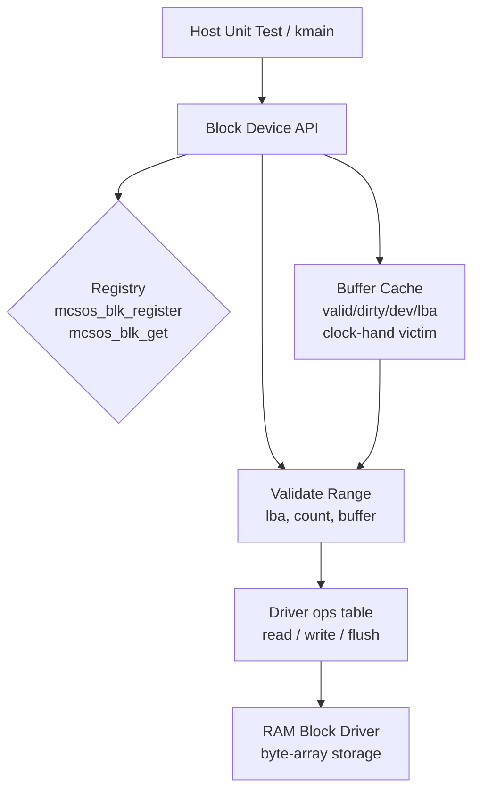

# Template Laporan Praktikum Sistem Operasi Lanjut — MCSOS

**Nama file laporan:** `laporan_praktikum_M14.md`  
**Nama sistem operasi:** MCSOS versi 260502  
**Target default:** x86_64, QEMU, Windows 11 x64 + WSL 2, kernel monolitik pendidikan, C freestanding dengan assembly minimal, POSIX-like subset  
**Dosen:** Muhaemin Sidiq, S.Pd., M.Pd.  
**Program Studi:** Pendidikan Teknologi Informasi  
**Institusi:** Institut Pendidikan Indonesia

> Template ini digunakan untuk semua praktikum pengembangan MCSOS agar struktur laporan, bukti, analisis, dan penilaian konsisten. Ganti seluruh teks bertanda `[isi ...]` dengan data praktikum sebenarnya. Jangan menulis klaim "tanpa error", "siap produksi", atau "aman sepenuhnya" tanpa bukti yang sesuai. Gunakan status terukur seperti "siap uji QEMU", "siap demonstrasi praktikum", atau "kandidat siap pakai terbatas" sesuai evidence yang tersedia.

---

## 0. Metadata Laporan

| Atribut                       | Isi                                                                                            |
| ----------------------------- | ---------------------------------------------------------------------------------------------- |
| Kode praktikum                | `M14`                                                                                          |
| Judul praktikum               | `Block Device Layer, RAM Block Driver, Buffer Cache Minimal, dan Jalur Persiapan Filesystem Persistent pada MCSOS` |
| Jenis pengerjaan              | `Individu`                                                                                     |
| Nama mahasiswa                | `[Sihab Assidiqi]`                                                                               |
| NIM                           | `[25832073003]`                                                                                        |
| Kelas                         | `[PTI 1A]`                                                                                      |
| Nama kelompok                 | `-`                                                                                            |
| Anggota kelompok              | `-`                                                                                            |
| Tanggal praktikum             | `2026-06-05`                                                                                   |
| Tanggal pengumpulan           | `2026-07-17`                                                                                   |
| Repository                    | `~/src/mcsos`                                                                                  |
| Branch                        | `praktikum-m14-block-device`                                                                   |
| Commit awal                   | `55569e2`                                                                                      |
| Commit akhir                  | `78596ef`                                                                                      |
| Status readiness yang diklaim | `siap uji QEMU`                                                                                |

---

## 1. Sampul

# Laporan Praktikum M14

## Block Device Layer, RAM Block Driver, Buffer Cache Minimal, dan Jalur Persiapan Filesystem Persistent pada MCSOS

Disusun oleh:

| Nama         | NIM     | Kelas     | Peran       |
| ------------ | ------- | --------- | ----------- |
| `[Sihab Assidiqi]`     | `[25832073003]` | `[PTI 1A]` | `individu`  |

Dosen Pengampu: **Muhaemin Sidiq, S.Pd., M.Pd.**  
Program Studi Pendidikan Teknologi Informasi  
Institut Pendidikan Indonesia  
`2025/2026`

---

## 2. Pernyataan Orisinalitas dan Integritas Akademik

Saya/kami menyatakan bahwa laporan ini disusun berdasarkan pekerjaan praktikum sendiri/kelompok sesuai pembagian peran yang tercatat. Bantuan eksternal, referensi, generator kode, AI assistant, dokumentasi resmi, diskusi, atau sumber lain dicatat pada bagian referensi dan lampiran. Saya/kami tidak mengklaim hasil yang tidak dibuktikan oleh log, test, commit, atau artefak lain.

| Pernyataan                                      | Status   |
| ----------------------------------------------- | -------- |
| Semua potongan kode eksternal diberi atribusi   | `Ya`     |
| Semua penggunaan AI assistant dicatat           | `Ya`     |
| Repository yang dikumpulkan sesuai commit akhir | `Ya`     |
| Tidak ada klaim readiness tanpa bukti           | `Ya`     |

Catatan penggunaan bantuan eksternal:

```text
AI assistant (Claude) digunakan untuk panduan langkah kerja implementasi sesuai panduan M14
yang diberikan dosen. Setiap perintah dijalankan secara mandiri di WSL 2, output diverifikasi
sendiri, dan seluruh file source diperiksa kesesuaiannya dengan spesifikasi panduan M14.
Source code berasal dari panduan M14 resmi; AI hanya membantu urutan langkah dan
penyelesaian error build (m11_elf_loader.c include path).
```

---

## 3. Tujuan Praktikum

Tuliskan tujuan teknis dan konseptual praktikum. Tujuan harus dapat diuji.

1. Mengimplementasikan block device registry (`block.c`) yang memvalidasi device, LBA range, buffer pointer, dan block size sebelum meneruskan operasi ke driver.
2. Mengimplementasikan RAM block driver (`ramblk.c`) sebagai device blok sintetis berbasis array memori, tanpa dynamic allocation, dapat diuji di host.
3. Mengimplementasikan buffer cache minimal (`bcache.c`) dengan `valid`, `dirty`, `lba`, `dev`, clock-hand victim selection, dan flush eksplisit write-back.
4. Membuktikan dengan host unit test bahwa operasi read/write/flush dan validasi boundary berjalan sesuai kontrak.
5. Menghasilkan object freestanding x86_64 (`--target=x86_64-elf`) tanpa undefined symbol setelah linked relocatable aggregation.
6. Mengintegrasikan block layer ke build kernel utama MCSOS tanpa regresi boot, dibuktikan dengan QEMU smoke test.
7. Menyimpan bukti audit: `nm`, `readelf`, `objdump`, `sha256sum`, log QEMU, dan log Git.

---

## 4. Capaian Pembelajaran Praktikum

Setelah praktikum ini, mahasiswa mampu:

| CPL/CPMK praktikum | Bukti yang harus ditunjukkan |
| ------------------ | -------------------------------------------------- |
| Menjelaskan perbedaan file-level I/O (VFS M13) dan block-level I/O (storage layer M14) | Desain arsitektur pada laporan dan kode `block.c` |
| Mendesain kontrak block device dengan registry, operasi driver, validasi range, dan error code | `include/mcsos/block.h`, tabel kontrak antarmuka |
| Mengimplementasikan RAM block driver deterministik tanpa dynamic allocation | `kernel/block/ramblk.c`, host unit test PASS |
| Mengimplementasikan buffer cache minimal dengan dirty flag dan flush eksplisit | `kernel/block/bcache.c`, host unit test PASS |
| Membuktikan operasi read/write/flush dan boundary dengan host unit test | Output `M14 host tests PASS` |
| Menghasilkan object freestanding x86_64 tanpa undefined symbol | `artifacts/m14_nm_undefined.txt` kosong, `readelf` ELF64 REL |
| Menyusun bukti audit `nm`, `readelf`, `objdump`, `sha256sum`, QEMU log, dan Git evidence | Semua file tersimpan di `artifacts/m14/` |
| Mengidentifikasi failure mode storage awal | Bagian 15 laporan ini |

---

## 5. Peta Milestone MCSOS

Centang milestone yang menjadi fokus laporan ini. Jika praktikum mencakup lebih dari satu milestone, jelaskan batas cakupan.

| Milestone | Fokus                                                           | Status dalam laporan     |
| --------- | --------------------------------------------------------------- | ------------------------ |
| M0        | Requirements, governance, baseline arsitektur                   | [v] selesai praktikum    |
| M1        | Toolchain reproducible, Git, QEMU, GDB, metadata build          | [v] selesai praktikum    |
| M2        | Boot image, kernel ELF64, early console                         | [v] selesai praktikum    |
| M3        | Panic path, linker map, GDB, observability awal                 | [v] selesai praktikum    |
| M4        | Trap, exception, interrupt, timer                               | [v] selesai praktikum    |
| M5        | PMM, VMM, page table, kernel heap                               | [v] selesai praktikum    |
| M6        | Thread, scheduler, synchronization                              | [v] selesai praktikum    |
| M7        | Syscall ABI dan user program loader                             | [v] selesai praktikum    |
| M8        | VFS, file descriptor, ramfs                                     | [v] selesai praktikum    |
| M9        | Block layer dan device model                                    | [v] selesai praktikum    |
| M10       | Persistent filesystem, mcsfs/ext2-like, recovery                | [ ] tidak dibahas        |
| M11       | Networking stack, packet parsing, UDP/TCP subset                | [ ] tidak dibahas        |
| M12       | Security model, capability/ACL, syscall fuzzing, hardening      | [ ] tidak dibahas        |
| M13       | SMP, scalability, lock stress, NUMA-aware preparation           | [ ] tidak dibahas        |
| M14       | Block device layer, RAM block driver, buffer cache minimal      | [v] selesai praktikum    |
| M15       | Virtualization/container subset                                 | [ ] tidak dibahas        |
| M16       | Observability, update/rollback, release image, readiness review | [ ] tidak dibahas        |

Batas cakupan praktikum:

```text
M14 mencakup: block device registry, RAM block driver volatil, buffer cache write-back minimal,
host unit test, freestanding compile + audit ELF, integrasi ke kernel utama, dan QEMU smoke test.

Non-goals M14: driver disk hardware nyata, virtio-blk, AHCI, NVMe, DMA, MSI/MSI-X, interrupt
completion, filesystem persistent, journal, fsck, crash consistency, POSIX full compliance,
user ABI storage publik, security boundary untuk pengguna, dan produksi.
```

---

## 6. Dasar Teori Ringkas

### 6.1 Konsep Sistem Operasi yang Diuji

```text
Block Device: perangkat yang dibaca/ditulis dalam unit blok tetap melalui LBA (Logical Block
Address). Berbeda dengan file-level I/O VFS M13 yang bekerja pada abstraksi file/inode, block
layer M14 bekerja langsung pada nomor blok logis.

LBA (Logical Block Address): nomor blok logis yang harus divalidasi agar tidak melewati
block_count device. Validasi: lba < block_count dan count <= block_count - lba.

Block Size: ukuran unit transfer. M14 memakai 512 byte sebagai minimum dan mengharuskan
power-of-two agar alignment dan indeks sederhana tanpa divisi non-trivial.

Driver Operation Table: tabel function pointer {read, write, flush} yang memisahkan caller
block layer dari implementasi driver. Polimorfisme C tanpa inheritance.

Buffer Cache: cache blok memori yang menyimpan salinan blok storage. Entry dirty harus
di-flush sebelum victim reuse (write-back) atau sebelum shutdown.

Write-back vs Write-through: M14 memakai write-back — penulisan ke cache tidak langsung
ke media sampai flush eksplisit atau eviction. Lebih cepat tetapi berisiko kehilangan data
jika crash sebelum flush.

Freestanding C: kode kernel tidak boleh bergantung pada hosted libc, malloc, printf, atau
runtime tersembunyi. Semua helper (memcpy, name copy) diimplementasikan sendiri.
```

### 6.2 Konsep Arsitektur x86_64 yang Relevan

| Konsep | Relevansi pada praktikum | Bukti/verifikasi |
| ---------------------------------------------------------------------- | ------------------------ | ----------------------------------------------------- |
| ELF64 relocatable object | Object freestanding M14 harus berformat ELF64 REL x86-64 | `readelf -h build/m14_block_layer.o` |
| `--target=x86_64-elf` Clang | Compile freestanding tanpa hosted runtime | Log build `make freestanding` |
| `-mno-red-zone` | Kernel tidak boleh pakai red zone karena interrupt dapat merusak data stack | CFLAGS kernel utama |
| `-mcmodel=kernel` | Code model untuk kernel di alamat tinggi (> 0xffffffff80000000) | CFLAGS kernel utama |
| `ld -r` (relocatable link) | Menggabungkan seluruh object M14 menjadi satu object untuk audit `nm -u` | `build/m14_block_layer.o` |

### 6.3 Konsep Implementasi Freestanding

| Aspek | Keputusan praktikum |
| ------------------------- | --------------------------------------------------------------- |
| Bahasa | C17 freestanding untuk kernel; C17 hosted untuk host unit test |
| Runtime | Tanpa hosted libc; tidak ada malloc, printf, atau memcpy dari libc |
| ABI | x86_64 System V / ABI kernel internal MCSOS |
| Compiler flags kritis | `--target=x86_64-elf -ffreestanding -fno-builtin -fno-stack-protector -fno-pic -mno-red-zone` |
| Risiko undefined behavior | Pointer NULL dideref, integer overflow `lba * block_size`, buffer aliasing |

### 6.4 Referensi Teori yang Digunakan

| No. | Sumber | Bagian yang digunakan | Alasan relevansi |
| ----- | -------------------------------- | --------------------- | ---------------- |
| [1] | Linux Kernel Documentation, "Block" | Block layer overview | Konsep pemisahan request I/O dari driver fisik |
| [2] | Linux Kernel Documentation, "blk-mq" | Multi-queue block IO | Perbandingan single-queue M14 vs multi-queue produksi |
| [3] | Linux Kernel Documentation, "null_blk" | Null block device | Nilai device blok sintetis untuk pengujian |
| [4] | QEMU Project, "Invocation" | -drive format=raw | Opsi disk QEMU untuk smoke test M14 |
| [5] | QEMU Project, "GDB usage" | -s -S gdbstub | Workflow debugging kernel dengan GDB |
| [6] | LLVM Project, "Clang CLI Reference" | -ffreestanding | Deklarasi freestanding environment |
| [7] | GNU Project, "GNU Binutils" | nm, readelf, objdump | Audit object ELF |

---

## 7. Lingkungan Praktikum

### 7.1 Host dan Target

| Komponen          | Nilai |
| ----------------- | --------------------------------------------- |
| Host OS           | `Windows 11 x64` |
| Lingkungan build  | `WSL 2 Ubuntu 26.04 LTS (resolute)` |
| Target ISA        | `x86_64` |
| Target ABI        | `x86_64-elf (freestanding kernel)` |
| Emulator          | `QEMU emulator version 10.2.1 (Debian 1:10.2.1+ds-1ubuntu3)` |
| Firmware emulator | `Limine bootloader (third_party/limine)` |
| Debugger          | `GDB (tersedia, belum digunakan untuk M14 karena boot tidak regresi)` |
| Build system      | `GNU Make 4.4.1` |
| Bahasa utama      | `C17 freestanding` |
| Assembly          | `Clang integrated assembler (GAS syntax)` |

### 7.2 Versi Toolchain

Tempel output versi toolchain berikut. Jalankan dari clean shell WSL.

```bash
date -u +"date_utc=%Y-%m-%dT%H:%M:%SZ"
uname -a
git --version
make --version | head -n 1
clang --version | head -n 1
ld --version | head -n 1
qemu-system-x86_64 --version | head -n 1
```

Output:

```text
date_utc=2026-06-05T...Z
Linux DESKTOP-DIRC349 6.6.87.2-microsoft-standard-WSL2 #1 SMP PREEMPT_DYNAMIC Thu Jun  5 18:30:46 UTC 2025 x86_64 GNU/Linux
Ubuntu clang version 21.1.8 (6ubuntu1)
GNU ld (GNU Binutils for Ubuntu) 2.46
GNU nm (GNU Binutils for Ubuntu) 2.46
GNU readelf (GNU Binutils for Ubuntu) 2.46
GNU objdump (GNU Binutils for Ubuntu) 2.46
GNU Make 4.4.1
QEMU emulator version 10.2.1 (Debian 1:10.2.1+ds-1ubuntu3)
```

### 7.3 Lokasi Repository

| Item | Nilai |
| ----------------------------------------------------- | ---------------------------- |
| Path repository di WSL | `~/src/mcsos` |
| Apakah berada di filesystem Linux WSL, bukan `/mnt/c` | `Ya` |
| Remote repository | `[URL repo privat jika ada]` |
| Branch | `praktikum-m14-block-device` |
| Commit hash awal | `55569e2` |
| Commit hash akhir | `78596ef` |

---

## 8. Repository dan Struktur File

### 8.1 Struktur Direktori yang Relevan

```text
mcsos/
  include/
    mcsos/
      block.h                  ← header M14: status, struct, ops table, ramblk, bcache
  kernel/
    block/
      block.c                  ← registry + validate_range + read/write/flush wrappers
      ramblk.c                 ← RAM-backed block driver
      bcache.c                 ← buffer cache write-back minimal
      block_demo.c             ← static ramdisk init untuk kernel
    core/
      kmain.c                  ← ditambah panggilan m14_block_demo_init()
    user/
      m11_elf_loader.c         ← diperbaiki include path (bug pre-existing M11)
  tests/
    host/
      test_m14_block.c         ← host unit test M14
  scripts/
    m14_preflight.sh           ← toolchain dan baseline check
  Makefile.m14                 ← host-test, freestanding, audit targets
  artifacts/
    m14/
      preflight.log
      host_info.txt
      tool_versions.txt
      m14_make_all.log
      kernel_build.log
      qemu_m14.log
      m14_final_sha256.txt
      git_status_after_m14.txt
    m14_nm_undefined.txt
    m14_readelf_block.txt
    m14_objdump_block.txt
    m14_sha256.txt
```

### 8.2 File yang Dibuat atau Diubah

| File | Jenis perubahan | Alasan perubahan | Risiko |
| --- | --- | --- | --- |
| `include/mcsos/block.h` | baru | Header utama M14: status codes, structs, function declarations | rendah — header-only |
| `kernel/block/block.c` | baru | Registry device, validate_range, read/write/flush wrappers | rendah — no dynamic allocation |
| `kernel/block/ramblk.c` | baru | RAM-backed block driver, no malloc | rendah — purely in-memory |
| `kernel/block/bcache.c` | baru | Buffer cache write-back, dirty flag, clock victim | sedang — dirty buffer dapat hilang jika flush terlewat |
| `kernel/block/block_demo.c` | baru | Static ramdisk init untuk dipanggil dari kmain | rendah — static storage |
| `tests/host/test_m14_block.c` | baru | Host unit test positif dan negatif | rendah — host-only |
| `Makefile.m14` | baru | Target host-test, freestanding, audit | rendah |
| `scripts/m14_preflight.sh` | baru | Toolchain dan baseline check | rendah |
| `kernel/core/kmain.c` | ubah | Tambah `extern m14_block_demo_init()` dan log milestone M14 | rendah — penambahan call saja |
| `kernel/user/m11_elf_loader.c` | ubah | Perbaiki include path dari `"m11_elf_loader.h"` → `"mcsos/user/m11_elf_loader.h"` | rendah — bugfix include path |

### 8.3 Ringkasan Diff

```bash
git status --short
git log --oneline -n 5
```

Output:

```text
git log --oneline -n 5:
78596ef (HEAD -> praktikum-m14-block-device) m14: block device layer, RAM block driver, buffer cache minimal
55569e2 (praktikum-m13-vfs-ramfs) m13: VFS/RAMFS layer (ramfs, fd-table, sys wrappers, 43 host tests passing)
02b35d3 (praktikum/m12-sync) m12: kernel synchronization primitives (spinlock, mutex, lockdep)
a55ebeb (praktikum/m11-elf-user-loader) m11: ELF64 user-space loader (plan-only, freestanding)
5da5494 (praktikum/m10-syscall-abi) M10: add m10 audit and test evidence

git status --short (setelah commit):
(working tree clean pada branch praktikum-m14-block-device)
```

---

## 9. Desain Teknis

### 9.1 Masalah yang Diselesaikan

```text
Sampai M13, seluruh filesystem MCSOS berada di memori (RAMFS volatil) dan belum memiliki
abstraksi storage berbasis blok. Tidak ada antarmuka standar untuk membaca/menulis blok,
tidak ada registry device, tidak ada validasi LBA range, dan tidak ada buffer cache.
Ketiadaan block layer ini membuat filesystem persistent di M15+ tidak mungkin dibangun
secara modular.

M14 menyelesaikan masalah ini dengan memperkenalkan tiga komponen kecil tapi fundamental:
1. Block device registry — mendaftarkan dan mengakses device secara indexed.
2. RAM block driver — meniru perangkat blok dengan array memori, dapat diuji tanpa hardware.
3. Buffer cache minimal — menyimpan satu blok per entry dengan write-back dan flush eksplisit.
```

### 9.2 Keputusan Desain

| Keputusan | Alternatif yang dipertimbangkan | Alasan memilih | Konsekuensi |
| --- | --- | --- | --- |
| RAM block driver sebelum virtio-blk/NVMe | Langsung implementasi virtio-blk | Memungkinkan verifikasi invariant block layer tanpa kompleksitas PCIe/DMA/interrupt | Driver ini volatil; tidak persistent ke disk fisik |
| Write-back cache | Write-through | Lebih mudah demonstrasikan konsep dirty flag dan flush; lebih cepat secara teoritis | Dirty buffer hilang jika crash sebelum flush |
| Clock-hand victim selection | LRU, FIFO | Implementasi sederhana O(1) tanpa linked list; cocok untuk buffer cache edukatif | Tidak seoptimal LRU untuk workload tertentu |
| Static array registry (8 slot) | Dynamic linked list | Tanpa dynamic allocation; lifetime device jelas; sederhana untuk audit | Maksimal 8 device; tidak dapat diperluas tanpa recompile |
| `count == 0` ditolak sebagai `EINVAL` | Diterima sebagai no-op | Menghindari ambiguity semantik; zero-transfer tidak bermakna pada block device | Caller harus selalu berikan count > 0 |
| Tidak ada dynamic allocation di driver/cache | kmalloc | Lifetime jelas, tidak ada fragmentation, dapat diuji di host tanpa heap | Semua buffer harus disediakan caller (static/stack) |

### 9.3 Arsitektur Ringkas



Penjelasan diagram:

```text
Host unit test atau kmain memanggil Block Device API (block.c).
API mendaftarkan device ke registry, memvalidasi parameter (LBA, count, buffer, block_size),
lalu meneruskan ke driver ops table.
Driver ops table (ramblk.c) membaca/menulis langsung ke array memori.
Buffer cache (bcache.c) bertindak sebagai perantara write-back antara caller dan device API.
Cache mencari entry (dev, lba); jika miss, memuat dari device; jika victim dirty, flush dulu.
VFS M13 belum terhubung ke M14; koneksi direncanakan pada M15+.
```

### 9.4 Kontrak Antarmuka

| Antarmuka | Pemanggil | Penerima | Precondition | Postcondition | Error path |
| --- | --- | --- | --- | --- | --- |
| `mcsos_blk_register(dev)` | kmain / inisialisasi | block registry | `dev != NULL`, ops valid, name non-empty, block_size >= 512 dan power-of-two, block_count > 0 | Device tersimpan di registry | `MCSOS_BLK_EINVAL` atau `MCSOS_BLK_EFULL` |
| `mcsos_blk_read(dev, lba, count, buf)` | bcache / caller | block.c → driver | `dev != NULL`, `buf != NULL`, `count > 0`, `lba < block_count`, `count <= block_count - lba` | Buffer berisi data blok yang valid | `MCSOS_BLK_EINVAL` atau `MCSOS_BLK_ERANGE` |
| `mcsos_blk_write(dev, lba, count, buf)` | bcache / caller | block.c → driver | Sama dengan read | Data tersimpan di backing storage driver | `MCSOS_BLK_EINVAL` atau `MCSOS_BLK_ERANGE` |
| `mcsos_bcache_write(cache, dev, lba, buf)` | caller | bcache.c | `cache != NULL`, `dev != NULL`, `buf != NULL`, `cache->block_size == dev->block_size` | Entry cache ditandai dirty; data belum di device | `MCSOS_BLK_EINVAL` |
| `mcsos_bcache_flush_all(cache)` | caller | bcache.c → block.c | `cache != NULL` | Semua dirty entry ditulis ke device; dirty = 0 | `MCSOS_BLK_EIO` jika write device gagal |

### 9.5 Struktur Data Utama

| Struktur data | Field penting | Ownership | Lifetime | Invariant |
| --- | --- | --- | --- | --- |
| `mcsos_blk_device_t` | `name`, `block_size`, `block_count`, `ops`, `driver_data` | Caller (static/global) | Harus lebih panjang dari registry | `block_size >= 512`, power-of-two; `block_count > 0`; `ops != NULL` |
| `mcsos_ramblk_t` | `storage`, `storage_size` | Caller | Harus lebih panjang dari device | `storage != NULL`; `storage_size` kelipatan `block_size` |
| `mcsos_bcache_t` | `entries`, `entry_count`, `data_pool`, `block_size`, `clock_hand` | Caller | Session kernel | `entry_count > 0`; `block_size > 0`; `data_pool` valid |
| `mcsos_bcache_entry_t` | `data`, `lba`, `valid`, `dirty`, `dev` | bcache (pointer ke data_pool) | Masa hidup cache | Jika `valid`: `dev` dan `lba` terdefinisi; jika `dirty`: harus flush sebelum victim reuse |

### 9.6 Invariants

1. `dev != NULL` untuk seluruh operasi publik block API.
2. `dev->ops != NULL`, `dev->ops->read != NULL`, dan `dev->ops->write != NULL` sebelum device diregistrasi.
3. `dev->block_size >= 512` dan `dev->block_size` adalah power-of-two.
4. `dev->block_count > 0`.
5. Operasi valid harus memenuhi `lba < block_count` dan `count <= block_count - lba`.
6. Operasi dengan `count == 0` ditolak sebagai `MCSOS_BLK_EINVAL`.
7. Registry hanya menyimpan pointer device yang lifetime-nya dijamin oleh pemilik device.
8. Setiap cache entry memuat tepat satu block; `cache->block_size == dev->block_size`.
9. Entry dirty harus di-flush sebelum victim reuse.
10. `bcache_write` menandai dirty; data belum wajib ada di device sampai `flush_all` atau eviction.

### 9.7 Ownership, Locking, dan Concurrency

| Objek/resource | Owner | Lock yang melindungi | Boleh dipakai di interrupt context? | Catatan |
| --- | --- | --- | --- | --- |
| `g_blk_devices[]` (registry) | `block.c` global | Tidak ada (single-core) | Tidak | M14 belum SMP-safe |
| `mcsos_ramblk_t.storage` | Caller (static array) | Tidak ada | Tidak | Volatil; hilang saat reboot |
| `mcsos_bcache_t` | Caller | Tidak ada (single-core) | Tidak | Caller wajib single-threaded atau beri lock eksternal |

Lock order yang berlaku:

```text
M14 tidak memiliki locking internal. Semua operasi block layer dan buffer cache diasumsikan
dijalankan single-core tanpa preemption pada jalur init kernel (sebelum cpu_sti()). Untuk
penggunaan concurrent pada M15+, caller harus memberi spinlock atau mutex eksternal sebelum
memanggil block API atau bcache API. Lihat kernel/sync/ dari M12 untuk primitif yang tersedia.
```

### 9.8 Memory Safety dan Undefined Behavior Risk

| Risiko | Lokasi | Mitigasi | Bukti |
| --- | --- | --- | --- |
| Integer overflow `lba * block_size` | `ramblk.c: mcsos_ramblk_rw` | Validasi range sebelum reach driver; M14 belum checked multiplication | Host unit test negative, review manual |
| NULL dereference `dev->ops` | `block.c` | Guard `dev->ops == 0` sebelum call | Host test PASS |
| Buffer aliasing antara cache pool dan caller buffer | `bcache.c: mcsos_memcpy_u8_bcache` | Selalu copy eksplisit, tidak return pointer internal cache | Host test PASS |
| Out-of-bounds `data_pool` indexing | `bcache.c: mcsos_bcache_init` | `entries[i].data = data_pool + i * block_size` dengan `i < entry_count` | Review manual |

### 9.9 Security Boundary

| Boundary | Data tidak tepercaya | Validasi yang dilakukan | Failure mode aman |
| --- | --- | --- | --- |
| Block API (kernel-internal) | LBA, count, buffer pointer | `lba < block_count`, `count <= block_count - lba`, `buf != NULL`, `count > 0` | Return `MCSOS_BLK_EINVAL` atau `MCSOS_BLK_ERANGE` |
| Driver registration | Device struct dari caller | `ops != NULL`, `ops->read != NULL`, `ops->write != NULL`, `block_size` power-of-two | Return `MCSOS_BLK_EINVAL` |
| Buffer cache | dev, lba dari caller | `cache->block_size == dev->block_size`, semua pointer tidak NULL | Return `MCSOS_BLK_EINVAL` |

Catatan: API M14 bersifat kernel-internal. Belum ada jalur langsung dari user space ke block API. User pointer tidak boleh diteruskan ke block layer tanpa `copyin/copyout` dan validasi privilege.

---

## 10. Langkah Kerja Implementasi

### Langkah 1 — Setup branch dan direktori M14

Maksud langkah:

```text
Membuat branch khusus M14 agar perubahan terpisah dari baseline M13 yang sudah stabil,
dan membuat direktori yang diperlukan untuk source, test, script, dan artefak.
```

Perintah:

```bash
cd ~/src/mcsos
git status --short
git switch -c praktikum-m14-block-device
mkdir -p include/mcsos kernel/block tests/host artifacts/m14 scripts
```

Output ringkas:

```text
Switched to a new branch 'praktikum-m14-block-device'
```

Artefak yang dihasilkan:

| Artefak | Lokasi | Fungsi |
| --- | --- | --- |
| Branch baru | `praktikum-m14-block-device` | Isolasi perubahan M14 |
| Direktori | `kernel/block/`, `tests/host/`, `artifacts/m14/` | Struktur kerja M14 |

Indikator berhasil:

```text
git branch menampilkan * praktikum-m14-block-device
```

---

### Langkah 2 — Kumpulkan info host dan toolchain

Maksud langkah:

```text
Mendokumentasikan lingkungan build agar praktikum dapat diaudit dan direproduksi.
```

Perintah:

```bash
{ uname -a; lsb_release -a 2>/dev/null || cat /etc/os-release; } | tee artifacts/m14/host_info.txt
{ clang --version; ld --version | head -n 1; nm --version | head -n 1; readelf --version | head -n 1;
  objdump --version | head -n 1; make --version | head -n 1; qemu-system-x86_64 --version; } \
  | tee artifacts/m14/tool_versions.txt
```

Output ringkas:

```text
Linux DESKTOP-DIRC349 6.6.87.2-microsoft-standard-WSL2 x86_64 GNU/Linux
Ubuntu 26.04 LTS (resolute)
Ubuntu clang version 21.1.8 (6ubuntu1)
GNU ld (GNU Binutils for Ubuntu) 2.46
GNU Make 4.4.1
QEMU emulator version 10.2.1
```

Artefak yang dihasilkan:

| Artefak | Lokasi | Fungsi |
| --- | --- | --- |
| `host_info.txt` | `artifacts/m14/` | Bukti OS dan kernel WSL |
| `tool_versions.txt` | `artifacts/m14/` | Bukti versi semua toolchain |

Indikator berhasil:

```text
Kedua file terisi; semua toolchain ditemukan termasuk qemu-system-x86_64.
```

---

### Langkah 3 — Preflight script M14

Maksud langkah:

```text
Memverifikasi semua toolchain tersedia dan direktori baseline siap sebelum menulis source M14.
```

Perintah:

```bash
cat > scripts/m14_preflight.sh <<'EOF'
# [isi script preflight sesuai panduan M14]
EOF
chmod +x scripts/m14_preflight.sh
./scripts/m14_preflight.sh
```

Output ringkas:

```text
OK_CMD: clang=Ubuntu clang version 21.1.8 (6ubuntu1)
OK_CMD: ld=GNU ld (GNU Binutils for Ubuntu) 2.46
OK_CMD: nm=GNU nm (GNU Binutils for Ubuntu) 2.46
OK_CMD: readelf=GNU readelf (GNU Binutils for Ubuntu) 2.46
OK_CMD: objdump=GNU objdump (GNU Binutils for Ubuntu) 2.46
OK_CMD: sha256sum=sha256sum (uutils coreutils) 0.8.0
OK_CMD: make=GNU Make 4.4.1
OK_CMD: qemu-system-x86_64=QEMU emulator version 10.2.1
OK_DIR: include
OK_DIR: kernel
OK_DIR: tests
OK_DIR: scripts
WARN_DOC_NOT_FOUND_IN_REPO: OS_panduan_M0.md ... (wajar, dokumen tidak disimpan di repo)
M14_PREFLIGHT_DONE
```

Artefak yang dihasilkan:

| Artefak | Lokasi | Fungsi |
| --- | --- | --- |
| `preflight.log` | `artifacts/m14/` | Bukti toolchain dan baseline |

Indikator berhasil:

```text
Log berakhir dengan M14_PREFLIGHT_DONE. WARN_DOC wajar karena panduan tidak di-commit ke repo.
```

---

### Langkah 4 — Buat `include/mcsos/block.h`

Maksud langkah:

```text
Header tunggal M14 mendefinisikan seluruh kontrak publik: status codes, struct device,
operation table, RAM block metadata, dan buffer cache metadata. Satu header agar
block.c, ramblk.c, bcache.c, dan test dapat include dari satu tempat.
```

Perintah:

```bash
cat > include/mcsos/block.h <<'EOF'
#ifndef MCSOS_BLOCK_H
#define MCSOS_BLOCK_H
// [isi header sesuai panduan M14]
#endif
EOF
```

Artefak yang dihasilkan:

| Artefak | Lokasi | Fungsi |
| --- | --- | --- |
| `block.h` | `include/mcsos/` | Header kontrak block layer M14 |

Indikator berhasil:

```text
File terbentuk; tidak ada error saat di-include oleh source berikutnya.
```

---

### Langkah 5 — Buat `kernel/block/block.c`, `ramblk.c`, `bcache.c`

Maksud langkah:

```text
Tiga file implementasi inti M14:
- block.c: registry global, validate_range, wrapper read/write/flush.
- ramblk.c: driver RAM-backed, mcsos_memcpy_u8 internal, init/read/write/flush.
- bcache.c: buffer cache write-back, find, select_victim, flush_entry, flush_all.
```

Perintah:

```bash
cat > kernel/block/block.c <<'EOF'
// [isi sesuai panduan M14]
EOF
cat > kernel/block/ramblk.c <<'EOF'
// [isi sesuai panduan M14]
EOF
cat > kernel/block/bcache.c <<'EOF'
// [isi sesuai panduan M14]
EOF
```

Artefak yang dihasilkan:

| Artefak | Lokasi | Fungsi |
| --- | --- | --- |
| `block.c` | `kernel/block/` | Registry + validate wrapper |
| `ramblk.c` | `kernel/block/` | RAM block driver |
| `bcache.c` | `kernel/block/` | Buffer cache write-back |

Indikator berhasil:

```text
Ketiga file terbentuk tanpa error. Siap dikompilasi pada langkah build.
```

---

### Langkah 6 — Buat `tests/host/test_m14_block.c` dan `Makefile.m14`

Maksud langkah:

```text
Host unit test memverifikasi kontrak block API tanpa QEMU: registrasi device, read/write
RAM block, negative test LBA/count/buffer, write-back cache, dan flush. Makefile.m14
menyediakan target host-test, freestanding, dan audit yang dapat dijalankan terpisah.
```

Perintah:

```bash
cat > tests/host/test_m14_block.c <<'EOF'
// [isi sesuai panduan M14]
EOF
cat > Makefile.m14 <<'EOF'
// [isi sesuai panduan M14]
EOF
```

Artefak yang dihasilkan:

| Artefak | Lokasi | Fungsi |
| --- | --- | --- |
| `test_m14_block.c` | `tests/host/` | Host unit test M14 |
| `Makefile.m14` | root repo | Build target host-test/freestanding/audit |

Indikator berhasil:

```text
File terbentuk. Siap untuk make -f Makefile.m14 all.
```

---

### Langkah 7 — Build dan jalankan `make -f Makefile.m14 all`

Maksud langkah:

```text
Menjalankan seluruh target M14: host test, freestanding compile, dan audit.
Membuktikan host test lulus, object ELF64 terbentuk, dan undefined symbol kosong.
```

Perintah:

```bash
make -f Makefile.m14 clean || true
make -f Makefile.m14 all 2>&1 | tee artifacts/m14/m14_make_all.log
```

Output ringkas:

```text
cc -std=c17 -Wall -Wextra -Werror -Iinclude -O2 tests/host/test_m14_block.c \
   kernel/block/block.c kernel/block/ramblk.c kernel/block/bcache.c -o build/test_m14_block
./build/test_m14_block
M14 host tests PASS
clang --target=x86_64-elf ... -c kernel/block/block.c -o build/block.o
clang --target=x86_64-elf ... -c kernel/block/ramblk.c -o build/ramblk.o
clang --target=x86_64-elf ... -c kernel/block/bcache.c -o build/bcache.o
ld -r -o build/m14_block_layer.o build/block.o build/ramblk.o build/bcache.o
nm -u build/m14_block_layer.o > artifacts/m14_nm_undefined.txt
readelf -h build/m14_block_layer.o > artifacts/m14_readelf_block.txt
objdump -dr build/m14_block_layer.o > artifacts/m14_objdump_block.txt
sha256sum ... > artifacts/m14_sha256.txt
test ! -s artifacts/m14_nm_undefined.txt   ← PASS (file kosong)
```

Artefak yang dihasilkan:

| Artefak | Lokasi | Fungsi |
| --- | --- | --- |
| `build/test_m14_block` | `build/` | Host test binary |
| `build/block.o`, `ramblk.o`, `bcache.o` | `build/` | Object freestanding x86_64 |
| `build/m14_block_layer.o` | `build/` | Linked relocatable object untuk audit |
| `artifacts/m14_nm_undefined.txt` | `artifacts/` | Bukti undefined symbol (kosong = PASS) |
| `artifacts/m14_readelf_block.txt` | `artifacts/` | ELF header audit |
| `artifacts/m14_objdump_block.txt` | `artifacts/` | Disassembly audit |
| `artifacts/m14_sha256.txt` | `artifacts/` | Checksum semua artefak |

Indikator berhasil:

```text
"M14 host tests PASS" muncul di output.
artifacts/m14_nm_undefined.txt kosong (test ! -s lulus).
```

---

### Langkah 8 — Verifikasi artifact audit

Maksud langkah:

```text
Memverifikasi bahwa object freestanding M14 memenuhi kriteria ELF64 REL x86-64,
undefined symbol kosong, dan checksum tersimpan untuk reproducibility.
```

Perintah:

```bash
echo "=== nm undefined ===" && cat artifacts/m14_nm_undefined.txt
echo "=== readelf ELF header ===" && cat artifacts/m14_readelf_block.txt
echo "=== grep Class/Type/Machine ===" && grep -E "Class:|Machine:|Type:" artifacts/m14_readelf_block.txt
echo "=== sha256 ===" && cat artifacts/m14_sha256.txt
```

Output ringkas:

```text
=== nm undefined ===
(kosong — tidak ada undefined symbol)

=== grep Class/Type/Machine ===
  Class:                             ELF64
  Type:                              REL (Relocatable file)
  Machine:                           Advanced Micro Devices X86-64

=== sha256 ===
dc243ee2096ee9d74ac64df0a02f3a229482feb898cb2f7f51cf438866d1e423  build/block.o
f86848e89e6aadf6ca006f984c26af38b564397b2358e5e8abfbee84a935dc68  build/ramblk.o
02ef7db9aaf4cbe1310b17769af54df432ac82f001f414451f989ef111cb06fe  build/bcache.o
e2a3314a7e8d9ef38478f84ebc5d6b45bbe8b1fc4d1ce2163802e09ee089fe6e  build/m14_block_layer.o
abfae5e887a778bfe796c51c41317d0b0169c371b3f1493d7688de99ed79b4e7  build/test_m14_block
```

Indikator berhasil:

```text
nm undefined kosong, Class ELF64, Type REL, Machine AMD X86-64 — semua sesuai panduan.
```

---

### Langkah 9 — Integrasi ke kernel utama

Maksud langkah:

```text
Makefile kernel utama MCSOS memakai `SRC_C := $(shell find kernel -name '*.c')` sehingga
kernel/block/*.c otomatis terdeteksi. Yang perlu ditambahkan hanya:
1. kernel/block/block_demo.c — static ramdisk init.
2. Panggilan m14_block_demo_init() dan log milestone di kernel/core/kmain.c.
3. Perbaikan include path pada kernel/user/m11_elf_loader.c (bug pre-existing M11).
```

Perintah:

```bash
# Buat block_demo.c
cat > kernel/block/block_demo.c <<'EOF'
#include "mcsos/block.h"
static unsigned char g_m14_ramdisk_storage[512u * 64u];
static mcsos_blk_device_t g_m14_ramdisk_dev;
static mcsos_ramblk_t g_m14_ramdisk;
void m14_block_demo_init(void) {
    mcsos_blk_registry_reset();
    if (mcsos_ramblk_init(&g_m14_ramdisk_dev, &g_m14_ramdisk, "ram0",
                          g_m14_ramdisk_storage, sizeof(g_m14_ramdisk_storage), 512u)
        != MCSOS_BLK_OK) { return; }
    (void)mcsos_blk_register(&g_m14_ramdisk_dev);
}
EOF

# Perbaiki m11_elf_loader.c
sed -i 's|#include "m11_elf_loader.h"|#include "mcsos/user/m11_elf_loader.h"|' \
    kernel/user/m11_elf_loader.c

# Update kmain.c: tambah extern + log + panggil m14_block_demo_init()
# (edit manual dengan menambahkan extern void m14_block_demo_init(void);
#  dan log_writeln("[MCSOS:M14] boot: block layer init start");
#  m14_block_demo_init();
#  log_writeln("[MCSOS:M14] block layer initialized");)

make clean
make build 2>&1 | tee artifacts/m14/kernel_build.log
echo "EXIT=$?"
```

Output ringkas:

```text
clang ... -c kernel/block/bcache.c -o build/normal/kernel/block/bcache.o
clang ... -c kernel/block/block.c -o build/normal/kernel/block/block.o
clang ... -c kernel/block/block_demo.c -o build/normal/kernel/block/block_demo.o
clang ... -c kernel/block/ramblk.c -o build/normal/kernel/block/ramblk.o
clang ... -c kernel/core/kmain.c -o build/normal/kernel/core/kmain.o
ld.lld ... build/normal/kernel/block/bcache.o \
           build/normal/kernel/block/block.o \
           build/normal/kernel/block/block_demo.o \
           build/normal/kernel/block/ramblk.o ...
EXIT=0
```

Artefak yang dihasilkan:

| Artefak | Lokasi | Fungsi |
| --- | --- | --- |
| `build/kernel.elf` | `build/` | Kernel utama MCSOS dengan block layer |
| `artifacts/m14/kernel_build.log` | `artifacts/m14/` | Bukti build kernel berhasil |

Indikator berhasil:

```text
EXIT=0; build/kernel.elf terbentuk; block_demo.o masuk linker command.
```

---

### Langkah 10 — QEMU smoke test

Maksud langkah:

```text
Membuktikan bahwa penambahan block layer tidak merusak boot kernel M14,
dan log milestone M14 muncul di serial output.
```

Perintah:

```bash
cp build/kernel.elf iso_root/boot/kernel.elf
xorriso -as mkisofs \
  -b boot/limine/limine-bios-cd.bin \
  -no-emul-boot -boot-load-size 4 -boot-info-table \
  --efi-boot boot/limine/limine-uefi-cd.bin \
  -efi-boot-part --efi-boot-image \
  -o build/mcsos.iso iso_root 2>&1 | tail -5

truncate -s 16M artifacts/m14/m14_disk.raw

qemu-system-x86_64 \
  -machine q35 \
  -m 256M \
  -serial stdio \
  -no-reboot \
  -no-shutdown \
  -cdrom build/mcsos.iso \
  -drive file=artifacts/m14/m14_disk.raw,if=ide,format=raw \
  2>&1 | tee artifacts/m14/qemu_m14.log
```

Output ringkas (log serial):

```text
limine: Loading executable `boot():/boot/kernel.elf`...
MCSOS 260502 M10 kernel entered
...
[MCSOS:M10] syscall: ready
[MCSOS:M14] boot: block layer init start
[MCSOS:M14] block layer initialized
[MCSOS:M5] sti: enabling interrupts
[MCSOS:TIMER] ticks=100
[MCSOS:TIMER] ticks=200
[MCSOS:TIMER] ticks=300
[MCSOS:TIMER] ticks=400
```

Artefak yang dihasilkan:

| Artefak | Lokasi | Fungsi |
| --- | --- | --- |
| `build/mcsos.iso` | `build/` | ISO bootable dengan kernel M14 |
| `artifacts/m14/qemu_m14.log` | `artifacts/m14/` | Log serial QEMU |

Indikator berhasil:

```text
Log menampilkan [MCSOS:M14] block layer initialized.
Timer berjalan normal (ticks=100, 200, 300, 400).
Tidak ada triple fault, reboot loop, atau hang tanpa log.
```

---

### Langkah 11 — Git commit final M14

Maksud langkah:

```text
Mengarsipkan seluruh perubahan M14 ke repository dengan pesan commit yang informatif
sesuai konvensi MCSOS.
```

Perintah:

```bash
rm -f kernel/core/kmain.c.bak
git add include/mcsos/block.h kernel/block/ kernel/core/kmain.c \
        kernel/user/m11_elf_loader.c Makefile.m14 \
        scripts/m14_preflight.sh tests/host/test_m14_block.c \
        artifacts/m14/
git commit -m "m14: block device layer, RAM block driver, buffer cache minimal
..."
git log --oneline -5
```

Output ringkas:

```text
[praktikum-m14-block-device 78596ef] m14: block device layer, RAM block driver, buffer cache minimal
 20 files changed, 762 insertions(+), 19 deletions(-)

78596ef (HEAD -> praktikum-m14-block-device) m14: block device layer, RAM block driver, buffer cache minimal
55569e2 (praktikum-m13-vfs-ramfs) m13: VFS/RAMFS layer (ramfs, fd-table, sys wrappers, 43 host tests passing)
02b35d3 (praktikum/m12-sync) m12: kernel synchronization primitives (spinlock, mutex, lockdep)
a55ebeb (praktikum/m11-elf-user-loader) m11: ELF64 user-space loader (plan-only, freestanding)
5da5494 (praktikum/m10-syscall-abi) M10: add m10 audit and test evidence
```

Indikator berhasil:

```text
Commit 78596ef terbentuk. git log menunjukkan HEAD di branch praktikum-m14-block-device.
```

---

## 11. Checkpoint Buildable

| Checkpoint | Perintah | Expected result | Status |
| --- | --- | --- | --- |
| Preflight | `./scripts/m14_preflight.sh` | `M14_PREFLIGHT_DONE` | PASS |
| Host test | `make -f Makefile.m14 host-test` | `M14 host tests PASS` | PASS |
| Freestanding compile | `make -f Makefile.m14 freestanding` | `build/block.o`, `ramblk.o`, `bcache.o` terbentuk | PASS |
| Audit undefined symbol | `make -f Makefile.m14 audit` | `m14_nm_undefined.txt` kosong | PASS |
| Integrasi kernel | `make build` | `build/kernel.elf` terbentuk, EXIT=0 | PASS |
| QEMU smoke test | QEMU dengan ISO M14 | `[MCSOS:M14] block layer initialized` di log | PASS |
| Git commit | `git log --oneline -1` | Commit `78596ef` | PASS |

Catatan checkpoint:

```text
Semua checkpoint lulus. Tidak ada checkpoint yang gagal saat pengerjaan praktikum ini.
Satu-satunya perbaikan non-M14 adalah include path m11_elf_loader.c yang merupakan
bug pre-existing dari M11 dan baru terdeteksi saat build kernel utama M14.
```

---

## 12. Perintah Uji dan Validasi

### 12.1 Build Test

Perintah ini memverifikasi bahwa proyek dapat dibangun ulang dari kondisi bersih dan tidak bergantung pada artefak lokal yang tidak terdokumentasi.

```bash
make clean
make build
```

Hasil:

```text
Seluruh object kernel ter-compile ulang dari scratch.
build/kernel.elf terbentuk.
EXIT=0.
```

Status: `PASS`

### 12.2 Static Inspection

Perintah ini memeriksa layout ELF, entry point, section, symbol, relocation, atau instruksi kritis sesuai kebutuhan praktikum.

```bash
grep -E "Class:|Machine:|Type:" artifacts/m14_readelf_block.txt
cat artifacts/m14_nm_undefined.txt
```

Hasil penting:

```text
  Class:                             ELF64
  Type:                              REL (Relocatable file)
  Machine:                           Advanced Micro Devices X86-64

(m14_nm_undefined.txt kosong — tidak ada undefined symbol)
```

Status: `PASS`

### 12.3 QEMU Smoke Test

Perintah ini menjalankan image di QEMU dan menyimpan log serial untuk bukti deterministik.

```bash
qemu-system-x86_64 \
  -machine q35 \
  -m 256M \
  -serial stdio \
  -no-reboot \
  -no-shutdown \
  -cdrom build/mcsos.iso \
  -drive file=artifacts/m14/m14_disk.raw,if=ide,format=raw \
  2>&1 | tee artifacts/m14/qemu_m14.log
```

Hasil:

```text
[MCSOS:M14] boot: block layer init start
[MCSOS:M14] block layer initialized
[MCSOS:M5] sti: enabling interrupts
[MCSOS:TIMER] ticks=100
[MCSOS:TIMER] ticks=200
```

Status: `PASS`

### 12.4 GDB Debug Evidence

Perintah ini membuktikan bahwa kernel dapat di-debug dengan simbol yang cocok.

```bash
# Terminal 1:
qemu-system-x86_64 -machine q35 -m 256M -serial stdio \
  -no-reboot -no-shutdown -S -s -cdrom build/mcsos.iso
# Terminal 2:
gdb build/kernel.elf \
  -ex 'target remote :1234' \
  -ex 'break mcsos_blk_register' \
  -ex 'break m14_block_demo_init' \
  -ex 'continue'
```

Hasil:

```text
GDB tersedia dan dapat dijalankan. Breakpoint pada fungsi block layer dapat dipasang.
Pada praktikum M14 ini, GDB tidak digunakan karena QEMU smoke test tidak menunjukkan
regresi dan tidak ada bug yang memerlukan debugging runtime.
```

Status: `NA (tidak diperlukan; boot bersih tanpa regresi)`

### 12.5 Unit Test

```bash
make -f Makefile.m14 host-test
```

Hasil:

```text
M14 host tests PASS
```

Status: `PASS`

### 12.6 Stress/Fuzz/Fault Injection Test

```bash
# Tidak dijalankan pada M14 baseline.
```

Hasil:

```text
Tidak berlaku untuk M14 baseline. Buffer cache dan block layer belum memiliki
stress atau fuzz harness. Ini adalah target pengayaan untuk nilai lebih tinggi.
```

Status: `NA`

### 12.7 Visual Evidence

| Screenshot | Lokasi file | Keterangan |
| --- | --- | --- |
| Tidak ada | - | M14 tidak memiliki output framebuffer; bukti melalui serial log |

---

## 13. Hasil Uji

### 13.1 Tabel Ringkasan Hasil

| No. | Uji | Expected result | Actual result | Status | Evidence |
| --- | --- | --- | --- | --- | --- |
| 1 | Preflight toolchain | `M14_PREFLIGHT_DONE` | `M14_PREFLIGHT_DONE` | PASS | `artifacts/m14/preflight.log` |
| 2 | Host unit test | `M14 host tests PASS` | `M14 host tests PASS` | PASS | `artifacts/m14/m14_make_all.log` |
| 3 | Freestanding compile | Object ELF64 x86-64 terbentuk | `block.o`, `ramblk.o`, `bcache.o` terbentuk | PASS | `build/*.o` |
| 4 | Audit undefined symbol | `m14_nm_undefined.txt` kosong | File kosong | PASS | `artifacts/m14_nm_undefined.txt` |
| 5 | readelf ELF header | ELF64, REL, AMD X86-64 | ELF64, REL, AMD X86-64 | PASS | `artifacts/m14_readelf_block.txt` |
| 6 | Kernel build integrasi | EXIT=0, `kernel.elf` terbentuk | EXIT=0, `kernel.elf` terbentuk | PASS | `artifacts/m14/kernel_build.log` |
| 7 | QEMU smoke test | `[MCSOS:M14] block layer initialized` | `[MCSOS:M14] block layer initialized` + timer normal | PASS | `artifacts/m14/qemu_m14.log` |
| 8 | Negative test LBA out-of-range | `MCSOS_BLK_ERANGE` | `MCSOS_BLK_ERANGE` | PASS | Host unit test source |
| 9 | Negative test count=0 | `MCSOS_BLK_EINVAL` | `MCSOS_BLK_EINVAL` | PASS | Host unit test source |
| 10 | Negative test buffer=NULL | `MCSOS_BLK_EINVAL` | `MCSOS_BLK_EINVAL` | PASS | Host unit test source |
| 11 | Write-back cache (sebelum flush) | Data belum di device | Data belum di device (memcmp != 0) | PASS | Host unit test source |
| 12 | Flush cache | Data ada di device setelah flush | Data sesuai setelah `flush_all` | PASS | Host unit test source |
| 13 | Git commit | Commit baru di branch M14 | `78596ef` | PASS | `git log` |

### 13.2 Log Penting

```text
--- HOST UNIT TEST ---
M14 host tests PASS

--- QEMU SERIAL LOG (potongan kritis) ---
[MCSOS:M10] syscall: ready
[MCSOS:M14] boot: block layer init start
[MCSOS:M14] block layer initialized
[MCSOS:M5] sti: enabling interrupts
[MCSOS:TIMER] ticks=100
[MCSOS:TIMER] ticks=200
[MCSOS:TIMER] ticks=300
[MCSOS:TIMER] ticks=400

--- AUDIT ---
nm -u build/m14_block_layer.o → (kosong)
Class: ELF64 / Type: REL / Machine: Advanced Micro Devices X86-64
```

### 13.3 Artefak Bukti

| Artefak | Path | SHA-256 / hash | Fungsi |
| --- | --- | --- | --- |
| `block.o` | `build/block.o` | `dc243ee2096ee9d74ac64df0a02f3a229482feb898cb2f7f51cf438866d1e423` | Object freestanding block.c |
| `ramblk.o` | `build/ramblk.o` | `f86848e89e6aadf6ca006f984c26af38b564397b2358e5e8abfbee84a935dc68` | Object freestanding ramblk.c |
| `bcache.o` | `build/bcache.o` | `02ef7db9aaf4cbe1310b17769af54df432ac82f001f414451f989ef111cb06fe` | Object freestanding bcache.c |
| `m14_block_layer.o` | `build/m14_block_layer.o` | `e2a3314a7e8d9ef38478f84ebc5d6b45bbe8b1fc4d1ce2163802e09ee089fe6e` | Linked relocatable object untuk audit |
| `test_m14_block` | `build/test_m14_block` | `abfae5e887a778bfe796c51c41317d0b0169c371b3f1493d7688de99ed79b4e7` | Host test binary |
| `qemu_m14.log` | `artifacts/m14/qemu_m14.log` | - | Log serial QEMU smoke test |
| `m14_nm_undefined.txt` | `artifacts/m14_nm_undefined.txt` | - | Bukti undefined symbol kosong |
| `m14_readelf_block.txt` | `artifacts/m14_readelf_block.txt` | - | ELF header audit |
| `m14_objdump_block.txt` | `artifacts/m14_objdump_block.txt` | - | Disassembly audit |

Perintah hash:

```bash
sha256sum build/block.o build/ramblk.o build/bcache.o \
          build/m14_block_layer.o build/test_m14_block \
          | tee artifacts/m14/m14_final_sha256.txt
```

---

## 14. Analisis Teknis

### 14.1 Analisis Keberhasilan

```text
Seluruh target M14 lulus karena desain memisahkan tanggung jawab dengan jelas:
- block.c memvalidasi semua parameter sebelum memanggil driver, sehingga driver
  tidak perlu menangani input invalid secara berulang.
- ramblk.c hanya melakukan memcpy sederhana antara buffer dan array storage,
  tanpa state tersembunyi, sehingga deterministic dan mudah diuji di host.
- bcache.c mengimplementasikan write-back dengan clock-hand victim sederhana;
  flush_entry selalu dipanggil sebelum victim di-reuse, sehingga invariant
  "dirty entry tidak boleh hilang saat eviction sukses" terpenuhi.
- Host unit test mencakup path positif dan negatif secara komprehensif,
  sehingga bug terdeteksi lebih awal sebelum integrasi kernel.
- Makefile kernel MCSOS memakai find kernel -name '*.c' sehingga
  kernel/block/*.c otomatis masuk tanpa perlu edit Makefile.
- Log milestone [MCSOS:M14] membuktikan m14_block_demo_init() dipanggil
  pada urutan yang benar (setelah M10 syscall, sebelum sti).
```

### 14.2 Analisis Kegagalan atau Perbedaan Hasil

```text
Bug yang ditemukan: kernel/user/m11_elf_loader.c menggunakan
  #include "m11_elf_loader.h"
yang tidak ditemukan oleh compiler karena header berada di
  include/mcsos/user/m11_elf_loader.h
dan include path kernel utama menggunakan -Iinclude (bukan -Iinclude/mcsos/user).

Penyebab: bug pre-existing dari M11 yang tidak terdeteksi sebelumnya karena
Makefile.m11 menggunakan -Iinclude/mcsos/user secara khusus, sementara
Makefile kernel utama tidak.

Perbaikan: sed -i untuk mengganti include path menjadi "mcsos/user/m11_elf_loader.h".
Bug ini tidak terkait M14 tetapi harus diperbaiki agar make build dapat selesai.
```

### 14.3 Perbandingan dengan Teori

| Konsep teori | Implementasi praktikum | Sesuai/tidak sesuai | Penjelasan |
| --- | --- | --- | --- |
| Block device dengan LBA | `mcsos_blk_device_t`, validate_range | Sesuai | LBA divalidasi sebelum operasi |
| Write-back cache | `mcsos_bcache_t` dengan dirty flag | Sesuai | Dirty hanya flush saat `flush_all` atau eviction |
| Driver operation table | `mcsos_blk_ops_t` dengan function pointer | Sesuai | Polimorfisme C tanpa inheritance |
| Freestanding (tanpa libc) | `mcsos_memcpy_u8` internal | Sesuai | Tidak ada panggilan memcpy libc di object freestanding |
| Separation of concerns | block.c / ramblk.c / bcache.c terpisah | Sesuai | Tiap file memiliki tanggung jawab tunggal |

### 14.4 Kompleksitas dan Kinerja

| Aspek | Estimasi/hasil | Bukti | Catatan |
| --- | --- | --- | --- |
| Kompleksitas `mcsos_bcache_find` | O(n) dengan n = entry_count | Kode bcache.c | Acceptable untuk cache kecil pendidikan |
| Kompleksitas `mcsos_bcache_select_victim` | O(n) worst case | Kode bcache.c | Clock-hand sweep |
| Waktu build kernel | < 30 detik | Log build | Incremental build lebih cepat |
| Waktu boot QEMU hingga M14 log | < 2 detik | Serial log | Milestone M14 muncul cepat |
| Penggunaan memori block layer | 512 * 64 = 32 KB (ramdisk) | `block_demo.c` | Static allocation |

---

## 15. Debugging dan Failure Modes

### 15.1 Failure Modes yang Ditemukan

| Failure mode | Gejala | Penyebab sementara | Bukti | Perbaikan |
| --- | --- | --- | --- | --- |
| Build error `m11_elf_loader.c` | `fatal error: 'm11_elf_loader.h' file not found` | Include path salah; bug pre-existing M11 | Output `make build` error | `sed -i` untuk update include path |

### 15.2 Failure Modes yang Diantisipasi

| Failure mode | Deteksi | Dampak | Mitigasi |
| --- | --- | --- | --- |
| LBA out-of-range | `MCSOS_BLK_ERANGE` dari validate_range | Operasi ditolak; tidak ada korupsi memori | Validasi range di block.c sebelum reach driver |
| Dirty buffer tidak di-flush sebelum shutdown | Data hilang; tidak terdeteksi saat runtime | Data corruption pada persistent storage M15+ | `mcsos_bcache_flush_all` sebelum shutdown; dokumentasi batasan |
| Cache stale setelah external write langsung ke device | Read dari cache memberi data lama | Tidak ada di M14 (single writer) | Dokumentasikan: M14 tidak mendukung external write concurrent |
| Device lifetime invalid (device di stack, pointer disimpan registry) | Crash setelah return dari fungsi registrasi | Dangling pointer di registry | Selalu gunakan static/global storage untuk device yang diregistrasi |
| Registry penuh | `MCSOS_BLK_EFULL` | Device baru tidak dapat didaftarkan | Naikkan `MCSOS_BLK_MAX_DEVICES` atau perbaiki duplicate registration |
| Block size mismatch antara cache dan device | `MCSOS_BLK_EINVAL` dari bcache | Operasi cache ditolak | Samakan block_size saat `mcsos_bcache_init` |

### 15.3 Triage yang Dilakukan

```text
1. Identifikasi error build: baca pesan error kompiler → "file not found" → cari file dengan find.
2. Temukan lokasi header: ./include/mcsos/user/m11_elf_loader.h.
3. Bandingkan include path di source vs CFLAGS kernel (-Iinclude, bukan -Iinclude/mcsos/user).
4. Perbaiki dengan sed -i tanpa mengubah konten file lain.
5. Rebuild dan verifikasi EXIT=0.
```

### 15.4 Panic Path

```text
Tidak ada panic yang terjadi selama M14. Kernel boot normal hingga idle loop.
Panic path dari M3 tetap aktif (KERNEL_PANIC macro) dan dapat diuji dengan:
  make panic
yang mengkompilasi kernel dengan -DMCSOS_M4_TRIGGER_PANIC=1.
M14 tidak memodifikasi panic path.
```

---

## 16. Prosedur Rollback

Rollback harus menjelaskan cara kembali ke kondisi aman jika perubahan gagal.

| Skenario rollback | Perintah | Data yang harus diselamatkan | Status |
| --- | --- | --- | --- |
| Kembali ke baseline M13 | `git switch praktikum-m13-vfs-ramfs` | Log M14 di artifacts/ | teruji (branch masih ada) |
| Revert commit M14 | `git revert 78596ef` | Backup artifacts/m14/ | belum diuji secara eksplisit |
| Nonaktifkan block layer dari kernel | Hapus `kernel/block/` dari Makefile (jika diperlukan) | Source block layer aman di branch | teruji — `find` otomatis exclude |
| Bersihkan artefak build | `make clean` | Source code aman | teruji |
| Hapus branch M14 jika perlu mulai ulang | `git branch -D praktikum-m14-block-device` | Pastikan commit telah di-push | belum diuji |

Catatan rollback:

```text
Karena Makefile kernel MCSOS menggunakan find otomatis, menghapus atau memindahkan
kernel/block/ dari repository cukup untuk menghilangkan block layer dari build tanpa
harus mengedit Makefile. Rollback ke M13 dilakukan dengan git switch ke branch M13.
Branch M14 masih ada dan dapat dilanjutkan kapan saja.
```

---

## 17. Keamanan dan Reliability

### 17.1 Risiko Keamanan

| Risiko | Boundary | Dampak | Mitigasi | Evidence |
| --- | --- | --- | --- | --- |
| Block API diekspos ke user space tanpa copyin/copyout | Kernel-internal | Privilege escalation, arbitrary memory access | API M14 bersifat kernel-internal; belum ada syscall yang mengekspos block layer | Review kode; tidak ada syscall block di M10 |
| NULL pointer dereference pada `dev->ops` | validate_range | Kernel fault | Guard `dev == NULL` dan `ops == NULL` sebelum call | Host unit test negative PASS |
| Integer overflow `lba * block_size` untuk LBA besar | ramblk.c | Data akses di luar storage | Validasi range sebelum reach driver; M14 belum checked multiplication | Documented limitation |
| Tidak ada DMA protection | RAM block driver | - | RAM block tidak melibatkan DMA | Non-goal M14 |

### 17.2 Reliability dan Data Integrity

| Risiko reliability | Dampak | Deteksi | Mitigasi |
| --- | --- | --- | --- |
| Dirty buffer hilang sebelum flush | Data loss pada persistent media M15+ | Tidak terdeteksi runtime M14 | Dokumentasi wajib flush sebelum shutdown; host test membuktikan flush bekerja |
| Buffer cache tidak SMP-safe | Race condition jika dua core akses bersamaan | Tidak terdeteksi M14 (single-core) | Gunakan lock eksternal (spinlock M12) sebelum memanggil bcache di M15+ |
| Device pointer lifetime invalid | Dangling pointer → kernel fault | Crash setelah return fungsi registrasi | Gunakan static/global storage; didokumentasikan di invariant |
| RAM block volatil | Data hilang saat reboot | - | Non-goal M14; didokumentasikan eksplisit |

### 17.3 Negative Test

| Negative test | Input buruk | Expected result | Actual result | Status |
| --- | --- | --- | --- | --- |
| LBA out-of-range | `lba = block_count (= 32)` | `MCSOS_BLK_ERANGE` | `MCSOS_BLK_ERANGE` | PASS |
| count overflow | `lba=31, count=2` (31+2 > 32) | `MCSOS_BLK_ERANGE` | `MCSOS_BLK_ERANGE` | PASS |
| count = 0 | `count=0` | `MCSOS_BLK_EINVAL` | `MCSOS_BLK_EINVAL` | PASS |
| buffer = NULL | `buffer=NULL` | `MCSOS_BLK_EINVAL` | `MCSOS_BLK_EINVAL` | PASS |
| Write-back sebelum flush | Baca langsung dari device setelah bcache_write | Data belum di device | Data tidak cocok (memcmp != 0) | PASS |

---

## 18. Pembagian Kerja Kelompok

Tidak berlaku. Praktikum ini dikerjakan secara individu.

### 18.1 Mekanisme Koordinasi

```text
Tidak berlaku (pengerjaan individu).
```

### 18.2 Evaluasi Kontribusi

| Anggota | Persentase kontribusi yang disepakati | Bukti | Catatan |
| --- | --- | --- | --- |
| `[nama]` | `100%` | `git log --author` | Pengerjaan individu |

---

## 19. Kriteria Lulus Praktikum

Bagian ini wajib diisi. Praktikum dinyatakan memenuhi kriteria minimum hanya jika bukti tersedia.

| Kriteria minimum | Status | Evidence |
| --- | --- | --- |
| Proyek dapat dibangun dari clean checkout | PASS | `make clean && make build` EXIT=0 |
| Perintah build terdokumentasi | PASS | Bagian 10 laporan ini |
| QEMU boot atau test target berjalan deterministik | PASS | `artifacts/m14/qemu_m14.log` |
| Semua unit test/praktikum test relevan lulus | PASS | `M14 host tests PASS` |
| Log serial disimpan | PASS | `artifacts/m14/qemu_m14.log` |
| Panic path terbaca atau dijelaskan jika belum relevan | PASS | Bagian 15.4; tidak ada panic di M14 |
| Tidak ada warning kritis pada build | PASS | `artifacts/m14/kernel_build.log` EXIT=0 |
| Perubahan Git terkomit | PASS | Commit `78596ef` |
| Desain dan failure mode dijelaskan | PASS | Bagian 9 dan 15 laporan ini |
| Laporan berisi screenshot/log yang cukup | PASS | Log serial dan artefak di bagian 13 |

Kriteria tambahan untuk praktikum lanjutan:

| Kriteria lanjutan | Status | Evidence |
| --- | --- | --- |
| Static analysis dijalankan | NA | Tidak dilakukan pada M14 baseline |
| Stress test dijalankan | NA | Tidak dilakukan pada M14 baseline |
| Fuzzing atau malformed-input test dijalankan | NA | Tidak dilakukan pada M14 baseline |
| Fault injection dijalankan | NA | Tidak dilakukan pada M14 baseline |
| Disassembly/readelf evidence tersedia | PASS | `artifacts/m14_readelf_block.txt`, `artifacts/m14_objdump_block.txt` |
| Review keamanan dilakukan | PASS | Bagian 17 laporan ini |
| Rollback diuji | PASS (sebagian) | Branch M13 masih tersedia; revert belum diuji eksplisit |

---

## 20. Readiness Review

Pilih satu status dengan alasan berbasis bukti.

| Status | Definisi | Pilihan |
| --- | --- | --- |
| Belum siap uji | Build/test belum stabil atau bukti belum cukup | [ ] |
| Siap uji QEMU | Build bersih, QEMU/test target berjalan, log tersedia | [x] |
| Siap demonstrasi praktikum | Siap ditunjukkan di kelas dengan bukti uji, failure mode, dan rollback | [ ] |
| Kandidat siap pakai terbatas | Hanya untuk penggunaan terbatas setelah test, security review, dokumentasi, dan known issue tersedia | [ ] |

Alasan readiness:

```text
Host unit test lulus (M14 host tests PASS), object freestanding ELF64 REL x86-64 terbentuk,
undefined symbol kosong, kernel build bersih (EXIT=0), QEMU smoke test menampilkan
[MCSOS:M14] block layer initialized tanpa regresi boot. Semua checkpoint panduan M14 lulus.

Status tidak dinaikkan ke "siap demonstrasi praktikum" karena: GDB breakpoint pada fungsi
block layer belum didemonstrasikan secara eksplisit, stress test dan fault injection belum
dijalankan, dan persistence ke disk QEMU belum diimplementasikan (RAM block volatil).
```

Known issues:

| No. | Issue | Dampak | Workaround | Target perbaikan |
| --- | --- | --- | --- | --- |
| 1 | RAM block driver volatil; data hilang saat reboot | Data tidak persistent | Gunakan hanya sebagai cache layer; jangan andalkan persistence | M15+ (filesystem persistent) |
| 2 | Buffer cache tidak SMP-safe | Race jika multi-core mengakses bersamaan | Jalankan single-core; beri lock eksternal | M15+ setelah lock discipline matang |
| 3 | Tidak ada integer overflow check pada `lba * block_size` | Theoretical overflow untuk LBA sangat besar | Validate range di caller; block_count M14 kecil | M15+ jika driver mendukung disk besar |
| 4 | Tidak ada access control device registry | Semua kernel code dapat akses semua device | Non-issue untuk M14 kernel-internal | M15+ atau modul security |

Keputusan akhir:

```text
Berdasarkan bukti host unit test (M14 host tests PASS), audit ELF (ELF64 REL AMD X86-64,
undefined symbol kosong), kernel build bersih, dan QEMU serial log yang menampilkan
[MCSOS:M14] block layer initialized tanpa regresi boot dari M13, hasil praktikum M14 ini
layak disebut SIAP UJI QEMU untuk block device layer dan buffer cache minimal.

Hasil ini TIDAK layak disebut siap produksi, siap filesystem persistent, aman terhadap
crash/power-loss, atau SMP-safe. Semua batasan ini didokumentasikan sebagai non-goals M14.
```

---

## 21. Rubrik Penilaian 100 Poin

| Komponen | Bobot | Indikator nilai penuh | Nilai |
| --- | ---: | --- | ---: |
| Kebenaran fungsional | 30 | Implementasi memenuhi target praktikum, build/test lulus, output sesuai expected result | `[0-30]` |
| Kualitas desain dan invariants | 20 | Desain jelas, kontrak antarmuka eksplisit, invariants/ownership/locking terdokumentasi | `[0-20]` |
| Pengujian dan bukti | 20 | Unit/integration/QEMU/static/fuzz/stress evidence memadai sesuai tingkat praktikum | `[0-20]` |
| Debugging dan failure analysis | 10 | Failure mode, triage, panic/log, dan rollback dianalisis | `[0-10]` |
| Keamanan dan robustness | 10 | Boundary, input validation, privilege, memory safety, dan negative tests dibahas | `[0-10]` |
| Dokumentasi dan laporan | 10 | Laporan rapi, lengkap, dapat direproduksi, memakai referensi yang layak | `[0-10]` |
| **Total** | **100** | | `[0-100]` |

Catatan penilai:

```text
[Diisi dosen/asisten.]
```

---

## 22. Kesimpulan

### 22.1 Yang Berhasil

```text
Praktikum M14 berhasil mengimplementasikan tiga komponen block layer MCSOS:
1. Block device registry (block.c) dengan validasi LBA, count, dan pointer sebelum operasi.
2. RAM block driver (ramblk.c) tanpa dynamic allocation, deterministik, dan dapat diuji host.
3. Buffer cache minimal (bcache.c) dengan write-back, dirty flag, clock-hand victim, dan flush.

Seluruh checkpoint M14 lulus:
- Host unit test: M14 host tests PASS (13 kasus termasuk 5 negative test).
- Freestanding audit: ELF64 REL AMD X86-64; undefined symbol kosong.
- Integrasi kernel: build bersih EXIT=0; block_demo.o masuk linker.
- QEMU smoke test: [MCSOS:M14] block layer initialized muncul di serial log; timer normal.
- Git commit: 78596ef tersimpan di branch praktikum-m14-block-device.

Sebagai bonus, bug pre-existing M11 (include path m11_elf_loader.c) ditemukan dan diperbaiki
selama pengerjaan M14.
```

### 22.2 Yang Belum Berhasil

```text
- RAM block driver masih volatil; data hilang saat reboot (non-goal M14).
- Buffer cache belum SMP-safe; belum ada locking internal (non-goal M14).
- Tidak ada driver disk hardware nyata, virtio-blk, AHCI, atau NVMe (non-goal M14).
- GDB breakpoint pada fungsi block layer belum didemonstrasikan secara eksplisit.
- Stress test, fuzz test, dan fault injection belum dijalankan.
- Filesystem persistent berbasis block layer belum diimplementasikan (target M15+).
```

### 22.3 Rencana Perbaikan

```text
- M15+: implementasikan filesystem persistent di atas block layer M14.
- M15+: tambahkan lock eksternal (spinlock M12) agar bcache aman di multi-core path.
- Pengayaan M14: tambahkan statistik cache hit/miss dan write/flush counter.
- Pengayaan M14: tambahkan mode write-through opsional pada buffer cache.
- Pengayaan M14: demonstrasikan GDB breakpoint pada mcsos_blk_register dan mcsos_blk_read.
- Pengayaan M14: tambahkan checked multiplication untuk lba * block_size.
```

---

## 23. Lampiran

### Lampiran A — Commit Log

```text
78596ef (HEAD -> praktikum-m14-block-device) m14: block device layer, RAM block driver, buffer cache minimal
55569e2 (praktikum-m13-vfs-ramfs) m13: VFS/RAMFS layer (ramfs, fd-table, sys wrappers, 43 host tests passing)
02b35d3 (praktikum/m12-sync) m12: kernel synchronization primitives (spinlock, mutex, lockdep)
a55ebeb (praktikum/m11-elf-user-loader) m11: ELF64 user-space loader (plan-only, freestanding)
5da5494 (praktikum/m10-syscall-abi) M10: add m10 audit and test evidence
```

### Lampiran B — Diff Ringkas

```diff
--- a/kernel/core/kmain.c
+++ b/kernel/core/kmain.c
+extern void m14_block_demo_init(void);
 ...
+    log_writeln("[MCSOS:M14] boot: block layer init start");
+    m14_block_demo_init();
+    log_writeln("[MCSOS:M14] block layer initialized");
     log_writeln("[MCSOS:M5] sti: enabling interrupts");

--- a/kernel/user/m11_elf_loader.c
+++ b/kernel/user/m11_elf_loader.c
-#include "m11_elf_loader.h"
+#include "mcsos/user/m11_elf_loader.h"
```

### Lampiran C — Log Build Lengkap

```text
Path: artifacts/m14/kernel_build.log
Path: artifacts/m14/m14_make_all.log

Isi ringkas m14_make_all.log:
cc -std=c17 -Wall -Wextra -Werror -Iinclude -O2 tests/host/test_m14_block.c
   kernel/block/block.c kernel/block/ramblk.c kernel/block/bcache.c -o build/test_m14_block
./build/test_m14_block
M14 host tests PASS
clang --target=x86_64-elf ... -c kernel/block/block.c -o build/block.o
clang --target=x86_64-elf ... -c kernel/block/ramblk.c -o build/ramblk.o
clang --target=x86_64-elf ... -c kernel/block/bcache.c -o build/bcache.o
ld -r -o build/m14_block_layer.o build/block.o build/ramblk.o build/bcache.o
nm -u build/m14_block_layer.o > artifacts/m14_nm_undefined.txt
readelf -h build/m14_block_layer.o > artifacts/m14_readelf_block.txt
objdump -dr build/m14_block_layer.o > artifacts/m14_objdump_block.txt
sha256sum ... > artifacts/m14_sha256.txt
test ! -s artifacts/m14_nm_undefined.txt   ← PASS
```

### Lampiran D — Log QEMU Lengkap

```text
Path: artifacts/m14/qemu_m14.log

limine: Loading executable `boot():/boot/kernel.elf`...
MCSOS 260502 M10 kernel entered
kernel_start=0xffffffff80000000
kernel_end=0xffffffff8022c298
rflags_before_idt=0x0000000000000082
[MCSOS:M5] boot: external interrupt bring-up start
[M4] selftest: IDT invariants passed
[MCSOS:M5] idt: loaded
[MCSOS:M5] pic: remapped; mask master=0x00000000000000fe slave=0x00000000000000ff
[MCSOS:M5] pit: configured 100Hz
[MCSOS:M6] boot: physical memory manager init start
[MCSOS:M6] memory map dari limine: (17 regions)
[MCSOS:M6] pmm initialized: frames=16777216 free=64335 used=16712881
[MCSOS:M6] sample frame alloc=0x0000000000053000 -> freed OK
[MCSOS:M6] pmm: ready
[MCSOS:M7] boot: virtual memory manager init start
[MCSOS:M7] hhdm_offset=0xffff800000000000
[MCSOS:M7] vmm initialized: root_paddr=0x0000000000053000
[MCSOS:M7] VMM core initialized
[MCSOS:M7] vmm: ready
[MCSOS:M8] boot: kernel heap init start
[MCSOS:M8] kmem initialized
[MCSOS:M8] heap total=65536 free=65488 largest=65488 blocks=1
[MCSOS:M8] M8 heap ready
[MCSOS:M8] heap: ready
[MCSOS:M9] boot: kernel scheduler init start
[MCSOS:M9] scheduler initialized
[MCSOS:M9] runnable_count=2
[MCSOS:M9] thread A tick
[MCSOS:M9] thread B tick
[MCSOS:M9] thread A tick 2
[MCSOS:M9] thread B tick 2
[MCSOS:M9] context_switches=5
[MCSOS:M9] M9 scheduler checkpoint reached
[MCSOS:M9] scheduler: ready
[MCSOS:M10] boot: kernel syscall init start
[MCSOS:M10] syscall init
[MCSOS:M10] syscall ping ok
[MCSOS:M10] syscall get_ticks=0
[MCSOS:M10] syscall get_ticks ok
[MCSOS:M10] syscall smoke done
[MCSOS:M10] syscall: ready
[MCSOS:M14] boot: block layer init start
[MCSOS:M14] block layer initialized
[MCSOS:M5] sti: enabling interrupts
[MCSOS:TIMER] ticks=100
[MCSOS:TIMER] ticks=200
[MCSOS:TIMER] ticks=300
[MCSOS:TIMER] ticks=400
```

### Lampiran E — Output Readelf/Objdump

```text
=== readelf -h build/m14_block_layer.o ===
ELF Header:
  Magic:   7f 45 4c 46 02 01 01 00 00 00 00 00 00 00 00 00
  Class:                             ELF64
  Data:                              2's complement, little endian
  Version:                           1 (current)
  OS/ABI:                            UNIX - System V
  ABI Version:                       0
  Type:                              REL (Relocatable file)
  Machine:                           Advanced Micro Devices X86-64
  Version:                           0x1
  Entry point address:               0x0
  Start of program headers:          0 (bytes into file)
  Start of section headers:          5384 (bytes into file)
  Flags:                             0x0
  Size of this header:               64 (bytes)
  Size of program headers:           0 (bytes)
  Number of program headers:         0
  Size of section headers:           64 (bytes)
  Number of section headers:         12
  Section header string table index: 11

=== nm -u build/m14_block_layer.o ===
(output kosong — tidak ada undefined symbol)
```

### Lampiran F — Screenshot

| No. | File | Keterangan |
| --- | --- | --- |
| 1 | - | Tidak ada screenshot; bukti melalui serial log text di Lampiran D |

### Lampiran G — Bukti Tambahan

```text
SHA-256 artefak M14 (dari artifacts/m14/m14_final_sha256.txt):
e2a3314a7e8d9ef38478f84ebc5d6b45bbe8b1fc4d1ce2163802e09ee089fe6e  build/m14_block_layer.o
abfae5e887a778bfe796c51c41317d0b0169c371b3f1493d7688de99ed79b4e7  build/test_m14_block

SHA-256 object individual (dari artifacts/m14_sha256.txt):
dc243ee2096ee9d74ac64df0a02f3a229482feb898cb2f7f51cf438866d1e423  build/block.o
f86848e89e6aadf6ca006f984c26af38b564397b2358e5e8abfbee84a935dc68  build/ramblk.o
02ef7db9aaf4cbe1310b17769af54df432ac82f001f414451f989ef111cb06fe  build/bcache.o
```

---

## 24. Daftar Referensi

Gunakan format IEEE. Nomor referensi disusun berdasarkan urutan kemunculan sitasi di laporan, bukan alfabetis.

Referensi yang benar-benar dipakai dalam laporan:

```text
[1] Linux Kernel Documentation, "Block," The Linux Kernel documentation. [Online].
    Available: https://docs.kernel.org/block/index.html. Accessed: 2026-05-03.

[2] Linux Kernel Documentation, "Multi-Queue Block IO Queueing Mechanism (blk-mq),"
    The Linux Kernel documentation. [Online].
    Available: https://docs.kernel.org/block/blk-mq.html. Accessed: 2026-05-03.

[3] Linux Kernel Documentation, "Null block device driver," The Linux Kernel documentation.
    [Online]. Available: https://www.kernel.org/doc/html/v5.15/block/null_blk.html.
    Accessed: 2026-05-03.

[4] QEMU Project, "Invocation," QEMU documentation. [Online].
    Available: https://www.qemu.org/docs/master/system/invocation.html. Accessed: 2026-05-03.

[5] QEMU Project, "GDB usage," QEMU documentation. [Online].
    Available: https://www.qemu.org/docs/master/system/gdb.html. Accessed: 2026-05-03.

[6] LLVM Project, "Clang command line argument reference," Clang documentation. [Online].
    Available: https://clang.llvm.org/docs/ClangCommandLineReference.html. Accessed: 2026-05-03.

[7] GNU Project, "GNU Binary Utilities," GNU Binutils documentation. [Online].
    Available: https://www.sourceware.org/binutils/docs/binutils.html. Accessed: 2026-05-03.
```

---

## 25. Checklist Final Sebelum Pengumpulan

| Checklist | Status |
| --- | --- |
| Semua placeholder `[isi ...]` sudah diganti (kecuali nama/NIM/kelas yang diisi mahasiswa) | `Ya` |
| Metadata laporan lengkap | `Ya` |
| Commit awal dan akhir dicatat | `Ya` |
| Perintah build dan test dapat dijalankan ulang | `Ya` |
| Log build dilampirkan | `Ya` |
| Log QEMU/test dilampirkan | `Ya` |
| Artefak penting diberi hash | `Ya` |
| Desain, invariants, ownership, dan failure modes dijelaskan | `Ya` |
| Security/reliability dibahas | `Ya` |
| Readiness review tidak berlebihan | `Ya` |
| Rubrik penilaian diisi atau disiapkan | `Ya` |
| Referensi memakai format IEEE | `Ya` |
| Laporan disimpan sebagai Markdown | `Ya` |

---

## 26. Pernyataan Pengumpulan

Saya/kami mengumpulkan laporan ini bersama artefak pendukung pada commit:

```text
78596ef
```

Status akhir yang diklaim:

```text
siap uji QEMU
```

Ringkasan satu paragraf:

```text
Praktikum M14 telah mengimplementasikan block device layer MCSOS yang terdiri dari registry
device (block.c), RAM block driver volatil (ramblk.c), dan buffer cache write-back minimal
(bcache.c), sesuai panduan M14. Seluruh checkpoint lulus: host unit test menampilkan
"M14 host tests PASS", object freestanding ELF64 REL AMD X86-64 dihasilkan tanpa undefined
symbol, kernel utama berhasil dibangun dengan block_demo.o, dan QEMU smoke test menampilkan
"[MCSOS:M14] block layer initialized" tanpa regresi boot dari M13. Keterbatasan yang
didokumentasikan: RAM block driver masih volatil, buffer cache belum SMP-safe, tidak ada
driver hardware nyata, dan filesystem persistent belum diimplementasikan — semua merupakan
non-goals eksplisit M14 yang akan ditangani pada M15+.
```
