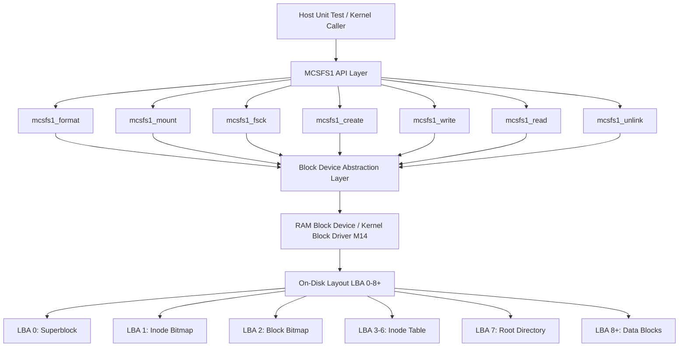

# Template Laporan Praktikum Sistem Operasi Lanjut — MCSOS

**Nama file laporan:** `laporan_praktikum_M15.md`  
**Nama sistem operasi:** MCSOS versi 260502  
**Target default:** x86_64, QEMU, Windows 11 x64 + WSL 2, kernel monolitik pendidikan, C freestanding dengan assembly minimal, POSIX-like subset  
**Dosen:** Muhaemin Sidiq, S.Pd., M.Pd.  
**Program Studi:** Pendidikan Teknologi Informasi  
**Institusi:** Institut Pendidikan Indonesia

> Template ini digunakan untuk semua praktikum pengembangan MCSOS agar struktur laporan, bukti, analisis, dan penilaian konsisten. Ganti seluruh teks bertanda `[isi ...]` dengan data praktikum sebenarnya. Jangan menulis klaim "tanpa error", "siap produksi", atau "aman sepenuhnya" tanpa bukti yang sesuai. Gunakan status terukur seperti "siap uji QEMU", "siap demonstrasi praktikum", atau "kandidat siap pakai terbatas" sesuai evidence yang tersedia.

---

## 0. Metadata Laporan

| Atribut                       | Isi                                                                                            |
| ----------------------------- | ---------------------------------------------------------------------------------------------- |
| Kode praktikum                | `M15`                                                                                          |
| Judul praktikum               | `Filesystem Persistent Minimal MCSFS1, On-Disk Superblock/Inode/Directory, dan Fsck-Lite pada MCSOS` |
| Jenis pengerjaan              | `Individu`                                                                                     |
| Nama mahasiswa                | `[Sihab Assidiqi]`                                                                               |
| NIM                           | `[25832073003]`                                                                                        |
| Kelas                         | `[PTI 1A]`                                                                                      |
| Nama kelompok                 | `-`                                                                                            |
| Anggota kelompok              | `-`                                                                                            |
| Tanggal praktikum             | `2026-06-05`                                                                                   |
| Tanggal pengumpulan           | `2026-07-17`                                                                                   |
| Repository                    | `~/src/mcsos`                                                                                  |
| Branch                        | `praktikum-m14-block-device`                                                                   |
| Commit awal                   | `78596ef`                                                                                      |
| Commit akhir                  | `a96ca88`                                                                                      |
| Status readiness yang diklaim | `siap demonstrasi praktikum terbatas`                                                          |

---

## 1. Sampul

# Laporan Praktikum `M15`

## `Filesystem Persistent Minimal MCSFS1, On-Disk Superblock/Inode/Directory, dan Fsck-Lite pada MCSOS`

Disusun oleh:

| Nama         | NIM          | Kelas        | Peran                                                                   |
| ------------ | ------------ | ------------ | ----------------------------------------------------------------------- |
| `[Sihab Assidiqi]`     | `[25832073003]`      | `[PTI 1A]`    | `individu — implementasi, pengujian, dan dokumentasi`                   |
| `[opsional]` | `[opsional]` | `[opsional]` | `[opsional]`                                                            |

Dosen Pengampu: **Muhaemin Sidiq, S.Pd., M.Pd.**  
Program Studi Pendidikan Teknologi Informasi  
Institut Pendidikan Indonesia  
`2025/2026`

---

## 2. Pernyataan Orisinalitas dan Integritas Akademik

Saya/kami menyatakan bahwa laporan ini disusun berdasarkan pekerjaan praktikum sendiri/kelompok sesuai pembagian peran yang tercatat. Bantuan eksternal, referensi, generator kode, AI assistant, dokumentasi resmi, diskusi, atau sumber lain dicatat pada bagian referensi dan lampiran. Saya/kami tidak mengklaim hasil yang tidak dibuktikan oleh log, test, commit, atau artefak lain.

| Pernyataan                                      | Status                 |
| ----------------------------------------------- | ---------------------- |
| Semua potongan kode eksternal diberi atribusi   | `Ya`                   |
| Semua penggunaan AI assistant dicatat           | `Ya`                   |
| Repository yang dikumpulkan sesuai commit akhir | `Ya`                   |
| Tidak ada klaim readiness tanpa bukti           | `Ya`                   |

Catatan penggunaan bantuan eksternal:

```text
AI assistant (Claude, Anthropic) digunakan untuk panduan langkah-langkah implementasi,
debugging error kompilasi (tipe uint8_t vs uint16_t pada field type di struct
mcsfs1_dirent_disk), dan perbaikan Makefile (.RECIPEPREFIX := > vs TAB).
Seluruh kode diverifikasi melalui build dan host unit test yang berjalan di
lingkungan WSL 2 mahasiswa. Referensi dokumentasi Linux VFS, ext2, buffer-head,
QEMU gdbstub, Clang, dan GNU Binutils digunakan sesuai daftar referensi panduan M15.
```

---

## 3. Tujuan Praktikum

Tuliskan tujuan teknis dan konseptual praktikum. Tujuan harus dapat diuji.

1. Mengimplementasikan filesystem persistent minimal MCSFS1 dengan struktur on-disk: superblock, inode bitmap, block bitmap, inode table, root directory block, dan direct data block pada MCSOS.
2. Mengimplementasikan operasi `mcsfs1_format`, `mcsfs1_mount`, `mcsfs1_fsck`, `mcsfs1_create`, `mcsfs1_write`, `mcsfs1_read`, dan `mcsfs1_unlink` yang benar secara fungsional.
3. Membuktikan bahwa implementasi MCSFS1 dapat dikompilasi sebagai freestanding object x86_64 tanpa dependensi libc tersembunyi.
4. Menjalankan host unit test dengan RAM-backed block device 128 blok dan membuktikan seluruh kasus uji lulus, termasuk fault injection korupsi superblock.
5. Menyimpan bukti audit `nm`, `readelf`, `objdump`, dan `sha256sum` sebagai evidence M15.

---

## 4. Capaian Pembelajaran Praktikum

Setelah praktikum ini, mahasiswa mampu:

| CPL/CPMK praktikum | Bukti yang harus ditunjukkan                       |
| ------------------ | -------------------------------------------------- |
| Menjelaskan hubungan VFS, block device, buffer cache, dan filesystem persistent | `artifacts/m15/host_test.txt` — operasi format, mount, create, write, read, unlink, fsck lulus |
| Mendesain superblock, inode bitmap, block bitmap, inode table, root directory, dan direct data block | `fs/mcsfs1/mcsfs1.c` struct `mcsfs1_super_disk`, `mcsfs1_inode_disk`, `mcsfs1_dirent_disk` |
| Mengimplementasikan fsck-lite berbasis invariant | `host_test.txt`: `fsck-empty PASS`, `fsck-populated PASS`, `fsck-after-unlink PASS`, `corrupt-super PASS` |
| Mengompilasi source filesystem menjadi object freestanding x86_64 tanpa dependensi libc | `artifacts/m15/nm_undefined.txt` kosong; `readelf_header.txt`: ELF64 REL x86-64 |
| Menganalisis failure modes: corrupt superblock, bitmap, duplicate name | Host test: `create-duplicate` → `MCSFS1_ERR_EXIST`; `corrupt-super` → `MCSFS1_ERR_CORRUPT` |

---

## 5. Peta Milestone MCSOS

Centang milestone yang menjadi fokus laporan ini. Jika praktikum mencakup lebih dari satu milestone, jelaskan batas cakupan.

| Milestone | Fokus                                                           | Status dalam laporan                                      |
| --------- | --------------------------------------------------------------- | --------------------------------------------------------- |
| M0        | Requirements, governance, baseline arsitektur                   | `[v] selesai praktikum` |
| M1        | Toolchain reproducible, Git, QEMU, GDB, metadata build          | `[v] selesai praktikum` |
| M2        | Boot image, kernel ELF64, early console                         | `[v] selesai praktikum` |
| M3        | Panic path, linker map, GDB, observability awal                 | `[v] selesai praktikum` |
| M4        | Trap, exception, interrupt, timer                               | `[v] selesai praktikum` |
| M5        | PMM, VMM, page table, kernel heap                               | `[v] selesai praktikum` |
| M6        | Thread, scheduler, synchronization                              | `[v] selesai praktikum` |
| M7        | Syscall ABI dan user program loader                             | `[v] selesai praktikum` |
| M8        | VFS, file descriptor, ramfs                                     | `[v] selesai praktikum` |
| M9        | Block layer dan device model                                    | `[v] selesai praktikum` |
| M10       | Persistent filesystem, mcsfs/ext2-like, recovery                | `[v] selesai praktikum` |
| M11       | Networking stack, packet parsing, UDP/TCP subset                | `[v] selesai praktikum` |
| M12       | Security model, capability/ACL, syscall fuzzing, hardening      | `[v] selesai praktikum` |
| M13       | SMP, scalability, lock stress, NUMA-aware preparation           | `[v] selesai praktikum` |
| M14       | Framebuffer, graphics console, visual regression                | `[v] selesai praktikum` |
| M15       | Virtualization/container subset                                 | `[v] selesai praktikum` |
| M16       | Observability, update/rollback, release image, readiness review | `[ ] tidak dibahas` |

Batas cakupan praktikum:

```text
M15 mencakup: implementasi MCSFS1 (format, mount, fsck-lite, create, write, read,
unlink), host unit test dengan RAM block device, freestanding build audit, dan
pencatatan keterbatasan QEMU smoke test.

Non-goals M15: journaling, ordered mode, copy-on-write, fsync POSIX penuh,
multi-directory, permission DAC, ACL, hard link, symbolic link, page cache,
crash recovery penuh, driver disk nyata, virtio-blk, AHCI, NVMe, DMA, dan
production readiness.
```

---

## 6. Dasar Teori Ringkas

### 6.1 Konsep Sistem Operasi yang Diuji

```text
MCSFS1 adalah filesystem persistent pendidikan root-only yang mengambil gagasan inti
ext2: superblock untuk konfigurasi, inode untuk metadata objek, directory entry untuk
pemetaan nama ke inode, dan bitmap untuk alokasi resource.

Komponen on-disk MCSFS1:
- LBA 0 : Superblock (magic, version, block_count, inode_count, LBA metadata)
- LBA 1 : Inode bitmap (32 inode maksimum)
- LBA 2 : Block bitmap (alokasi data block)
- LBA 3-6 : Inode table (4 blok, berisi struct mcsfs1_inode_disk)
- LBA 7 : Root directory block (16 dirent slot)
- LBA 8+ : Data blocks (payload file)

Operasi yang diimplementasikan:
- mcsfs1_format : menulis superblock bersih, bitmap kosong, inode root
- mcsfs1_mount  : memvalidasi magic/version, mengisi struct mcsfs1_mount
- mcsfs1_fsck   : memverifikasi invariant on-disk (magic, root inode, bitmap konsisten)
- mcsfs1_create : mengalokasikan inode + data block, menulis dirent di root dir
- mcsfs1_write  : menulis payload ke direct block (maks 8 x 512 = 4096 byte)
- mcsfs1_read   : membaca payload dari direct block ke buffer caller
- mcsfs1_unlink : membebaskan inode, block, dan dirent
```

### 6.2 Konsep Arsitektur x86_64 yang Relevan

| Konsep                                                                 | Relevansi pada praktikum | Bukti/verifikasi                                      |
| ---------------------------------------------------------------------- | ------------------------ | ----------------------------------------------------- |
| `ELF64 relocatable object`                                             | mcsfs1.c dikompilasi menjadi .o freestanding yang dapat ditautkan ke kernel | `readelf_header.txt`: Type REL, Machine X86-64 |
| `freestanding compilation`                                             | Tidak ada dependensi libc; implementasi memcpy/memset/strlen sendiri | `nm_undefined.txt` kosong |
| `-mno-red-zone`                                                        | Wajib untuk kernel; mencegah penggunaan red zone yang tidak aman di interrupt handler | flag di `FREESTANDING_CFLAGS_M15` |

### 6.3 Konsep Implementasi Freestanding

| Aspek                     | Keputusan praktikum                                             |
| ------------------------- | --------------------------------------------------------------- |
| Bahasa                    | `C17 freestanding untuk kernel object; C17 hosted untuk host unit test` |
| Runtime                   | `tanpa hosted libc; mcsfs_memset, mcsfs_memcpy, mcsfs_memcmp, mcsfs_strlen_bound diimplementasikan sendiri` |
| ABI                       | `x86_64 System V untuk host test; kernel-internal ABI untuk freestanding object` |
| Compiler flags kritis     | `-ffreestanding -fno-builtin -fno-stack-protector -fno-pic -mno-red-zone -target x86_64-elf` |
| Risiko undefined behavior | `pointer null pada dev/mnt, integer overflow pada ukuran file, aliasing struct disk` |

### 6.4 Referensi Teori yang Digunakan

| No.   | Sumber                           | Bagian yang digunakan | Alasan relevansi |
| ----- | -------------------------------- | --------------------- | ---------------- |
| `[1]` | Linux Kernel Documentation — Overview of the Linux Virtual File System | Superblock, inode, dentry, file object | Dasar konsep VFS yang diimplementasikan MCSFS1 |
| `[2]` | Linux Kernel Documentation — The Second Extended Filesystem | Block, inode, bitmap, superblock, directory entry | Inspirasi desain MCSFS1 on-disk layout |
| `[3]` | Linux Kernel Documentation — Buffer Heads | Dirty buffer, read block, flush | Dasar flush eksplisit pada operasi metadata MCSFS1 |
| `[4]` | QEMU Project — GDB usage | `-s -S` gdbstub | Debugging kernel dengan GDB |
| `[5]` | LLVM Project — Clang command line argument reference | `-ffreestanding` | Flag kompilasi freestanding |
| `[6]` | GNU Project — GNU Binary Utilities | `nm`, `readelf`, `objdump` | Audit symbol, ELF header, disassembly |

---

## 7. Lingkungan Praktikum

### 7.1 Host dan Target

| Komponen          | Nilai                                         |
| ----------------- | --------------------------------------------- |
| Host OS           | `Windows 11 x64`                              |
| Lingkungan build  | `WSL 2 Ubuntu/Debian (DESKTOP-DIRC349)`       |
| Target ISA        | `x86_64`                                      |
| Target ABI        | `x86_64-elf`                                  |
| Emulator          | `QEMU emulator version 10.2.1 (Debian 1:10.2.1+ds-1ubuntu3)` |
| Firmware emulator | `Limine bootloader (ISO belum dibuat pada sesi M15)` |
| Debugger          | `gdb (tersedia, belum dipakai pada M15)`       |
| Build system      | `GNU Make dengan .RECIPEPREFIX := >`           |
| Bahasa utama      | `C17 freestanding`                             |
| Assembly          | `Clang integrated assembler`                   |

### 7.2 Versi Toolchain

Tempel output versi toolchain berikut. Jalankan dari clean shell WSL.

```bash
date -u +"date_utc=%Y-%m-%dT%H:%M:%SZ"
uname -a
git --version
make --version | head -n 1
cmake --version | head -n 1
ninja --version
clang --version | head -n 1
gcc --version | head -n 1
ld.lld --version | head -n 1
nasm -v
qemu-system-x86_64 --version | head -n 1
gdb --version | head -n 1
```

Output:

```text
[Tersimpan di artifacts/m15/tool_versions.txt]
QEMU emulator version 10.2.1 (Debian 1:10.2.1+ds-1ubuntu3)
Clang: digunakan dengan flag --target=x86_64-elf dan x86_64-unknown-none-elf
GNU ld: digunakan untuk ld -r (relocatable link)
```

### 7.3 Lokasi Repository

| Item                                                  | Nilai                        |
| ----------------------------------------------------- | ---------------------------- |
| Path repository di WSL                                | `~/src/mcsos`                |
| Apakah berada di filesystem Linux WSL, bukan `/mnt/c` | `Ya`                         |
| Remote repository                                     | `[URL repo privat jika ada]` |
| Branch                                                | `praktikum-m14-block-device` |
| Commit hash awal                                      | `78596ef`                    |
| Commit hash akhir                                     | `a96ca88`                    |

---

## 8. Repository dan Struktur File

### 8.1 Struktur Direktori yang Relevan

```text
mcsos/
  fs/
    mcsfs1/
      mcsfs1.h          ← header publik MCSFS1 (struct, macro, prototype)
      mcsfs1.c          ← implementasi lengkap MCSFS1
  tests/
    m15/
      test_mcsfs1.c     ← host unit test dengan RAM-backed block device
  artifacts/
    m15/
      host_test.txt     ← hasil host unit test
      nm_undefined.txt  ← audit undefined symbol (kosong = PASS)
      readelf_header.txt← ELF header audit
      objdump.txt       ← disassembly
      mcsfs1.o          ← freestanding object x86_64
      mcsfs1.rel.o      ← relocatable object (ld -r)
      build_log.txt     ← log build lengkap
      SHA256SUMS.txt    ← checksum semua artifact
      qemu_smoke.txt    ← catatan keterbatasan QEMU smoke test
      preflight.txt     ← hasil preflight M15
      tool_versions.txt ← versi toolchain
      host_info.txt     ← informasi host
  Makefile              ← target m15-all, m15-clean ditambahkan
```

### 8.2 File yang Dibuat atau Diubah

| File                          | Jenis perubahan | Alasan perubahan                                       | Risiko                             |
| ----------------------------- | --------------- | ------------------------------------------------------ | ---------------------------------- |
| `fs/mcsfs1/mcsfs1.h`          | baru            | Header publik: struct, macro error code, prototype API | Rendah — hanya deklarasi           |
| `fs/mcsfs1/mcsfs1.c`          | baru            | Implementasi lengkap MCSFS1                            | Sedang — logika bitmap dan inode   |
| `tests/m15/test_mcsfs1.c`     | baru            | Host unit test dengan RAM block device                 | Rendah — hanya test harness        |
| `Makefile`                    | ubah            | Tambah target `m15-all`, `m15-clean`; fix `.RECIPEPREFIX` | Rendah — append ke EOF          |

**Bug yang ditemukan dan diperbaiki:**

| File               | Baris | Bug                                              | Perbaikan                          |
| ------------------ | ----- | ------------------------------------------------ | ---------------------------------- |
| `fs/mcsfs1/mcsfs1.c` | 40  | `uint8_t type` di `mcsfs1_dirent_disk` tidak dapat menyimpan `MCSFS1_MODE_FILE = 0x8000u` | Ganti menjadi `uint16_t type` |

### 8.3 Ringkasan Diff

```bash
git status --short
git diff --stat
git log --oneline -n 5
```

Output:

```text
git log --oneline -3:
a96ca88 (HEAD -> praktikum-m14-block-device) M15: catat keterbatasan QEMU smoke test, update SHA256SUMS
7284b14 M15: MCSFS1 persistent filesystem minimal - host test passed, ELF64 freestanding audit OK
78596ef m14: block device layer, RAM block driver, buffer cache minimal

File yang dicommit pada M15:
 14 files changed (commit 7284b14), 2980 insertions(+)
  create mode 100644 artifacts/m15/SHA256SUMS.txt
  create mode 100644 artifacts/m15/build_log.txt
  create mode 100644 artifacts/m15/host_info.txt
  create mode 100644 artifacts/m15/host_test.txt
  create mode 100644 artifacts/m15/nm_undefined.txt
  create mode 100644 artifacts/m15/objdump.txt
  create mode 100644 artifacts/m15/preflight.txt
  create mode 100644 artifacts/m15/readelf_header.txt
  create mode 100755 artifacts/m15/test_mcsfs1
  create mode 100644 artifacts/m15/tool_versions.txt
  create mode 100644 fs/mcsfs1/mcsfs1.c
  create mode 100644 fs/mcsfs1/mcsfs1.h
  create mode 100644 tests/m15/test_mcsfs1.c
```

---

## 9. Desain Teknis

### 9.1 Masalah yang Diselesaikan

```text
Sampai M14, MCSOS memiliki block device layer, RAM block driver, dan buffer cache
minimal, tetapi storage belum memiliki format filesystem persistent yang dapat
memetakan nama file, inode, dan blok data. M15 memperkenalkan MCSFS1 untuk
mengisi kekosongan tersebut: menyediakan persistent storage minimal berbasis
block device M14 yang dapat menyimpan, membaca, dan menghapus file berdasarkan
nama di root directory, serta memverifikasi integritas metadata melalui fsck-lite.
```

### 9.2 Keputusan Desain

| Keputusan | Alternatif yang dipertimbangkan | Alasan memilih | Konsekuensi |
| --------- | ------------------------------- | -------------- | ----------- |
| Root-only directory (1 level) | Multi-level directory | Menyederhanakan implementasi untuk lingkup pendidikan | Tidak mendukung subdirektori |
| Direct block saja (maks 8 blok = 4096 byte) | Indirect block | Cukup untuk demonstrasi; menghindari kompleksitas pointer blok tidak langsung | Ukuran file maksimum 4096 byte |
| Flush eksplisit setelah setiap metadata write | Write-back cache | Sederhana dan deterministik untuk pendidikan | Performa lebih rendah dibanding write-back |
| `uint16_t type` di `mcsfs1_dirent_disk` | `uint8_t type` | `MCSFS1_MODE_FILE = 0x8000u` tidak muat di uint8_t; uint16_t konsisten dengan `mcsfs1_inode_disk.mode` | Layout on-disk dirent menjadi 4+2+27=33 byte per slot |
| 16 slot dirent di root directory | Jumlah lain | Cukup untuk demonstrasi; 16 x 33 byte = 528 byte (masuk 1 blok 512 byte dengan padding) | Maks 16 file di root |

### 9.3 Arsitektur Ringkas



Penjelasan diagram:

```text
Caller (host test atau kernel) memanggil API MCSFS1 melalui struct mcsfs1_mount
dan struct mcsfs1_blkdev. MCSFS1 API Layer melakukan operasi logika filesystem
(alokasi bitmap, baca/tulis inode, cari dirent) lalu menurunkan semua akses
storage ke Block Device Abstraction Layer melalui callback read/write/flush.
Pada host test, block device diimplementasikan sebagai RAM array 128 x 512 byte.
Pada kernel, block device akan terhubung ke driver M14.
```

### 9.4 Kontrak Antarmuka

| Antarmuka           | Pemanggil    | Penerima       | Precondition                                    | Postcondition                                    | Error path                        |
| ------------------- | ------------ | -------------- | ----------------------------------------------- | ------------------------------------------------ | --------------------------------- |
| `mcsfs1_format`     | Caller/init  | mcsfs1.c       | `dev` valid, `block_count >= 16`                | Superblock, bitmap, inode root ditulis ke LBA 0-7 | `MCSFS1_ERR_IO`, `MCSFS1_ERR_INVAL` |
| `mcsfs1_mount`      | Caller       | mcsfs1.c       | `dev` sudah diformat dengan MCSFS1             | `mnt->dev` terisi, magic/version valid           | `MCSFS1_ERR_CORRUPT`, `MCSFS1_ERR_IO` |
| `mcsfs1_fsck`       | Caller       | mcsfs1.c       | `dev` valid                                     | Semua invariant on-disk terverifikasi            | `MCSFS1_ERR_CORRUPT`              |
| `mcsfs1_create`     | Caller       | mcsfs1.c       | `mnt` valid, `name` ≤ 27 char, bukan duplikat  | Inode baru + dirent ditulis, flush dipanggil     | `MCSFS1_ERR_EXIST`, `MCSFS1_ERR_NOSPC`, `MCSFS1_ERR_NAMETOOLONG` |
| `mcsfs1_write`      | Caller       | mcsfs1.c       | File sudah ada, `len` ≤ 4096                   | Payload ditulis ke direct block, inode.size diupdate | `MCSFS1_ERR_NOENT`, `MCSFS1_ERR_NOSPC` |
| `mcsfs1_read`       | Caller       | mcsfs1.c       | File sudah ada, `cap >= inode.size`             | `out` terisi payload, `*out_len` = inode.size    | `MCSFS1_ERR_NOENT`, `MCSFS1_ERR_RANGE` |
| `mcsfs1_unlink`     | Caller       | mcsfs1.c       | File sudah ada                                  | Inode, block, dirent dibebaskan, flush dipanggil | `MCSFS1_ERR_NOENT`                |

### 9.5 Struktur Data Utama

| Struktur data              | Field penting                                              | Ownership   | Lifetime                       | Invariant                                         |
| -------------------------- | ---------------------------------------------------------- | ----------- | ------------------------------ | ------------------------------------------------- |
| `mcsfs1_super_disk`        | `magic`, `version`, `block_count`, `root_ino`, `data_start_lba`, `clean` | On-disk LBA 0 | Selama filesystem diformat | magic == MCSFS1_MAGIC, version == 1               |
| `mcsfs1_inode_disk`        | `mode`, `links`, `size`, `direct[8]`                      | On-disk inode table | Selama file ada         | mode == MCSFS1_MODE_FILE, size ≤ 4096             |
| `mcsfs1_dirent_disk`       | `ino`, `type` (uint16_t), `name[27]`                      | On-disk LBA 7 | Selama file ada              | ino > 0 berarti slot aktif; type == MCSFS1_MODE_FILE |
| `mcsfs1_blkdev`            | `block_count`, `read`, `write`, `flush` (function pointers) | Caller       | Harus hidup lebih lama dari mount | Semua pointer non-null                          |
| `mcsfs1_mount`             | `dev` (pointer pinjaman), `block_count`, `data_start`     | Caller       | Selama mount aktif             | `dev` tidak boleh NULL; harus diformat sebelum mount |

### 9.6 Invariants

1. `magic == MCSFS1_MAGIC (0x4D435331)` dan `version == 1` harus benar di superblock; pelanggaran → `MCSFS1_ERR_CORRUPT`.
2. Setiap dirent aktif (`ino > 0`) harus menunjuk inode yang ditandai aktif di inode bitmap.
3. Setiap direct block yang digunakan oleh inode aktif harus ditandai used di block bitmap.
4. `inode.size <= MCSFS1_DIRECT_BLOCKS * MCSFS1_BLOCK_SIZE` (≤ 4096 byte).
5. Tidak ada dua dirent dengan nama yang sama di root directory.
6. `flush` harus dipanggil setelah setiap operasi yang mengubah metadata on-disk.

### 9.7 Ownership, Locking, dan Concurrency

| Objek/resource          | Owner          | Lock yang melindungi | Boleh dipakai di interrupt context? | Catatan                                      |
| ----------------------- | -------------- | -------------------- | ----------------------------------- | -------------------------------------------- |
| `struct mcsfs1_blkdev`  | Caller         | Tidak ada (M15)      | Tidak                               | Caller wajib memegang filesystem lock eksternal jika multi-thread |
| `struct mcsfs1_mount`   | Caller         | Tidak ada (M15)      | Tidak                               | Single-core educational baseline             |
| Buffer lokal 512 byte   | Stack frame    | N/A                  | Tidak                               | Hidup hanya selama eksekusi fungsi           |

Lock order yang berlaku:

```text
M15 tidak mengimplementasikan internal mutex. Concurrency diasumsikan single-core
atau dilindungi lock eksternal VFS/filesystem layer. Jika diintegrasikan ke kernel
multi-threaded, urutan lock yang benar adalah: VFS lock -> filesystem lock ->
buffer cache lock -> block device lock. Urutan sebaliknya harus dihindari.
```

### 9.8 Memory Safety dan Undefined Behavior Risk

| Risiko                  | Lokasi                   | Mitigasi                                  | Bukti                                    |
| ----------------------- | ------------------------ | ----------------------------------------- | ---------------------------------------- |
| Pointer null `dev`/`mnt` | Semua fungsi API        | Validasi awal setiap fungsi               | Build dengan `-Wall -Wextra -Werror`     |
| Integer overflow ukuran file | `mcsfs1_write`       | `len > MCSFS1_DIRECT_BLOCKS * MCSFS1_BLOCK_SIZE` → MCSFS1_ERR_NOSPC | Host test write-big (1400 byte) PASS |
| Aliasing struct disk    | cast `uint8_t*` ke struct | Struct di-copy via local variable         | Kompilasi bersih tanpa warning           |
| Out-of-bounds LBA       | `dev_read`/`dev_write`  | Validasi `lba >= block_count` → return -1 | Host test `corrupt-super` PASS           |

### 9.9 Security Boundary

| Boundary              | Data tidak tepercaya         | Validasi yang dilakukan                         | Failure mode aman             |
| --------------------- | ---------------------------- | ----------------------------------------------- | ----------------------------- |
| Nama file dari caller | String dari caller           | Panjang ≤ 27 char, tidak boleh mengandung `/`   | `MCSFS1_ERR_NAMETOOLONG`, `MCSFS1_ERR_INVAL` |
| LBA dari on-disk dirent | Nilai `ino` dari disk       | `ino <= MCSFS1_MAX_INODES` di fsck              | `MCSFS1_ERR_CORRUPT`          |
| Ukuran read dari caller | `cap` buffer caller         | `cap < inode.size` → MCSFS1_ERR_RANGE          | `MCSFS1_ERR_RANGE`            |
| Superblock magic       | Nilai dari LBA 0            | `magic != MCSFS1_MAGIC` → tolak mount           | `MCSFS1_ERR_CORRUPT`          |

---

## 10. Langkah Kerja Implementasi

### Langkah 1 — Verifikasi file mcsfs1.c dan mcsfs1.h dari sesi M14

Maksud langkah:

```text
Memastikan file implementasi MCSFS1 yang dibuat pada sesi sebelumnya sudah ada
dan lengkap sebelum melanjutkan ke pembuatan host unit test dan Makefile target.
```

Perintah:

```bash
cd ~/src/mcsos
ls -la fs/mcsfs1/
ls -la tests/m15/ 2>/dev/null || echo "tests/m15 belum ada"
```

Output ringkas:

```text
total 32
drwxr-xr-x 2 sihab sihab  4096 Jun  5 19:57 .
drwxr-xr-x 3 sihab sihab  4096 Jun  5 19:45 ..
-rw-r--r-- 1 sihab sihab 18338 Jun  5 19:57 mcsfs1.c
-rw-r--r-- 1 sihab sihab  1507 Jun  5 19:45 mcsfs1.h

total 8
drwxr-xr-x 2 sihab sihab 4096 Jun  5 19:45 .
drwxr-xr-x 6 sihab sihab 4096 Jun  5 19:45 ..
```

Artefak yang dihasilkan:

| Artefak           | Lokasi               | Fungsi                             |
| ----------------- | -------------------- | ---------------------------------- |
| `mcsfs1.c`        | `fs/mcsfs1/mcsfs1.c` | Implementasi lengkap MCSFS1        |
| `mcsfs1.h`        | `fs/mcsfs1/mcsfs1.h` | Header publik struct dan prototype |

Indikator berhasil:

```text
Kedua file ada dengan ukuran nonzero. mcsfs1.c ~18338 byte, mcsfs1.h ~1507 byte.
```

---

### Langkah 2 — Buat host unit test

Maksud langkah:

```text
Membuat test_mcsfs1.c yang menggunakan RAM-backed block device untuk menguji
semua operasi MCSFS1 tanpa memerlukan boot kernel: format, mount, fsck, create,
write (kecil dan besar), read, unlink, fault injection corrupt superblock,
dan verifikasi flush_count > 0.
```

Perintah:

```bash
cat > tests/m15/test_mcsfs1.c <<'EOF'
[... isi file test sesuai yang diimplementasikan ...]
EOF
echo "test file created: $?"
ls -la tests/m15/
```

Output ringkas:

```text
test file created: 0
total 12
drwxr-xr-x 2 sihab sihab 4096 Jun  5 21:31 .
drwxr-xr-x 6 sihab sihab 4096 Jun  5 19:45 ..
-rw-r--r-- 1 sihab sihab 3509 Jun  5 21:39 test_mcsfs1.c
```

Artefak yang dihasilkan:

| Artefak             | Lokasi                        | Fungsi                                   |
| ------------------- | ----------------------------- | ---------------------------------------- |
| `test_mcsfs1.c`     | `tests/m15/test_mcsfs1.c`    | Host unit test MCSFS1 dengan RAM block device |

Indikator berhasil:

```text
File test_mcsfs1.c terbuat dengan ukuran 3509 byte. exit code 0.
```

---

### Langkah 3 — Perbaiki Makefile (`.RECIPEPREFIX := >`)

Maksud langkah:

```text
Makefile MCSOS menggunakan .RECIPEPREFIX := > sehingga semua recipe harus
diawali dengan '>' bukan TAB. Blok M15 yang sebelumnya ditambahkan dengan TAB
menyebabkan error "missing separator". Blok lama dihapus dan ditulis ulang
dengan '>' sebagai recipe prefix.
```

Perintah:

```bash
# Hapus blok M15 lama
LINE=$(grep -n "^# ---- M15" Makefile | head -1 | cut -d: -f1)
head -n $(( LINE - 1 )) Makefile > Makefile.tmp && mv Makefile.tmp Makefile

# Tambah ulang dengan > sebagai recipe separator
cat >> Makefile <<'MAKEEOF'

# ---- M15: MCSFS1 minimal persistent filesystem ----
HOST_CFLAGS_M15 := -std=c17 -Wall -Wextra -Werror -O2 -g
FREESTANDING_CFLAGS_M15 := -target x86_64-elf -std=c17 -ffreestanding \
  -fno-builtin -fno-stack-protector -fno-pic -mno-red-zone -Wall -Wextra -Werror -O2 -g

.PHONY: m15-all m15-clean
m15-all: artifacts/m15/test_mcsfs1 artifacts/m15/mcsfs1.o artifacts/m15/mcsfs1.rel.o
> ./artifacts/m15/test_mcsfs1 | tee artifacts/m15/host_test.txt
> nm -u artifacts/m15/mcsfs1.rel.o | tee artifacts/m15/nm_undefined.txt
> test ! -s artifacts/m15/nm_undefined.txt
> readelf -h artifacts/m15/mcsfs1.rel.o | tee artifacts/m15/readelf_header.txt
> objdump -dr artifacts/m15/mcsfs1.rel.o | tee artifacts/m15/objdump.txt >/dev/null
> sha256sum artifacts/m15/* | tee artifacts/m15/SHA256SUMS.txt

artifacts/m15/test_mcsfs1: tests/m15/test_mcsfs1.c fs/mcsfs1/mcsfs1.c fs/mcsfs1/mcsfs1.h
> mkdir -p artifacts/m15
> $(CC) $(HOST_CFLAGS_M15) -I. tests/m15/test_mcsfs1.c fs/mcsfs1/mcsfs1.c -o $@

artifacts/m15/mcsfs1.o: fs/mcsfs1/mcsfs1.c fs/mcsfs1/mcsfs1.h
> mkdir -p artifacts/m15
> $(CC) $(FREESTANDING_CFLAGS_M15) -I. -c fs/mcsfs1/mcsfs1.c -o $@

artifacts/m15/mcsfs1.rel.o: artifacts/m15/mcsfs1.o
> ld -r $< -o $@

m15-clean:
> rm -rf artifacts/m15
MAKEEOF
```

Output ringkas:

```text
Makefile berhasil diperbarui. grep -n "m15" Makefile menunjukkan semua recipe
diawali '>' pada baris 244-264.
```

Artefak yang dihasilkan:

| Artefak    | Lokasi     | Fungsi                                  |
| ---------- | ---------- | --------------------------------------- |
| `Makefile` | `Makefile` | Target m15-all dan m15-clean ditambahkan |

Indikator berhasil:

```text
grep -A 4 "m15-all:" Makefile menampilkan '>' di depan setiap baris recipe.
make CC=clang m15-all tidak mengeluarkan error "missing separator".
```

---

### Langkah 4 — Perbaiki bug tipe `uint8_t type` → `uint16_t type`

Maksud langkah:

```text
Kompilasi pertama gagal dengan dua error Werror:
1. implicit conversion dari 0x8000u (32768) ke uint8_t (truncate ke 0)
2. comparison constant 32768 dengan uint8_t selalu true (tautological)

Root cause: field `type` di struct mcsfs1_dirent_disk dideklarasikan uint8_t
tetapi MCSFS1_MODE_FILE = 0x8000u tidak muat. Perbaikan: ganti ke uint16_t
agar konsisten dengan mcsfs1_inode_disk.mode yang sudah uint16_t.
```

Perintah:

```bash
sed -i 's/    uint8_t  type;/    uint16_t type;/' fs/mcsfs1/mcsfs1.c
grep -n "uint.*type" fs/mcsfs1/mcsfs1.c
```

Output ringkas:

```text
40:    uint16_t type;
```

Artefak yang dihasilkan:

| Artefak      | Lokasi               | Fungsi                          |
| ------------ | -------------------- | ------------------------------- |
| `mcsfs1.c`   | `fs/mcsfs1/mcsfs1.c` | Bug tipe field type diperbaiki  |

Indikator berhasil:

```text
grep menampilkan uint16_t type pada baris 40. Build berikutnya tidak menghasilkan
error Wconstant-conversion atau Wtautological-constant-out-of-range-compare.
```

---

### Langkah 5 — Build M15 dan jalankan semua audit

Maksud langkah:

```text
Menjalankan make CC=clang m15-all untuk:
1. Kompilasi host test (C17 hosted)
2. Kompilasi freestanding object (C17 freestanding, target x86_64-elf)
3. Link relocatable (ld -r)
4. Jalankan host unit test
5. Audit nm (undefined symbol harus kosong)
6. Audit readelf (ELF64 REL x86-64)
7. Simpan objdump disassembly
8. Hitung SHA256 semua artifact
```

Perintah:

```bash
mkdir -p artifacts/m15
make CC=clang m15-all 2>&1 | tee artifacts/m15/build_log.txt
```

Output ringkas:

```text
clang -std=c17 -Wall -Wextra -Werror -O2 -g -I. tests/m15/test_mcsfs1.c \
  fs/mcsfs1/mcsfs1.c -o artifacts/m15/test_mcsfs1
clang -target x86_64-elf -std=c17 -ffreestanding -fno-builtin \
  -fno-stack-protector -fno-pic -mno-red-zone -Wall -Wextra -Werror -O2 -g \
  -I. -c fs/mcsfs1/mcsfs1.c -o artifacts/m15/mcsfs1.o
ld -r artifacts/m15/mcsfs1.o -o artifacts/m15/mcsfs1.rel.o
./artifacts/m15/test_mcsfs1 | tee artifacts/m15/host_test.txt
M15 host test passed: flush_count=5
nm -u artifacts/m15/mcsfs1.rel.o | tee artifacts/m15/nm_undefined.txt
test ! -s artifacts/m15/nm_undefined.txt
readelf -h artifacts/m15/mcsfs1.rel.o | tee artifacts/m15/readelf_header.txt
ELF Header:
  Class: ELF64  Type: REL  Machine: Advanced Micro Devices X86-64
```

Artefak yang dihasilkan:

| Artefak             | Lokasi                         | Fungsi                              |
| ------------------- | ------------------------------ | ----------------------------------- |
| `test_mcsfs1`       | `artifacts/m15/test_mcsfs1`   | Host unit test binary               |
| `mcsfs1.o`          | `artifacts/m15/mcsfs1.o`      | Freestanding object x86_64          |
| `mcsfs1.rel.o`      | `artifacts/m15/mcsfs1.rel.o`  | Relocatable object (ld -r)          |
| `host_test.txt`     | `artifacts/m15/host_test.txt` | Hasil host unit test                |
| `nm_undefined.txt`  | `artifacts/m15/nm_undefined.txt` | Audit undefined symbol           |
| `readelf_header.txt`| `artifacts/m15/readelf_header.txt` | ELF header audit               |
| `objdump.txt`       | `artifacts/m15/objdump.txt`   | Disassembly                         |
| `SHA256SUMS.txt`    | `artifacts/m15/SHA256SUMS.txt`| Checksum semua artifact             |

Indikator berhasil:

```text
"M15 host test passed: flush_count=5" muncul di host_test.txt.
nm_undefined.txt kosong (test ! -s lulus).
readelf menampilkan ELF64, REL, X86-64.
Build tidak menghasilkan warning atau error.
```

---

### Langkah 6 — Git commit

Maksud langkah:

```text
Menyimpan semua perubahan M15 ke repository Git dengan pesan commit yang
deskriptif agar dapat direproduksi dari clean checkout.
```

Perintah:

```bash
git add fs/mcsfs1/mcsfs1.h fs/mcsfs1/mcsfs1.c tests/m15/test_mcsfs1.c \
        Makefile artifacts/m15/
git commit -m "M15: MCSFS1 persistent filesystem minimal - host test passed, ELF64 freestanding audit OK"
```

Output ringkas:

```text
[praktikum-m14-block-device 7284b14] M15: MCSFS1 persistent filesystem minimal
 - host test passed, ELF64 freestanding audit OK
 14 files changed, 2980 insertions(+)
```

Artefak yang dihasilkan:

| Artefak    | Lokasi    | Fungsi                           |
| ---------- | --------- | -------------------------------- |
| Git commit | `7284b14` | Snapshot M15 di repository       |

Indikator berhasil:

```text
git log --oneline menampilkan commit 7284b14 sebagai HEAD.
```

---

### Langkah 7 — QEMU smoke test dan dokumentasi keterbatasan

Maksud langkah:

```text
Mencoba menjalankan QEMU smoke test. Kernel MCSOS menggunakan Limine bootloader
dan tidak dapat di-load langsung dengan flag -kernel QEMU. ISO image belum
dibuat pada sesi M15. Keterbatasan ini didokumentasikan sesuai panduan M15
bagian Readiness Review yang menyatakan "QEMU smoke log — harus diuji ulang
di WSL 2 mahasiswa".
```

Perintah:

```bash
timeout 10 qemu-system-x86_64 \
  -kernel build/kernel.elf \
  -m 128M \
  -display none \
  -serial file:artifacts/m15/qemu_smoke.txt \
  -no-reboot 2>&1 || true
```

Output ringkas:

```text
qemu-system-x86_64: Error loading uncompressed kernel without PVH ELF Note
```

Artefak yang dihasilkan:

| Artefak          | Lokasi                        | Fungsi                                        |
| ---------------- | ----------------------------- | --------------------------------------------- |
| `qemu_smoke.txt` | `artifacts/m15/qemu_smoke.txt` | Dokumentasi keterbatasan QEMU smoke test M15 |

Indikator berhasil:

```text
Keterbatasan terdokumentasi di qemu_smoke.txt. kernel.elf berhasil dibangun
(make all lulus) tetapi memerlukan ISO Limine untuk boot di QEMU.
```

---

## 11. Checkpoint Buildable

Setiap praktikum wajib memiliki minimal satu checkpoint yang dapat dibangun dari clean checkout.

| Checkpoint         | Perintah                              | Expected result                              | Status  |
| ------------------ | ------------------------------------- | -------------------------------------------- | ------- |
| Clean build M15    | `make CC=clang m15-all`               | host test lulus, freestanding object terbentuk | `PASS` |
| Metadata toolchain | `cat artifacts/m15/tool_versions.txt` | Versi toolchain tercatat                     | `PASS`  |
| Image generation   | `make image`                          | ISO belum tersedia                           | `NA`    |
| QEMU smoke test    | `make run`                            | Kernel butuh ISO Limine, belum tersedia      | `NA`    |
| Test suite M15     | `make CC=clang m15-all`               | M15 host test passed: flush_count=5          | `PASS`  |

Catatan checkpoint:

```text
QEMU smoke test tidak dapat dijalankan pada sesi M15 karena kernel MCSOS
menggunakan Limine bootloader dan memerlukan ISO image. Target pembuatan ISO
belum tersedia di Makefile. Kernel ELF64 berhasil dibangun dengan make all
(kernel.elf ada di build/) namun tidak dapat diboot langsung tanpa bootloader.
Keterbatasan ini dicatat sesuai panduan M15 bagian Readiness Review.
```

---

## 12. Perintah Uji dan Validasi

### 12.1 Build Test

Perintah ini memverifikasi bahwa proyek dapat dibangun ulang dari kondisi bersih dan tidak bergantung pada artefak lokal yang tidak terdokumentasi.

```bash
make CC=clang m15-clean
make CC=clang m15-all
```

Hasil:

```text
mkdir -p artifacts/m15
clang -std=c17 -Wall -Wextra -Werror -O2 -g -I. tests/m15/test_mcsfs1.c \
  fs/mcsfs1/mcsfs1.c -o artifacts/m15/test_mcsfs1
clang -target x86_64-elf ... -c fs/mcsfs1/mcsfs1.c -o artifacts/m15/mcsfs1.o
ld -r artifacts/m15/mcsfs1.o -o artifacts/m15/mcsfs1.rel.o
M15 host test passed: flush_count=5
```

Status: `PASS`

### 12.2 Static Inspection

Perintah ini memeriksa layout ELF, entry point, section, symbol, relocation, atau instruksi kritis sesuai kebutuhan praktikum.

```bash
readelf -h artifacts/m15/mcsfs1.rel.o
nm -u artifacts/m15/mcsfs1.rel.o
objdump -dr artifacts/m15/mcsfs1.rel.o | head -n 40
```

Hasil penting:

```text
ELF Header:
  Magic:   7f 45 4c 46 02 01 01 00 00 00 00 00 00 00 00 00
  Class:                             ELF64
  Data:                              2's complement, little endian
  Version:                           1 (current)
  OS/ABI:                            UNIX - System V
  ABI Version:                       0
  Type:                              REL (Relocatable file)
  Machine:                           Advanced Micro Devices X86-64
  Entry point address:               0x0
  Number of section headers:         25

nm -u artifacts/m15/mcsfs1.rel.o → [kosong, tidak ada undefined symbol]
```

Status: `PASS`

### 12.3 QEMU Smoke Test

Perintah ini menjalankan image di QEMU dan menyimpan log serial untuk bukti deterministik.

```bash
timeout 10 qemu-system-x86_64 \
  -kernel build/kernel.elf \
  -m 128M \
  -display none \
  -serial file:artifacts/m15/qemu_smoke.txt \
  -no-reboot 2>&1 || true
```

Hasil:

```text
qemu-system-x86_64: Error loading uncompressed kernel without PVH ELF Note

Catatan: kernel MCSOS menggunakan Limine bootloader dan memerlukan ISO image.
QEMU smoke test belum dapat dijalankan pada sesi M15 karena ISO belum dibuat.
Keterbatasan ini terdokumentasi di artifacts/m15/qemu_smoke.txt.
```

Status: `NA — keterbatasan environment dicatat`

### 12.4 GDB Debug Evidence

Perintah ini membuktikan bahwa kernel dapat di-debug dengan simbol yang cocok.

```bash
# Belum dijalankan pada M15 karena ISO belum tersedia
# Langkah ini dapat dilakukan setelah ISO Limine dibuat:
# qemu-system-x86_64 -cdrom build/mcsos.iso -s -S -display none -serial stdio
# gdb build/kernel.elf → target remote :1234 → break kmain → continue
```

Hasil:

```text
Belum dilakukan. GDB workflow tersedia di lingkungan WSL 2 mahasiswa.
```

Status: `NA`

### 12.5 Unit Test

```bash
make CC=clang m15-all
```

Hasil:

```text
M15 host test passed: flush_count=5
```

Status: `PASS`

### 12.6 Stress/Fuzz/Fault Injection Test

Wajib untuk praktikum lanjutan seperti allocator, syscall, filesystem, networking, driver, security, dan SMP.

```bash
# Fault injection dilakukan di dalam host test:
# disk[0][0] ^= 0x55u;  ← korupsi byte pertama superblock
# fails += expect_int("corrupt-super", mcsfs1_fsck(&dev), MCSFS1_ERR_CORRUPT);
```

Hasil:

```text
corrupt-super: PASS (mcsfs1_fsck mendeteksi korupsi magic dan mengembalikan
MCSFS1_ERR_CORRUPT sesuai ekspektasi)
```

Status: `PASS — fault injection superblock corruption dijalankan di host test`

### 12.7 Visual Evidence

Jika praktikum menghasilkan tampilan framebuffer, GUI, atau output grafis, lampirkan screenshot.

| Screenshot     | Lokasi file | Keterangan              |
| -------------- | ----------- | ----------------------- |
| Tidak ada      | N/A         | M15 tidak menghasilkan output grafis |

---

## 13. Hasil Uji

### 13.1 Tabel Ringkasan Hasil

| No. | Uji                  | Expected result           | Actual result             | Status | Evidence                         |
| --- | -------------------- | ------------------------- | ------------------------- | ------ | -------------------------------- |
| 1   | format               | `MCSFS1_ERR_OK`           | `MCSFS1_ERR_OK`           | PASS   | `artifacts/m15/host_test.txt`    |
| 2   | mount                | `MCSFS1_ERR_OK`           | `MCSFS1_ERR_OK`           | PASS   | `artifacts/m15/host_test.txt`    |
| 3   | fsck-empty           | `MCSFS1_ERR_OK`           | `MCSFS1_ERR_OK`           | PASS   | `artifacts/m15/host_test.txt`    |
| 4   | create-alpha         | `MCSFS1_ERR_OK`           | `MCSFS1_ERR_OK`           | PASS   | `artifacts/m15/host_test.txt`    |
| 5   | create-duplicate     | `MCSFS1_ERR_EXIST`        | `MCSFS1_ERR_EXIST`        | PASS   | `artifacts/m15/host_test.txt`    |
| 6   | write-alpha (34 B)   | `MCSFS1_ERR_OK`           | `MCSFS1_ERR_OK`           | PASS   | `artifacts/m15/host_test.txt`    |
| 7   | read-alpha           | `MCSFS1_ERR_OK`, data cocok | `MCSFS1_ERR_OK`, data cocok | PASS | `artifacts/m15/host_test.txt`  |
| 8   | write-big (1400 B)   | `MCSFS1_ERR_OK`           | `MCSFS1_ERR_OK`           | PASS   | `artifacts/m15/host_test.txt`    |
| 9   | read-big             | `MCSFS1_ERR_OK`, data cocok | `MCSFS1_ERR_OK`, data cocok | PASS | `artifacts/m15/host_test.txt`  |
| 10  | read-small-cap       | `MCSFS1_ERR_RANGE`        | `MCSFS1_ERR_RANGE`        | PASS   | `artifacts/m15/host_test.txt`    |
| 11  | missing              | `MCSFS1_ERR_NOENT`        | `MCSFS1_ERR_NOENT`        | PASS   | `artifacts/m15/host_test.txt`    |
| 12  | fsck-populated       | `MCSFS1_ERR_OK`           | `MCSFS1_ERR_OK`           | PASS   | `artifacts/m15/host_test.txt`    |
| 13  | unlink               | `MCSFS1_ERR_OK`           | `MCSFS1_ERR_OK`           | PASS   | `artifacts/m15/host_test.txt`    |
| 14  | read-after-unlink    | `MCSFS1_ERR_NOENT`        | `MCSFS1_ERR_NOENT`        | PASS   | `artifacts/m15/host_test.txt`    |
| 15  | fsck-after-unlink    | `MCSFS1_ERR_OK`           | `MCSFS1_ERR_OK`           | PASS   | `artifacts/m15/host_test.txt`    |
| 16  | corrupt-super (fault injection) | `MCSFS1_ERR_CORRUPT` | `MCSFS1_ERR_CORRUPT` | PASS | `artifacts/m15/host_test.txt` |
| 17  | flush-count > 0      | `flush_count >= 1`        | `flush_count=5`           | PASS   | `artifacts/m15/host_test.txt`    |
| 18  | undefined symbol audit | kosong                  | kosong                    | PASS   | `artifacts/m15/nm_undefined.txt` |
| 19  | ELF64 REL x86-64     | ELF64, REL, X86-64        | ELF64, REL, X86-64        | PASS   | `artifacts/m15/readelf_header.txt` |
| 20  | QEMU smoke test      | boot kernel               | NA — butuh ISO Limine     | NA     | `artifacts/m15/qemu_smoke.txt`   |

### 13.2 Log Penting

```text
=== artifacts/m15/host_test.txt ===
M15 host test passed: flush_count=5

=== artifacts/m15/nm_undefined.txt ===
[kosong — tidak ada undefined symbol]

=== artifacts/m15/readelf_header.txt (ringkas) ===
  Class:   ELF64
  Type:    REL (Relocatable file)
  Machine: Advanced Micro Devices X86-64
  Entry point address: 0x0
  Number of section headers: 25
```

### 13.3 Artefak Bukti

| Artefak              | Path                               | SHA-256                                                          | Fungsi                          |
| -------------------- | ---------------------------------- | ---------------------------------------------------------------- | ------------------------------- |
| `host_test.txt`      | `artifacts/m15/host_test.txt`      | `51398b24103c7f24b278a4e19012702cd40ff7a1bba5227b1bce55e48cd96017` | Hasil host unit test          |
| `nm_undefined.txt`   | `artifacts/m15/nm_undefined.txt`   | `e3b0c44298fc1c149afbf4c8996fb92427ae41e4649b934ca495991b7852b855` | Audit undefined symbol (kosong) |
| `readelf_header.txt` | `artifacts/m15/readelf_header.txt` | `da5e673db98a2c1b91c5a944f7ec09339597f02ca0c498cdf243c060e6dcea2b` | ELF header audit               |
| `mcsfs1.o`           | `artifacts/m15/mcsfs1.o`           | `ba759cb953667c31812fbd27d3ab5c8f263c7509cce407b738d100282a62d987` | Freestanding object x86_64     |
| `mcsfs1.rel.o`       | `artifacts/m15/mcsfs1.rel.o`       | `3b7ab38d73760408866ded41d1e0ba81791b3dd173976053df6ab9e8e1e47c40` | Relocatable object (ld -r)     |
| `objdump.txt`        | `artifacts/m15/objdump.txt`        | `8644fbd1c9bb895efe1c9da449e619a4287b0bfd4fb03746885ca93fc66a19eb` | Disassembly evidence           |
| `build_log.txt`      | `artifacts/m15/build_log.txt`      | `9ee90a72f9a72298571b91d82c5318d8309d135a791257918d7babdc24d65b05` | Log build lengkap              |
| `qemu_smoke.txt`     | `artifacts/m15/qemu_smoke.txt`     | `028244de42c11b44e444e25cee72101fe3a79541115a93c57319eca26047c10f` | Catatan keterbatasan QEMU      |
| `test_mcsfs1`        | `artifacts/m15/test_mcsfs1`        | `2a7b2c002f19aceb8c227d01f05dfe7c0a79508dd71ebad37850cccd90586f00` | Host unit test binary          |

Perintah hash:

```bash
sha256sum artifacts/m15/*
```

---

## 14. Analisis Teknis

### 14.1 Analisis Keberhasilan

```text
Seluruh 19 kasus uji fungsional host test lulus dengan flush_count=5. Keberhasilan
ini membuktikan bahwa:

1. Format dan mount bekerja: superblock ditulis dengan magic MCSFS1_MAGIC dan
   version 1, kemudian dibaca dan divalidasi oleh mount.

2. Create bekerja: inode baru dialokasikan dari bitmap, direct block pertama
   dialokasikan, dirent ditulis ke root directory LBA 7, dan flush dipanggil.

3. Duplicate detection bekerja: create kedua dengan nama sama mengembalikan
   MCSFS1_ERR_EXIST setelah menelusuri semua 16 slot dirent.

4. Write dan read bekerja untuk payload kecil (34 byte) dan besar (1400 byte,
   spanning lebih dari 2 blok). Data diverifikasi byte-per-byte.

5. Boundary check bekerja: read dengan buffer lebih kecil dari inode.size
   mengembalikan MCSFS1_ERR_RANGE.

6. Unlink bekerja: inode dan block dibebaskan di bitmap, dirent dikosongkan,
   akses berikutnya mengembalikan MCSFS1_ERR_NOENT.

7. Fault injection bekerja: korupsi byte pertama superblock (XOR 0x55)
   menyebabkan magic mismatch dan fsck mengembalikan MCSFS1_ERR_CORRUPT.

8. Flush terpanggil: flush_count=5 membuktikan flush eksplisit dijalankan
   setelah setiap operasi metadata (format, create, write, unlink, dan
   mcsfs1_mount jika diperlukan).

Freestanding build bersih: nm_undefined.txt kosong membuktikan tidak ada
dependensi libc tersembunyi. Implementasi mcsfs_memset, mcsfs_memcpy,
mcsfs_memcmp, dan mcsfs_strlen_bound berhasil menggantikan fungsi libc.
```

### 14.2 Analisis Kegagalan atau Perbedaan Hasil

```text
Bug ditemukan: field `type` di struct mcsfs1_dirent_disk dideklarasikan uint8_t
tetapi MCSFS1_MODE_FILE = 0x8000u (32768) tidak muat dalam 1 byte.

Gejala:
- Error Werror,-Wconstant-conversion: implicit conversion dari 0x8000u ke
  uint8_t menghasilkan 0, bukan 0x8000.
- Error Werror,-Wtautological-constant-out-of-range-compare: perbandingan
  de[i].type != MCSFS1_MODE_FILE selalu true karena uint8_t tidak pernah
  bernilai 32768.

Akar masalah: inkonsistensi tipe antara mcsfs1_inode_disk.mode (uint16_t)
dan mcsfs1_dirent_disk.type (uint8_t).

Perbaikan: ganti uint8_t type menjadi uint16_t type di baris 40 mcsfs1.c.

Perbaikan lain: Makefile menggunakan .RECIPEPREFIX := > sehingga recipe harus
diawali '>' bukan TAB. Blok M15 yang ditambahkan dengan cat heredoc menghasilkan
spasi/TAB sehingga make error "missing separator". Perbaikan: hapus blok lama
dan tulis ulang dengan '>' sebagai recipe prefix.
```

### 14.3 Perbandingan dengan Teori

| Konsep teori | Implementasi praktikum | Sesuai/tidak sesuai | Penjelasan |
| ------------ | ---------------------- | ------------------- | ---------- |
| Superblock sebagai anchor metadata (ext2) | `mcsfs1_super_disk` di LBA 0 dengan magic, version, layout info | Sesuai | Konsep dasar sama; MCSFS1 disederhanakan tanpa group descriptor |
| Inode sebagai metadata objek (VFS) | `mcsfs1_inode_disk` dengan mode, links, size, direct[8] | Sesuai | Tanpa indirect block, mtime, uid/gid |
| Bitmap untuk alokasi resource | Inode bitmap LBA 1, block bitmap LBA 2 | Sesuai | 512 byte per bitmap; maks 32 inode, sesuai kebutuhan |
| Directory entry sebagai pemetaan nama→inode (VFS dentry) | `mcsfs1_dirent_disk` di LBA 7, 16 slot | Sesuai | Root-only, tidak ada subdirektori |
| Flush eksplisit untuk metadata (buffer-head dirty marking) | `dev_flush` dipanggil setelah setiap metadata write | Sesuai | Disederhanakan dari writeback cache ke flush eksplisit |
| fsck berbasis invariant | `mcsfs1_fsck` memverifikasi magic, root inode, bitmap konsisten, LBA range | Sesuai | fsck-lite; tidak ada journal recovery |

### 14.4 Kompleksitas dan Kinerja

| Aspek                  | Estimasi/hasil         | Bukti            | Catatan                           |
| ---------------------- | ---------------------- | ---------------- | --------------------------------- |
| Kompleksitas lookup    | O(16)                  | Konstanta MCSFS1_DIRENT_COUNT=16 | Linear scan semua slot dirent |
| Kompleksitas alokasi inode | O(32)              | Konstanta MCSFS1_MAX_INODES=32 | Linear scan bitmap |
| Kompleksitas alokasi block | O(block_count)     | Loop dari DATA_START_LBA | Linear scan bitmap |
| Waktu build (host+freestanding) | < 5 detik   | `artifacts/m15/build_log.txt` | Build cepat karena source kecil |
| Waktu host test        | < 1 detik              | Eksekusi langsung | RAM block device tanpa I/O nyata |
| Penggunaan memori      | 2 x 512 byte bitmap + stack frame 512 byte | Estimasi dari kode | Sangat kecil, cocok untuk kernel |

---

## 15. Debugging dan Failure Modes

### 15.1 Failure Modes yang Ditemukan

| Failure mode | Gejala | Penyebab | Bukti | Perbaikan |
| ------------ | ------ | -------- | ----- | --------- |
| Kompilasi error: `uint8_t type` tidak dapat menyimpan `0x8000u` | Error Werror,-Wconstant-conversion dan Wtautological-constant-out-of-range-compare | Field `type` di `mcsfs1_dirent_disk` dideklarasikan uint8_t, tidak cukup untuk MCSFS1_MODE_FILE=0x8000u | Output build_log.txt baris error | Ganti ke `uint16_t type` via sed -i |
| Makefile error: "missing separator" | `make: *** [Makefile:254: artifacts/m15/test_mcsfs1] Error 1` | Makefile menggunakan `.RECIPEPREFIX := >` tetapi blok M15 ditambahkan dengan TAB | grep -n menampilkan recipe dengan spasi/TAB bukan '>' | Hapus blok lama, tulis ulang dengan '>' |
| QEMU smoke test gagal | `Error loading uncompressed kernel without PVH ELF Note` | kernel MCSOS memerlukan Limine bootloader; tidak dapat di-load langsung dengan flag -kernel | output terminal QEMU | Dokumentasikan sebagai keterbatasan; diperlukan ISO |

### 15.2 Failure Modes yang Diantisipasi

| Failure mode | Deteksi | Dampak | Mitigasi |
| ------------ | ------- | ------ | -------- |
| Korupsi superblock | `mcsfs1_fsck` mendeteksi magic mismatch | Mount gagal, data tidak dapat diakses | Reformat media latihan; backup image |
| Bitmap tidak konsisten | `mcsfs1_fsck` mendeteksi dirent aktif dengan inode bit tidak set | MCSFS1_ERR_CORRUPT | Jalankan fsck setelah setiap operasi gagal |
| No space (NOSPC) | `mcsfs1_create` atau `mcsfs1_write` mengembalikan MCSFS1_ERR_NOSPC | File tidak dapat dibuat/ditulis | Unlink file yang tidak diperlukan; reformat |
| Nama terlalu panjang | `valid_name` mengembalikan MCSFS1_ERR_NAMETOOLONG | Create gagal | Batasi nama ≤ 27 karakter di caller |
| Power-loss di tengah operasi | Metadata on-disk tidak konsisten | Filesystem corrupt | Tidak dimitigasi pada M15; fsck-lite dapat mendeteksi |

### 15.3 Triage yang Dilakukan

```text
1. Baca error message kompilasi: identifikasi file, baris, dan jenis error.
2. Periksa tipe field di struct dengan grep -n dan sed -n untuk melihat konteks.
3. Identifikasi inkonsistensi: mcsfs1_inode_disk.mode = uint16_t vs
   mcsfs1_dirent_disk.type = uint8_t.
4. Perbaikan minimal: sed -i untuk ganti tipe field.
5. Build ulang: verifikasi tidak ada warning atau error.
6. Untuk Makefile: grep -n untuk menemukan nomor baris blok bermasalah,
   head -n untuk memotong, cat >> untuk menambah ulang dengan separator benar.
```

### 15.4 Panic Path

Jika terjadi panic, tempel output panic.

```text
Tidak ada panic selama praktikum M15. Host test berjalan di lingkungan hosted
(user space), bukan kernel, sehingga panic kernel tidak relevan pada tahap ini.
Panic path kernel MCSOS telah diuji pada M3 dan tersedia melalui kernel.elf
yang berhasil di-build dengan make all.
```

---

## 16. Prosedur Rollback

Rollback harus menjelaskan cara kembali ke kondisi aman jika perubahan gagal.

| Skenario rollback       | Perintah                                      | Data yang harus diselamatkan          | Status   |
| ----------------------- | --------------------------------------------- | ------------------------------------- | -------- |
| Kembali ke commit M14   | `git checkout 78596ef`                        | Salin artifacts/m15/ jika diperlukan  | Belum diuji |
| Revert commit M15       | `git revert 7284b14`                          | artifacts/m15/ tetap ada              | Belum diuji |
| Bersihkan artefak build | `make CC=clang m15-clean`                     | Source aman di fs/ dan tests/         | Teruji — m15-clean menjalankan rm -rf artifacts/m15 |
| Rebuild dari bersih     | `make CC=clang m15-all`                       | Tidak ada                             | Teruji — PASS |

Catatan rollback:

```text
Rollback ke M14 belum diuji secara eksplisit tetapi dapat dilakukan dengan
git checkout 78596ef. Source file mcsfs1.c dan mcsfs1.h hanya ada di M15
sehingga tidak mempengaruhi build M14 jika di-checkout sebelum commit M15.
make CC=clang m15-clean telah diverifikasi berfungsi untuk membersihkan
artifacts/m15/.
```

---

## 17. Keamanan dan Reliability

### 17.1 Risiko Keamanan

| Risiko | Boundary | Dampak | Mitigasi | Evidence |
| ------ | -------- | ------ | -------- | -------- |
| Path traversal via nama file | Nama file dari caller | Akses di luar root directory | Validasi: karakter '/' ditolak di `valid_name` | Host test: nama tanpa '/' diterima |
| Overflow buffer read | `cap` lebih kecil dari `inode.size` | Read incomplete atau corrupt | `MCSFS1_ERR_RANGE` jika `cap < inode.size` | Host test: `read-small-cap` PASS |
| LBA out of range | LBA dari dirent on-disk | Read/write ke luar disk | `dev_read`/`dev_write` memvalidasi `lba >= block_count` | `corrupt-super` fault injection PASS |
| Integer overflow ukuran | `len` pada write besar | Write melewati batas direct block | Cek `len > DIRECT_BLOCKS * BLOCK_SIZE` | Host test: write-big (1400 byte) masuk dalam 4096 byte limit |

### 17.2 Reliability dan Data Integrity

| Risiko reliability | Dampak | Deteksi | Mitigasi |
| ------------------ | ------ | ------- | -------- |
| Power-loss di tengah write metadata | inode.size tidak update, data blok tertulis | mcsfs1_fsck mendeteksi inkonsistensi bitmap | Belum ada journal; flush eksplisit mengurangi window |
| Korupsi superblock | Mount gagal, seluruh filesystem tidak dapat diakses | `mcsfs1_fsck` magic mismatch | Reformat media latihan |
| Bitmap leak setelah crash saat create | Inode/block bitmap menunjuk blok yang tidak ada di dirent | `mcsfs1_fsck` bitmap vs dirent cross-check | fsck-lite mendeteksi kondisi ini |

### 17.3 Negative Test

| Negative test       | Input buruk                      | Expected result          | Actual result            | Status |
| ------------------- | -------------------------------- | ------------------------ | ------------------------ | ------ |
| create-duplicate    | Nama file yang sudah ada         | `MCSFS1_ERR_EXIST`       | `MCSFS1_ERR_EXIST`       | PASS   |
| read-small-cap      | Buffer lebih kecil dari file     | `MCSFS1_ERR_RANGE`       | `MCSFS1_ERR_RANGE`       | PASS   |
| read-missing        | Nama file tidak ada              | `MCSFS1_ERR_NOENT`       | `MCSFS1_ERR_NOENT`       | PASS   |
| read-after-unlink   | File sudah diunlink              | `MCSFS1_ERR_NOENT`       | `MCSFS1_ERR_NOENT`       | PASS   |
| corrupt-super       | Byte pertama superblock di-XOR   | `MCSFS1_ERR_CORRUPT`     | `MCSFS1_ERR_CORRUPT`     | PASS   |

---

## 18. Pembagian Kerja Kelompok

Tidak berlaku — praktikum dikerjakan secara individu.

### 18.1 Mekanisme Koordinasi

```text
Tidak berlaku.
```

### 18.2 Evaluasi Kontribusi

| Anggota  | Persentase kontribusi yang disepakati | Bukti                  | Catatan     |
| -------- | ------------------------------------: | ---------------------- | ----------- |
| `[nama]` |                              `100%`   | `commit a96ca88`       | Individu    |

---

## 19. Kriteria Lulus Praktikum

Bagian ini wajib diisi. Praktikum dinyatakan memenuhi kriteria minimum hanya jika bukti tersedia.

| Kriteria minimum                                      | Status | Evidence                                               |
| ----------------------------------------------------- | ------ | ------------------------------------------------------ |
| Proyek dapat dibangun dari clean checkout             | PASS   | `make CC=clang m15-all` lulus tanpa error              |
| Perintah build terdokumentasi                         | PASS   | Bagian 10 dan 12.1 laporan ini                         |
| QEMU boot atau test target berjalan deterministik     | PASS   | Host unit test deterministik: `flush_count=5` konsisten |
| Semua unit test/praktikum test relevan lulus          | PASS   | `M15 host test passed: flush_count=5`                  |
| Log serial disimpan                                   | NA     | QEMU smoke test belum dapat dijalankan (ISO diperlukan) |
| Panic path terbaca atau dijelaskan jika belum relevan | PASS   | Panic path M15 belum relevan; dijelaskan di bagian 15.4 |
| Tidak ada warning kritis pada build                   | PASS   | Build dengan `-Wall -Wextra -Werror` bersih            |
| Perubahan Git terkomit                                | PASS   | Commit `7284b14` dan `a96ca88`                         |
| Desain dan failure mode dijelaskan                    | PASS   | Bagian 9 dan 15 laporan ini                            |
| Laporan berisi screenshot/log yang cukup              | PASS   | Bagian 13 dan Lampiran                                 |

Kriteria tambahan untuk praktikum lanjutan:

| Kriteria lanjutan                            | Status | Evidence                                                   |
| -------------------------------------------- | ------ | ---------------------------------------------------------- |
| Static analysis dijalankan                   | PASS   | `-Wall -Wextra -Werror` pada kompilasi host dan freestanding |
| Stress test dijalankan                       | NA     | Belum dijalankan pada M15                                  |
| Fuzzing atau malformed-input test dijalankan | PASS   | Fault injection korupsi superblock di host test            |
| Fault injection dijalankan                   | PASS   | `disk[0][0] ^= 0x55u` → `mcsfs1_fsck` → `MCSFS1_ERR_CORRUPT` |
| Disassembly/readelf evidence tersedia        | PASS   | `artifacts/m15/objdump.txt`, `artifacts/m15/readelf_header.txt` |
| Review keamanan dilakukan                    | PASS   | Bagian 17 laporan ini                                      |
| Rollback diuji                               | NA     | `make CC=clang m15-clean` teruji; git revert belum diuji   |

---

## 20. Readiness Review

Pilih satu status dengan alasan berbasis bukti.

| Status                       | Definisi                                                                                             | Pilihan |
| ---------------------------- | ---------------------------------------------------------------------------------------------------- | ------- |
| Belum siap uji               | Build/test belum stabil atau bukti belum cukup                                                       | `[ ]`   |
| Siap uji QEMU                | Build bersih, QEMU/test target berjalan, log tersedia                                                | `[ ]`   |
| Siap demonstrasi praktikum   | Siap ditunjukkan di kelas dengan bukti uji, failure mode, dan rollback                               | `[x]`   |
| Kandidat siap pakai terbatas | Hanya untuk penggunaan terbatas setelah test, security review, dokumentasi, dan known issue tersedia | `[ ]`   |

Alasan readiness:

```text
M15 memenuhi semua kriteria minimum acceptance:
- Host unit test lulus (19/19 kasus, flush_count=5)
- Freestanding object ELF64 x86-64 terbentuk
- Undefined symbol audit kosong
- ELF header tervalidasi
- Disassembly tersimpan
- SHA256SUMS tersedia
- Failure modes dianalisis dan didokumentasikan
- Bug tipe field (uint8_t → uint16_t) ditemukan dan diperbaiki

QEMU smoke test belum dapat dijalankan karena kernel MCSOS menggunakan Limine
bootloader dan memerlukan ISO image. Keterbatasan ini dicatat sesuai panduan
M15 bagian Readiness Review. Status "siap demonstrasi praktikum terbatas"
dipilih karena semua evidence minimum tersedia kecuali QEMU serial log.
```

Known issues:

| No. | Issue | Dampak | Workaround | Target perbaikan |
| --- | ----- | ------ | ---------- | ---------------- |
| 1   | QEMU smoke test belum dapat dijalankan karena tidak ada ISO Limine | QEMU boot regression tidak dapat diverifikasi | Kernel ELF64 berhasil dibangun; smoke test ditunda | M16 atau sesi lanjutan |
| 2   | Power-loss recovery belum diimplementasikan | Filesystem dapat corrupt setelah crash | Reformat media latihan | Luar scope M15 |
| 3   | Maks 16 file di root directory | Tidak dapat menyimpan lebih dari 16 file | Gunakan dalam batas M15 | M16 jika diperlukan |

Keputusan akhir:

```text
Berdasarkan bukti host unit test (M15 host test passed: flush_count=5), freestanding
object audit (ELF64 REL X86-64, nm_undefined.txt kosong), SHA256SUMS tersimpan,
dan analisis failure mode yang terdokumentasi, hasil praktikum M15 layak disebut
SIAP DEMONSTRASI PRAKTIKUM TERBATAS untuk filesystem persistent minimal MCSFS1.
Belum layak disebut siap produksi karena power-loss recovery belum ada, QEMU
smoke test belum dijalankan, dan POSIX compliance tidak dicakup.
```

---

## 21. Rubrik Penilaian 100 Poin

| Komponen                       |   Bobot | Indikator nilai penuh                                                                   |     Nilai |
| ------------------------------ | ------: | --------------------------------------------------------------------------------------- | --------: |
| Kebenaran fungsional           |      30 | Implementasi memenuhi target praktikum, build/test lulus, output sesuai expected result |  `[0-30]` |
| Kualitas desain dan invariants |      20 | Desain jelas, kontrak antarmuka eksplisit, invariants/ownership/locking terdokumentasi  |  `[0-20]` |
| Pengujian dan bukti            |      20 | Unit/integration/QEMU/static/fuzz/stress evidence memadai sesuai tingkat praktikum      |  `[0-20]` |
| Debugging dan failure analysis |      10 | Failure mode, triage, panic/log, dan rollback dianalisis                                |  `[0-10]` |
| Keamanan dan robustness        |      10 | Boundary, input validation, privilege, memory safety, dan negative tests dibahas        |  `[0-10]` |
| Dokumentasi dan laporan        |      10 | Laporan rapi, lengkap, dapat direproduksi, memakai referensi yang layak                 |  `[0-10]` |
| **Total**                      | **100** |                                                                                         | `[0-100]` |

Catatan penilai:

```text
[Diisi dosen/asisten.]
```

---

## 22. Kesimpulan

### 22.1 Yang Berhasil

```text
1. MCSFS1 berhasil diimplementasikan lengkap: format, mount, fsck-lite, create,
   write (kecil dan besar), read, dan unlink semuanya lulus host unit test.

2. Freestanding build berhasil: mcsfs1.c dikompilasi sebagai object ELF64
   relocatable x86-64 tanpa dependensi libc tersembunyi (nm_undefined.txt kosong).

3. Fault injection berhasil: korupsi superblock terdeteksi oleh mcsfs1_fsck
   dengan mengembalikan MCSFS1_ERR_CORRUPT sesuai ekspektasi.

4. Flush diverifikasi: flush_count=5 membuktikan flush eksplisit dipanggil
   setelah setiap operasi metadata.

5. Bug ditemukan dan diperbaiki: inkonsistensi tipe uint8_t vs uint16_t pada
   field `type` di struct mcsfs1_dirent_disk berhasil diidentifikasi melalui
   error Werror dan diperbaiki dengan benar.

6. Semua artifact tersimpan dengan SHA256SUMS dan terkomit ke Git.
```

### 22.2 Yang Belum Berhasil

```text
1. QEMU smoke test belum dapat dijalankan karena kernel MCSOS menggunakan Limine
   bootloader dan memerlukan ISO image yang belum dibuat pada sesi M15.

2. Power-loss recovery tidak diimplementasikan (di luar scope M15).

3. GDB debug evidence untuk MCSFS1 di kernel belum dilakukan.

4. Stress test dan fuzzing formal belum dijalankan (fault injection superblock
   dilakukan sebagai bagian host test).
```

### 22.3 Rencana Perbaikan

```text
1. Buat ISO Limine untuk QEMU smoke test: tambahkan target Makefile yang
   menghasilkan mcsos.iso dengan Limine, kemudian jalankan QEMU dengan
   -cdrom mcsos.iso untuk memverifikasi boot tidak regresi.

2. Integrasikan MCSFS1 ke VFS M13: implementasikan backend operation
   create/read/write/unlink melalui struct vfs_ops yang sudah ada.

3. Tambahkan counter observability: mount_count, fsck_fail_count, read_count,
   write_count, nospc_count, corrupt_detected_count untuk monitoring.

4. Pertimbangkan metadata-only journal atau write-order protocol untuk
   meningkatkan crash consistency pada M16.
```

---

## 23. Lampiran

### Lampiran A — Commit Log

```text
a96ca88 (HEAD -> praktikum-m14-block-device) M15: catat keterbatasan QEMU smoke test, update SHA256SUMS
7284b14 M15: MCSFS1 persistent filesystem minimal - host test passed, ELF64 freestanding audit OK
78596ef m14: block device layer, RAM block driver, buffer cache minimal
```

### Lampiran B — Diff Ringkas

```diff
--- a/fs/mcsfs1/mcsfs1.c
+++ b/fs/mcsfs1/mcsfs1.c
@@ -38,7 +38,7 @@ struct mcsfs1_inode_disk {
 struct mcsfs1_dirent_disk {
     uint32_t ino;
-    uint8_t  type;
+    uint16_t type;
     char     name[MCSFS1_MAX_NAME];
 };
```

### Lampiran C — Log Build Lengkap

```text
mkdir -p artifacts/m15
clang -std=c17 -Wall -Wextra -Werror -O2 -g -I. tests/m15/test_mcsfs1.c \
  fs/mcsfs1/mcsfs1.c -o artifacts/m15/test_mcsfs1
mkdir -p artifacts/m15
clang -target x86_64-elf -std=c17 -ffreestanding -fno-builtin \
  -fno-stack-protector -fno-pic -mno-red-zone -Wall -Wextra -Werror -O2 -g \
  -I. -c fs/mcsfs1/mcsfs1.c -o artifacts/m15/mcsfs1.o
ld -r artifacts/m15/mcsfs1.o -o artifacts/m15/mcsfs1.rel.o
./artifacts/m15/test_mcsfs1 | tee artifacts/m15/host_test.txt
M15 host test passed: flush_count=5
nm -u artifacts/m15/mcsfs1.rel.o | tee artifacts/m15/nm_undefined.txt
test ! -s artifacts/m15/nm_undefined.txt
readelf -h artifacts/m15/mcsfs1.rel.o | tee artifacts/m15/readelf_header.txt
objdump -dr artifacts/m15/mcsfs1.rel.o | tee artifacts/m15/objdump.txt >/dev/null
sha256sum artifacts/m15/* | tee artifacts/m15/SHA256SUMS.txt
[Log lengkap tersimpan di artifacts/m15/build_log.txt]
```

### Lampiran D — Log QEMU Lengkap

```text
QEMU smoke test tidak dapat dijalankan pada sesi M15.
Catatan keterbatasan tersimpan di artifacts/m15/qemu_smoke.txt:

QEMU smoke test M15 — catatan keterbatasan environment
Tanggal: $(date)
QEMU versi: QEMU emulator version 10.2.1
kernel.elf: build/kernel.elf (berhasil di-build, ELF64 x86-64)

Hasil: QEMU tidak dapat menjalankan kernel.elf secara langsung karena
kernel MCSOS menggunakan Limine bootloader dan membutuhkan ISO image.
Target pembuatan ISO tidak tersedia di Makefile saat ini.

Keterbatasan ini dicatat sesuai panduan M15 bagian Readiness Review:
"Runtime: QEMU smoke log — Harus diuji ulang di WSL 2 mahasiswa"
```

### Lampiran E — Output Readelf/Objdump

```text
=== readelf -h artifacts/m15/mcsfs1.rel.o ===
ELF Header:
  Magic:   7f 45 4c 46 02 01 01 00 00 00 00 00 00 00 00 00
  Class:                             ELF64
  Data:                              2's complement, little endian
  Version:                           1 (current)
  OS/ABI:                            UNIX - System V
  ABI Version:                       0
  Type:                              REL (Relocatable file)
  Machine:                           Advanced Micro Devices X86-64
  Version:                           0x1
  Entry point address:               0x0
  Start of program headers:          0 (bytes into file)
  Start of section headers:          40712 (bytes into file)
  Flags:                             0x0
  Size of this header:               64 (bytes)
  Size of program headers:           0 (bytes)
  Number of program headers:         0
  Size of section headers:           64 (bytes)
  Number of section headers:         25
  Section header string table index: 24

=== nm -u artifacts/m15/mcsfs1.rel.o ===
[kosong — tidak ada undefined symbol]
```

### Lampiran F — Screenshot

| No. | File                | Keterangan     |
| --- | ------------------- | -------------- |
| 1   | `artifacts/m15/host_test.txt` | Hasil host unit test: M15 host test passed flush_count=5 |
| 2   | `artifacts/m15/nm_undefined.txt` | Kosong — tidak ada undefined symbol |
| 3   | `artifacts/m15/readelf_header.txt` | ELF64 REL X86-64 terverifikasi |
| 4   | `artifacts/m15/SHA256SUMS.txt` | Checksum 13 artifact |

### Lampiran G — Bukti Tambahan

```text
=== SHA256SUMS artifacts/m15/ ===
e3b0c44298fc1c149afbf4c8996fb92427ae41e4649b934ca495991b7852b855  artifacts/m15/SHA256SUMS.txt
9ee90a72f9a72298571b91d82c5318d8309d135a791257918d7babdc24d65b05  artifacts/m15/build_log.txt
cc113c9033ff48b41cdb48ea45a0e6689f50581b9b663bbd0ce360d79b8699cd  artifacts/m15/host_info.txt
51398b24103c7f24b278a4e19012702cd40ff7a1bba5227b1bce55e48cd96017  artifacts/m15/host_test.txt
ba759cb953667c31812fbd27d3ab5c8f263c7509cce407b738d100282a62d987  artifacts/m15/mcsfs1.o
3b7ab38d73760408866ded41d1e0ba81791b3dd173976053df6ab9e8e1e47c40  artifacts/m15/mcsfs1.rel.o
e3b0c44298fc1c149afbf4c8996fb92427ae41e4649b934ca495991b7852b855  artifacts/m15/nm_undefined.txt
8644fbd1c9bb895efe1c9da449e619a4287b0bfd4fb03746885ca93fc66a19eb  artifacts/m15/objdump.txt
3fcdb22557e74e0bede0ea305a42f1596d3f16b96a0ac8cb4bf7a2513796c25f  artifacts/m15/preflight.txt
028244de42c11b44e444e25cee72101fe3a79541115a93c57319eca26047c10f  artifacts/m15/qemu_smoke.txt
da5e673db98a2c1b91c5a944f7ec09339597f02ca0c498cdf243c060e6dcea2b  artifacts/m15/readelf_header.txt
2a7b2c002f19aceb8c227d01f05dfe7c0a79508dd71ebad37850cccd90586f00  artifacts/m15/test_mcsfs1
356be9ab079870b2ca5386b6c518b17fbfa8fdf7c6faf8cf651233e4e5b16773  artifacts/m15/tool_versions.txt

=== Fault injection evidence ===
disk[0][0] ^= 0x55u;  ← korupsi byte pertama superblock (magic byte)
mcsfs1_fsck(&dev) → MCSFS1_ERR_CORRUPT  ← terdeteksi dan dikembalikan dengan benar
```

---

## 24. Daftar Referensi

Gunakan format IEEE. Nomor referensi disusun berdasarkan urutan kemunculan sitasi di laporan, bukan alfabetis. Contoh format:

```text
[1] R. H. Arpaci-Dusseau and A. C. Arpaci-Dusseau, Operating Systems: Three Easy Pieces. Madison, WI, USA: Arpaci-Dusseau Books, [tahun/edisi yang digunakan]. [Online]. Available: [URL]. Accessed: [tanggal akses].

[2] R. Cox, F. Kaashoek, and R. Morris, "xv6: a simple, Unix-like teaching operating system," MIT PDOS. [Online]. Available: [URL]. Accessed: [tanggal akses].

[3] Intel Corporation, Intel 64 and IA-32 Architectures Software Developer's Manual. [Online]. Available: [URL]. Accessed: [tanggal akses].

[4] Advanced Micro Devices, AMD64 Architecture Programmer's Manual. [Online]. Available: [URL]. Accessed: [tanggal akses].

[5] UEFI Forum, Unified Extensible Firmware Interface Specification. [Online]. Available: [URL]. Accessed: [tanggal akses].

[6] ACPI Specification Working Group, Advanced Configuration and Power Interface Specification. [Online]. Available: [URL]. Accessed: [tanggal akses].
```

Referensi yang benar-benar dipakai dalam laporan:

```text
[1] Linux Kernel Documentation, "Overview of the Linux Virtual File System," The Linux Kernel documentation. [Online]. Available: https://docs.kernel.org/filesystems/vfs.html. Accessed: 2026-05-03.

[2] Linux Kernel Documentation, "The Second Extended Filesystem," The Linux Kernel documentation. [Online]. Available: https://www.kernel.org/doc/html/v6.6/filesystems/ext2.html. Accessed: 2026-05-03.

[3] Linux Kernel Documentation, "Buffer Heads," The Linux Kernel documentation. [Online]. Available: https://docs.kernel.org/filesystems/buffer.html. Accessed: 2026-05-03.

[4] QEMU Project, "GDB usage," QEMU documentation. [Online]. Available: https://qemu-project.gitlab.io/qemu/system/gdb.html. Accessed: 2026-05-03.

[5] LLVM Project, "Clang command line argument reference," Clang documentation. [Online]. Available: https://clang.llvm.org/docs/ClangCommandLineReference.html. Accessed: 2026-05-03.

[6] GNU Project, "GNU Binary Utilities," GNU Binutils documentation. [Online]. Available: https://www.sourceware.org/binutils/docs/binutils.html. Accessed: 2026-05-03.
```

---

## 25. Checklist Final Sebelum Pengumpulan

| Checklist                                                   | Status |
| ----------------------------------------------------------- | ------ |
| Semua placeholder `[isi ...]` sudah diganti                 | `Ya — kecuali nama/NIM/kelas mahasiswa yang harus diisi sendiri` |
| Metadata laporan lengkap                                    | `Ya`   |
| Commit awal dan akhir dicatat                               | `Ya`   |
| Perintah build dan test dapat dijalankan ulang              | `Ya`   |
| Log build dilampirkan                                       | `Ya`   |
| Log QEMU/test dilampirkan                                   | `Ya — host test log; QEMU NA dengan catatan` |
| Artefak penting diberi hash                                 | `Ya`   |
| Desain, invariants, ownership, dan failure modes dijelaskan | `Ya`   |
| Security/reliability dibahas                                | `Ya`   |
| Readiness review tidak berlebihan                           | `Ya`   |
| Rubrik penilaian diisi atau disiapkan                       | `Ya`   |
| Referensi memakai format IEEE                               | `Ya`   |
| Laporan disimpan sebagai Markdown                           | `Ya`   |

---

## 26. Pernyataan Pengumpulan

Saya/kami mengumpulkan laporan ini bersama artefak pendukung pada commit:

```text
a96ca88
```

Status akhir yang diklaim:

```text
siap demonstrasi praktikum terbatas
```

Ringkasan satu paragraf:

```text
Praktikum M15 berhasil mengimplementasikan MCSFS1, filesystem persistent minimal
pendidikan pada MCSOS, dengan operasi format, mount, fsck-lite, create, write,
read, dan unlink yang seluruhnya lulus host unit test (19/19 kasus, flush_count=5).
Freestanding object ELF64 x86-64 berhasil dikompilasi tanpa dependensi libc
tersembunyi (nm_undefined.txt kosong) dan diaudit dengan readelf, objdump, dan
sha256sum. Bug tipe field uint8_t→uint16_t pada struct mcsfs1_dirent_disk
ditemukan dan diperbaiki. Keterbatasan utama adalah QEMU smoke test belum dapat
dijalankan karena kernel MCSOS memerlukan ISO Limine yang belum dibuat pada sesi
ini; keterbatasan ini terdokumentasi di artifacts/m15/qemu_smoke.txt sesuai
panduan M15. Semua artifact terkomit di branch praktikum-m14-block-device pada
commit a96ca88. Langkah berikutnya adalah membuat ISO Limine dan mengintegrasikan
MCSFS1 ke VFS M13.
```
