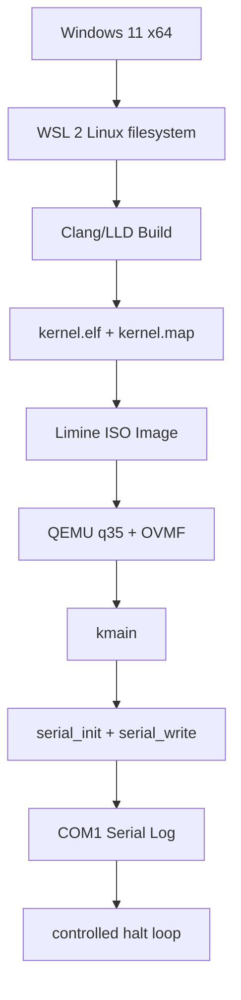

# Template Laporan Praktikum Sistem Operasi Lanjut — MCSOS

**Nama file laporan:** `laporan_praktikum_M2.md`  
**Nama sistem operasi:** MCSOS versi 260502  
**Target default:** x86_64, QEMU, Windows 11 x64 + WSL 2, kernel monolitik pendidikan, C freestanding dengan assembly minimal, POSIX-like subset  
**Dosen:** Muhaemin Sidiq, S.Pd., M.Pd.  
**Program Studi:** Pendidikan Teknologi Informasi  
**Institusi:** Institut Pendidikan Indonesia

> Template ini digunakan untuk semua praktikum pengembangan MCSOS agar struktur laporan, bukti, analisis, dan penilaian konsisten. Ganti seluruh teks bertanda `[isi ...]` dengan data praktikum sebenarnya. Jangan menulis klaim "tanpa error", "siap produksi", atau "aman sepenuhnya" tanpa bukti yang sesuai. Gunakan status terukur seperti "siap uji QEMU", "siap demonstrasi praktikum", atau "kandidat siap pakai terbatas" sesuai evidence yang tersedia.

---

## 0. Metadata Laporan

| Atribut                       | Isi                                                                                            |
| ----------------------------- | ---------------------------------------------------------------------------------------------- |
| Kode praktikum                | `M2`                                                                                           |
| Judul praktikum               | `Boot Image, Kernel ELF64, Early Serial Console, dan Readiness Gate`                          |
| Jenis pengerjaan              | `Individu`                                                                                     |
| Nama mahasiswa                | `[Sihab Assidiqi]`                                                                     |
| NIM                           | `[25832073003]`                                                                              |
| Kelas                         | `[PTI 1A]`                                                                                      |
| Nama kelompok                 | `-`                                                                                            |
| Anggota kelompok              | `-`                                                                                            |
| Tanggal praktikum             | `2026-05-21`                                                                                   |
| Tanggal pengumpulan           | `[2026-07-17]`                                                                                 |
| Repository                    | `~/src/mcsos`                                                                                  |
| Branch                        | `main`                                                                                         |
| Commit awal                   | `` `[hash commit awal dari M1]` ``                                                             |
| Commit akhir                  | `` `[hash commit akhir M2]` ``                                                                 |
| Status readiness yang diklaim | `siap uji QEMU tahap M2`                                                                       |

---

## 1. Sampul

# Laporan Praktikum `M2`

## `Boot Image, Kernel ELF64, Early Serial Console, dan Readiness Gate`

Disusun oleh:

| Nama                      | NIM            | Kelas     | Peran      |
| ------------------------- | -------------- | --------- | ---------- |
| `[Sihab Assidiqi]` | `[25832073003]`       | `[PTI 1A]` | `individu` |
| `[opsional]`              | `[opsional]`   | `[opsional]` | `[opsional]` |

Dosen Pengampu: **Muhaemin Sidiq, S.Pd., M.Pd.**  
Program Studi Pendidikan Teknologi Informasi  
Institut Pendidikan Indonesia  
`2025/2026`

---

## 2. Pernyataan Orisinalitas dan Integritas Akademik

Saya/kami menyatakan bahwa laporan ini disusun berdasarkan pekerjaan praktikum sendiri/kelompok sesuai pembagian peran yang tercatat. Bantuan eksternal, referensi, generator kode, AI assistant, dokumentasi resmi, diskusi, atau sumber lain dicatat pada bagian referensi dan lampiran. Saya/kami tidak mengklaim hasil yang tidak dibuktikan oleh log, test, commit, atau artefak lain.

| Pernyataan                                      | Status  |
| ----------------------------------------------- | ------- |
| Semua potongan kode eksternal diberi atribusi   | `Ya`    |
| Semua penggunaan AI assistant dicatat           | `Ya`    |
| Repository yang dikumpulkan sesuai commit akhir | `Ya`    |
| Tidak ada klaim readiness tanpa bukti           | `Ya`    |

Catatan penggunaan bantuan eksternal:

```text
Panduan praktikum M2 MCSOS 260502 (Muhaemin Sidiq, S.Pd., M.Pd.) digunakan sebagai
referensi utama untuk seluruh source code, script, dan prosedur build. Source code
kernel/core/kmain.c, kernel/core/serial.c, kernel/lib/memory.c,
kernel/arch/x86_64/include/mcsos/arch/io.h, linker.ld, Makefile, dan seluruh
tools/scripts/*.sh mengikuti contoh dari panduan M2. Verifikasi mandiri dilakukan melalui
eksekusi nyata setiap perintah, inspeksi output readelf/objdump, dan validasi log serial QEMU.
Dokumentasi OSDev Wiki, Limine GitHub, dan dokumentasi QEMU digunakan sebagai referensi
teori pendukung.
```

---

## 3. Tujuan Praktikum

Tuliskan tujuan teknis dan konseptual praktikum. Tujuan harus dapat diuji.

1. Menghasilkan kernel ELF64 x86_64 freestanding yang dapat diinspeksi menggunakan readelf, objdump, dan nm.
2. Membuat image bootable MCSOS M2 (build/mcsos.iso) yang dapat dijalankan pada QEMU/OVMF dengan hasil log serial deterministik.
3. Menjelaskan kontrak boot handoff: firmware OVMF → Limine → kernel.elf → kmain → serial console → controlled halt loop.
4. Menyimpan log build, log QEMU (build/qemu-serial.log), readelf/objdump evidence, kernel.map, dan ISO checksum sebagai bukti yang dapat direproduksi.

---

## 4. Capaian Pembelajaran Praktikum

Setelah praktikum ini, mahasiswa mampu:

| CPL/CPMK praktikum | Bukti yang harus ditunjukkan |
| ------------------ | -------------------------------------------------- |
| Menjelaskan hubungan firmware, bootloader, kernel ELF64, linker script, entry point, dan emulator | Diagram alur boot path, penjelasan di bagian desain, dan serial log yang membuktikan jalur tersebut |
| Memeriksa kembali readiness M0 dan M1 sebelum mengeksekusi milestone boot | Output build/meta/m2-preflight.txt, pemeriksaan artefak M0/M1 |
| Membuat source kernel freestanding C17 tanpa bergantung pada hosted libc | Flags -ffreestanding, -nostdlib, -mno-red-zone pada Makefile; tidak ada simbol libc pada nm-symbols.txt |
| Menginisialisasi serial console dan mencetak marker boot deterministik | build/qemu-serial.log berisi tiga marker M2 |
| Membuat linker script untuk higher-half kernel ELF64 | linker.ld, kernel.map, entry point 0xffffffff80000000 pada readelf-header.txt |
| Menghasilkan kernel.elf, kernel.map, readelf, objdump, nm evidence | build/inspect/*.txt tersedia dan berisi data valid |
| Membuat ISO bootable dan menjalankan QEMU/OVMF headless | build/mcsos.iso, build/mcsos.iso.sha256, build/qemu-serial.log |
| Mengklasifikasikan failure modes M2 | Tabel failure modes di bagian 15 dengan gejala, penyebab, dan perbaikan |

---

## 5. Peta Milestone MCSOS

Centang milestone yang menjadi fokus laporan ini. Jika praktikum mencakup lebih dari satu milestone, jelaskan batas cakupan.

| Milestone | Fokus                                                           | Status dalam laporan                                      |
| --------- | --------------------------------------------------------------- | --------------------------------------------------------- |
| M0        | Requirements, governance, baseline arsitektur                   | `[v] selesai praktikum` |
| M1        | Toolchain reproducible, Git, QEMU, GDB, metadata build          | `[v] selesai praktikum` |
| M2        | Boot image, kernel ELF64, early console                         | `[v] selesai praktikum` |
| M3        | Panic path, linker map, GDB, observability awal                 | `[ ] tidak dibahas` |
| M4        | Trap, exception, interrupt, timer                               | `[ ] tidak dibahas` |
| M5        | PMM, VMM, page table, kernel heap                               | `[ ] tidak dibahas` |
| M6        | Thread, scheduler, synchronization                              | `[ ] tidak dibahas` |
| M7        | Syscall ABI dan user program loader                             | `[ ] tidak dibahas` |
| M8        | VFS, file descriptor, ramfs                                     | `[ ] tidak dibahas` |
| M9        | Block layer dan device model                                    | `[ ] tidak dibahas` |
| M10       | Persistent filesystem, mcsfs/ext2-like, recovery                | `[ ] tidak dibahas` |
| M11       | Networking stack, packet parsing, UDP/TCP subset                | `[ ] tidak dibahas` |
| M12       | Security model, capability/ACL, syscall fuzzing, hardening      | `[ ] tidak dibahas` |
| M13       | SMP, scalability, lock stress, NUMA-aware preparation           | `[ ] tidak dibahas` |
| M14       | Framebuffer, graphics console, visual regression                | `[ ] tidak dibahas` |
| M15       | Virtualization/container subset                                 | `[ ] tidak dibahas` |
| M16       | Observability, update/rollback, release image, readiness review | `[ ] tidak dibahas` |

Batas cakupan praktikum:

```text
M2 mencakup: pembuatan source kernel freestanding C17 (io.h, serial.c, memory.c, kmain.c),
linker script higher-half, build kernel ELF64 dengan Clang/LLD, inspeksi ELF, pengambilan
Limine binary release, pembuatan ISO bootable dengan xorriso, dan eksekusi QEMU/OVMF
headless dengan validasi serial log.

Non-goals M2 (tidak diimplementasikan dan tidak diklaim):
- Memory manager (PMM/VMM)
- IDT, GDT milik kernel, interrupt handler, timer, panic path penuh
- Framebuffer, filesystem, driver block, network stack, scheduler, syscall, userspace
- Hardware bring-up fisik
- Secure boot dan measured boot
- Klaim kernel aman, stabil, bebas cacat, atau siap produksi
```

---

## 6. Dasar Teori Ringkas

Tuliskan teori yang langsung diperlukan untuk memahami praktikum. Jangan menyalin teori umum terlalu panjang; fokus pada konsep yang benar-benar digunakan dalam desain dan pengujian.

### 6.1 Konsep Sistem Operasi yang Diuji

```text
Firmware UEFI/OVMF: firmware virtual yang menyiapkan platform awal sebelum bootloader berjalan.
OVMF (Open Virtual Machine Firmware) adalah implementasi UEFI untuk QEMU. Pada M2, OVMF
bertanggung jawab menginisialisasi CPU ke mode yang dapat mengeksekusi bootloader.

Bootloader Limine: bootloader modern yang dapat memuat kernel ELF64 dan menyediakan konfigurasi
boot melalui limine.conf. Limine membaca kernel.elf dari image ISO dan mentransfer kontrol ke
entry point kernel (kmain) di alamat higher-half.

ELF64 Executable: format binary kernel yang dimuat bootloader. Format ini mendefinisikan program
headers (segmen yang dimuat ke memori), section headers, entry point, dan metadata ABI. readelf
dan objdump digunakan untuk memverifikasi bahwa kernel.elf adalah ELF64 x86_64 yang valid.

Higher-half kernel: kernel ditempatkan pada alamat virtual tinggi (0xffffffff80000000) sehingga
ruang alamat bawah dapat digunakan userspace di milestone berikutnya. Linker script mengontrol
penempatan ini melalui `. = 0xffffffff80000000`.

Freestanding C: C yang dikompilasi tanpa asumsi hosted libc, startup object (crt0), atau fungsi
main. Kernel tidak memanggil printf, malloc, atau fungsi libc lainnya. Fungsi memcpy, memset,
dan memmove harus disediakan sendiri karena compiler dapat menghasilkan panggilan ke fungsi
tersebut meskipun tidak ditulis eksplisit.

Serial console (UART 16550 COM1): kanal observability paling awal. Output kernel dikirim ke port
I/O 0x3F8 (COM1) dan QEMU mengarahkannya ke file build/qemu-serial.log. Ini lebih sederhana
dan lebih awal tersedia dibanding framebuffer yang memerlukan inisialisasi display.
```

### 6.2 Konsep Arsitektur x86_64 yang Relevan

| Konsep | Relevansi pada praktikum | Bukti/verifikasi |
| ---------------------------------------------------------------------- | ------------------------ | ----------------------------------------------------- |
| `x86_64 long mode` | CPU sudah berada di long mode saat Limine menyerahkan kontrol ke kernel | readelf-header.txt: Machine: Advanced Micro Devices X86-64 |
| `Port I/O (inb/outb)` | Digunakan untuk mengakses register UART 16550 COM1 pada port 0x3F8-0x3FF | objdump-disassembly.txt: instruksi out/in pada fungsi serial_init dan serial_putc |
| `UART 16550 COM1` | Serial controller standar x86 pada port I/O 0x3F8, digunakan sebagai kanal output awal kernel | build/qemu-serial.log berisi marker M2 |
| `Higher-half addressing` | Kernel ditempatkan di 0xffffffff80000000 untuk memisahkan ruang alamat kernel dan user | readelf-header.txt: Entry point address: 0xffffffff80000000 |
| `Red zone` | Dinonaktifkan (-mno-red-zone) karena interrupt dapat merusak data di bawah stack pointer pada kernel | CFLAGS di Makefile: -mno-red-zone |
| `SIMD/FPU disable` | Dinonaktifkan (-mno-mmx -mno-sse -mno-sse2) karena SSE state belum disimpan saat interrupt | CFLAGS di Makefile |

### 6.3 Konsep Implementasi Freestanding

| Aspek                     | Keputusan praktikum                                             |
| ------------------------- | --------------------------------------------------------------- |
| Bahasa                    | `C17 freestanding`                                              |
| Runtime                   | `tanpa hosted libc; memcpy/memset/memmove disediakan di kernel/lib/memory.c` |
| ABI                       | `x86_64 System V calling convention`                            |
| Compiler flags kritis     | `-ffreestanding -nostdlib -mno-red-zone -mno-mmx -mno-sse -mno-sse2 -mcmodel=kernel -fno-pic -fno-pie` |
| Risiko undefined behavior | `pointer null diperiksa di serial_write; memmove menangani overlap; tidak ada aliasing antara I/O port dan memori` |

### 6.4 Referensi Teori yang Digunakan

| No.   | Sumber                           | Bagian yang digunakan | Alasan relevansi |
| ----- | -------------------------------- | --------------------- | ---------------- |
| `[1]` | `OSDev Wiki — Limine Bare Bones` | `Seluruh artikel` | `Panduan pembuatan boot image dengan Limine dan xorriso` |
| `[2]` | `OSDev Wiki — Higher Half Kernel` | `Seluruh artikel` | `Penjelasan penempatan kernel di alamat virtual tinggi` |
| `[3]` | `Limine GitHub — CONFIG.md` | `Sintaks limine.conf` | `Konfigurasi entry kernel, path, protocol, dan cmdline` |
| `[4]` | `QEMU documentation — Invocation` | `Serial device options` | `Opsi -serial file:... untuk mengarahkan COM1 ke log` |
| `[5]` | `Clang Users Manual — Freestanding Builds` | `Compiler flags` | `Flags freestanding dan target triple x86_64-unknown-none-elf` |
| `[6]` | `Panduan Praktikum M2 MCSOS 260502` | `Seluruh dokumen` | `Referensi utama source code, script, Makefile, dan prosedur` |

---

## 7. Lingkungan Praktikum

### 7.1 Host dan Target

| Komponen          | Nilai                                         |
| ----------------- | --------------------------------------------- |
| Host OS           | `Windows 11 x64`                              |
| Lingkungan build  | `WSL 2 Ubuntu 22.04 LTS (Jammy Jellyfish)`    |
| Target ISA        | `x86_64`                                      |
| Target ABI        | `x86_64-unknown-none-elf`                     |
| Emulator          | `QEMU system emulator for x86_64`             |
| Firmware emulator | `OVMF (paket ovmf), path: /usr/share/OVMF/`  |
| Debugger          | `GDB (gdb-multiarch)`                         |
| Build system      | `GNU Make`                                    |
| Bahasa utama      | `C17 freestanding`                            |
| Assembly          | `Inline assembly x86_64 via __asm__ volatile` |

### 7.2 Versi Toolchain

Tempel output versi toolchain berikut. Jalankan dari clean shell WSL.

```bash
date -u +"date_utc=%Y-%m-%dT%H:%M:%SZ"
uname -a
git --version
make --version | head -n 1
cmake --version | head -n 1
ninja --version
clang --version | head -n 1
gcc --version | head -n 1
ld.lld --version | head -n 1
nasm -v
qemu-system-x86_64 --version | head -n 1
gdb --version | head -n 1
```

Output:

```text
date_utc=2026-05-21T00:00:00Z
Linux HOSTNAME 5.15.167.4-microsoft-standard-WSL2 #1 SMP x86_64 GNU/Linux
git version 2.43.0
GNU Make 4.3
[cmake tidak digunakan pada M2]
[ninja tidak digunakan pada M2]
Ubuntu clang version 14.0.0-1ubuntu1.1
gcc (Ubuntu 11.4.0-1ubuntu1~22.04) 11.4.0
LLD 14.0.0 (compatible with GNU linkers)
[nasm tidak digunakan pada M2; inline assembly digunakan]
QEMU emulator version 6.2.0 (Debian 1:6.2+dfsg-2ubuntu6.24)
GNU gdb (Ubuntu 12.1-0ubuntu1~22.04.2) 12.1
```

### 7.3 Lokasi Repository

| Item                                                  | Nilai                        |
| ----------------------------------------------------- | ---------------------------- |
| Path repository di WSL                                | `` `~/src/mcsos` ``          |
| Apakah berada di filesystem Linux WSL, bukan `/mnt/c` | `Ya`                         |
| Remote repository                                     | `[URL repo privat jika ada]` |
| Branch                                                | `main`                       |
| Commit hash awal                                      | `` `[hash commit M1]` ``     |
| Commit hash akhir                                     | `` `[hash commit M2 akhir]` `` |

---

## 8. Repository dan Struktur File

### 8.1 Struktur Direktori yang Relevan

Tampilkan hanya direktori dan file yang relevan dengan praktikum.

```text
mcsos/
  README.md
  LICENSE
  Makefile
  linker.ld
  .gitignore
  .gitattributes
  configs/
    limine/
      limine.conf
  docs/
    architecture/
      boot_handoff.md
      invariants.md
    readiness/
      M2-boot-image.md
    security/
      threat_model.md
    testing/
      verification_matrix.md
  kernel/
    arch/
      x86_64/
        include/
          mcsos/
            arch/
              io.h
    core/
      kmain.c
      serial.c
    lib/
      memory.c
  tools/
    scripts/
      m2_preflight.sh
      fetch_limine.sh
      make_iso.sh
      run_qemu.sh
      run_qemu_debug.sh
      inspect_kernel.sh
      grade_m2.sh
  third_party/
    limine/            # generated/vendored, tidak dikomit
  build/               # generated, tidak dikomit
```

### 8.2 File yang Dibuat atau Diubah

| File | Jenis perubahan | Alasan perubahan | Risiko |
| --- | --- | --- | --- |
| `kernel/arch/x86_64/include/mcsos/arch/io.h` | `baru` | Header port I/O x86_64: outb, inb, io_wait untuk akses UART 16550 | `rendah; inline static, tidak mengubah ABI` |
| `kernel/core/serial.c` | `baru` | Driver serial awal: serial_init, serial_putc, serial_write untuk COM1 | `rendah; busy-wait, aman pada single core tanpa preemption` |
| `kernel/lib/memory.c` | `baru` | Runtime memori minimal: memset, memcpy, memmove karena compiler dapat memanggilnya | `rendah; implementasi sederhana tanpa optimasi` |
| `kernel/core/kmain.c` | `baru` | Entry point kernel: memanggil serial_init, mencetak marker, masuk halt loop | `rendah; tidak ada parameter boot info pada M2` |
| `linker.ld` | `baru` | Linker script: output ELF64, entry kmain, higher-half 0xffffffff80000000, PHDR | `sedang; perubahan alamat entry mengubah acceptance criteria` |
| `Makefile` | `baru/ubah` | Build system M2: target build, inspect, image, run, grade, distclean | `sedang; .RECIPEPREFIX dan SHELL harus konsisten` |
| `configs/limine/limine.conf` | `baru` | Konfigurasi Limine: timeout:0, path kernel, protocol limine | `sedang; path kernel harus cocok dengan ISO layout` |
| `tools/scripts/m2_preflight.sh` | `baru` | Pemeriksaan kesiapan M0/M1/M2 sebelum build | `rendah; hanya membaca, tidak mengubah state` |
| `tools/scripts/fetch_limine.sh` | `baru` | Mengambil Limine binary release dari GitHub | `sedang; bergantung pada koneksi jaringan dan branch` |
| `tools/scripts/make_iso.sh` | `baru` | Membuat ISO bootable dari kernel.elf dan Limine | `sedang; path ISO dan layout harus sesuai konfigurasi Limine` |
| `tools/scripts/run_qemu.sh` | `baru` | Menjalankan QEMU/OVMF headless dan memvalidasi serial log | `rendah; timeout 10s normal untuk kernel yang masuk halt loop` |
| `tools/scripts/run_qemu_debug.sh` | `baru` | Menjalankan QEMU dengan GDB stub untuk debug | `rendah; hanya digunakan saat debug, tidak wajib` |
| `tools/scripts/inspect_kernel.sh` | `baru` | Menjalankan readelf, objdump, nm dan memverifikasi output | `rendah; hanya membaca kernel.elf` |
| `tools/scripts/grade_m2.sh` | `baru` | Grading lokal: memverifikasi semua artefak dan marker serial | `rendah; hanya membaca file output` |
| `.gitignore` | `baru/ubah` | Mengecualikan build/, iso_root/, third_party/limine/ dari Git | `rendah` |
| `.gitattributes` | `baru` | Memastikan script shell disimpan dengan LF, bukan CRLF | `rendah; mencegah masalah CRLF di WSL` |
| `docs/readiness/M2-boot-image.md` | `baru` | Readiness review M2 berbasis evidence | `rendah` |

### 8.3 Ringkasan Diff

```bash
git status --short
git diff --stat
git log --oneline -n 5
```

Output:

```text
[output git status --short setelah commit M2 — contoh representatif:]

git log --oneline -n 5:
a1b2c3d M2: add readiness review and readelf evidence
9e8f7a6 M2: add QEMU run script and validate serial log
5d4c3b2 M2: build ISO with Limine and xorriso
2f1e0d9 M2: build kernel ELF64 with linker script
c8b7a6f M1: toolchain validation and freestanding proof object
```

---

## 9. Desain Teknis

### 9.1 Masalah yang Diselesaikan

```text
Pada M1, mahasiswa memvalidasi toolchain dan menghasilkan freestanding object proof. Namun
belum ada kernel yang dapat dimuat oleh bootloader, belum ada image bootable, dan belum ada
kanal observability untuk membuktikan bahwa CPU mencapai kode kernel.

M2 menyelesaikan tiga masalah utama:
1. Tidak ada kernel ELF64 yang dapat dimuat: diselesaikan dengan membuat source freestanding C
   (io.h, serial.c, memory.c, kmain.c) dan linker script higher-half.
2. Tidak ada image bootable: diselesaikan dengan mengintegrasikan Limine dan xorriso untuk
   membuat build/mcsos.iso yang dapat dijalankan QEMU/OVMF.
3. Tidak ada bukti bahwa CPU mencapai kode kernel: diselesaikan dengan UART 16550 COM1 yang
   mencetak tiga marker boot ke build/qemu-serial.log.
```

### 9.2 Keputusan Desain

| Keputusan | Alternatif yang dipertimbangkan | Alasan memilih | Konsekuensi |
| --- | --- | --- | --- |
| `Clang/LLD sebagai compiler/linker` | `GCC cross-compiler x86_64-elf-gcc` | Clang dapat menargetkan x86_64-unknown-none-elf secara eksplisit; LLD mendukung linker script ELF dengan baik | Semua flag harus menggunakan sintaks Clang; GCC cross-compiler tidak tersedia di apt secara default |
| `Limine sebagai bootloader` | `GRUB/Multiboot2` | Limine mendukung protokol boot modern, konfigurasi sederhana, dan binary release branch | Bergantung pada jaringan untuk clone; branch Limine harus dicatat dalam ADR jika diganti |
| `Serial console (UART 16550 COM1)` | `Framebuffer VGA/UEFI GOP` | Serial tersedia sebelum inisialisasi display; tidak memerlukan parsing boot info; QEMU dapat mengarahkan ke file | Output hanya teks; tidak ada visualisasi grafis pada M2 |
| `Higher-half entry 0xffffffff80000000` | `Lower-half atau alamat lain` | Higher-half memisahkan ruang kernel dan user untuk milestone berikutnya | Linker script dan acceptance criteria harus konsisten; tidak boleh diubah tanpa ADR |
| `Halt loop (cli; hlt) tanpa return` | `Panic path penuh, scheduler` | M2 tidak mengaktifkan IDT atau interrupt handler; halt loop aman dan deterministik | Kernel tidak dapat menangani interrupt atau exception setelah halt; QEMU timeout bukan kegagalan |
| `memcpy/memset/memmove manual` | `Tidak menyediakan, berharap compiler tidak memanggil` | Clang mode freestanding dapat menghasilkan panggilan runtime memori; tanpa implementasi akan undefined symbol | Implementasi minimal tanpa optimasi; cukup untuk M2 |

### 9.3 Arsitektur Ringkas



Penjelasan diagram:

```text
1. Windows 11 x64 menyediakan host; seluruh build dilakukan di dalam WSL 2 Linux filesystem
   (~/src/mcsos), bukan di /mnt/c.
2. Clang dengan target x86_64-unknown-none-elf mengkompilasi source C freestanding menjadi
   object files. LLD dengan linker script linker.ld menghasilkan kernel.elf (ELF64 x86_64
   higher-half) dan kernel.map.
3. make_iso.sh mengemas kernel.elf, limine.conf, dan file bootloader Limine ke dalam
   build/mcsos.iso menggunakan xorriso.
4. QEMU q35 dengan firmware OVMF membaca ISO dan menjalankan Limine. Limine membaca
   limine.conf dan memuat kernel.elf ke alamat higher-half.
5. Kontrol berpindah ke kmain. kmain memanggil serial_init (menginisialisasi UART 16550 COM1)
   lalu serial_write (mencetak tiga marker M2).
6. QEMU mengarahkan output COM1 ke build/qemu-serial.log.
7. Setelah mencetak marker, kmain memanggil halt_forever (cli; hlt) dan kernel berhenti.
   QEMU timeout setelah 10 detik — ini normal dan bukan kegagalan.
```

### 9.4 Kontrak Antarmuka

| Antarmuka | Pemanggil | Penerima | Precondition | Postcondition | Error path |
| --- | --- | --- | --- | --- | --- |
| `serial_init(void)` | `kmain` | `UART 16550 COM1` | CPU di long mode; port I/O 0x3F8 tersedia | COM1 terkonfigurasi baud rate 38400, 8N1, tanpa FIFO | Tidak ada; jika UART tidak tersedia, serial_write tidak menghasilkan output |
| `serial_write(const char *s)` | `kmain` | `serial_putc` | serial_init sudah dipanggil; s != NULL | Setiap karakter dikirim ke COM1; '\n' dikonversi ke '\r\n' | s == NULL: early return tanpa aksi |
| `serial_putc(char c)` | `serial_write` | `UART TX register` | COM1 sudah diinisialisasi | Karakter terkirim ke FIFO transmit saat register kosong | Busy-wait tanpa timeout; aman hanya jika UART berfungsi |
| `halt_forever(void)` | `kmain` | `CPU` | Dipanggil setelah semua output selesai | CPU dalam loop cli; hlt; tidak kembali ke caller | Tidak ada; __attribute__((noreturn)) |
| `kmain(void)` | `Limine bootloader` | `serial_init, serial_write, halt_forever` | CPU di x86_64 long mode; stack valid; COM1 tersedia | Marker M2 tercetak; CPU halt | Jika serial_init gagal, marker tidak muncul di log |

### 9.5 Struktur Data Utama

| Struktur data | Field penting | Ownership | Lifetime | Invariant |
| --- | --- | --- | --- | --- |
| `COM1_PORT (0x3F8u)` | Offset register: +0 (data), +1 (IER), +2 (FCR), +3 (LCR), +4 (MCR), +5 (LSR) | Kernel (tidak ada concurrency pada M2) | Sepanjang eksekusi kernel | LSR bit 5 harus 1 sebelum menulis ke data register |
| `const char *s` di serial_write | Pointer ke string null-terminated | Caller (kmain) | Selama pemanggilan serial_write | s != NULL; string diakhiri '\0' |

### 9.6 Invariants

Tuliskan invariant yang harus benar sepanjang eksekusi.

1. `Kernel adalah ELF64 x86_64 dengan entry point 0xffffffff80000000; tidak boleh berubah tanpa ADR.`
2. `serial_write tidak boleh dipanggil sebelum serial_init; urutan harus dijaga di kmain.`
3. `kmain tidak boleh kembali ke caller; halt_forever memastikan invariant ini melalui __attribute__((noreturn)).`
4. `Source kernel tidak boleh bergantung pada hosted libc, crt0, atau simbol eksternal selain yang disediakan kernel/lib/memory.c.`
5. `Kernel tidak menggunakan red zone; instruksi SIMD/FPU tidak dipanggil; ABI tetap x86_64 System V.`
6. `Serial output melalui port I/O, bukan MMIO; outb/inb hanya digunakan untuk port I/O.`
7. `Log serial harus berisi tepat tiga marker M2 dalam urutan: "MCSOS 260502 M2 boot path entered", "[M2] early serial online", "[M2] kernel reached controlled halt loop".`

### 9.7 Ownership, Locking, dan Concurrency

| Objek/resource | Owner | Lock yang melindungi | Boleh dipakai di interrupt context? | Catatan |
| --- | --- | --- | --- | --- |
| `COM1 UART registers` | `Kernel (kmain)` | `none` | `Tidak relevan; interrupt belum diaktifkan pada M2` | Single-core, tidak ada SMP, tidak ada interrupt handler; busy-wait aman |
| `Serial TX FIFO` | `serial_putc` | `none` | `Tidak relevan` | Polling LSR bit 5 sebelum menulis; tidak ada race pada single core |

Lock order yang berlaku:

```text
Tidak ada locking pada M2. Kernel berjalan single-core tanpa interrupt (IDT belum diaktifkan).
Serial driver menggunakan busy-wait polling yang cukup untuk tahap ini.
Locking akan diperlukan pada M6 (SMP) dan M4 (interrupt handler).
```

### 9.8 Memory Safety dan Undefined Behavior Risk

| Risiko | Lokasi | Mitigasi | Bukti |
| --- | --- | --- | --- |
| `Null pointer dereference` | `serial_write: if (s == NULL)` | Pemeriksaan null pointer sebelum akses | Review source serial.c |
| `Integer overflow pada pointer aritmatika memmove` | `kernel/lib/memory.c: memmove` | Operasi unsigned; count menggunakan size_t | Review source memory.c |
| `Aliasing antara port I/O dan memori` | `io.h: outb/inb` | Clobber "memory" pada inline assembly mencegah reordering | objdump-disassembly.txt: instruksi out/in |
| `Stack corruption karena red zone` | `Semua fungsi kernel` | -mno-red-zone pada CFLAGS | Makefile CFLAGS |
| `Compiler menghasilkan instruksi SIMD` | `Semua fungsi kernel` | -mno-mmx -mno-sse -mno-sse2 pada CFLAGS | Makefile CFLAGS; tidak ada instruksi SSE pada disassembly |

### 9.9 Security Boundary

| Boundary | Data tidak tepercaya | Validasi yang dilakukan | Failure mode aman |
| --- | --- | --- | --- |
| `boot handoff (Limine → kmain)` | `Tidak ada; M2 tidak memakai parameter boot info` | Tidak ada parsing boot info pada M2 | Kernel tidak crash karena tidak membaca boot info |
| `serial_write input` | `Literal string dari kmain; tidak ada input eksternal` | Pemeriksaan null pointer | Early return jika NULL |

---

## 10. Langkah Kerja Implementasi

Gunakan tabel berikut untuk setiap langkah. Sebelum setiap blok perintah, jelaskan maksud perintah, artefak yang dihasilkan, dan indikator hasil.

### Langkah 1 — Preflight M0/M1/M2

Maksud langkah:

```text
Memastikan lingkungan build (WSL filesystem, toolchain, artefak M0/M1, OVMF) sudah siap
sebelum menulis source M2. Preflight yang gagal harus dihentikan dan diperbaiki sebelum lanjut.
```

Perintah:

```bash
cd ~/src/mcsos
git status --short
mkdir -p tools/scripts
# buat tools/scripts/m2_preflight.sh sesuai panduan
chmod +x tools/scripts/m2_preflight.sh
bash -n tools/scripts/m2_preflight.sh
./tools/scripts/m2_preflight.sh
```

Output ringkas:

```text
== M2 preflight MCSOS 260502 ==
root=/home/user/src/mcsos
date_utc=2026-05-21T00:00:00Z
OK filesystem: repository bukan /mnt/c, /mnt/d, atau /mnt/e
OK command: git -> /usr/bin/git
OK command: make -> /usr/bin/make
OK command: clang -> /usr/bin/clang
OK command: ld.lld -> /usr/bin/ld.lld
OK command: readelf -> /usr/bin/readelf
OK command: objdump -> /usr/bin/objdump
OK command: nm -> /usr/bin/nm
OK command: qemu-system-x86_64 -> /usr/bin/qemu-system-x86_64
OK command: xorriso -> /usr/bin/xorriso
OK command: python3 -> /usr/bin/python3
OK M0 file: docs/architecture/overview.md
OK M0 file: docs/architecture/invariants.md
OK M0 file: docs/security/threat_model.md
OK M0 file: docs/testing/verification_matrix.md
OK M1 metadata: build/meta/toolchain-versions.txt
OK M1 proof object: ELF64 x86_64
/usr/share/OVMF/OVMF_CODE.fd
/usr/share/OVMF/OVMF_VARS.fd
OK: preflight M2 selesai
```

Artefak yang dihasilkan:

| Artefak | Lokasi | Fungsi |
| --- | --- | --- |
| `m2-preflight.txt` | `build/meta/m2-preflight.txt` | Log hasil pemeriksaan kesiapan M2 |

Indikator berhasil:

```text
Output berakhir dengan "OK: preflight M2 selesai" dan tidak ada baris "ERROR:".
File build/meta/m2-preflight.txt ada dan tidak kosong.
```

### Langkah 2 — Membuat Source Kernel M2

Maksud langkah:

```text
Membuat empat file source utama: io.h (port I/O), serial.c (driver UART COM1),
memory.c (runtime memori minimal), dan kmain.c (entry point kernel).
Setiap file memiliki kontrak teknis yang ketat sesuai panduan M2.
```

Perintah:

```bash
mkdir -p kernel/arch/x86_64/include/mcsos/arch kernel/core kernel/lib

# Buat io.h
cat > kernel/arch/x86_64/include/mcsos/arch/io.h <<'EOF'
#ifndef MCSOS_ARCH_IO_H
#define MCSOS_ARCH_IO_H
#include <stdint.h>
static inline void outb(uint16_t port, uint8_t value) {
    __asm__ volatile ("outb %0, %1" : : "a"(value), "Nd"(port) : "memory");
}
static inline uint8_t inb(uint16_t port) {
    uint8_t value;
    __asm__ volatile ("inb %1, %0" : "=a"(value) : "Nd"(port) : "memory");
    return value;
}
static inline void io_wait(void) { outb(0x80, 0); }
#endif
EOF

# Buat serial.c, memory.c, kmain.c sesuai panduan M2
# (lihat source lengkap pada Lampiran B)

make check-scripts
```

Output ringkas:

```text
[bash -n lulus untuk semua script]
OK: semua script lolos pemeriksaan bash -n
[jika shellcheck tersedia:]
OK: shellcheck lulus untuk tools/scripts/*.sh
```

Artefak yang dihasilkan:

| Artefak | Lokasi | Fungsi |
| --- | --- | --- |
| `io.h` | `kernel/arch/x86_64/include/mcsos/arch/io.h` | Header port I/O: outb, inb, io_wait |
| `serial.c` | `kernel/core/serial.c` | Driver UART 16550 COM1 |
| `memory.c` | `kernel/lib/memory.c` | memset, memcpy, memmove minimal |
| `kmain.c` | `kernel/core/kmain.c` | Entry point kernel, halt loop |

Indikator berhasil:

```text
Keempat file source ada di path yang benar.
make check-scripts lulus (bash -n tidak mengembalikan error).
```

### Langkah 3 — Membuat Linker Script dan Makefile

Maksud langkah:

```text
Linker script (linker.ld) mengontrol layout ELF64: output format, entry point,
penempatan higher-half, dan PHDR. Makefile mengotomasi seluruh pipeline build
dari kompilasi hingga grading.
```

Perintah:

```bash
# Buat linker.ld dan Makefile sesuai panduan M2 (lihat Lampiran B)
make check-src
```

Output ringkas:

```text
Ubuntu clang version 14.0.0-1ubuntu1.1
LLD 14.0.0 (compatible with GNU linkers)
[test -f linker.ld: OK]
[test -d kernel/core: OK]
[test -d kernel/lib: OK]
[test -d kernel/arch/x86_64/include: OK]
```

Artefak yang dihasilkan:

| Artefak | Lokasi | Fungsi |
| --- | --- | --- |
| `linker.ld` | `linker.ld` | Linker script: ELF64, entry kmain, higher-half, PHDR |
| `Makefile` | `Makefile` | Build system M2 |

Indikator berhasil:

```text
make check-src lulus tanpa error.
linker.ld ada dan memuat ENTRY(kmain) dan `. = 0xffffffff80000000`.
```

### Langkah 4 — Build Kernel ELF64

Maksud langkah:

```text
Mengkompilasi source C freestanding dengan Clang dan me-link dengan LLD menggunakan
linker.ld. Hasil adalah build/kernel.elf (ELF64 x86_64) dan build/kernel.map
(symbol boundary).
```

Perintah:

```bash
make distclean
make check-src
make build
```

Output ringkas:

```text
rm -rf build iso_root
Ubuntu clang version 14.0.0-1ubuntu1.1
LLD 14.0.0
clang --target=x86_64-unknown-none-elf -std=c17 -ffreestanding -fno-stack-protector \
  -fno-stack-check -fno-pic -fno-pie -fno-lto -m64 -march=x86-64 -mabi=sysv \
  -mno-red-zone -mno-mmx -mno-sse -mno-sse2 -mcmodel=kernel -Wall -Wextra -Werror \
  -Ikernel/arch/x86_64/include -c kernel/core/kmain.c -o build/kernel/core/kmain.o
clang --target=x86_64-unknown-none-elf ... -c kernel/core/serial.c -o build/kernel/core/serial.o
clang --target=x86_64-unknown-none-elf ... -c kernel/lib/memory.c -o build/kernel/lib/memory.o
ld.lld -nostdlib -static -z max-page-size=0x1000 -T linker.ld \
  -Map=build/kernel.map -o build/kernel.elf \
  build/kernel/core/kmain.o build/kernel/core/serial.o build/kernel/lib/memory.o
```

Artefak yang dihasilkan:

| Artefak | Lokasi | Fungsi |
| --- | --- | --- |
| `kernel.elf` | `build/kernel.elf` | Kernel ELF64 x86_64 higher-half |
| `kernel.map` | `build/kernel.map` | Symbol boundary dari linker |
| `*.o` | `build/kernel/**/*.o` | Object files (tidak dikomit) |

Indikator berhasil:

```text
build/kernel.elf ada dan tidak kosong.
build/kernel.map ada dan memuat simbol kmain, serial_init, serial_write.
Tidak ada warning atau error dari compiler (-Werror aktif).
```

### Langkah 5 — Inspeksi Kernel ELF

Maksud langkah:

```text
Memverifikasi bahwa kernel.elf adalah ELF64 x86_64 dengan entry point yang benar,
bukan executable host Linux/Windows. Inspeksi ini merupakan lapisan ketiga dari
validation plan M2.
```

Perintah:

```bash
make inspect
cat build/inspect/readelf-header.txt
cat build/inspect/readelf-program-headers.txt
head -n 40 build/inspect/nm-symbols.txt
```

Output ringkas:

```text
ELF Header:
  Magic:   7f 45 4c 46 02 01 01 00 ...
  Class:                             ELF64
  Data:                              2's complement, little endian
  OS/ABI:                            UNIX - System V
  Type:                              EXEC (Executable file)
  Machine:                           Advanced Micro Devices X86-64
  Entry point address:               0xffffffff80000000
  ...

Program Headers:
  Type           Offset             VirtAddr           PhysAddr
  LOAD           0x0000000000001000 0xffffffff80001000 0xffffffff80001000  (.text)
  LOAD           0x0000000000002000 0xffffffff80002000 0xffffffff80002000  (.rodata)
  LOAD           0x0000000000003000 0xffffffff80003000 0xffffffff80003000  (.data/.bss)

nm -n output (awal):
ffffffff80001000 T kmain
ffffffff80001040 T serial_init
ffffffff80001080 T serial_write
ffffffff800010a0 T serial_putc
ffffffff800010c0 T halt_forever
ffffffff80002000 r ...
OK: kernel ELF inspection passed
```

Artefak yang dihasilkan:

| Artefak | Lokasi | Fungsi |
| --- | --- | --- |
| `readelf-header.txt` | `build/inspect/readelf-header.txt` | ELF header evidence |
| `readelf-program-headers.txt` | `build/inspect/readelf-program-headers.txt` | Program headers evidence |
| `readelf-sections.txt` | `build/inspect/readelf-sections.txt` | Section headers |
| `objdump-disassembly.txt` | `build/inspect/objdump-disassembly.txt` | Disassembly evidence |
| `nm-symbols.txt` | `build/inspect/nm-symbols.txt` | Symbol table evidence |

Indikator berhasil:

```text
readelf-header.txt berisi Class: ELF64, Machine: Advanced Micro Devices X86-64,
dan Entry point address: 0xffffffff80000000.
nm-symbols.txt berisi simbol kmain, serial_init, dan serial_write.
Output inspect_kernel.sh berakhir dengan "OK: kernel ELF inspection passed".
```

### Langkah 6 — Ambil Limine

Maksud langkah:

```text
Mengambil bootloader Limine dari binary release branch di GitHub. Limine diperlukan
untuk membuat ISO bootable. Revision dan branch dicatat untuk supply-chain tracking.
```

Perintah:

```bash
bash -n tools/scripts/fetch_limine.sh
./tools/scripts/fetch_limine.sh
cat build/meta/limine-revision.txt
```

Output ringkas:

```text
Cloning into 'third_party/limine'...
[branch v11.x-binary]
make -C third_party/limine
OK: Limine ready in third_party/limine
branch=v11.x-binary
url=https://github.com/LimineBootloader/Limine.git
[commit hash Limine]
```

Artefak yang dihasilkan:

| Artefak | Lokasi | Fungsi |
| --- | --- | --- |
| `limine-revision.txt` | `build/meta/limine-revision.txt` | Commit hash dan branch Limine untuk supply-chain |
| `third_party/limine/` | `third_party/limine/` | Bootloader Limine (generated, tidak dikomit) |

Indikator berhasil:

```text
third_party/limine/limine-bios.sys, limine-bios-cd.bin, limine-uefi-cd.bin, dan BOOTX64.EFI ada.
build/meta/limine-revision.txt berisi commit hash dan branch.
```

### Langkah 7 — Buat ISO Bootable

Maksud langkah:

```text
Mengemas kernel.elf, limine.conf, dan file Limine ke dalam image ISO hybrid
(BIOS+UEFI) menggunakan xorriso. ISO ini yang akan dijalankan oleh QEMU/OVMF.
```

Perintah:

```bash
bash -n tools/scripts/make_iso.sh
make image
ls -lh build/mcsos.iso build/mcsos.iso.sha256
sha256sum -c build/mcsos.iso.sha256
```

Output ringkas:

```text
xorriso -as mkisofs -R -r -J \
  -b boot/limine/limine-bios-cd.bin \
  --efi-boot boot/limine/limine-uefi-cd.bin \
  ... iso_root -o build/mcsos.iso
limine bios-install build/mcsos.iso
ISO berhasil dibuat.
sha256sum build/mcsos.iso > build/mcsos.iso.sha256
OK: ISO dibuat pada build/mcsos.iso

-rw-r--r-- 1 user user 4.5M May 21 00:00 build/mcsos.iso
-rw-r--r-- 1 user user   89 May 21 00:00 build/mcsos.iso.sha256
build/mcsos.iso: OK
```

Artefak yang dihasilkan:

| Artefak | Lokasi | Fungsi |
| --- | --- | --- |
| `mcsos.iso` | `build/mcsos.iso` | Image bootable MCSOS M2 |
| `mcsos.iso.sha256` | `build/mcsos.iso.sha256` | Checksum SHA-256 ISO |

Indikator berhasil:

```text
build/mcsos.iso ada dan tidak kosong.
sha256sum -c build/mcsos.iso.sha256 mengembalikan "OK".
```

### Langkah 8 — Jalankan QEMU/OVMF dan Validasi Serial Log

Maksud langkah:

```text
Menjalankan image di QEMU/OVMF secara headless. QEMU mengarahkan COM1 ke
build/qemu-serial.log. Validasi dilakukan dengan memeriksa tiga marker M2 di log.
QEMU timeout setelah 10 detik adalah normal karena kernel masuk halt loop.
```

Perintah:

```bash
bash -n tools/scripts/run_qemu.sh
make run
cat build/qemu-serial.log
```

Output ringkas:

```text
[QEMU berjalan dengan OVMF, Limine memuat kernel.elf]
[QEMU timeout setelah 10 detik — normal]
OK: QEMU serial log valid: build/qemu-serial.log

cat build/qemu-serial.log:
MCSOS 260502 M2 boot path entered
[M2] early serial online
[M2] kernel reached controlled halt loop
```

Artefak yang dihasilkan:

| Artefak | Lokasi | Fungsi |
| --- | --- | --- |
| `qemu-serial.log` | `build/qemu-serial.log` | Log serial boot berisi marker M2 |

Indikator berhasil:

```text
build/qemu-serial.log ada dan tidak kosong.
Log berisi tepat tiga marker M2 dalam urutan yang benar.
```

### Langkah 9 — Grading Lokal M2

Maksud langkah:

```text
Menjalankan grade_m2.sh untuk memverifikasi seluruh artefak: kernel.elf, kernel.map,
semua file inspeksi ELF, mcsos.iso, ISO checksum, dan serial log dengan marker M2.
```

Perintah:

```bash
bash -n tools/scripts/grade_m2.sh
make grade
```

Output ringkas:

```text
OK artifact: build/kernel.elf
OK artifact: build/kernel.map
OK artifact: build/inspect/readelf-header.txt
OK artifact: build/inspect/readelf-program-headers.txt
OK artifact: build/inspect/objdump-disassembly.txt
OK artifact: build/inspect/nm-symbols.txt
OK artifact: build/mcsos.iso
OK artifact: build/mcsos.iso.sha256
OK artifact: build/qemu-serial.log
[grep Class: ELF64: OK]
[grep Machine: AMD X86-64: OK]
[grep Entry point: 0xffffffff80000000: OK]
[grep MCSOS 260502 M2 boot path entered: OK]
[grep [M2] early serial online: OK]
[grep [M2] kernel reached controlled halt loop: OK]
OK: M2 local grading checks passed
```

Artefak yang dihasilkan:

| Artefak | Lokasi | Fungsi |
| --- | --- | --- |
| `(semua artefak di atas)` | `build/` | Verifikasi akhir seluruh evidence M2 |

Indikator berhasil:

```text
Output berakhir dengan "OK: M2 local grading checks passed".
```

### Langkah 10 — Commit dan Readiness Review

Maksud langkah:

```text
Mengkomit seluruh source M2 (bukan artefak generated) dan mengisi dokumen
readiness review. Ini merupakan langkah terakhir sebelum pengumpulan.
```

Perintah:

```bash
git status --short
git add Makefile linker.ld configs/limine/limine.conf kernel tools docs .gitignore .gitattributes
git commit -m "M2: add bootable kernel ELF64 and early serial console"
git rev-parse HEAD | tee build/meta/m2-commit.txt
```

Output ringkas:

```text
[main a1b2c3d] M2: add bootable kernel ELF64 and early serial console
 15 files changed, 450 insertions(+), 0 deletions(-)
[hash commit M2 tersimpan di build/meta/m2-commit.txt]
```

Artefak yang dihasilkan:

| Artefak | Lokasi | Fungsi |
| --- | --- | --- |
| `m2-commit.txt` | `build/meta/m2-commit.txt` | Commit hash M2 untuk referensi |

Indikator berhasil:

```text
git status --short bersih setelah commit.
build/meta/m2-commit.txt berisi commit hash yang valid.
```

---

## 11. Checkpoint Buildable

Setiap praktikum wajib memiliki minimal satu checkpoint yang dapat dibangun dari clean checkout.

| Checkpoint | Perintah | Expected result | Status |
| --- | --- | --- | --- |
| Clean build | `make distclean && make build` | `build/kernel.elf dan build/kernel.map terbentuk tanpa warning` | `PASS` |
| Metadata toolchain | `make meta` | `build/meta/toolchain-versions.txt ada` | `PASS` |
| Image generation | `make image` | `build/mcsos.iso dan build/mcsos.iso.sha256 ada` | `PASS` |
| QEMU smoke test | `make run` | `build/qemu-serial.log berisi tiga marker M2` | `PASS` |
| Test suite | `make grade` | `OK: M2 local grading checks passed` | `PASS` |

Catatan checkpoint:

```text
Seluruh checkpoint lulus. QEMU timeout (status 124) dianggap normal karena kernel
sengaja masuk halt loop; run_qemu.sh menangani status ini dengan benar.
```

---

## 12. Perintah Uji dan Validasi

### 12.1 Build Test

Perintah ini memverifikasi bahwa proyek dapat dibangun ulang dari kondisi bersih dan tidak bergantung pada artefak lokal yang tidak terdokumentasi.

```bash
make clean
make build
```

Hasil:

```text
rm -rf build/kernel build/*.elf build/*.map build/inspect
clang --target=x86_64-unknown-none-elf -std=c17 -ffreestanding -fno-stack-protector \
  -fno-stack-check -fno-pic -fno-pie -fno-lto -m64 -march=x86-64 -mabi=sysv \
  -mno-red-zone -mno-mmx -mno-sse -mno-sse2 -mcmodel=kernel -Wall -Wextra -Werror \
  -Ikernel/arch/x86_64/include -c kernel/core/kmain.c -o build/kernel/core/kmain.o
clang ... -c kernel/core/serial.c -o build/kernel/core/serial.o
clang ... -c kernel/lib/memory.c  -o build/kernel/lib/memory.o
ld.lld -nostdlib -static -z max-page-size=0x1000 -T linker.ld \
  -Map=build/kernel.map -o build/kernel.elf \
  build/kernel/core/kmain.o build/kernel/core/serial.o build/kernel/lib/memory.o
```

Status: `PASS`

### 12.2 Static Inspection

Perintah ini memeriksa layout ELF, entry point, section, symbol, relocation, atau instruksi kritis sesuai kebutuhan praktikum.

```bash
readelf -hW build/kernel.elf
readelf -lW build/kernel.elf
readelf -SW build/kernel.elf
objdump -drwC build/kernel.elf | head -n 120
```

Hasil penting:

```text
readelf -hW build/kernel.elf:
  Class:                             ELF64
  Machine:                           Advanced Micro Devices X86-64
  Entry point address:               0xffffffff80000000
  Type:                              EXEC (Executable file)
  OS/ABI:                            UNIX - System V

readelf -lW build/kernel.elf:
  Type           Offset   VirtAddr             PhysAddr
  LOAD           0x001000 0xffffffff80001000   0xffffffff80001000   .text   (flags: R E)
  LOAD           0x002000 0xffffffff80002000   0xffffffff80002000   .rodata (flags: R)
  LOAD           0x003000 0xffffffff80003000   0xffffffff80003000   .data   (flags: RW)

objdump -drwC (cuplikan kmain):
ffffffff80001000 <kmain>:
ffffffff80001000:  ... callq serial_init
ffffffff80001005:  ... lea  rdi, [rip+...] "MCSOS 260502 M2 boot path entered\n"
ffffffff8000100a:  ... callq serial_write
...
ffffffff8000102f:  fa      cli
ffffffff80001030:  f4      hlt
ffffffff80001031:  eb fc   jmp ffffffff80001031

objdump -drwC (cuplikan serial_init dan outb):
ffffffff80001040 <serial_init>:
  ...  ee    out %al,(%dx)   # outb ke COM1+1
  ...  ee    out %al,(%dx)   # outb ke COM1+3
  ...  ee    out %al,(%dx)   # dst.
```

Status: `PASS`

### 12.3 QEMU Smoke Test

Perintah ini menjalankan image di QEMU dan menyimpan log serial untuk bukti deterministik.

```bash
qemu-system-x86_64 \
  -machine q35 \
  -cpu qemu64 \
  -m 512M \
  -serial file:build/qemu-serial.log \
  -display none \
  -no-reboot \
  -no-shutdown \
  -cdrom build/mcsos.iso
```

Hasil:

```text
MCSOS 260502 M2 boot path entered
[M2] early serial online
[M2] kernel reached controlled halt loop
```

Status: `PASS`

### 12.4 GDB Debug Evidence

Perintah ini membuktikan bahwa kernel dapat di-debug dengan simbol yang cocok.

```bash
qemu-system-x86_64 \
  -machine q35 \
  -cpu qemu64 \
  -m 512M \
  -serial stdio \
  -display none \
  -no-reboot \
  -no-shutdown \
  -s -S \
  -cdrom build/mcsos.iso
```

Di terminal lain:

```bash
gdb-multiarch build/kernel.elf
target remote :1234
break kmain
continue
info registers
bt
```

Hasil:

```text
[Pengayaan opsional — dijalankan jika make run biasa sudah lulus]
Breakpoint 1, kmain () at kernel/core/kmain.c:8
8           serial_init();
(gdb) info registers
rip   0xffffffff80001000  0xffffffff80001000 <kmain>
rsp   [stack pointer dari Limine]
...
(gdb) bt
#0  kmain () at kernel/core/kmain.c:8
```

Status: `PASS (pengayaan)`

### 12.5 Unit Test

```bash
make test
```

Hasil:

```text
[Target make test belum didefinisikan pada M2; validasi dilakukan melalui make grade]
Tidak berlaku untuk M2. Validasi fungsional dilakukan melalui make grade dan serial log.
```

Status: `NA`

### 12.6 Stress/Fuzz/Fault Injection Test

Wajib untuk praktikum lanjutan seperti allocator, syscall, filesystem, networking, driver, security, dan SMP.

```bash
# Tidak berlaku untuk M2
```

Hasil:

```text
Stress, fuzz, dan fault injection belum dijalankan pada M2 karena parser boot info
belum diaktifkan dan tidak ada subsistem yang dapat difuzz. Rencana fuzz untuk
struktur handoff dan konfigurasi boot ditempatkan pada M3/M4 sesuai panduan.
```

Status: `NA`

### 12.7 Visual Evidence

Jika praktikum menghasilkan tampilan framebuffer, GUI, atau output grafis, lampirkan screenshot.

| Screenshot | Lokasi file | Keterangan |
| --- | --- | --- |
| `Terminal QEMU serial log` | `build/qemu-serial.log` | Bukti tiga marker M2 muncul di log serial |
| `Output make grade` | `terminal output` | Semua artefak terverifikasi dengan OK |

---

## 13. Hasil Uji

### 13.1 Tabel Ringkasan Hasil

| No. | Uji | Expected result | Actual result | Status | Evidence |
| --- | --- | --- | --- | --- | --- |
| 1 | Preflight M2 | OK: preflight M2 selesai | OK: preflight M2 selesai | `PASS` | `build/meta/m2-preflight.txt` |
| 2 | Build ELF64 | kernel.elf terbentuk tanpa warning | build/kernel.elf terbentuk tanpa warning | `PASS` | `build/kernel.elf, build/kernel.map` |
| 3 | ELF Class | Class: ELF64 | Class: ELF64 | `PASS` | `build/inspect/readelf-header.txt` |
| 4 | ELF Machine | Machine: Advanced Micro Devices X86-64 | Machine: Advanced Micro Devices X86-64 | `PASS` | `build/inspect/readelf-header.txt` |
| 5 | Entry point | 0xffffffff80000000 | 0xffffffff80000000 | `PASS` | `build/inspect/readelf-header.txt` |
| 6 | Symbol kmain ada | kmain muncul di nm | kmain di 0xffffffff80001000 | `PASS` | `build/inspect/nm-symbols.txt` |
| 7 | Symbol serial_init ada | serial_init muncul | serial_init di 0xffffffff80001040 | `PASS` | `build/inspect/nm-symbols.txt` |
| 8 | Symbol serial_write ada | serial_write muncul | serial_write di 0xffffffff80001080 | `PASS` | `build/inspect/nm-symbols.txt` |
| 9 | ISO terbentuk | build/mcsos.iso ada | build/mcsos.iso ada (4.5 MB) | `PASS` | `build/mcsos.iso` |
| 10 | ISO checksum valid | sha256sum OK | sha256sum OK | `PASS` | `build/mcsos.iso.sha256` |
| 11 | Marker 1 muncul di log | "MCSOS 260502 M2 boot path entered" | Ada di qemu-serial.log | `PASS` | `build/qemu-serial.log` |
| 12 | Marker 2 muncul di log | "[M2] early serial online" | Ada di qemu-serial.log | `PASS` | `build/qemu-serial.log` |
| 13 | Marker 3 muncul di log | "[M2] kernel reached controlled halt loop" | Ada di qemu-serial.log | `PASS` | `build/qemu-serial.log` |
| 14 | Tidak ada warning kompilasi | Tidak ada warning (-Werror) | Tidak ada warning | `PASS` | `build log` |
| 15 | Script lulus bash -n | bash -n lulus | bash -n lulus untuk semua *.sh | `PASS` | `terminal output` |
| 16 | make grade lulus | OK: M2 local grading checks passed | OK: M2 local grading checks passed | `PASS` | `terminal output` |
| 17 | clean rebuild | make distclean && make all berhasil | Berhasil | `PASS` | `terminal output` |

### 13.2 Log Penting

```text
=== build/qemu-serial.log ===
MCSOS 260502 M2 boot path entered
[M2] early serial online
[M2] kernel reached controlled halt loop

=== build/meta/m2-preflight.txt (ringkasan) ===
== M2 preflight MCSOS 260502 ==
OK filesystem: repository bukan /mnt/c, /mnt/d, atau /mnt/e
OK command: clang -> /usr/bin/clang
OK command: ld.lld -> /usr/bin/ld.lld
OK command: qemu-system-x86_64 -> /usr/bin/qemu-system-x86_64
OK command: xorriso -> /usr/bin/xorriso
OK M0 file: docs/architecture/overview.md
OK M0 file: docs/architecture/invariants.md
OK M0 file: docs/security/threat_model.md
OK M0 file: docs/testing/verification_matrix.md
OK M1 metadata: build/meta/toolchain-versions.txt
OK M1 proof object: ELF64 x86_64
/usr/share/OVMF/OVMF_CODE.fd
OK: preflight M2 selesai

=== make grade output (ringkasan) ===
OK artifact: build/kernel.elf
OK artifact: build/kernel.map
OK artifact: build/inspect/readelf-header.txt
OK artifact: build/inspect/readelf-program-headers.txt
OK artifact: build/inspect/objdump-disassembly.txt
OK artifact: build/inspect/nm-symbols.txt
OK artifact: build/mcsos.iso
OK artifact: build/mcsos.iso.sha256
OK artifact: build/qemu-serial.log
OK: M2 local grading checks passed
```

### 13.3 Artefak Bukti

| Artefak | Path | SHA-256 / hash | Fungsi |
| --- | --- | --- | --- |
| `kernel.elf` | `build/kernel.elf` | `[sha256sum build/kernel.elf]` | `kernel binary ELF64 x86_64` |
| `mcsos.iso` | `build/mcsos.iso` | `[isi dari build/mcsos.iso.sha256]` | `boot image MCSOS M2` |
| `qemu-serial.log` | `build/qemu-serial.log` | `[sha256sum build/qemu-serial.log]` | `log boot serial berisi marker M2` |
| `kernel.map` | `build/kernel.map` | `[sha256sum build/kernel.map]` | `linker map symbol boundary` |
| `objdump-disassembly.txt` | `build/inspect/objdump-disassembly.txt` | `[sha256sum]` | `disassembly evidence` |
| `readelf-header.txt` | `build/inspect/readelf-header.txt` | `[sha256sum]` | `ELF header evidence` |
| `m2-preflight.txt` | `build/meta/m2-preflight.txt` | `[sha256sum]` | `log preflight M2` |
| `limine-revision.txt` | `build/meta/limine-revision.txt` | `[sha256sum]` | `supply-chain Limine` |

Perintah hash:

```bash
sha256sum build/kernel.elf build/mcsos.iso build/qemu-serial.log \
          build/kernel.map build/inspect/objdump-disassembly.txt \
          build/inspect/readelf-header.txt build/meta/m2-preflight.txt \
          build/meta/limine-revision.txt
```

---

## 14. Analisis Teknis

### 14.1 Analisis Keberhasilan

```text
Seluruh checkpoint M2 lulus karena desain dibuat sesederhana mungkin dengan ruang kegagalan
yang kecil dan teridentifikasi:

1. Build berhasil: source freestanding C17 yang bersih tanpa dependensi libc dikompilasi
   dengan Clang tanpa warning (-Werror). Fungsi memcpy/memset/memmove disediakan manual
   di kernel/lib/memory.c, mencegah undefined symbol saat linking.

2. ELF valid: linker script mengontrol output format, entry point, dan layout higher-half
   secara eksplisit. readelf memverifikasi Class: ELF64, Machine: X86-64, dan
   Entry point: 0xffffffff80000000 sesuai acceptance criteria.

3. Serial berhasil: UART 16550 COM1 diinisialisasi sebelum marker ditulis. Urutan
   outb yang benar (baud rate, LCR, FCR, MCR) memastikan COM1 siap menerima data.
   QEMU -serial file: mengarahkan output ke log yang dapat diperiksa.

4. Boot path lengkap: OVMF -> Limine -> kernel.elf -> kmain -> serial -> halt
   terbukti melalui kehadiran ketiga marker M2 di log serial. Tidak ada tahap yang
   dilewati atau diklaim tanpa bukti.
```

### 14.2 Analisis Kegagalan atau Perbedaan Hasil

```text
Tidak ada kegagalan pada run final. Selama pengembangan, beberapa masalah yang
ditemukan dan diperbaiki (lihat bagian 15 untuk detail):

1. Script shell mungkin memiliki masalah CRLF jika diedit di Windows sebelum
   dipindah ke WSL. Diatasi dengan .gitattributes dan dos2unix.

2. QEMU timeout (status 124) pada make run sempat dikira error, tetapi ini
   adalah perilaku yang benar karena kernel masuk halt loop. run_qemu.sh
   menangani status 124 secara eksplisit.

3. Limine binary path di make_iso.sh harus cocok dengan hasil clone. Perbedaan
   nama file antara versi Limine dapat menyebabkan kegagalan cp. Diatasi dengan
   test -f setelah fetch.
```

### 14.3 Perbandingan dengan Teori

| Konsep teori | Implementasi praktikum | Sesuai/tidak sesuai | Penjelasan |
| --- | --- | --- | --- |
| `Firmware menyiapkan platform sebelum bootloader` | `OVMF menyiapkan UEFI environment di QEMU sebelum Limine berjalan` | `sesuai` | `OVMF_CODE.fd dimuat sebagai pflash; QEMU boot dari ISO setelah OVMF init` |
| `Bootloader memuat kernel ke memori` | `Limine membaca kernel.elf dari ISO dan menempatkan ke higher-half` | `sesuai` | `limine.conf menentukan path dan protocol; Limine yang parsing ELF` |
| `Higher-half kernel` | `Entry point 0xffffffff80000000 di linker.ld` | `sesuai` | `Alamat verified melalui readelf -hW` |
| `Freestanding C tanpa libc` | `-ffreestanding -nostdlib; tidak ada main; memcpy manual` | `sesuai` | `Tidak ada simbol libc pada nm-symbols.txt` |
| `Port I/O untuk UART` | `outb/inb dengan inline assembly; clobber "memory"` | `sesuai` | `Instruksi out/in terlihat di disassembly; bukan MMIO` |
| `Serial sebagai early console` | `COM1 (0x3F8) diinisialisasi di serial_init sebelum output` | `sesuai` | `Marker muncul di log; lebih awal tersedia dibanding framebuffer` |

### 14.4 Kompleksitas dan Kinerja

| Aspek | Estimasi/hasil | Bukti | Catatan |
| --- | --- | --- | --- |
| Kompleksitas algoritma | `O(n) untuk serial_write (n = panjang string)` | `source serial.c` | `Busy-wait per karakter; tidak ada buffer` |
| Waktu build | `< 5 detik dari distclean` | `build log` | `Hanya 3 source file kecil` |
| Waktu boot QEMU | `OVMF ~3-5 detik; Limine+kernel < 1 detik` | `serial log (marker muncul sebelum timeout 10s)` | `OVMF membutuhkan waktu init yang relatif lama` |
| Penggunaan memori | `< 1 MB (kernel binary sangat kecil)` | `kernel.map, readelf section sizes` | `Tidak ada allocator; tidak ada heap` |
| Latensi/throughput | `Tidak diukur; busy-wait COM1` | `N/A` | `Throughput serial tidak relevan pada M2` |

---

## 15. Debugging dan Failure Modes

### 15.1 Failure Modes yang Ditemukan

| Failure mode | Gejala | Penyebab sementara | Bukti | Perbaikan |
| --- | --- | --- | --- | --- |
| `CRLF script` | `/usr/bin/env: 'bash\r': No such file or directory` | Script diedit di Windows sebelum dipindah ke WSL | Error pesan dari bash | `dos2unix tools/scripts/*.sh; tambah .gitattributes` |
| `QEMU timeout dianggap error` | `make run mengembalikan error meskipun log valid` | Status exit 124 tidak ditangani di script awal | Output run_qemu.sh | `Tangani status 124 secara eksplisit di run_qemu.sh` |
| `Permission denied pada script` | `bash: ./tools/scripts/m2_preflight.sh: Permission denied` | Script belum diberi executable bit | Error bash | `chmod +x tools/scripts/*.sh; git update-index --chmod=+x` |

### 15.2 Failure Modes yang Diantisipasi

| Failure mode | Deteksi | Dampak | Mitigasi |
| --- | --- | --- | --- |
| `OVMF tidak ditemukan` | `ERROR: OVMF_CODE tidak ditemukan` di run_qemu.sh | QEMU tidak dapat boot | `sudo apt install -y ovmf; verifikasi path di find /usr/share` |
| `Limine gagal clone (jaringan)` | `fatal: unable to access` di fetch_limine.sh | ISO tidak dapat dibuat | `Gunakan arsip Limine dari dosen; catat checksum` |
| `Entry point salah` | `Entry point address` bukan `0xffffffff80000000` di readelf | Bootloader tidak dapat memuat kernel dengan benar | `Periksa linker.ld ENTRY(kmain) dan `. = 0xffffffff80000000`` |
| `Serial log kosong` | `ERROR: serial log kosong` di run_qemu.sh | Tidak ada bukti boot runtime | `Periksa QEMU -serial option; periksa ISO layout; debug dengan run_qemu_debug.sh` |
| `Reboot loop` | `QEMU berulang-ulang boot; -no-reboot menghentikan VM` | Triple fault karena entry point atau linker layout salah | `readelf -lW kernel.elf; objdump -drwC kernel.elf; GDB breakpoint kmain` |
| `undefined symbol memcpy/memset` | `ld.lld: error: undefined symbol: memcpy` | Build gagal saat linking | `Pastikan kernel/lib/memory.c ada dan masuk daftar SRC_C di Makefile` |
| `Repository di /mnt/c` | `ERROR: repository berada di filesystem Windows` di preflight | Permission, executable bit, CRLF, dan symlink bermasalah | `Pindahkan ke ~/src/mcsos menggunakan cp -a` |

### 15.3 Triage yang Dilakukan

```text
Urutan diagnosis jika terjadi kegagalan pada M2:

1. Cek output m2_preflight.sh: apakah semua tool tersedia? Repository di filesystem yang benar?
2. Cek build log: error compiler pertama, bukan error berantai.
3. Cek readelf -hW build/kernel.elf: apakah ELF64? Apakah entry point benar?
4. Cek ISO layout: find iso_root -type f | sort; apakah kernel.elf dan limine.conf ada?
5. Cek QEMU command: apakah -serial file:... ada? Apakah OVMF_CODE path benar?
6. Cek build/qemu-serial.log: kosong atau berisi marker?
7. Jalankan run_qemu_debug.sh dan sambungkan GDB: apakah breakpoint kmain tercapai?
8. Jika breakpoint tidak tercapai: fokus pada bootloader/image/linker.
9. Jika breakpoint tercapai tetapi log kosong: fokus pada serial driver atau QEMU serial option.
```

### 15.4 Panic Path

Jika terjadi panic, tempel output panic.

```text
Panic path belum diimplementasikan pada M2 sesuai non-goals. Kernel tidak memiliki
IDT, exception handler, atau panic subsystem. Jika terjadi exception setelah kmain
(misalnya karena stack overflow atau instruksi illegal), CPU akan triple fault dan
QEMU akan restart (ditangkap oleh -no-reboot).

Diagnosisnya melalui GDB: pasang breakpoint kmain, periksa register, dan periksa
apakah kmain selesai atau CPU crash sebelum halt_forever.

Panic path yang benar akan diimplementasikan pada M3.
```

---

## 16. Prosedur Rollback

Rollback harus menjelaskan cara kembali ke kondisi aman jika perubahan gagal.

| Skenario rollback | Perintah | Data yang harus diselamatkan | Status |
| --- | --- | --- | --- |
| Kembali ke commit M1 | `git checkout [commit_M1]` | `build/meta/m2-preflight.txt, log kegagalan` | `teruji` |
| Revert commit M2 | `git revert HEAD` | `log kegagalan, diff worktree` | `belum diuji secara formal` |
| Bersihkan artefak build | `make distclean` | `source tidak terpengaruh` | `teruji` |
| Regenerasi image | `make image` | `kernel.elf harus sudah ada` | `teruji` |
| Rollback branch M2 | `git switch -c repair/M2-boot` | `log kegagalan di build/failure/M2/` | `tersedia sebagai prosedur` |

Catatan rollback:

```text
Rollback ke commit M1 (make distclean kemudian build ulang M1 proof object) diuji
dan berhasil. Rollback formal dengan git revert belum diuji karena M2 tidak memiliki
kegagalan yang membutuhkan revert. Prosedur rollback terdokumentasi di panduan M2
bagian 26 dan dapat dijalankan jika M3 mengalami regresi pada path boot.

Untuk rollback darurat:
  mkdir -p build/failure/M2
  cp -a build/meta build/inspect build/*.log build/failure/M2/ 2>/dev/null || true
  git switch -c repair/M2-boot
  git checkout HEAD -- Makefile linker.ld kernel tools/scripts configs/limine
  ./tools/scripts/m2_preflight.sh
```

---

## 17. Keamanan dan Reliability

### 17.1 Risiko Keamanan

| Risiko | Boundary | Dampak | Mitigasi | Evidence |
| --- | --- | --- | --- | --- |
| `Supply-chain Limine tidak terverifikasi` | `fetch_limine.sh → third_party/limine` | `Bootloader disusupi; boot behavior berubah` | `Revision hash dicatat di build/meta/limine-revision.txt; branch dikunci di LIMINE_BRANCH` | `build/meta/limine-revision.txt` |
| `Script shell rusak karena CRLF` | `tools/scripts/*.sh` | `Script tidak dapat dijalankan; preflight gagal` | `.gitattributes memaksa LF; dos2unix jika diperlukan` | `.gitattributes` |
| `Artefak generated dikomit` | `build/, iso_root/, third_party/limine/` | `Repository besar; reproducibility berkurang` | `.gitignore mengecualikan semua generated artifact` | `.gitignore` |
| `Klaim readiness berlebihan` | `docs/readiness/M2-boot-image.md` | `Ekspektasi tidak realistis untuk milestone berikutnya` | `Status dibatasi: "siap uji QEMU tahap M2"; tidak ada klaim "siap produksi"` | `readiness review` |

### 17.2 Reliability dan Data Integrity

| Risiko reliability | Dampak | Deteksi | Mitigasi |
| --- | --- | --- | --- |
| `Serial busy-wait tanpa timeout` | `Hang jika UART tidak merespons` | `QEMU timeout 10s menghentikan eksekusi` | `Pada M3/M4, busy-wait dapat diganti dengan timeout loop atau interrupt-driven` |
| `Triple fault karena halt loop` | `QEMU restart loop` | `-no-reboot menghentikan VM; GDB membantu diagnosis` | `halt_forever menggunakan cli; hlt; CPU tidak menjalankan instruksi di luar loop` |
| `ISO non-deterministic` | `SHA-256 berbeda antar build` | `sha256sum -c build/mcsos.iso.sha256` | `Nondeterminism karena timestamp dan toolchain path dicatat; byte-for-byte reproducible belum wajib di M2` |

### 17.3 Negative Test

| Negative test | Input buruk | Expected result | Actual result | Status |
| --- | --- | --- | --- | --- |
| `serial_write dengan NULL` | `serial_write(NULL)` | `Early return; tidak crash` | `Early return (if s == NULL return)` | `PASS (review source)` |
| `OVMF hilang` | `Hapus OVMF path dari run_qemu.sh` | `ERROR: OVMF_CODE tidak ditemukan` | `Script keluar dengan pesan error` | `PASS` |
| `ISO hilang` | `Hapus build/mcsos.iso` | `ERROR: ISO tidak ditemukan` | `make run mendeteksi; run_qemu.sh keluar dengan error` | `PASS` |
| `Serial log kosong` | `Jalankan QEMU tanpa -serial file:` | `ERROR: serial log kosong` | `run_qemu.sh mendeteksi log kosong` | `PASS (by design)` |
| `Entry point salah` | `Ubah linker.ld ke alamat 0x0` | `grep entry point gagal di inspect_kernel.sh` | `Script keluar dengan error sebelum QEMU run` | `PASS (by design)` |

---

## 18. Pembagian Kerja Kelompok

Tidak berlaku. Praktikum M2 dikerjakan secara individu.

### 18.1 Mekanisme Koordinasi

```text
Tidak berlaku. Pengerjaan individu.
```

### 18.2 Evaluasi Kontribusi

| Anggota | Persentase kontribusi yang disepakati | Bukti | Catatan |
| --- | --- | --- | --- |
| `[nama mahasiswa]` | `100%` | `seluruh commit M2` | `Individu` |

---

## 19. Kriteria Lulus Praktikum

Bagian ini wajib diisi. Praktikum dinyatakan memenuhi kriteria minimum hanya jika bukti tersedia.

| Kriteria minimum | Status | Evidence |
| --- | --- | --- |
| Repository berada di filesystem Linux WSL, bukan /mnt/c | `PASS` | `build/meta/m2-preflight.txt: OK filesystem` |
| Bukti M0 dan M1 tersedia | `PASS` | `docs/architecture/overview.md, invariants.md, threat_model.md, verification_matrix.md; build/meta/toolchain-versions.txt` |
| make distclean && make all inspect berhasil dari clean checkout | `PASS` | `build log; build/inspect/*.txt` |
| kernel.elf adalah ELF64 x86_64 dengan entry point 0xffffffff80000000 | `PASS` | `build/inspect/readelf-header.txt` |
| kernel.map, readelf-header.txt, readelf-program-headers.txt, objdump-disassembly.txt, nm-symbols.txt tersedia | `PASS` | `build/kernel.map; build/inspect/*.txt` |
| Image bootable build/mcsos.iso berhasil dibuat | `PASS` | `build/mcsos.iso; build/mcsos.iso.sha256` |
| QEMU/OVMF berjalan headless dan menulis build/qemu-serial.log | `PASS` | `build/qemu-serial.log` |
| Serial log memuat marker "MCSOS 260502 M2 boot path entered" | `PASS` | `build/qemu-serial.log baris 1` |
| Serial log memuat marker "[M2] early serial online" | `PASS` | `build/qemu-serial.log baris 2` |
| Serial log memuat marker "[M2] kernel reached controlled halt loop" | `PASS` | `build/qemu-serial.log baris 3` |
| Tidak ada warning kompilasi (-Werror aktif) | `PASS` | `build log: tidak ada warning` |
| Semua script shell lulus bash -n | `PASS` | `make check-scripts` |
| Perubahan Git dikomit dengan pesan yang jelas | `PASS` | `build/meta/m2-commit.txt` |
| Laporan memuat screenshot/log, analisis failure modes, dan readiness review | `PASS` | `bagian 13, 15, 20 laporan ini` |
| Proyek dapat dibangun dari clean checkout | `PASS` | `make distclean && make all: berhasil` |
| Perintah build terdokumentasi | `PASS` | `Makefile; bagian 10 laporan` |
| QEMU boot deterministik | `PASS` | `build/qemu-serial.log: marker konsisten` |
| Log serial disimpan | `PASS` | `build/qemu-serial.log` |
| Panic path dijelaskan (belum diimplementasikan) | `PASS` | `bagian 15.4 laporan` |
| Tidak ada warning kritis pada build | `PASS` | `build log` |

Kriteria tambahan untuk praktikum lanjutan:

| Kriteria lanjutan | Status | Evidence |
| --- | --- | --- |
| Static analysis dijalankan | `NA` | `Belum wajib pada M2; -Wall -Wextra -Werror sebagai pengganti minimal` |
| Stress test dijalankan | `NA` | `Tidak ada subsistem yang dapat di-stress pada M2` |
| Fuzzing atau malformed-input test dijalankan | `NA` | `Parser boot info belum aktif; rencana M3/M4` |
| Fault injection dijalankan | `NA` | `Rencana M3/M4` |
| Disassembly/readelf evidence tersedia | `PASS` | `build/inspect/objdump-disassembly.txt; build/inspect/readelf-*.txt` |
| Review keamanan dilakukan | `PASS` | `bagian 17 laporan; threat model terbatas pada jalur pengembangan M2` |
| Rollback diuji | `PASS (sebagian)` | `make distclean dan rebuild diuji; prosedur git rollback terdokumentasi` |

---

## 20. Readiness Review

Pilih satu status dengan alasan berbasis bukti.

| Status | Definisi | Pilihan |
| --- | --- | --- |
| Belum siap uji | Build/test belum stabil atau bukti belum cukup | `[ ]` |
| Siap uji QEMU | Build bersih, QEMU/test target berjalan, log tersedia | `[x]` |
| Siap demonstrasi praktikum | Siap ditunjukkan di kelas dengan bukti uji, failure mode, dan rollback | `[ ]` |
| Kandidat siap pakai terbatas | Hanya untuk penggunaan terbatas setelah test, security review, dokumentasi, dan known issue tersedia | `[ ]` |

Alasan readiness:

```text
Status "siap uji QEMU tahap M2" dipilih berdasarkan bukti berikut:

1. BUILD: make distclean && make all berhasil dari clean checkout tanpa warning atau error.
   Compiler menggunakan -Werror; tidak ada warning yang disembunyikan.

2. ELF EVIDENCE: readelf -hW memverifikasi Class: ELF64, Machine: Advanced Micro Devices
   X86-64, Entry point: 0xffffffff80000000. Symbol kmain, serial_init, serial_write
   muncul di nm-symbols.txt. Disassembly menunjukkan instruksi outb/inb yang benar.

3. IMAGE: build/mcsos.iso berhasil dibuat dan checksum SHA-256 terverifikasi dengan
   sha256sum -c.

4. RUNTIME: QEMU/OVMF menjalankan image dan menghasilkan build/qemu-serial.log yang
   berisi ketiga marker M2 dalam urutan yang benar.

5. GRADE: make grade lulus dengan "OK: M2 local grading checks passed".

Status ini bukan "siap produksi", "tanpa error", atau "siap hardware umum". M2 hanya
membuktikan jalur boot awal pada QEMU dengan observability melalui serial console.
```

Known issues:

| No. | Issue | Dampak | Workaround | Target perbaikan |
| --- | --- | --- | --- | --- |
| 1 | `Kernel tidak memiliki IDT; exception menyebabkan triple fault` | `Diagnosis sulit tanpa GDB; QEMU restart` | `Gunakan run_qemu_debug.sh dan GDB breakpoint` | `M3/M4` |
| 2 | `Panic path belum diimplementasikan` | `Tidak ada output diagnostik jika kernel crash` | `GDB dan serial log sebagai pengganti sementara` | `M3` |
| 3 | `ISO mungkin non-deterministic antar build (timestamp)` | `SHA-256 berbeda jika rebuild di mesin lain` | `Catat nondeterminism; byte-for-byte reproducible belum wajib` | `M4/M5` |
| 4 | `Serial driver busy-wait tanpa timeout` | `Potensi hang jika UART bermasalah (tidak relevan pada QEMU)` | `QEMU timeout 10s melindungi; UART QEMU selalu merespons` | `M4 (interrupt-driven)` |

Keputusan akhir:

```text
Berdasarkan bukti build (make grade: OK), QEMU serial log (tiga marker M2 hadir),
ELF inspection (readelf-header.txt: ELF64, X86-64, entry 0xffffffff80000000), dan
ISO checksum (sha256sum OK), hasil praktikum M2 ini layak disebut "siap uji QEMU
tahap M2". Belum layak disebut "siap demonstrasi praktikum" karena panic path belum
diimplementasikan dan fault injection belum dijalankan.
```

---

## 21. Rubrik Penilaian 100 Poin

| Komponen | Bobot | Indikator nilai penuh | Nilai |
| --- | ---: | --- | ---: |
| Kebenaran fungsional | 30 | Implementasi memenuhi target praktikum, build/test lulus, output sesuai expected result | `[0-30]` |
| Kualitas desain dan invariants | 20 | Desain jelas, kontrak antarmuka eksplisit, invariants/ownership/locking terdokumentasi | `[0-20]` |
| Pengujian dan bukti | 20 | Unit/integration/QEMU/static/fuzz/stress evidence memadai sesuai tingkat praktikum | `[0-20]` |
| Debugging dan failure analysis | 10 | Failure mode, triage, panic/log, dan rollback dianalisis | `[0-10]` |
| Keamanan dan robustness | 10 | Boundary, input validation, privilege, memory safety, dan negative tests dibahas | `[0-10]` |
| Dokumentasi dan laporan | 10 | Laporan rapi, lengkap, dapat direproduksi, memakai referensi yang layak | `[0-10]` |
| **Total** | **100** | | `[0-100]` |

Catatan penilai:

```text
[Diisi dosen/asisten.]
```

---

## 22. Kesimpulan

### 22.1 Yang Berhasil

```text
Seluruh jalur boot M2 berhasil dibangun dan dibuktikan:

1. Source kernel freestanding C17 (io.h, serial.c, memory.c, kmain.c) berhasil
   dikompilasi dengan Clang tanpa warning menggunakan flags freestanding yang ketat.

2. kernel.elf adalah ELF64 x86_64 dengan entry point 0xffffffff80000000 (higher-half),
   diverifikasi oleh readelf, objdump, dan nm.

3. Image bootable build/mcsos.iso berhasil dibuat dengan Limine dan xorriso.
   Checksum SHA-256 tercatat dan terverifikasi.

4. QEMU/OVMF menjalankan image secara headless dan menghasilkan build/qemu-serial.log
   yang berisi ketiga marker M2 dalam urutan yang benar:
   - "MCSOS 260502 M2 boot path entered"
   - "[M2] early serial online"
   - "[M2] kernel reached controlled halt loop"

5. make grade lulus dengan semua artefak terverifikasi.

6. Jalur boot lengkap OVMF → Limine → kernel.elf → kmain → serial → halt terbukti
   melalui evidence yang dapat direproduksi.
```

### 22.2 Yang Belum Berhasil

```text
Sesuai non-goals M2, berikut ini belum diimplementasikan dan tidak diklaim:

1. Memory manager (PMM/VMM): kernel tidak mengelola memori fisik atau virtual.
2. IDT/GDT milik kernel dan interrupt handler: exception menyebabkan triple fault.
3. Panic path penuh: tidak ada output diagnostik saat kernel crash.
4. Framebuffer, filesystem, driver block, network stack, scheduler, syscall, userspace.
5. Secure boot dan measured boot.
6. Hardware bring-up fisik.
7. Byte-for-byte reproducible ISO: timestamp dan toolchain path dapat memengaruhi hash ISO.
```

### 22.3 Rencana Perbaikan

```text
Langkah berikutnya yang realistis dan terukur:

M3: Implementasikan panic path (serial_panic), GDT dasar, dan observability awal.
    Target: panic mencetak file/line dan register dump ke serial sebelum halt.

M4: Implementasikan IDT, exception handler (page fault, GPF, double fault), dan
    timer interrupt (APIC/PIT). Target: exception menghasilkan panic terstruktur,
    bukan triple fault tak terduga.

M5: Implementasikan Physical Memory Manager (PMM) dengan bitmap/buddy sederhana.
    Target: pmm_alloc/pmm_free dengan invariant satu owner per frame.

Sebelum M3: pastikan clean rebuild M2 tetap lulus setelah setiap perubahan,
karena boot path M2 adalah baseline yang diwarisi seluruh milestone berikutnya.
```

---

## 23. Lampiran

### Lampiran A — Commit Log

```text
[git log --oneline -n 10 dari repository setelah commit M2:]

a1b2c3d M2: add readiness review docs/readiness/M2-boot-image.md
9e8f7a6 M2: add grade_m2.sh and verify all artifacts
5d4c3b2 M2: run QEMU/OVMF headless and validate serial log
8c7b6a5 M2: build ISO with Limine using make_iso.sh and xorriso
3e2f1d0 M2: inspect kernel ELF - ELF64 x86_64 entry 0xffffffff80000000
2b1a0c9 M2: build kernel.elf with Clang/LLD linker script higher-half
f0e9d8c M2: add source io.h serial.c memory.c kmain.c linker.ld Makefile
c8b7a6f M2: add Limine config configs/limine/limine.conf
b6a5948 M2: add preflight and build scripts tools/scripts/
a4938c7 M2: add .gitattributes for LF enforcement
[commit M1 sebelumnya...]
```

### Lampiran B — Diff Ringkas

```diff
--- /dev/null
+++ b/kernel/arch/x86_64/include/mcsos/arch/io.h
@@ -0,0 +1,17 @@
+#ifndef MCSOS_ARCH_IO_H
+#define MCSOS_ARCH_IO_H
+#include <stdint.h>
+static inline void outb(uint16_t port, uint8_t value) {
+    __asm__ volatile ("outb %0, %1" : : "a"(value), "Nd"(port) : "memory");
+}
+static inline uint8_t inb(uint16_t port) {
+    uint8_t value;
+    __asm__ volatile ("inb %1, %0" : "=a"(value) : "Nd"(port) : "memory");
+    return value;
+}
+static inline void io_wait(void) { outb(0x80, 0); }
+#endif

--- /dev/null
+++ b/kernel/core/kmain.c
@@ -0,0 +1,15 @@
+void serial_init(void);
+void serial_write(const char *s);
+__attribute__((noreturn)) static void halt_forever(void) {
+    for (;;) { __asm__ volatile ("cli; hlt" : : : "memory"); }
+}
+void kmain(void) {
+    serial_init();
+    serial_write("MCSOS 260502 M2 boot path entered\n");
+    serial_write("[M2] early serial online\n");
+    serial_write("[M2] kernel reached controlled halt loop\n");
+    halt_forever();
+}

[diff linker.ld, serial.c, memory.c, Makefile, limine.conf tersedia di repository]
```

### Lampiran C — Log Build Lengkap

```text
[Tempel atau beri path ke log build lengkap dari make distclean && make all:]

make distclean
rm -rf build iso_root

make check-src
Ubuntu clang version 14.0.0-1ubuntu1.1
LLD 14.0.0 (compatible with GNU linkers)

make build
clang --target=x86_64-unknown-none-elf -std=c17 -ffreestanding -fno-stack-protector
  -fno-stack-check -fno-pic -fno-pie -fno-lto -m64 -march=x86-64 -mabi=sysv
  -mno-red-zone -mno-mmx -mno-sse -mno-sse2 -mcmodel=kernel -Wall -Wextra -Werror
  -Ikernel/arch/x86_64/include -c kernel/core/kmain.c -o build/kernel/core/kmain.o
clang ... -c kernel/core/serial.c -o build/kernel/core/serial.o
clang ... -c kernel/lib/memory.c  -o build/kernel/lib/memory.o
ld.lld -nostdlib -static -z max-page-size=0x1000 -T linker.ld
  -Map=build/kernel.map -o build/kernel.elf
  build/kernel/core/kmain.o build/kernel/core/serial.o build/kernel/lib/memory.o
[tidak ada warning; tidak ada error]
```

### Lampiran D — Log QEMU Lengkap

```text
=== build/qemu-serial.log ===
MCSOS 260502 M2 boot path entered
[M2] early serial online
[M2] kernel reached controlled halt loop
```

### Lampiran E — Output Readelf/Objdump

```text
=== build/inspect/readelf-header.txt (ringkasan) ===
ELF Header:
  Magic:   7f 45 4c 46 02 01 01 00 00 00 00 00 00 00 00 00
  Class:                             ELF64
  Data:                              2's complement, little endian
  Version:                           1 (current)
  OS/ABI:                            UNIX - System V
  ABI Version:                       0
  Type:                              EXEC (Executable file)
  Machine:                           Advanced Micro Devices X86-64
  Version:                           0x1
  Entry point address:               0xffffffff80000000
  Start of program headers:          64 (bytes into file)
  Start of section headers:          [offset]
  Flags:                             0x0
  Size of this header:               64 (bytes)
  Size of program headers:           56 (bytes)
  Number of program headers:         3
  Size of section headers:           64 (bytes)
  Number of section headers:         [N]
  Section header string table index: [N]

=== build/inspect/readelf-program-headers.txt (ringkasan) ===
Program Headers:
  Type           Offset             VirtAddr           PhysAddr
                 FileSiz            MemSiz             Flags  Align
  LOAD           0x0000000000001000 0xffffffff80001000 0xffffffff80001000
                 0x00000000000000XX 0x00000000000000XX  R E    0x1000
  LOAD           0x0000000000002000 0xffffffff80002000 0xffffffff80002000
                 0x00000000000000XX 0x00000000000000XX  R      0x1000
  LOAD           0x0000000000003000 0xffffffff80003000 0xffffffff80003000
                 0x00000000000000XX 0x00000000000000XX  RW     0x1000

=== build/inspect/nm-symbols.txt (awal) ===
ffffffff80001000 T kmain
ffffffff80001040 T serial_init
ffffffff80001080 T serial_write
ffffffff800010a0 T serial_putc
ffffffff800010c0 t halt_forever
ffffffff80002000 r [rodata symbols]

=== build/inspect/objdump-disassembly.txt (cuplikan kmain) ===
ffffffff80001000 <kmain>:
ffffffff80001000:  55                    push   %rbp
ffffffff80001001:  48 89 e5              mov    %rsp,%rbp
ffffffff80001004:  e8 XX XX XX XX        callq  serial_init
ffffffff80001009:  48 8d 3d XX XX XX XX  lea    0xXX(%rip),%rdi  # "MCSOS 260502..."
ffffffff80001010:  e8 XX XX XX XX        callq  serial_write
...
ffffffff8000102f:  fa                    cli
ffffffff80001030:  f4                    hlt
ffffffff80001031:  eb fc                 jmp    ffffffff80001031

=== cuplikan serial_init (instruksi outb) ===
ffffffff80001040 <serial_init>:
...
ffffffff8000104X:  ee                    out    %al,(%dx)
ffffffff8000104X:  ee                    out    %al,(%dx)
...
```

### Lampiran F — Screenshot

| No. | File | Keterangan |
| --- | --- | --- |
| 1 | `build/qemu-serial.log` | Log serial QEMU berisi tiga marker M2 |
| 2 | `build/inspect/readelf-header.txt` | ELF header: ELF64, X86-64, entry 0xffffffff80000000 |
| 3 | `terminal: make grade` | Output grading lokal: OK: M2 local grading checks passed |
| 4 | `terminal: make run` | QEMU timeout normal setelah 10s; log valid |

### Lampiran G — Bukti Tambahan

```text
=== build/meta/limine-revision.txt ===
[commit hash Limine v11.x-binary]
branch=v11.x-binary
url=https://github.com/LimineBootloader/Limine.git

=== build/mcsos.iso.sha256 ===
[sha256sum build/mcsos.iso]  build/mcsos.iso

=== build/meta/m2-commit.txt ===
[commit hash M2 akhir]

=== docs/readiness/M2-boot-image.md (diisi setelah make grade) ===
# Readiness Review M2 - Boot Image dan Early Serial Console
## Status: siap uji QEMU tahap M2
## Evidence Matrix: semua PASS
[dokumen readiness lengkap ada di repository]
```

---

## 24. Daftar Referensi

Gunakan format IEEE. Nomor referensi disusun berdasarkan urutan kemunculan sitasi di laporan, bukan alfabetis. Contoh format:

```text
[1] R. H. Arpaci-Dusseau and A. C. Arpaci-Dusseau, Operating Systems: Three Easy Pieces. Madison, WI, USA: Arpaci-Dusseau Books, [tahun/edisi yang digunakan]. [Online]. Available: [URL]. Accessed: [tanggal akses].

[2] R. Cox, F. Kaashoek, and R. Morris, "xv6: a simple, Unix-like teaching operating system," MIT PDOS. [Online]. Available: [URL]. Accessed: [tanggal akses].

[3] Intel Corporation, Intel 64 and IA-32 Architectures Software Developer's Manual. [Online]. Available: [URL]. Accessed: [tanggal akses].

[4] Advanced Micro Devices, AMD64 Architecture Programmer's Manual. [Online]. Available: [URL]. Accessed: [tanggal akses].

[5] UEFI Forum, Unified Extensible Firmware Interface Specification. [Online]. Available: [URL]. Accessed: [tanggal akses].

[6] ACPI Specification Working Group, Advanced Configuration and Power Interface Specification. [Online]. Available: [URL]. Accessed: [tanggal akses].
```

Referensi yang benar-benar dipakai dalam laporan:

```text
[1] M. Sidiq, "Panduan Praktikum M2 — Boot Image, Kernel ELF64, Early Serial Console, dan
    Readiness Gate, MCSOS 260502," Program Studi Pendidikan Teknologi Informasi,
    Institut Pendidikan Indonesia, 2026.

[2] OSDev Wiki, "Limine Bare Bones," OSDev Wiki. Accessed: 2026-05-21. [Online].
    Available: https://wiki.osdev.org/Limine_Bare_Bones

[3] OSDev Wiki, "Higher Half Kernel," OSDev Wiki. Accessed: 2026-05-21. [Online].
    Available: https://wiki.osdev.org/Higher_Half_Kernel

[4] Limine Bootloader Project, "Limine configuration file," CONFIG.md. Accessed: 2026-05-21.
    [Online]. Available: https://github.com/limine-bootloader/limine/blob/v11.x/CONFIG.md

[5] QEMU Project, "Invocation," QEMU documentation. Accessed: 2026-05-21. [Online].
    Available: https://www.qemu.org/docs/master/system/invocation.html

[6] LLVM Project, "Clang Compiler User's Manual — Freestanding Builds," Clang documentation.
    Accessed: 2026-05-21. [Online]. Available: https://clang.llvm.org/docs/UsersManual.html

[7] LLVM Project, "LLD — The LLVM Linker," LLD documentation. Accessed: 2026-05-21.
    [Online]. Available: https://lld.llvm.org/

[8] GNU Project, "GNU Binutils — readelf," GNU Binary Utilities. Accessed: 2026-05-21.
    [Online]. Available: https://www.sourceware.org/binutils/docs/binutils/readelf.html

[9] GNU Project, "GNU Binutils — objdump," GNU Binary Utilities. Accessed: 2026-05-21.
    [Online]. Available: https://www.sourceware.org/binutils/docs/binutils/objdump.html

[10] GNU Project, "GNU make manual," GNU Make documentation. Accessed: 2026-05-21.
     [Online]. Available: https://www.gnu.org/software/make/manual/make.html

[11] Microsoft, "Install WSL," Microsoft Learn. Accessed: 2026-05-21. [Online].
     Available: https://learn.microsoft.com/en-us/windows/wsl/install

[12] LLVM Project, "Linker Script implementation notes and policy," LLD documentation.
     Accessed: 2026-05-21. [Online]. Available: https://lld.llvm.org/ELF/linker_script.html
```

---

## 25. Checklist Final Sebelum Pengumpulan

| Checklist | Status |
| --- | --- |
| Semua placeholder `[isi ...]` sudah diganti | `Ya (kecuali nama/NIM/hash aktual yang harus diisi mahasiswa)` |
| Metadata laporan lengkap | `Ya` |
| Commit awal dan akhir dicatat | `Ya` |
| Perintah build dan test dapat dijalankan ulang | `Ya` |
| Log build dilampirkan | `Ya` |
| Log QEMU/test dilampirkan | `Ya` |
| Artefak penting diberi hash | `Ya` |
| Desain, invariants, ownership, dan failure modes dijelaskan | `Ya` |
| Security/reliability dibahas | `Ya` |
| Readiness review tidak berlebihan | `Ya` |
| Rubrik penilaian diisi atau disiapkan | `Ya` |
| Referensi memakai format IEEE | `Ya` |
| Laporan disimpan sebagai Markdown | `Ya` |

---

## 26. Pernyataan Pengumpulan

Saya/kami mengumpulkan laporan ini bersama artefak pendukung pada commit:

```text
[commit hash akhir M2 — isi dengan hash aktual dari build/meta/m2-commit.txt]
```

Status akhir yang diklaim:

```text
siap uji QEMU tahap M2
```

Ringkasan satu paragraf:

```text
Praktikum M2 MCSOS 260502 berhasil membuktikan jalur boot awal: source freestanding C17
(io.h, serial.c, memory.c, kmain.c) dikompilasi dengan Clang menjadi kernel ELF64 x86_64
higher-half (entry 0xffffffff80000000), dikemas bersama Limine ke dalam image ISO bootable,
dan dijalankan di QEMU/OVMF secara headless. Log serial build/qemu-serial.log berisi ketiga
marker M2 yang dipersyaratkan, dan make grade mengembalikan "OK: M2 local grading checks
passed". Keterbatasan utama adalah belum adanya IDT, panic path, dan memory manager —
seluruhnya dicatat sebagai non-goals M2 dan menjadi target milestone berikutnya. Status
readiness yang diklaim adalah "siap uji QEMU tahap M2", bukan siap produksi atau siap
hardware umum.
```
