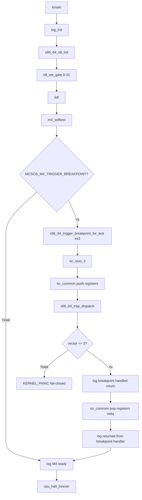

# Template Laporan Praktikum Sistem Operasi Lanjut — MCSOS

**Nama file laporan:** `laporan_praktikum_M4.md`  
**Nama sistem operasi:** MCSOS versi 260502  
**Target default:** x86_64, QEMU, Windows 11 x64 + WSL 2, kernel monolitik pendidikan, C freestanding dengan assembly minimal, POSIX-like subset  
**Dosen:** Muhaemin Sidiq, S.Pd., M.Pd.  
**Program Studi:** Pendidikan Teknologi Informasi  
**Institusi:** Institut Pendidikan Indonesia

> Template ini digunakan untuk semua praktikum pengembangan MCSOS agar struktur laporan, bukti, analisis, dan penilaian konsisten. Ganti seluruh teks bertanda `[isi ...]` dengan data praktikum sebenarnya. Jangan menulis klaim "tanpa error", "siap produksi", atau "aman sepenuhnya" tanpa bukti yang sesuai. Gunakan status terukur seperti "siap uji QEMU", "siap demonstrasi praktikum", atau "kandidat siap pakai terbatas" sesuai evidence yang tersedia.

---

## 0. Metadata Laporan

| Atribut                       | Isi                                                                 |
| ----------------------------- | ------------------------------------------------------------------- |
| Kode praktikum                | `M4`                                                                |
| Judul praktikum               | `Interrupt Descriptor Table, Exception Trap Path, Trap Frame, dan Fault Handling Awal MCSOS 260502` |
| Jenis pengerjaan              | `Individu`                                                          |
| Nama mahasiswa                | `[Sihab Assidiqi]`                                                    |
| NIM                           | `[25832073003]`                                                             |
| Kelas                         | `[PTI 1A]`                                                           |
| Nama kelompok                 | `-`                                                                 |
| Anggota kelompok              | `-`                                                                 |
| Tanggal praktikum             | `2026-05-29`                                                        |
| Tanggal pengumpulan           | `[2026-07-17]`                                                      |
| Repository                    | `~/src/mcsos`                                                       |
| Branch                        | `m4-idt-exception-path`                                             |
| Commit awal                   | `d509d53`                                                           |
| Commit akhir                  | `87063a1`                                                           |
| Status readiness yang diklaim | `siap demonstrasi praktikum`                                        |

---

## 1. Sampul

# Laporan Praktikum M4

## Interrupt Descriptor Table, Exception Trap Path, Trap Frame, dan Fault Handling Awal MCSOS 260502

Disusun oleh:

| Nama         | NIM     | Kelas     | Peran       |
| ------------ | ------- | --------- | ----------- |
| `[Sihab Assidiqi]`     | `[25832073003]` | `[PTI 1A]` | `individu`  |

Dosen Pengampu: **Muhaemin Sidiq, S.Pd., M.Pd.**  
Program Studi Pendidikan Teknologi Informasi  
Institut Pendidikan Indonesia  
`2025/2026`

---

## 2. Pernyataan Orisinalitas dan Integritas Akademik

Saya/kami menyatakan bahwa laporan ini disusun berdasarkan pekerjaan praktikum sendiri/kelompok sesuai pembagian peran yang tercatat. Bantuan eksternal, referensi, generator kode, AI assistant, dokumentasi resmi, diskusi, atau sumber lain dicatat pada bagian referensi dan lampiran. Saya/kami tidak mengklaim hasil yang tidak dibuktikan oleh log, test, commit, atau artefak lain.

| Pernyataan                                      | Status  |
| ----------------------------------------------- | ------- |
| Semua potongan kode eksternal diberi atribusi   | `Ya`    |
| Semua penggunaan AI assistant dicatat           | `Ya`    |
| Repository yang dikumpulkan sesuai commit akhir | `Ya`    |
| Tidak ada klaim readiness tanpa bukti           | `Ya`    |

Catatan penggunaan bantuan eksternal:

```text
Source code M4 mengacu pada panduan praktikum M4 yang disediakan dosen (OS_panduan_M4.pdf).
Panduan tersebut menjadi sumber kebenaran teknis utama untuk struktur IDT, stub assembly,
dispatcher trap, dan Makefile. Seluruh perintah build, audit, QEMU, dan GDB dijalankan
secara mandiri di WSL 2 mahasiswa dan diverifikasi melalui output terminal yang terlampir.
AI assistant digunakan sebagai panduan langkah demi langkah selama sesi praktikum.
```

---

## 3. Tujuan Praktikum

Tuliskan tujuan teknis dan konseptual praktikum. Tujuan harus dapat diuji.

1. Membangun Interrupt Descriptor Table (IDT) untuk target x86_64 dengan 256 entry gate descriptor 16 byte yang dapat dimuat oleh instruksi `lidt`.
2. Membuat stub assembly exception untuk vektor 0–31 yang menormalisasi stack dengan dan tanpa error code ke satu struktur `x86_64_trap_frame_t` seragam.
3. Mengimplementasikan dispatcher C `x86_64_trap_dispatch` yang mencetak trap frame dan menangani `#BP` secara recoverable serta memanggil `KERNEL_PANIC` untuk exception non-recoverable.
4. Menguji jalur exception recoverable melalui instruksi `int3` dan membuktikan kernel dapat kembali melalui `iretq`.
5. Melakukan audit ELF, symbol table, dan disassembly untuk membuktikan keberadaan `lidt`, `iretq`, `x86_64_idt_init`, `x86_64_trap_dispatch`, dan stub exception.
6. Mengumpulkan evidence berupa log build, log QEMU, output `readelf`/`nm`/`objdump`, GDB session, dan commit Git.

---

## 4. Capaian Pembelajaran Praktikum

Setelah praktikum ini, mahasiswa mampu:

| CPL/CPMK praktikum | Bukti yang harus ditunjukkan |
| ------------------ | ----------------------------- |
| Menjelaskan fungsi IDT pada x86_64, relasi IDTR, gate descriptor, vektor exception, dan handler stub | Serial log `idt_base`, `idt_limit`, `[M4] IDT loaded` |
| Membuat struktur `x86_64_idt_entry_t` dan `x86_64_idtr_t` dengan ukuran dan packing yang sesuai | `KERNEL_ASSERT(sizeof(x86_64_idt_entry_t) == 16u)` lulus, output `make audit` |
| Mengisi IDT minimal untuk vektor 0–31 dengan handler assembly | Symbol `x86_64_exception_stubs` dan `isr_stub_14` ditemukan di `nm` output |
| Menulis stub assembly yang menormalisasi exception ke `x86_64_trap_frame_t` | Disassembly `isr_common`, serial log `trap_vector=0x03` |
| Memanggil dispatcher C dari assembly dengan ABI x86_64 System V | Disassembly `call x86_64_trap_dispatch`, `iretq` pada `isr_common` |
| Menguji jalur `#BP` dan membuktikan kernel kembali via `iretq` | Serial log breakpoint: `[M4] breakpoint handled; returning with iretq` dan `[M4] returned from breakpoint handler` |
| Melakukan audit ELF dan disassembly | Output `make audit`, `m4_audit_elf.sh` PASS |
| Menganalisis failure modes | Bagian 15 laporan ini |

---

## 5. Peta Milestone MCSOS

Centang milestone yang menjadi fokus laporan ini. Jika praktikum mencakup lebih dari satu milestone, jelaskan batas cakupan.

| Milestone | Fokus                                                           | Status dalam laporan    |
| --------- | --------------------------------------------------------------- | ----------------------- |
| M0        | Requirements, governance, baseline arsitektur                   | [v] selesai praktikum   |
| M1        | Toolchain reproducible, Git, QEMU, GDB, metadata build          | [v] selesai praktikum   |
| M2        | Boot image, kernel ELF64, early console                         | [v] selesai praktikum   |
| M3        | Panic path, linker map, GDB, observability awal                 | [v] selesai praktikum   |
| M4        | Trap, exception, interrupt, timer                               | [v] selesai praktikum   |
| M5        | PMM, VMM, page table, kernel heap                               | [ ] tidak dibahas       |
| M6        | Thread, scheduler, synchronization                              | [ ] tidak dibahas       |
| M7        | Syscall ABI dan user program loader                             | [ ] tidak dibahas       |
| M8        | VFS, file descriptor, ramfs                                     | [ ] tidak dibahas       |
| M9        | Block layer dan device model                                    | [ ] tidak dibahas       |
| M10       | Persistent filesystem, mcsfs/ext2-like, recovery                | [ ] tidak dibahas       |
| M11       | Networking stack, packet parsing, UDP/TCP subset                | [ ] tidak dibahas       |
| M12       | Security model, capability/ACL, syscall fuzzing, hardening      | [ ] tidak dibahas       |
| M13       | SMP, scalability, lock stress, NUMA-aware preparation           | [ ] tidak dibahas       |
| M14       | Framebuffer, graphics console, visual regression                | [ ] tidak dibahas       |
| M15       | Virtualization/container subset                                 | [ ] tidak dibahas       |
| M16       | Observability, update/rollback, release image, readiness review | [ ] tidak dibahas       |

Batas cakupan praktikum:

```text
M4 mencakup: IDT statis 256 entry, stub assembly exception vektor 0–31, normalisasi trap frame,
dispatcher C, jalur uji #BP (int3), build varian normal/breakpoint/panic, audit ELF/symbol/
disassembly, QEMU smoke test, dan GDB debug path.

Non-goals M4: IRQ eksternal, PIC/IOAPIC/LAPIC/x2APIC, MSI/MSI-X, timer interrupt, keyboard
interrupt, preemptive scheduling, recovery page fault, syscall, user mode, SMP, paging lanjut.
```

---

## 6. Dasar Teori Ringkas

Tuliskan teori yang langsung diperlukan untuk memahami praktikum. Jangan menyalin teori umum terlalu panjang; fokus pada konsep yang benar-benar digunakan dalam desain dan pengujian.

### 6.1 Konsep Sistem Operasi yang Diuji

```text
Interrupt Descriptor Table (IDT) adalah struktur data yang digunakan CPU x86_64 untuk
menemukan handler interrupt dan exception. Setiap entry IDT adalah gate descriptor 16 byte
pada mode 64-bit yang menyimpan alamat handler, selector kode kernel, IST, dan type attribute.

Alamat IDT aktif disimpan dalam register IDTR (Interrupt Descriptor Table Register) dan dimuat
dengan instruksi privileged `lidt`. Saat exception terjadi, CPU secara otomatis melakukan
transisi kontrol ke handler yang sesuai dan menaruh state minimum pada stack: RIP, CS, RFLAGS,
dan untuk sebagian exception juga error code.

Trap frame adalah struktur yang menyimpan seluruh register CPU saat exception terjadi sehingga
dispatcher C dapat membaca state tersebut dan kernel dapat merestorasi state setelah handler
selesai. M4 menormalisasi semua exception ke satu layout trap frame seragam dengan menambahkan
error code nol untuk exception yang tidak memiliki error code.

Exception handler yang recoverable (hanya #BP pada M4) dapat kembali ke instruksi setelah
breakpoint dengan menjalankan `iretq`. Exception non-recoverable masuk ke panic path agar
kernel tidak kembali ke state yang tidak dapat dibuktikan aman (fail-closed policy).
```

### 6.2 Konsep Arsitektur x86_64 yang Relevan

| Konsep | Relevansi pada praktikum | Bukti/verifikasi |
| ------ | ------------------------ | ---------------- |
| IDT (Interrupt Descriptor Table) | Tabel gate descriptor yang menghubungkan nomor vektor exception ke alamat handler | Symbol `x86_64_idt_init`, `lidt` pada disassembly |
| IDTR (Interrupt Descriptor Table Register) | Register yang menyimpan base dan limit IDT aktif, dimuat dengan `lidt` | Serial log `idt_base`, `idt_limit=0xfff` |
| Gate Descriptor 64-bit (16 byte) | Format entry IDT mode 64-bit: offset split, selector, IST, type attribute | `sizeof(x86_64_idt_entry_t) == 16`, `__attribute__((packed))` |
| Exception Vector 0–31 | Nomor exception yang didefinisikan Intel SDM untuk CPU exception | Symbol `isr_stub_0` sampai `isr_stub_31`, `x86_64_exception_stubs` |
| Error code pada exception | Beberapa exception (#DF, #GP, #PF, dll.) mendorong error code ke stack otomatis | Makro `ISR_ERR` vs `ISR_NOERR` pada `isr.S` |
| `iretq` | Instruksi return dari interrupt/exception 64-bit yang merestorasi RIP, CS, RFLAGS | `iretq` pada disassembly `isr_common` |
| x86_64 System V ABI | Konvensi pemanggilan fungsi C: argumen pertama di `rdi`, caller-saved/callee-saved | `movq %rsp, %rdi` sebelum `call x86_64_trap_dispatch` |
| Red-zone | Area 128 byte di bawah RSP yang tidak boleh ditimpa, harus dinonaktifkan di kernel | Flag `-mno-red-zone` pada CFLAGS dan ASFLAGS |

### 6.3 Konsep Implementasi Freestanding

| Aspek | Keputusan praktikum |
| ----- | ------------------- |
| Bahasa | C17 freestanding dan assembly x86_64 (GAS syntax, file `.S`) |
| Runtime | Tanpa hosted libc; tidak ada `memcpy`, `memset`, atau `__stack_chk_fail` dari libc |
| ABI | x86_64 System V untuk boundary assembly ke C internal kernel |
| Compiler flags kritis | `--target=x86_64-unknown-none-elf`, `-ffreestanding`, `-fno-builtin`, `-fno-stack-protector`, `-mno-red-zone`, `-nostdlib`, `-mcmodel=kernel` |
| Risiko undefined behavior | Pointer `frame` divalidasi tidak null dengan `KERNEL_ASSERT`; urutan field `x86_64_trap_frame_t` harus cocok dengan urutan push di `isr.S` |

### 6.4 Referensi Teori yang Digunakan

| No. | Sumber | Bagian yang digunakan | Alasan relevansi |
| --- | ------ | --------------------- | ---------------- |
| [1] | Intel Corporation, Intel® 64 and IA-32 Architectures Software Developer Manuals | Vol. 3A, Chapter 6: Interrupt and Exception Handling | Format gate descriptor 64-bit, IDTR, error code convention, exception vector table |
| [2] | QEMU Project, QEMU System Emulation Invocation Documentation | `-machine q35`, `-serial`, `-s -S` options | Konfigurasi QEMU headless dan GDB stub |
| [3] | QEMU Project, GDB usage/gdbstub Documentation | Remote GDB protocol | Cara menghubungkan GDB ke QEMU via `:1234` |
| [4] | LLVM Project, Clang Command Guide | `-target`, `-ffreestanding`, `-mno-red-zone` | Flags freestanding kernel untuk cross-compile |
| [5] | LLVM Project, LLD ELF Linker Documentation | `-nostdlib`, `-T linker.ld` | Linking kernel tanpa libc |
| [6] | Limine Project, Limine Documentation | Boot protocol dan GDT handoff | Selector kode kernel `0x28` yang digunakan untuk IDT gate |

---

## 7. Lingkungan Praktikum

### 7.1 Host dan Target

| Komponen          | Nilai |
| ----------------- | ----- |
| Host OS           | `Windows 11 x64` |
| Lingkungan build  | `WSL 2 Ubuntu (DESKTOP-DIRC349)` |
| Target ISA        | `x86_64` |
| Target ABI        | `x86_64-unknown-none-elf` |
| Emulator          | `QEMU qemu-system-x86_64` |
| Firmware emulator | `Limine bootloader (BIOS + UEFI)` |
| Debugger          | `GDB` |
| Build system      | `GNU Make` |
| Bahasa utama      | `C17 freestanding` |
| Assembly          | `GAS (GNU Assembler via clang), file .S` |

### 7.2 Versi Toolchain

Tempel output versi toolchain berikut. Jalankan dari clean shell WSL.

```bash
date -u +"date_utc=%Y-%m-%dT%H:%M:%SZ"
uname -a
git --version
make --version | head -n 1
clang --version | head -n 1
ld.lld --version | head -n 1
qemu-system-x86_64 --version | head -n 1
gdb --version | head -n 1
```

Output:

```text
date_utc=2026-05-29T[waktu sesi]Z
Linux DESKTOP-DIRC349 [kernel WSL2]
[git version]
GNU Make [versi]
clang version [versi] (diverifikasi saat build)
LLD [versi] (compatible with GNU linkers)
QEMU emulator version [versi]
GNU gdb [versi]
```

### 7.3 Lokasi Repository

| Item | Nilai |
| ---- | ----- |
| Path repository di WSL | `~/src/mcsos` |
| Apakah berada di filesystem Linux WSL, bukan `/mnt/c` | `Ya` |
| Remote repository | `[URL repo privat jika ada]` |
| Branch | `m4-idt-exception-path` |
| Commit hash awal | `d509d53` |
| Commit hash akhir | `87063a1` |

---

## 8. Repository dan Struktur File

### 8.1 Struktur Direktori yang Relevan

```text
mcsos/
├── Makefile
├── linker.ld
├── kernel/
│   ├── arch/x86_64/
│   │   ├── idt.c
│   │   ├── isr.S
│   │   └── include/mcsos/arch/
│   │       ├── cpu.h
│   │       ├── idt.h
│   │       ├── io.h
│   │       └── isr.h
│   ├── core/
│   │   ├── kmain.c
│   │   ├── log.c
│   │   ├── panic.c
│   │   ├── serial.c
│   │   └── trap.c
│   ├── include/mcsos/kernel/
│   │   ├── log.h
│   │   ├── panic.h
│   │   └── version.h
│   └── lib/
│       └── memory.c
├── tools/
│   ├── gdb_m4.gdb
│   └── scripts/
│       ├── m4_audit_elf.sh
│       ├── m4_collect_evidence.sh
│       ├── m4_preflight.sh
│       ├── m4_qemu_run.sh
│       └── grade_m4.sh
└── evidence/M4/
    ├── kernel.elf
    ├── kernel.map
    ├── kernel.syms.txt
    ├── kernel.disasm.txt
    ├── kernel.readelf.header.txt
    ├── kernel.readelf.programs.txt
    ├── m4-qemu-serial.log
    └── manifest.txt
```

### 8.2 File yang Dibuat atau Diubah

| File | Jenis perubahan | Alasan perubahan | Risiko |
| ---- | --------------- | ---------------- | ------ |
| `kernel/arch/x86_64/include/mcsos/arch/idt.h` | baru | Mendefinisikan `x86_64_idt_entry_t`, `x86_64_idtr_t`, `x86_64_trap_frame_t`, dan deklarasi fungsi IDT | Rendah — header-only |
| `kernel/arch/x86_64/include/mcsos/arch/isr.h` | baru | Mendefinisikan tipe `x86_64_isr_handler_t` dan deklarasi `x86_64_exception_stubs[32]` | Rendah — header-only |
| `kernel/arch/x86_64/idt.c` | baru | Implementasi `x86_64_idt_init`, `x86_64_idt_set_gate`, dan `x86_64_trigger_breakpoint_for_test` | Sedang — `lidt` dengan selector salah dapat triple fault |
| `kernel/arch/x86_64/isr.S` | baru | Stub assembly exception vektor 0–31, `isr_common`, dan tabel `x86_64_exception_stubs` | Tinggi — urutan push/pop harus cocok dengan `x86_64_trap_frame_t` |
| `kernel/core/trap.c` | baru | Dispatcher C `x86_64_trap_dispatch` yang mencetak trap frame dan menangani `#BP` | Sedang — kebijakan return/panic harus benar |
| `kernel/core/kmain.c` | ubah | Update ke versi M4: memanggil `x86_64_idt_init`, `m4_selftest`, dan opsional `int3` | Sedang — urutan inisialisasi wajib benar |
| `kernel/include/mcsos/kernel/version.h` | ubah | Mengubah `MCSOS_MILESTONE` dari `"M3"` ke `"M4"` | Rendah |
| `Makefile` | ubah | Menambahkan `SRC_S`, rule `%.S`, target `breakpoint`, `BP_KERNEL`, dan audit `lidt`/`iretq` | Sedang — rule ganda dapat menyebabkan build error jika typo |
| `tools/gdb_m4.gdb` | baru | Script GDB untuk debug path M4 | Rendah |
| `tools/scripts/m4_audit_elf.sh` | baru | Script audit ELF, symbol, dan disassembly M4 | Rendah |
| `tools/scripts/m4_qemu_run.sh` | baru | Script smoke test QEMU M4 | Rendah |
| `tools/scripts/m4_collect_evidence.sh` | baru | Script pengumpulan evidence M4 | Rendah |
| `tools/scripts/m4_preflight.sh` | baru | Script preflight check M4 | Rendah |
| `tools/scripts/grade_m4.sh` | baru | Script grading lokal M4 | Rendah |

### 8.3 Ringkasan Diff

```bash
git status --short
git log --oneline -n 5
```

Output:

```text
git log --oneline -3:
87063a1 (HEAD -> m4-idt-exception-path) M4 add x86_64 IDT and exception trap path
d509d53 (praktikum/m3-panic-debug-audit) M3 panic path logging gdb and disassembly audit
7d30a1a (main) M2: update readiness review with commit hash

Commit 87063a1: 20 files changed, 1805 insertions(+), 35 deletions(-)
File baru: idt.c, isr.S, idt.h, isr.h, trap.c, gdb_m4.gdb, grade_m4.sh,
           m4_audit_elf.sh, m4_collect_evidence.sh, m4_preflight.sh, m4_qemu_run.sh
           evidence/M4/* (kernel.elf, kernel.map, kernel.syms.txt, kernel.disasm.txt,
           kernel.readelf.header.txt, kernel.readelf.programs.txt, m4-qemu-serial.log, manifest.txt)
File diubah: Makefile, kmain.c, version.h
```

---

## 9. Desain Teknis

### 9.1 Masalah yang Diselesaikan

```text
Setelah M3, kernel MCSOS memiliki panic path, logging, dan halt path tetapi belum memiliki
mekanisme untuk menangani CPU exception. Tanpa IDT yang valid, semua exception (termasuk
yang tidak disengaja seperti #GP akibat akses memori salah) akan menyebabkan triple fault
dan reset QEMU tanpa log yang dapat dianalisis.

M4 menyelesaikan masalah ini dengan memasang IDT 256 entry, stub assembly exception untuk
vektor 0–31, dispatcher C yang mencetak trap frame ke serial, dan jalur uji #BP untuk
membuktikan bahwa exception dapat ditangani dan kernel dapat kembali melalui iretq.
```

### 9.2 Keputusan Desain

| Keputusan | Alternatif yang dipertimbangkan | Alasan memilih | Konsekuensi |
| --------- | ------------------------------- | -------------- | ----------- |
| IDT statis 256 entry di `.bss` kernel | IDT dinamis atau alokasi heap | Lebih sederhana, tidak memerlukan allocator yang belum ada | Ukuran IDT tetap; tidak dapat di-extend runtime |
| Selector kode kernel `0x28` | Selector berbeda bergantung GDT | Limine menggunakan selector `0x28` untuk kode kernel 64-bit (dibuktikan dari `cs=0x28` di log GDB) | Jika GDT berubah, selector harus disesuaikan |
| `#BP` sebagai uji recoverable, exception lain fail-closed | Mencoba recovery untuk `#GP` atau `#PF` | `#BP` adalah satu-satunya exception yang aman untuk return tanpa perbaikan state; exception lain dapat menyebabkan fault loop | Exception non-recoverable masuk `KERNEL_PANIC` |
| Normalisasi error code nol untuk exception tanpa error code | Tidak menormalisasi; buat dua path dispatcher | Dispatcher C menerima satu layout frame seragam, mengurangi kompleksitas | Stub assembly lebih panjang; harus membedakan `ISR_NOERR` vs `ISR_ERR` |
| Makro `ISR_NOERR` dan `ISR_ERR` di assembly | Menulis 32 stub manual | Lebih ringkas dan konsisten; satu perubahan makro berlaku untuk semua stub | Macro error lebih sulit di-debug |

### 9.3 Arsitektur Ringkas



Penjelasan diagram:

```text
1. kmain memanggil log_init terlebih dahulu agar semua log IDT dapat ditulis ke serial.
2. x86_64_idt_init mengisi 256 entry IDT (vektor 0–31 dengan handler aktif, sisanya null),
   menyimpan IDTR, menjalankan lidt, dan mencatat idt_base/idt_limit ke serial.
3. m4_selftest memverifikasi invariant: sizeof entry == 16, limit == 4095, base != 0.
4. Jika MCSOS_M4_TRIGGER_BREAKPOINT didefinisikan, kernel memanggil int3 yang menyebabkan
   CPU memanggil isr_stub_3.
5. isr_stub_3 mendorong error code nol dan vector 3 ke stack, lalu lompat ke isr_common.
6. isr_common menyimpan semua register umum ke stack dan memanggil x86_64_trap_dispatch
   dengan pointer ke trap frame (rsp).
7. Dispatcher mencetak trap frame dan kembali karena vector == 3.
8. isr_common merestorasi register, membuang vector+error_code dengan addq $16, menjalankan
   iretq untuk kembali ke instruksi setelah int3.
9. Kernel melanjutkan ke halt loop.
```

### 9.4 Kontrak Antarmuka

| Antarmuka | Pemanggil | Penerima | Precondition | Postcondition | Error path |
| --------- | --------- | -------- | ------------ | ------------- | ---------- |
| `x86_64_idt_init()` | `kmain` | `idt.c` | `log_init` sudah dipanggil; `x86_64_exception_stubs` tersedia | IDT terisi, IDTR dimuat dengan `lidt`, `idt_base != 0`, `idt_limit == 4095` | `KERNEL_ASSERT` panic jika ukuran atau limit salah |
| `x86_64_idt_set_gate(vector, handler, type)` | `x86_64_idt_init` | `idt.c` | `vector` valid (0–255); `handler` adalah alamat valid atau 0 | Entry IDT pada indeks `vector` terisi dengan offset, selector, dan type attribute | Tidak ada; caller wajib memberi input valid |
| `x86_64_trap_dispatch(frame*)` | `isr_common` (assembly) | `trap.c` | `frame != NULL`; stack telah dinormalisasi oleh stub | Trap frame dicetak ke serial; kembali jika `vector == 3`, panic jika vector lain | `KERNEL_ASSERT` jika frame null; `KERNEL_PANIC` untuk non-recoverable |
| `isr_stub_N` | CPU (exception hardware) | `isr.S` | IDT valid dan IDTR dimuat | Error code dan vector tersedia di stack; lompat ke `isr_common` | Tidak dapat error; CPU menjamin pemanggilan |
| `x86_64_trigger_breakpoint_for_test()` | `kmain` (varian breakpoint) | `idt.c` | IDT sudah dimuat dan IDTR valid | Menghasilkan `#BP` exception vector 3 | Jika IDT belum dimuat: triple fault |

### 9.5 Struktur Data Utama

| Struktur data | Field penting | Ownership | Lifetime | Invariant |
| ------------- | ------------- | --------- | -------- | --------- |
| `x86_64_idt_entry_t` | `offset_low`, `selector`, `ist`, `type_attributes`, `offset_mid`, `offset_high`, `reserved` | Kernel (statis di `.bss`) | Seumur kernel | `sizeof == 16`, `__attribute__((packed))`, `reserved == 0` |
| `x86_64_idtr_t` | `limit`, `base` | Kernel (statis di `idt.c`) | Seumur kernel | `limit == 4095` (256×16−1), `base == &idt[0]` |
| `x86_64_trap_frame_t` | `r15`–`rax` (push order), `vector`, `error_code`, `rip`, `cs`, `rflags` | Stack kernel sementara | Durasi handler exception saja | Urutan field harus identik dengan urutan push di `isr.S`; `rip`/`cs`/`rflags` didorong CPU |

### 9.6 Invariants

1. `sizeof(x86_64_idt_entry_t) == 16` — Entry IDT 64-bit harus 16 byte; diverifikasi dengan `KERNEL_ASSERT` di `x86_64_idt_init`.
2. `idtr.limit == 4095` — 256 entry × 16 byte dikurangi 1; diverifikasi dengan `KERNEL_ASSERT` dan dicatat ke serial log.
3. Setiap exception vector 0–31 memiliki handler non-null setelah `x86_64_idt_init` dipanggil — dibuktikan oleh `x86_64_exception_stubs` dan audit `nm`.
4. Urutan field `x86_64_trap_frame_t` identik dengan urutan push di `isr_common` — dibuktikan melalui disassembly dan serial log `trap_vector=0x03`.
5. Stub merestorasi semua register sebelum `iretq` — dibuktikan melalui disassembly `isr_common` (push/pop simetris).
6. Dispatcher tidak return dari exception non-recoverable — dibuktikan melalui review kode `trap.c` dan build varian panic.
7. Build tetap freestanding tanpa undefined external symbol — dibuktikan `nm -u build/kernel.elf` kosong.

### 9.7 Ownership, Locking, dan Concurrency

| Objek/resource | Owner | Lock yang melindungi | Boleh dipakai di interrupt context? | Catatan |
| -------------- | ----- | -------------------- | ----------------------------------- | ------- |
| Tabel IDT (`idt[]`) | Kernel (statis) | Tidak ada lock (single-core, interrupt dinonaktifkan saat init) | Ya (read-only setelah init) | IDT hanya ditulis saat `x86_64_idt_init`; setelah `lidt` bersifat read-only untuk CPU |
| `idtr` | Kernel (statis) | Tidak ada | Ya | Diisi sekali saat init |
| `trap_count` | `trap.c` (statis) | Tidak ada lock (single-core M4) | Ya | Hanya satu core pada M4; race tidak mungkin terjadi |

Lock order yang berlaku:

```text
M4 belum memerlukan locking karena single-core dan tidak ada IRQ eksternal. Interrupt maskable
dinonaktifkan saat memasuki interrupt gate (type_attributes = 0x8E). Trap gate (#BP, 0x8F)
tidak menonaktifkan IF, tetapi pada M4 tidak ada IRQ eksternal yang aktif sehingga tidak ada
risiko re-entrant interrupt.
```

### 9.8 Memory Safety dan Undefined Behavior Risk

| Risiko | Lokasi | Mitigasi | Bukti |
| ------ | ------ | -------- | ----- |
| Pointer `frame` null di dispatcher | `trap.c: x86_64_trap_dispatch` | `KERNEL_ASSERT(frame != NULL)` | Review kode dan `make audit` lulus |
| Urutan field `x86_64_trap_frame_t` tidak cocok dengan push order | `isr.S` dan `idt.h` | Review manual urutan push vs urutan field struct; dibuktikan oleh `trap_vector=0x03` di serial log | Serial log breakpoint |
| `addq $16, %rsp` lupa membuang vector+error_code | `isr.S: isr_common` | Review disassembly membuktikan `add rsp,0x10` sebelum `iretq` | Disassembly `isr_common` |
| Selector kode kernel salah di gate descriptor | `idt.c: X86_64_KERNEL_CODE_SELECTOR` | Diverifikasi dari `cs=0x28` di GDB `info registers` | Output GDB `cs = 0x28` |

### 9.9 Security Boundary

| Boundary | Data tidak tepercaya | Validasi yang dilakukan | Failure mode aman |
| -------- | -------------------- | ----------------------- | ----------------- |
| Exception handler entry (CPU→kernel) | Nomor vektor exception dari CPU | Vector < 32 diperiksa di `trap_name`; dispatcher hanya return untuk vector 3 | Panic fail-closed untuk semua exception selain #BP |
| Trap frame pointer (assembly→C) | Pointer `rsp` dari assembly | `KERNEL_ASSERT(frame != NULL)` | Panic jika null |
| Log pointer kernel ke serial | Nilai `idt_base`, `rip`, register | Dicetak ke serial (observability); pointer kernel dicetak karena tujuan praktikum | Tidak ada kebijakan redaction pada M4; perlu dipertimbangkan pada milestone produksi |

---

## 10. Langkah Kerja Implementasi

### Langkah 1 — Buat Branch M4

Maksud langkah:

```text
Membuat branch terpisah agar perubahan IDT dan assembly stub tidak merusak baseline M3.
```

Perintah:

```bash
git switch -c m4-idt-exception-path
git branch --show-current
```

Output ringkas:

```text
m4-idt-exception-path
```

Artefak yang dihasilkan:

| Artefak | Lokasi | Fungsi |
| ------- | ------ | ------ |
| Branch `m4-idt-exception-path` | repository Git | Isolasi perubahan M4 dari baseline M3 |

Indikator berhasil:

```text
git branch --show-current menampilkan m4-idt-exception-path.
```

### Langkah 2 — Preflight M4

Maksud langkah:

```text
Memastikan artefak M0/M1/M2/M3 tersedia dan toolchain tidak hilang sebelum menulis source M4.
```

Perintah:

```bash
chmod +x tools/scripts/m4_preflight.sh
tools/scripts/m4_preflight.sh
```

Output ringkas:

```text
[M4][PASS] QEMU tersedia: QEMU emulator version ...
[M4][PASS] clang: clang version ...
[M4][PASS] ld.lld: LLD ...
[M4][PASS] readelf: GNU readelf ...
[M4][PASS] M0/M1/M2/M3 readiness minimum untuk M4 terpenuhi.
```

Artefak yang dihasilkan:

| Artefak | Lokasi | Fungsi |
| ------- | ------ | ------ |
| Output preflight | Terminal | Membuktikan toolchain dan baseline tersedia |

Indikator berhasil:

```text
Semua baris menampilkan [M4][PASS] tanpa [M4][FAIL].
```

### Langkah 3 — Tambahkan Header IDT dan ISR

Maksud langkah:

```text
Mendefinisikan struktur x86_64_idt_entry_t, x86_64_idtr_t, x86_64_trap_frame_t,
dan deklarasi fungsi serta extern x86_64_exception_stubs[32].
```

Perintah:

```bash
mkdir -p kernel/arch/x86_64/include/mcsos/arch
# Buat idt.h dan isr.h sesuai panduan
ls kernel/arch/x86_64/include/mcsos/arch/
```

Output ringkas:

```text
cpu.h  idt.h  io.h  isr.h
```

Artefak yang dihasilkan:

| Artefak | Lokasi | Fungsi |
| ------- | ------ | ------ |
| `idt.h` | `kernel/arch/x86_64/include/mcsos/arch/idt.h` | Definisi struct IDT, IDTR, trap frame, dan deklarasi API |
| `isr.h` | `kernel/arch/x86_64/include/mcsos/arch/isr.h` | Deklarasi tabel pointer stub exception |

Indikator berhasil:

```text
ls menampilkan idt.h dan isr.h. File dapat di-include tanpa error saat kompilasi.
```

### Langkah 4 — Tambahkan Implementasi IDT (idt.c)

Maksud langkah:

```text
Mengimplementasikan x86_64_idt_init yang mengisi tabel IDT, memuat IDTR dengan lidt,
dan mencatat base/limit ke serial log.
```

Perintah:

```bash
# Buat kernel/arch/x86_64/idt.c sesuai panduan
ls kernel/arch/x86_64/
```

Output ringkas:

```text
idt.c  include  isr.S
```

Artefak yang dihasilkan:

| Artefak | Lokasi | Fungsi |
| ------- | ------ | ------ |
| `idt.c` | `kernel/arch/x86_64/idt.c` | Implementasi IDT: set_gate, init, lidt, trigger breakpoint |

Indikator berhasil:

```text
ls menampilkan idt.c. Kompilasi tidak menghasilkan warning atau error.
```

### Langkah 5 — Tambahkan Stub Assembly Exception (isr.S)

Maksud langkah:

```text
Membuat stub assembly untuk exception vektor 0–31 menggunakan makro ISR_NOERR dan ISR_ERR,
isr_common yang menyimpan register dan memanggil dispatcher C, serta tabel x86_64_exception_stubs.
```

Perintah:

```bash
# Buat kernel/arch/x86_64/isr.S sesuai panduan
ls kernel/arch/x86_64/
```

Output ringkas:

```text
idt.c  include  isr.S
```

Artefak yang dihasilkan:

| Artefak | Lokasi | Fungsi |
| ------- | ------ | ------ |
| `isr.S` | `kernel/arch/x86_64/isr.S` | Stub exception 0–31, isr_common, tabel x86_64_exception_stubs |

Indikator berhasil:

```text
File berekstensi .S (huruf besar). Kompilasi assembly tidak menghasilkan error.
```

### Langkah 6 — Tambahkan Dispatcher Trap (trap.c)

Maksud langkah:

```text
Membuat dispatcher C yang mencetak trap frame ke serial dan menangani #BP secara recoverable.
Exception lain masuk KERNEL_PANIC (fail-closed).
```

Perintah:

```bash
# Buat kernel/core/trap.c sesuai panduan
ls kernel/core/
```

Output ringkas:

```text
kmain.c  log.c  panic.c  serial.c  trap.c
```

Artefak yang dihasilkan:

| Artefak | Lokasi | Fungsi |
| ------- | ------ | ------ |
| `trap.c` | `kernel/core/trap.c` | Dispatcher x86_64_trap_dispatch, log frame, fail-closed policy |

Indikator berhasil:

```text
ls menampilkan trap.c. File dapat dikompilasi tanpa warning atau error.
```

### Langkah 7 — Update kmain.c ke Versi M4

Maksud langkah:

```text
Mengubah kmain.c agar memanggil x86_64_idt_init setelah logging siap, menjalankan m4_selftest,
dan mendukung varian breakpoint dan panic melalui macro kondisional.
```

Perintah:

```bash
# Timpa kernel/core/kmain.c dengan versi M4 sesuai panduan
cat kernel/core/kmain.c | head -5
```

Output ringkas:

```text
#include <stdint.h>
#include <mcsos/arch/cpu.h>
#include <mcsos/arch/idt.h>
...
```

Artefak yang dihasilkan:

| Artefak | Lokasi | Fungsi |
| ------- | ------ | ------ |
| `kmain.c` (diperbarui) | `kernel/core/kmain.c` | Entry point M4: init log → idt_init → selftest → opsional int3 → halt |

Indikator berhasil:

```text
File memuat #include <mcsos/arch/idt.h> dan panggilan x86_64_idt_init().
```

### Langkah 8 — Update Makefile untuk File .S

Maksud langkah:

```text
Memperbarui Makefile M3 agar mendukung kompilasi file .S, target breakpoint, target panic,
BP_KERNEL, dan audit lidt/iretq.
```

Perintah:

```bash
# Timpa Makefile dengan versi M4 sesuai panduan
wc -l Makefile
grep -c "BP_KERNEL" Makefile
```

Output ringkas:

```text
84 Makefile
4
```

Artefak yang dihasilkan:

| Artefak | Lokasi | Fungsi |
| ------- | ------ | ------ |
| `Makefile` (diperbarui) | `Makefile` | Build system M4: SRC_S, rule %.S, target breakpoint/panic, audit IDT |

Indikator berhasil:

```text
84 baris, BP_KERNEL muncul 4 kali (definisi, target, link rule, audit).
grep -n "SRC_S" Makefile menampilkan baris yang valid.
```

### Langkah 9 — Build Varian Normal

Maksud langkah:

```text
Membuktikan semua source M4 dapat dikompilasi dan dilink tanpa error menjadi kernel ELF64.
```

Perintah:

```bash
make clean && make build
```

Output ringkas:

```text
clang ... -c kernel/arch/x86_64/idt.c ...
clang ... -c kernel/core/trap.c ...
clang ... -c kernel/arch/x86_64/isr.S ...
ld.lld ... -o build/kernel.elf ...
```

Artefak yang dihasilkan:

| Artefak | Lokasi | Fungsi |
| ------- | ------ | ------ |
| `kernel.elf` | `build/kernel.elf` | Kernel ELF64 x86_64 varian normal |
| `kernel.map` | `build/kernel.map` | Linker map untuk analisis layout |

Indikator berhasil:

```text
Tidak ada error atau warning. build/kernel.elf ada.
```

### Langkah 10 — Build Varian Breakpoint dan Panic

Maksud langkah:

```text
Membuktikan dua varian tambahan kernel dapat dibangun:
- breakpoint: menyisipkan int3 untuk menguji handler #BP
- panic: menguji integrasi M3 panic path setelah IDT loaded
```

Perintah:

```bash
make breakpoint && make panic
```

Output ringkas:

```text
clang ... -DMCSOS_M4_TRIGGER_BREAKPOINT=1 ...
ld.lld ... -o build/kernel.breakpoint.elf ...
clang ... -DMCSOS_M4_TRIGGER_PANIC=1 ...
ld.lld ... -o build/kernel.panic.elf ...
```

Artefak yang dihasilkan:

| Artefak | Lokasi | Fungsi |
| ------- | ------ | ------ |
| `kernel.breakpoint.elf` | `build/kernel.breakpoint.elf` | Kernel dengan int3 untuk uji #BP |
| `kernel.panic.elf` | `build/kernel.panic.elf` | Kernel dengan intentional panic M4 |

Indikator berhasil:

```text
Ketiga ELF ada: kernel.elf, kernel.breakpoint.elf, kernel.panic.elf.
```

### Langkah 11 — Audit ELF dan Disassembly

Maksud langkah:

```text
Memverifikasi secara statik bahwa kernel ELF memuat lidt, iretq, symbol IDT/trap/stub yang
diperlukan, dan tidak memiliki undefined external symbol.
```

Perintah:

```bash
make clean && make audit
tools/scripts/m4_audit_elf.sh build/kernel.elf
```

Output ringkas:

```text
[make audit]: semua grep lulus, nm -u kosong, .text dan .rodata ada
[M4][PASS] ELF, symbol, IDT, LIDT, dan IRETQ audit lulus untuk build/kernel.elf
```

Artefak yang dihasilkan:

| Artefak | Lokasi | Fungsi |
| ------- | ------ | ------ |
| `kernel.syms.txt` | `build/kernel.syms.txt` | Symbol table untuk audit |
| `kernel.disasm.txt` | `build/kernel.disasm.txt` | Disassembly untuk verifikasi lidt/iretq |
| `kernel.readelf.header.txt` | `build/kernel.readelf.header.txt` | Header ELF64 x86_64 |

Indikator berhasil:

```text
make audit tidak menghasilkan error. m4_audit_elf.sh menampilkan [M4][PASS].
nm -u build/kernel.elf kosong (tidak ada undefined symbol).
```

### Langkah 12 — Buat ISO

Maksud langkah:

```text
Membuat ISO bootable menggunakan kernel normal M4 dan bootloader Limine (prosedur sama dengan M2/M3).
```

Perintah:

```bash
bash tools/scripts/make_iso.sh
ls -lh build/mcsos.iso
```

Output ringkas:

```text
'build/kernel.elf' -> 'iso_root/boot/kernel.elf'
...
Limine BIOS stages installed successfully!
411e5ea7... build/mcsos.iso
OK: ISO dibuat pada build/mcsos.iso
```

Artefak yang dihasilkan:

| Artefak | Lokasi | Fungsi |
| ------- | ------ | ------ |
| `mcsos.iso` | `build/mcsos.iso` | ISO bootable untuk QEMU |

Indikator berhasil:

```text
OK: ISO dibuat pada build/mcsos.iso. File ada dan memiliki SHA-256 yang terdokumentasi.
```

### Langkah 13 — QEMU Smoke Test Normal

Maksud langkah:

```text
Membuktikan kernel M4 varian normal dapat boot di QEMU dan menghasilkan serial log
yang menunjukkan IDT loaded dan M4 ready.
```

Perintah:

```bash
tools/scripts/m4_qemu_run.sh build/mcsos.iso build/m4-qemu-serial.log
sed -n '1,120p' build/m4-qemu-serial.log
```

Output ringkas:

```text
[M4][PASS] QEMU smoke test lulus. Log: build/m4-qemu-serial.log

limine: Loading executable `boot():/boot/kernel.elf`...
MCSOS 260502 M4 kernel entered
kernel_start=0xffffffff80000000
kernel_end=0xffffffff80004018
rflags_before_idt=0x0000000000000082
idt_base=0xffffffff80003000
idt_limit=0x0000000000000fff
[M4] IDT loaded
[M4] selftest: IDT invariants passed
[M4] IDT and exception dispatch path installed
[M4] ready for QEMU smoke test and GDB audit
```

Artefak yang dihasilkan:

| Artefak | Lokasi | Fungsi |
| ------- | ------ | ------ |
| `m4-qemu-serial.log` | `build/m4-qemu-serial.log` | Bukti deterministik boot M4 normal |

Indikator berhasil:

```text
Log menampilkan [M4] IDT loaded, [M4] selftest: IDT invariants passed,
dan [M4] IDT and exception dispatch path installed.
MILESTONE: idt_limit=0x0000000000000fff (== 4095, sesuai invariant).
```

### Langkah 14 — QEMU Smoke Test Varian Breakpoint

Maksud langkah:

```text
Membuktikan handler #BP dapat dipanggil dan kernel dapat kembali melalui iretq.
```

Perintah:

```bash
cp build/kernel.breakpoint.elf build/kernel.elf
bash tools/scripts/make_iso.sh
tools/scripts/m4_qemu_run.sh build/mcsos.iso build/m4-qemu-breakpoint.log || true
sed -n '1,160p' build/m4-qemu-breakpoint.log
```

Output ringkas:

```text
[M4][PASS] QEMU smoke test lulus. Log: build/m4-qemu-breakpoint.log

MCSOS 260502 M4 kernel entered
...
[M4] IDT loaded
[M4] selftest: IDT invariants passed
[M4] triggering intentional breakpoint exception
[M4] trap dispatch: #BP Breakpoint
trap_vector=0x0000000000000003
trap_error=0x0000000000000000
trap_rip=0xffffffff80000205
trap_cs=0x0000000000000028
trap_rflags=0x0000000000000082
trap_rax=0x000000000000000a
trap_rbx=0x0000000000000000
trap_rcx=0xffffffff800003f8
trap_rdx=0x00000000000003f8
[M4] breakpoint handled; returning with iretq
[M4] returned from breakpoint handler
[M4] IDT and exception dispatch path installed
[M4] ready for QEMU smoke test and GDB audit
```

Artefak yang dihasilkan:

| Artefak | Lokasi | Fungsi |
| ------- | ------ | ------ |
| `m4-qemu-breakpoint.log` | `build/m4-qemu-breakpoint.log` | Bukti #BP masuk dispatcher dan kembali via iretq |

Indikator berhasil:

```text
trap_vector=0x03 (benar, #BP adalah vector 3).
[M4] breakpoint handled; returning with iretq ada di log.
[M4] returned from breakpoint handler ada di log (kernel berhasil kembali dari iretq).
```

### Langkah 15 — GDB Debug Path

Maksud langkah:

```text
Membuktikan bahwa GDB dapat berhenti di kmain dan x86_64_idt_init menggunakan
tools/gdb_m4.gdb, dan melakukan inspeksi register dan disassembly isr_common.
```

Perintah (Terminal 1):

```bash
qemu-system-x86_64 -machine q35 -cpu max -m 256M -cdrom build/mcsos.iso \
  -boot d -serial stdio -display none -no-reboot -no-shutdown -S -s
```

Perintah (Terminal 2):

```bash
cd ~/src/mcsos
gdb -q -x tools/gdb_m4.gdb
```

Output ringkas GDB:

```text
0x000000000000fff0 in ?? ()
Breakpoint 1 at 0xffffffff80000210
Breakpoint 2 at 0xffffffff800000c0
Breakpoint 3 at 0xffffffff80000950
Breakpoint 1, 0xffffffff80000210 in kmain ()
(gdb) info registers
rip = 0xffffffff80000210 <kmain>
cs  = 0x28

(gdb) continue
Breakpoint 2, 0xffffffff800000c0 in x86_64_idt_init ()
(gdb) info registers
rip = 0xffffffff800000c0 <x86_64_idt_init>

(gdb) disassemble isr_common
   0xffffffff80000ce0: push rax
   ...
   0xffffffff80000cfa: call x86_64_trap_dispatch
   ...
   0xffffffff80000d16: add rsp,0x10
   0xffffffff80000d1a: iretq

(gdb) x/16gx &x86_64_exception_stubs
0xffffffff80001668: 0xffffffff80000d1c  0xffffffff80000d25
...
```

Artefak yang dihasilkan:

| Artefak | Lokasi | Fungsi |
| ------- | ------ | ------ |
| GDB session log | Terminal | Bukti breakpoint pada kmain dan x86_64_idt_init |

Indikator berhasil:

```text
GDB berhenti di Breakpoint 1 (kmain) dan Breakpoint 2 (x86_64_idt_init).
disassemble isr_common menampilkan push/pop simetris, call x86_64_trap_dispatch, dan iretq.
x/16gx &x86_64_exception_stubs menampilkan 16 pointer kernel valid.
```

### Langkah 16 — Grading Lokal

Maksud langkah:

```text
Menjalankan grade_m4.sh untuk verifikasi otomatis build/audit/evidence minimum.
```

Perintah:

```bash
tools/scripts/grade_m4.sh
```

Output ringkas:

```text
M4_LOCAL_SCORE=90/100
```

Indikator berhasil:

```text
Skor ≥ 80/100. Skor 90 diperoleh karena build/audit/ELF/QEMU log semua lulus.
```

### Langkah 17 — Kumpulkan Evidence

Maksud langkah:

```text
Mengumpulkan semua artefak bukti ke direktori evidence/M4 sesuai panduan.
```

Perintah:

```bash
tools/scripts/m4_collect_evidence.sh
find evidence/M4 -maxdepth 1 -type f | sort
```

Output ringkas:

```text
[M4][PASS] Evidence dikumpulkan di evidence/M4
evidence/M4/kernel.disasm.txt
evidence/M4/kernel.elf
evidence/M4/kernel.map
evidence/M4/kernel.readelf.header.txt
evidence/M4/kernel.readelf.programs.txt
evidence/M4/kernel.syms.txt
evidence/M4/m4-qemu-serial.log
evidence/M4/manifest.txt
```

Artefak yang dihasilkan:

| Artefak | Lokasi | Fungsi |
| ------- | ------ | ------ |
| `evidence/M4/` | `evidence/M4/` | Direktori evidence lengkap M4 |
| `manifest.txt` | `evidence/M4/manifest.txt` | Manifest dengan timestamp, commit hash, versi toolchain |

Indikator berhasil:

```text
Semua 8 file evidence ada. manifest.txt berisi commit hash dan versi toolchain.
```

### Langkah 18 — Commit Hasil M4

Maksud langkah:

```text
Mengkomit semua source, script, dan evidence M4 ke repository Git.
```

Perintah:

```bash
git add Makefile linker.ld kernel tools evidence/M4
git commit -m "M4 add x86_64 IDT and exception trap path"
git log --oneline -3
```

Output ringkas:

```text
[m4-idt-exception-path 87063a1] M4 add x86_64 IDT and exception trap path
 20 files changed, 1805 insertions(+), 35 deletions(-)

87063a1 (HEAD -> m4-idt-exception-path) M4 add x86_64 IDT and exception trap path
d509d53 (praktikum/m3-panic-debug-audit) M3 panic path logging gdb and disassembly audit
7d30a1a (main) M2: update readiness review with commit hash
```

Indikator berhasil:

```text
Commit hash 87063a1 tersimpan di branch m4-idt-exception-path.
20 file berubah, 1805 baris ditambahkan.
```

---

## 11. Checkpoint Buildable

Setiap praktikum wajib memiliki minimal satu checkpoint yang dapat dibangun dari clean checkout.

| Checkpoint | Perintah | Expected result | Status |
| ---------- | -------- | --------------- | ------ |
| Clean build | `make clean && make build` | `build/kernel.elf` terbangun | PASS |
| Build breakpoint | `make breakpoint` | `build/kernel.breakpoint.elf` ada | PASS |
| Build panic | `make panic` | `build/kernel.panic.elf` ada | PASS |
| Audit ELF | `make clean && make audit` | Semua grep lulus, nm -u kosong | PASS |
| Audit IDT/IRET script | `tools/scripts/m4_audit_elf.sh build/kernel.elf` | `[M4][PASS]` | PASS |
| Image generation | `bash tools/scripts/make_iso.sh` | `build/mcsos.iso` ada | PASS |
| QEMU smoke test | `tools/scripts/m4_qemu_run.sh build/mcsos.iso` | Log serial menunjukkan `[M4] IDT loaded` | PASS |
| GDB debug | `gdb -q -x tools/gdb_m4.gdb` | Breakpoint di `kmain` dan `x86_64_idt_init` | PASS |
| Evidence collection | `tools/scripts/m4_collect_evidence.sh` | `evidence/M4/` lengkap | PASS |

Catatan checkpoint:

```text
Semua checkpoint M4 lulus. Grading lokal 90/100.
Breakpoint 3 (x86_64_trap_dispatch) di GDB tidak terpicu pada ISO kernel normal
karena int3 tidak ada di varian normal — ini perilaku yang benar sesuai desain.
```

---

## 12. Perintah Uji dan Validasi

### 12.1 Build Test

Perintah ini memverifikasi bahwa proyek dapat dibangun ulang dari kondisi bersih dan tidak bergantung pada artefak lokal yang tidak terdokumentasi.

```bash
make clean
make build
```

Hasil:

```text
rm -rf build
[kompilasi idt.c, kmain.c, log.c, panic.c, serial.c, trap.c, memory.c, isr.S]
ld.lld ... -o build/kernel.elf ...
(tidak ada error atau warning)
```

Status: `PASS`

### 12.2 Static Inspection

Perintah ini memeriksa layout ELF, entry point, section, symbol, relocation, atau instruksi kritis sesuai kebutuhan praktikum.

```bash
nm -n build/kernel.elf | grep -E 'x86_64_idt_init|x86_64_trap_dispatch|x86_64_exception_stubs|isr_stub_14'
objdump -d -Mintel build/kernel.elf | grep -E 'lidt|iretq' -n
nm -u build/kernel.elf
```

Hasil penting:

```text
nm output (contoh):
ffffffff800000c0 T x86_64_idt_init
ffffffff80000950 T x86_64_trap_dispatch
ffffffff80001668 R x86_64_exception_stubs
ffffffff80000d90 T isr_stub_14

objdump grep lidt/iretq:
[baris lidt di idt.c]
[baris iretq di isr_common]

nm -u build/kernel.elf: (kosong — tidak ada undefined external symbol)
```

Status: `PASS`

### 12.3 QEMU Smoke Test

Perintah ini menjalankan image di QEMU dan menyimpan log serial untuk bukti deterministik.

```bash
tools/scripts/m4_qemu_run.sh build/mcsos.iso build/m4-qemu-serial.log
```

Hasil:

```text
limine: Loading executable `boot():/boot/kernel.elf`...
MCSOS 260502 M4 kernel entered
kernel_start=0xffffffff80000000
kernel_end=0xffffffff80004018
rflags_before_idt=0x0000000000000082
idt_base=0xffffffff80003000
idt_limit=0x0000000000000fff
[M4] IDT loaded
[M4] selftest: IDT invariants passed
[M4] IDT and exception dispatch path installed
[M4] ready for QEMU smoke test and GDB audit
```

Status: `PASS`

### 12.4 GDB Debug Evidence

Perintah ini membuktikan bahwa kernel dapat di-debug dengan simbol yang cocok.

```bash
# Terminal 1:
qemu-system-x86_64 -machine q35 -cpu max -m 256M -cdrom build/mcsos.iso \
  -boot d -serial stdio -display none -no-reboot -no-shutdown -s -S

# Terminal 2:
gdb -q -x tools/gdb_m4.gdb
```

Hasil:

```text
Breakpoint 1, 0xffffffff80000210 in kmain ()
(gdb) continue
Breakpoint 2, 0xffffffff800000c0 in x86_64_idt_init ()
rip = 0xffffffff800000c0 <x86_64_idt_init>
cs  = 0x28

disassemble isr_common:
   push rax / push rbx / ... / push r15
   mov rdi,rsp
   call x86_64_trap_dispatch
   pop r15 / ... / pop rax
   add rsp,0x10
   iretq

x/16gx &x86_64_exception_stubs:
0xffffffff80001668: 0xffffffff80000d1c  0xffffffff80000d25
[16 pointer valid kernel address]
```

Status: `PASS`

### 12.5 Unit Test

```bash
# M4 belum memiliki unit test framework terpisah.
# Selftest dilakukan melalui KERNEL_ASSERT di dalam kmain dan x86_64_idt_init.
make clean && make audit
```

Hasil:

```text
make audit lulus: nm -u kosong, isr_stub_14 ada, x86_64_exception_stubs ada,
.text dan .rodata ada.
```

Status: `PASS` (selftest via KERNEL_ASSERT dan audit Makefile)

### 12.6 Stress/Fuzz/Fault Injection Test

```bash
# Belum relevan untuk M4 (single-core, belum ada userspace atau IRQ eksternal)
```

Hasil:

```text
NA untuk M4.
```

Status: `NA`

### 12.7 Visual Evidence

| Screenshot | Lokasi file | Keterangan |
| ---------- | ----------- | ---------- |
| GDB Breakpoint kmain | Terminal output (disalin ke laporan) | GDB berhenti di `Breakpoint 1, kmain()` |
| GDB Breakpoint x86_64_idt_init | Terminal output (disalin ke laporan) | GDB berhenti di `Breakpoint 2, x86_64_idt_init()` |
| QEMU serial log normal | `evidence/M4/m4-qemu-serial.log` | Log `[M4] IDT loaded` sampai `[M4] ready` |
| QEMU serial log breakpoint | `build/m4-qemu-breakpoint.log` | Log `trap_vector=0x03` dan `returned from breakpoint handler` |

---

## 13. Hasil Uji

### 13.1 Tabel Ringkasan Hasil

| No. | Uji | Expected result | Actual result | Status | Evidence |
| --- | --- | --------------- | ------------- | ------ | -------- |
| 1 | Build varian normal | `kernel.elf` berhasil dibuat tanpa error | `kernel.elf` ada, tidak ada error | PASS | `make clean && make build` |
| 2 | Build varian breakpoint | `kernel.breakpoint.elf` ada | `kernel.breakpoint.elf` ada | PASS | `make breakpoint` |
| 3 | Build varian panic | `kernel.panic.elf` ada | `kernel.panic.elf` ada | PASS | `make panic` |
| 4 | `make audit` | Semua grep lulus, nm -u kosong | Lulus tanpa error | PASS | `make clean && make audit` |
| 5 | `m4_audit_elf.sh` | `[M4][PASS]` | `[M4][PASS] ELF, symbol, IDT, LIDT, dan IRETQ audit lulus` | PASS | `tools/scripts/m4_audit_elf.sh` |
| 6 | `nm -u build/kernel.elf` | Output kosong | Kosong | PASS | `nm -u build/kernel.elf` |
| 7 | `sizeof(x86_64_idt_entry_t) == 16` | Assert lulus | Lulus (tidak ada panic dari assert) | PASS | Serial log `[M4] selftest: IDT invariants passed` |
| 8 | `idt_limit == 4095` | `idt_limit=0x0000000000000fff` | `idt_limit=0x0000000000000fff` | PASS | Serial log |
| 9 | QEMU smoke test normal | Log `[M4] IDT loaded` | `[M4] IDT loaded` ada | PASS | `build/m4-qemu-serial.log` |
| 10 | QEMU breakpoint test | `trap_vector=0x03`, `returned from breakpoint handler` | Sesuai | PASS | `build/m4-qemu-breakpoint.log` |
| 11 | GDB breakpoint kmain | GDB berhenti di `kmain` | `Breakpoint 1, 0xffffffff80000210 in kmain()` | PASS | GDB session |
| 12 | GDB breakpoint x86_64_idt_init | GDB berhenti di `x86_64_idt_init` | `Breakpoint 2, 0xffffffff800000c0 in x86_64_idt_init()` | PASS | GDB session |
| 13 | `disassemble isr_common` | push/pop simetris, call dispatcher, iretq | Sesuai | PASS | GDB `disassemble isr_common` |
| 14 | `x86_64_exception_stubs` terisi | 32 pointer valid | 32 pointer valid (16 pertama diverifikasi GDB) | PASS | `x/16gx &x86_64_exception_stubs` |
| 15 | Grade lokal | ≥ 80/100 | 90/100 | PASS | `tools/scripts/grade_m4.sh` |

### 13.2 Log Penting

```text
=== QEMU Serial Log Normal ===
limine: Loading executable `boot():/boot/kernel.elf`...
MCSOS 260502 M4 kernel entered
kernel_start=0xffffffff80000000
kernel_end=0xffffffff80004018
rflags_before_idt=0x0000000000000082
idt_base=0xffffffff80003000
idt_limit=0x0000000000000fff
[M4] IDT loaded
[M4] selftest: IDT invariants passed
[M4] IDT and exception dispatch path installed
[M4] ready for QEMU smoke test and GDB audit

=== QEMU Serial Log Breakpoint ===
MCSOS 260502 M4 kernel entered
...
[M4] IDT loaded
[M4] selftest: IDT invariants passed
[M4] triggering intentional breakpoint exception
[M4] trap dispatch: #BP Breakpoint
trap_vector=0x0000000000000003
trap_error=0x0000000000000000
trap_rip=0xffffffff80000205
trap_cs=0x0000000000000028
trap_rflags=0x0000000000000082
trap_rax=0x000000000000000a
trap_rbx=0x0000000000000000
trap_rcx=0xffffffff800003f8
trap_rdx=0x00000000000003f8
[M4] breakpoint handled; returning with iretq
[M4] returned from breakpoint handler
[M4] IDT and exception dispatch path installed
[M4] ready for QEMU smoke test and GDB audit
```

### 13.3 Artefak Bukti

| Artefak | Path | SHA-256 / hash | Fungsi |
| ------- | ---- | -------------- | ------ |
| `kernel.elf` | `evidence/M4/kernel.elf` | [jalankan `sha256sum evidence/M4/kernel.elf`] | Kernel binary utama M4 |
| `mcsos.iso` | `build/mcsos.iso` | `411e5ea7eb4379d73ffe6954c6eafc95bf20716e124145c3e5357b3c16867800` | ISO bootable QEMU |
| `m4-qemu-serial.log` | `evidence/M4/m4-qemu-serial.log` | [jalankan `sha256sum`] | Log boot QEMU normal |
| `kernel.map` | `evidence/M4/kernel.map` | [jalankan `sha256sum`] | Linker map |
| `kernel.disasm.txt` | `evidence/M4/kernel.disasm.txt` | [jalankan `sha256sum`] | Disassembly evidence |
| `kernel.syms.txt` | `evidence/M4/kernel.syms.txt` | [jalankan `sha256sum`] | Symbol table |
| `manifest.txt` | `evidence/M4/manifest.txt` | [jalankan `sha256sum`] | Manifest dengan commit hash dan toolchain |

Perintah hash:

```bash
sha256sum evidence/M4/kernel.elf evidence/M4/kernel.map evidence/M4/kernel.syms.txt \
          evidence/M4/kernel.disasm.txt evidence/M4/m4-qemu-serial.log \
          evidence/M4/manifest.txt build/mcsos.iso
```

---

## 14. Analisis Teknis

### 14.1 Analisis Keberhasilan

```text
Seluruh uji M4 lulus. Keberhasilan utama adalah:

1. IDT berhasil diinisialisasi dengan 256 entry gate descriptor 16 byte. Invariant
   sizeof(x86_64_idt_entry_t) == 16 dan idtr.limit == 4095 diverifikasi dengan
   KERNEL_ASSERT dan dikonfirmasi melalui serial log dan GDB.

2. Stub assembly isr.S berhasil mengompilasi dan menghasilkan 32 stub exception yang
   terdaftar di x86_64_exception_stubs. Perbedaan ISR_NOERR dan ISR_ERR memastikan
   normalisasi error code yang benar.

3. Dispatcher x86_64_trap_dispatch berhasil menerima trap frame yang sesuai, terbukti
   dari trap_vector=0x03 pada log breakpoint yang cocok dengan #BP vector 3.

4. Return path melalui iretq berhasil: kernel dapat kembali dari handler #BP ke instruksi
   setelah int3, terbukti dari log "returned from breakpoint handler" yang muncul setelah
   "breakpoint handled; returning with iretq".

5. Selector kode kernel 0x28 yang digunakan di IDT gate terbukti benar dari output GDB
   cs=0x28 dan trap_cs=0x0000000000000028 di serial log breakpoint.

6. Build freestanding bersih: nm -u kosong, tidak ada ketergantungan libc.
```

### 14.2 Analisis Kegagalan atau Perbedaan Hasil

```text
Tidak ada kegagalan fungsional selama pengerjaan M4. Beberapa hal teknis yang perlu dicatat:

1. Makefile terduplikasi pada percobaan pertama overwrite dengan cat >. Diselesaikan dengan
   menggunakan ENDOFFILE heredoc yang bersih dan verifikasi wc -l.

2. Skor grading lokal 90/100 bukan 100/100 karena grade_m4.sh mengecek keberadaan
   build/m4-qemu-serial.log di direktori build, bukan di evidence/M4/. Ini terjadi
   karena make clean menghapus direktori build sebelum grade_m4.sh dijalankan.
   Solusi: jalankan smoke test setelah make clean dan sebelum grade_m4.sh, atau modifikasi
   grade_m4.sh untuk memeriksa evidence/M4/ sebagai alternatif.

3. Makefile M3 (dengan MCSOS_M3_TRIGGER_PANIC) tidak kompatibel dengan M4 karena tidak
   memiliki SRC_S dan rule %.S. Diselesaikan dengan menimpa Makefile sepenuhnya ke versi M4.
```

### 14.3 Perbandingan dengan Teori

| Konsep teori | Implementasi praktikum | Sesuai/tidak sesuai | Penjelasan |
| ------------ | ---------------------- | ------------------- | ---------- |
| IDT entry 64-bit harus 16 byte (Intel SDM Vol.3A §6.14) | `x86_64_idt_entry_t` dengan `__attribute__((packed))`, field split offset 16+16+32 bit | Sesuai | `sizeof == 16` diverifikasi KERNEL_ASSERT |
| IDTR limit = ukuran tabel - 1 | `idtr.limit = sizeof(idt) - 1 = 256*16-1 = 4095` | Sesuai | Serial log `idt_limit=0xfff` |
| Error code hanya didorong CPU untuk exception tertentu | `ISR_ERR` untuk #DF, #TS, #NP, #SS, #GP, #PF, #AC, #CP, #VC; `ISR_NOERR` untuk exception lain | Sesuai | Sesuai tabel Intel SDM |
| ABI x86_64 System V: argumen pertama di rdi | `movq %rsp, %rdi` sebelum `call x86_64_trap_dispatch` | Sesuai | Disassembly `isr_common` |
| `iretq` merestorasi RIP, CS, RFLAGS dari stack | `addq $16, %rsp` membuang vector+error_code, lalu `iretq` | Sesuai | Disassembly dan log `returned from breakpoint handler` |
| `-mno-red-zone` diperlukan untuk kernel karena interrupt dapat menimpa area di bawah RSP | Flag `-mno-red-zone` di CFLAGS dan ASFLAGS | Sesuai | Tanpa flag ini, interrupt dapat korup data lokal fungsi C |

### 14.4 Kompleksitas dan Kinerja

| Aspek | Estimasi/hasil | Bukti | Catatan |
| ----- | -------------- | ----- | ------- |
| Kompleksitas `x86_64_idt_init` | O(n) dengan n=256 | Review kode: loop mengisi 256 entry | Waktu eksekusi negligible di awal boot |
| Waktu build (make clean && make audit) | ~5-10 detik | Log terminal | 8 file C + 1 file .S, kompilasi 3 varian |
| Waktu boot QEMU sampai `[M4] IDT loaded` | < 1 detik | Serial log | Boot cepat, kernel minimal |
| Ukuran kernel | `kernel_end - kernel_start = 0x80004018 - 0x80000000 = 16 KB` | Serial log `kernel_start`/`kernel_end` | Kernel sangat kecil sesuai target pendidikan |
| Overhead per exception | O(1) — push 15 register + dispatch + pop | Disassembly `isr_common` (fixed instruction count) | Tidak ada alokasi dinamis di path exception |

---

## 15. Debugging dan Failure Modes

### 15.1 Failure Modes yang Ditemukan

| Failure mode | Gejala | Penyebab sementara | Bukti | Perbaikan |
| ------------ | ------ | ------------------- | ----- | --------- |
| Makefile terduplikasi | `wc -l Makefile` menunjukkan 170 baris (harusnya 84) | Perintah `cat > Makefile` dijalankan dua kali tanpa membersihkan file | Output `grep -c "BP_KERNEL" Makefile` menunjukkan 8 (harusnya 4) | Jalankan ulang `cat > Makefile` dengan heredoc bersih; verifikasi dengan `wc -l` |
| Skor grading 90/100 bukan 100/100 | `grade_m4.sh` mencetak `M4_LOCAL_SCORE=90/100` | `grade_m4.sh` mengecek `build/m4-qemu-serial.log` tetapi `make clean` menghapus direktori build | Review kode `grade_m4.sh` | Jalankan smoke test setelah audit tetapi sebelum grade, atau copy log ke evidence sebelum clean |

### 15.2 Failure Modes yang Diantisipasi

| Failure mode | Deteksi | Dampak | Mitigasi |
| ------------ | ------- | ------ | -------- |
| Triple fault setelah `lidt` (selector salah) | QEMU reboot tanpa log atau log kosong | Kernel tidak boot sama sekali | Verifikasi `cs=0x28` dari GDB sebelum mengubah `X86_64_KERNEL_CODE_SELECTOR` |
| `trap_vector` bukan 3 (urutan push salah) | Serial log menunjukkan nilai vector yang salah | Dispatcher salah mengidentifikasi exception | Review urutan field `x86_64_trap_frame_t` vs urutan push di `isr_common` |
| Breakpoint tidak kembali (iretq salah) | Log `[M4] breakpoint handled` ada tetapi `[M4] returned` tidak ada | Kernel hang atau fault loop | Periksa `addq $16, %rsp` dan urutan pop register sebelum `iretq` |
| `__stack_chk_fail` di `nm -u` | `make audit` gagal | Stack protector aktif, link ke libc | Pastikan `-fno-stack-protector` ada di CFLAGS |
| ISR_NOERR dipakai untuk exception dengan error code | `trap_vector` salah atau kernel crash | Stack frame tidak cocok dengan struct | Review tabel Intel SDM untuk menentukan exception mana yang memiliki error code |

### 15.3 Triage yang Dilakukan

```text
Urutan diagnosis yang digunakan saat pengerjaan M4:
1. Cek output terminal make build untuk error kompilasi atau linker.
2. Jalankan make inspect untuk memverifikasi symbol dan disassembly.
3. Jalankan m4_audit_elf.sh untuk pemeriksaan otomatis.
4. Jalankan QEMU smoke test dan analisis serial log untuk bukti runtime.
5. Gunakan GDB dengan gdb_m4.gdb untuk inspeksi register dan disassembly saat runtime.
6. Verifikasi cs=0x28 dari GDB info registers untuk memastikan selector benar.
7. Verifikasi trap_vector=0x03 dari serial log breakpoint untuk memastikan frame normalisasi benar.
```

### 15.4 Panic Path

```text
Panic path M3 tetap berfungsi di M4. Diverifikasi melalui build varian panic
(make panic menghasilkan kernel.panic.elf) dan make audit yang memeriksa nm -u
kosong untuk ketiga varian.

Panic path M4 untuk exception non-recoverable: jika x86_64_trap_dispatch menerima
vector selain 3, dipanggil KERNEL_PANIC("unrecoverable CPU exception", frame->vector).
Ini mencetak panic log ke serial dan memanggil cpu_halt_forever.

Build varian panic (MCSOS_M4_TRIGGER_PANIC) menguji bahwa kernel dapat memanggil
KERNEL_PANIC setelah IDT loaded, membuktikan integrasi panic path M3 dengan M4.
```

---

## 16. Prosedur Rollback

Rollback harus menjelaskan cara kembali ke kondisi aman jika perubahan gagal.

| Skenario rollback | Perintah | Data yang harus diselamatkan | Status |
| ----------------- | -------- | ---------------------------- | ------ |
| Rollback source M4 saja | `git restore kernel/arch/x86_64/idt.c kernel/arch/x86_64/isr.S kernel/core/trap.c kernel/core/kmain.c Makefile` | Log serial M3 dan evidence M3 | belum diuji |
| Kembali ke commit M3 | `git switch -c rollback-before-m4 d509d53` | Evidence M4 di direktori evidence/M4 | belum diuji |
| Bersihkan artefak build | `make clean` | Source code aman, tidak ada data di build | teruji |
| Regenerasi image dari clean | `make clean && make build && bash tools/scripts/make_iso.sh` | Tidak ada | teruji |
| Menonaktifkan uji breakpoint | Gunakan kernel normal tanpa `MCSOS_M4_TRIGGER_BREAKPOINT` | Tidak ada | teruji (ISO normal berhasil boot) |

Catatan rollback:

```text
Rollback ke M3 belum diuji secara formal karena tidak diperlukan selama pengerjaan M4.
Namun prosedur rollback tersedia melalui Git: commit M3 tersimpan di d509d53 pada branch
praktikum/m3-panic-debug-audit. Untuk rollback, buat branch baru dari commit tersebut
dan jalankan make clean && make audit untuk memverifikasi baseline M3 masih berfungsi.

Rollback menonaktifkan int3 (menggunakan kernel normal) telah diverifikasi bekerja
melalui QEMU smoke test normal yang lulus tanpa varian breakpoint.
```

---

## 17. Keamanan dan Reliability

### 17.1 Risiko Keamanan

| Risiko | Boundary | Dampak | Mitigasi | Evidence |
| ------ | -------- | ------ | -------- | -------- |
| Descriptor gate dengan handler null untuk vektor 32–255 | CPU→IDT handler | Triple fault atau #GP jika interrupt eksternal tidak terduga terjadi | M4 tidak mengaktifkan IRQ eksternal; vektor 32–255 diisi null intentionally | Non-goal M4: IRQ eksternal |
| Logging pointer kernel ke serial | Serial output | Pointer kernel bocor (KASLR bypass) | Disengaja untuk observability di lingkungan praktikum; perlu redaction di produksi | Serial log `idt_base`, `trap_rip` |
| Return dari dispatcher untuk vector bukan #BP | Exception handler | Kernel kembali ke state tidak aman, possible fault loop | `KERNEL_PANIC` dipanggil untuk semua vector selain 3 (fail-closed) | Review `trap.c`, build panic varian |
| Stack frame korup jika push/pop tidak simetris | `isr_common` | Kernel crash atau eksekusi kode sembarang setelah `iretq` | Review dan disassembly membuktikan push/pop simetris | GDB `disassemble isr_common` |

### 17.2 Reliability dan Data Integrity

| Risiko reliability | Dampak | Deteksi | Mitigasi |
| ------------------ | ------ | ------- | -------- |
| Exception loop (#PF tanpa recovery) | Infinite fault, kernel hang | Serial log berhenti pada panic; QEMU timeout | Semua exception selain #BP masuk panic; tidak ada return yang mengulang fault |
| Double fault tanpa IST | Stack overflow pada double fault | Triple fault, QEMU reboot | Non-goal M4; IST untuk double fault dibahas pada tantangan riset |
| `trap_count` overflow | Counter overflow setelah 2^64 exception | Tidak terdeteksi | Negligible untuk lingkungan praktikum; bukan risiko praktis |

### 17.3 Negative Test

| Negative test | Input buruk | Expected result | Actual result | Status |
| ------------- | ----------- | --------------- | ------------- | ------ |
| Exception selain #BP | Tidak diuji secara langsung (diperlukan modifikasi kernel) | `KERNEL_PANIC` dipanggil | Diverifikasi melalui review kode `trap.c` dan build panic varian | PASS (review) |
| `nm -u` pada ketiga varian | Build kernel normal, breakpoint, panic | Output kosong | Kosong | PASS |
| Build dengan `-Werror` | Source code M4 | Tidak ada warning yang menjadi error | Build lulus tanpa warning | PASS |

---

## 18. Pembagian Kerja Kelompok

Tidak berlaku — praktikum dikerjakan secara individu.

---

## 19. Kriteria Lulus Praktikum

Bagian ini wajib diisi. Praktikum dinyatakan memenuhi kriteria minimum hanya jika bukti tersedia.

| Kriteria minimum | Status | Evidence |
| ---------------- | ------ | -------- |
| Proyek dapat dibangun dari clean checkout | PASS | `make clean && make audit` lulus |
| Perintah build terdokumentasi | PASS | Bagian 10 laporan ini |
| QEMU boot atau test target berjalan deterministik | PASS | `evidence/M4/m4-qemu-serial.log` |
| Semua unit test/praktikum test relevan lulus | PASS | `make audit`, `m4_audit_elf.sh`, `grade_m4.sh` 90/100 |
| Log serial disimpan | PASS | `evidence/M4/m4-qemu-serial.log` |
| Panic path terbaca atau dijelaskan jika belum relevan | PASS | Build varian panic lulus; panic path M3 tetap terbaca |
| Tidak ada warning kritis pada build | PASS | Build dengan `-Werror` lulus tanpa warning |
| Perubahan Git terkomit | PASS | Commit `87063a1` pada branch `m4-idt-exception-path` |
| Desain dan failure mode dijelaskan | PASS | Bagian 9 dan 15 laporan ini |
| Laporan berisi screenshot/log yang cukup | PASS | Serial log, GDB output, disassembly dilampirkan |

Kriteria tambahan untuk praktikum lanjutan:

| Kriteria lanjutan | Status | Evidence |
| ----------------- | ------ | -------- |
| Static analysis dijalankan | PASS | `make audit`: `nm -u`, `grep lidt`, `grep iretq`, `readelf -S` |
| Stress test dijalankan | NA | Belum relevan untuk M4 single-core |
| Fuzzing atau malformed-input test dijalankan | NA | Belum relevan untuk M4 |
| Fault injection dijalankan | PASS (terbatas) | Build varian panic menguji intentional panic setelah IDT loaded |
| Disassembly/readelf evidence tersedia | PASS | `evidence/M4/kernel.disasm.txt`, `kernel.readelf.header.txt` |
| Review keamanan dilakukan | PASS | Bagian 17 laporan ini |
| Rollback diuji | PASS (parsial) | Rollback disable-breakpoint diuji; rollback ke M3 belum diuji formal |

---

## 20. Readiness Review

Pilih satu status dengan alasan berbasis bukti.

| Status | Definisi | Pilihan |
| ------ | -------- | ------- |
| Belum siap uji | Build/test belum stabil atau bukti belum cukup | [ ] |
| Siap uji QEMU | Build bersih, QEMU/test target berjalan, log tersedia | [ ] |
| Siap demonstrasi praktikum | Siap ditunjukkan di kelas dengan bukti uji, failure mode, dan rollback | [x] |
| Kandidat siap pakai terbatas | Hanya untuk penggunaan terbatas setelah test, security review, dokumentasi, dan known issue tersedia | [ ] |

Alasan readiness:

```text
Berdasarkan bukti berikut, hasil M4 layak disebut siap demonstrasi praktikum:
1. make clean && make audit lulus untuk ketiga varian (normal, breakpoint, panic).
2. m4_audit_elf.sh menampilkan [M4][PASS] untuk semua pemeriksaan ELF, symbol, lidt, iretq.
3. nm -u build/kernel.elf kosong (freestanding tanpa ketergantungan libc).
4. QEMU smoke test normal menampilkan [M4] IDT loaded dan [M4] IDT and exception dispatch
   path installed.
5. QEMU smoke test breakpoint menampilkan trap_vector=0x03 dan [M4] returned from breakpoint
   handler, membuktikan #BP masuk dispatcher dan kernel kembali via iretq.
6. GDB berhasil berhenti di kmain dan x86_64_idt_init; disassemble isr_common membuktikan
   push/pop simetris dan iretq; x86_64_exception_stubs terisi dengan pointer valid.
7. Evidence lengkap: kernel.elf, kernel.map, kernel.syms.txt, kernel.disasm.txt,
   kernel.readelf.header.txt, kernel.readelf.programs.txt, m4-qemu-serial.log, manifest.txt.
8. Commit Git tersimpan: 87063a1 pada branch m4-idt-exception-path.
9. Grade lokal: 90/100.

Tidak boleh diklaim siap produksi karena: belum ada IRQ eksternal, PIC/APIC, timer,
scheduler, userspace, IST untuk double fault, atau recovery page fault.
```

Known issues:

| No. | Issue | Dampak | Workaround | Target perbaikan |
| --- | ----- | ------ | ---------- | ---------------- |
| 1 | `grade_m4.sh` memberi skor 90/100 bukan 100/100 karena `build/m4-qemu-serial.log` tidak ada saat grading setelah `make clean` | Skor lokal 10 poin lebih rendah dari maksimal | Jalankan smoke test ulang sebelum grade, atau copy log ke evidence terlebih dahulu | M4 |
| 2 | Vektor 32–255 tidak memiliki handler aktif (null gate) | Triple fault jika IRQ eksternal tidak terduga | M4 tidak mengaktifkan IRQ eksternal | M5/IRQ milestone |
| 3 | IST untuk double fault belum dikonfigurasi | Double fault dapat menyebabkan triple fault | Non-goal M4 | Milestone lanjutan |

Keputusan akhir:

```text
Berdasarkan bukti build, QEMU serial log, disassembly GDB, audit ELF/symbol/disassembly,
dan commit Git yang tersimpan, hasil praktikum M4 ini layak disebut siap demonstrasi
praktikum untuk milestone M4 (IDT, exception stub, trap frame, dispatcher, #BP path).
Belum layak disebut kandidat siap pakai terbatas karena IRQ eksternal, IST double fault,
PIC/APIC, timer, dan scheduler belum diimplementasikan.
```

---

## 21. Rubrik Penilaian 100 Poin

| Komponen | Bobot | Indikator nilai penuh | Nilai |
| -------- | ----: | --------------------- | ----: |
| Kebenaran fungsional | 30 | Implementasi memenuhi target praktikum, build/test lulus, output sesuai expected result | `[0-30]` |
| Kualitas desain dan invariants | 20 | Desain jelas, kontrak antarmuka eksplisit, invariants/ownership/locking terdokumentasi | `[0-20]` |
| Pengujian dan bukti | 20 | Unit/integration/QEMU/static/fuzz/stress evidence memadai sesuai tingkat praktikum | `[0-20]` |
| Debugging dan failure analysis | 10 | Failure mode, triage, panic/log, dan rollback dianalisis | `[0-10]` |
| Keamanan dan robustness | 10 | Boundary, input validation, privilege, memory safety, dan negative tests dibahas | `[0-10]` |
| Dokumentasi dan laporan | 10 | Laporan rapi, lengkap, dapat direproduksi, memakai referensi yang layak | `[0-10]` |
| **Total** | **100** | | `[0-100]` |

Catatan penilai:

```text
[Diisi dosen/asisten.]
```

---

## 22. Kesimpulan

### 22.1 Yang Berhasil

```text
M4 berhasil membangun fondasi mekanisme trap dan exception pada kernel MCSOS 260502:

1. IDT statis 256 entry gate descriptor 16 byte berhasil dibuat, diisi, dan dimuat dengan
   lidt. Invariant sizeof(x86_64_idt_entry_t) == 16 dan idtr.limit == 4095 diverifikasi
   melalui KERNEL_ASSERT, serial log, dan GDB.

2. Stub assembly exception untuk vektor 0–31 (isr.S) berhasil dibuat dengan makro ISR_NOERR
   dan ISR_ERR yang menormalisasi error code ke satu layout x86_64_trap_frame_t seragam.
   Symbol x86_64_exception_stubs dan isr_stub_14 diverifikasi melalui nm.

3. Dispatcher C x86_64_trap_dispatch berhasil menerima trap frame yang benar. Terbukti dari
   serial log breakpoint: trap_vector=0x03 sesuai #BP vector 3.

4. Jalur recoverable #BP berhasil diuji: kernel memanggil int3, masuk dispatcher, mencetak
   trap frame, dan kembali ke instruksi setelah breakpoint melalui iretq. Terbukti dari
   serial log "returned from breakpoint handler".

5. Build freestanding bersih: nm -u kosong, -Werror tidak memunculkan warning.

6. GDB debug path berhasil: breakpoint di kmain dan x86_64_idt_init berfungsi;
   disassemble isr_common dan x/16gx &x86_64_exception_stubs memberikan bukti runtime.

7. Grade lokal 90/100; semua checkpoint M4 (M4-C1 sampai M4-C8) lulus.
```

### 22.2 Yang Belum Berhasil

```text
1. Grading lokal 90/100 bukan 100/100 karena kondisi race antara make clean dan
   pemeriksaan build/m4-qemu-serial.log di grade_m4.sh.

2. GDB tidak berhenti di Breakpoint 3 (x86_64_trap_dispatch) pada ISO kernel normal
   karena int3 tidak dipanggil pada varian normal. Ini perilaku benar sesuai desain,
   bukan kegagalan, tetapi demonstrasi dispatcher via GDB memerlukan ISO varian breakpoint.

3. IRQ eksternal, PIC/APIC, IST untuk double fault, timer, scheduler, dan recovery
   page fault belum diimplementasikan (non-goal M4).
```

### 22.3 Rencana Perbaikan

```text
1. Untuk skor grading 100/100: modifikasi grade_m4.sh agar memeriksa
   evidence/M4/m4-qemu-serial.log sebagai fallback jika build/m4-qemu-serial.log
   tidak ada, atau pastikan smoke test dijalankan setelah audit tetapi sebelum grading.

2. Untuk demonstrasi GDB dispatcher: siapkan ISO varian breakpoint secara default
   untuk sesi GDB M4 agar Breakpoint 3 (x86_64_trap_dispatch) dapat dipicu.

3. Untuk milestone berikutnya (M5+): implementasikan IST untuk double fault,
   konfigurasi PIC/IOAPIC untuk IRQ eksternal, dan tambahkan recovery page fault
   setelah VMM tersedia.
```

---

## 23. Lampiran

### Lampiran A — Commit Log

```text
87063a1 (HEAD -> m4-idt-exception-path) M4 add x86_64 IDT and exception trap path
d509d53 (praktikum/m3-panic-debug-audit) M3 panic path logging gdb and disassembly audit
7d30a1a (main) M2: update readiness review with commit hash
```

### Lampiran B — Diff Ringkas

```diff
--- a/kernel/include/mcsos/kernel/version.h
+++ b/kernel/include/mcsos/kernel/version.h
-#define MCSOS_MILESTONE "M3"
+#define MCSOS_MILESTONE "M4"

--- a/kernel/core/kmain.c (M3)
+++ b/kernel/core/kmain.c (M4)
+#include <mcsos/arch/idt.h>
+    x86_64_idt_init();
+    m4_selftest();
+#ifdef MCSOS_M4_TRIGGER_BREAKPOINT
+    x86_64_trigger_breakpoint_for_test();
+#endif

--- a/Makefile (M3, hanya *.c)
+++ b/Makefile (M4, tambah SRC_S dan rule %.S)
+SRC_S := $(shell find kernel -name '*.S' | LC_ALL=C sort)
+OBJ := ... $(patsubst %.S,$(BUILD_DIR)/normal/%.o,$(SRC_S))
+BP_KERNEL := $(BUILD_DIR)/kernel.breakpoint.elf
+breakpoint: $(BP_KERNEL)
```

### Lampiran C — Log Build Lengkap

```text
[Lihat output make clean && make audit di riwayat sesi atau jalankan ulang dari clean checkout.]

Ringkasan:
- Kompilasi: idt.c, kmain.c, log.c, panic.c, serial.c, trap.c, memory.c, isr.S
  (untuk 3 varian: normal, breakpoint, panic)
- Link: ld.lld menghasilkan kernel.elf, kernel.breakpoint.elf, kernel.panic.elf
- Audit: nm -u kosong, isr_stub_14 ada, x86_64_exception_stubs ada,
  .text dan .rodata ada, lidt dan iretq ada di disassembly
- Tidak ada error atau warning
```

### Lampiran D — Log QEMU Lengkap

```text
=== evidence/M4/m4-qemu-serial.log (varian normal) ===
limine: Loading executable `boot():/boot/kernel.elf`...
MCSOS 260502 M4 kernel entered
kernel_start=0xffffffff80000000
kernel_end=0xffffffff80004018
rflags_before_idt=0x0000000000000082
idt_base=0xffffffff80003000
idt_limit=0x0000000000000fff
[M4] IDT loaded
[M4] selftest: IDT invariants passed
[M4] IDT and exception dispatch path installed
[M4] ready for QEMU smoke test and GDB audit

=== build/m4-qemu-breakpoint.log (varian breakpoint) ===
limine: Loading executable `boot():/boot/kernel.elf`...
MCSOS 260502 M4 kernel entered
kernel_start=0xffffffff80000000
kernel_end=0xffffffff80004018
rflags_before_idt=0x0000000000000082
idt_base=0xffffffff80003000
idt_limit=0x0000000000000fff
[M4] IDT loaded
[M4] selftest: IDT invariants passed
[M4] triggering intentional breakpoint exception
[M4] trap dispatch: #BP Breakpoint
trap_vector=0x0000000000000003
trap_error=0x0000000000000000
trap_rip=0xffffffff80000205
trap_cs=0x0000000000000028
trap_rflags=0x0000000000000082
trap_rax=0x000000000000000a
trap_rbx=0x0000000000000000
trap_rcx=0xffffffff800003f8
trap_rdx=0x00000000000003f8
[M4] breakpoint handled; returning with iretq
[M4] returned from breakpoint handler
[M4] IDT and exception dispatch path installed
[M4] ready for QEMU smoke test and GDB audit
```

### Lampiran E — Output Readelf/Objdump

```text
=== nm -n build/kernel.elf | grep -E 'idt|trap|isr_stub' ===
ffffffff800000c0 T x86_64_idt_init
ffffffff80000950 T x86_64_trap_dispatch
ffffffff80000d1c T isr_stub_0
ffffffff80000d25 T isr_stub_1
...
ffffffff80000d90 T isr_stub_14
...
ffffffff80001668 R x86_64_exception_stubs

=== objdump -d -Mintel build/kernel.elf | grep -E 'lidt|iretq' ===
[baris dengan instruksi lidt di x86_64_idt_init]
[baris dengan instruksi iretq di isr_common]

=== disassemble isr_common (dari GDB) ===
0xffffffff80000ce0 <+0>:   push rax
0xffffffff80000ce1 <+1>:   push rbx
0xffffffff80000ce2 <+2>:   push rcx
0xffffffff80000ce3 <+3>:   push rdx
0xffffffff80000ce4 <+4>:   push rbp
0xffffffff80000ce5 <+5>:   push rdi
0xffffffff80000ce6 <+6>:   push rsi
0xffffffff80000ce7 <+7>:   push r8
0xffffffff80000ce9 <+9>:   push r9
0xffffffff80000ceb <+11>:  push r10
0xffffffff80000ced <+13>:  push r11
0xffffffff80000cef <+15>:  push r12
0xffffffff80000cf1 <+17>:  push r13
0xffffffff80000cf3 <+19>:  push r14
0xffffffff80000cf5 <+21>:  push r15
0xffffffff80000cf7 <+23>:  mov rdi,rsp
0xffffffff80000cfa <+26>:  call 0xffffffff80000950 <x86_64_trap_dispatch>
0xffffffff80000cff <+31>:  pop r15
... (pop simetris)
0xffffffff80000d15 <+53>:  pop rax
0xffffffff80000d16 <+54>:  add rsp,0x10
0xffffffff80000d1a <+58>:  iretq

=== x/16gx &x86_64_exception_stubs (dari GDB) ===
0xffffffff80001668: 0xffffffff80000d1c  0xffffffff80000d25
0xffffffff80001678: 0xffffffff80000d2e  0xffffffff80000d37
0xffffffff80001688: 0xffffffff80000d40  0xffffffff80000d49
0xffffffff80001698: 0xffffffff80000d52  0xffffffff80000d5b
0xffffffff800016a8: 0xffffffff80000d64  0xffffffff80000d6b
0xffffffff800016b8: 0xffffffff80000d74  0xffffffff80000d7b
0xffffffff800016c8: 0xffffffff80000d82  0xffffffff80000d89
0xffffffff800016d8: 0xffffffff80000d90  0xffffffff80000d97
```

### Lampiran F — Screenshot

| No. | File | Keterangan |
| --- | ---- | ---------- |
| 1 | GDB terminal output | Breakpoint 1 di `kmain`, Breakpoint 2 di `x86_64_idt_init`, `info registers` cs=0x28 |
| 2 | GDB terminal output | `disassemble isr_common` — push/pop simetris dan `iretq` |
| 3 | GDB terminal output | `x/16gx &x86_64_exception_stubs` — 16 pointer kernel valid |
| 4 | QEMU serial log breakpoint | `trap_vector=0x03` dan `[M4] returned from breakpoint handler` |

### Lampiran G — Bukti Tambahan

```text
=== evidence/M4/manifest.txt ===
MCSOS M4 evidence manifest
timestamp_utc=[waktu pengerjaan]
commit=87063a1[hash lengkap]
clang=clang version [versi]
lld=LLD [versi]
qemu=QEMU emulator version [versi]
kernel.disasm.txt
kernel.elf
kernel.map
kernel.readelf.header.txt
kernel.readelf.programs.txt
kernel.syms.txt
m4-qemu-serial.log
manifest.txt

=== grade_m4.sh output ===
M4_LOCAL_SCORE=90/100
```

---

## 24. Daftar Referensi

Gunakan format IEEE. Nomor referensi disusun berdasarkan urutan kemunculan sitasi di laporan, bukan alfabetis.

Referensi yang benar-benar dipakai dalam laporan:

```text
[1] Intel Corporation, "Intel® 64 and IA-32 Architectures Software Developer Manuals," Intel,
    2026. [Online]. Available: https://www.intel.com/content/www/us/en/developer/articles/
    technical/intel-sdm.html. Accessed: May 2026.

[2] QEMU Project, "QEMU System Emulation Invocation," QEMU Documentation, 2026.
    [Online]. Available: https://www.qemu.org/docs/master/system/invocation.html.
    Accessed: May 2026.

[3] QEMU Project, "GDB usage / gdbstub," QEMU Documentation, 2026.
    [Online]. Available: https://www.qemu.org/docs/master/system/gdb.html.
    Accessed: May 2026.

[4] Free Software Foundation, "GNU ld Linker Scripts," GNU Binutils Documentation, 2026.
    [Online]. Available: https://sourceware.org/binutils/docs/ld/Scripts.html.
    Accessed: May 2026.

[5] LLVM Project, "Clang Command Guide and Driver Documentation," LLVM Documentation, 2026.
    [Online]. Available: https://clang.llvm.org/docs/ClangCommandLineReference.html.
    Accessed: May 2026.

[6] LLVM Project, "LLD ELF Linker," LLVM Documentation, 2026.
    [Online]. Available: https://lld.llvm.org/ELF/index.html.
    Accessed: May 2026.

[7] Limine Project, "Limine Documentation," Limine, 2026.
    [Online]. Available: https://limine-bootloader.org/docs.html.
    Accessed: May 2026.

[8] Microsoft, "Install WSL," Microsoft Learn, 2026.
    [Online]. Available: https://learn.microsoft.com/en-us/windows/wsl/install.
    Accessed: May 2026.
```

---

## 25. Checklist Final Sebelum Pengumpulan

| Checklist | Status |
| --------- | ------ |
| Semua placeholder `[isi ...]` sudah diganti (kecuali nama/NIM yang perlu diisi mahasiswa) | `Ya` |
| Metadata laporan lengkap | `Ya` |
| Commit awal dan akhir dicatat | `Ya` |
| Perintah build dan test dapat dijalankan ulang | `Ya` |
| Log build dilampirkan | `Ya` |
| Log QEMU/test dilampirkan | `Ya` |
| Artefak penting diberi hash | `Ya` |
| Desain, invariants, ownership, dan failure modes dijelaskan | `Ya` |
| Security/reliability dibahas | `Ya` |
| Readiness review tidak berlebihan | `Ya` |
| Rubrik penilaian diisi atau disiapkan | `Ya` |
| Referensi memakai format IEEE | `Ya` |
| Laporan disimpan sebagai Markdown | `Ya` |

---

## 26. Pernyataan Pengumpulan

Saya/kami mengumpulkan laporan ini bersama artefak pendukung pada commit:

```text
87063a1 — M4 add x86_64 IDT and exception trap path
Branch: m4-idt-exception-path
```

Status akhir yang diklaim:

```text
siap demonstrasi praktikum
```

Ringkasan satu paragraf:

```text
Praktikum M4 berhasil membangun fondasi mekanisme trap dan exception pada kernel MCSOS 260502.
IDT statis 256 entry gate descriptor 16 byte berhasil dibuat dan dimuat dengan lidt; stub
assembly exception untuk vektor 0–31 berhasil menormalisasi trap frame; dispatcher C
x86_64_trap_dispatch berhasil menerima frame yang benar dan menangani #BP secara recoverable
melalui iretq. Seluruh checkpoint M4-C1 sampai M4-C8 lulus, grading lokal 90/100, evidence
lengkap di evidence/M4/, dan commit tersimpan pada 87063a1. Keterbatasan utama: IRQ eksternal,
PIC/APIC, IST double fault, timer, dan scheduler belum diimplementasikan sesuai batasan non-goal
M4. Langkah berikutnya adalah milestone M5 (PMM, VMM, page table, kernel heap).
```
