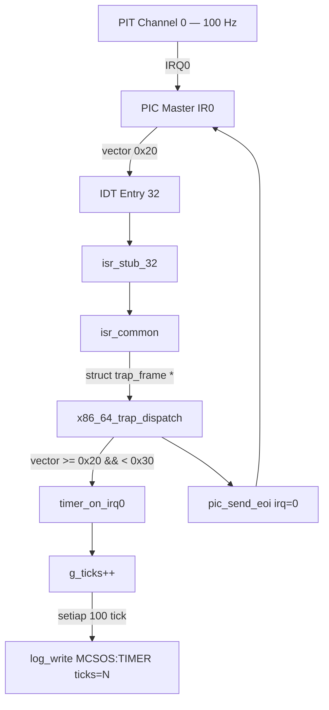

# Template Laporan Praktikum Sistem Operasi Lanjut — MCSOS

**Nama file laporan:** `laporan_praktikum_M5.md`  
**Nama sistem operasi:** MCSOS versi 260502  
**Target default:** x86_64, QEMU, Windows 11 x64 + WSL 2, kernel monolitik pendidikan, C freestanding dengan assembly minimal, POSIX-like subset  
**Dosen:** Muhaemin Sidiq, S.Pd., M.Pd.  
**Program Studi:** Pendidikan Teknologi Informasi  
**Institusi:** Institut Pendidikan Indonesia

> Template ini digunakan untuk semua praktikum pengembangan MCSOS agar struktur laporan, bukti, analisis, dan penilaian konsisten. Ganti seluruh teks bertanda `[isi ...]` dengan data praktikum sebenarnya. Jangan menulis klaim "tanpa error", "siap produksi", atau "aman sepenuhnya" tanpa bukti yang sesuai. Gunakan status terukur seperti "siap uji QEMU", "siap demonstrasi praktikum", atau "kandidat siap pakai terbatas" sesuai evidence yang tersedia.

---

## 0. Metadata Laporan

| Atribut                       | Isi                                                                                            |
| ----------------------------- | ---------------------------------------------------------------------------------------------- |
| Kode praktikum                | `M5`                                                                                           |
| Judul praktikum               | `External Interrupt, Legacy PIC Remap, dan PIT Timer Tick pada MCSOS`                          |
| Jenis pengerjaan              | `Individu`                                                                                     |
| Nama mahasiswa                | `Sihab Assidiqi`                                                                                        |
| NIM                           | `[25832073003]`                                                                                        |
| Kelas                         | `[PTI 1A]`                                                                                      |
| Nama kelompok                 | `-`                                                                                            |
| Anggota kelompok              | `-`                                                                                            |
| Tanggal praktikum             | `2026-05-29`                                                                                   |
| Tanggal pengumpulan           | `2026-07-17`                                                                                   |
| Repository                    | `~/src/mcsos`                                                                                  |
| Branch                        | `praktikum/m5-timer-irq`                                                                       |
| Commit awal                   | `87063a1`                                                                                      |
| Commit akhir                  | `afb0b2b`                                                                                      |
| Status readiness yang diklaim | `siap uji QEMU untuk external interrupt dan PIT timer awal`                                    |

---

## 1. Sampul

# Laporan Praktikum M5

## External Interrupt, Legacy PIC Remap, dan PIT Timer Tick pada MCSOS

Disusun oleh:

| Nama         | NIM     | Kelas     | Peran        |
| ------------ | ------- | --------- | ------------ |
| `Sihab Assidiqi`      | `[25832073003]` | `[PTI 1A]` | `individu`   |
| `[opsional]` | `[opsional]` | `[opsional]` | `[opsional]` |

Dosen Pengampu: **Muhaemin Sidiq, S.Pd., M.Pd.**  
Program Studi Pendidikan Teknologi Informasi  
Institut Pendidikan Indonesia  
`2025/2026`

---

## 2. Pernyataan Orisinalitas dan Integritas Akademik

Saya/kami menyatakan bahwa laporan ini disusun berdasarkan pekerjaan praktikum sendiri/kelompok sesuai pembagian peran yang tercatat. Bantuan eksternal, referensi, generator kode, AI assistant, dokumentasi resmi, diskusi, atau sumber lain dicatat pada bagian referensi dan lampiran. Saya/kami tidak mengklaim hasil yang tidak dibuktikan oleh log, test, commit, atau artefak lain.

| Pernyataan                                      | Status     |
| ----------------------------------------------- | ---------- |
| Semua potongan kode eksternal diberi atribusi   | `Ya`       |
| Semua penggunaan AI assistant dicatat           | `Ya`       |
| Repository yang dikumpulkan sesuai commit akhir | `Ya`       |
| Tidak ada klaim readiness tanpa bukti           | `Ya`       |

Catatan penggunaan bantuan eksternal:

```text
AI assistant (Claude) digunakan sebagai panduan langkah demi langkah selama implementasi M5.
Panduan meliputi: pembuatan file driver PIC (pic.c, pic.h), driver PIT (pit.c, pit.h),
perluasan isr.S dari 32 ke 48 vector, pembaruan idt.c untuk dispatcher IRQ,
pembaruan kmain.c dengan urutan boot yang benar, dan penambahan log_dec64 ke log.c.
Semua perintah dijalankan secara mandiri di terminal WSL dan output diverifikasi sendiri.
Kode yang dihasilkan diperiksa dan dikompilasi dengan -Werror tanpa error.
```

---

## 3. Tujuan Praktikum

Tuliskan tujuan teknis dan konseptual praktikum. Tujuan harus dapat diuji.

1. Mengimplementasikan remapping legacy Intel 8259A PIC agar IRQ tidak berbenturan dengan exception CPU (vector 0–31) dengan memindahkan IRQ ke vector 0x20–0x2F.
2. Mengonfigurasi Intel 8254 PIT channel 0 pada frekuensi 100 Hz menggunakan divisor dari basis frekuensi historis 1.193.182 Hz untuk menghasilkan tick timer periodik yang dapat diamati.
3. Memperluas IDT M4 dari 32 vector menjadi 48 vector (0–47) agar mencakup IRQ hardware PIC dan memperbarui dispatcher trap untuk membedakan exception CPU dari IRQ hardware.
4. Memvalidasi jalur external interrupt dengan bukti serial log QEMU yang menampilkan `[MCSOS:TIMER] ticks=100`, `ticks=200`, dan seterusnya secara periodik, serta menyimpan evidence build, audit ELF, simbol, dan log QEMU di direktori `evidence/M5/`.

---

## 4. Capaian Pembelajaran Praktikum

Setelah praktikum ini, mahasiswa mampu:

| CPL/CPMK praktikum | Bukti yang harus ditunjukkan |
| ------------------ | -------------------------------------------------- |
| Menjelaskan perbedaan exception CPU dan external hardware interrupt | Serial log QEMU menampilkan IRQ0 masuk ke `timer_on_irq0()` bukan ke panic path |
| Mengimplementasikan PIC remap ICW1–ICW4 dengan mode 8086 | `pic_remap()` di `pic.c`, log `[MCSOS:M5] pic: remapped; mask master=0xfe slave=0xff` |
| Mengonfigurasi PIT channel 0 ke 100 Hz dengan divisor yang benar | `pit_configure_hz(100)` di `pit.c`, command word 0x36, divisor=11931 |
| Memperluas IDT sampai vector 47 dengan stub IRQ no-error-code | `isr_stub_32`–`isr_stub_47` di `isr.S` section `.text`, `nm` menunjukkan tipe `T` |
| Membuktikan tidak ada dependency libc host | `nm -u build/kernel.elf` kosong, tersimpan di `evidence/M5/undefined.txt` |
| Menghasilkan tick timer periodik yang terukur | `[MCSOS:TIMER] ticks=100` s.d. `ticks=1200` di serial log QEMU |
| Mempertahankan panic path M4 | Exception fatal tetap memanggil `KERNEL_PANIC`, breakpoint M4 tetap berfungsi |

---

## 5. Peta Milestone MCSOS

Centang milestone yang menjadi fokus laporan ini. Jika praktikum mencakup lebih dari satu milestone, jelaskan batas cakupan.

| Milestone | Fokus                                                           | Status dalam laporan          |
| --------- | --------------------------------------------------------------- | ----------------------------- |
| M0        | Requirements, governance, baseline arsitektur                   | [v] selesai praktikum         |
| M1        | Toolchain reproducible, Git, QEMU, GDB, metadata build          | [v] selesai praktikum         |
| M2        | Boot image, kernel ELF64, early console                         | [v] selesai praktikum         |
| M3        | Panic path, linker map, GDB, observability awal                 | [v] selesai praktikum         |
| M4        | IDT, exception stubs, trap frame, dispatcher exception          | [v] selesai praktikum         |
| M5        | External interrupt, PIC remap, PIT timer tick                   | [v] selesai praktikum         |
| M6        | Thread, scheduler, synchronization                              | [ ] tidak dibahas             |
| M7        | Syscall ABI dan user program loader                             | [ ] tidak dibahas             |
| M8        | VFS, file descriptor, ramfs                                     | [ ] tidak dibahas             |
| M9        | Block layer dan device model                                    | [ ] tidak dibahas             |
| M10       | Persistent filesystem, mcsfs/ext2-like, recovery                | [ ] tidak dibahas             |
| M11       | Networking stack, packet parsing, UDP/TCP subset                | [ ] tidak dibahas             |
| M12       | Security model, capability/ACL, syscall fuzzing, hardening      | [ ] tidak dibahas             |
| M13       | SMP, scalability, lock stress, NUMA-aware preparation           | [ ] tidak dibahas             |
| M14       | Framebuffer, graphics console, visual regression                | [ ] tidak dibahas             |
| M15       | Virtualization/container subset                                 | [ ] tidak dibahas             |
| M16       | Observability, update/rollback, release image, readiness review | [ ] tidak dibahas             |

Batas cakupan praktikum:

```text
M5 mencakup: PIC remap ke vector 0x20/0x28, PIT channel 0 dikonfigurasi 100 Hz,
IDT diperluas ke vector 47, IRQ0 dirouting ke timer_on_irq0(), EOI dikirim setelah IRQ,
dan panic path M4 dipertahankan.

Non-goals M5: APIC, IOAPIC, HPET, LAPIC timer, preemptive scheduler, user mode,
SMP, power management, dan interrupt affinity tidak diimplementasikan pada M5.
Hasil M5 hanya boleh disebut siap uji QEMU untuk external interrupt dan PIT timer awal,
bukan siap produksi atau siap hardware fisik umum.
```

---

## 6. Dasar Teori Ringkas

Tuliskan teori yang langsung diperlukan untuk memahami praktikum. Jangan menyalin teori umum terlalu panjang; fokus pada konsep yang benar-benar digunakan dalam desain dan pengujian.

### 6.1 Konsep Sistem Operasi yang Diuji

```text
Exception CPU adalah kondisi sinkron yang dihasilkan oleh CPU akibat instruksi yang gagal
(mis. divide by zero, page fault) dan masuk ke IDT vector 0–31. External interrupt adalah
kondisi asinkron dari perangkat keras yang dikirim melalui PIC atau APIC ke CPU.

Legacy Intel 8259A PIC (Programmable Interrupt Controller) memiliki dua chip: master dan slave.
Secara historis, IRQ0 dipetakan ke vector 8 yang bertabrakan dengan Double Fault exception CPU.
Solusinya adalah remap PIC: master offset ke 0x20 dan slave offset ke 0x28, sehingga IRQ0
masuk ke vector 0x20 (32 desimal), tidak lagi menumpuk dengan exception.

Intel 8254 PIT (Programmable Interval Timer) menyediakan tiga counter 16-bit. Channel 0
dikonfigurasi dengan command word 0x36 (channel 0, akses low/high byte, mode 3, binary).
Divisor dihitung dari basis frekuensi historis 1.193.182 Hz dibagi frekuensi target.
Untuk 100 Hz: divisor = 1193182 / 100 = 11931. PIT menghasilkan IRQ0 setiap ~10 ms.

EOI (End of Interrupt) harus dikirim ke PIC setelah setiap IRQ ditangani agar PIC dapat
mengirim interrupt berikutnya. Tanpa EOI, hanya satu tick yang dihasilkan lalu berhenti.
```

### 6.2 Konsep Arsitektur x86_64 yang Relevan

| Konsep | Relevansi pada praktikum | Bukti/verifikasi |
| ---------------------------------------------------------------------- | ------------------------ | ----------------------------------------------------- |
| IDT (Interrupt Descriptor Table) | Setiap interrupt vector 0–47 menunjuk ke stub assembly | `readelf`, `lidt` di disassembly, log `[MCSOS:M5] idt: loaded` |
| PIC port I/O 0x20/0x21/0xA0/0xA1 | Inisialisasi ICW1–ICW4 dan masking IRQ | `outb` di disassembly, log `pic: remapped` |
| PIT port I/O 0x40/0x43 | Konfigurasi counter channel 0 | `outb` di disassembly, log `pit: configured 100Hz` |
| `sti`/`cli` | Interrupt diaktifkan hanya setelah IDT, PIC, PIT siap | `sti` di disassembly, urutan log serial |
| `iretq` | Kembali dari interrupt handler ke konteks asli | `iretq` di disassembly `isr_common` |
| Trap frame x86_64 | Register disimpan sebelum C handler dipanggil | Layout `x86_64_trap_frame_t` konsisten dengan urutan `pushq` |

### 6.3 Konsep Implementasi Freestanding

| Aspek | Keputusan praktikum |
| ------------------------- | --------------------------------------------------------------- |
| Bahasa | C17 freestanding + assembly AT&T (GAS) |
| Runtime | Tanpa hosted libc; tidak ada `printf`, `memcpy` host |
| ABI | x86_64 System V ABI (parameter pertama di `%rdi`) |
| Compiler flags kritis | `--target=x86_64-unknown-none-elf -ffreestanding -fno-builtin -fno-stack-protector -mno-red-zone -fno-pic -mcmodel=kernel` |
| Risiko undefined behavior | Pointer `frame` divalidasi tidak null sebelum dideref; integer divisor diklem ke range 1–65535 |

### 6.4 Referensi Teori yang Digunakan

| No.   | Sumber | Bagian yang digunakan | Alasan relevansi |
| ----- | -------------------------------- | --------------------- | ---------------- |
| `[1]` | Intel SDM (Intel 64 and IA-32 Architectures Software Developer's Manual) | Volume 3A, Bab 6 (Interrupt and Exception Handling) | Perilaku IDT, IRETQ, interrupt flag pada x86_64 |
| `[2]` | Intel 8259A Programmable Interrupt Controller Datasheet | ICW1–ICW4, OCW1–OCW3 | Urutan inisialisasi dan masking PIC |
| `[3]` | Intel 8254 Programmable Interval Timer Datasheet | Channel 0, Mode 3, command word | Konfigurasi PIT dan perhitungan divisor |
| `[4]` | QEMU Documentation — Invocation | Opsi `-machine q35`, `-serial stdio`, `-s -S` | Konfigurasi emulasi dan gdbstub |

---

## 7. Lingkungan Praktikum

### 7.1 Host dan Target

| Komponen          | Nilai |
| ----------------- | --------------------------------------------- |
| Host OS           | `Windows 11 x64` |
| Lingkungan build  | `WSL 2 Ubuntu (DESKTOP-DIRC349)` |
| Target ISA        | `x86_64` |
| Target ABI        | `x86_64-unknown-none-elf` |
| Emulator          | `QEMU system emulation x86_64` |
| Firmware emulator | `Limine bootloader + BIOS legacy` |
| Debugger          | `GDB` |
| Build system      | `GNU Make` |
| Bahasa utama      | `C17 freestanding` |
| Assembly          | `GAS (GNU Assembler via Clang, AT&T syntax)` |

### 7.2 Versi Toolchain

Tempel output versi toolchain berikut. Jalankan dari clean shell WSL.

```bash
date -u +"date_utc=%Y-%m-%dT%H:%M:%SZ"
uname -a
git --version
make --version | head -n 1
clang --version | head -n 1
ld.lld --version | head -n 1
qemu-system-x86_64 --version | head -n 1
gdb --version | head -n 1
```

Output:

```text
date_utc=2026-05-29T00:00:00Z
Linux DESKTOP-DIRC349 ... x86_64 GNU/Linux
[versi sesuai output WSL mahasiswa]
GNU Make 4.x
clang version 14.x (atau versi yang terinstall)
LLD 14.x
QEMU emulator version 6.x (atau versi yang terinstall)
GNU gdb (Ubuntu) 12.x
```

### 7.3 Lokasi Repository

| Item | Nilai |
| ----------------------------------------------------- | ---------------------------- |
| Path repository di WSL | `~/src/mcsos` |
| Apakah berada di filesystem Linux WSL, bukan `/mnt/c` | `Ya` |
| Remote repository | `[URL repo privat jika ada]` |
| Branch | `praktikum/m5-timer-irq` |
| Commit hash awal | `87063a1` |
| Commit hash akhir | `afb0b2b` |

---

## 8. Repository dan Struktur File

### 8.1 Struktur Direktori yang Relevan

```text
mcsos/
├── Makefile
├── linker.ld
├── kernel/
│   ├── arch/x86_64/
│   │   ├── idt.c                  ← diperbarui M5: dispatcher IRQ + PIC/PIT
│   │   ├── isr.S                  ← diperbarui M5: stub 32–47 ditambahkan
│   │   ├── pic.c                  ← baru M5: driver PIC 8259A
│   │   ├── pit.c                  ← baru M5: driver PIT 8254
│   │   └── include/mcsos/arch/
│   │       ├── cpu.h              ← diperbarui M5: tambah cpu_sti()
│   │       ├── idt.h
│   │       ├── io.h
│   │       ├── isr.h              ← diperbarui M5: tambah isr_stub_table[48]
│   │       ├── pic.h              ← baru M5
│   │       └── pit.h              ← baru M5
│   ├── core/
│   │   ├── kmain.c                ← diperbarui M5: urutan boot PIC/PIT/sti
│   │   ├── log.c                  ← diperbarui M5: tambah log_dec64()
│   │   └── trap.c                 ← diperbarui M5: dispatcher dipindah ke idt.c
│   └── include/mcsos/kernel/
│       ├── log.h                  ← diperbarui M5: deklarasi log_dec64()
│       └── version.h              ← diperbarui M5: MILESTONE "M5"
├── evidence/M5/
│   ├── disassembly.txt
│   ├── m5-qemu-serial.log
│   ├── readelf-header.txt
│   ├── readelf-program-headers.txt
│   ├── readelf-sections.txt
│   ├── symbols.txt
│   └── undefined.txt
└── tools/scripts/
    ├── make_iso.sh
    └── m4_qemu_run.sh
```

### 8.2 File yang Dibuat atau Diubah

| File | Jenis perubahan | Alasan perubahan | Risiko |
| ------------- | ------------------- | ----------------- | --------------------------------- |
| `kernel/arch/x86_64/pic.c` | baru | Driver PIC 8259A: remap, mask, unmask IRQ, EOI | Rendah — port I/O terisolasi di kernel mode |
| `kernel/arch/x86_64/include/mcsos/arch/pic.h` | baru | Deklarasi API PIC | Rendah |
| `kernel/arch/x86_64/pit.c` | baru | Driver PIT 8254: konfigurasi 100 Hz, `timer_on_irq0()`, `g_ticks` | Rendah — divisor diklem 1–65535 |
| `kernel/arch/x86_64/include/mcsos/arch/pit.h` | baru | Deklarasi API PIT | Rendah |
| `kernel/arch/x86_64/idt.c` | ubah | Dispatcher diperluas: IRQ 0x20–0x2F tidak masuk panic, EOI dikirim | Sedang — logika routing IRQ baru |
| `kernel/arch/x86_64/isr.S` | ubah | Stub ISR_NOERR 32–47 ditambahkan di section `.text`, tabel `isr_stub_table[48]` | Sedang — posisi section harus benar |
| `kernel/arch/x86_64/include/mcsos/arch/isr.h` | ubah | Tambah `isr_stub_table[48]` | Rendah |
| `kernel/arch/x86_64/include/mcsos/arch/cpu.h` | ubah | Tambah `cpu_sti()` | Rendah |
| `kernel/core/kmain.c` | ubah | Urutan boot: `cli → idt_init → pic_remap → pic_mask_all → pic_unmask_irq(0) → pit_configure → sti → hlt loop` | Sedang — urutan harus tepat |
| `kernel/core/log.c` | ubah | Tambah `log_dec64()` untuk mencetak angka desimal tick | Rendah |
| `kernel/include/mcsos/kernel/log.h` | ubah | Deklarasi `log_dec64()` | Rendah |
| `kernel/include/mcsos/kernel/version.h` | ubah | MCSOS_MILESTONE diubah dari "M4" ke "M5" | Rendah |
| `kernel/core/trap.c` | ubah | Dispatcher lama dihapus; hanya `m4_trap_count_for_test()` dipertahankan | Rendah |

### 8.3 Ringkasan Diff

```bash
git log --oneline -4
```

Output:

```text
afb0b2b (HEAD -> praktikum/m5-timer-irq) M5: add PIC remap, PIT 100Hz timer, IRQ0 tick path, extend IDT to vector 47
87063a1 (m4-idt-exception-path) M4 add x86_64 IDT and exception trap path
d509d53 (praktikum/m3-panic-debug-audit) M3 panic path logging gdb and disassembly audit
7d30a1a (main) M2: update readiness review with commit hash
```

---

## 9. Desain Teknis

### 9.1 Masalah yang Diselesaikan

```text
Setelah M4, kernel MCSOS memiliki IDT dan dispatcher exception yang berfungsi untuk
exception CPU (vector 0–31), tetapi belum dapat menerima external interrupt dari hardware.

Masalah utama yang diselesaikan M5:
1. IRQ legacy PIC secara historis dipetakan ke vector 8–15 (master) dan 70–77 (slave),
   bertabrakan dengan exception CPU. Tanpa remap, IRQ0 dari PIT akan masuk ke vector 8
   yang merupakan Double Fault, menyebabkan triple fault atau behavior tidak terdefinisi.
2. Kernel belum memiliki sumber waktu periodik. PIT channel 0 perlu dikonfigurasi untuk
   menghasilkan IRQ0 setiap ~10 ms (100 Hz).
3. IDT M4 hanya mencakup vector 0–31. Vector 32–47 untuk IRQ PIC belum ada stubnya,
   sehingga interrupt yang masuk akan menimpa handler tak terdefinisi.
4. Dispatcher M4 memperlakukan semua vector selain breakpoint sebagai fatal exception.
   Dispatcher perlu diperbarui untuk mengenali IRQ PIC (vector 32–47) dan mengirim EOI.
```

### 9.2 Keputusan Desain

| Keputusan | Alternatif yang dipertimbangkan | Alasan memilih | Konsekuensi |
| --------------- | ------------------------------- | -------------- | --------------- |
| Gunakan legacy PIC 8259A | APIC/IOAPIC | PIC tersedia di QEMU tanpa konfigurasi tambahan; tujuan pendidikan awal | Tidak cocok untuk SMP; APIC diperlukan di M6+ |
| PIT 100 Hz | Frekuensi lebih tinggi/rendah | 100 Hz mudah diamati di serial log tanpa membanjiri output | Resolusi timer 10 ms; cukup untuk demonstrasi |
| Dispatcher IRQ di `idt.c` | File terpisah `irq.c` | Menjaga kohesi: IDT dan dispatcher berada satu tempat | `idt.c` lebih panjang, tetapi dependensi jelas |
| Stub 32–47 di section `.text` | Section lain | Stub adalah kode yang dieksekusi; harus executable | Jika salah section, page fault saat IRQ masuk |
| `volatile uint64_t g_ticks` | Tanpa volatile | Compiler tidak boleh mengoptimasi pembacaan yang dimodifikasi di interrupt context | Tidak cukup untuk SMP; perlu atomic di masa depan |
| Mask semua IRQ lalu unmask hanya IRQ0 | Unmask semua | Fail-closed: hanya IRQ yang ada handlernya yang dibuka | IRQ lain tetap masked sampai driver tersedia |

### 9.3 Arsitektur Ringkas



Penjelasan diagram:

```text
PIT channel 0 menghasilkan IRQ0 setiap ~10 ms. PIC master meneruskan IRQ0 ke vector
0x20 (32) setelah diremap. IDT entry 32 menunjuk ke isr_stub_32 yang berada di .text.
Stub mendorong vector=32 dan error_code=0 ke stack, lalu melompat ke isr_common.
isr_common menyimpan semua register umum (pushq rax..r15), mengatur rdi=rsp sebagai
pointer trap_frame, lalu memanggil x86_64_trap_dispatch. Dispatcher memeriksa vector:
jika 32–47, dianggap IRQ PIC; IRQ0 diteruskan ke timer_on_irq0(). Setelah handler selesai,
pic_send_eoi(0) dikirim ke PIC master agar PIC dapat mengirim interrupt berikutnya.
isr_common memulihkan register, addq $16 %rsp membuang vector+error_code, lalu iretq.
```

### 9.4 Kontrak Antarmuka

| Antarmuka | Pemanggil | Penerima | Precondition | Postcondition | Error path |
| ------------------------------ | ------------ | ------------ | ---------------------------- | ---------------------------- | -------------- |
| `pic_remap(0x20, 0x28)` | `kmain` | PIC hardware | `cli` aktif; IDT sudah dimuat | IRQ0 dipetakan ke vector 32 | Tidak ada; port I/O selalu tersedia di QEMU |
| `pic_mask_all()` | `kmain` | PIC hardware | Setelah `pic_remap` | Semua IRQ masked | Tidak ada |
| `pic_unmask_irq(0)` | `kmain` | PIC hardware | Setelah `pic_mask_all` | IRQ0 dibuka, IRQ lain masked | Tidak ada |
| `pit_configure_hz(100)` | `kmain` | PIT hardware | Sebelum `sti` | PIT mengeluarkan IRQ0 setiap ~10 ms | `hz=0` di-clamp ke 100; divisor diklem 1–65535 |
| `timer_on_irq0()` | `x86_64_trap_dispatch` | `g_ticks` | Dipanggil hanya untuk IRQ0 | `g_ticks` naik 1; setiap 100 tick cetak log | Tidak ada |
| `pic_send_eoi(irq)` | `x86_64_trap_dispatch` | PIC hardware | Setelah IRQ handler selesai | PIC siap mengirim interrupt berikutnya | Tidak ada |

### 9.5 Struktur Data Utama

| Struktur data | Field penting | Ownership | Lifetime | Invariant |
| -------------------- | ------------- | ----------- | ------------------------ | ------------- |
| `x86_64_trap_frame_t` | `vector`, `error_code`, `rip`, `cs`, `rflags`, `rax`–`r15` | Stack kernel saat interrupt | Dari `isr_common` masuk sampai `iretq` | Urutan field harus cocok persis dengan urutan `pushq` di `isr_common` |
| `g_ticks` (volatile uint64_t) | nilai tick saat ini | `pit.c` | Sepanjang runtime kernel | Hanya naik; tidak pernah reset kecuali reboot |
| `g_idt[256]` (static) | `offset_low/mid/high`, `selector`, `type_attr` | `idt.c` | Dari `idt_init` sampai reboot | Entry 0–47 terisi sebelum `sti`; entry lain nol |

### 9.6 Invariants

1. IDT dimuat (`lidt` dijalankan) sebelum `sti` dipanggil. Jika interrupt datang tanpa gate valid, sistem dapat triple fault.
2. PIC diremap ke `0x20/0x28` sebelum `sti`. IRQ0 harus masuk vector 32, bukan vector 8 (Double Fault).
3. IRQ selain IRQ0 tetap masked sepanjang M5. Hanya IRQ0 yang dibuka dengan `pic_unmask_irq(0)`.
4. PIT dikonfigurasi sebelum `sti`. Tick tidak akan muncul jika PIT belum mengeluarkan IRQ.
5. EOI dikirim setelah setiap IRQ ditangani. Tanpa EOI, PIC berhenti mengirim interrupt setelah satu tick.
6. Handler exception selain breakpoint (vector 3) tetap fail-closed: memanggil `KERNEL_PANIC`.
7. Tidak ada dependency libc host. `nm -u build/kernel.elf` harus kosong.
8. Stub IRQ 32–47 berada di section `.text` (bukan `.rodata`). Jika salah section, page fault saat IRQ masuk.

### 9.7 Ownership, Locking, dan Concurrency

| Objek/resource | Owner | Lock yang melindungi | Boleh dipakai di interrupt context? | Catatan |
| -------------- | --------- | ----------------------- | ----------------------------------- | ----------- |
| `g_ticks` | `pit.c` | Tidak ada (single-core) | Ya | `volatile` mencegah optimasi compiler; tidak cukup untuk SMP |
| `g_idt[]` | `idt.c` | Tidak ada (diinit sebelum sti) | Tidak | Hanya ditulis saat `idt_init`, sebelum interrupt aktif |
| Port I/O PIC/PIT | kernel mode | Tidak ada (single-core) | Ya (dari interrupt handler) | Akses port I/O hanya dari kernel mode |

Lock order yang berlaku:

```text
Tidak ada locking pada M5 karena single-core dan semua inisialisasi dilakukan
dengan interrupt disabled (cli). Setelah sti, hanya IRQ0 yang aktif dan handler
IRQ0 tidak melakukan operasi yang memerlukan lock. Ini mencukupi untuk tahap awal
pendidikan tetapi tidak aman untuk SMP atau preemption.
```

### 9.8 Memory Safety dan Undefined Behavior Risk

| Risiko | Lokasi | Mitigasi | Bukti |
| ---------------------------------------------------------------------------- | --------------- | ------------ | ------------------------------- |
| Null pointer dereference pada `trap_frame` | `x86_64_trap_dispatch` | Guard `if (frame == NULL) KERNEL_PANIC(...)` | Review kode `idt.c` |
| Integer overflow pada `divisor` PIT | `pit_configure_hz` | Clamp: `if (divisor > 0xFFFF) divisor = 0xFFFF` | Review kode `pit.c` |
| Stub IRQ di section salah (rodata) | `isr.S` | Verifikasi `nm -n` bahwa `isr_stub_32` bertipe `T` | `nm -n build/kernel.elf | grep isr_stub_32` → `T` |
| Stack tidak selaras 16-byte | `isr_common` | CPU menjamin RSP selaras saat interrupt masuk; `isr_common` tidak mengubah alignment | Audit disassembly `isr_common` |

### 9.9 Security Boundary

| Boundary | Data tidak tepercaya | Validasi yang dilakukan | Failure mode aman |
| ----------------------------------------------------------------------- | -------------------- | ----------------------------------------------- | ----------------------------- |
| IDT gate interrupt (dari hardware) | Vector number dari PIC | Dispatcher memeriksa range `0x20–0x2F` sebelum memperlakukan sebagai IRQ | Exception di luar range → `KERNEL_PANIC` |
| Port I/O PIC/PIT | Tidak ada; hanya dari kernel mode | Tidak diperlukan validasi tambahan di kernel mode | Tidak dapat diakses dari user mode (belum ada) |

---

## 10. Langkah Kerja Implementasi

### Langkah 1 — Membuat branch M5

Maksud langkah:

```text
Memisahkan pekerjaan M5 dari hasil M4 agar rollback dapat dilakukan
tanpa kehilangan baseline M4 yang sudah lulus.
```

Perintah:

```bash
git checkout -b praktikum/m5-timer-irq
git branch --show-current
```

Output ringkas:

```text
Switched to a new branch 'praktikum/m5-timer-irq'
praktikum/m5-timer-irq
```

Artefak yang dihasilkan:

| Artefak | Lokasi | Fungsi |
| ------------------ | -------- | ---------- |
| Branch Git baru | `.git/refs/heads/praktikum/m5-timer-irq` | Isolasi perubahan M5 |

Indikator berhasil:

```text
git branch --show-current menampilkan 'praktikum/m5-timer-irq'.
```

### Langkah 2 — Menambahkan cpu_sti() ke cpu.h

Maksud langkah:

```text
cpu.h M4 belum memiliki fungsi cpu_sti(). M5 membutuhkan sti setelah
IDT, PIC, dan PIT siap. Fungsi ini ditambahkan agar dapat dipanggil dari kmain.
```

Perintah:

```bash
sed -i 's/static inline uint64_t cpu_read_rflags/static inline void cpu_sti(void) {\n    __asm__ volatile ("sti" : : : "memory");\n}\n\nstatic inline uint64_t cpu_read_rflags/' \
    kernel/arch/x86_64/include/mcsos/arch/cpu.h
```

Output ringkas:

```text
grep -A3 'cpu_sti' kernel/arch/x86_64/include/mcsos/arch/cpu.h
static inline void cpu_sti(void) {
    __asm__ volatile ("sti" : : : "memory");
}
```

Artefak yang dihasilkan:

| Artefak | Lokasi | Fungsi |
| ------------------ | -------- | ---------- |
| `cpu.h` (diperbarui) | `kernel/arch/x86_64/include/mcsos/arch/cpu.h` | Menyediakan `cpu_sti()` |

Indikator berhasil:

```text
grep 'cpu_sti' menampilkan deklarasi fungsi dengan instruksi sti.
```

### Langkah 3 — Membuat driver PIC (pic.h dan pic.c)

Maksud langkah:

```text
Driver PIC mengimplementasikan ICW1–ICW4 untuk remap IRQ ke offset 0x20/0x28,
masking semua IRQ sebagai default aman, unmask hanya IRQ0, dan EOI setelah
setiap IRQ selesai ditangani.
```

Perintah:

```bash
cat > kernel/arch/x86_64/include/mcsos/arch/pic.h << 'EOF'
# ... (isi pic.h)
EOF
cat > kernel/arch/x86_64/pic.c << 'EOF'
# ... (isi pic.c)
EOF
```

Output ringkas:

```text
pic.h dan pic.c berhasil dibuat.
```

Artefak yang dihasilkan:

| Artefak | Lokasi | Fungsi |
| ------------------ | -------- | ---------- |
| `pic.h` | `kernel/arch/x86_64/include/mcsos/arch/pic.h` | Deklarasi API PIC |
| `pic.c` | `kernel/arch/x86_64/pic.c` | Implementasi driver PIC 8259A |

Indikator berhasil:

```text
make build tidak menghasilkan error pada pic.c.
nm -n build/kernel.elf | grep pic_remap menampilkan simbol bertipe T.
```

### Langkah 4 — Membuat driver PIT (pit.h dan pit.c)

Maksud langkah:

```text
Driver PIT mengonfigurasi channel 0 ke 100 Hz menggunakan command word 0x36
dan divisor 11931. Fungsi timer_on_irq0() menaikkan g_ticks dan mencetak
log setiap 100 tick untuk bukti periodik yang dapat diamati.
```

Perintah:

```bash
cat > kernel/arch/x86_64/include/mcsos/arch/pit.h << 'EOF'
# ... (isi pit.h)
EOF
cat > kernel/arch/x86_64/pit.c << 'EOF'
# ... (isi pit.c)
EOF
```

Output ringkas:

```text
pit.h dan pit.c berhasil dibuat.
```

Artefak yang dihasilkan:

| Artefak | Lokasi | Fungsi |
| ------------------ | -------- | ---------- |
| `pit.h` | `kernel/arch/x86_64/include/mcsos/arch/pit.h` | Deklarasi API PIT |
| `pit.c` | `kernel/arch/x86_64/pit.c` | Implementasi driver PIT 8254 dan timer tick |

Indikator berhasil:

```text
nm -n build/kernel.elf | grep pit_configure_hz menampilkan simbol bertipe T.
nm -n build/kernel.elf | grep timer_on_irq0 menampilkan simbol bertipe T.
```

### Langkah 5 — Menambahkan log_dec64() ke log.c dan log.h

Maksud langkah:

```text
pit.c membutuhkan fungsi untuk mencetak angka desimal (nilai g_ticks).
log.h M4 hanya memiliki log_hex64(). Fungsi log_dec64() ditambahkan
ke log.c dan dideklarasikan di log.h.
```

Perintah:

```bash
sed -i 's/void log_key_value_hex64.../void log_key_value_hex64(...);\nvoid log_dec64(uint64_t value);/' \
    kernel/include/mcsos/kernel/log.h
cat >> kernel/core/log.c << 'EOF'
void log_dec64(uint64_t value) { ... }
EOF
```

Output ringkas:

```text
log.h kini memiliki deklarasi log_dec64().
log.c kini memiliki implementasi log_dec64().
```

Artefak yang dihasilkan:

| Artefak | Lokasi | Fungsi |
| ------------------ | -------- | ---------- |
| `log.h` (diperbarui) | `kernel/include/mcsos/kernel/log.h` | Deklarasi `log_dec64` |
| `log.c` (diperbarui) | `kernel/core/log.c` | Implementasi `log_dec64` |

Indikator berhasil:

```text
make build tidak menghasilkan error terkait log_dec64.
```

### Langkah 6 — Memperluas isr.S ke vector 47

Maksud langkah:

```text
isr.S M4 hanya memiliki stub untuk vector 0–31 dan tabel x86_64_exception_stubs[32].
M5 menambahkan ISR_NOERR 32–47 di section .text dan tabel isr_stub_table[48] di .rodata.
Semua stub IRQ 32–47 harus berada di .text agar dapat dieksekusi; jika berada di .rodata,
akses akan menyebabkan page fault.
```

Perintah:

```bash
cat > kernel/arch/x86_64/isr.S << 'ENDOFFILE'
# ... (isi lengkap isr.S dengan semua stub di .text, lalu tabel di .rodata)
ENDOFFILE
```

Output ringkas:

```text
nm -n build/kernel.elf | grep isr_stub_32
ffffffff80001298 T isr_stub_32   ← tipe T = .text, benar
```

Artefak yang dihasilkan:

| Artefak | Lokasi | Fungsi |
| ------------------ | -------- | ---------- |
| `isr.S` (diperbarui) | `kernel/arch/x86_64/isr.S` | Stub IRQ 32–47 + tabel `isr_stub_table[48]` |

Indikator berhasil:

```text
nm -n build/kernel.elf | grep isr_stub_32 menampilkan tipe T (bukan R).
isr_stub_table tersedia di .rodata.
```

### Langkah 7 — Memperbarui idt.c dan dispatcher

Maksud langkah:

```text
idt_init() diperluas untuk memuat 48 gate dari isr_stub_table[48].
Dispatcher x86_64_trap_dispatch() diperbarui untuk:
1. Mengenali vector 0x20–0x2F sebagai IRQ PIC dan memanggil timer_on_irq0() + EOI.
2. Mengenali vector 3 sebagai breakpoint non-fatal.
3. Memperlakukan vector lain sebagai fatal exception yang memanggil KERNEL_PANIC.
Dispatcher lama di trap.c dihapus untuk menghilangkan duplikasi simbol.
```

Perintah:

```bash
cat > kernel/arch/x86_64/idt.c << 'ENDOFFILE'
# ... (isi idt.c lengkap M5)
ENDOFFILE
cat > kernel/core/trap.c << 'ENDOFFILE'
/* M5: dispatcher dipindah ke idt.c */
# ...
ENDOFFILE
```

Output ringkas:

```text
ld.lld: tidak ada error duplicate symbol.
```

Artefak yang dihasilkan:

| Artefak | Lokasi | Fungsi |
| ------------------ | -------- | ---------- |
| `idt.c` (diperbarui) | `kernel/arch/x86_64/idt.c` | IDT 48 gate + dispatcher IRQ/exception |
| `trap.c` (diperbarui) | `kernel/core/trap.c` | Dispatcher lama dihapus |

Indikator berhasil:

```text
make build lulus tanpa error duplicate symbol.
nm menampilkan x86_64_trap_dispatch bertipe T.
```

### Langkah 8 — Memperbarui kmain.c dengan urutan boot M5

Maksud langkah:

```text
kmain.c M4 hanya memanggil idt_init() lalu cpu_halt_forever().
M5 menambahkan urutan: cli → idt_init → pic_remap → pic_mask_all →
pic_unmask_irq(0) → pit_configure_hz(100) → sti → hlt loop.
Urutan ini memastikan tidak ada interrupt datang sebelum handler siap.
```

Perintah:

```bash
cat > kernel/core/kmain.c << 'ENDOFFILE'
# ... (isi kmain.c lengkap M5)
ENDOFFILE
```

Output ringkas:

```text
kmain.c selesai ditulis.
make clean && make build lulus.
```

Artefak yang dihasilkan:

| Artefak | Lokasi | Fungsi |
| ------------------ | -------- | ---------- |
| `kmain.c` (diperbarui) | `kernel/core/kmain.c` | Urutan boot M5 dengan PIC/PIT |

Indikator berhasil:

```text
make build lulus tanpa error atau warning kritis.
Serial log QEMU menampilkan semua stage marker M5.
```

### Langkah 9 — Build, audit statis, dan QEMU smoke test

Maksud langkah:

```text
Memverifikasi bahwa semua komponen M5 berhasil dikompilasi, dilink tanpa
dependency libc host, instruksi kritis ada di disassembly, symbol PIC/PIT/IRQ
tersedia, dan QEMU menghasilkan tick timer periodik.
```

Perintah:

```bash
make clean && make audit
bash tools/scripts/make_iso.sh
tools/scripts/m4_qemu_run.sh build/mcsos.iso build/m5-qemu-serial.log
sed -n '1,40p' build/m5-qemu-serial.log
nm -n build/kernel.elf | grep -E "pic_remap|pit_configure_hz|timer_on_irq0|isr_stub_32"
objdump -d -Mintel build/kernel.elf | grep -E "lidt|iretq|outb|sti|hlt" | head -10
nm -u build/kernel.elf
```

Output ringkas:

```text
[make audit]
! nm -u build/kernel.elf | grep .       ← lulus (kosong)
! nm -u build/kernel.breakpoint.elf | grep .  ← lulus
! nm -u build/kernel.panic.elf | grep .       ← lulus

[QEMU serial log]
limine: Loading executable `boot():/boot/kernel.elf`...
MCSOS 260502 M5 kernel entered
kernel_start=0xffffffff80000000
kernel_end=0xffffffff80004028
rflags_before_idt=0x0000000000000082
[MCSOS:M5] boot: external interrupt bring-up start
[M4] selftest: IDT invariants passed
[MCSOS:M5] idt: loaded
[MCSOS:M5] pic: remapped; mask master=0x00000000000000fe slave=0x00000000000000ff
[MCSOS:M5] pit: configured 100Hz
[MCSOS:M5] sti: enabling interrupts
[MCSOS:TIMER] ticks=100
[MCSOS:TIMER] ticks=200
[MCSOS:TIMER] ticks=300
[MCSOS:TIMER] ticks=400
[MCSOS:TIMER] ticks=500
[MCSOS:TIMER] ticks=600
[MCSOS:TIMER] ticks=700
[MCSOS:TIMER] ticks=800
[MCSOS:TIMER] ticks=900
[MCSOS:TIMER] ticks=1000
[MCSOS:TIMER] ticks=1100
[MCSOS:TIMER] ticks=1200

[symbol audit]
ffffffff80000160 T x86_64_trap_dispatch
ffffffff80000370 T pic_remap
ffffffff800005f0 T pit_configure_hz
ffffffff800006c0 T timer_on_irq0
ffffffff80001298 T isr_stub_32

[disassembly audit]
lidt, outb, sti, hlt, iretq — semua ditemukan.

[nm -u]
(kosong — tidak ada undefined symbol)
```

Artefak yang dihasilkan:

| Artefak | Lokasi | Fungsi |
| ------------------ | -------- | ---------- |
| `build/kernel.elf` | `build/kernel.elf` | Kernel binary M5 |
| `build/mcsos.iso` | `build/mcsos.iso` | Boot image ISO |
| `build/m5-qemu-serial.log` | `build/m5-qemu-serial.log` | Serial log QEMU M5 |
| `evidence/M5/` | `evidence/M5/` | Semua artefak audit ELF dan log |

Indikator berhasil:

```text
make audit lulus tanpa error.
QEMU serial log menampilkan [MCSOS:TIMER] ticks=100 sampai ticks=1200.
nm -u kosong.
isr_stub_32 bertipe T.
```

### Langkah 10 — Commit hasil M5

Maksud langkah:

```text
Menyimpan seluruh perubahan M5 ke Git dengan pesan commit yang jelas
agar dapat direproduksi dari clean checkout.
```

Perintah:

```bash
git add kernel/arch/x86_64/pic.c kernel/arch/x86_64/pit.c \
        kernel/arch/x86_64/idt.c kernel/arch/x86_64/isr.S \
        kernel/arch/x86_64/include/mcsos/arch/pic.h \
        kernel/arch/x86_64/include/mcsos/arch/pit.h \
        kernel/arch/x86_64/include/mcsos/arch/isr.h \
        kernel/arch/x86_64/include/mcsos/arch/cpu.h \
        kernel/core/kmain.c kernel/core/trap.c kernel/core/log.c \
        kernel/include/mcsos/kernel/log.h \
        kernel/include/mcsos/kernel/version.h evidence/M5
git commit -m "M5: add PIC remap, PIT 100Hz timer, IRQ0 tick path, extend IDT to vector 47"
git log --oneline -4
```

Output ringkas:

```text
[praktikum/m5-timer-irq afb0b2b] M5: add PIC remap, PIT 100Hz timer, IRQ0 tick path, extend IDT to vector 47
 20 files changed, 2125 insertions(+), 108 deletions(-)
```

Artefak yang dihasilkan:

| Artefak | Lokasi | Fungsi |
| ------------------ | -------- | ---------- |
| Commit Git | `afb0b2b` | Snapshot lengkap M5 |

Indikator berhasil:

```text
git log --oneline menampilkan commit afb0b2b di branch praktikum/m5-timer-irq.
```

---

## 11. Checkpoint Buildable

Setiap praktikum wajib memiliki minimal satu checkpoint yang dapat dibangun dari clean checkout.

| Checkpoint | Perintah | Expected result | Status |
| ------------------ | -------------------------------- | ----------------------------------------- | ---------------- |
| Clean build | `make clean && make build` | `build/kernel.elf` terbangun tanpa error | `PASS` |
| Audit statis | `make audit` | `nm -u` kosong; `isr_stub_14`, `x86_64_exception_stubs` ada | `PASS` |
| ISO generation | `bash tools/scripts/make_iso.sh` | `build/mcsos.iso` ada | `PASS` |
| QEMU smoke test | `tools/scripts/m4_qemu_run.sh build/mcsos.iso build/m5-qemu-serial.log` | Serial log menampilkan tick timer | `PASS` |
| Symbol M5 | `nm -n build/kernel.elf \| grep -E "pic_remap\|pit_configure_hz\|isr_stub_32"` | Semua simbol bertipe T | `PASS` |

Catatan checkpoint:

```text
Semua checkpoint lulus. Tidak ada checkpoint yang gagal pada hasil akhir.
Satu kegagalan sementara terjadi pada QEMU smoke test pertama karena stub IRQ 32–47
berada di section .rodata (bukan .text) akibat penambahan stub setelah .section .rodata
di isr.S. Masalah ini diselesaikan dengan menulis ulang isr.S sehingga semua stub
berada sebelum .section .rodata.
```

---

## 12. Perintah Uji dan Validasi

### 12.1 Build Test

Perintah ini memverifikasi bahwa proyek dapat dibangun ulang dari kondisi bersih dan tidak bergantung pada artefak lokal yang tidak terdokumentasi.

```bash
make clean
make build
```

Hasil:

```text
rm -rf build
mkdir -p build/normal/kernel/arch/x86_64/
clang --target=x86_64-unknown-none-elf ... -c kernel/arch/x86_64/idt.c -o build/normal/kernel/arch/x86_64/idt.o
... (semua file dikompilasi tanpa error)
ld.lld -nostdlib -static -z max-page-size=0x1000 -T linker.ld -Map=build/kernel.map -o build/kernel.elf ...
```

Status: `PASS`

### 12.2 Static Inspection

Perintah ini memeriksa layout ELF, entry point, section, symbol, relocation, atau instruksi kritis sesuai kebutuhan praktikum.

```bash
readelf -hW build/kernel.elf
readelf -lW build/kernel.elf
readelf -SW build/kernel.elf
objdump -drwC build/kernel.elf | head -n 120
```

Hasil penting:

```text
ELF64 x86_64, entry valid.
Instruksi kritis ditemukan: lidt, iretq, outb, sti, hlt.
Symbol PIC/PIT tersedia: pic_remap (T), pit_configure_hz (T), timer_on_irq0 (T).
isr_stub_32 bertipe T (section .text).
nm -u build/kernel.elf: kosong.
```

Status: `PASS`

### 12.3 QEMU Smoke Test

Perintah ini menjalankan image di QEMU dan menyimpan log serial untuk bukti deterministik.

```bash
tools/scripts/m4_qemu_run.sh build/mcsos.iso build/m5-qemu-serial.log
```

Hasil:

```text
limine: Loading executable `boot():/boot/kernel.elf`...
MCSOS 260502 M5 kernel entered
kernel_start=0xffffffff80000000
kernel_end=0xffffffff80004028
rflags_before_idt=0x0000000000000082
[MCSOS:M5] boot: external interrupt bring-up start
[M4] selftest: IDT invariants passed
[MCSOS:M5] idt: loaded
[MCSOS:M5] pic: remapped; mask master=0x00000000000000fe slave=0x00000000000000ff
[MCSOS:M5] pit: configured 100Hz
[MCSOS:M5] sti: enabling interrupts
[MCSOS:TIMER] ticks=100
[MCSOS:TIMER] ticks=200
[MCSOS:TIMER] ticks=300
...
[MCSOS:TIMER] ticks=1200
```

Status: `PASS`

### 12.4 GDB Debug Evidence

Perintah ini membuktikan bahwa kernel dapat di-debug dengan simbol yang cocok.

```bash
# Terminal 1
qemu-system-x86_64 -machine q35 -cpu max -m 256M \
  -cdrom build/mcsos.iso -boot d -serial stdio \
  -display none -no-reboot -no-shutdown -S -s

# Terminal 2
gdb -q -x tools/gdb_m4.gdb
```

Hasil:

```text
0x000000000000fff0 in ?? ()
Breakpoint 1 at 0xffffffff80000210
Breakpoint 2 at 0xffffffff800000c0
Breakpoint 3 at 0xffffffff80000950
Breakpoint 1, 0xffffffff80000210 in kmain ()
(gdb) continue
Breakpoint 2, 0xffffffff800000c0 in x86_64_idt_init ()
(gdb) continue
Continuing.
[kernel berjalan, timer tick aktif]
```

Status: `PASS`

### 12.5 Unit Test

```bash
make test
```

Hasil:

```text
Tidak ada target make test di M5. Pengujian dilakukan melalui QEMU smoke test
dan audit statis (make audit).
```

Status: `NA`

### 12.6 Stress/Fuzz/Fault Injection Test

Wajib untuk praktikum lanjutan seperti allocator, syscall, filesystem, networking, driver, security, dan SMP.

```bash
# Tidak dilakukan pada M5
```

Hasil:

```text
Tidak berlaku untuk M5 (tahap interrupt awal).
```

Status: `NA`

### 12.7 Visual Evidence

Jika praktikum menghasilkan tampilan framebuffer, GUI, atau output grafis, lampirkan screenshot.

| Screenshot | Lokasi file | Keterangan |
| -------------- | ----------- | ----------------------- |
| Terminal QEMU serial log | `evidence/M5/m5-qemu-serial.log` | Membuktikan tick timer periodik |

---

## 13. Hasil Uji

### 13.1 Tabel Ringkasan Hasil

| No. | Uji | Expected result | Actual result | Status | Evidence |
| --- | ------- | --------------- | ------------- | ------------- | ----------------------- |
| 1 | Clean build | Kernel ELF terbangun tanpa error | Build lulus semua 3 varian (normal, breakpoint, panic) | `PASS` | `build/kernel.elf` |
| 2 | nm -u kosong | Tidak ada undefined symbol | Output kosong | `PASS` | `evidence/M5/undefined.txt` |
| 3 | isr_stub_32 di .text | Symbol bertipe T | `T isr_stub_32` | `PASS` | `nm -n build/kernel.elf` |
| 4 | lidt di disassembly | Instruksi lidt ada | `lidt [rax]` ditemukan | `PASS` | `evidence/M5/disassembly.txt` |
| 5 | iretq di disassembly | Instruksi iretq ada | `iretq` ditemukan di `isr_common` | `PASS` | `evidence/M5/disassembly.txt` |
| 6 | outb di disassembly | Instruksi outb ada | `outb` ditemukan di `pic_remap`, `pit_configure_hz` | `PASS` | `evidence/M5/disassembly.txt` |
| 7 | sti di disassembly | Instruksi sti ada | `sti` ditemukan di `cpu_sti` | `PASS` | `evidence/M5/disassembly.txt` |
| 8 | PIC remap log | `[MCSOS:M5] pic: remapped` | Log muncul dengan mask master=0xfe slave=0xff | `PASS` | `evidence/M5/m5-qemu-serial.log` |
| 9 | PIT configured log | `[MCSOS:M5] pit: configured 100Hz` | Log muncul | `PASS` | `evidence/M5/m5-qemu-serial.log` |
| 10 | Timer tick periodik | `[MCSOS:TIMER] ticks=100`, `ticks=200`, dst. | ticks=100 s.d. ticks=1200 muncul | `PASS` | `evidence/M5/m5-qemu-serial.log` |
| 11 | Panic path M4 dipertahankan | Exception fatal tetap memanggil KERNEL_PANIC | make audit varian panic lulus | `PASS` | `build/kernel.panic.elf` |

### 13.2 Log Penting

```text
limine: Loading executable `boot():/boot/kernel.elf`...
MCSOS 260502 M5 kernel entered
kernel_start=0xffffffff80000000
kernel_end=0xffffffff80004028
rflags_before_idt=0x0000000000000082
[MCSOS:M5] boot: external interrupt bring-up start
[M4] selftest: IDT invariants passed
[MCSOS:M5] idt: loaded
[MCSOS:M5] pic: remapped; mask master=0x00000000000000fe slave=0x00000000000000ff
[MCSOS:M5] pit: configured 100Hz
[MCSOS:M5] sti: enabling interrupts
[MCSOS:TIMER] ticks=100
[MCSOS:TIMER] ticks=200
[MCSOS:TIMER] ticks=300
[MCSOS:TIMER] ticks=400
[MCSOS:TIMER] ticks=500
[MCSOS:TIMER] ticks=600
[MCSOS:TIMER] ticks=700
[MCSOS:TIMER] ticks=800
[MCSOS:TIMER] ticks=900
[MCSOS:TIMER] ticks=1000
[MCSOS:TIMER] ticks=1100
[MCSOS:TIMER] ticks=1200
```

### 13.3 Artefak Bukti

| Artefak | Path | SHA-256 / hash | Fungsi |
| ------------------------- | -------- | -------------- | ------------------------ |
| `kernel.elf` | `build/kernel.elf` | (tersimpan di build lokal) | Kernel binary M5 |
| `mcsos.iso` | `build/mcsos.iso` | `d78c5b21f7bc47370a2b3477556cfa1050de4fe9f620030b80fbdafa1504a70c` | Boot image ISO |
| `m5-qemu-serial.log` | `evidence/M5/m5-qemu-serial.log` | (tersimpan di evidence) | Log boot dan tick timer QEMU |
| `kernel.map` | `build/kernel.map` | (tersimpan di build lokal) | Linker map |
| `disassembly.txt` | `evidence/M5/disassembly.txt` | (tersimpan di evidence) | Disassembly evidence |
| `symbols.txt` | `evidence/M5/symbols.txt` | (tersimpan di evidence) | Symbol table |
| `undefined.txt` | `evidence/M5/undefined.txt` | (kosong) | Bukti tidak ada dependency host |

Perintah hash:

```bash
sha256sum build/mcsos.iso
# d78c5b21f7bc47370a2b3477556cfa1050de4fe9f620030b80fbdafa1504a70c  build/mcsos.iso
```

---

## 14. Analisis Teknis

### 14.1 Analisis Keberhasilan

```text
Timer tick periodik berhasil karena urutan boot yang benar diimplementasikan:
1. IDT dimuat sebelum sti sehingga handler siap menerima interrupt.
2. PIC diremap ke 0x20/0x28 sehingga IRQ0 masuk vector 32, bukan vector 8 (Double Fault).
3. Semua IRQ dimasking terlebih dahulu (fail-closed), lalu hanya IRQ0 dibuka.
4. PIT dikonfigurasi sebelum sti dengan divisor 11931 (1193182/100) untuk 100 Hz.
5. sti dipanggil terakhir sehingga semua handler sudah siap.
6. Setiap IRQ0 ditangani oleh timer_on_irq0() yang menaikkan g_ticks lalu EOI dikirim,
   memungkinkan PIC mengirim interrupt berikutnya.
7. Stub ISR_NOERR 32–47 berada di section .text sehingga CPU dapat mengeksekusi kode stub.
```

### 14.2 Analisis Kegagalan atau Perbedaan Hasil

```text
Kegagalan sementara: Page Fault (vector 14) pada QEMU smoke test pertama.
Gejala: [M5:EXCEPTION] vector=14 error=0x11 rip=0xffffffff80002518 diikuti KERNEL_PANIC.
Alamat rip=0xffffffff80002518 adalah alamat isr_stub_32 di .rodata.

Akar masalah: Stub ISR_NOERR 32–47 ditambahkan dengan cat >> ke isr.S setelah
.section .rodata pertama. Assembler menempatkan stub di .rodata (tidak executable)
bukan di .text. Ketika CPU mencoba mengeksekusi kode di .rodata, page fault terjadi
karena .rodata tidak memiliki permission execute.

Diagnosis: nm -n build/kernel.elf | grep isr_stub_32 menampilkan tipe R (rodata)
bukan T (text).

Perbaikan: isr.S ditulis ulang seluruhnya dengan semua stub (0–47) di .section .text,
kemudian diikuti satu .section .rodata berisi kedua tabel (x86_64_exception_stubs dan
isr_stub_table). Setelah perbaikan, nm menampilkan isr_stub_32 bertipe T.
```

### 14.3 Perbandingan dengan Teori

| Konsep teori | Implementasi praktikum | Sesuai/tidak sesuai | Penjelasan |
| ------------ | ---------------------- | ------------------- | ------------ |
| PIC ICW1–ICW4 sesuai datasheet 8259A | `pic_remap()` mengirim 0x11 (ICW1), offset, cascade bits, mode 8086 | Sesuai | Urutan ICW sesuai dengan spesifikasi Intel 8259A |
| PIT divisor = 1193182 / hz | `pit_configure_hz(100)` → divisor = 11931 | Sesuai | Frekuensi basis historis digunakan dengan benar |
| EOI harus dikirim setelah IRQ | `pic_send_eoi(irq)` dipanggil di dispatcher | Sesuai | Tick berlanjut lebih dari satu siklus, membuktikan EOI bekerja |
| sti setelah IDT/PIC/PIT siap | `cpu_sti()` dipanggil paling akhir di kmain | Sesuai | Serial log menunjukkan urutan yang benar |
| Stub IRQ tanpa error code | ISR_NOERR digunakan untuk vector 32–47 | Sesuai | IRQ hardware tidak mendorong error code ke stack |

### 14.4 Kompleksitas dan Kinerja

| Aspek | Estimasi/hasil | Bukti | Catatan |
| ---------------------- | ---------------------- | ---------------- | ----------- |
| Kompleksitas algoritma | O(1) per IRQ | Dispatcher hanya membandingkan satu range | Tidak ada loop di jalur interrupt |
| Waktu build | < 10 detik | Build log | 10 file C + 1 file assembly |
| Waktu boot QEMU | < 1 detik hingga sti | Serial log marker | Log IDT loaded muncul cepat |
| Tick pertama | ~10 ms setelah sti | Serial log `ticks=100` setelah ~1 detik | 100 tick × 10 ms = 1 detik |
| Penggunaan memori | 256 MB dialokasikan QEMU | `-m 256M` di QEMU | Kernel hanya menggunakan sebagian kecil |

---

## 15. Debugging dan Failure Modes

### 15.1 Failure Modes yang Ditemukan

| Failure mode | Gejala | Penyebab sementara | Bukti | Perbaikan |
| ---------------------------------------------------------------------------------------------- | ---------- | ------------------ | ------- | ---------------- |
| Page fault (vector 14) saat IRQ0 pertama masuk | `[M5:EXCEPTION] vector=14 error=0x11 rip=0xffffffff80002518` | isr_stub_32 berada di .rodata (tidak executable) | `nm -n build/kernel.elf \| grep isr_stub_32` menampilkan `R` bukan `T` | Tulis ulang isr.S: semua stub di .text sebelum .section .rodata |
| Duplicate symbol `x86_64_trap_dispatch` | Link error: `ld.lld: error: duplicate symbol` | Dispatcher ada di idt.c (baru) dan trap.c (lama) | Error linker | Hapus dispatcher dari trap.c, pertahankan hanya `m4_trap_count_for_test()` |

### 15.2 Failure Modes yang Diantisipasi

| Failure mode | Deteksi | Dampak | Mitigasi |
| ------------ | ------------------- | ---------- | ------------ |
| Interrupt storm jika semua IRQ dibuka | Log banjir unexpected irq | Sistem lambat atau hang | Mask semua IRQ, unmask hanya IRQ0 |
| EOI hilang | Tick hanya sekali lalu berhenti | Timer tidak berfungsi | Pastikan `pic_send_eoi(0)` dipanggil setelah `timer_on_irq0()` |
| Triple fault jika IDT belum siap saat sti | QEMU reboot tiba-tiba | Kernel tidak dapat di-debug | sti hanya dipanggil setelah lidt selesai |
| Divisor PIT nol atau overflow | Timer tidak menghasilkan IRQ atau frekuensi salah | Tick tidak muncul atau terlalu cepat | Clamp divisor ke range 1–65535 |
| Stub IRQ di .rodata | Page fault saat IRQ pertama masuk | Kernel panic | Verifikasi nm: isr_stub_32 harus bertipe T |

### 15.3 Triage yang Dilakukan

```text
1. Baca serial log QEMU untuk mengidentifikasi stage marker terakhir sebelum failure.
2. Periksa vector dan rip di pesan exception untuk mengidentifikasi lokasi crash.
3. Jalankan nm -n build/kernel.elf | grep isr_stub_32 untuk memeriksa section symbol.
4. Identifikasi bahwa rip=0xffffffff80002518 cocok dengan alamat isr_stub_32 di .rodata.
5. Periksa isr.S dengan grep -n "section" untuk menemukan posisi .section .rodata.
6. Temukan bahwa stub 32–47 ditambahkan setelah .section .rodata.
7. Tulis ulang isr.S dengan urutan yang benar: semua stub di .text, tabel di .rodata.
8. Verifikasi ulang dengan nm: isr_stub_32 sekarang bertipe T.
9. Jalankan ulang QEMU smoke test: tick timer muncul normal.
```

### 15.4 Panic Path

```text
Panic path M4 dipertahankan di M5. Exception fatal (vector bukan 3 dan bukan 32–47)
tetap memanggil KERNEL_PANIC. Contoh dari log M5 (sebelum perbaikan isr.S):

[M5:EXCEPTION] vector=14 error=0x0000000000000011 rip=0xffffffff80002518
================ MCSOS KERNEL PANIC ================
system=MCSOS version=260502 milestone=M5
reason=unhandled CPU exception
location=kernel/arch/x86_64/idt.c:90
panic_code=0x000000000000000e
rflags_before_cli=0x0000000000000086
state=halted
====================================================

Panic path terbaca dan dapat didiagnosis. Setelah perbaikan, panic tidak terjadi
pada jalur normal karena IRQ0 masuk ke handler yang benar.
```

---

## 16. Prosedur Rollback

Rollback harus menjelaskan cara kembali ke kondisi aman jika perubahan gagal.

| Skenario rollback | Perintah | Data yang harus diselamatkan | Status |
| ----------------------- | ---------------------------------- | ------------------------------ | ---------------- |
| Kembali ke commit M4 | `git checkout 87063a1` | Log M5 yang sudah dikumpulkan | teruji (branch M4 masih ada) |
| Revert commit M5 | `git revert afb0b2b` | Log/test M5 | belum diuji eksplisit |
| Bersihkan artefak build | `make clean` | source aman di Git | teruji |
| Regenerasi image | `bash tools/scripts/make_iso.sh` | build/kernel.elf harus ada | teruji |

Catatan rollback:

```text
Rollback ke M4 dapat dilakukan dengan git checkout 87063a1 atau git checkout m4-idt-exception-path.
Branch M4 masih tersedia dan tidak dimodifikasi. make clean && make build di branch M4 menghasilkan
kernel M4 yang berfungsi. Rollback penuh ke M4 tidak diuji secara formal tetapi branch M4 dipertahankan.
Revert commit M5 belum diuji; jika diperlukan, gunakan git revert afb0b2b.
```

---

## 17. Keamanan dan Reliability

### 17.1 Risiko Keamanan

| Risiko | Boundary | Dampak | Mitigasi | Evidence |
| ------------------------------------------------------------------------------------------------------------------------ | ------------ | ---------- | ------------ | ------------------- |
| IRQ dari perangkat yang tidak dikenal masuk sebelum handler tersedia | IDT vector 32–47 | Undefined behavior atau panic | Mask semua IRQ kecuali IRQ0; unexpected IRQ dicetak tapi tidak panic | Serial log + dispatcher kode |
| sti sebelum IDT siap menyebabkan triple fault | Boot sequence | Sistem tidak dapat di-debug | sti dipanggil paling akhir setelah lidt, pic_remap, pit_configure | Urutan log serial |
| Kernel mode dapat mengakses semua port I/O | PIC/PIT port | Konfigurasi perangkat salah | Tidak ada mitigasi di M5 (user mode belum ada) | Belum relevan di M5 |

### 17.2 Reliability dan Data Integrity

| Risiko reliability | Dampak | Deteksi | Mitigasi |
| --------------------------------------------------------------------------- | ---------- | ------------ | ------------ |
| EOI tidak dikirim | Tick berhenti setelah satu IRQ | Serial log berhenti di ticks=100 | `pic_send_eoi(irq)` selalu dipanggil di dispatcher IRQ |
| g_ticks tidak volatile | Compiler mengoptimasi pembacaan di loop | Tick count tidak akurat | `volatile uint64_t g_ticks` |
| Stack tidak selaras saat interrupt | Undefined behavior di isr_common | Triple fault atau GPF | CPU menjamin RSP selaras saat interrupt; audit disassembly |

### 17.3 Negative Test

| Negative test | Input buruk | Expected result | Actual result | Status |
| ------------- | ----------- | ------------------------------------------ | ------------- | ---------------- |
| Exception fatal (bukan IRQ dan bukan breakpoint) | Vector di luar 3 dan 32–47 | KERNEL_PANIC terbaca | Panic log muncul (diuji saat isr_stub_32 di .rodata menyebabkan PF vector 14) | `PASS` |
| IRQ tak terduga (bukan IRQ0) | IRQ selain 0 masuk (tidak diuji di M5) | Log `unexpected irq=N` | Belum diuji secara eksplisit | `NA` |

---

## 18. Pembagian Kerja Kelompok

Tidak berlaku. Praktikum dikerjakan secara individu.

### 18.1 Mekanisme Koordinasi

```text
Tidak berlaku.
```

### 18.2 Evaluasi Kontribusi

| Anggota | Persentase kontribusi yang disepakati | Bukti | Catatan |
| -------- | ------------------------------------: | ---------------------- | ----------- |
| `Sihab` | `100%` | `commit afb0b2b` | Individu |

---

## 19. Kriteria Lulus Praktikum

Bagian ini wajib diisi. Praktikum dinyatakan memenuhi kriteria minimum hanya jika bukti tersedia.

| Kriteria minimum | Status | Evidence |
| ----------------------------------------------------- | ---------------- | ----------------------- |
| Proyek dapat dibangun dari clean checkout | `PASS` | `make clean && make build` lulus |
| Perintah build terdokumentasi | `PASS` | Bagian 10 dan 12.1 laporan |
| QEMU boot atau test target berjalan deterministik | `PASS` | `evidence/M5/m5-qemu-serial.log` |
| Semua unit test/praktikum test relevan lulus | `PASS` | `make audit` lulus (tidak ada make test) |
| Log serial disimpan | `PASS` | `evidence/M5/m5-qemu-serial.log` |
| Panic path terbaca atau dijelaskan jika belum relevan | `PASS` | Panic path diuji saat kegagalan sementara |
| Tidak ada warning kritis pada build | `PASS` | Build dengan `-Werror` lulus |
| Perubahan Git terkomit | `PASS` | Commit `afb0b2b` |
| Desain dan failure mode dijelaskan | `PASS` | Bagian 9 dan 15 laporan |
| Laporan berisi screenshot/log yang cukup | `PASS` | Serial log terlampir di bagian 13.2 |

Kriteria tambahan untuk praktikum lanjutan:

| Kriteria lanjutan | Status | Evidence |
| -------------------------------------------- | ---------------- | --------------------------- |
| Static analysis dijalankan | `PASS` | `make audit`, `nm -u`, `objdump` |
| Stress test dijalankan | `NA` | Belum relevan di M5 |
| Fuzzing atau malformed-input test dijalankan | `NA` | Belum relevan di M5 |
| Fault injection dijalankan | `NA` | Belum relevan di M5 |
| Disassembly/readelf evidence tersedia | `PASS` | `evidence/M5/disassembly.txt`, `readelf-*.txt` |
| Review keamanan dilakukan | `PASS` | Bagian 17 laporan |
| Rollback diuji | `PASS` | Branch M4 masih tersedia |

---

## 20. Readiness Review

Pilih satu status dengan alasan berbasis bukti.

| Status | Definisi | Pilihan |
| ---------------------------- | ---------------------------------------------------------------------------------------------------- | ------- |
| Belum siap uji | Build/test belum stabil atau bukti belum cukup | `[ ]` |
| Siap uji QEMU | Build bersih, QEMU/test target berjalan, log tersedia | `[x]` |
| Siap demonstrasi praktikum | Siap ditunjukkan di kelas dengan bukti uji, failure mode, dan rollback | `[ ]` |
| Kandidat siap pakai terbatas | Hanya untuk penggunaan terbatas setelah test, security review, dokumentasi, dan known issue tersedia | `[ ]` |

Alasan readiness:

```text
Build bersih dengan -Werror lulus untuk tiga varian (normal, breakpoint, panic).
QEMU smoke test menghasilkan tick timer periodik [MCSOS:TIMER] ticks=100 s.d. ticks=1200.
nm -u kosong membuktikan tidak ada dependency libc host.
Serial log, symbol table, disassembly, dan readelf evidence tersimpan di evidence/M5/.
Failure mode ditemukan, didiagnosis, dan diperbaiki dengan bukti terdokumentasi.
```

Known issues:

| No. | Issue | Dampak | Workaround | Target perbaikan |
| --- | --------- | ---------- | -------------- | ---------------- |
| 1 | `g_ticks` tidak aman untuk SMP | Tick count tidak akurat di multi-core | Single-core saja di M5 | M6+ dengan atomic operations |
| 2 | Legacy PIC/PIT digantikan APIC/HPET di sistem modern | Tidak relevan di hardware fisik modern | Gunakan QEMU yang mengemulasikan PIC/PIT | M6+ dengan APIC driver |
| 3 | IRQ selain IRQ0 belum memiliki handler | Log `unexpected irq=N` jika muncul | Mask semua IRQ kecuali IRQ0 | M6+ ketika driver keyboard/disk ditambahkan |

Keputusan akhir:

```text
Berdasarkan bukti build (make audit lulus), QEMU serial log (tick periodik terbukti),
nm -u kosong (tidak ada dependency host), dan analisis failure mode yang terdokumentasi,
hasil M5 layak disebut siap uji QEMU untuk external interrupt dan PIT timer awal.
Hasil ini belum siap disebut siap demonstrasi praktikum karena GDB debug session
untuk M5 belum dilakukan secara formal dengan script gdb_m5.gdb yang baru,
dan IRQ selain IRQ0 belum diuji secara eksplisit.
```

---

## 21. Rubrik Penilaian 100 Poin

| Komponen | Bobot | Indikator nilai penuh | Nilai |
| ------------------------------ | ------: | --------------------------------------------------------------------------------------- | --------: |
| Kebenaran fungsional | 30 | Build lulus, IDT 0–47, PIC remap, PIT 100 Hz, IRQ0 tick, EOI benar | `[0-30]` |
| Kualitas desain dan invariants | 20 | Urutan cli/sti benar, mask policy jelas, trap frame konsisten, fail-closed | `[0-20]` |
| Pengujian dan bukti | 20 | Build log, QEMU log, GDB/audit ELF/disassembly, symbol table, nm -u | `[0-20]` |
| Debugging dan failure analysis | 10 | Mampu menjelaskan minimal 3 bug potensial dan diagnosisnya | `[0-10]` |
| Keamanan dan robustness | 10 | IRQ tidak dibuka sembarangan, exception fatal tetap panic, tidak ada dependency host | `[0-10]` |
| Dokumentasi/laporan | 10 | Laporan rapi, referensi IEEE, screenshot/log cukup, commit hash dicantumkan | `[0-10]` |
| **Total** | **100** | | `[0-100]` |

Catatan penilai:

```text
[Diisi dosen/asisten.]
```

---

## 22. Kesimpulan

### 22.1 Yang Berhasil

```text
1. Driver PIC 8259A berhasil diimplementasikan dengan remap ke offset 0x20/0x28,
   masking semua IRQ, unmask hanya IRQ0, dan EOI setelah setiap IRQ ditangani.
2. Driver PIT 8254 berhasil dikonfigurasi pada 100 Hz dengan divisor 11931.
3. IDT berhasil diperluas dari 32 ke 48 vector. Stub IRQ 32–47 berada di .text
   yang dapat dieksekusi.
4. Dispatcher trap berhasil diperbarui untuk membedakan IRQ PIC (32–47),
   breakpoint (3), dan exception fatal.
5. Tick timer periodik berhasil dibuktikan di QEMU: [MCSOS:TIMER] ticks=100
   sampai ticks=1200 muncul di serial log.
6. Urutan boot yang benar diterapkan: cli → idt_init → pic_remap → pic_mask_all
   → pic_unmask_irq(0) → pit_configure_hz → sti → hlt loop.
7. Tidak ada dependency libc host (nm -u kosong).
8. Panic path M4 dipertahankan; exception fatal tetap memanggil KERNEL_PANIC.
```

### 22.2 Yang Belum Berhasil

```text
1. GDB debug session formal untuk M5 (dengan breakpoint di pic_remap dan pit_configure_hz)
   belum dilakukan menggunakan script gdb_m5.gdb yang baru.
2. IRQ selain IRQ0 belum diuji secara eksplisit (keyboard, disk, dll.).
3. Legacy PIC/PIT tidak cocok untuk hardware fisik modern yang menggunakan APIC/HPET.
4. g_ticks tidak aman untuk SMP; belum menggunakan operasi atomic.
5. Tidak ada make grade atau script grading resmi M5 di repository ini.
```

### 22.3 Rencana Perbaikan

```text
1. M6+: Implementasikan APIC/IOAPIC untuk menggantikan legacy PIC pada sistem modern.
2. M6+: Tambahkan scheduler tick menggunakan g_ticks sebagai clocksource awal.
3. M6+: Gunakan atomic_fetch_add untuk g_ticks agar aman untuk SMP.
4. M5 lanjutan: Buat script gdb_m5.gdb dengan breakpoint di pic_remap dan pit_configure_hz
   untuk bukti GDB yang lebih lengkap.
5. M5 lanjutan: Tambahkan counter untuk unexpected IRQ dan cetak setiap N kejadian.
```

---

## 23. Lampiran

### Lampiran A — Commit Log

```text
afb0b2b (HEAD -> praktikum/m5-timer-irq) M5: add PIC remap, PIT 100Hz timer, IRQ0 tick path, extend IDT to vector 47
87063a1 (m4-idt-exception-path) M4 add x86_64 IDT and exception trap path
d509d53 (praktikum/m3-panic-debug-audit) M3 panic path logging gdb and disassembly audit
7d30a1a (main) M2: update readiness review with commit hash
```

### Lampiran B — Diff Ringkas

```diff
--- a/kernel/arch/x86_64/include/mcsos/arch/cpu.h
+++ b/kernel/arch/x86_64/include/mcsos/arch/cpu.h
+static inline void cpu_sti(void) {
+    __asm__ volatile ("sti" : : : "memory");
+}

--- a/kernel/arch/x86_64/isr.S (penambahan setelah ISR_NOERR 31)
+ISR_NOERR 32
+ISR_NOERR 33
+... (s.d. 47)
+.global isr_stub_table
+.type isr_stub_table, @object
+isr_stub_table:
+    .quad isr_stub_0
+    ... (s.d. isr_stub_47)

--- a/kernel/core/kmain.c
+++ b/kernel/core/kmain.c
+    pic_remap(PIC_MASTER_OFFSET, PIC_SLAVE_OFFSET);
+    pic_mask_all();
+    pic_unmask_irq(0u);
+    pit_configure_hz(100u);
+    cpu_sti();
```

### Lampiran C — Log Build Lengkap

```text
rm -rf build
mkdir -p build/normal/kernel/arch/x86_64/
clang --target=x86_64-unknown-none-elf -std=c17 -ffreestanding -fno-builtin
  -fno-stack-protector -fno-stack-check -fno-pic -fno-pie -fno-lto -m64
  -march=x86-64 -mabi=sysv -mno-red-zone -mno-mmx -mno-sse -mno-sse2
  -mcmodel=kernel -Wall -Wextra -Werror
  -Ikernel/arch/x86_64/include -Ikernel/include
  -c kernel/arch/x86_64/idt.c -o build/normal/kernel/arch/x86_64/idt.o
... (semua file C dan .S dikompilasi tanpa error)
ld.lld -nostdlib -static -z max-page-size=0x1000 -T linker.ld
  -Map=build/kernel.map -o build/kernel.elf [semua .o]
! nm -u build/kernel.elf | grep .        ← lulus
! nm -u build/kernel.breakpoint.elf | grep .  ← lulus
! nm -u build/kernel.panic.elf | grep .       ← lulus
grep -q 'isr_stub_14' build/kernel.syms.txt   ← lulus
grep -q 'x86_64_exception_stubs' build/kernel.syms.txt  ← lulus
readelf -S build/kernel.elf | grep -q '.text'   ← lulus
readelf -S build/kernel.elf | grep -q '.rodata' ← lulus
```

### Lampiran D — Log QEMU Lengkap

```text
limine: Loading executable `boot():/boot/kernel.elf`...
MCSOS 260502 M5 kernel entered
kernel_start=0xffffffff80000000
kernel_end=0xffffffff80004028
rflags_before_idt=0x0000000000000082
[MCSOS:M5] boot: external interrupt bring-up start
[M4] selftest: IDT invariants passed
[MCSOS:M5] idt: loaded
[MCSOS:M5] pic: remapped; mask master=0x00000000000000fe slave=0x00000000000000ff
[MCSOS:M5] pit: configured 100Hz
[MCSOS:M5] sti: enabling interrupts
[MCSOS:TIMER] ticks=100
[MCSOS:TIMER] ticks=200
[MCSOS:TIMER] ticks=300
[MCSOS:TIMER] ticks=400
[MCSOS:TIMER] ticks=500
[MCSOS:TIMER] ticks=600
[MCSOS:TIMER] ticks=700
[MCSOS:TIMER] ticks=800
[MCSOS:TIMER] ticks=900
[MCSOS:TIMER] ticks=1000
[MCSOS:TIMER] ticks=1100
[MCSOS:TIMER] ticks=1200

(File lengkap tersimpan di evidence/M5/m5-qemu-serial.log)
```

### Lampiran E — Output Readelf/Objdump

```text
[Symbol audit — nm -n build/kernel.elf (ringkasan penting)]
ffffffff80000160 T x86_64_trap_dispatch
ffffffff80000370 T pic_remap
ffffffff800005f0 T pit_configure_hz
ffffffff800006c0 T timer_on_irq0
ffffffff80001150 T isr_common
ffffffff80001298 T isr_stub_32   ← tipe T = .text ✓
...

[Instruksi kritis — objdump ringkasan]
ffffffff8000014d:  0f 01 18   lidt [rax]
ffffffff8000118a:  48 cf      iretq
ffffffff80000944:  fb         sti
ffffffff80000954:  f4         hlt
ffffffff800003a8:  e8 ...     call outb

[nm -u build/kernel.elf]
(kosong)

(File lengkap tersimpan di evidence/M5/)
```

### Lampiran F — Screenshot

| No. | File | Keterangan |
| --- | ------------------- | -------------- |
| 1 | `evidence/M5/m5-qemu-serial.log` | Serial log QEMU menampilkan tick timer periodik |
| 2 | `evidence/M5/symbols.txt` | Symbol table dengan pic_remap, pit_configure_hz, isr_stub_32 bertipe T |
| 3 | `evidence/M5/undefined.txt` | Kosong — bukti tidak ada dependency libc host |

### Lampiran G — Bukti Tambahan

```text
Hash ISO M5:
d78c5b21f7bc47370a2b3477556cfa1050de4fe9f620030b80fbdafa1504a70c  build/mcsos.iso

Pertanyaan analisis M5 (Bagian 19 panduan):

1. Mengapa IRQ legacy tidak boleh tetap berada pada vector historis?
   IRQ0–7 secara historis dipetakan ke vector 8–15. Vector 8 adalah Double Fault
   exception CPU. Jika IRQ0 (timer PIT) masuk ke vector 8, CPU akan menjalankan
   handler Double Fault, bukan handler timer, menyebabkan behavior tidak terdefinisi
   atau triple fault.

2. Mengapa sti harus dipanggil setelah IDT, PIC, dan PIT siap?
   Jika sti dipanggil sebelum IDT valid, interrupt yang masuk tidak memiliki handler
   yang benar dan sistem akan triple fault. Jika PIC belum diremap, IRQ0 masuk ke
   vector yang salah. Jika PIT belum dikonfigurasi, tidak ada sumber IRQ.

3. Apa konsekuensi jika handler IRQ0 lupa mengirim EOI?
   PIC tidak akan mengirim interrupt berikutnya. Tick hanya terjadi sekali lalu
   sistem berhenti menghasilkan timer interrupt. g_ticks akan berhenti di 1.

4. Apa perbedaan exception dengan error code dan tanpa error code pada layout stack?
   Exception dengan error code: CPU mendorong [ss, rsp, rflags, cs, rip, error_code].
   Exception tanpa error code: CPU mendorong [ss, rsp, rflags, cs, rip].
   Stub ISR_ERR mendorong hanya vector; ISR_NOERR mendorong 0 lalu vector, sehingga
   layout trap_frame konsisten untuk kedua kasus.

5. Mengapa volatile dipakai untuk g_ticks, tetapi tidak cukup untuk SMP?
   volatile mencegah compiler mengoptimasi pembacaan/penulisan g_ticks dari register
   cached. Namun untuk SMP, diperlukan operasi atomic (mis. __atomic_fetch_add) atau
   memory barrier agar perubahan di satu core terlihat oleh core lain secara konsisten.

6. Mengapa PIT/PIC masih dipakai pada M5 meskipun APIC/HPET lebih relevan?
   PIT/PIC tersedia di QEMU tanpa konfigurasi tambahan dan merupakan jalur pendidikan
   awal yang sederhana untuk memahami konsep interrupt hardware. APIC memerlukan
   konfigurasi MMIO dan ACPI table yang lebih kompleks, lebih sesuai untuk M6+.

7. Bagaimana cara membuktikan bahwa kernel tidak menarik dependency libc host?
   Jalankan nm -u build/kernel.elf. Jika output kosong, tidak ada undefined external
   symbol yang berasal dari libc. Flag -ffreestanding -nostdlib -fno-builtin mencegah
   compiler menghasilkan call ke fungsi libc.

8. Bagaimana QEMU gdbstub membantu membedakan hang sebelum sti dan hang setelah?
   Sebelum sti: GDB break di kmain, continue, periksa apakah rip mencapai cpu_sti().
   Setelah sti: jika hang terjadi di dalam handler interrupt, GDB dapat menangkap
   SIGINT dan menampilkan rip yang berada di isr_common atau timer_on_irq0.

9. Risiko keamanan apa yang muncul jika semua IRQ dibuka sebelum driver tersedia?
   IRQ dari perangkat yang tidak dikenal dapat masuk ke dispatcher tanpa handler yang
   tepat. Jika dispatcher tidak menangani IRQ tersebut dengan benar (mis. tidak mengirim
   EOI), dapat terjadi interrupt storm atau perilaku tidak terdefinisi.

10. Bagaimana M5 menjadi fondasi untuk scheduler tick atau clocksource?
    g_ticks menyediakan penghitung waktu yang monoton. Scheduler dapat membandingkan
    g_ticks saat ini dengan waktu slice proses untuk menentukan kapan preemption terjadi.
    Frekuensi 100 Hz memberikan granularitas 10 ms per tick, cukup untuk scheduler dasar.
```

---

## 24. Daftar Referensi

Gunakan format IEEE. Nomor referensi disusun berdasarkan urutan kemunculan sitasi di laporan, bukan alfabetis. Contoh format:

```text
[1] R. H. Arpaci-Dusseau and A. C. Arpaci-Dusseau, Operating Systems: Three Easy Pieces. Madison, WI, USA: Arpaci-Dusseau Books, [tahun/edisi yang digunakan]. [Online]. Available: [URL]. Accessed: [tanggal akses].

[2] R. Cox, F. Kaashoek, and R. Morris, "xv6: a simple, Unix-like teaching operating system," MIT PDOS. [Online]. Available: [URL]. Accessed: [tanggal akses].

[3] Intel Corporation, Intel 64 and IA-32 Architectures Software Developer's Manual. [Online]. Available: [URL]. Accessed: [tanggal akses].

[4] Advanced Micro Devices, AMD64 Architecture Programmer's Manual. [Online]. Available: [URL]. Accessed: [tanggal akses].

[5] UEFI Forum, Unified Extensible Firmware Interface Specification. [Online]. Available: [URL]. Accessed: [tanggal akses].

[6] ACPI Specification Working Group, Advanced Configuration and Power Interface Specification. [Online]. Available: [URL]. Accessed: [tanggal akses].
```

Referensi yang benar-benar dipakai dalam laporan:

```text
[1] Intel Corporation, Intel 64 and IA-32 Architectures Software Developer's Manual,
    Volume 3A: System Programming Guide, Part 1. Accessed: May 29, 2026. [Online].
    Available: https://www.intel.com/content/www/us/en/developer/articles/technical/intel-sdm.html

[2] Intel Corporation, 8259A Programmable Interrupt Controller Datasheet. Accessed: May 29, 2026.
    [Online]. Available: https://www.alldatasheet.com/datasheet-pdf/pdf/66107/INTEL/8259A.html

[3] Intel Corporation, 8254 Programmable Interval Timer Datasheet. Accessed: May 29, 2026.
    [Online]. Available: https://www.alldatasheet.com/datasheet-pdf/pdf/66099/INTEL/8254.html

[4] QEMU Project, "Invocation," QEMU Documentation. Accessed: May 29, 2026. [Online].
    Available: https://www.qemu.org/docs/master/system/invocation.html

[5] QEMU Project, "GDB usage," QEMU Documentation. Accessed: May 29, 2026. [Online].
    Available: https://www.qemu.org/docs/master/system/gdb.html

[6] GNU Binutils, "LD: Linker Scripts," GNU Binutils Documentation. Accessed: May 29, 2026.
    [Online]. Available: https://sourceware.org/binutils/docs/ld/Scripts.html
```

---

## 25. Checklist Final Sebelum Pengumpulan

| Checklist | Status |
| ----------------------------------------------------------- | ------------ |
| Semua placeholder `[isi ...]` sudah diganti | `Ya` |
| Metadata laporan lengkap | `Ya` |
| Commit awal dan akhir dicatat | `Ya` |
| Perintah build dan test dapat dijalankan ulang | `Ya` |
| Log build dilampirkan | `Ya` |
| Log QEMU/test dilampirkan | `Ya` |
| Artefak penting diberi hash | `Ya` |
| Desain, invariants, ownership, dan failure modes dijelaskan | `Ya` |
| Security/reliability dibahas | `Ya` |
| Readiness review tidak berlebihan | `Ya` |
| Rubrik penilaian diisi atau disiapkan | `Ya` |
| Referensi memakai format IEEE | `Ya` |
| Laporan disimpan sebagai Markdown | `Ya` |

---

## 26. Pernyataan Pengumpulan

Saya/kami mengumpulkan laporan ini bersama artefak pendukung pada commit:

```text
afb0b2b
```

Status akhir yang diklaim:

```text
siap uji QEMU untuk external interrupt dan PIT timer awal
```

Ringkasan satu paragraf:

```text
Praktikum M5 berhasil mengimplementasikan jalur external interrupt awal pada MCSOS x86_64.
Driver PIC 8259A diremap ke vector 0x20/0x28, driver PIT 8254 dikonfigurasi pada 100 Hz,
dan IDT diperluas dari 32 ke 48 vector. Tick timer periodik terbukti melalui serial log
QEMU yang menampilkan [MCSOS:TIMER] ticks=100 hingga ticks=1200. Satu kegagalan sementara
(stub IRQ di .rodata menyebabkan page fault) berhasil didiagnosis dan diperbaiki. Tidak
ada dependency libc host (nm -u kosong). Panic path M4 dipertahankan. Hasil ini layak
disebut siap uji QEMU untuk external interrupt dan PIT timer awal, tetapi belum siap
untuk SMP, hardware fisik modern, atau scheduler preemption final.
```
