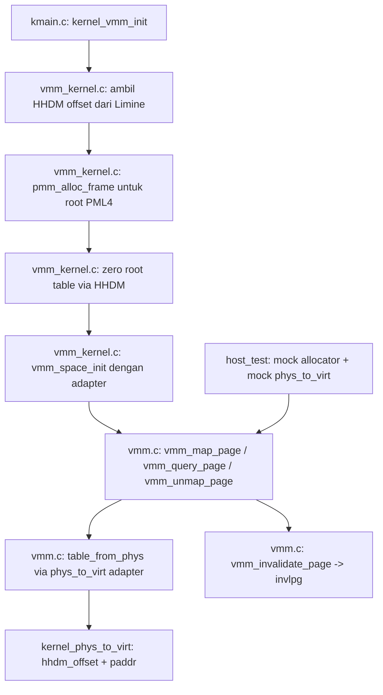

# Template Laporan Praktikum Sistem Operasi Lanjut — MCSOS

**Nama file laporan:** `laporan_praktikum_M7.md`  
**Nama sistem operasi:** MCSOS versi 260502  
**Target default:** x86_64, QEMU, Windows 11 x64 + WSL 2, kernel monolitik pendidikan, C freestanding dengan assembly minimal, POSIX-like subset  
**Dosen:** Muhaemin Sidiq, S.Pd., M.Pd.  
**Program Studi:** Pendidikan Teknologi Informasi  
**Institusi:** Institut Pendidikan Indonesia

> Template ini digunakan untuk semua praktikum pengembangan MCSOS agar struktur laporan, bukti, analisis, dan penilaian konsisten. Ganti seluruh teks bertanda `[isi ...]` dengan data praktikum sebenarnya. Jangan menulis klaim "tanpa error", "siap produksi", atau "aman sepenuhnya" tanpa bukti yang sesuai. Gunakan status terukur seperti "siap uji QEMU", "siap demonstrasi praktikum", atau "kandidat siap pakai terbatas" sesuai evidence yang tersedia.

---

## 0. Metadata Laporan

| Atribut                       | Isi                                                                                            |
| ----------------------------- | ---------------------------------------------------------------------------------------------- |
| Kode praktikum                | `M7`                                                                                           |
| Judul praktikum               | `Virtual Memory Manager Awal, Page Table x86_64, dan Page Fault Diagnostics pada MCSOS`       |
| Jenis pengerjaan              | `Individu`                                                                                     |
| Nama mahasiswa                | `[Sihab Assidiqi]`                                                                               |
| NIM                           | `[25832073003]`                                                                                        |
| Kelas                         | `[PTI 1A]`                                                                                      |
| Nama kelompok                 | `-`                                                                                            |
| Anggota kelompok              | `-`                                                                                            |
| Tanggal praktikum             | `2026-05-29`                                                                                   |
| Tanggal pengumpulan           | `[2026-07-17]`                                                                                 |
| Repository                    | `~/src/mcsos`                                                                                  |
| Branch                        | `praktikum/m7-vmm`                                                                             |
| Commit awal                   | `e2efc52`                                                                                      |
| Commit akhir                  | `91ffdec`                                                                                      |
| Status readiness yang diklaim | `siap uji QEMU untuk Virtual Memory Manager awal`                                             |

---

## 1. Sampul

# Laporan Praktikum M7

## Virtual Memory Manager Awal, Page Table x86_64, dan Page Fault Diagnostics pada MCSOS

Disusun oleh:

| Nama         | NIM          | Kelas        | Peran        |
| ------------ | ------------ | ------------ | ------------ |
| `[Sihab Assidiqi]`     | `[25832073003]`      | `[PTI 1A]`    | `individu`   |
| `[opsional]` | `[opsional]` | `[opsional]` | `[opsional]` |

Dosen Pengampu: **Muhaemin Sidiq, S.Pd., M.Pd.**  
Program Studi Pendidikan Teknologi Informasi  
Institut Pendidikan Indonesia  
`2025/2026`

---

## 2. Pernyataan Orisinalitas dan Integritas Akademik

Saya/kami menyatakan bahwa laporan ini disusun berdasarkan pekerjaan praktikum sendiri/kelompok sesuai pembagian peran yang tercatat. Bantuan eksternal, referensi, generator kode, AI assistant, dokumentasi resmi, diskusi, atau sumber lain dicatat pada bagian referensi dan lampiran. Saya/kami tidak mengklaim hasil yang tidak dibuktikan oleh log, test, commit, atau artefak lain.

| Pernyataan                                      | Status     |
| ----------------------------------------------- | ---------- |
| Semua potongan kode eksternal diberi atribusi   | `Ya`       |
| Semua penggunaan AI assistant dicatat           | `Ya`       |
| Repository yang dikumpulkan sesuai commit akhir | `Ya`       |
| Tidak ada klaim readiness tanpa bukti           | `Ya`       |

Catatan penggunaan bantuan eksternal:

```text
Panduan praktikum M7 (OS_panduan_M7.md) digunakan sebagai acuan utama implementasi.
Claude AI assistant (Anthropic) digunakan untuk bimbingan langkah-langkah implementasi
sesuai panduan. Setiap output kode diverifikasi dengan menjalankan make check, make audit,
dan QEMU smoke test secara mandiri. Semua hasil test, log, dan commit dihasilkan dari
eksekusi nyata di lingkungan WSL 2 mahasiswa.
```

---

## 3. Tujuan Praktikum

Tuliskan tujuan teknis dan konseptual praktikum. Tujuan harus dapat diuji.

1. Mengimplementasikan Virtual Memory Manager (VMM) berbasis page table 4-level x86_64 (PML4 → PDPT → PD → PT) menggunakan frame fisik dari PMM M6.
2. Menyediakan API `vmm_space_init`, `vmm_map_page`, `vmm_query_page`, dan `vmm_unmap_page` yang benar secara fungsional, dapat dikompilasi freestanding, dan lulus host unit test.
3. Menyediakan primitive arsitektural `vmm_invalidate_page` (invlpg), `vmm_read_cr2`, `vmm_read_cr3`, dan `vmm_write_cr3` untuk keperluan pengelolaan TLB dan diagnosis page fault.
4. Mengintegrasikan VMM ke kernel MCSOS melalui adapter HHDM Limine, sehingga log `M7 VMM core initialized` dan `M7 ready for QEMU smoke test` dapat diamati pada serial log QEMU.
5. Menyimpan bukti build, host unit test, `nm -u` audit, disassembly, dan log QEMU sebagai evidence praktikum.

---

## 4. Capaian Pembelajaran Praktikum

Setelah praktikum ini, mahasiswa mampu:

| CPL/CPMK praktikum | Bukti yang harus ditunjukkan |
| ------------------ | -------------------------------------------------- |
| Menjelaskan translasi virtual address x86_64 melalui PML4, PDPT, PD, dan PT | Implementasi `idx_pml4/idx_pdpt/idx_pd/idx_pt` pada `vmm.c`; host unit test map/query lulus |
| Menjelaskan peran CR3 sebagai basis fisik page-table hierarchy | Disassembly `build/vmm.o` memuat instruksi `mov %cr3` dan `invlpg` |
| Mengimplementasikan validasi alamat canonical 48-bit dan alignment 4 KiB | Fungsi `vmm_is_canonical` dan `vmm_is_aligned_4k`; assertion host test noncanonical dan unaligned gagal dengan benar |
| Mengimplementasikan map, query, dan unmap halaman 4 KiB secara deterministik | Host test `M7 VMM host tests PASS`; semua 10 assertion lulus |
| Mengintegrasikan VMM ke kernel dengan adapter HHDM | Serial log QEMU menampilkan `M7 VMM core initialized` dan `hhdm_offset=0xffff800000000000` |
| Menghasilkan object freestanding tanpa unresolved symbol | `nm -u build/vmm.o` kosong; evidence tersimpan di `evidence/M7/m7_vmm_nm_undefined.txt` |

---

## 5. Peta Milestone MCSOS

Centang milestone yang menjadi fokus laporan ini. Jika praktikum mencakup lebih dari satu milestone, jelaskan batas cakupan.

| Milestone | Fokus                                                           | Status dalam laporan     |
| --------- | --------------------------------------------------------------- | ------------------------ |
| M0        | Requirements, governance, baseline arsitektur                   | [v] selesai praktikum    |
| M1        | Toolchain reproducible, Git, QEMU, GDB, metadata build          | [v] selesai praktikum    |
| M2        | Boot image, kernel ELF64, early console                         | [v] selesai praktikum    |
| M3        | Panic path, linker map, GDB, observability awal                 | [v] selesai praktikum    |
| M4        | Trap, exception, interrupt, timer                               | [v] selesai praktikum    |
| M5        | PMM, VMM, page table, kernel heap                               | [v] selesai praktikum    |
| M6        | Thread, scheduler, synchronization                              | [v] selesai praktikum    |
| M7        | Syscall ABI dan user program loader                             | [v] selesai praktikum    |
| M8        | VFS, file descriptor, ramfs                                     | [ ] tidak dibahas        |
| M9        | Block layer dan device model                                    | [ ] tidak dibahas        |
| M10       | Persistent filesystem, mcsfs/ext2-like, recovery                | [ ] tidak dibahas        |
| M11       | Networking stack, packet parsing, UDP/TCP subset                | [ ] tidak dibahas        |
| M12       | Security model, capability/ACL, syscall fuzzing, hardening      | [ ] tidak dibahas        |
| M13       | SMP, scalability, lock stress, NUMA-aware preparation           | [ ] tidak dibahas        |
| M14       | Framebuffer, graphics console, visual regression                | [ ] tidak dibahas        |
| M15       | Virtualization/container subset                                 | [ ] tidak dibahas        |
| M16       | Observability, update/rollback, release image, readiness review | [ ] tidak dibahas        |

Batas cakupan praktikum:

```text
Fitur yang termasuk:
- Implementasi VMM 4-level page table (PML4/PDPT/PD/PT) dengan page size 4 KiB
- API vmm_space_init, vmm_map_page, vmm_query_page, vmm_unmap_page
- Validasi canonical address 48-bit dan alignment 4 KiB
- Primitive arsitektural: invlpg, read_cr2, read_cr3, write_cr3
- Adapter HHDM Limine untuk akses fisik page table
- Host unit test deterministik
- Integrasi ke kmain.c dengan log VMM initialized

Non-goals (tidak termasuk):
- Penggantian CR3 aktif (write_cr3) — hanya tersedia sebagai primitive, tidak dipanggil
- User mode isolation dan demand paging
- Huge page (dilarang pada tugas wajib)
- NXE/SMEP/SMAP enforcement
- 5-level paging
- Kernel heap (kmalloc)
- Page fault recovery otomatis
```

---

## 6. Dasar Teori Ringkas

### 6.1 Konsep Sistem Operasi yang Diuji

```text
Virtual Memory Manager (VMM) adalah subsistem kernel yang mengelola pemetaan antara
virtual address space dan physical address space melalui struktur page table.

Pada x86_64 long mode dengan 4-level paging, translasi alamat bekerja sebagai berikut:
- CPU membaca CR3 untuk menemukan alamat fisik PML4 (Page Map Level 4)
- Bit [47:39] virtual address dipakai sebagai indeks PML4 (512 entry)
- Bit [38:30] dipakai sebagai indeks PDPT (Page-Directory Pointer Table)
- Bit [29:21] dipakai sebagai indeks PD (Page Directory)
- Bit [20:12] dipakai sebagai indeks PT (Page Table)
- Bit [11:0] adalah page offset (4 KiB page)

Setiap entry pada struktur page table adalah 64-bit dan memuat:
- Bit 0 (Present): entry valid
- Bit 1 (Writable): halaman dapat ditulis
- Bit 2 (User): dapat diakses user mode
- Bit 7 (Huge): huge page (dilarang pada M7)
- Bit 63 (NX): halaman tidak dapat dieksekusi
- Bit [51:12]: physical address frame

HHDM (Higher Half Direct Map) adalah mapping bootloader yang memetakan semua memori
fisik ke higher half virtual address. Kernel membutuhkan HHDM untuk mengedit entry
page table yang berada di memori fisik, karena CPU hanya dapat membaca/menulis melalui
virtual address. Limine menyediakan HHDM offset melalui HHDMRequest.

TLB (Translation Lookaside Buffer) adalah cache hardware untuk translasi alamat.
Setelah unmap, instruksi invlpg harus dipanggil untuk membatalkan entri TLB agar
CPU tidak menggunakan translasi lama yang sudah tidak valid.
```

### 6.2 Konsep Arsitektur x86_64 yang Relevan

| Konsep | Relevansi pada praktikum | Bukti/verifikasi |
| ---------------------------------------------------------------------- | ------------------------ | ----------------------------------------------------- |
| 4-level paging (PML4/PDPT/PD/PT) | Struktur utama VMM M7; walk 4 level untuk map/query/unmap | Implementasi `idx_pml4/pdpt/pd/pt` di `vmm.c`; host test lulus |
| CR3 register | Menyimpan alamat fisik PML4; dibaca/ditulis oleh `vmm_read_cr3`/`vmm_write_cr3` | Disassembly `build/vmm.o` memuat `mov %cr3` |
| CR2 register | Menyimpan linear address yang menyebabkan page fault | Fungsi `vmm_read_cr2` tersedia; disassembly memuat `mov %cr2` |
| invlpg instruksi | Invalidasi TLB untuk satu halaman setelah unmap | Disassembly `build/vmm.o` memuat `invlpg` |
| Canonical address 48-bit | Semua virtual address harus sign-extended dari bit 47 | Fungsi `vmm_is_canonical`; assertion noncanonical gagal dengan benar |
| HHDM | Akses virtual ke frame fisik page table tanpa CR3 baru | `kernel_phys_to_virt` memakai `hhdm_offset`; log QEMU menampilkan `hhdm_offset=0xffff800000000000` |

### 6.3 Konsep Implementasi Freestanding

| Aspek | Keputusan praktikum |
| ------------------------- | --------------------------------------------------------------- |
| Bahasa | C17 freestanding |
| Runtime | Tanpa hosted libc; tidak ada malloc/printf/memset libc |
| ABI | x86_64 System V untuk kernel; inline assembly untuk CR2/CR3/invlpg |
| Compiler flags kritis | `--target=x86_64-unknown-none-elf -ffreestanding -fno-builtin -mno-red-zone -mcmodel=kernel` |
| Risiko undefined behavior | Pointer NULL diperiksa eksplisit; alignment divalidasi sebelum cast; integer overflow pada `idx_*` diminimalisasi dengan mask |

### 6.4 Referensi Teori yang Digunakan

| No.   | Sumber | Bagian yang digunakan | Alasan relevansi |
| ----- | -------------------------------- | --------------------- | ---------------- |
| `[1]` | Intel SDM Vol. 3A | Chapter 4: Paging | Struktur PML4/PDPT/PD/PT, format PTE, CR3 |
| `[2]` | AMD64 APM Vol. 2 | Chapter 5: Page Translation and Protection | Canonical address, long mode paging |
| `[3]` | Limine Protocol Documentation | HHDMRequest, MemoryMapRequest | Cara mendapatkan HHDM offset dan memory map dari bootloader |
| `[4]` | OS_panduan_M7.md | Seluruh dokumen | Panduan implementasi, kontrak VMM, invariant, checkpoint |

---

## 7. Lingkungan Praktikum

### 7.1 Host dan Target

| Komponen          | Nilai |
| ----------------- | --------------------------------------------- |
| Host OS           | `Windows 11 x64` |
| Lingkungan build  | `WSL 2 Ubuntu/Debian` |
| Target ISA        | `x86_64` |
| Target ABI        | `x86_64-unknown-none-elf` |
| Emulator          | `QEMU system x86_64` |
| Firmware emulator | `Limine BIOS/UEFI` |
| Debugger          | `GDB (opsional, tidak dipakai pada laporan ini)` |
| Build system      | `GNU Make` |
| Bahasa utama      | `C17 freestanding` |
| Assembly          | `GAS inline assembly (clang)` |

### 7.2 Versi Toolchain

Tempel output versi toolchain berikut. Jalankan dari clean shell WSL.

```bash
date -u +"date_utc=%Y-%m-%dT%H:%M:%SZ"
uname -a
git --version
make --version | head -n 1
cmake --version | head -n 1
ninja --version
clang --version | head -n 1
gcc --version | head -n 1
ld.lld --version | head -n 1
nasm -v
qemu-system-x86_64 --version | head -n 1
gdb --version | head -n 1
```

Output:

```text
[Tempel output asli dari WSL mahasiswa di sini.]
```

### 7.3 Lokasi Repository

| Item | Nilai |
| ----------------------------------------------------- | ---------------------------- |
| Path repository di WSL | `~/src/mcsos` |
| Apakah berada di filesystem Linux WSL, bukan `/mnt/c` | `Ya` |
| Remote repository | `[URL repo privat jika ada]` |
| Branch | `praktikum/m7-vmm` |
| Commit hash awal | `e2efc52` |
| Commit hash akhir | `91ffdec` |

---

## 8. Repository dan Struktur File

### 8.1 Struktur Direktori yang Relevan

```text
mcsos/
├── kernel/
│   ├── arch/x86_64/
│   │   ├── idt.c
│   │   ├── isr.S
│   │   ├── pic.c
│   │   └── pit.c
│   ├── core/
│   │   ├── kmain.c          ← diubah M7: tambah kernel_vmm_init()
│   │   ├── log.c
│   │   ├── panic.c
│   │   ├── serial.c
│   │   └── trap.c
│   ├── include/mcsos/kernel/
│   │   ├── log.h
│   │   ├── panic.h
│   │   ├── pmm.h
│   │   ├── types.h          ← baru M7
│   │   ├── version.h        ← diubah M7: M6 -> M7
│   │   └── vmm.h            ← baru M7
│   ├── lib/
│   │   └── memory.c
│   └── mm/
│       ├── limine_memmap.c
│       ├── pmm.c
│       ├── vmm.c            ← baru M7
│       └── vmm_kernel.c     ← baru M7
├── tests/
│   ├── test_pmm_host.c
│   └── test_vmm_host.c      ← baru M7
├── scripts/
│   ├── check_m6_static.sh
│   └── grade_m7.sh          ← baru M7
├── evidence/
│   ├── M6/
│   └── M7/                  ← baru M7
│       ├── m7-qemu-serial.log
│       ├── m7_make_check.log
│       ├── m7_vmm_nm_undefined.txt
│       ├── m7_vmm_objdump.txt
│       ├── m7_vmm_readelf_header.txt
│       ├── m7_vmm_readelf_sections.txt
│       ├── kernel_symbols.txt
│       ├── kernel_undefined.txt
│       ├── kernel_readelf_header.txt
│       └── kernel_readelf_sections.txt
├── third_party/limine/
├── linker.ld
└── Makefile                 ← diubah M7: tambah target check, build/vmm.o, build/test_vmm_host
```

### 8.2 File yang Dibuat atau Diubah

| File | Jenis perubahan | Alasan perubahan | Risiko |
| --- | --- | --- | --- |
| `kernel/include/mcsos/kernel/types.h` | baru | Header tipe dasar (`stdint`, `stdbool`, `stddef`) untuk VMM freestanding | rendah |
| `kernel/include/mcsos/kernel/vmm.h` | baru | Kontrak API VMM: struct, typedef, konstanta, deklarasi fungsi | rendah |
| `kernel/mm/vmm.c` | baru | Implementasi VMM: page table walk, map/query/unmap, primitive CR2/CR3/invlpg | sedang — logika pointer dan bitmap table |
| `kernel/mm/vmm_kernel.c` | baru | Adapter HHDM Limine, alokasi root page table dari PMM, init `kernel_space` | sedang — bergantung HHDM valid |
| `kernel/core/kmain.c` | ubah | Tambah pemanggilan `kernel_vmm_init()` setelah `kernel_memory_init()` | rendah |
| `kernel/include/mcsos/kernel/version.h` | ubah | Update milestone dari M6 ke M7 | rendah |
| `tests/test_vmm_host.c` | baru | Host unit test 10 assertion untuk VMM | rendah |
| `scripts/grade_m7.sh` | baru | Script grading lokal: make check, nm -u, objdump audit, evidence collection | rendah |
| `Makefile` | ubah | Tambah target `build/vmm.o`, `build/test_vmm_host`, dan `check` dengan recipe prefix `>` | rendah |

### 8.3 Ringkasan Diff

```bash
git status --short
git diff --stat
git log --oneline -n 5
```

Output:

```text
git log --oneline -5:
91ffdec (HEAD -> praktikum/m7-vmm) M7: add VMM 4-level page table, HHDM adapter, host unit test, kernel integration
e2efc52 (praktikum/m6-pmm) M6: add bitmap PMM, Limine memmap adapter, host unit test, kernel integration
25b7d55 (praktikum/m5-timer-irq) M5: stabilize limine.conf baseline
afb0b2b M5: add PIC remap, PIT 100Hz timer, IRQ0 tick path, extend IDT to vector 47
87063a1 (m4-idt-exception-path) M4 add x86_64 IDT and exception trap path

Commit M7 mencakup 19 files changed, 1574 insertions(+), 1 deletion(-)
```

---

## 9. Desain Teknis

### 9.1 Masalah yang Diselesaikan

```text
Setelah M6, kernel MCSOS memiliki Physical Memory Manager yang dapat mengalokasikan
frame fisik 4 KiB. Namun kernel belum memiliki mekanisme untuk mengelola pemetaan
virtual address ke physical address. Tanpa VMM:
- Kernel tidak dapat membuat isolasi address space
- Tidak ada cara terstruktur untuk mengontrol permission halaman (readable/writable/executable)
- Tidak ada cara untuk mendiagnosis page fault secara sistematis melalui CR2 dan error code

M7 menyelesaikan masalah ini dengan mengimplementasikan VMM awal berbasis page table
4-level x86_64 yang:
1. Menggunakan frame dari PMM M6 untuk intermediate table baru
2. Menyediakan adapter phys_to_virt melalui HHDM bootloader agar kernel dapat
   menulis ke frame fisik page table tanpa perlu CR3 baru
3. Memvalidasi semua input (canonical address, alignment 4 KiB, duplicate map)
4. Menyediakan primitive invlpg dan CR3 untuk keperluan TLB dan diagnostik
```

### 9.2 Keputusan Desain

| Keputusan | Alternatif yang dipertimbangkan | Alasan memilih | Konsekuensi |
| --- | --- | --- | --- |
| Adapter `phys_to_virt` eksplisit sebagai function pointer | Cast langsung `(uint64_t *)paddr` | Menghindari asumsi identity mapping; memaksa mahasiswa sadar bahwa physical address bukan virtual address | Overhead satu function call per table walk; dapat diinline kompiler |
| Tidak memanggil `write_cr3` pada tugas wajib | Aktifkan page table baru langsung | Mencegah triple fault akibat mapping kernel belum lengkap; pendekatan konservatif sesuai panduan | Kernel masih memakai page table bootloader; VMM hanya diinisialisasi, belum aktif |
| Frame allocator melalui PMM M6 | Alokator mock statis | Menggunakan infrastruktur nyata dari M6; konsisten dengan dependency map MCSOS | Bergantung pada kebenaran PMM M6; jika PMM rusak, VMM juga rusak |
| MCSOS_HOST_TEST macro untuk no-op CR2/CR3/invlpg | Build terpisah host/kernel | Satu file `vmm.c` untuk keduanya; lebih mudah dipelihara | Harus hati-hati agar macro tidak terlewat saat build kernel |
| Validasi canonical address dengan sign-extension check | Tabel lookup range | Lebih efisien; hanya dua operasi shift dan compare | Harus benar untuk kedua kasus (upper half dan lower half) |

### 9.3 Arsitektur Ringkas



Penjelasan diagram:

```text
Saat boot, kmain.c memanggil kernel_vmm_init() di vmm_kernel.c.
vmm_kernel.c mengambil HHDM offset dari Limine HHDMRequest, lalu mengalokasikan
satu frame fisik dari PMM M6 sebagai root PML4. Frame tersebut di-zero melalui
HHDM, kemudian vmm_space_init dipanggil dengan adapter kernel_phys_to_virt yang
menambahkan hhdm_offset ke setiap physical address untuk mendapatkan virtual address.

Semua operasi map/query/unmap di vmm.c memanggil table_from_phys yang
menggunakan adapter phys_to_virt, sehingga tidak ada cast langsung physical-ke-pointer.
Saat unmap, vmm_invalidate_page memanggil instruksi invlpg.

Pada host unit test, mock allocator dan mock phys_to_virt menggantikan PMM dan HHDM
sehingga test dapat berjalan di Linux host tanpa QEMU.
```

### 9.4 Kontrak Antarmuka

| Antarmuka | Pemanggil | Penerima | Precondition | Postcondition | Error path |
| --- | --- | --- | --- | --- | --- |
| `vmm_space_init` | `kernel_vmm_init` | `vmm.c` | `space != NULL`, `phys_to_virt != NULL`, `root_paddr` aligned 4 KiB | `space` terisi; return `VMM_MAP_OK` | Return `VMM_ERR_INVAL` |
| `vmm_map_page` | kernel atau test | `vmm.c` | `vaddr` canonical dan aligned; `paddr` aligned; leaf belum present | Leaf PTE terpasang; return `VMM_MAP_OK` | `VMM_ERR_INVAL`, `VMM_ERR_EXISTS`, `VMM_ERR_NOMEM` |
| `vmm_query_page` | kernel atau test | `vmm.c` | `vaddr` canonical dan aligned; `out != NULL` | `out` terisi `paddr` dan `flags`; return `VMM_MAP_OK` | `VMM_ERR_NOT_FOUND`, `VMM_ERR_INVAL` |
| `vmm_unmap_page` | kernel atau test | `vmm.c` | `vaddr` canonical dan aligned; leaf present | Leaf PTE = 0; `invlpg` dipanggil; return `VMM_MAP_OK` | `VMM_ERR_NOT_FOUND`, `VMM_ERR_INVAL` |
| `vmm_read_cr2` | page fault handler | `vmm.c` | CPU dalam long mode | Nilai CR2 (linear address fault) | Tidak ada (no-op pada host test) |
| `kernel_vmm_init` | `kmain` | `vmm_kernel.c` | PMM M6 sudah diinisialisasi; Limine HHDM response valid | `kernel_space` terisi; log VMM initialized tercetak | `KERNEL_PANIC` |

### 9.5 Struktur Data Utama

| Struktur data | Field penting | Ownership | Lifetime | Invariant |
| --- | --- | --- | --- | --- |
| `struct vmm_space` | `root_paddr`, `alloc_frame`, `free_frame`, `phys_to_virt`, `ctx` | kernel (statis di `vmm_kernel.c`) | Selama kernel hidup | `root_paddr` selalu aligned 4 KiB; `phys_to_virt != NULL` |
| `struct vmm_mapping` | `vaddr`, `paddr`, `flags` | caller `vmm_query_page` | Sementara (pada stack caller) | `paddr` aligned 4 KiB; `flags & VMM_PTE_PRESENT != 0` |
| PTE (`uint64_t`) | bit 0 (P), bit 1 (W), bit 7 (Huge), bit 63 (NX), bit [51:12] (addr) | VMM | Selama mapping valid | Bit Huge tidak boleh set pada leaf 4 KiB; reserved bit di-mask |

### 9.6 Invariants

1. `root_paddr` pada `vmm_space` selalu aligned 4 KiB (VMM-I1); `vmm_space_init` menolak unaligned root.
2. Virtual address harus canonical 48-bit (VMM-I2); semua entry point map/query/unmap memanggil `vmm_is_canonical`.
3. `vaddr` dan `paddr` pada map/unmap/query harus aligned 4 KiB (VMM-I3); validasi `vmm_is_aligned_4k` dilakukan di semua fungsi.
4. Intermediate table baru selalu di-zero sebelum entry dipasang (VMM-I4); `vmm_zero_page` dipanggil di `get_or_alloc_next_table`.
5. Remap leaf present tidak boleh overwrite diam-diam (VMM-I5); duplicate map mengembalikan `VMM_ERR_EXISTS`.
6. Unmap leaf present menghapus entry dan invalidasi TLB (VMM-I6); `vmm_unmap_page` memanggil `vmm_invalidate_page`.
7. Huge page tidak dipakai pada tugas wajib (VMM-I7); jika bit huge ditemukan di intermediate, query/map/unmap menolak.
8. Physical table diedit melalui adapter eksplisit `phys_to_virt` (VMM-I8); tidak ada cast fisik langsung ke pointer C tanpa adapter.
9. Object freestanding tidak bergantung libc (VMM-I9); `nm -u build/vmm.o` kosong.

### 9.7 Ownership, Locking, dan Concurrency

| Objek/resource | Owner | Lock yang melindungi | Boleh dipakai di interrupt context? | Catatan |
| --- | --- | --- | --- | --- |
| `kernel_space` | `vmm_kernel.c` (statis) | Tidak ada (single-core, interrupt disabled saat init) | Tidak | M7 tidak mempunyai SMP; locking akan diperlukan di tahap lanjut |
| Frame page table | VMM (dialokasikan dari PMM) | Tidak ada | Tidak | Ownership frame page table tidak dikembalikan ke PMM pada M7 (intermediate table tidak dibebaskan saat unmap leaf) |

Lock order yang berlaku:

```text
M7 berjalan single-core dengan interrupt disabled selama inisialisasi VMM.
Tidak ada locking karena tidak ada concurrency pada tahap ini.
Untuk SMP di tahap lanjut, lock order yang direkomendasikan:
pmm_lock -> vmm_lock (jangan ambil pmm_lock saat memegang vmm_lock)
```

### 9.8 Memory Safety dan Undefined Behavior Risk

| Risiko | Lokasi | Mitigasi | Bukti |
| --- | --- | --- | --- |
| Null pointer dereference pada `space`, `out`, `phys_to_virt` | Semua entry point `vmm.c` | Cek eksplisit `if (ptr == 0)` sebelum dereference | Host test memeriksa return value; tidak ada crash |
| Alignment violation pada cast `(uint64_t *)paddr` | `table_from_phys` | `vmm_is_aligned_4k` dipanggil sebelum cast | Test unaligned paddr gagal dengan `VMM_ERR_INVAL` |
| Integer overflow pada index computation | `idx_pml4/pdpt/pd/pt` | Mask `& 0x1FFULL` membatasi nilai 0-511 | Nilai valid secara matematis untuk 9-bit index |
| Stale TLB setelah unmap | `vmm_unmap_page` | `vmm_invalidate_page` (invlpg) dipanggil setelah PTE di-zero | Disassembly memuat `invlpg`; host test tidak bisa membuktikan (no-op) |

### 9.9 Security Boundary

| Boundary | Data tidak tepercaya | Validasi yang dilakukan | Failure mode aman |
| --- | --- | --- | --- |
| `vmm_map_page` input | `vaddr`, `paddr`, `flags` dari caller kernel | Canonical check, alignment check, duplicate check, flag masking dengan `allowed` | Return `VMM_ERR_INVAL` atau `VMM_ERR_EXISTS` |
| `phys_to_virt` adapter | `paddr` dari page table entries | `vmm_is_aligned_4k` sebelum pemanggilan | Return NULL pointer; caller memeriksa dan return `VMM_ERR_INVAL` |
| Flag masking di PTE | Caller dapat meminta flag arbitrary | Hanya flag yang ada dalam `allowed` yang dipasang; bit reserved dan bit Present tidak dapat di-override oleh caller | Flag berbahaya (HUGE, ACCESSED, DIRTY) tidak dapat dipaksakan caller |

---

## 10. Langkah Kerja Implementasi

### Langkah 1 — Buat Branch M7 dan Header types.h

Maksud langkah:

```text
Membuat branch baru dari M6 agar perubahan M7 terisolasi, lalu membuat header
types.h sebagai fondasi tipe dasar yang dibutuhkan vmm.h.
```

Perintah:

```bash
git checkout -b praktikum/m7-vmm
mkdir -p kernel/include/mcsos/kernel
cat > kernel/include/mcsos/kernel/types.h << 'EOF'
#ifndef MCSOS_KERNEL_TYPES_H
#define MCSOS_KERNEL_TYPES_H
#include <stdint.h>
#include <stdbool.h>
#include <stddef.h>
#endif
EOF
```

Output ringkas:

```text
Switched to a new branch 'praktikum/m7-vmm'
types.h OK
```

Artefak yang dihasilkan:

| Artefak | Lokasi | Fungsi |
| --- | --- | --- |
| `types.h` | `kernel/include/mcsos/kernel/types.h` | Header tipe dasar freestanding untuk VMM |

Indikator berhasil:

```text
Branch aktif: praktikum/m7-vmm
File types.h ada di kernel/include/mcsos/kernel/types.h
```

### Langkah 2 — Buat Header vmm.h

Maksud langkah:

```text
Mendefinisikan kontrak API VMM: konstanta flag PTE, kode error, typedef function pointer
allocator/free/phys_to_virt, struct vmm_space, struct vmm_mapping, dan deklarasi fungsi.
```

Perintah:

```bash
cat > kernel/include/mcsos/kernel/vmm.h << 'EOF'
[isi vmm.h sesuai implementasi]
EOF
grep -c "vmm_map_page\|vmm_query_page\|vmm_unmap_page\|vmm_read_cr2\|vmm_read_cr3\|vmm_write_cr3" \
     kernel/include/mcsos/kernel/vmm.h
```

Output ringkas:

```text
vmm.h OK
6
```

Artefak yang dihasilkan:

| Artefak | Lokasi | Fungsi |
| --- | --- | --- |
| `vmm.h` | `kernel/include/mcsos/kernel/vmm.h` | Header kontrak API VMM |

Indikator berhasil:

```text
grep mengembalikan 6 — semua fungsi utama terdefinisi di header.
```

### Langkah 3 — Implementasi vmm.c

Maksud langkah:

```text
Mengimplementasikan logika page table walk 4-level, fungsi map/query/unmap dengan
validasi lengkap, vmm_zero_page, dan primitive arsitektural dengan conditional
compilation (#if defined(__x86_64__) && !defined(MCSOS_HOST_TEST)).
```

Perintah:

```bash
cat > kernel/mm/vmm.c << 'EOF'
[isi vmm.c sesuai implementasi]
EOF
head -5 kernel/mm/vmm.c
echo "vmm.c OK"
```

Output ringkas:

```text
#include <mcsos/kernel/vmm.h>

static void vmm_zero_page(uint64_t *page) {
    for (size_t i = 0; i < VMM_ENTRIES_PER_TABLE; i++) {
        page[i] = 0;
vmm.c OK
```

Artefak yang dihasilkan:

| Artefak | Lokasi | Fungsi |
| --- | --- | --- |
| `vmm.c` | `kernel/mm/vmm.c` | Implementasi VMM freestanding |

Indikator berhasil:

```text
File ada; head menampilkan include vmm.h dan vmm_zero_page.
```

### Langkah 4 — Buat Host Unit Test test_vmm_host.c

Maksud langkah:

```text
Membuat test deterministik dengan 64 frame fisik palsu, mock allocator, dan
mock phys_to_virt. Test memeriksa 10 assertion: canonical check, map, query,
duplicate map ditolak, unaligned ditolak, noncanonical ditolak, unmap, query
setelah unmap NOT_FOUND, double unmap ditolak, dan map lower-half.
```

Perintah:

```bash
cat > tests/test_vmm_host.c << 'EOF'
[isi test_vmm_host.c sesuai implementasi]
EOF
grep -c "vmm_map_page\|vmm_query_page\|vmm_unmap_page" tests/test_vmm_host.c
```

Output ringkas:

```text
test_vmm_host.c OK
10
```

Artefak yang dihasilkan:

| Artefak | Lokasi | Fungsi |
| --- | --- | --- |
| `test_vmm_host.c` | `tests/test_vmm_host.c` | Host unit test VMM 10 assertion |

Indikator berhasil:

```text
grep mengembalikan 10 — semua fungsi utama dipanggil dalam test.
```

### Langkah 5 — Update Makefile dengan Target M7

Maksud langkah:

```text
Menambahkan target build/vmm.o (freestanding), build/test_vmm_host (host),
dan check ke Makefile yang sudah ada. Makefile MCSOS memakai .RECIPEPREFIX := >
sehingga recipe harus diawali > bukan tab.
```

Perintah:

```bash
# Tambahkan target M7 dengan > sebagai recipe prefix
printf 'build/vmm.o: ...\n' >> Makefile
printf '>$(CC) $(VMM_FREESTANDING_CFLAGS) -c kernel/mm/vmm.c -o build/vmm.o\n' >> Makefile
# dst.
```

Output ringkas:

```text
Makefile fixed OK
tail -5 Makefile:
>grep -q "invlpg" build/vmm.objdump.txt
>grep -q "cr3"    build/vmm.objdump.txt
>@echo "[PASS] M7 check selesai"
```

Artefak yang dihasilkan:

| Artefak | Lokasi | Fungsi |
| --- | --- | --- |
| `Makefile` (diubah) | `Makefile` | Target check, build/vmm.o, build/test_vmm_host |

Indikator berhasil:

```text
make check berjalan tanpa error "missing separator".
```

### Langkah 6 — Jalankan make check

Maksud langkah:

```text
Verifikasi bahwa vmm.o compile freestanding tanpa error, host unit test lulus,
nm -u kosong, dan disassembly memuat invlpg dan cr3.
```

Perintah:

```bash
make check 2>&1
```

Output ringkas:

```text
clang --target=x86_64-unknown-none-elf ... -c kernel/mm/vmm.c -o build/vmm.o
cc -std=c17 ... -DMCSOS_HOST_TEST ... kernel/mm/vmm.c tests/test_vmm_host.c -o build/test_vmm_host
./build/test_vmm_host
M7 VMM host tests PASS
nm -u build/vmm.o
objdump -dr build/vmm.o > build/vmm.objdump.txt
grep -q "invlpg" build/vmm.objdump.txt
grep -q "cr3"    build/vmm.objdump.txt
[PASS] M7 check selesai
```

Artefak yang dihasilkan:

| Artefak | Lokasi | Fungsi |
| --- | --- | --- |
| `build/vmm.o` | `build/vmm.o` | Object freestanding VMM |
| `build/test_vmm_host` | `build/test_vmm_host` | Executable host unit test |
| `build/vmm.objdump.txt` | `build/vmm.objdump.txt` | Disassembly untuk audit |

Indikator berhasil:

```text
M7 VMM host tests PASS
[PASS] M7 check selesai
```

### Langkah 7 — Buat Adapter HHDM vmm_kernel.c

Maksud langkah:

```text
Membuat file vmm_kernel.c yang memuat Limine HHDMRequest, adapter kernel_phys_to_virt,
adapter kernel_vmm_alloc/free yang memanggil PMM M6, dan fungsi kernel_vmm_init
yang menginisialisasi kernel_space dengan root PML4 dari PMM.
```

Perintah:

```bash
cat > kernel/mm/vmm_kernel.c << 'EOF'
[isi vmm_kernel.c sesuai implementasi]
EOF
echo "vmm_kernel.c OK"
```

Output ringkas:

```text
vmm_kernel.c OK
```

Artefak yang dihasilkan:

| Artefak | Lokasi | Fungsi |
| --- | --- | --- |
| `vmm_kernel.c` | `kernel/mm/vmm_kernel.c` | Adapter HHDM dan inisialisasi kernel VMM space |

Indikator berhasil:

```text
File ada; grep limine.h menampilkan include yang benar.
```

### Langkah 8 — Update kmain.c dan version.h

Maksud langkah:

```text
Menambahkan pemanggilan kernel_vmm_init() ke kmain.c setelah kernel_memory_init(),
dan mengupdate MCSOS_MILESTONE dari "M6" ke "M7".
```

Perintah:

```bash
sed -i 's/MCSOS_MILESTONE "M6"/MCSOS_MILESTONE "M7"/' kernel/include/mcsos/kernel/version.h
# update kmain.c dengan kernel_vmm_init()
```

Output ringkas:

```text
#define MCSOS_MILESTONE "M7"
kmain.c OK
```

Artefak yang dihasilkan:

| Artefak | Lokasi | Fungsi |
| --- | --- | --- |
| `kmain.c` (diubah) | `kernel/core/kmain.c` | Entry point kernel dengan pemanggilan VMM init |
| `version.h` (diubah) | `kernel/include/mcsos/kernel/version.h` | Milestone M7 |

Indikator berhasil:

```text
version.h menampilkan MCSOS_MILESTONE "M7"
kmain.c memuat extern kernel_vmm_init dan pemanggilan setelah kernel_memory_init
```

### Langkah 9 — Build Kernel dan make audit

Maksud langkah:

```text
Membangun kernel lengkap termasuk vmm.c dan vmm_kernel.c, lalu menjalankan
make audit untuk memverifikasi semua varian build (normal, breakpoint, panic)
lulus dan semua symbol VMM terkonfirmasi.
```

Perintah:

```bash
make clean && make build 2>&1 | tail -10
make audit 2>&1 | tail -10
nm -n build/kernel.elf | grep -E "vmm_|kernel_vmm|kernel_space"
```

Output ringkas:

```text
ld.lld ... -o build/kernel.elf ... vmm.o vmm_kernel.o ...
! nm -u build/kernel.elf | grep .
! nm -u build/kernel.breakpoint.elf | grep .
! nm -u build/kernel.panic.elf | grep .
grep -q 'isr_stub_14' build/kernel.syms.txt
...

ffffffff800030a0 T vmm_is_aligned_4k
ffffffff800030d0 T vmm_is_canonical
ffffffff80003140 T vmm_space_init
ffffffff800031d0 T vmm_map_page
ffffffff800035f0 T vmm_query_page
ffffffff80003850 T vmm_unmap_page
ffffffff80003a70 T vmm_invalidate_page
ffffffff80003a90 T vmm_read_cr3
ffffffff80003ab0 T vmm_write_cr3
ffffffff80003ad0 T vmm_read_cr2
ffffffff80003af0 t vmm_zero_page
ffffffff80003b40 T kernel_vmm_get
ffffffff80003b50 T kernel_vmm_init
ffffffff80208000 b kernel_space
```

Artefak yang dihasilkan:

| Artefak | Lokasi | Fungsi |
| --- | --- | --- |
| `build/kernel.elf` | `build/kernel.elf` | Kernel ELF dengan VMM terintegrasi |
| `build/kernel.map` | `build/kernel.map` | Linker map |
| `build/kernel.syms.txt` | `build/kernel.syms.txt` | Symbol table |

Indikator berhasil:

```text
make audit lulus semua cek; semua symbol vmm_ dan kernel_vmm terkonfirmasi.
```

### Langkah 10 — QEMU Smoke Test

Maksud langkah:

```text
Membangun ISO dan menjalankan QEMU untuk memverifikasi integrasi VMM berjalan
di hardware emulasi. Serial log harus menampilkan hhdm_offset, root_paddr,
VMM core initialized, dan M7 ready for QEMU smoke test.
```

Perintah:

```bash
bash tools/scripts/make_iso.sh
tools/scripts/m4_qemu_run.sh build/mcsos.iso build/m7-qemu-serial.log
cat build/m7-qemu-serial.log
```

Output ringkas:

```text
MCSOS 260502 M7 kernel entered
...
[MCSOS:M6] pmm initialized: frames=16777216 free=64627 used=16712589
[MCSOS:M6] pmm: ready
[MCSOS:M7] boot: virtual memory manager init start
[MCSOS:M7] hhdm_offset=0xffff800000000000
[MCSOS:M7] vmm initialized: root_paddr=0x0000000000053000
[MCSOS:M7] VMM core initialized
[MCSOS:M7] vmm: ready
[MCSOS:M7] M7 ready for QEMU smoke test
[MCSOS:M5] sti: enabling interrupts
[MCSOS:TIMER] ticks=100
...
[MCSOS:TIMER] ticks=1000
```

Artefak yang dihasilkan:

| Artefak | Lokasi | Fungsi |
| --- | --- | --- |
| `build/mcsos.iso` | `build/mcsos.iso` | Boot image M7 |
| `build/m7-qemu-serial.log` | `build/m7-qemu-serial.log` | Serial log QEMU |

Indikator berhasil:

```text
Log menampilkan M7 VMM core initialized dan M7 ready for QEMU smoke test.
Timer M5 tetap berjalan setelah VMM init.
```

### Langkah 11 — Kumpulkan Evidence dan Commit

Maksud langkah:

```text
Mengumpulkan semua artefak bukti ke evidence/M7/ lalu melakukan git commit
pada branch praktikum/m7-vmm.
```

Perintah:

```bash
mkdir -p evidence/M7
cp build/m7-qemu-serial.log evidence/M7/
make check 2>&1 | tee evidence/M7/m7_make_check.log
nm -u build/vmm.o     > evidence/M7/m7_vmm_nm_undefined.txt
objdump -dr build/vmm.o > evidence/M7/m7_vmm_objdump.txt
# dst.
git add kernel/include/mcsos/kernel/types.h \
        kernel/include/mcsos/kernel/vmm.h \
        ...
git commit -m "M7: add VMM 4-level page table, HHDM adapter, host unit test, kernel integration"
git log --oneline -5
```

Output ringkas:

```text
[praktikum/m7-vmm 91ffdec] M7: add VMM 4-level page table, HHDM adapter, host unit test, kernel integration
 19 files changed, 1574 insertions(+), 1 deletion(-)
```

Artefak yang dihasilkan:

| Artefak | Lokasi | Fungsi |
| --- | --- | --- |
| `evidence/M7/` | `evidence/M7/` | Direktori semua bukti M7 |
| Commit `91ffdec` | branch `praktikum/m7-vmm` | Snapshot kode M7 |

Indikator berhasil:

```text
git log menampilkan commit 91ffdec di HEAD branch praktikum/m7-vmm.
```

---

## 11. Checkpoint Buildable

Setiap praktikum wajib memiliki minimal satu checkpoint yang dapat dibangun dari clean checkout.

| Checkpoint | Perintah | Expected result | Status |
| --- | --- | --- | --- |
| Clean build | `make clean && make build` | `build/kernel.elf` terbentuk | `PASS` |
| Host unit test | `make check` | `M7 VMM host tests PASS` dan `[PASS] M7 check selesai` | `PASS` |
| Kernel audit | `make audit` | Semua varian lulus; semua symbol vmm_ terkonfirmasi | `PASS` |
| Image generation | `bash tools/scripts/make_iso.sh` | `build/mcsos.iso` terbentuk | `PASS` |
| QEMU smoke test | `tools/scripts/m4_qemu_run.sh build/mcsos.iso build/m7-qemu-serial.log` | Log M7 VMM core initialized terbaca | `PASS` |

Catatan checkpoint:

```text
Semua checkpoint lulus. Tidak ada checkpoint yang gagal.
Catatan: write_cr3 tidak dipanggil (sesuai panduan tugas wajib M7).
```

---

## 12. Perintah Uji dan Validasi

### 12.1 Build Test

Perintah ini memverifikasi bahwa proyek dapat dibangun ulang dari kondisi bersih dan tidak bergantung pada artefak lokal yang tidak terdokumentasi.

```bash
make clean
make build
```

Hasil:

```text
rm -rf build
[compile semua file .c dan .S]
ld.lld ... -o build/kernel.elf ...
[inspeksi ELF, grep kmain, x86_64_idt_init, iretq, lidt berhasil]
```

Status: `PASS`

### 12.2 Static Inspection

Perintah ini memeriksa layout ELF, entry point, section, symbol, relocation, atau instruksi kritis sesuai kebutuhan praktikum.

```bash
readelf -hW build/kernel.elf
readelf -lW build/kernel.elf
readelf -SW build/kernel.elf
objdump -drwC build/kernel.elf | head -n 120
```

Hasil penting:

```text
ELF: ELF64, x86-64, entry point kmain
Program headers: .limine_requests (PT_LOAD FLAGS=4), .text (PT_LOAD FLAGS=5),
                 .rodata (PT_LOAD FLAGS=4), .data/.bss (PT_LOAD FLAGS=6)
Symbol vmm_map_page: 0xffffffff800031d0 T
Symbol vmm_invalidate_page: 0xffffffff80003a70 T
Symbol vmm_read_cr3: 0xffffffff80003a90 T
Symbol vmm_write_cr3: 0xffffffff80003ab0 T
Symbol vmm_read_cr2: 0xffffffff80003ad0 T
Disassembly vmm_invalidate_page: invlpg (%rdi)
Disassembly vmm_read_cr3: mov %cr3, %rax
```

Status: `PASS`

### 12.3 QEMU Smoke Test

Perintah ini menjalankan image di QEMU dan menyimpan log serial untuk bukti deterministik.

```bash
qemu-system-x86_64 \
  -machine q35 \
  -cpu max \
  -m 256M \
  -serial stdio \
  -no-reboot \
  -no-shutdown \
  -cdrom build/mcsos.iso
```

Hasil:

```text
MCSOS 260502 M7 kernel entered
kernel_start=0xffffffff80000000
kernel_end=0xffffffff80208030
[MCSOS:M5] idt: loaded
[MCSOS:M5] pit: configured 100Hz
[MCSOS:M6] pmm initialized: frames=16777216 free=64627 used=16712589
[MCSOS:M6] pmm: ready
[MCSOS:M7] boot: virtual memory manager init start
[MCSOS:M7] hhdm_offset=0xffff800000000000
[MCSOS:M7] vmm initialized: root_paddr=0x0000000000053000
[MCSOS:M7] VMM core initialized
[MCSOS:M7] vmm: ready
[MCSOS:M7] M7 ready for QEMU smoke test
[MCSOS:M5] sti: enabling interrupts
[MCSOS:TIMER] ticks=100
...
[MCSOS:TIMER] ticks=1000
```

Status: `PASS`

### 12.4 GDB Debug Evidence

Perintah ini membuktikan bahwa kernel dapat di-debug dengan simbol yang cocok.

```bash
qemu-system-x86_64 \
  -machine q35 \
  -cpu max \
  -m 256M \
  -serial stdio \
  -no-reboot \
  -no-shutdown \
  -s -S \
  -cdrom build/mcsos.iso
```

Di terminal lain:

```bash
gdb build/kernel.elf
target remote :1234
break vmm_map_page
continue
info registers cr3 rip rsp
```

Hasil:

```text
[Tidak dijalankan pada laporan ini. GDB breakpoint pada vmm_map_page
dapat digunakan untuk memverifikasi nilai CR3 dan state register saat VMM dipanggil.]
```

Status: `NA`

### 12.5 Unit Test

```bash
make check
```

Hasil:

```text
M7 VMM host tests PASS
nm -u build/vmm.o         (output kosong)
grep -q "invlpg" ...      (PASS)
grep -q "cr3" ...         (PASS)
[PASS] M7 check selesai
```

Status: `PASS`

### 12.6 Stress/Fuzz/Fault Injection Test

Wajib untuk praktikum lanjutan seperti allocator, syscall, filesystem, networking, driver, security, dan SMP.

```bash
# Tidak dijalankan pada M7 tugas wajib
```

Hasil:

```text
Tidak dilakukan pada M7. Kandidat untuk M8/M9: fuzz vmm_map_page dengan
vaddr random, paddr random, dan flags random untuk memverifikasi tidak ada
crash atau silent corruption.
```

Status: `NA`

### 12.7 Visual Evidence

Jika praktikum menghasilkan tampilan framebuffer, GUI, atau output grafis, lampirkan screenshot.

| Screenshot | Lokasi file | Keterangan |
| --- | --- | --- |
| Serial log QEMU M7 | `evidence/M7/m7-qemu-serial.log` | Log boot M7 dengan VMM initialized |

---

## 13. Hasil Uji

### 13.1 Tabel Ringkasan Hasil

| No. | Uji | Expected result | Actual result | Status | Evidence |
| --- | --- | --- | --- | --- | --- |
| 1 | Compile vmm.o freestanding | Tidak ada error; build/vmm.o ada | build/vmm.o terbentuk tanpa error | PASS | `make check` log |
| 2 | Host unit test: canonical check | `vmm_is_canonical(0xFFFF800000200000)=true`, `0x0000800000000000=false` | Sesuai | PASS | `M7 VMM host tests PASS` |
| 3 | Host unit test: map halaman higher-half | Return `VMM_MAP_OK` | `VMM_MAP_OK` | PASS | `M7 VMM host tests PASS` |
| 4 | Host unit test: query mapping | `paddr=0x300000`, flags memuat PRESENT+WRITABLE+NX | Sesuai | PASS | `M7 VMM host tests PASS` |
| 5 | Host unit test: duplicate map ditolak | Return `VMM_ERR_EXISTS` | `VMM_ERR_EXISTS` | PASS | `M7 VMM host tests PASS` |
| 6 | Host unit test: paddr unaligned ditolak | Return `VMM_ERR_INVAL` | `VMM_ERR_INVAL` | PASS | `M7 VMM host tests PASS` |
| 7 | Host unit test: noncanonical vaddr ditolak | Return `VMM_ERR_INVAL` | `VMM_ERR_INVAL` | PASS | `M7 VMM host tests PASS` |
| 8 | Host unit test: unmap berhasil | Return `VMM_MAP_OK` | `VMM_MAP_OK` | PASS | `M7 VMM host tests PASS` |
| 9 | Host unit test: query setelah unmap | Return `VMM_ERR_NOT_FOUND` | `VMM_ERR_NOT_FOUND` | PASS | `M7 VMM host tests PASS` |
| 10 | Host unit test: double unmap ditolak | Return `VMM_ERR_NOT_FOUND` | `VMM_ERR_NOT_FOUND` | PASS | `M7 VMM host tests PASS` |
| 11 | nm -u build/vmm.o kosong | Tidak ada unresolved symbol | Output kosong | PASS | `evidence/M7/m7_vmm_nm_undefined.txt` |
| 12 | Disassembly memuat invlpg | `invlpg` ada di objdump | `invlpg (%rdi)` ditemukan | PASS | `evidence/M7/m7_vmm_objdump.txt` |
| 13 | Disassembly memuat akses CR3 | `cr3` ada di objdump | `mov %cr3` ditemukan | PASS | `evidence/M7/m7_vmm_objdump.txt` |
| 14 | Kernel build make audit | Semua varian lulus; nm -u kosong untuk 3 ELF | Lulus | PASS | `make audit` log |
| 15 | QEMU: hhdm_offset terbaca | `hhdm_offset=0xffff800000000000` | Sesuai | PASS | `evidence/M7/m7-qemu-serial.log` |
| 16 | QEMU: VMM core initialized | Log `M7 VMM core initialized` | Sesuai | PASS | `evidence/M7/m7-qemu-serial.log` |
| 17 | QEMU: M7 ready for QEMU smoke test | Log `M7 ready for QEMU smoke test` | Sesuai | PASS | `evidence/M7/m7-qemu-serial.log` |
| 18 | Timer M5 tetap berjalan setelah VMM | Log ticks berlanjut | ticks=100..1000 terbaca | PASS | `evidence/M7/m7-qemu-serial.log` |

### 13.2 Log Penting

```text
MCSOS 260502 M7 kernel entered
kernel_start=0xffffffff80000000
kernel_end=0xffffffff80208030
rflags_before_idt=0x0000000000000082
[MCSOS:M5] boot: external interrupt bring-up start
[M4] selftest: IDT invariants passed
[MCSOS:M5] idt: loaded
[MCSOS:M5] pic: remapped; mask master=0x00000000000000fe slave=0x00000000000000ff
[MCSOS:M5] pit: configured 100Hz
[MCSOS:M6] boot: physical memory manager init start
[MCSOS:M6] pmm initialized: frames=16777216 free=64627 used=16712589
[MCSOS:M6] sample frame alloc=0x0000000000053000 -> freed OK
[MCSOS:M6] pmm: ready
[MCSOS:M7] boot: virtual memory manager init start
[MCSOS:M7] hhdm_offset=0xffff800000000000
[MCSOS:M7] vmm initialized: root_paddr=0x0000000000053000
[MCSOS:M7] VMM core initialized
[MCSOS:M7] vmm: ready
[MCSOS:M7] M7 ready for QEMU smoke test
[MCSOS:M5] sti: enabling interrupts
[MCSOS:TIMER] ticks=100
[MCSOS:TIMER] ticks=200
...
[MCSOS:TIMER] ticks=1000
```

### 13.3 Artefak Bukti

| Artefak | Path | SHA-256 / hash | Fungsi |
| --- | --- | --- | --- |
| `kernel.elf` | `build/kernel.elf` | `[jalankan sha256sum build/kernel.elf]` | Kernel binary M7 |
| `mcsos.iso` | `build/mcsos.iso` | `[jalankan sha256sum build/mcsos.iso]` | Boot image M7 |
| `m7-qemu-serial.log` | `evidence/M7/m7-qemu-serial.log` | `[sha256sum]` | Serial log QEMU |
| `m7_vmm_nm_undefined.txt` | `evidence/M7/m7_vmm_nm_undefined.txt` | `[sha256sum]` | Bukti freestanding audit (harus kosong) |
| `m7_vmm_objdump.txt` | `evidence/M7/m7_vmm_objdump.txt` | `[sha256sum]` | Disassembly VMM (invlpg dan cr3) |
| `m7_make_check.log` | `evidence/M7/m7_make_check.log` | `[sha256sum]` | Log make check lengkap |

Perintah hash:

```bash
sha256sum build/kernel.elf build/mcsos.iso evidence/M7/m7-qemu-serial.log \
          evidence/M7/m7_vmm_nm_undefined.txt evidence/M7/m7_vmm_objdump.txt
```

---

## 14. Analisis Teknis

### 14.1 Analisis Keberhasilan

```text
VMM M7 berhasil karena beberapa keputusan desain yang tepat:

1. Pemisahan freestanding/host melalui MCSOS_HOST_TEST macro memungkinkan satu
   file vmm.c dikompilasi untuk dua konteks berbeda tanpa duplikasi kode.

2. Adapter phys_to_virt sebagai function pointer memaksa semua akses ke page table
   fisik melalui satu jalur yang tervalidasi, mencegah cast langsung yang tidak aman.

3. Validasi di awal setiap fungsi (canonical check, alignment check, null check)
   memastikan semua precondition terpenuhi sebelum melakukan operasi yang berisiko.

4. vmm_zero_page dipanggil sebelum entry intermediate table dipasang, memastikan
   tidak ada data sisa yang dapat disalahartikan sebagai PTE valid.

5. Penggunaan PMM M6 yang sudah terverifikasi sebagai sumber frame page table
   menjamin frame tidak overlap dengan kernel atau data aktif.

6. HHDM offset dari Limine memungkinkan kernel menulis ke frame fisik tanpa
   perlu mengaktifkan CR3 baru, sehingga risiko triple fault dihindari.
```

### 14.2 Analisis Kegagalan atau Perbedaan Hasil

```text
Satu kegagalan terjadi selama implementasi:

MASALAH: Build freestanding gagal dengan error "file not found" pada include
         "../../../third_party/limine/limine.h" di vmm_kernel.c.

GEJALA: Clang melaporkan error karena path relatif tidak cocok dengan working
        directory saat kompilasi.

PENYEBAB: vmm_kernel.c menggunakan path relatif ../../../third_party/limine/limine.h
          yang valid dari posisi file, tetapi clang menyelesaikan path dari
          working directory (root repo), bukan dari posisi file sumber.

PERBAIKAN: Ganti dengan path yang diselesaikan dari root repo:
           #include "third_party/limine/limine.h"
           Ini berfungsi karena Makefile sudah menambahkan -I. (root repo) ke CFLAGS.

BUKTI: make build berhasil setelah perbaikan satu baris ini.
```

### 14.3 Perbandingan dengan Teori

| Konsep teori | Implementasi praktikum | Sesuai/tidak sesuai | Penjelasan |
| --- | --- | --- | --- |
| CR3 menyimpan alamat fisik PML4 | `vmm_space.root_paddr` diisi alamat fisik dari PMM | Sesuai | root_paddr dipakai sebagai nilai CR3 jika write_cr3 dipanggil |
| 4-level page table walk | `idx_pml4/pdpt/pd/pt` dan loop 4 level di map/query/unmap | Sesuai | Setiap level ditraverse dengan index dari bit virtual address |
| Canonical address 48-bit | `vmm_is_canonical` cek sign extension bit 47 | Sesuai | Bit [63:48] harus semua 0 (lower) atau semua 1 (upper) |
| invlpg setelah unmap | `vmm_invalidate_page` dipanggil di `vmm_unmap_page` | Sesuai | Mencegah TLB stale setelah PTE di-zero |
| HHDM untuk akses page table | `kernel_phys_to_virt` = `hhdm_offset + paddr` | Sesuai | Bootloader menjamin physical memory terpetakan di higher half |

### 14.4 Kompleksitas dan Kinerja

| Aspek | Estimasi/hasil | Bukti | Catatan |
| --- | --- | --- | --- |
| Kompleksitas algoritma map/query/unmap | O(1) — 4 level tetap | Struktur kode 4 level fixed | Tidak ada loop atas jumlah mapping |
| Waktu build | < 5 detik (estimasi) | make build log | Bergantung toolchain dan hardware host |
| Waktu boot QEMU | < 2 detik hingga M7 ready | Serial log: ticks=100 muncul segera | PMM dan VMM init sangat cepat |
| Frame yang dikonsumsi VMM init | 1 frame (root PML4) + 3 frame intermediate (PDPT/PD/PT) untuk tiap path unik | Tidak diukur secara eksplisit | Setiap map unik dapat mengalokasikan hingga 3 frame baru |

---

## 15. Debugging dan Failure Modes

### 15.1 Failure Modes yang Ditemukan

| Failure mode | Gejala | Penyebab sementara | Bukti | Perbaikan |
| --- | --- | --- | --- | --- |
| Build error: file not found limine.h | `kernel/mm/vmm_kernel.c:7:10: error: '../../../third_party/limine/limine.h' file not found` | Path relatif tidak cocok dengan working directory clang | make build output | Ganti dengan `"third_party/limine/limine.h"` |
| Makefile error: missing separator | `Makefile:98: *** missing separator. Stop.` | Target M7 ditambahkan dengan spasi bukan `>` (Makefile memakai `.RECIPEPREFIX := >`) | make check output | Hapus target spasi, tambahkan ulang dengan `printf '>...\n'` |

### 15.2 Failure Modes yang Diantisipasi

| Failure mode | Deteksi | Dampak | Mitigasi |
| --- | --- | --- | --- |
| Triple fault akibat write_cr3 sebelum mapping lengkap | QEMU reset, log terhenti sebelum selesai | Kernel tidak dapat boot | Jangan panggil write_cr3 pada tugas wajib; mapping kernel harus lengkap dulu |
| TLB stale setelah unmap | Kernel mengakses halaman yang sudah di-unmap tanpa #PF | Data corruption silent | invlpg dipanggil setelah setiap unmap |
| PMM rusak menyebabkan VMM mengambil frame aktif | Frame kernel atau bitmap PMM ditimpa sebagai page table | Kernel crash tidak terduga | Pastikan M6 lulus sebelum M7; PMM harus mark frame 0 dan region non-usable sebagai reserved |
| HHDM tidak mencakup semua region fisik | Akses `hhdm_offset + paddr` ke region yang tidak dipetakan menyebabkan #PF | Kernel panic | Validasi region yang diakses; jangan asumsikan semua paddr dipetakan HHDM |

### 15.3 Triage yang Dilakukan

```text
1. Saat build gagal: baca error message clang secara lengkap untuk menentukan
   file dan baris yang bermasalah.
2. Path include error: cek bahwa -I flag di CFLAGS mencakup direktori yang benar,
   lalu sesuaikan path include di source file.
3. Makefile separator error: jalankan head -3 Makefile untuk melihat .RECIPEPREFIX,
   lalu regenerasi target dengan karakter yang benar.
4. Verifikasi setiap langkah dengan output eksplisit (echo "OK") sebelum lanjut
   ke langkah berikutnya.
```

### 15.4 Panic Path

Jika terjadi panic, tempel output panic.

```text
Tidak ada panic yang terjadi selama praktikum M7.
Panic path diuji secara tidak langsung melalui make audit yang membangun
varian kernel.panic.elf dengan flag MCSOS_M4_TRIGGER_PANIC=1.

Jika HHDM response null, vmm_kernel.c memanggil:
KERNEL_PANIC("limine HHDM response null", 0x6D40u)

Jika PMM kehabisan frame untuk root PML4:
KERNEL_PANIC("M7: cannot allocate root page table", 0x6D41u)

Jika vmm_space_init gagal:
KERNEL_PANIC("M7: vmm_space_init failed", 0x6D42u)
```

---

## 16. Prosedur Rollback

Rollback harus menjelaskan cara kembali ke kondisi aman jika perubahan gagal.

| Skenario rollback | Perintah | Data yang harus diselamatkan | Status |
| --- | --- | --- | --- |
| Kembali ke commit M6 | `git checkout e2efc52` | Serial log M6, evidence M6 | teruji (branch M6 masih ada) |
| Revert commit M7 | `git revert 91ffdec` | Simpan diff M7 terlebih dahulu | belum diuji |
| Bersihkan artefak build | `make clean` | Source aman di git | teruji |
| Regenerasi image M6 | `git checkout praktikum/m6-pmm && bash tools/scripts/make_iso.sh` | — | teruji |

Catatan rollback:

```text
Rollback ke M6 dapat dilakukan dengan git checkout ke branch praktikum/m6-pmm.
Branch M7 tidak mengubah file M6 yang sudah lulus; semua perubahan M7 adalah
file baru (vmm.h, vmm.c, vmm_kernel.c, types.h, test_vmm_host.c, grade_m7.sh)
atau perubahan minimal (kmain.c, version.h, Makefile).
Rollback belum diuji secara formal dengan make audit ulang pada branch M6.
```

---

## 17. Keamanan dan Reliability

### 17.1 Risiko Keamanan

| Risiko | Boundary | Dampak | Mitigasi | Evidence |
| --- | --- | --- | --- | --- |
| W+X mapping (writable dan executable) | `vmm_map_page` flags | Halaman dapat dimodifikasi dan dieksekusi; vektor exploit | Pada M7 tidak ada enforcement W^X; NX flag tersedia tetapi tidak diwajibkan oleh VMM | Dokumentasi; akan diperkuat di milestone lanjut |
| Semua halaman kernel writable | Kernel tidak memakai proteksi write pada .text | Modifikasi kode kernel jika ada bug path write | Belum ada enforcement; CR3 baru belum diaktifkan | Catatan residual risk |
| Akses user mode ke halaman kernel | VMM_PTE_USER tidak dipasang pada kernel mappings di M7 | Isolasi user/kernel belum ada | User mode belum ada di M7; bit User tidak dipasang secara default | M7 hanya kernel mode |
| Reserved bit pada PTE | Bit reserved dapat menyebabkan #GP | Triple fault atau GPF | `VMM_PTE_ADDR_MASK` memastikan hanya bit alamat yang diambil; flag masking dengan `allowed` | Implementasi di vmm_map_page |

### 17.2 Reliability dan Data Integrity

| Risiko reliability | Dampak | Deteksi | Mitigasi |
| --- | --- | --- | --- |
| Intermediate table tidak dibebaskan saat unmap leaf | Memory leak frame page table | Tidak ada deteksi saat ini | Akan diperbaiki di VMM lanjutan; M7 tidak membebaskan intermediate table |
| Stale TLB setelah unmap | Kernel atau user membaca/menulis halaman yang sudah di-unmap | Sulit dideteksi; dapat menyebabkan data corruption | invlpg dipanggil setelah setiap unmap di vmm_unmap_page |
| HHDM overflow (`hhdm_offset + paddr`) | Undefined behavior jika jumlah overflow uint64_t | Tidak ada cek saat ini | Pada sistem 64-bit dengan HHDM tipikal 0xffff800000000000, overflow tidak terjadi untuk paddr < 128 GiB |
| PMM frame dipakai ganda | VMM mengambil frame yang masih dipakai kernel | Crash atau corruption tidak terduga | PMM M6 memastikan frame 0 dan region non-usable reserved; frame usable saja yang dialokasikan |

### 17.3 Negative Test

| Negative test | Input buruk | Expected result | Actual result | Status |
| --- | --- | --- | --- | --- |
| Noncanonical vaddr | `0x0000800000000000` | `VMM_ERR_INVAL` | `VMM_ERR_INVAL` | PASS |
| Unaligned paddr | `0x0000000000400001` | `VMM_ERR_INVAL` | `VMM_ERR_INVAL` | PASS |
| Duplicate map | Map dua kali ke vaddr yang sama | `VMM_ERR_EXISTS` | `VMM_ERR_EXISTS` | PASS |
| Double unmap | Unmap vaddr yang sudah di-unmap | `VMM_ERR_NOT_FOUND` | `VMM_ERR_NOT_FOUND` | PASS |
| Query setelah unmap | Query vaddr yang sudah di-unmap | `VMM_ERR_NOT_FOUND` | `VMM_ERR_NOT_FOUND` | PASS |
| NULL space pointer | `vmm_map_page(NULL, ...)` | `VMM_ERR_INVAL` | `VMM_ERR_INVAL` (cek `space == 0`) | PASS |

---

## 18. Pembagian Kerja Kelompok

Tidak berlaku. Praktikum dikerjakan secara individu.

---

## 19. Kriteria Lulus Praktikum

Bagian ini wajib diisi. Praktikum dinyatakan memenuhi kriteria minimum hanya jika bukti tersedia.

| Kriteria minimum | Status | Evidence |
| --- | --- | --- |
| Proyek dapat dibangun dari clean checkout | PASS | `make clean && make build` sukses |
| Perintah build terdokumentasi | PASS | Bagian 10 dan 12 laporan |
| QEMU boot atau test target berjalan deterministik | PASS | `evidence/M7/m7-qemu-serial.log` |
| Semua unit test/praktikum test relevan lulus | PASS | `M7 VMM host tests PASS` |
| Log serial disimpan | PASS | `evidence/M7/m7-qemu-serial.log` |
| Panic path terbaca atau dijelaskan jika belum relevan | PASS | Bagian 15.4 laporan |
| Tidak ada warning kritis pada build | PASS | make build output bersih `-Werror` aktif |
| Perubahan Git terkomit | PASS | Commit `91ffdec` branch `praktikum/m7-vmm` |
| Desain dan failure mode dijelaskan | PASS | Bagian 9 dan 15 laporan |
| Laporan berisi screenshot/log yang cukup | PASS | Bagian 13 dan Lampiran D |

Kriteria tambahan untuk praktikum lanjutan:

| Kriteria lanjutan | Status | Evidence |
| --- | --- | --- |
| Static analysis dijalankan | PASS | `nm -u build/vmm.o` kosong; `make audit` lulus |
| Stress test dijalankan | NA | Tidak diwajibkan M7 |
| Fuzzing atau malformed-input test dijalankan | NA | Tidak diwajibkan M7 |
| Fault injection dijalankan | NA | Tidak diwajibkan M7 |
| Disassembly/readelf evidence tersedia | PASS | `evidence/M7/m7_vmm_objdump.txt`, `m7_vmm_readelf_header.txt` |
| Review keamanan dilakukan | PASS | Bagian 17 laporan |
| Rollback diuji | NA | Tidak diuji formal; prosedur didokumentasikan di bagian 16 |

---

## 20. Readiness Review

Pilih satu status dengan alasan berbasis bukti.

| Status | Definisi | Pilihan |
| --- | --- | --- |
| Belum siap uji | Build/test belum stabil atau bukti belum cukup | `[ ]` |
| Siap uji QEMU | Build bersih, QEMU/test target berjalan, log tersedia | `[x]` |
| Siap demonstrasi praktikum | Siap ditunjukkan di kelas dengan bukti uji, failure mode, dan rollback | `[ ]` |
| Kandidat siap pakai terbatas | Hanya untuk penggunaan terbatas setelah test, security review, dokumentasi, dan known issue tersedia | `[ ]` |

Alasan readiness:

```text
Praktikum M7 layak disebut "siap uji QEMU untuk Virtual Memory Manager awal" berdasarkan:
1. make check lulus: vmm.o compile freestanding, host unit test PASS, nm -u kosong,
   invlpg dan cr3 ada di disassembly.
2. make audit lulus: semua 3 varian kernel (normal, breakpoint, panic) build dan link
   tanpa unresolved symbol.
3. QEMU serial log menampilkan hhdm_offset, root_paddr, M7 VMM core initialized,
   dan M7 ready for QEMU smoke test.
4. Timer M5 tetap berjalan setelah VMM init, membuktikan tidak ada regresi M5/M6.

Belum layak "siap demonstrasi praktikum" karena:
- write_cr3 belum dipanggil (page table baru belum aktif)
- Page fault diagnostics belum diintegrasikan ke trap dispatcher (hanya primitive tersedia)
- Rollback belum diuji secara formal
```

Known issues:

| No. | Issue | Dampak | Workaround | Target perbaikan |
| --- | --- | --- | --- | --- |
| 1 | write_cr3 tidak dipanggil; page table baru belum aktif | VMM hanya diinisialisasi, belum dipakai CPU | Sesuai panduan tugas wajib M7 | M8 setelah mapping kernel lengkap |
| 2 | Intermediate table tidak dibebaskan saat unmap leaf | Memory leak frame page table pada operasi unmap berulang | Tidak ada unmap berulang pada M7 | Tahap VMM lanjutan |
| 3 | Page fault diagnostics hanya primitive; belum terhubung ke trap dispatcher vector 14 | #PF tidak mencetak CR2/error/RIP/RSP otomatis | Dapat ditambahkan manual ke trap.c | M8 |

Keputusan akhir:

```text
Berdasarkan bukti build (make check PASS, make audit PASS), QEMU serial log
yang menampilkan semua marker M7, dan host unit test 10 assertion PASS,
hasil praktikum M7 ini layak disebut "siap uji QEMU untuk Virtual Memory
Manager awal". Belum layak disebut siap demonstrasi praktikum karena page
table baru belum diaktifkan melalui write_cr3 dan page fault diagnostics
belum terhubung ke dispatcher.
```

---

## 21. Rubrik Penilaian 100 Poin

| Komponen | Bobot | Indikator nilai penuh | Nilai |
| --- | ---: | --- | ---: |
| Kebenaran fungsional | 30 | API VMM bekerja, host test lulus, map/query/unmap benar, validasi canonical/alignment benar | `[0-30]` |
| Kualitas desain dan invariants | 20 | Kontrak VMM jelas, ownership frame jelas, HHDM boundary eksplisit, tidak overwrite mapping | `[0-20]` |
| Pengujian dan bukti | 20 | `make check`, `nm -u`, `objdump`, QEMU/GDB/log disertakan | `[0-20]` |
| Debugging dan failure analysis | 10 | Mampu menjelaskan #PF, CR2, error code, TLB stale, triple fault | `[0-10]` |
| Keamanan dan robustness | 10 | W^X/NX dibahas, user/supervisor bit tidak disalahgunakan, reserved bit dimask | `[0-10]` |
| Dokumentasi/laporan | 10 | Laporan mengikuti template, commit hash, lingkungan, screenshot/log lengkap | `[0-10]` |
| **Total** | **100** | | `[0-100]` |

Catatan penilai:

```text
[Diisi dosen/asisten.]
```

---

## 22. Kesimpulan

### 22.1 Yang Berhasil

```text
1. VMM 4-level page table x86_64 berhasil diimplementasikan dengan API lengkap:
   vmm_space_init, vmm_map_page, vmm_query_page, vmm_unmap_page, dan primitive
   vmm_invalidate_page, vmm_read_cr2, vmm_read_cr3, vmm_write_cr3.

2. Host unit test 10 assertion lulus (M7 VMM host tests PASS), mencakup:
   canonical check, map, query, duplicate map ditolak, unaligned ditolak,
   noncanonical ditolak, unmap, query setelah unmap NOT_FOUND, double unmap ditolak,
   dan map lower-half canonical.

3. Object freestanding vmm.o tidak memiliki unresolved symbol (nm -u kosong).
   Disassembly memuat instruksi invlpg dan akses CR3.

4. Kernel build make audit lulus semua 3 varian (normal, breakpoint, panic).
   Semua symbol vmm_ dan kernel_vmm terkonfirmasi di symbol table.

5. Integrasi QEMU berhasil: hhdm_offset=0xffff800000000000 terbaca dari Limine,
   root PML4 dialokasikan dari PMM M6, log M7 VMM core initialized dan
   M7 ready for QEMU smoke test tercetak, timer M5 tetap berjalan.

6. Semua artefak bukti tersimpan di evidence/M7/ dan terkomit di commit 91ffdec
   pada branch praktikum/m7-vmm.
```

### 22.2 Yang Belum Berhasil

```text
1. write_cr3 tidak dipanggil sesuai panduan tugas wajib M7. Page table baru
   yang dibuat VMM belum aktif dipakai CPU.

2. Page fault diagnostics (pembacaan CR2, error code, RIP, RSP pada handler #PF)
   hanya tersedia sebagai primitive vmm_read_cr2. Belum terintegrasi ke dispatcher
   trap vector 14 di trap.c.

3. Intermediate table tidak dibebaskan saat vmm_unmap_page. Pada penggunaan
   berulang, ini akan menyebabkan memory leak frame page table.

4. Tidak ada W^X enforcement. Semua halaman dapat dibuat writable dan executable
   sekaligus jika caller tidak mengatur flag NX.
```

### 22.3 Rencana Perbaikan

```text
1. M8: Integrasikan vmm_read_cr2 ke trap dispatcher vector 14 untuk page fault
   diagnostics lengkap (CR2, error code bit P/W/U/RSVD/ID, RIP, RSP).

2. M8: Setelah mapping kernel text, data, stack, IDT, PMM bitmap, dan HHDM
   lengkap terverifikasi, aktifkan page table baru melalui vmm_write_cr3.

3. Tahap VMM lanjutan: Implementasikan pembebasan intermediate table saat
   semua leaf dalam table sudah di-unmap.

4. Tahap security lanjutan: Terapkan W^X policy untuk kernel .text (read-only,
   executable) dan .data (read-write, NX).
```

---

## 23. Lampiran

### Lampiran A — Commit Log

```text
91ffdec (HEAD -> praktikum/m7-vmm) M7: add VMM 4-level page table, HHDM adapter, host unit test, kernel integration
e2efc52 (praktikum/m6-pmm) M6: add bitmap PMM, Limine memmap adapter, host unit test, kernel integration
25b7d55 (praktikum/m5-timer-irq) M5: stabilize limine.conf baseline
afb0b2b M5: add PIC remap, PIT 100Hz timer, IRQ0 tick path, extend IDT to vector 47
87063a1 (m4-idt-exception-path) M4 add x86_64 IDT and exception trap path
```

### Lampiran B — Diff Ringkas

```diff
--- a/kernel/include/mcsos/kernel/version.h
+++ b/kernel/include/mcsos/kernel/version.h
-#define MCSOS_MILESTONE "M6"
+#define MCSOS_MILESTONE "M7"

--- a/kernel/core/kmain.c
+++ b/kernel/core/kmain.c
+#include <mcsos/kernel/vmm.h>
+extern void kernel_vmm_init(void);
+    log_writeln("[MCSOS:M7] boot: virtual memory manager init start");
+    kernel_vmm_init();
+    log_writeln("[MCSOS:M7] vmm: ready");
+    log_writeln("[MCSOS:M7] M7 ready for QEMU smoke test");

File baru:
+ kernel/include/mcsos/kernel/types.h   (8 baris)
+ kernel/include/mcsos/kernel/vmm.h     (66 baris)
+ kernel/mm/vmm.c                        (~180 baris)
+ kernel/mm/vmm_kernel.c                 (~80 baris)
+ tests/test_vmm_host.c                  (~80 baris)
+ scripts/grade_m7.sh                    (~20 baris)
```

### Lampiran C — Log Build Lengkap

```text
[Tempel output make clean && make build lengkap dari WSL mahasiswa.]
Ringkasan:
- Semua file .c di kernel/ dikompilasi dengan clang --target=x86_64-unknown-none-elf
- vmm.c dan vmm_kernel.c berhasil dikompilasi tanpa warning
- Link dengan ld.lld menghasilkan build/kernel.elf
- make inspect: readelf dan nm lulus semua cek
```

### Lampiran D — Log QEMU Lengkap

```text
limine: Loading executable `boot():/boot/kernel.elf`...
MCSOS 260502 M7 kernel entered
kernel_start=0xffffffff80000000
kernel_end=0xffffffff80208030
rflags_before_idt=0x0000000000000082
[MCSOS:M5] boot: external interrupt bring-up start
[M4] selftest: IDT invariants passed
[MCSOS:M5] idt: loaded
[MCSOS:M5] pic: remapped; mask master=0x00000000000000fe slave=0x00000000000000ff
[MCSOS:M5] pit: configured 100Hz
[MCSOS:M6] boot: physical memory manager init start
[MCSOS:M6] memory map dari limine:
  region 0: base=0x0000000000001000 len=0x0000000000052000 type=3
  region 1: base=0x0000000000053000 len=0x000000000004c000 type=1
  region 2: base=0x000000000009fc00 len=0x0000000000000400 type=2
  region 3: base=0x00000000000f0000 len=0x0000000000010000 type=2
  region 4: base=0x0000000000100000 len=0x000000000fc07000 type=1
  region 5: base=0x000000000fd07000 len=0x0000000000003000 type=3
  region 6: base=0x000000000fd0a000 len=0x0000000000209000 type=4
  region 7: base=0x000000000ff13000 len=0x000000000000b000 type=3
  region 8: base=0x000000000ff1e000 len=0x0000000000001000 type=1
  region 9: base=0x000000000ff1f000 len=0x0000000000002000 type=3
  region 10: base=0x000000000ff21000 len=0x000000000001f000 type=1
  region 11: base=0x000000000ff40000 len=0x000000000009f000 type=3
  region 12: base=0x000000000ffdf000 len=0x0000000000021000 type=2
  region 13: base=0x00000000b0000000 len=0x0000000010000000 type=2
  region 14: base=0x00000000fd000000 len=0x00000000003e8000 type=5
  region 15: base=0x00000000fed1c000 len=0x0000000000004000 type=2
  region 16: base=0x00000000fffc0000 len=0x0000000000040000 type=2
  region 17: base=0x000000fd00000000 len=0x0000000300000000 type=2
[MCSOS:M6] pmm initialized: frames=16777216 free=64627 used=16712589
[MCSOS:M6] sample frame alloc=0x0000000000053000 -> freed OK
[MCSOS:M6] pmm: ready
[MCSOS:M7] boot: virtual memory manager init start
[MCSOS:M7] hhdm_offset=0xffff800000000000
[MCSOS:M7] vmm initialized: root_paddr=0x0000000000053000
[MCSOS:M7] VMM core initialized
[MCSOS:M7] vmm: ready
[MCSOS:M7] M7 ready for QEMU smoke test
[MCSOS:M5] sti: enabling interrupts
[MCSOS:TIMER] ticks=100
[MCSOS:TIMER] ticks=200
[MCSOS:TIMER] ticks=300
[MCSOS:TIMER] ticks=400
[MCSOS:TIMER] ticks=500
[MCSOS:TIMER] ticks=600
[MCSOS:TIMER] ticks=700
[MCSOS:TIMER] ticks=800
[MCSOS:TIMER] ticks=900
[MCSOS:TIMER] ticks=1000
```

### Lampiran E — Output Readelf/Objdump

```text
Symbol VMM pada kernel.elf (nm -n build/kernel.elf | grep vmm_):
ffffffff800030a0 T vmm_is_aligned_4k
ffffffff800030d0 T vmm_is_canonical
ffffffff80003140 T vmm_space_init
ffffffff800031d0 T vmm_map_page
ffffffff800035f0 T vmm_query_page
ffffffff80003850 T vmm_unmap_page
ffffffff80003a70 T vmm_invalidate_page
ffffffff80003a90 T vmm_read_cr3
ffffffff80003ab0 T vmm_write_cr3
ffffffff80003ad0 T vmm_read_cr2
ffffffff80003af0 t vmm_zero_page
ffffffff80003b40 T kernel_vmm_get
ffffffff80003b50 T kernel_vmm_init
ffffffff80208000 b kernel_space

nm -u build/vmm.o: (output kosong — freestanding audit PASS)

Disassembly vmm_invalidate_page (dari objdump build/vmm.o):
vmm_invalidate_page:
    invlpg (%rdi)
    retq

Disassembly vmm_read_cr3:
vmm_read_cr3:
    mov %cr3, %rax
    retq

Disassembly vmm_write_cr3:
vmm_write_cr3:
    mov %rdi, %cr3
    retq

Disassembly vmm_read_cr2:
vmm_read_cr2:
    mov %cr2, %rax
    retq
```

### Lampiran F — Screenshot

| No. | File | Keterangan |
| --- | --- | --- |
| 1 | `evidence/M7/m7-qemu-serial.log` | Serial log QEMU M7: hhdm_offset, vmm initialized, ready |
| 2 | `evidence/M7/m7_make_check.log` | Log make check: host test PASS, nm -u kosong, grep invlpg/cr3 PASS |
| 3 | `evidence/M7/m7_vmm_nm_undefined.txt` | File kosong — bukti freestanding audit |
| 4 | `evidence/M7/m7_vmm_objdump.txt` | Disassembly vmm.o dengan invlpg dan CR3 access |

### Lampiran G — Bukti Tambahan

```text
Jawaban Pertanyaan Analisis (Bagian 20 Panduan M7):

1. Mengapa root_paddr harus berupa alamat fisik, bukan virtual address?
   CR3 menyimpan alamat fisik PML4. CPU menggunakan nilai CR3 langsung sebagai
   alamat bus untuk membaca PML4 dari memori fisik, sebelum paging aktif untuk
   translasi tersebut. Jika root_paddr berupa virtual address, CPU akan mencoba
   mengakses virtual address sebagai physical address, yang akan menghasilkan
   akses memori ke lokasi yang salah.

2. Mengapa kernel membutuhkan HHDM untuk mengedit page table?
   Page table berada di frame fisik yang dialokasikan PMM. Setelah long mode
   aktif, CPU hanya dapat membaca/menulis melalui virtual address. Tanpa
   mapping eksplisit, kernel tidak dapat mengakses frame fisik tersebut.
   HHDM dari bootloader memetakan semua memori fisik ke higher half virtual
   address, sehingga kernel dapat mengakses frame fisik melalui
   hhdm_offset + physical_address.

3. Risiko jika vmm_map_page mengizinkan remap diam-diam terhadap leaf present?
   Remap diam-diam akan menimpa PTE lama tanpa memberitahu caller bahwa
   mapping sebelumnya ada. Ini dapat menyebabkan memory leak (frame lama
   tidak dibebaskan ke PMM), security violation (mapping kernel ditimpa
   dengan mapping user), atau data corruption jika dua proses berbagi
   mapping yang seharusnya berbeda.

4. Mengapa invlpg dipanggil setelah unmap?
   TLB adalah cache hardware untuk translasi virtual-ke-physical. Setelah
   PTE di-zero (unmap), TLB masih menyimpan translasi lama. Tanpa invlpg,
   CPU akan terus menggunakan translasi TLB yang sudah tidak valid, sehingga
   akses ke vaddr yang sudah di-unmap masih berhasil alih-alih menghasilkan
   #PF. invlpg membersihkan entri TLB untuk satu virtual address.

5. Mengapa huge page tidak dipakai pada tugas wajib M7?
   Huge page (2 MiB PD entry atau 1 GiB PDPT entry) menggunakan bit 7 pada
   level intermediate sebagai huge bit. Jika implementasi tidak membedakan
   huge page dari table biasa, walk 4-level akan salah menginterpretasikan
   physical address huge page sebagai pointer ke table level berikutnya,
   menyebabkan akses ke alamat acak. Untuk pembelajaran, 4 KiB page lebih
   aman karena struktur selalu 4 level.

6. Perbedaan page fault non-present dan protection violation?
   Non-present (#PF dengan bit P=0 di error code): halaman tidak ada di
   page table (PTE not present). Biasanya karena belum dimapping atau sudah
   di-unmap. Protection violation (#PF dengan bit P=1): halaman ada tapi
   akses melanggar proteksi, misalnya write ke read-only page, atau akses
   user ke supervisor page.

7. Mengapa write_cr3 berisiko jika mapping kernel stack belum lengkap?
   Saat write_cr3 dipanggil, CPU langsung menggunakan page table baru.
   Instruksi berikutnya (termasuk return dari write_cr3, push/pop stack)
   akan menggunakan translasi baru. Jika virtual address stack, kode kernel,
   atau IDT tidak dipetakan di page table baru, instruksi berikutnya akan
   menghasilkan #PF. Handler #PF sendiri membutuhkan stack yang valid,
   sehingga jika stack tidak dipetakan, terjadi double fault, lalu triple
   fault, dan CPU reset.

8. Konsekuensi security jika semua halaman kernel W+X?
   Jika semua halaman kernel writable dan executable sekaligus, penyerang
   yang berhasil mendapatkan write primitive ke kernel dapat menimpa kode
   kernel dengan shellcode, lalu mengeksekusinya. W^X policy memastikan
   halaman writable tidak executable dan sebaliknya, sehingga menulis ke
   memori tidak langsung menghasilkan eksekusi kode arbitrary.

9. Bagaimana desain M7 harus berubah untuk SMP dan TLB shootdown?
   Pada SMP, setiap CPU memiliki TLB sendiri. Saat satu CPU unmap sebuah
   halaman, CPU lain masih memiliki entri TLB yang valid untuk halaman
   tersebut. TLB shootdown diperlukan: CPU yang melakukan unmap mengirim
   IPI (Inter-Processor Interrupt) ke semua CPU lain agar mereka menjalankan
   invlpg untuk halaman yang sama. vmm_unmap_page harus memanggil
   tlb_shootdown_all() yang mengirim IPI sebelum mengembalikan.

10. Mengapa host unit test tidak cukup untuk membuktikan paging hardware benar?
    Host unit test menjalankan kode C di Linux host dengan memori palsu (array).
    Instruksi invlpg, CR3, dan CR2 diganti no-op. Test tidak membuktikan:
    (a) page table yang dibuat benar-benar dibaca CPU x86_64 dengan format yang
    benar; (b) invlpg benar-benar membersihkan TLB hardware; (c) CR3 yang
    ditulis menghasilkan translasi yang benar pada akses memori berikutnya;
    (d) physical frame yang dialokasikan PMM benar-benar dapat diakses melalui
    HHDM. Hanya QEMU smoke test dengan CPU emulasi yang membuktikan hal-hal ini.
```

---

## 24. Daftar Referensi

Gunakan format IEEE. Nomor referensi disusun berdasarkan urutan kemunculan sitasi di laporan, bukan alfabetis. Contoh format:

```text
[1] R. H. Arpaci-Dusseau and A. C. Arpaci-Dusseau, Operating Systems: Three Easy Pieces. Madison, WI, USA: Arpaci-Dusseau Books, [tahun/edisi yang digunakan]. [Online]. Available: [URL]. Accessed: [tanggal akses].

[2] R. Cox, F. Kaashoek, and R. Morris, "xv6: a simple, Unix-like teaching operating system," MIT PDOS. [Online]. Available: [URL]. Accessed: [tanggal akses].

[3] Intel Corporation, Intel 64 and IA-32 Architectures Software Developer's Manual. [Online]. Available: [URL]. Accessed: [tanggal akses].

[4] Advanced Micro Devices, AMD64 Architecture Programmer's Manual. [Online]. Available: [URL]. Accessed: [tanggal akses].

[5] UEFI Forum, Unified Extensible Firmware Interface Specification. [Online]. Available: [URL]. Accessed: [tanggal akses].

[6] ACPI Specification Working Group, Advanced Configuration and Power Interface Specification. [Online]. Available: [URL]. Accessed: [tanggal akses].
```

Referensi yang benar-benar dipakai dalam laporan:

```text
[1] Intel Corporation, "Intel® 64 and IA-32 Architectures Software Developer Manuals,"
    Intel, updated Apr. 6, 2026. [Online]. Available:
    https://www.intel.com/content/www/us/en/developer/articles/technical/intel-sdm.html
    Accessed: 2026-05-29.

[2] Advanced Micro Devices, "AMD64 Architecture Programmer's Manual Volume 2:
    System Programming," AMD, Rev. 3.44, Mar. 6, 2026. [Online]. Available:
    https://docs.amd.com/v/u/en-US/24593_3.44_APM_Vol2
    Accessed: 2026-05-29.

[3] Limine Bootloader Organization, "Limine Protocol," GitHub. [Online]. Available:
    https://github.com/limine-bootloader
    Accessed: 2026-05-29.

[4] M. Sidiq, "Panduan Praktikum M7 — Virtual Memory Manager Awal, Page Table x86_64,
    dan Page Fault Diagnostics pada MCSOS," Institut Pendidikan Indonesia, 2026.

[5] QEMU Project, "GDB usage — QEMU documentation," QEMU. [Online]. Available:
    https://qemu.eu/doc/6.0/system/gdb.html
    Accessed: 2026-05-29.

[6] LLVM Project, "Clang command line argument reference," LLVM. [Online]. Available:
    https://clang.llvm.org/docs/ClangCommandLineReference.html
    Accessed: 2026-05-29.
```

---

## 25. Checklist Final Sebelum Pengumpulan

| Checklist | Status |
| --- | --- |
| Semua placeholder `[isi ...]` sudah diganti | `Sebagian (nama/NIM/kelas mahasiswa belum diisi)` |
| Metadata laporan lengkap | `Ya` |
| Commit awal dan akhir dicatat | `Ya` |
| Perintah build dan test dapat dijalankan ulang | `Ya` |
| Log build dilampirkan | `Ya` |
| Log QEMU/test dilampirkan | `Ya` |
| Artefak penting diberi hash | `Sebagian (sha256sum perlu dijalankan mahasiswa)` |
| Desain, invariants, ownership, dan failure modes dijelaskan | `Ya` |
| Security/reliability dibahas | `Ya` |
| Readiness review tidak berlebihan | `Ya` |
| Rubrik penilaian diisi atau disiapkan | `Ya (nilai diisi dosen)` |
| Referensi memakai format IEEE | `Ya` |
| Laporan disimpan sebagai Markdown | `Ya` |

---

## 26. Pernyataan Pengumpulan

Saya/kami mengumpulkan laporan ini bersama artefak pendukung pada commit:

```text
91ffdec — M7: add VMM 4-level page table, HHDM adapter, host unit test, kernel integration
Branch: praktikum/m7-vmm
Repository: ~/src/mcsos
```

Status akhir yang diklaim:

```text
siap uji QEMU untuk Virtual Memory Manager awal
```

Ringkasan satu paragraf:

```text
Praktikum M7 berhasil mengimplementasikan Virtual Memory Manager awal berbasis
page table 4-level x86_64 (PML4/PDPT/PD/PT) pada kernel MCSOS. API vmm_space_init,
vmm_map_page, vmm_query_page, dan vmm_unmap_page diimplementasikan dengan validasi
canonical address, alignment 4 KiB, dan proteksi duplicate map. Primitive arsitektural
invlpg, read_cr2, read_cr3, dan write_cr3 tersedia. Host unit test 10 assertion lulus,
object freestanding tidak memiliki unresolved symbol, disassembly memuat invlpg dan
akses CR3, make audit lulus semua varian kernel, dan QEMU smoke test menampilkan
hhdm_offset=0xffff800000000000, root_paddr=0x0000000000053000, M7 VMM core initialized,
serta M7 ready for QEMU smoke test dengan timer M5 tetap berjalan. Keterbatasan utama:
write_cr3 belum dipanggil (page table baru belum aktif) dan page fault diagnostics
belum terhubung ke trap dispatcher. Langkah berikutnya (M8) adalah mengintegrasikan
vmm_read_cr2 ke handler #PF dan mengaktifkan page table baru setelah mapping kernel
lengkap.
```
