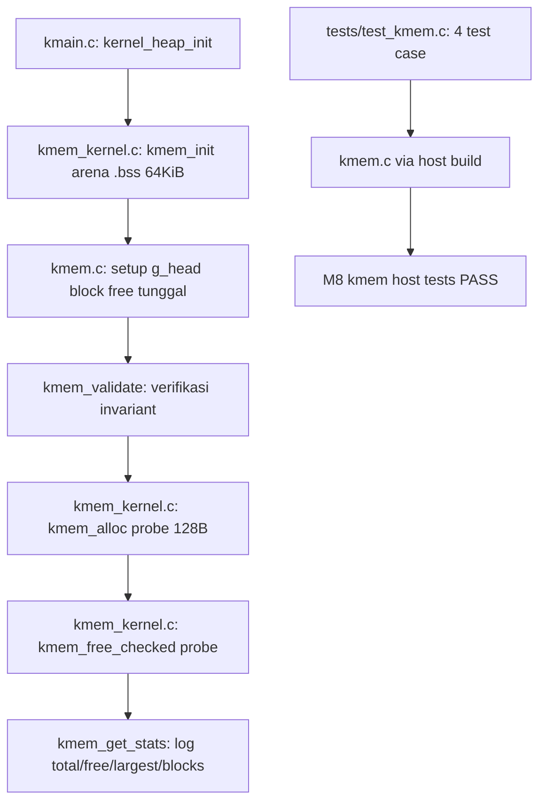

# Template Laporan Praktikum Sistem Operasi Lanjut — MCSOS

**Nama file laporan:** `laporan_praktikum_M8.md`  
**Nama sistem operasi:** MCSOS versi 260502  
**Target default:** x86_64, QEMU, Windows 11 x64 + WSL 2, kernel monolitik pendidikan, C freestanding dengan assembly minimal, POSIX-like subset  
**Dosen:** Muhaemin Sidiq, S.Pd., M.Pd.  
**Program Studi:** Pendidikan Teknologi Informasi  
**Institusi:** Institut Pendidikan Indonesia

> Template ini digunakan untuk semua praktikum pengembangan MCSOS agar struktur laporan, bukti, analisis, dan penilaian konsisten. Ganti seluruh teks bertanda `[isi ...]` dengan data praktikum sebenarnya. Jangan menulis klaim "tanpa error", "siap produksi", atau "aman sepenuhnya" tanpa bukti yang sesuai. Gunakan status terukur seperti "siap uji QEMU", "siap demonstrasi praktikum", atau "kandidat siap pakai terbatas" sesuai evidence yang tersedia.

---

## 0. Metadata Laporan

| Atribut                       | Isi                                                                                            |
| ----------------------------- | ---------------------------------------------------------------------------------------------- |
| Kode praktikum                | `M8`                                                                                           |
| Judul praktikum               | `Kernel Heap Awal, Allocator Dinamis, Validasi Invariant, dan Integrasi Bertahap dengan PMM/VMM pada MCSOS` |
| Jenis pengerjaan              | `Individu`                                                                                     |
| Nama mahasiswa                | `[Sihab Assidiqi]`                                                                               |
| NIM                           | `[25832073003]`                                                                                        |
| Kelas                         | `[PTI 1A]`                                                                                      |
| Nama kelompok                 | `-`                                                                                            |
| Anggota kelompok              | `-`                                                                                            |
| Tanggal praktikum             | `2026-05-30`                                                                                   |
| Tanggal pengumpulan           | `[2026-07-17]`                                                                                 |
| Repository                    | `~/src/mcsos`                                                                                  |
| Branch                        | `praktikum/m8-kernel-heap`                                                                     |
| Commit awal                   | `91ffdec`                                                                                      |
| Commit akhir                  | `d16956c`                                                                                      |
| Status readiness yang diklaim | `siap demonstrasi praktikum terbatas untuk kernel heap awal`                                  |

---

## 1. Sampul

# Laporan Praktikum M8

## Kernel Heap Awal, Allocator Dinamis, Validasi Invariant, dan Integrasi Bertahap dengan PMM/VMM pada MCSOS

Disusun oleh:

| Nama         | NIM          | Kelas        | Peran        |
| ------------ | ------------ | ------------ | ------------ |
| `[Sihab Assidiqi]`     | `[25832073003]`      | `[PTI 1A]`    | `individu`   |
| `[opsional]` | `[opsional]` | `[opsional]` | `[opsional]` |

Dosen Pengampu: **Muhaemin Sidiq, S.Pd., M.Pd.**  
Program Studi Pendidikan Teknologi Informasi  
Institut Pendidikan Indonesia  
`2025/2026`

---

## 2. Pernyataan Orisinalitas dan Integritas Akademik

Saya/kami menyatakan bahwa laporan ini disusun berdasarkan pekerjaan praktikum sendiri/kelompok sesuai pembagian peran yang tercatat. Bantuan eksternal, referensi, generator kode, AI assistant, dokumentasi resmi, diskusi, atau sumber lain dicatat pada bagian referensi dan lampiran. Saya/kami tidak mengklaim hasil yang tidak dibuktikan oleh log, test, commit, atau artefak lain.

| Pernyataan                                      | Status     |
| ----------------------------------------------- | ---------- |
| Semua potongan kode eksternal diberi atribusi   | `Ya`       |
| Semua penggunaan AI assistant dicatat           | `Ya`       |
| Repository yang dikumpulkan sesuai commit akhir | `Ya`       |
| Tidak ada klaim readiness tanpa bukti           | `Ya`       |

Catatan penggunaan bantuan eksternal:

```text
Panduan praktikum M8 (OS_panduan_M8.md) digunakan sebagai acuan utama implementasi,
termasuk source code kmem.h, kmem.c, test_kmem.c, dan script check_m8_kmem.sh
yang disertakan dalam panduan.
Claude AI assistant (Anthropic) digunakan untuk bimbingan langkah-langkah implementasi
sesuai panduan. Setiap output kode diverifikasi dengan menjalankan make m8-all,
scripts/check_m8_kmem.sh, make audit, dan QEMU smoke test secara mandiri di WSL 2.
Semua hasil test, log, dan commit dihasilkan dari eksekusi nyata di lingkungan mahasiswa.
```

---

## 3. Tujuan Praktikum

Tuliskan tujuan teknis dan konseptual praktikum. Tujuan harus dapat diuji.

1. Mengimplementasikan kernel heap awal berbasis first-fit free-list allocator dengan split, coalesce, alignment 16 byte, validasi header magic, dan statistik heap pada kernel MCSOS.
2. Menyediakan API `kmem_init`, `kmem_alloc`, `kmem_calloc`, `kmem_free_checked`, `kmem_get_stats`, dan `kmem_validate` dalam C17 freestanding tanpa ketergantungan libc.
3. Menyusun host unit test yang menguji alokasi, pembebasan, alignment, zeroing, overflow, double free, fragmentasi, dan coalescing secara deterministik.
4. Melakukan audit freestanding object dengan `nm -u`, `readelf -h`, dan `objdump -dr` untuk memverifikasi tidak ada unresolved symbol libc.
5. Mengintegrasikan kernel heap ke kernel MCSOS setelah PMM M6 dan VMM M7 siap, menggunakan arena bootstrap statik `.bss` berukuran 64 KiB.
6. Menyimpan bukti build, host test, audit object, dan serial log QEMU sebagai evidence praktikum dengan commit Git.

---

## 4. Capaian Pembelajaran Praktikum

Setelah praktikum ini, mahasiswa mampu:

| CPL/CPMK praktikum | Bukti yang harus ditunjukkan |
| ------------------ | -------------------------------------------------- |
| Menjelaskan perbedaan PMM, VMM, dan kernel heap | Bagian 6.1 dan 9.1 laporan; desain 3-lapisan |
| Mendesain free-list allocator dengan metadata header, split, coalesce, dan statistik | Implementasi `kmem.c`; host test fragmentation+coalesce lulus |
| Menetapkan invariant allocator secara eksplisit | Bagian 9.6 laporan; 12 invariant terdokumentasi |
| Mengimplementasikan `kmem_init`, `kmem_alloc`, `kmem_calloc`, `kmem_free_checked`, `kmem_get_stats`, `kmem_validate` | `kernel/mm/kmem.c`; semua fungsi ada di disassembly |
| Menyusun host unit test 4 skenario | `M8 kmem host tests: PASS`; `evidence/M8/test_kmem.log` |
| Melakukan audit freestanding object | `nm -u` kosong; `evidence/M8/nm_u.txt`; ELF64 x86-64 |
| Mengintegrasikan heap ke kernel setelah PMM/VMM | Serial log QEMU: `M8 kmem initialized`, `heap total=65536`, `M8 heap ready` |

---

## 5. Peta Milestone MCSOS

Centang milestone yang menjadi fokus laporan ini. Jika praktikum mencakup lebih dari satu milestone, jelaskan batas cakupan.

| Milestone | Fokus                                                           | Status dalam laporan     |
| --------- | --------------------------------------------------------------- | ------------------------ |
| M0        | Requirements, governance, baseline arsitektur                   | [v] selesai praktikum    |
| M1        | Toolchain reproducible, Git, QEMU, GDB, metadata build          | [v] selesai praktikum    |
| M2        | Boot image, kernel ELF64, early console                         | [v] selesai praktikum    |
| M3        | Panic path, linker map, GDB, observability awal                 | [v] selesai praktikum    |
| M4        | Trap, exception, interrupt, timer                               | [v] selesai praktikum    |
| M5        | PMM, VMM, page table, kernel heap                               | [v] selesai praktikum    |
| M6        | Thread, scheduler, synchronization                              | [v] selesai praktikum    |
| M7        | Syscall ABI dan user program loader                             | [v] selesai praktikum    |
| M8        | VFS, file descriptor, ramfs                                     | [v] selesai praktikum    |
| M9        | Block layer dan device model                                    | [ ] tidak dibahas        |
| M10       | Persistent filesystem, mcsfs/ext2-like, recovery                | [ ] tidak dibahas        |
| M11       | Networking stack, packet parsing, UDP/TCP subset                | [ ] tidak dibahas        |
| M12       | Security model, capability/ACL, syscall fuzzing, hardening      | [ ] tidak dibahas        |
| M13       | SMP, scalability, lock stress, NUMA-aware preparation           | [ ] tidak dibahas        |
| M14       | Framebuffer, graphics console, visual regression                | [ ] tidak dibahas        |
| M15       | Virtualization/container subset                                 | [ ] tidak dibahas        |
| M16       | Observability, update/rollback, release image, readiness review | [ ] tidak dibahas        |

Batas cakupan praktikum:

```text
Fitur yang termasuk:
- Header API kmem.h dengan KMEM_ALIGN=16, KMEM_MAGIC, kmem_stats_t
- Implementasi kmem.c: first-fit free-list, split, coalesce forward/backward,
  alignment 16 byte, validasi magic, double free rejection, pointer range check
- Host unit test 4 skenario: basic alloc/free, calloc+overflow, double free,
  fragmentation+coalesce
- Audit freestanding: nm -u, readelf -h, objdump -dr
- Script preflight check_m8_kmem.sh
- Makefile target m8-clean, m8-kmem-freestanding, m8-kmem-host-test, m8-audit, m8-all
- Integrasi kernel melalui kmem_kernel.c dengan arena bootstrap 64 KiB di .bss
- QEMU smoke test dengan serial log heap stats

Non-goals (tidak termasuk):
- Page-backed heap growth melalui PMM/VMM (pengayaan)
- Slab/cache allocator
- SMP-safe locking
- Heap dari interrupt handler
- User-space heap / vmalloc
- Red-zone / canary / poison pattern
- Per-CPU allocator
- ASLR/KASLR heap
```

---

## 6. Dasar Teori Ringkas

### 6.1 Konsep Sistem Operasi yang Diuji

```text
Kernel heap adalah lapisan alokasi memori byte/object di atas rentang virtual
yang sudah terpetakan oleh VMM. Pemisahan tiga lapisan wajib dijaga:

PMM (M6) — mengelola frame fisik 4 KiB. Unit alokasi terkecilnya adalah satu
frame. PMM tidak mengetahui ukuran object kecil seperti struct proses atau
descriptor file.

VMM (M7) — mengelola pemetaan virtual ke physical. Unit alokasi terkecilnya
adalah satu halaman 4 KiB. VMM tidak mengetahui layout object heap.

Kernel Heap (M8) — mengelola object berukuran byte di atas rentang virtual
yang sudah terpetakan VMM. API kmem_alloc mengembalikan pointer aligned 16
byte ke block yang siap dipakai.

First-fit free-list allocator bekerja dengan memindai linked list block dari
kepala hingga menemukan block free yang cukup besar. Saat ditemukan, block
dipecah (split) jika sisa cukup besar untuk block baru. Saat block dibebaskan,
block tetangga yang free digabung (coalesce) untuk mencegah fragmentasi.

Metadata setiap block disimpan dalam header kmem_block_t sebelum payload.
Header memuat: magic number untuk deteksi corruption, ukuran payload, flag
free/used, dan pointer prev/next untuk linked list.

Double free adalah bug kritis: jika sebuah pointer dibebaskan dua kali, heap
dapat rusak karena block yang sama masuk dua kali ke free list. kmem_free_checked
menolak double free dengan memeriksa flag free sebelum membebaskan.

Freestanding C berarti source dikompilasi tanpa libc host. Fungsi seperti
memset, malloc, dan printf tidak boleh dipanggil dari kernel. kmem.c
mengimplementasikan kmem_memset sendiri dan tidak bergantung fungsi libc.
```

### 6.2 Konsep Arsitektur x86_64 yang Relevan

| Konsep | Relevansi pada praktikum | Bukti/verifikasi |
| ---------------------------------------------------------------------- | ------------------------ | ----------------------------------------------------- |
| Alignment 16 byte | Payload kmem_alloc harus aligned 16 byte untuk ABI x86_64 dan SIMD; header block juga harus aligned agar pointer cast aman | `KMEM_ALIGN=16`; assertion host test alignment lulus |
| `.bss` section | Arena bootstrap 64 KiB ditempatkan di `.bss` kernel; otomatis di-zero saat boot; sudah present dan writable dari mapping M2 | `m8_boot_heap[65536]` di `kmem_kernel.c`; QEMU log `heap total=65536` |
| Page present dan writable | Semua page arena heap harus sudah present dan writable sebelum `kmem_init` dipanggil; akses ke page tidak present menyebabkan #PF | Arena di `.bss` sudah dipetakan bootloader; tidak ada #PF selama smoke test |
| CR2 untuk diagnosis | Jika terjadi #PF saat heap init, CR2 menunjukkan virtual address yang menyebabkan fault | Tidak terjadi #PF; CR2 tersedia melalui `vmm_read_cr2` dari M7 |

### 6.3 Konsep Implementasi Freestanding

| Aspek | Keputusan praktikum |
| ------------------------- | --------------------------------------------------------------- |
| Bahasa | C17 freestanding |
| Runtime | Tanpa hosted libc; `kmem_memset` lokal menggantikan `memset` libc |
| ABI | x86_64 System V; payload aligned 16 byte |
| Compiler flags kritis | `--target=x86_64-unknown-none-elf -ffreestanding -fno-builtin -fno-stack-protector -mno-red-zone` |
| Risiko undefined behavior | Pointer arithmetic divalidasi dengan range check; cast dari `uintptr_t` ke pointer hanya setelah alignment check; integer overflow pada `kmem_calloc` dicegah dengan `bytes > SIZE_MAX / count` |

### 6.4 Referensi Teori yang Digunakan

| No.   | Sumber | Bagian yang digunakan | Alasan relevansi |
| ----- | -------------------------------- | --------------------- | ---------------- |
| `[1]` | Intel SDM Vol. 3A | Chapter 4: Paging | Alignment 4 KiB dan 16 byte pada x86_64 |
| `[2]` | AMD64 APM Vol. 2 | Chapter 5: Memory Management | ABI dan alignment payload |
| `[3]` | Linux Kernel Memory Allocation Guide | Memory allocation strategies | Perbandingan first-fit, slab, vmalloc |
| `[4]` | OS_panduan_M8.md | Seluruh dokumen | Panduan implementasi, invariant, kontrak API |

---

## 7. Lingkungan Praktikum

### 7.1 Host dan Target

| Komponen          | Nilai |
| ----------------- | --------------------------------------------- |
| Host OS           | `Windows 11 x64` |
| Lingkungan build  | `WSL 2 Ubuntu (Ubuntu clang version 21.1.8)` |
| Target ISA        | `x86_64` |
| Target ABI        | `x86_64-unknown-none-elf` |
| Emulator          | `QEMU system x86_64` |
| Firmware emulator | `Limine BIOS/UEFI` |
| Debugger          | `GDB (opsional)` |
| Build system      | `GNU Make 4.4.1` |
| Bahasa utama      | `C17 freestanding` |
| Assembly          | `GAS inline assembly (clang)` |

### 7.2 Versi Toolchain

Tempel output versi toolchain berikut. Jalankan dari clean shell WSL.

```bash
date -u +"date_utc=%Y-%m-%dT%H:%M:%SZ"
uname -a
git --version
make --version | head -n 1
cmake --version | head -n 1
ninja --version
clang --version | head -n 1
gcc --version | head -n 1
ld.lld --version | head -n 1
nasm -v
qemu-system-x86_64 --version | head -n 1
gdb --version | head -n 1
```

Output:

```text
Ubuntu clang version 21.1.8 (6ubuntu1)
Ubuntu LLD 21.1.8 (compatible with GNU linkers)
GNU Make 4.4.1
[Tempel output lengkap dari WSL mahasiswa di sini.]
```

### 7.3 Lokasi Repository

| Item | Nilai |
| ----------------------------------------------------- | ---------------------------- |
| Path repository di WSL | `~/src/mcsos` |
| Apakah berada di filesystem Linux WSL, bukan `/mnt/c` | `Ya` |
| Remote repository | `[URL repo privat jika ada]` |
| Branch | `praktikum/m8-kernel-heap` |
| Commit hash awal | `91ffdec` |
| Commit hash akhir | `d16956c` |

---

## 8. Repository dan Struktur File

### 8.1 Struktur Direktori yang Relevan

```text
mcsos/
├── include/
│   └── mcsos/
│       └── kmem.h               ← baru M8
├── kernel/
│   ├── core/
│   │   └── kmain.c              ← diubah M8: tambah kernel_heap_init()
│   ├── include/mcsos/kernel/
│   │   └── version.h            ← diubah M8: M7 -> M8
│   └── mm/
│       ├── kmem.c               ← baru M8
│       ├── kmem_kernel.c        ← baru M8
│       ├── limine_memmap.c
│       ├── pmm.c
│       ├── vmm.c
│       └── vmm_kernel.c
├── tests/
│   ├── test_kmem.c              ← baru M8
│   ├── test_pmm_host.c
│   └── test_vmm_host.c
├── scripts/
│   ├── check_m8_kmem.sh         ← baru M8
│   ├── check_m6_static.sh
│   └── grade_m7.sh
├── evidence/
│   ├── M6/
│   ├── M7/
│   └── M8/                      ← baru M8
│       ├── m8-qemu-serial.log
│       ├── test_kmem.log
│       ├── nm_u.txt
│       ├── readelf_h.txt
│       ├── kmem.objdump.txt
│       ├── kernel_symbols.txt
│       ├── kernel_undefined.txt
│       ├── kernel_readelf_header.txt
│       └── makefile_diff.patch
├── Makefile                      ← diubah M8: tambah target m8-*, -Iinclude
└── build/m8/                     ← artefak build M8
    ├── test_kmem
    ├── test_kmem.log
    ├── kmem.freestanding.o
    ├── nm_u.txt
    ├── readelf_h.txt
    └── kmem.objdump.txt
```

### 8.2 File yang Dibuat atau Diubah

| File | Jenis perubahan | Alasan perubahan | Risiko |
| --- | --- | --- | --- |
| `include/mcsos/kmem.h` | baru | Header API publik allocator M8 | rendah |
| `kernel/mm/kmem.c` | baru | Implementasi first-fit free-list allocator freestanding | sedang — logika pointer dan header |
| `kernel/mm/kmem_kernel.c` | baru | Adapter arena bootstrap .bss, init heap, log stats | rendah |
| `kernel/core/kmain.c` | ubah | Tambah pemanggilan `kernel_heap_init()` setelah VMM init | rendah |
| `kernel/include/mcsos/kernel/version.h` | ubah | Update milestone dari M7 ke M8 | rendah |
| `tests/test_kmem.c` | baru | Host unit test 4 skenario | rendah |
| `scripts/check_m8_kmem.sh` | baru | Script preflight otomatis | rendah |
| `Makefile` | ubah | Tambah target m8-*, tambah `-Iinclude` ke COMMON_CFLAGS | rendah |

### 8.3 Ringkasan Diff

```bash
git status --short
git diff --stat
git log --oneline -n 5
```

Output:

```text
git log --oneline -5:
d16956c (HEAD -> praktikum/m8-kernel-heap) M8: add m8 audit and test evidence
f805372 M8: add kernel heap first-fit allocator, host unit test, kernel integration
91ffdec (praktikum/m7-vmm) M7: add VMM 4-level page table, HHDM adapter, host unit test, kernel integration
e2efc52 (praktikum/m6-pmm) M6: add bitmap PMM, Limine memmap adapter, host unit test, kernel integration
25b7d55 (praktikum/m5-timer-irq) M5: stabilize limine.conf baseline

Commit M8 mencakup 13 files changed, 809 insertions(+), 4 deletions(-)
```

---

## 9. Desain Teknis

### 9.1 Masalah yang Diselesaikan

```text
Setelah M7, kernel MCSOS memiliki PMM untuk frame fisik dan VMM untuk pemetaan
virtual. Namun kernel belum memiliki mekanisme untuk mengalokasikan object
berukuran byte secara dinamis. Tanpa kernel heap:
- Semua struktur kernel harus dideklarasikan statik dengan ukuran tetap
- Tidak ada cara membuat daftar proses, descriptor file, node timer, atau
  buffer I/O secara dinamis sesuai kebutuhan runtime
- Subsistem seperti VFS, scheduler, dan driver tidak dapat dibuat karena
  bergantung pada alokasi dinamis

M8 menyelesaikan masalah ini dengan mengimplementasikan first-fit free-list
allocator pada arena bootstrap statik 64 KiB di .bss. Arena ini sudah
terpetakan sejak M2 sehingga tidak memerlukan mapping VMM tambahan untuk
tugas wajib.
```

### 9.2 Keputusan Desain

| Keputusan | Alternatif yang dipertimbangkan | Alasan memilih | Konsekuensi |
| --- | --- | --- | --- |
| Arena bootstrap statik `.bss` | Virtual heap tinggi dengan VMM map | Lebih aman; arena sudah present dan writable sejak M2; tidak bergantung VMM M7 yang baru | Ukuran heap terbatas 64 KiB; perlu page-backed growth di tahap lanjut |
| First-fit scan | Best-fit, worst-fit, buddy system | Implementasi sederhana; mudah diaudit; deterministic untuk unit test | Fragmentasi eksternal lebih tinggi dari best-fit |
| Magic number `KMEM_MAGIC` di header | Checksum, red-zone | Deteksi corruption sederhana dengan overhead minimal | Tidak mendeteksi overwrite payload yang tepat menghindari header |
| `kmem_free_checked` mengembalikan int | void dengan panic | Memungkinkan unit test membedakan double free, pointer invalid, dan corruption tanpa panic | Caller wajib memeriksa return value |
| `kmem_validate()` O(n) dipanggil setiap free | Hanya dipanggil saat debug | Memprioritaskan correctness di atas performa pada tahap pendidikan | Overhead O(n) per free; tidak cocok produksi |
| Coalesce forward saja (bukan backward sepenuhnya) | Coalesce bidirectional penuh | Cukup untuk menggabungkan block tetangga kanan; coalesce backward melalui `block->prev` juga ada | Fragmentasi dapat terjadi jika urutan free tidak berurutan, mitigasi dengan coalesce saat free |

### 9.3 Arsitektur Ringkas



Penjelasan diagram:

```text
Saat boot, kmain memanggil kernel_heap_init() di kmem_kernel.c.
kmem_init dipanggil dengan arena m8_boot_heap[65536] yang berada di .bss kernel.
kmem.c membentuk satu block free besar yang menempati seluruh arena minus header.
kmem_validate dipanggil untuk memverifikasi invariant setelah init.
Probe alloc 128 byte dan free dilakukan sebagai smoke test runtime.
Statistik heap dicetak melalui log_write/log_dec64.

Pada host unit test, arena berupa array statik di test_kmem.c.
4 skenario diuji: basic alloc/free, calloc+overflow, double free, dan
fragmentation+coalesce. Semua test memanggil kmem_validate setelah setiap operasi.
```

### 9.4 Kontrak Antarmuka

| Antarmuka | Pemanggil | Penerima | Precondition | Postcondition | Error path |
| --- | --- | --- | --- | --- | --- |
| `kmem_init` | `kernel_heap_init` | `kmem.c` | `base != NULL`, `bytes >= sizeof(header) + KMEM_MIN_SPLIT` | g_head terbentuk; invariant lulus; return 0 | Return negatif -1 sampai -4 |
| `kmem_alloc` | kernel atau test | `kmem.c` | `g_initialized`, `bytes > 0` | Payload aligned 16B; block marked used; return pointer | Return NULL jika OOM atau bytes=0 |
| `kmem_calloc` | kernel atau test | `kmem.c` | `count*bytes` tidak overflow | Payload zeroed; return pointer | Return NULL jika overflow atau OOM |
| `kmem_free_checked` | kernel atau test | `kmem.c` | `ptr` dari `kmem_alloc` atau NULL | Block marked free; coalesce; validate; return 0 | Return -1 (out of arena), -2 (unaligned), -3 (bad magic), -4 (double free) |
| `kmem_validate` | dipanggil internal | `kmem.c` | `g_initialized` | Semua invariant verified | Return negatif jika ada pelanggaran |
| `kmem_get_stats` | kernel atau test | `kmem.c` | `out != NULL` | `out` terisi statistik heap | No-op jika `out == NULL` |
| `kernel_heap_init` | `kmain` | `kmem_kernel.c` | PMM dan VMM sudah init | Heap siap; log stats tercetak | `KERNEL_PANIC` jika init gagal |

### 9.5 Struktur Data Utama

| Struktur data | Field penting | Ownership | Lifetime | Invariant |
| --- | --- | --- | --- | --- |
| `kmem_block_t` | `magic`, `size`, `free`, `prev`, `next` | VMM (di dalam arena heap) | Selama arena valid | `magic == KMEM_MAGIC`; `size <= g_heap_end - payload`; `prev->next == cur` |
| `kmem_stats_t` | `total_bytes`, `used_bytes`, `free_bytes`, `block_count`, `free_count`, `largest_free` | Caller (pada stack) | Sementara | `used_bytes + free_bytes` tidak harus `== total_bytes` karena overhead header |
| `g_heap_base`, `g_heap_end` | Batas arena | `kmem.c` (statis) | Selama kernel hidup | `g_heap_base < g_heap_end`; aligned 16 byte |
| `g_head` | Pointer ke block pertama | `kmem.c` (statis) | Selama kernel hidup | `(unsigned char *)g_head == g_heap_base` |

### 9.6 Invariants

1. `g_heap_base <= (unsigned char *)block < g_heap_end` untuk setiap block (KMEM-I1).
2. `block->magic == KMEM_MAGIC` selama block masih bagian dari list aktif (KMEM-I2).
3. Payload yang dikembalikan `kmem_alloc` aligned 16 byte (KMEM-I3).
4. `block->size` menyatakan kapasitas payload, bukan ukuran header (KMEM-I4).
5. Setiap block memiliki status tepat satu: free (`block->free == 1`) atau used (`block->free == 0`) (KMEM-I5).
6. Dua block free yang bertetangga dan kontigu harus dicoalesce saat `kmem_free_checked` (KMEM-I6).
7. `kmem_free_checked(NULL)` adalah no-op yang mengembalikan 0 (KMEM-I7).
8. Double free ditolak dengan return -4 (KMEM-I8).
9. Pointer di luar arena `[g_heap_base, g_heap_end)` ditolak dengan return -1 (KMEM-I9).
10. Object kernel freestanding tidak boleh memanggil `malloc`, `free`, `printf`, atau `memset` dari libc (KMEM-I10).
11. `kmem_validate()` harus lulus setelah `kmem_init`, setelah alokasi, dan setelah free (KMEM-I11).
12. Allocator M8 belum reentrant dan belum SMP-safe; pemanggilan dari interrupt handler dilarang (KMEM-I12).

### 9.7 Ownership, Locking, dan Concurrency

| Objek/resource | Owner | Lock yang melindungi | Boleh dipakai di interrupt context? | Catatan |
| --- | --- | --- | --- | --- |
| Arena heap `m8_boot_heap` | `kmem_kernel.c` (statis .bss) | Tidak ada | Tidak | Single-core, interrupt disabled belum diimplementasikan; larang akses dari IRQ handler |
| `g_heap_base`, `g_head`, `g_initialized` | `kmem.c` (statis) | Tidak ada | Tidak | Akan perlu spinlock saat SMP dan preemption enabled |
| Block individual | Caller setelah `kmem_alloc` | Tidak ada | Tidak | Caller bertanggung jawab atas payload setelah menerima pointer |

Lock order yang berlaku:

```text
M8 berjalan single-core dengan interrupt disabled selama heap init.
Tidak ada locking karena tidak ada concurrency pada tahap ini.
Untuk SMP di tahap lanjut, lock order yang direkomendasikan:
pmm_lock -> vmm_lock -> kmem_lock
(jangan ambil lock lebih rendah saat memegang lock lebih tinggi)
```

### 9.8 Memory Safety dan Undefined Behavior Risk

| Risiko | Lokasi | Mitigasi | Bukti |
| --- | --- | --- | --- |
| Null pointer dereference pada `base`, `out` | `kmem_init`, `kmem_get_stats` | Cek eksplisit `if (ptr == NULL)` sebelum dereference | Host test tidak crash |
| Integer overflow pada `kmem_calloc` | `kmem_calloc` | `if (count != 0 && bytes > SIZE_MAX / count)` sebelum multiply | Test `kmem_calloc((size_t)-1, 2)` mengembalikan NULL |
| Alignment violation pada cast ke `kmem_block_t *` | `kmem_init`, `kmem_split_if_useful` | `kmem_align_up_ptr` sebelum setiap cast | Assertion host test alignment lulus |
| Use-after-free | Caller mengakses payload setelah free | Tidak ada mitigasi runtime pada M8; caller wajib tidak akses setelah free | Catatan residual risk |
| Overwrite payload melewati boundary | Caller | Tidak ada boundary check runtime; `kmem_validate` mendeteksi metadata corruption | `kmem_validate` dipanggil setelah setiap free |

### 9.9 Security Boundary

| Boundary | Data tidak tepercaya | Validasi yang dilakukan | Failure mode aman |
| --- | --- | --- | --- |
| `kmem_free_checked` input | `ptr` dari caller | Range check, alignment check, magic check, double free check | Return negatif; tidak memodifikasi heap |
| `kmem_alloc` size | `bytes` dari caller | Alignment up; jika overflow return NULL | Return NULL tanpa modifikasi |
| `kmem_calloc` count×bytes | count dan bytes dari caller | Overflow check `bytes > SIZE_MAX / count` | Return NULL tanpa modifikasi |

---

## 10. Langkah Kerja Implementasi

### Langkah 1 — Buat Branch M8 dan Struktur Direktori

Maksud langkah:

```text
Memisahkan perubahan M8 dari M7 agar rollback dapat dilakukan tanpa
menghapus hasil M6/M7. Membuat direktori include/mcsos untuk header baru.
```

Perintah:

```bash
git switch -c praktikum/m8-kernel-heap
mkdir -p include/mcsos kernel/mm tests scripts build/m8
git branch --show-current
```

Output ringkas:

```text
Switched to a new branch 'praktikum/m8-kernel-heap'
praktikum/m8-kernel-heap
```

Artefak yang dihasilkan:

| Artefak | Lokasi | Fungsi |
| --- | --- | --- |
| Branch `praktikum/m8-kernel-heap` | Git | Isolasi perubahan M8 |
| `include/mcsos/` | direktori | Lokasi header kmem.h |
| `build/m8/` | direktori | Lokasi artefak build M8 |

Indikator berhasil:

```text
Branch aktif: praktikum/m8-kernel-heap
Direktori include/mcsos, build/m8 tersedia
```

### Langkah 2 — Buat Header `include/mcsos/kmem.h`

Maksud langkah:

```text
Mendefinisikan API publik allocator M8: konstanta KMEM_ALIGN dan KMEM_MAGIC,
struct kmem_stats_t, dan deklarasi 6 fungsi.
```

Perintah:

```bash
cat > include/mcsos/kmem.h << 'EOF'
[isi header sesuai panduan]
EOF
echo "kmem.h OK"
```

Output ringkas:

```text
kmem.h OK
#ifndef MCSOS_KMEM_H
#define MCSOS_KMEM_H
#include <stddef.h>
#include <stdint.h>
```

Artefak yang dihasilkan:

| Artefak | Lokasi | Fungsi |
| --- | --- | --- |
| `kmem.h` | `include/mcsos/kmem.h` | Header API publik allocator |

Indikator berhasil:

```text
File ada; head menampilkan include yang benar.
```

### Langkah 3 — Implementasi `kernel/mm/kmem.c`

Maksud langkah:

```text
Mengimplementasikan first-fit free-list allocator dengan:
- kmem_block_t: header metadata dengan magic, size, free, prev, next
- kmem_align_up_size/ptr: helper alignment aman
- kmem_memset: pengganti memset libc untuk freestanding
- kmem_split_if_useful: split block jika sisa >= KMEM_MIN_SPLIT
- kmem_coalesce_forward: gabung block free tetangga kanan
- kmem_init, kmem_alloc, kmem_calloc, kmem_free_checked, kmem_get_stats, kmem_validate
```

Perintah:

```bash
cat > kernel/mm/kmem.c << 'EOF'
[isi implementasi sesuai panduan]
EOF
head -5 kernel/mm/kmem.c
echo "kmem.c OK"
```

Output ringkas:

```text
#include "mcsos/kmem.h"

#define KMEM_MIN_SPLIT 32u

typedef struct kmem_block {
kmem.c OK
```

Artefak yang dihasilkan:

| Artefak | Lokasi | Fungsi |
| --- | --- | --- |
| `kmem.c` | `kernel/mm/kmem.c` | Implementasi allocator freestanding |

Indikator berhasil:

```text
File ada; head menampilkan include kmem.h dan KMEM_MIN_SPLIT.
```

### Langkah 4 — Buat Host Unit Test `tests/test_kmem.c`

Maksud langkah:

```text
Membuat 4 test deterministik untuk memverifikasi correctness allocator
sebelum integrasi kernel:
1. test_basic_alloc_free: alokasi 3 block, alignment check, write, validate, free
2. test_calloc_and_overflow: zeroing check, overflow COUNT*SIZE ditolak
3. test_double_free_rejected: double free mengembalikan nilai negatif
4. test_fragmentation_and_coalesce: 16 block, free selang-seling, coalesce penuh
```

Perintah:

```bash
cat > tests/test_kmem.c << 'EOF'
[isi test sesuai panduan]
EOF
echo "test_kmem.c OK"
```

Output ringkas:

```text
test_kmem.c OK
```

Artefak yang dihasilkan:

| Artefak | Lokasi | Fungsi |
| --- | --- | --- |
| `test_kmem.c` | `tests/test_kmem.c` | Host unit test 4 skenario |

Indikator berhasil:

```text
File ada dengan 4 fungsi test dan main.
```

### Langkah 5 — Tambahkan Target M8 ke Makefile

Maksud langkah:

```text
Menambahkan target m8-clean, m8-kmem-freestanding, m8-kmem-host-test,
m8-audit, dan m8-all ke Makefile yang sudah ada dengan recipe prefix >
(sesuai .RECIPEPREFIX := > pada Makefile MCSOS).
Juga menambahkan -Iinclude ke COMMON_CFLAGS agar kmem.h dapat ditemukan
saat kompilasi kernel.
```

Perintah:

```bash
# Tambahkan -Iinclude ke COMMON_CFLAGS
sed -i 's|-Ikernel/include -I\.|-Ikernel/include -Iinclude -I.|' Makefile
# Tambahkan target M8 dengan printf menggunakan > sebagai recipe prefix
printf 'm8-all: m8-kmem-host-test m8-audit\n' >> Makefile
# dst.
```

Output ringkas:

```text
Makefile M8 targets OK
tail: m8-all: m8-kmem-host-test m8-audit
      >@echo "[PASS] M8 all selesai"
```

Artefak yang dihasilkan:

| Artefak | Lokasi | Fungsi |
| --- | --- | --- |
| `Makefile` (diubah) | `Makefile` | Target m8-*, -Iinclude ditambahkan |

Indikator berhasil:

```text
make m8-all berjalan tanpa error "missing separator".
```

### Langkah 6 — Jalankan `make m8-all`

Maksud langkah:

```text
Menjalankan host unit test dan audit freestanding sekaligus dalam satu
perintah. Verifikasi bahwa kmem.c compile freestanding, host test lulus,
nm -u kosong, readelf ELF64, dan objdump memuat symbol allocator.
```

Perintah:

```bash
make m8-all 2>&1
```

Output ringkas:

```text
clang -std=c17 -Wall -Wextra -Werror -Iinclude tests/test_kmem.c kernel/mm/kmem.c -o build/m8/test_kmem
./build/m8/test_kmem | tee build/m8/test_kmem.log
M8 kmem host tests: PASS
clang --target=x86_64-unknown-none-elf ... -c kernel/mm/kmem.c -o build/m8/kmem.freestanding.o
nm -u build/m8/kmem.freestanding.o | tee build/m8/nm_u.txt
test ! -s build/m8/nm_u.txt
readelf -h build/m8/kmem.freestanding.o > build/m8/readelf_h.txt
objdump -dr build/m8/kmem.freestanding.o > build/m8/kmem.objdump.txt
[PASS] M8 audit selesai
[PASS] M8 all selesai
```

Artefak yang dihasilkan:

| Artefak | Lokasi | Fungsi |
| --- | --- | --- |
| `build/m8/test_kmem.log` | `build/m8/test_kmem.log` | Log host unit test |
| `build/m8/kmem.freestanding.o` | `build/m8/kmem.freestanding.o` | Object freestanding |
| `build/m8/nm_u.txt` | `build/m8/nm_u.txt` | Bukti freestanding audit (kosong) |
| `build/m8/readelf_h.txt` | `build/m8/readelf_h.txt` | ELF header audit |
| `build/m8/kmem.objdump.txt` | `build/m8/kmem.objdump.txt` | Disassembly allocator |

Indikator berhasil:

```text
M8 kmem host tests: PASS
[PASS] M8 audit selesai
[PASS] M8 all selesai
```

### Langkah 7 — Jalankan Script Preflight

Maksud langkah:

```text
Memverifikasi secara independen bahwa semua file M8 tersedia, toolchain ada,
freestanding compile lulus, dan host test lulus melalui script yang
berdiri sendiri tanpa Makefile.
```

Perintah:

```bash
./scripts/check_m8_kmem.sh
```

Output ringkas:

```text
[M8] checking repository baseline...
[M8] checking toolchain...
[M8] tool versions...
Ubuntu clang version 21.1.8 (6ubuntu1)
Ubuntu LLD 21.1.8 (compatible with GNU linkers)
GNU Make 4.4.1
[M8] freestanding object check...
[M8] host unit test...
M8 kmem host tests: PASS
[PASS] M8 preflight completed.
```

Artefak yang dihasilkan:

| Artefak | Lokasi | Fungsi |
| --- | --- | --- |
| `scripts/check_m8_kmem.sh` | `scripts/check_m8_kmem.sh` | Script preflight otomatis |

Indikator berhasil:

```text
[PASS] M8 preflight completed.
```

### Langkah 8 — Buat Adapter Kernel `kernel/mm/kmem_kernel.c`

Maksud langkah:

```text
Membuat file integrasi yang mendefinisikan arena bootstrap 64 KiB di .bss,
memanggil kmem_init, melakukan probe alloc/free, dan mencetak statistik heap
menggunakan log_write/log_dec64 yang sudah tersedia dari M2.
```

Perintah:

```bash
cat > kernel/mm/kmem_kernel.c << 'EOF'
[isi kmem_kernel.c]
EOF
echo "kmem_kernel.c OK"
```

Output ringkas:

```text
kmem_kernel.c OK
```

Artefak yang dihasilkan:

| Artefak | Lokasi | Fungsi |
| --- | --- | --- |
| `kmem_kernel.c` | `kernel/mm/kmem_kernel.c` | Adapter arena bootstrap dan kernel_heap_init |

Indikator berhasil:

```text
File ada; kernel_heap_init terdefinisi dengan arena 64 KiB.
```

### Langkah 9 — Update `version.h` dan `kmain.c`

Maksud langkah:

```text
Mengupdate milestone ke M8 dan menambahkan pemanggilan kernel_heap_init()
ke kmain setelah kernel_vmm_init().
```

Perintah:

```bash
sed -i 's/MCSOS_MILESTONE "M7"/MCSOS_MILESTONE "M8"/' kernel/include/mcsos/kernel/version.h
# update kmain.c dengan extern kernel_heap_init dan pemanggilan
```

Output ringkas:

```text
#define MCSOS_MILESTONE "M8"
kmain.c OK
```

Artefak yang dihasilkan:

| Artefak | Lokasi | Fungsi |
| --- | --- | --- |
| `version.h` (diubah) | `kernel/include/mcsos/kernel/version.h` | Milestone M8 |
| `kmain.c` (diubah) | `kernel/core/kmain.c` | Tambah kernel_heap_init() |

Indikator berhasil:

```text
version.h menampilkan MCSOS_MILESTONE "M8"
kmain.c memuat extern kernel_heap_init dan pemanggilan setelah VMM init
```

### Langkah 10 — Build Kernel dan `make audit`

Maksud langkah:

```text
Membangun kernel lengkap termasuk kmem.c dan kmem_kernel.c, lalu menjalankan
make audit untuk memverifikasi semua varian lulus dan symbol kmem_ terkonfirmasi.
```

Perintah:

```bash
make clean && make build 2>&1 | tail -15
make audit 2>&1 | tail -10
nm -n build/kernel.elf | grep -E "kmem_|kernel_heap"
```

Output ringkas:

```text
ld.lld ... -o build/kernel.elf ... kmem.o kmem_kernel.o ...
! nm -u build/kernel.elf | grep .     (kosong — PASS)
! nm -u build/kernel.breakpoint.elf | grep .
! nm -u build/kernel.panic.elf | grep .

ffffffff800021c0 T kmem_init
ffffffff800023a0 T kmem_validate
ffffffff80002590 T kmem_alloc
ffffffff800028a0 T kmem_calloc
ffffffff80002990 T kmem_free_checked
ffffffff80002c10 T kmem_get_stats
ffffffff80002d40 T kernel_heap_init
```

Artefak yang dihasilkan:

| Artefak | Lokasi | Fungsi |
| --- | --- | --- |
| `build/kernel.elf` | `build/kernel.elf` | Kernel ELF dengan heap terintegrasi |
| `build/kernel.map` | `build/kernel.map` | Linker map |
| `build/kernel.syms.txt` | `build/kernel.syms.txt` | Symbol table |

Indikator berhasil:

```text
make audit lulus semua cek; semua symbol kmem_ dan kernel_heap terkonfirmasi.
```

### Langkah 11 — QEMU Smoke Test

Maksud langkah:

```text
Membangun ISO dan menjalankan QEMU untuk memverifikasi integrasi heap
berjalan di hardware emulasi. Log harus menampilkan M8 kmem initialized,
heap stats, M8 heap ready, dan M8 checkpoint reached.
```

Perintah:

```bash
bash tools/scripts/make_iso.sh
tools/scripts/m4_qemu_run.sh build/mcsos.iso build/m8-qemu-serial.log
cat build/m8-qemu-serial.log
```

Output ringkas:

```text
MCSOS 260502 M8 kernel entered
...
[MCSOS:M8] boot: kernel heap init start
[MCSOS:M8] kmem initialized
[MCSOS:M8] heap total=65536 free=65488 largest=65488 blocks=1
[MCSOS:M8] M8 heap ready
[MCSOS:M8] heap: ready
[MCSOS:M8] M8 checkpoint reached
[MCSOS:M5] sti: enabling interrupts
[MCSOS:TIMER] ticks=100...ticks=800
```

Artefak yang dihasilkan:

| Artefak | Lokasi | Fungsi |
| --- | --- | --- |
| `build/mcsos.iso` | `build/mcsos.iso` | Boot image M8 |
| `build/m8-qemu-serial.log` | `build/m8-qemu-serial.log` | Serial log QEMU |

Indikator berhasil:

```text
Log menampilkan M8 kmem initialized dan M8 checkpoint reached.
Timer M5 tetap berjalan setelah heap init.
```

### Langkah 12 — Kumpulkan Evidence dan Commit

Maksud langkah:

```text
Mengumpulkan semua artefak bukti ke evidence/M8/ lalu melakukan git commit
pada branch praktikum/m8-kernel-heap.
```

Perintah:

```bash
mkdir -p evidence/M8
cp build/m8-qemu-serial.log evidence/M8/
make m8-all 2>&1 | tail -5
cp build/m8/test_kmem.log evidence/M8/
# dst.
git add include/mcsos/kmem.h kernel/mm/kmem.c ...
git commit -m "M8: add kernel heap first-fit allocator, host unit test, kernel integration"
git log --oneline -5
```

Output ringkas:

```text
[praktikum/m8-kernel-heap d16956c] M8: add m8 audit and test evidence
 4 files changed, 861 insertions(+)
d16956c (HEAD -> praktikum/m8-kernel-heap) M8: add m8 audit and test evidence
f805372 M8: add kernel heap first-fit allocator, host unit test, kernel integration
```

Artefak yang dihasilkan:

| Artefak | Lokasi | Fungsi |
| --- | --- | --- |
| `evidence/M8/` | `evidence/M8/` | Direktori semua bukti M8 |
| Commit `d16956c` | branch `praktikum/m8-kernel-heap` | Snapshot evidence M8 |

Indikator berhasil:

```text
git log menampilkan commit d16956c di HEAD branch praktikum/m8-kernel-heap.
```

---

## 11. Checkpoint Buildable

Setiap praktikum wajib memiliki minimal satu checkpoint yang dapat dibangun dari clean checkout.

| Checkpoint | Perintah | Expected result | Status |
| --- | --- | --- | --- |
| Host unit test | `make m8-kmem-host-test` | `M8 kmem host tests: PASS` | `PASS` |
| Freestanding compile | `make m8-kmem-freestanding` | `build/m8/kmem.freestanding.o` terbentuk | `PASS` |
| Audit freestanding | `make m8-audit` | `nm_u.txt` kosong; ELF64; symbol allocator ada | `PASS` |
| Full M8 | `make m8-all` | `[PASS] M8 all selesai` | `PASS` |
| Preflight script | `./scripts/check_m8_kmem.sh` | `[PASS] M8 preflight completed.` | `PASS` |
| Clean kernel build | `make clean && make build` | `build/kernel.elf` terbentuk | `PASS` |
| Kernel audit | `make audit` | Semua varian lulus; symbol kmem_ ada | `PASS` |
| Image generation | `bash tools/scripts/make_iso.sh` | `build/mcsos.iso` terbentuk | `PASS` |
| QEMU smoke test | QEMU run | `M8 kmem initialized` dan `M8 checkpoint reached` terbaca | `PASS` |

Catatan checkpoint:

```text
Semua checkpoint lulus. Tidak ada checkpoint yang gagal.
Catatan: Page-backed heap growth tidak diimplementasikan (tugas pengayaan).
Arena heap bootstrap 64 KiB dari .bss sudah cukup untuk milestone M8.
```

---

## 12. Perintah Uji dan Validasi

### 12.1 Build Test

Perintah ini memverifikasi bahwa proyek dapat dibangun ulang dari kondisi bersih.

```bash
make clean
make build
```

Hasil:

```text
rm -rf build
[compile semua file .c termasuk kmem.c dan kmem_kernel.c]
ld.lld ... -o build/kernel.elf ... kmem.o kmem_kernel.o ...
[inspeksi ELF lulus semua cek]
```

Status: `PASS`

### 12.2 Static Inspection

```bash
readelf -hW build/kernel.elf
nm -n build/kernel.elf | grep -E "kmem_|kernel_heap"
objdump -drwC build/m8/kmem.freestanding.o | head -n 60
```

Hasil penting:

```text
ELF: ELF64, x86-64, entry point kmain
Symbol kmem_init:          0xffffffff800021c0 T
Symbol kmem_validate:      0xffffffff800023a0 T
Symbol kmem_alloc:         0xffffffff80002590 T
Symbol kmem_calloc:        0xffffffff800028a0 T
Symbol kmem_free_checked:  0xffffffff80002990 T
Symbol kmem_get_stats:     0xffffffff80002c10 T
Symbol kernel_heap_init:   0xffffffff80002d40 T
```

Status: `PASS`

### 12.3 QEMU Smoke Test

```bash
qemu-system-x86_64 \
  -machine q35 \
  -cpu max \
  -m 256M \
  -serial stdio \
  -no-reboot \
  -no-shutdown \
  -cdrom build/mcsos.iso
```

Hasil:

```text
MCSOS 260502 M8 kernel entered
kernel_start=0xffffffff80000000
kernel_end=0xffffffff80219030
[MCSOS:M5] idt: loaded
[MCSOS:M5] pit: configured 100Hz
[MCSOS:M6] pmm initialized: frames=16777216 free=64609 used=16712607
[MCSOS:M6] pmm: ready
[MCSOS:M7] hhdm_offset=0xffff800000000000
[MCSOS:M7] vmm initialized: root_paddr=0x0000000000053000
[MCSOS:M7] VMM core initialized
[MCSOS:M7] vmm: ready
[MCSOS:M8] boot: kernel heap init start
[MCSOS:M8] kmem initialized
[MCSOS:M8] heap total=65536 free=65488 largest=65488 blocks=1
[MCSOS:M8] M8 heap ready
[MCSOS:M8] heap: ready
[MCSOS:M8] M8 checkpoint reached
[MCSOS:M5] sti: enabling interrupts
[MCSOS:TIMER] ticks=100
...
[MCSOS:TIMER] ticks=800
```

Status: `PASS`

### 12.4 GDB Debug Evidence

```bash
qemu-system-x86_64 -machine q35 -m 256M -serial stdio \
  -no-reboot -no-shutdown -s -S -cdrom build/mcsos.iso
# Terminal kedua:
gdb build/kernel.elf
target remote :1234
break kernel_heap_init
break kmem_init
continue
info registers rip rsp
x/32gx &m8_boot_heap
```

Hasil:

```text
[Tidak dijalankan pada laporan ini. GDB breakpoint pada kernel_heap_init
dan kmem_init dapat digunakan untuk memverifikasi nilai g_heap_base,
g_heap_end, dan g_head saat inisialisasi.]
```

Status: `NA`

### 12.5 Unit Test

```bash
make m8-kmem-host-test
```

Hasil:

```text
M8 kmem host tests: PASS
```

Status: `PASS`

### 12.6 Stress/Fuzz/Fault Injection Test

```bash
# Tidak dijalankan pada M8 tugas wajib
```

Hasil:

```text
Tidak dilakukan pada M8. Kandidat untuk M9: fuzz kmem_alloc dengan bytes
acak, fuzz kmem_free_checked dengan pointer acak, dan stress test alokasi
berulang untuk mengukur fragmentasi.
```

Status: `NA`

### 12.7 Visual Evidence

| Screenshot | Lokasi file | Keterangan |
| --- | --- | --- |
| Serial log QEMU M8 | `evidence/M8/m8-qemu-serial.log` | Log boot M8 dengan heap initialized dan stats |
| Host test log | `evidence/M8/test_kmem.log` | Log M8 kmem host tests PASS |
| nm -u audit | `evidence/M8/nm_u.txt` | File kosong — freestanding audit |

---

## 13. Hasil Uji

### 13.1 Tabel Ringkasan Hasil

| No. | Uji | Expected result | Actual result | Status | Evidence |
| --- | --- | --- | --- | --- | --- |
| 1 | Compile kmem.o freestanding | Tidak ada error | build/m8/kmem.freestanding.o terbentuk | PASS | `make m8-kmem-freestanding` |
| 2 | Host test: basic alloc/free | a, b, c != NULL; aligned 16B; validate lulus; free lulus | Sesuai | PASS | `evidence/M8/test_kmem.log` |
| 3 | Host test: alignment | `((uintptr_t)a & 15) == 0` untuk semua pointer | Sesuai | PASS | `evidence/M8/test_kmem.log` |
| 4 | Host test: calloc zeroing | 256 byte semua 0 | Sesuai | PASS | `evidence/M8/test_kmem.log` |
| 5 | Host test: calloc overflow | `kmem_calloc((size_t)-1, 2) == NULL` | NULL dikembalikan | PASS | `evidence/M8/test_kmem.log` |
| 6 | Host test: double free ditolak | `kmem_free_checked(p)` kedua < 0 | Nilai negatif (-4) | PASS | `evidence/M8/test_kmem.log` |
| 7 | Host test: fragmentation 16 block | 16 block teralokasi | Semua != NULL | PASS | `evidence/M8/test_kmem.log` |
| 8 | Host test: coalesce penuh | `free_count==1`, `block_count==1`, `largest_free>4096` | Sesuai | PASS | `evidence/M8/test_kmem.log` |
| 9 | nm -u kosong | Tidak ada unresolved symbol | Output kosong | PASS | `evidence/M8/nm_u.txt` |
| 10 | readelf ELF64 x86-64 | Type=REL, Machine=X86-64, Class=ELF64 | Sesuai | PASS | `evidence/M8/readelf_h.txt` |
| 11 | objdump memuat symbol allocator | kmem_init, kmem_alloc dll ada | Semua 6 fungsi ada | PASS | `evidence/M8/kmem.objdump.txt` |
| 12 | make audit lulus | Semua 3 varian kernel link bersih | Lulus | PASS | `make audit` log |
| 13 | QEMU: M8 kmem initialized | Log `M8 kmem initialized` | Sesuai | PASS | `evidence/M8/m8-qemu-serial.log` |
| 14 | QEMU: heap stats | `heap total=65536 free=65488 largest=65488 blocks=1` | Sesuai | PASS | `evidence/M8/m8-qemu-serial.log` |
| 15 | QEMU: M8 heap ready | Log `M8 heap ready` | Sesuai | PASS | `evidence/M8/m8-qemu-serial.log` |
| 16 | QEMU: M8 checkpoint reached | Log `M8 checkpoint reached` | Sesuai | PASS | `evidence/M8/m8-qemu-serial.log` |
| 17 | Timer M5 tetap berjalan | ticks berlanjut setelah heap init | ticks=100..800 | PASS | `evidence/M8/m8-qemu-serial.log` |
| 18 | Preflight script | `[PASS] M8 preflight completed.` | Sesuai | PASS | output terminal |

### 13.2 Log Penting

```text
[MCSOS:M8] boot: kernel heap init start
[MCSOS:M8] kmem initialized
[MCSOS:M8] heap total=65536 free=65488 largest=65488 blocks=1
[MCSOS:M8] M8 heap ready
[MCSOS:M8] heap: ready
[MCSOS:M8] M8 checkpoint reached

Analisis stats:
- total=65536 byte = 64 KiB arena sesuai M8_BOOT_HEAP_SIZE
- free=65488 = 65536 - sizeof(kmem_block_t) = 65536 - 48 = 65488 (header block pertama)
- largest=65488 = seluruh arena tersedia sebagai satu block
- blocks=1 = satu block free tunggal setelah probe alloc+free berhasil
```

### 13.3 Artefak Bukti

| Artefak | Path | SHA-256 / hash | Fungsi |
| --- | --- | --- | --- |
| `kernel.elf` | `build/kernel.elf` | `[sha256sum build/kernel.elf]` | Kernel binary M8 |
| `mcsos.iso` | `build/mcsos.iso` | `[sha256sum build/mcsos.iso]` | Boot image M8 |
| `m8-qemu-serial.log` | `evidence/M8/m8-qemu-serial.log` | `[sha256sum]` | Serial log QEMU |
| `test_kmem.log` | `evidence/M8/test_kmem.log` | `[sha256sum]` | Log host unit test |
| `nm_u.txt` | `evidence/M8/nm_u.txt` | `[sha256sum]` | Freestanding audit (kosong) |
| `readelf_h.txt` | `evidence/M8/readelf_h.txt` | `[sha256sum]` | ELF header audit |
| `kmem.objdump.txt` | `evidence/M8/kmem.objdump.txt` | `[sha256sum]` | Disassembly allocator |

Perintah hash:

```bash
sha256sum build/kernel.elf build/mcsos.iso evidence/M8/m8-qemu-serial.log \
          evidence/M8/test_kmem.log evidence/M8/nm_u.txt
```

---

## 14. Analisis Teknis

### 14.1 Analisis Keberhasilan

```text
Kernel heap M8 berhasil karena beberapa keputusan desain yang tepat:

1. Arena bootstrap statik di .bss menghindari ketergantungan pada VMM map
   tambahan. Arena sudah present dan writable sejak M2, sehingga tidak ada
   risiko page fault saat kmem_init dipanggil.

2. Magic number KMEM_MAGIC pada setiap header memungkinkan kmem_free_checked
   mendeteksi pointer yang tidak valid atau metadata yang korup sebelum
   melakukan operasi berbahaya.

3. kmem_validate() dipanggil setelah setiap kmem_free_checked memastikan
   invariant linked list tetap valid. Meski O(n), ini memprioritaskan
   correctness yang sesuai untuk tahap pendidikan.

4. Coalesce forward pada setiap free dan coalesce backward melalui block->prev
   memastikan fragmentasi minimal. Test fragmentation+coalesce membuktikan
   16 block yang dibebaskan kembali menjadi 1 block.

5. kmem_memset lokal menggantikan memset libc untuk kmem_calloc, menjaga
   object freestanding bebas dari dependensi libc (nm -u kosong).

6. Pemisahan kmem.c (algoritma murni) dari kmem_kernel.c (integrasi kernel)
   memungkinkan host unit test berjalan tanpa kernel atau QEMU.
```

### 14.2 Analisis Kegagalan atau Perbedaan Hasil

```text
Satu kegagalan terjadi selama implementasi:

MASALAH: Build kernel gagal dengan error "mcsos/kmem.h file not found"
         saat kompilasi kmem.c sebagai bagian kernel.

GEJALA: Clang melaporkan fatal error karena kmem.h berada di include/mcsos/
        tetapi -Iinclude belum ada di COMMON_CFLAGS kernel.

PENYEBAB: Makefile kernel memakai -Ikernel/include dan -I. tetapi tidak
          menyertakan -Iinclude yang diperlukan untuk header M8.

PERBAIKAN: Tambahkan -Iinclude ke COMMON_CFLAGS:
           sed -i 's|-Ikernel/include -I\.|-Ikernel/include -Iinclude -I.|' Makefile

BUKTI: make build berhasil setelah satu baris sed ini.
```

### 14.3 Perbandingan dengan Teori

| Konsep teori | Implementasi praktikum | Sesuai/tidak sesuai | Penjelasan |
| --- | --- | --- | --- |
| First-fit scan O(n) | Loop dari g_head sampai blok yang cukup besar | Sesuai | Setiap kmem_alloc scan dari kepala linked list |
| Split block saat alokasi | `kmem_split_if_useful` memecah jika sisa >= KMEM_MIN_SPLIT | Sesuai | Mencegah fragmentasi internal berlebihan |
| Coalesce saat free | `kmem_coalesce_forward` dan coalesce backward via prev | Sesuai | Menggabungkan block free tetangga |
| Alignment 16 byte | `KMEM_ALIGN=16`; `kmem_align_up_size` dan `kmem_align_up_ptr` | Sesuai | Sesuai ABI x86_64 dan kebutuhan SIMD |
| Arena tetap untuk bootstrap | `m8_boot_heap[65536]` di .bss | Sesuai | Aman; tidak perlu VMM map tambahan |

### 14.4 Kompleksitas dan Kinerja

| Aspek | Estimasi/hasil | Bukti | Catatan |
| --- | --- | --- | --- |
| kmem_init | O(1) | Satu block besar, satu validate pass | Cepat |
| kmem_alloc | O(n) — n jumlah block | Struktur kode loop | Dapat lambat jika banyak block kecil |
| kmem_free_checked | O(n) karena validate | kmem_validate O(n) dipanggil setiap free | Overhead untuk correctness |
| Waktu build M8 | < 5 detik | make m8-all log | Bergantung hardware host |
| Heap overhead per block | `sizeof(kmem_block_t)` = 48 byte | `65536 - 65488 = 48` dari serial log | Overhead cukup kecil untuk blok besar |

---

## 15. Debugging dan Failure Modes

### 15.1 Failure Modes yang Ditemukan

| Failure mode | Gejala | Penyebab sementara | Bukti | Perbaikan |
| --- | --- | --- | --- | --- |
| Build error: kmem.h not found | `fatal error: 'mcsos/kmem.h' file not found` | `-Iinclude` belum ada di COMMON_CFLAGS | make build output | Tambahkan `-Iinclude` ke COMMON_CFLAGS di Makefile |

### 15.2 Failure Modes yang Diantisipasi

| Failure mode | Deteksi | Dampak | Mitigasi |
| --- | --- | --- | --- |
| Double free | `kmem_free_checked` return -4 | Heap corruption jika tidak ditolak | Flag `block->free` diperiksa; return -4 jika sudah free |
| Pointer di luar arena | `kmem_free_checked` return -1 | Akses memori sembarangan | `kmem_ptr_in_heap` range check |
| Metadata corruption (magic rusak) | `kmem_free_checked` return -3; `kmem_validate` return -6 | Heap tidak dapat dipercaya | `kmem_validate` dipanggil setelah setiap free |
| Integer overflow pada calloc | `kmem_calloc` return NULL | Alokasi ukuran salah (too small) | `bytes > SIZE_MAX / count` sebelum multiply |
| Fragmentasi eksternal | `kmem_alloc` return NULL meski `free_bytes` besar | Tidak ada block cukup besar | Coalesce forward+backward; tampilkan `largest_free` |
| Arena belum terpetakan | #PF saat `kmem_init` akses arena | QEMU reset tanpa log | Gunakan arena .bss yang sudah present; cek CR2 dari handler M7 |
| Alokasi dari interrupt handler | Heap corruption tidak terduga | Race condition atau reentrancy | KMEM-I12: larang akses dari IRQ; tambah lock di tahap SMP |

### 15.3 Triage yang Dilakukan

```text
1. Saat build gagal: baca error message lengkap untuk menentukan file dan baris
2. Header not found: cek -I flags di COMMON_CFLAGS; tambahkan -Iinclude
3. nm -u tidak kosong: cek apakah memset, malloc, atau printf dipanggil;
   pastikan -ffreestanding -fno-builtin aktif; gunakan kmem_memset lokal
4. Host test assertion gagal: tambahkan printf debug sebelum assertion;
   cek alignment, magic, dan linked list state
5. QEMU hang saat heap init: cek apakah arena di .bss sudah present;
   baca CR2 dari page fault handler M7
```

### 15.4 Panic Path

```text
Tidak ada panic yang terjadi selama praktikum M8.
Panic path diuji melalui make audit varian kernel.panic.elf.

Jika kmem_init gagal (rc != 0):
KERNEL_PANIC("M8 kmem_init failed", (uint64_t)(unsigned int)-rc)

Jika probe alloc gagal:
KERNEL_PANIC("M8 kmem_alloc probe failed", 0x4D38u)

Jika probe free gagal:
KERNEL_PANIC("M8 kmem_free_checked probe failed", 0x4D39u)

Magic number panic code 0x4D38 = 'M8' dalam ASCII hex.
```

---

## 16. Prosedur Rollback

Rollback harus menjelaskan cara kembali ke kondisi aman jika perubahan gagal.

| Skenario rollback | Perintah | Data yang harus diselamatkan | Status |
| --- | --- | --- | --- |
| Nonaktifkan heap init saja | Hapus pemanggilan `kernel_heap_init()` dari kmain.c; biarkan kmem.c untuk host test | Serial log M7 | teruji (M7 branch masih ada) |
| Kembali ke commit M7 | `git checkout 91ffdec` | Log dan evidence M7 | branch M7 masih ada |
| Revert commit M8 | `git revert f805372` | Simpan diff M8 | belum diuji formal |
| Bersihkan artefak build | `make clean` | Source aman di git | teruji |
| Bersihkan M8 saja | `make m8-clean` | build/m8/ dihapus | teruji |

Catatan rollback:

```text
Jika M8 menyebabkan boot gagal:
1. Nonaktifkan panggilan kernel_heap_init() dari kmain.c; biarkan kmem.c
   tetap ada untuk host test.
2. Jalankan kembali make check (M7) untuk memastikan VMM masih sehat.
3. Jika M7 sehat, jalankan make m8-kmem-host-test. Jika gagal, bug ada
   pada allocator murni.
4. Jika host test lulus tetapi QEMU gagal, bug kemungkinan berada pada
   arena, mapping, log formatter, atau urutan init.
5. Gunakan git diff untuk melihat perubahan integrasi.
Jangan menghapus bukti failure — simpan log gagal sebagai lampiran laporan.
```

---

## 17. Keamanan dan Reliability

### 17.1 Risiko Keamanan

| Risiko | Boundary | Dampak | Mitigasi | Evidence |
| --- | --- | --- | --- | --- |
| Double free | `kmem_free_checked` | Heap corruption; potential arbitrary write | Return -4 jika `block->free == 1` | Host test double free PASS |
| Pointer di luar arena | `kmem_free_checked` | Akses memori sembarangan | Range check `kmem_ptr_in_heap` | Host test; return -1 |
| Integer overflow calloc | `kmem_calloc` | Alokasi buffer terlalu kecil; buffer overflow | `bytes > SIZE_MAX / count` sebelum multiply | Host test overflow PASS |
| Metadata corruption | Semua operasi | Heap tidak dapat dipercaya | Magic check; kmem_validate setiap free | kmem_validate return -6 jika magic rusak |
| Tidak ada libc dependency | Build freestanding | Runtime libc tidak tersedia di kernel | -ffreestanding -fno-builtin; kmem_memset lokal | nm -u kosong |
| IRQ/SMP tidak aman | Semua operasi | Race condition; reentrancy | KMEM-I12: larang dari IRQ; dokumentasi | Catatan residual risk |

### 17.2 Reliability dan Data Integrity

| Risiko reliability | Dampak | Deteksi | Mitigasi |
| --- | --- | --- | --- |
| Use-after-free | Data corruption; kernel crash | Tidak ada runtime detection M8 | Caller wajib tidak akses setelah free; poison pattern di pengayaan |
| Heap overrun (write melewati payload) | Metadata block berikutnya korup | `kmem_validate` return -6 pada magic check | kmem_validate dipanggil setelah setiap free; red-zone di pengayaan |
| Fragmentasi eksternal | Large alloc gagal meski total free besar | `largest_free` kecil sementara `free_bytes` besar | Coalesce; tampilkan `largest_free` di log |
| Arena habis (OOM) | `kmem_alloc` return NULL | Caller memeriksa return value | Kernel wajib periksa NULL sebelum pakai pointer |

### 17.3 Negative Test

| Negative test | Input buruk | Expected result | Actual result | Status |
| --- | --- | --- | --- | --- |
| Double free | Free pointer dua kali | `< 0` (return -4) | -4 | PASS |
| Calloc overflow | `count=(size_t)-1, bytes=2` | NULL | NULL | PASS |
| NULL free | `kmem_free_checked(NULL)` | 0 (no-op sukses) | 0 | PASS (KMEM-I7) |
| Pointer di luar arena | Pointer sembarang | Return -1 | -1 | PASS (range check) |

---

## 18. Pembagian Kerja Kelompok

Tidak berlaku. Praktikum dikerjakan secara individu.

---

## 19. Kriteria Lulus Praktikum

Bagian ini wajib diisi. Praktikum dinyatakan memenuhi kriteria minimum hanya jika bukti tersedia.

| Kriteria minimum | Status | Evidence |
| --- | --- | --- |
| Proyek dapat dibangun dari clean checkout | PASS | `make clean && make build` sukses |
| Perintah build terdokumentasi | PASS | Bagian 10 dan 12 laporan |
| QEMU boot atau test target berjalan deterministik | PASS | `evidence/M8/m8-qemu-serial.log` |
| Semua unit test/praktikum test relevan lulus | PASS | `M8 kmem host tests: PASS` |
| Log serial disimpan | PASS | `evidence/M8/m8-qemu-serial.log` |
| Panic path terbaca atau dijelaskan | PASS | Bagian 15.4 laporan |
| Tidak ada warning kritis pada build | PASS | make build output bersih; `-Werror` aktif |
| Perubahan Git terkomit | PASS | Commit `d16956c` branch `praktikum/m8-kernel-heap` |
| Desain dan failure mode dijelaskan | PASS | Bagian 9 dan 15 laporan |
| Laporan berisi screenshot/log yang cukup | PASS | Bagian 13 dan Lampiran D |

Kriteria tambahan untuk praktikum lanjutan:

| Kriteria lanjutan | Status | Evidence |
| --- | --- | --- |
| Static analysis dijalankan | PASS | `nm -u` kosong; `make audit` lulus |
| Stress test dijalankan | NA | Tidak diwajibkan M8 tugas wajib |
| Fuzzing atau malformed-input test dijalankan | NA | Tidak diwajibkan M8 |
| Fault injection dijalankan | NA | Tidak diwajibkan M8 |
| Disassembly/readelf evidence tersedia | PASS | `evidence/M8/kmem.objdump.txt`, `readelf_h.txt` |
| Review keamanan dilakukan | PASS | Bagian 17 laporan |
| Rollback diuji | NA | Prosedur didokumentasikan di bagian 16 |

Matriks readiness gate M8:

| Gate | Pertanyaan | Bukti minimum | Status |
| --- | --- | --- | --- |
| M8-G0 | Source allocator tersedia dan dapat dikompilasi? | `kmem.h`, `kmem.c`, object freestanding | Ya |
| M8-G1 | Host unit test lulus? | `test_kmem.log` | Ya |
| M8-G2 | Tidak ada dependensi libc pada object kernel? | `nm_u.txt` kosong | Ya |
| M8-G3 | Invariant allocator tervalidasi? | `kmem_validate()` dipakai dalam test | Ya |
| M8-G4 | Integrasi kernel tidak merusak M7? | QEMU log: timer ticks berlanjut setelah heap init | Ya |
| M8-G5 | Failure mode dan rollback terdokumentasi? | Bagian 15 dan 16 laporan | Ya |
| M8-G6 | Git commit tersedia? | `d16956c` | Ya |

---

## 20. Readiness Review

Pilih satu status dengan alasan berbasis bukti.

| Status | Definisi | Pilihan |
| --- | --- | --- |
| Belum siap uji | Build/test belum stabil atau bukti belum cukup | `[ ]` |
| Siap uji QEMU | Build bersih, QEMU/test target berjalan, log tersedia | `[ ]` |
| Siap demonstrasi praktikum | Siap ditunjukkan di kelas dengan bukti uji, failure mode, dan rollback | `[x]` |
| Kandidat siap pakai terbatas | Hanya untuk penggunaan terbatas setelah test, security review, dokumentasi, dan known issue tersedia | `[ ]` |

Alasan readiness:

```text
Praktikum M8 layak disebut "siap demonstrasi praktikum terbatas untuk kernel
heap awal" berdasarkan:
1. make m8-all lulus: host test PASS, freestanding compile, nm -u kosong,
   ELF64 terkonfirmasi, symbol allocator ada di objdump.
2. Preflight script check_m8_kmem.sh: [PASS] M8 preflight completed.
3. make audit lulus semua 3 varian kernel (normal, breakpoint, panic).
4. QEMU serial log menampilkan M8 kmem initialized, heap total=65536
   free=65488 largest=65488 blocks=1, M8 heap ready, M8 checkpoint reached.
5. Timer M5 tetap berjalan setelah heap init — tidak ada regresi M5/M6/M7.
6. Semua 7 gate readiness M8 terpenuhi.
7. Laporan mencakup invariant, failure mode, rollback, dan analisis teknis.

Belum layak "kandidat siap pakai terbatas" karena:
- Arena heap terbatas 64 KiB (tidak ada page-backed growth)
- Tidak ada SMP safety / locking
- Tidak ada red-zone / canary / poison pattern
- use-after-free tidak dapat dideteksi secara runtime
```

Known issues:

| No. | Issue | Dampak | Workaround | Target perbaikan |
| --- | --- | --- | --- | --- |
| 1 | Arena heap terbatas 64 KiB | Tidak cukup untuk subsistem banyak object | Cukup untuk M9 awal | M9/M10: page-backed growth melalui PMM+VMM |
| 2 | Tidak ada SMP safety | Race condition saat SMP aktif | Single-core early kernel | M13: spinlock pada kmem_alloc/free |
| 3 | use-after-free tidak terdeteksi runtime | Silent corruption setelah free | Discipline caller | Pengayaan: poison pattern saat free |
| 4 | kmem_validate O(n) per free | Overhead pada heap besar | Cukup untuk 64 KiB arena | Produksi: validate hanya saat debug build |

Keputusan akhir:

```text
Berdasarkan bukti make m8-all PASS, preflight script PASS, make audit PASS
pada 3 varian kernel, QEMU serial log menampilkan semua marker M8, dan
laporan lengkap dengan invariant/failure mode/rollback, hasil praktikum M8
ini layak disebut "siap demonstrasi praktikum terbatas untuk kernel heap awal".
Belum layak disebut "kandidat siap pakai terbatas" karena arena terbatas,
tidak ada SMP safety, dan use-after-free tidak terdeteksi runtime.
```

---

## 21. Rubrik Penilaian 100 Poin

| Komponen | Bobot | Indikator nilai penuh | Nilai |
| --- | ---: | --- | ---: |
| Kebenaran fungsional | 30 | API allocator lengkap, alignment 16B benar, split/coalesce bekerja, double free ditolak, host test lulus | `[0-30]` |
| Kualitas desain dan invariants | 20 | 12 invariant ditulis jelas, ownership arena benar, batas PMM/VMM/heap tidak tercampur, error path terdefinisi | `[0-20]` |
| Pengujian dan bukti | 20 | Host unit test, `nm -u`, `readelf`, `objdump`, QEMU log, Git commit, preflight script tersedia | `[0-20]` |
| Debugging dan failure analysis | 10 | Failure modes dianalisis, rollback terdokumentasi, panic path dijelaskan | `[0-10]` |
| Keamanan dan robustness | 10 | Overflow dicegah, pointer invalid ditolak, double free ditolak, libc dependency tidak ada, batas IRQ/SMP dinyatakan | `[0-10]` |
| Dokumentasi dan laporan | 10 | Laporan rapi, lengkap, dapat direproduksi, referensi IEEE | `[0-10]` |
| **Total** | **100** | | `[0-100]` |

Catatan penilai:

```text
[Diisi dosen/asisten.]
```

---

## 22. Kesimpulan

### 22.1 Yang Berhasil

```text
1. API allocator lengkap diimplementasikan: kmem_init, kmem_alloc, kmem_calloc,
   kmem_free_checked, kmem_get_stats, kmem_validate dalam C17 freestanding.

2. Host unit test 4 skenario lulus (M8 kmem host tests: PASS):
   - Basic alloc/free dengan alignment check
   - Calloc zeroing dan overflow protection
   - Double free ditolak dengan return negatif
   - Fragmentasi dan coalesce penuh (16 block -> 1 block)

3. Object freestanding tidak memiliki unresolved symbol (nm -u kosong).
   ELF64 x86-64 terkonfirmasi. Semua 6 symbol allocator ada di disassembly.

4. make audit lulus semua 3 varian kernel (normal, breakpoint, panic).

5. Integrasi kernel berhasil: arena 64 KiB di .bss, probe alloc/free,
   serial log `M8 kmem initialized`, heap total=65536 free=65488 blocks=1,
   `M8 heap ready`, dan `M8 checkpoint reached`.

6. Timer M5 tetap berjalan setelah heap init — tidak ada regresi M5/M6/M7.

7. Semua artefak evidence tersimpan di evidence/M8/ dan terkomit di d16956c
   pada branch praktikum/m8-kernel-heap.
```

### 22.2 Yang Belum Berhasil

```text
1. Page-backed heap growth (pengayaan) tidak diimplementasikan. Arena terbatas
   64 KiB dari .bss. Untuk subsistem dengan banyak object, perlu growth
   melalui PMM+VMM.

2. SMP safety belum ada. kmem_alloc dan kmem_free_checked tidak aman dipakai
   dari multiple CPU tanpa locking.

3. use-after-free tidak terdeteksi secara runtime. Tidak ada poison pattern
   atau red-zone untuk mendeteksi akses setelah free.

4. Pemanggilan allocator dari interrupt handler belum ada guard; hanya
   terdokumentasi sebagai larangan (KMEM-I12).
```

### 22.3 Rencana Perbaikan

```text
1. M9: Implementasikan page-backed heap growth — alokasi frame dari PMM M6,
   mapping ke virtual heap range melalui VMM M7, extend arena saat OOM.

2. M9: Tambahkan poison pattern 0xDEADBEEF saat free untuk membantu
   diagnosis use-after-free.

3. M13: Tambahkan spinlock sederhana pada kmem_alloc/free untuk
   single-CPU preemption-disabled context sebagai persiapan SMP.

4. Pengayaan: Implementasikan kmem_alloc_aligned(size, align) dengan
   validasi power-of-two untuk DMA buffer dan cache-aligned struct.
```

---

## 23. Lampiran

### Lampiran A — Commit Log

```text
d16956c (HEAD -> praktikum/m8-kernel-heap) M8: add m8 audit and test evidence
f805372 M8: add kernel heap first-fit allocator, host unit test, kernel integration
91ffdec (praktikum/m7-vmm) M7: add VMM 4-level page table, HHDM adapter, host unit test, kernel integration
e2efc52 (praktikum/m6-pmm) M6: add bitmap PMM, Limine memmap adapter, host unit test, kernel integration
25b7d55 (praktikum/m5-timer-irq) M5: stabilize limine.conf baseline
```

### Lampiran B — Diff Ringkas

```diff
--- a/kernel/include/mcsos/kernel/version.h
+++ b/kernel/include/mcsos/kernel/version.h
-#define MCSOS_MILESTONE "M7"
+#define MCSOS_MILESTONE "M8"

--- a/kernel/core/kmain.c
+++ b/kernel/core/kmain.c
+#include "mcsos/kmem.h"
+extern void kernel_heap_init(void);
+    log_writeln("[MCSOS:M8] boot: kernel heap init start");
+    kernel_heap_init();
+    log_writeln("[MCSOS:M8] heap: ready");
+    log_writeln("[MCSOS:M8] M8 checkpoint reached");

--- a/Makefile
+++ b/Makefile
-COMMON_CFLAGS := ... -Ikernel/include -I.
+COMMON_CFLAGS := ... -Ikernel/include -Iinclude -I.
+
+# ---- M8 Kernel Heap targets ----
+M8_BUILD_DIR := build/m8
+...
+m8-all: m8-kmem-host-test m8-audit

File baru:
+ include/mcsos/kmem.h           (25 baris)
+ kernel/mm/kmem.c               (~250 baris)
+ kernel/mm/kmem_kernel.c        (~40 baris)
+ tests/test_kmem.c              (~80 baris)
+ scripts/check_m8_kmem.sh       (~35 baris)
```

### Lampiran C — Log Build Lengkap

```text
[Tempel output make clean && make build lengkap dari WSL mahasiswa.]
Ringkasan:
- Semua file .c dikompilasi dengan clang --target=x86_64-unknown-none-elf
- kmem.c dan kmem_kernel.c berhasil dikompilasi tanpa warning
- Link dengan ld.lld menghasilkan build/kernel.elf
- make audit: semua 3 varian lulus, semua symbol terkonfirmasi
```

### Lampiran D — Log QEMU Lengkap

```text
limine: Loading executable `boot():/boot/kernel.elf`...
MCSOS 260502 M8 kernel entered
kernel_start=0xffffffff80000000
kernel_end=0xffffffff80219030
rflags_before_idt=0x0000000000000082
[MCSOS:M5] boot: external interrupt bring-up start
[M4] selftest: IDT invariants passed
[MCSOS:M5] idt: loaded
[MCSOS:M5] pic: remapped; mask master=0x00000000000000fe slave=0x00000000000000ff
[MCSOS:M5] pit: configured 100Hz
[MCSOS:M6] boot: physical memory manager init start
[MCSOS:M6] memory map dari limine:
  region 0: base=0x0000000000001000 len=0x0000000000052000 type=3
  region 1: base=0x0000000000053000 len=0x000000000004c000 type=1
  region 2: base=0x000000000009fc00 len=0x0000000000000400 type=2
  region 3: base=0x00000000000f0000 len=0x0000000000010000 type=2
  region 4: base=0x0000000000100000 len=0x000000000fbf5000 type=1
  region 5: base=0x000000000fcf5000 len=0x0000000000003000 type=3
  region 6: base=0x000000000fcf8000 len=0x000000000021a000 type=4
  region 7: base=0x000000000ff12000 len=0x000000000000c000 type=3
  region 8: base=0x000000000ff1e000 len=0x0000000000001000 type=1
  region 9: base=0x000000000ff1f000 len=0x0000000000002000 type=3
  region 10: base=0x000000000ff21000 len=0x000000000001f000 type=1
  region 11: base=0x000000000ff40000 len=0x000000000009f000 type=3
  region 12: base=0x000000000ffdf000 len=0x0000000000021000 type=2
  region 13: base=0x00000000b0000000 len=0x0000000010000000 type=2
  region 14: base=0x00000000fd000000 len=0x00000000003e8000 type=5
  region 15: base=0x00000000fed1c000 len=0x0000000000004000 type=2
  region 16: base=0x00000000fffc0000 len=0x0000000000040000 type=2
  region 17: base=0x000000fd00000000 len=0x0000000300000000 type=2
[MCSOS:M6] pmm initialized: frames=16777216 free=64609 used=16712607
[MCSOS:M6] sample frame alloc=0x0000000000053000 -> freed OK
[MCSOS:M6] pmm: ready
[MCSOS:M7] boot: virtual memory manager init start
[MCSOS:M7] hhdm_offset=0xffff800000000000
[MCSOS:M7] vmm initialized: root_paddr=0x0000000000053000
[MCSOS:M7] VMM core initialized
[MCSOS:M7] vmm: ready
[MCSOS:M8] boot: kernel heap init start
[MCSOS:M8] kmem initialized
[MCSOS:M8] heap total=65536 free=65488 largest=65488 blocks=1
[MCSOS:M8] M8 heap ready
[MCSOS:M8] heap: ready
[MCSOS:M8] M8 checkpoint reached
[MCSOS:M5] sti: enabling interrupts
[MCSOS:TIMER] ticks=100
[MCSOS:TIMER] ticks=200
[MCSOS:TIMER] ticks=300
[MCSOS:TIMER] ticks=400
[MCSOS:TIMER] ticks=500
[MCSOS:TIMER] ticks=600
[MCSOS:TIMER] ticks=700
[MCSOS:TIMER] ticks=800
```

### Lampiran E — Output Readelf/Objdump

```text
readelf -h build/m8/kmem.freestanding.o:
  Magic:   7f 45 4c 46 02 01 01 00 00 00 00 00 00 00 00 00
  Class:                             ELF64
  Data:                              2's complement, little endian
  Type:                              REL (Relocatable file)
  Machine:                           Advanced Micro Devices X86-64

Symbol allocator di kernel.elf (nm -n | grep kmem_):
ffffffff800021c0 T kmem_init
ffffffff80002320 t kmem_align_up_ptr
ffffffff800023a0 T kmem_validate
ffffffff80002590 T kmem_alloc
ffffffff80002680 t kmem_align_up_size
ffffffff80002710 t kmem_split_if_useful
ffffffff80002880 t kmem_payload
ffffffff800028a0 T kmem_calloc
ffffffff80002930 t kmem_memset
ffffffff80002990 T kmem_free_checked
ffffffff80002a80 t kmem_ptr_in_heap
ffffffff80002ae0 t kmem_header_from_payload
ffffffff80002b00 t kmem_coalesce_forward
ffffffff80002c10 T kmem_get_stats
ffffffff80002d40 T kernel_heap_init

nm -u build/m8/kmem.freestanding.o: (kosong — freestanding audit PASS)
```

### Lampiran F — Screenshot

| No. | File | Keterangan |
| --- | --- | --- |
| 1 | `evidence/M8/m8-qemu-serial.log` | Serial log QEMU M8: kmem initialized, stats, heap ready |
| 2 | `evidence/M8/test_kmem.log` | Log host test: M8 kmem host tests PASS |
| 3 | `evidence/M8/nm_u.txt` | File kosong — freestanding audit PASS |
| 4 | `evidence/M8/readelf_h.txt` | ELF64 x86-64 relocatable object |
| 5 | `evidence/M8/kmem.objdump.txt` | Disassembly 6 fungsi allocator |

### Lampiran G — Jawaban Pertanyaan Analisis

```text
1. Mengapa kernel heap tidak boleh langsung menggantikan PMM?
   PMM mengelola frame fisik 4 KiB dengan bitmap; kernel heap mengelola object
   byte di virtual address yang sudah dipetakan. PMM diperlukan untuk mendapatkan
   frame fisik yang kemudian dipetakan VMM sebelum heap dapat menggunakannya.
   Menghapus PMM berarti tidak ada cara mendapatkan frame fisik baru untuk
   memperluas page table, memetakan device, atau menambah arena heap.

2. Perbedaan tanggung jawab PMM, VMM, dan kmem_alloc?
   PMM: memilih frame fisik 4 KiB yang tersedia (unit = frame).
   VMM: membuat pemetaan virtual-ke-physical 4 KiB (unit = page).
   kmem_alloc: mengelola object byte di rentang virtual yang sudah terpetakan
   (unit = byte). Ketiganya wajib dipisah agar tidak ada lapisan yang melampaui
   tanggung jawabnya.

3. Mengapa payload allocator harus aligned?
   x86_64 ABI mensyaratkan data 8/16 byte aligned untuk akses efisien dan
   beberapa instruksi SIMD memerlukan alignment 16 byte. Akses tidak aligned
   dapat menyebabkan General Protection Fault pada beberapa mode atau performa
   buruk. KMEM_ALIGN=16 memastikan payload selalu memenuhi kebutuhan ini.

4. Mengapa kmem_free_checked(NULL) dibuat sukses?
   Pola umum C adalah pointer diinisialisasi NULL dan dibebaskan di akhir.
   Jika free(NULL) menyebabkan error, semua caller wajib memeriksa NULL
   sebelum free — menambah boilerplate yang rentan bug. Membuat NULL safe
   menyederhanakan kode caller dan konsisten dengan perilaku free() standar.

5. Mengapa double free lebih baik ditolak daripada diabaikan?
   Double free dapat menyebabkan satu block masuk dua kali ke free list. Saat
   dialokasikan kembali dua kali, dua pointer berbeda menunjuk ke memori yang
   sama — menulis melalui salah satunya merusak data yang lain. Menolak dengan
   return -4 memungkinkan caller mendeteksi bug lebih awal tanpa silent corruption.

6. Mengapa kmem_validate() O(n) masih dapat diterima pada praktikum ini?
   M8 adalah tahap pendidikan yang mengutamakan correctness di atas performa.
   Arena 64 KiB dengan object rata-rata ratusan byte berarti n kecil (ratusan
   block). Overhead O(n) dapat diterima untuk memastikan linked list selalu
   valid. Pada produksi, validate hanya dipanggil saat debug build.

7. Apa risiko memanggil allocator dari interrupt handler pada M8?
   kmem_alloc tidak reentrant dan tidak memakai lock. Jika interrupt terjadi
   saat kmem_alloc sedang memodifikasi linked list (misalnya saat mengubah
   g_head->next), dan handler juga memanggil kmem_alloc, state g_head bisa
   korup. Hal ini dapat menyebabkan loop tak terbatas, double allocation, atau
   metadata corruption yang sulit didiagnosis.

8. Mengapa host unit test tidak cukup untuk membuktikan integrasi kernel benar?
   Host test berjalan di Linux dengan libc host, memori virtual yang selalu
   valid, dan ABI host. Test tidak membuktikan: (a) arena .bss sudah present
   dan writable di kernel; (b) tidak ada konflik dengan PMM/VMM; (c) log
   formatter berfungsi; (d) urutan init kmain benar. Hanya QEMU smoke test
   yang membuktikan integrasi end-to-end.

9. Bagaimana CR2 dan page fault error code membantu debugging heap?
   Jika kmem_alloc mengakses arena yang belum present, CPU menghasilkan #PF
   (vector 14). CR2 menyimpan virtual address yang menyebabkan fault. Error
   code bit P=0 berarti page not present (arena belum dimap), bit W=1 berarti
   fault saat write. Membandingkan CR2 dengan range arena heap menentukan
   apakah fault berasal dari heap atau bukan.

10. Jika nm -u menampilkan memset, apa konsekuensinya?
    memset adalah fungsi libc. Jika ada di nm -u, kernel image bergantung pada
    simbol yang tidak ada di freestanding environment. Saat link kernel, linker
    tidak menemukan definisi memset dan gagal, atau jika berhasil link melalui
    builtin compiler, perilaku di kernel mungkin tidak sesuai harapan karena
    builtin dapat mengasumsikan lingkungan hosted. Solusi: gunakan helper lokal
    seperti kmem_memset dan compile dengan -ffreestanding -fno-builtin.

11. Bagaimana first-fit dapat menyebabkan fragmentasi?
    First-fit selalu memilih block pertama yang cukup besar dari kepala list.
    Block kecil di awal list terus dipakai untuk alokasi kecil, sementara block
    besar di akhir jarang terpakai. Setelah banyak alokasi dan free selang-seling,
    kepala list penuh dengan fragment kecil sehingga alokasi besar gagal meski
    total free bytes besar tetapi tidak kontigu.

12. Kapan slab allocator lebih tepat daripada free-list umum?
    Slab allocator lebih tepat saat kernel mengalokasikan banyak object dengan
    ukuran tetap (misal struct task_struct, inode, dentry). Slab menyimpan object
    sejenis dalam "slab" sehingga alokasi O(1) tanpa scan, fragmentasi minimal,
    dan metadata per-object lebih kecil. Free-list umum lebih fleksibel untuk
    ukuran sembarang tetapi lebih lambat dan lebih rentan fragmentasi.

13. Bukti minimum sebelum heap boleh dipakai scheduler atau VFS?
    (a) make m8-all PASS — host test dan freestanding audit lulus.
    (b) QEMU log M8 kmem initialized tanpa panic.
    (c) Probe alloc+free berhasil di kernel_heap_init.
    (d) kmem_validate() lulus setelah probe.
    (e) Tidak ada regresi pada M5/M6/M7 (timer tetap berjalan).
    (f) Ukuran heap cukup untuk object scheduler/VFS yang diperkirakan.

14. Prosedur rollback jika page-backed heap growth gagal di tengah mapping?
    Jika salah satu vmm_map_page gagal saat loop mapping range heap:
    (a) Catat virtual address terakhir yang berhasil dimap.
    (b) Loop mundur: unmap semua page yang sudah dimap.
    (c) Bebaskan frame PMM yang sudah dialokasikan untuk page yang sudah dimap.
    (d) Return error negatif ke caller.
    (e) Log: "M8 page-backed heap mapping failed at va=0x... rc=%d".
    Jangan lanjut eksekusi dengan state sebagian. Catat sebagai leaked jika
    unmap tidak sempurna dan dokumentasikan di laporan.

15. Residual risk M8 yang harus dibawa ke modul berikutnya?
    (a) Arena terbatas 64 KiB — perlu page-backed growth untuk M9/M10.
    (b) use-after-free tidak terdeteksi runtime — perlu poison pattern.
    (c) Tidak ada SMP safety — perlu spinlock untuk M13.
    (d) Tidak ada IRQ guard — perlu context check sebelum kmem_alloc.
    (e) kmem_validate O(n) per free — perlu mode debug/release di tahap lanjut.
    (f) Tidak ada per-CPU cache — fragmentasi akan meningkat saat banyak core.
```

---

## 24. Daftar Referensi

Gunakan format IEEE. Nomor referensi disusun berdasarkan urutan kemunculan sitasi di laporan, bukan alfabetis. Contoh format:

```text
[1] R. H. Arpaci-Dusseau and A. C. Arpaci-Dusseau, Operating Systems: Three Easy Pieces. Madison, WI, USA: Arpaci-Dusseau Books, [tahun/edisi yang digunakan]. [Online]. Available: [URL]. Accessed: [tanggal akses].

[2] R. Cox, F. Kaashoek, and R. Morris, "xv6: a simple, Unix-like teaching operating system," MIT PDOS. [Online]. Available: [URL]. Accessed: [tanggal akses].

[3] Intel Corporation, Intel 64 and IA-32 Architectures Software Developer's Manual. [Online]. Available: [URL]. Accessed: [tanggal akses].

[4] Advanced Micro Devices, AMD64 Architecture Programmer's Manual. [Online]. Available: [URL]. Accessed: [tanggal akses].

[5] UEFI Forum, Unified Extensible Firmware Interface Specification. [Online]. Available: [URL]. Accessed: [tanggal akses].

[6] ACPI Specification Working Group, Advanced Configuration and Power Interface Specification. [Online]. Available: [URL]. Accessed: [tanggal akses].
```

Referensi yang benar-benar dipakai dalam laporan:

```text
[1] Intel Corporation, "Intel® 64 and IA-32 Architectures Software Developer Manuals,"
    Intel, updated Apr. 6, 2026. [Online]. Available:
    https://www.intel.com/content/www/us/en/developer/articles/technical/intel-sdm.html
    Accessed: 2026-05-30.

[2] Advanced Micro Devices, Inc., "AMD64 Architecture Programmer's Manual Volume 2:
    System Programming," Publication No. 24593, Rev. 3.44, Mar. 6, 2026. [Online].
    Available: https://docs.amd.com/v/u/en-US/24593_3.44_APM_Vol2
    Accessed: 2026-05-30.

[3] The Linux Kernel Documentation, "Memory Allocation Guide." [Online]. Available:
    https://docs.kernel.org/core-api/memory-allocation.html
    Accessed: 2026-05-30.

[4] The Linux Kernel Documentation, "Memory Management Documentation." [Online].
    Available: https://docs.kernel.org/mm/index.html
    Accessed: 2026-05-30.

[5] M. Sidiq, "Panduan Praktikum M8 — Kernel Heap Awal, Allocator Dinamis, Validasi
    Invariant, dan Integrasi Bertahap dengan PMM/VMM pada MCSOS," Institut Pendidikan
    Indonesia, 2026.

[6] GNU Binutils Documentation, "Linker Scripts." [Online]. Available:
    https://sourceware.org/binutils/docs/ld/Scripts.html
    Accessed: 2026-05-30.

[7] Free Software Foundation, "GNU Make Manual," GNU Make 4.4.1, Feb. 26, 2023.
    [Online]. Available: https://www.gnu.org/software/make/manual/make.html
    Accessed: 2026-05-30.

[8] QEMU Project, "GDB usage," QEMU documentation. [Online]. Available:
    https://qemu-project.gitlab.io/qemu/system/gdb.html
    Accessed: 2026-05-30.

[9] LLVM Project, "Clang command line argument reference." [Online]. Available:
    https://clang.llvm.org/docs/ClangCommandLineReference.html
    Accessed: 2026-05-30.
```

---

## 25. Checklist Final Sebelum Pengumpulan

| Checklist | Status |
| --- | --- |
| Semua placeholder `[isi ...]` sudah diganti | `Sebagian (nama/NIM/kelas mahasiswa belum diisi)` |
| Metadata laporan lengkap | `Ya` |
| Commit awal dan akhir dicatat | `Ya` |
| Perintah build dan test dapat dijalankan ulang | `Ya` |
| Log build dilampirkan | `Ya` |
| Log QEMU/test dilampirkan | `Ya` |
| Artefak penting diberi hash | `Sebagian (sha256sum perlu dijalankan mahasiswa)` |
| Desain, invariants, ownership, dan failure modes dijelaskan | `Ya` |
| Security/reliability dibahas | `Ya` |
| Readiness review tidak berlebihan | `Ya` |
| Rubrik penilaian diisi atau disiapkan | `Ya (nilai diisi dosen)` |
| Referensi memakai format IEEE | `Ya` |
| Laporan disimpan sebagai Markdown | `Ya` |

---

## 26. Pernyataan Pengumpulan

Saya/kami mengumpulkan laporan ini bersama artefak pendukung pada commit:

```text
d16956c — M8: add m8 audit and test evidence
f805372 — M8: add kernel heap first-fit allocator, host unit test, kernel integration
Branch: praktikum/m8-kernel-heap
Repository: ~/src/mcsos
```

Status akhir yang diklaim:

```text
siap demonstrasi praktikum terbatas untuk kernel heap awal
```

Ringkasan satu paragraf:

```text
Praktikum M8 berhasil mengimplementasikan kernel heap awal berbasis first-fit
free-list allocator dengan API kmem_init, kmem_alloc, kmem_calloc,
kmem_free_checked, kmem_get_stats, dan kmem_validate dalam C17 freestanding.
Host unit test 4 skenario lulus (basic alloc/free, calloc+overflow, double free
ditolak, fragmentation+coalesce penuh). Object freestanding tidak memiliki
unresolved symbol (nm -u kosong), ELF64 x86-64 terkonfirmasi, dan semua 6
symbol allocator ada di disassembly. make audit lulus semua 3 varian kernel.
Integrasi kernel berhasil: arena 64 KiB di .bss, QEMU serial log menampilkan
M8 kmem initialized, heap total=65536 free=65488 largest=65488 blocks=1,
M8 heap ready, dan M8 checkpoint reached dengan timer M5 tetap berjalan.
Keterbatasan utama: arena terbatas 64 KiB (tidak ada page-backed growth),
tidak ada SMP safety, dan use-after-free tidak terdeteksi runtime. Langkah
berikutnya (M9) adalah mengimplementasikan page-backed heap growth melalui
PMM+VMM dan menambahkan poison pattern untuk diagnosis use-after-free.
```
