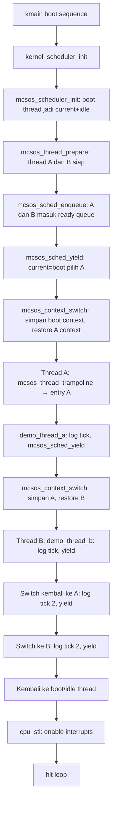

# Template Laporan Praktikum Sistem Operasi Lanjut — MCSOS

**Nama file laporan:** `laporan_praktikum_M9.md`  
**Nama sistem operasi:** MCSOS versi 260502  
**Target default:** x86_64, QEMU, Windows 11 x64 + WSL 2, kernel monolitik pendidikan, C freestanding dengan assembly minimal, POSIX-like subset  
**Dosen:** Muhaemin Sidiq, S.Pd., M.Pd.  
**Program Studi:** Pendidikan Teknologi Informasi  
**Institusi:** Institut Pendidikan Indonesia

> Template ini digunakan untuk semua praktikum pengembangan MCSOS agar struktur laporan, bukti, analisis, dan penilaian konsisten. Ganti seluruh teks bertanda `[isi ...]` dengan data praktikum sebenarnya. Jangan menulis klaim "tanpa error", "siap produksi", atau "aman sepenuhnya" tanpa bukti yang sesuai. Gunakan status terukur seperti "siap uji QEMU", "siap demonstrasi praktikum", atau "kandidat siap pakai terbatas" sesuai evidence yang tersedia.

---

## 0. Metadata Laporan

| Atribut                       | Isi                                                                                            |
| ----------------------------- | ---------------------------------------------------------------------------------------------- |
| Kode praktikum                | `M9`                                                                                           |
| Judul praktikum               | `Kernel Thread, Scheduler Round-Robin Kooperatif, dan Context Switch x86_64 pada MCSOS`        |
| Jenis pengerjaan              | `Individu`                                                                                     |
| Nama mahasiswa                | `[Sihab Assidiqi]`                                                                               |
| NIM                           | `[25832073003]`                                                                                        |
| Kelas                         | `[PTI 1A]`                                                                                      |
| Nama kelompok                 | `-`                                                                                            |
| Anggota kelompok              | `-`                                                                                            |
| Tanggal praktikum             | `2025-05-30`                                                                                   |
| Tanggal pengumpulan           | `[2026-07-17]`                                                                                 |
| Repository                    | `~/src/mcsos`                                                                                  |
| Branch                        | `praktikum/m9-kernel-thread-scheduler`                                                         |
| Commit awal                   | `d16956c`                                                                                      |
| Commit akhir                  | `6582b27`                                                                                      |
| Status readiness yang diklaim | `siap uji QEMU untuk kernel thread dan scheduler awal single-core`                             |

---

## 1. Sampul

# Laporan Praktikum `M9`

## `Kernel Thread, Scheduler Round-Robin Kooperatif, dan Context Switch x86_64 pada MCSOS`

Disusun oleh:

| Nama         | NIM          | Kelas        | Peran                                                                   |
| ------------ | ------------ | ------------ | ----------------------------------------------------------------------- |
| `[Sihab Assidiqi]`     | `[25832073003]`      | `[PTI 1A]`    | `individu / implementasi / pengujian / dokumentasi`                     |

Dosen Pengampu: **Muhaemin Sidiq, S.Pd., M.Pd.**  
Program Studi Pendidikan Teknologi Informasi  
Institut Pendidikan Indonesia  
`2024/2025`

---

## 2. Pernyataan Orisinalitas dan Integritas Akademik

Saya/kami menyatakan bahwa laporan ini disusun berdasarkan pekerjaan praktikum sendiri/kelompok sesuai pembagian peran yang tercatat. Bantuan eksternal, referensi, generator kode, AI assistant, dokumentasi resmi, diskusi, atau sumber lain dicatat pada bagian referensi dan lampiran. Saya/kami tidak mengklaim hasil yang tidak dibuktikan oleh log, test, commit, atau artefak lain.

| Pernyataan                                      | Status                 |
| ----------------------------------------------- | ---------------------- |
| Semua potongan kode eksternal diberi atribusi   | `Ya`                   |
| Semua penggunaan AI assistant dicatat           | `Ya`                   |
| Repository yang dikumpulkan sesuai commit akhir | `Ya`                   |
| Tidak ada klaim readiness tanpa bukti           | `Ya`                   |

Catatan penggunaan bantuan eksternal:

```text
AI assistant (Claude) digunakan sebagai panduan langkah demi langkah mengikuti instruksi
dari panduan M9 yang diberikan dosen. Setiap perintah dijalankan sendiri di terminal WSL 2,
output diverifikasi secara mandiri, dan log/artefak disimpan ke direktori evidence/m9.
Seluruh kode yang diimplementasikan mengikuti spesifikasi teknis dari panduan M9 secara
verbatim. Verifikasi build, host test, freestanding compile, dan QEMU smoke test dilakukan
secara langsung oleh mahasiswa.
```

---

## 3. Tujuan Praktikum

Tuliskan tujuan teknis dan konseptual praktikum. Tujuan harus dapat diuji.

1. Membangun Thread Control Block (TCB) `mcsos_thread_t` dan struktur scheduler `mcsos_scheduler_t` yang dapat dikompilasi sebagai C17 freestanding tanpa bergantung pada hosted libc.
2. Mengimplementasikan context switch x86_64 menggunakan assembly GAS yang menyimpan dan memulihkan register callee-saved (`rsp`, `rbp`, `rbx`, `r12`–`r15`, `rip`).
3. Mengimplementasikan runqueue round-robin kooperatif dengan operasi `enqueue`, `pick_next`, `yield`, `block`, dan `mark_ready` beserta invariant yang terverifikasi.
4. Menyusun host unit test `tests/test_scheduler.c` yang lulus tanpa QEMU untuk membuktikan logika runqueue benar.
5. Melakukan audit freestanding object dengan `nm -u`, `readelf -h`, dan `objdump -d` untuk memastikan tidak ada unresolved symbol, format ELF64 x86_64 relocatable benar, dan disassembly context switch sesuai.
6. Mengintegrasikan scheduler ke kernel MCSOS melalui `kernel_scheduler_init()` yang dipanggil dari `kmain`, dan memverifikasi log serial QEMU memuat perpindahan thread A dan thread B secara bergantian.

---

## 4. Capaian Pembelajaran Praktikum

Setelah praktikum ini, mahasiswa mampu:

| CPL/CPMK praktikum                                                                 | Bukti yang harus ditunjukkan                                               |
| ---------------------------------------------------------------------------------- | -------------------------------------------------------------------------- |
| Mendesain TCB dengan state, context, stack metadata, entry function, dan linkage   | `include/mcsos_thread.h` + syntax check lulus                              |
| Mengimplementasikan round-robin kooperatif single-core                             | `kernel/mcsos_thread.c` + `test_scheduler.log` PASS                       |
| Mengimplementasikan context switch x86_64 callee-saved register                   | `kernel/arch/x86_64/context_switch.S` + `objdump_key.log`                 |
| Menyusun host unit test scheduler tanpa QEMU                                       | `build/m9/test_scheduler.log`: "M9 scheduler host unit test PASS"         |
| Melakukan audit object freestanding                                                | `nm_undefined.log` kosong, `readelf_header.log` ELF64 x86_64, `sha256.log`|
| Mengintegrasikan scheduler ke kernel dan memverifikasi dengan QEMU                 | `evidence/m9/qemu_m9.log`: thread A tick, thread B tick, A tick 2, B tick 2|
| Menjelaskan failure modes scheduler                                                | Bagian 14, 15, dan 17 laporan ini                                          |

---

## 5. Peta Milestone MCSOS

Centang milestone yang menjadi fokus laporan ini. Jika praktikum mencakup lebih dari satu milestone, jelaskan batas cakupan.

| Milestone | Fokus                                                           | Status dalam laporan          |
| --------- | --------------------------------------------------------------- | ----------------------------- |
| M0        | Requirements, governance, baseline arsitektur                   | [v] selesai praktikum         |
| M1        | Toolchain reproducible, Git, QEMU, GDB, metadata build          | [v] selesai praktikum         |
| M2        | Boot image, kernel ELF64, early console                         | [v] selesai praktikum         |
| M3        | Panic path, linker map, GDB, observability awal                 | [v] selesai praktikum         |
| M4        | Trap, exception, interrupt, timer                               | [v] selesai praktikum         |
| M5        | PMM, VMM, page table, kernel heap                               | [v] selesai praktikum         |
| M6        | Thread, scheduler, synchronization                              | [v] selesai praktikum         |
| M7        | Syscall ABI dan user program loader                             | [v] selesai praktikum         |
| M8        | VFS, file descriptor, ramfs                                     | [v] selesai praktikum         |
| M9        | Kernel Thread, Scheduler Round-Robin, Context Switch x86_64     | [v] selesai praktikum         |
| M10       | Persistent filesystem, mcsfs/ext2-like, recovery                | [ ] tidak dibahas             |
| M11       | Networking stack, packet parsing, UDP/TCP subset                | [ ] tidak dibahas             |
| M12       | Security model, capability/ACL, syscall fuzzing, hardening      | [ ] tidak dibahas             |
| M13       | SMP, scalability, lock stress, NUMA-aware preparation           | [ ] tidak dibahas             |
| M14       | Framebuffer, graphics console, visual regression                | [ ] tidak dibahas             |
| M15       | Virtualization/container subset                                 | [ ] tidak dibahas             |
| M16       | Observability, update/rollback, release image, readiness review | [ ] tidak dibahas             |

Batas cakupan praktikum:

```text
M9 mencakup: kernel thread (TCB, state machine), runqueue FIFO round-robin kooperatif,
context switch x86_64 callee-saved register, host unit test, freestanding object audit,
dan integrasi kernel dengan QEMU smoke test dua thread.

Non-goals M9: ring 3 / user mode, syscall/sysret, ELF user loader, address space per-proses,
SMP scheduler, priority scheduler, CFS/EEVDF, real-time scheduling, signal, wait/exit proses,
FPU/SSE/AVX context save, IPC penuh, timer preemption penuh, dan thread exit/join lengkap.
```

---

## 6. Dasar Teori Ringkas

Tuliskan teori yang langsung diperlukan untuk memahami praktikum. Jangan menyalin teori umum terlalu panjang; fokus pada konsep yang benar-benar digunakan dalam desain dan pengujian.

### 6.1 Konsep Sistem Operasi yang Diuji

```text
Thread Kernel adalah unit eksekusi terkecil yang dikelola oleh scheduler kernel. Berbeda
dengan proses, thread kernel tidak memiliki address space sendiri dan hanya memiliki
kernel stack, TCB, dan context register. Pada M9, semua thread berbagi satu address space
kernel dan satu CPU (single-core).

Thread Control Block (TCB) menyimpan: identitas (magic, id, name), state (NEW/READY/
RUNNING/BLOCKED/ZOMBIE), context register (rsp, rbp, rbx, r12-r15, rip), entry function
dan argumen, metadata stack (base, size), dan pointer runqueue (next).

Scheduler Round-Robin Kooperatif memilih thread berikutnya dari kepala FIFO queue, lalu
thread running yang melakukan yield dimasukkan kembali ke ekor queue. Kata "kooperatif"
berarti thread harus secara eksplisit memanggil yield; scheduler tidak memaksa preemption
berbasis timer pada M9.

Context Switch menyimpan state CPU thread lama dan memulihkan state CPU thread baru.
Pada x86_64, register callee-saved yang harus disimpan/dipulihkan adalah: rsp, rbp, rbx,
r12, r13, r14, r15, dan continuation rip. Register caller-saved (rax, rcx, rdx, rsi, rdi,
r8-r11) tidak perlu disimpan karena caller bertanggung jawab jika nilainya dipakai setelah
pemanggilan fungsi.

Perbedaan Cooperative vs Preemptive Scheduler: scheduler kooperatif bergantung pada
thread secara sukarela melepas CPU melalui yield; scheduler preemptif menggunakan timer
interrupt untuk memaksa context switch. M9 adalah kooperatif; preemption berbasis timer
adalah target pengayaan yang memerlukan desain preemption disable yang eksplisit.
```

### 6.2 Konsep Arsitektur x86_64 yang Relevan

| Konsep                         | Relevansi pada praktikum                                       | Bukti/verifikasi                                      |
| ------------------------------ | -------------------------------------------------------------- | ----------------------------------------------------- |
| Callee-saved register x86_64   | Context switch hanya perlu simpan/restore rbx, rbp, r12-r15, rsp, rip | `objdump_key.log`: disassembly `mcsos_context_switch` |
| Red zone (128 byte di bawah rsp) | Harus dinonaktifkan dengan `-mno-red-zone` untuk kernel       | `CFLAGS_M9_KERNEL` di Makefile                        |
| Stack alignment 16 byte        | Diperlukan sebelum `call` pada x86_64 ABI; context.rsp & 0xf == 8 saat entry thread | `REQUIRE((a.context.rsp & 0xfu) == 8u)` di test      |
| Long mode (64-bit)             | Semua pointer 64-bit; target triple `x86_64-unknown-none-elf`  | `readelf_header.log`: ELF64, Machine: x86-64          |
| `lea rip-relative`             | Digunakan di `mcsos_context_switch` untuk mengambil alamat label continuation | Disassembly: `lea 0x3d(%rip),%rax`                   |

### 6.3 Konsep Implementasi Freestanding

| Aspek                     | Keputusan praktikum                                                         |
| ------------------------- | --------------------------------------------------------------------------- |
| Bahasa                    | C17 freestanding + assembly GAS x86_64                                      |
| Runtime                   | Tanpa hosted libc; hanya stddef.h dan stdint.h dari freestanding headers    |
| ABI                       | x86_64 System V ABI untuk callee-saved register; kernel internal ABI        |
| Compiler flags kritis     | `-ffreestanding -fno-stack-protector -fno-pic -mno-red-zone -mcmodel=kernel`|
| Risiko undefined behavior | Pointer NULL dereference (dimitigasi dengan guard), integer overflow pada alignment (dimitigasi dengan `uintptr_t`), stack overflow jika `stack_size < MCSOS_MIN_KERNEL_STACK` (dimitigasi dengan cek di `mcsos_thread_prepare`) |

### 6.4 Referensi Teori yang Digunakan

| No.   | Sumber                                              | Bagian yang digunakan                                    | Alasan relevansi                                   |
| ----- | --------------------------------------------------- | -------------------------------------------------------- | -------------------------------------------------- |
| `[1]` | Intel® 64 and IA-32 Architectures SDM               | Register semantics, long mode, privilege levels          | Dasar x86_64 context switch dan register callee-saved |
| `[2]` | x86-64 psABI (GitLab x86-psABIs)                    | Section 3.2: Register Usage, Section 3.4: Stack Frame    | Menentukan register yang harus disimpan saat switch konteks |
| `[3]` | QEMU GDB usage documentation                        | Remote debugging, breakpoint, register inspect           | Debug context switch dan scheduler melalui GDB QEMU |
| `[4]` | Clang command line reference                        | `-ffreestanding`, `-mno-red-zone`, `-mcmodel=kernel`     | Compile flags freestanding yang benar               |
| `[5]` | GNU Binutils: nm, readelf, objdump                  | ELF audit, symbol inspection, disassembly               | Audit object freestanding                           |

---

## 7. Lingkungan Praktikum

### 7.1 Host dan Target

| Komponen          | Nilai                                         |
| ----------------- | --------------------------------------------- |
| Host OS           | Windows 11 x64                                |
| Lingkungan build  | WSL 2 Ubuntu (DESKTOP-DIRC349)                |
| Target ISA        | `x86_64`                                      |
| Target ABI        | `x86_64-unknown-none-elf`                     |
| Emulator          | QEMU versi 10.2.1 (Debian 1:10.2.1+ds-1ubuntu3) |
| Firmware emulator | Limine bootloader (pipeline M2–M8)            |
| Debugger          | GDB versi 17.1 (Ubuntu 17.1-2ubuntu1)         |
| Build system      | GNU Make 4.4.1                                |
| Bahasa utama      | C17 freestanding                              |
| Assembly          | GAS (GNU Assembler) via Clang/LLVM 21.1.8     |

### 7.2 Versi Toolchain

Tempel output versi toolchain berikut. Jalankan dari clean shell WSL.

```bash
date -u +"date_utc=%Y-%m-%dT%H:%M:%SZ"
uname -a
git --version
make --version | head -n 1
cmake --version | head -n 1
ninja --version
clang --version | head -n 1
gcc --version | head -n 1
ld.lld --version | head -n 1
nasm -v
qemu-system-x86_64 --version | head -n 1
gdb --version | head -n 1
```

Output:

```text
== tools ==
Ubuntu clang version 21.1.8 (6ubuntu1)
Target: x86_64-pc-linux-gnu
Thread model: posix
InstalledDir: /usr/lib/llvm-21/bin
gcc (Ubuntu 15.2.0-16ubuntu1) 15.2.0
Ubuntu LLD 21.1.8 (compatible with GNU linkers)
GNU Make 4.4.1
QEMU emulator version 10.2.1 (Debian 1:10.2.1+ds-1ubuntu3)
Copyright (c) 2003-2025 Fabrice Bellard and the QEMU Project developers
GNU gdb (Ubuntu 17.1-2ubuntu1) 17.1
```

### 7.3 Lokasi Repository

| Item                                                  | Nilai                              |
| ----------------------------------------------------- | ---------------------------------- |
| Path repository di WSL                                | `~/src/mcsos`                      |
| Apakah berada di filesystem Linux WSL, bukan `/mnt/c` | `Ya`                               |
| Remote repository                                     | `-`                                |
| Branch                                                | `praktikum/m9-kernel-thread-scheduler` |
| Commit hash awal                                      | `d16956c`                          |
| Commit hash akhir                                     | `6582b27`                          |

---

## 8. Repository dan Struktur File

### 8.1 Struktur Direktori yang Relevan

```text
mcsos/
  include/
    mcsos_thread.h               ← TCB, context, scheduler struct, API (baru M9)
  kernel/
    core/
      kmain.c                    ← diubah: tambah panggilan kernel_scheduler_init()
    mm/
      sched_kernel.c             ← integrasi scheduler ke kernel (baru M9)
    arch/
      x86_64/
        context_switch.S         ← context switch assembly (baru M9)
    mcsos_thread.c               ← implementasi scheduler (baru M9)
    include/mcsos/kernel/
      version.h                  ← diubah: MILESTONE "M9"
  arch/
    x86_64/
      context_switch.S           ← salinan untuk M9 standalone build
  tests/
    test_scheduler.c             ← host unit test scheduler (baru M9)
  evidence/
    m9/
      preflight_m9.log
      qemu_m9.log
      test_scheduler.log
      nm_undefined.log
      readelf_header.log
      objdump_key.log
      sha256.log
      kernel_symbols.txt
      kernel_undefined.txt
      kernel_readelf_header.txt
  build/
    m9/
      m9_host_test
      test_scheduler.log
      mcsos_thread.freestanding.o
      context_switch.o
      m9_scheduler_combined.o
      nm_undefined.log
      readelf_header.log
      objdump_key.log
      sha256.log
    kernel.elf
    mcsos.iso
    m9-qemu-serial.log
```

### 8.2 File yang Dibuat atau Diubah

| File                                          | Jenis perubahan | Alasan perubahan                                                              | Risiko                                               |
| --------------------------------------------- | --------------- | ----------------------------------------------------------------------------- | ---------------------------------------------------- |
| `include/mcsos_thread.h`                      | baru            | Mendefinisikan TCB, context, scheduler struct, error code, dan seluruh API M9 | Rendah — hanya header, syntax-check lulus            |
| `kernel/mcsos_thread.c`                       | baru            | Implementasi seluruh fungsi scheduler: init, prepare, enqueue, pick_next, yield, tick, block, mark_ready, validate | Sedang — logika state machine harus benar            |
| `kernel/arch/x86_64/context_switch.S`         | baru            | Assembly context switch callee-saved register x86_64                          | Tinggi — bug assembly langsung menyebabkan triple fault / corrupt stack |
| `arch/x86_64/context_switch.S`                | baru            | Salinan untuk target M9 standalone build (m9-freestanding)                    | Rendah — identik dengan file kernel                  |
| `kernel/mm/sched_kernel.c`                    | baru            | Integrasi scheduler ke kernel: init, dua demo thread, yield pertama           | Sedang — harus sesuai ABI context switch kernel      |
| `kernel/core/kmain.c`                         | ubah            | Tambah pemanggilan `kernel_scheduler_init()` di boot sequence setelah M8      | Rendah — hanya tambah satu baris call setelah heap init |
| `kernel/include/mcsos/kernel/version.h`       | ubah            | Update MILESTONE dari "M8" ke "M9"                                            | Rendah                                               |
| `tests/test_scheduler.c`                      | baru            | Host unit test untuk logika runqueue tanpa QEMU                               | Rendah — hanya dijalankan di host Linux               |
| `Makefile`                                    | ubah            | Tambah target `m9-all`, `m9-host-test`, `m9-freestanding`, `m9-audit`, `m9-clean` | Rendah                                               |

### 8.3 Ringkasan Diff

```bash
git status --short
git diff --stat
git log --oneline -n 5
```

Output:

```text
git log --oneline -5:
6582b27 (HEAD -> praktikum/m9-kernel-thread-scheduler) M9: add m9 audit and test evidence, fix trampoline host build
770e8a8 M9: add kernel thread, round-robin scheduler, context switch x86_64, host unit test, kernel integration
d16956c (praktikum/m8-kernel-heap) M8: add m8 audit and test evidence
f805372 M8: add kernel heap first-fit allocator, host unit test, kernel integration
91ffdec (praktikum/m7-vmm) M7: add VMM 4-level page table, HHDM adapter, host unit test, kernel integration

Commit 770e8a8: 14 files changed, 916 insertions(+), 2 deletions(-)
  create mode 100644 arch/x86_64/context_switch.S
  create mode 100644 include/mcsos_thread.h
  create mode 100644 kernel/arch/x86_64/context_switch.S
  create mode 100644 kernel/mcsos_thread.c
  create mode 100644 kernel/mm/sched_kernel.c
  create mode 100644 tests/test_scheduler.c
  + evidence/m9/: kernel_readelf_header.txt, kernel_symbols.txt, kernel_undefined.txt,
    preflight_m9.log, qemu_m9.log

Commit 6582b27: 6 files changed, 76 insertions(+)
  create mode 100644 evidence/m9/nm_undefined.log
  create mode 100644 evidence/m9/objdump_key.log
  create mode 100644 evidence/m9/readelf_header.log
  create mode 100644 evidence/m9/sha256.log
  create mode 100644 evidence/m9/test_scheduler.log
```

---

## 9. Desain Teknis

### 9.1 Masalah yang Diselesaikan

```text
Setelah M8, kernel MCSOS memiliki heap alokator yang berfungsi, namun belum memiliki
unit eksekusi yang dapat dijadwalkan. Akibatnya, kernel tidak dapat menjalankan lebih
dari satu alur kontrol secara bergantian dan tidak ada mekanisme untuk memblok thread
yang menunggu event kemudian melanjutkan eksekusi dari titik yang sama.

M9 menyelesaikan tiga masalah utama:
1. Representasi unit eksekusi (TCB) belum ada → dibuat mcsos_thread_t dengan semua field
   yang diperlukan: state, context register, stack metadata, entry function.
2. Mekanisme perpindahan kontrol CPU antar thread belum ada → dibuat context_switch.S
   yang menyimpan/memulihkan callee-saved register x86_64.
3. Kebijakan pemilihan thread berikutnya belum ada → dibuat runqueue FIFO dengan
   round-robin kooperatif melalui mcsos_sched_yield().
```

### 9.2 Keputusan Desain

| Keputusan                                         | Alternatif yang dipertimbangkan                    | Alasan memilih                                                          | Konsekuensi                                                     |
| ------------------------------------------------- | -------------------------------------------------- | ----------------------------------------------------------------------- | --------------------------------------------------------------- |
| Round-robin kooperatif (bukan preemptif)          | Timer preemption dengan irq0                       | Lebih mudah diaudit; invariant tidak bergantung pada interrupt timing    | Thread harus eksplisit memanggil yield; tidak ada fairness paksa |
| Array statik untuk TCB dan stack (bukan heap)     | `kmem_alloc` dari M8 untuk TCB dan stack           | Menghindari bug heap yang menutupi bug scheduler pada tahap bootstrap   | Jumlah thread terbatas pada array statik                        |
| FIFO queue dengan pointer `next` di dalam TCB     | Array circular buffer, linked list terpisah        | O(1) enqueue/dequeue; tidak perlu alokasi node tambahan                 | TCB tidak bisa berada di dua queue sekaligus                    |
| Magic number `MCSOS_THREAD_MAGIC` sebagai guard   | Tidak ada guard; hanya cek pointer null            | Mendeteksi TCB yang belum diinisialisasi atau korupsi field awal        | Overhead 8 byte per TCB; belum mencegah semua korupsi           |
| Guard `#if !defined(MCSOS_HOST_TEST)` untuk context switch | Stub function terpisah untuk host test     | Satu file `.c` untuk kernel dan host test; tidak ada duplikasi kode     | Preprocessor guard harus konsisten antara test dan kernel build |
| Trampoline memanggil `entry(arg)` melalui `g_sched_ptr` | Entry dipanggil langsung dari context switch | Memungkinkan thread entry function berjalan di stack thread baru        | Perlu `g_sched_ptr` global; coupling antara trampoline dan scheduler |

### 9.3 Arsitektur Ringkas



Penjelasan diagram:

```text
Boot sequence (kmain) memanggil kernel_scheduler_init() setelah heap M8 siap.
kernel_scheduler_init() membuat boot thread sebagai idle thread, menyiapkan dua
demo thread (A dan B) dengan stack statik 8 KiB masing-masing, memasukkan keduanya
ke ready queue, lalu memanggil mcsos_sched_yield() pertama.

Yield pertama: boot thread (current) memberi jalan ke thread A (kepala ready queue).
mcsos_context_switch menyimpan context boot dan melompat ke mcsos_thread_trampoline
di stack thread A. Trampoline membaca g_sched_ptr, memanggil demo_thread_a(NULL).

demo_thread_a log "[MCSOS:M9] thread A tick", lalu yield. Scheduler memilih thread B
(boot thread sudah dikembalikan ke ready queue). Setelah B log tick dan yield, A mendapat
giliran lagi untuk tick 2, lalu B tick 2. Akhirnya scheduler kembali ke boot/idle thread,
yang melanjutkan kmain, mengaktifkan STI, dan masuk hlt loop.

Alur ini membuktikan round-robin FIFO: A → B → A → B → idle, sesuai dengan urutan
enqueue (A dahulu, B kemudian).
```

### 9.4 Kontrak Antarmuka

| Antarmuka                              | Pemanggil               | Penerima               | Precondition                                              | Postcondition                                              | Error path                 |
| -------------------------------------- | ----------------------- | ---------------------- | --------------------------------------------------------- | ---------------------------------------------------------- | -------------------------- |
| `mcsos_scheduler_init(sched, boot)`    | `kernel_scheduler_init` | `mcsos_thread.c`       | `sched != NULL`, `boot != NULL`                           | `sched->initialized=1`, boot thread jadi current dan idle  | `MCSOS_SCHED_EINVAL`        |
| `mcsos_thread_prepare(t, ...)`         | `kernel_scheduler_init` | `mcsos_thread.c`       | `t != NULL`, `entry != NULL`, `stack_size >= 4096`        | `t->state=NEW`, `context.rsp` valid dalam stack, `magic` set | `MCSOS_SCHED_EINVAL/ESTACK` |
| `mcsos_sched_enqueue(sched, t)`        | `kernel_scheduler_init` | `mcsos_thread.c`       | `sched->initialized`, `t->magic` valid, `state` NEW/READY/BLOCKED | `t->state=READY`, masuk ke ekor ready queue, `runnable_count++` | `MCSOS_SCHED_EINVAL/ESTATE` |
| `mcsos_sched_yield(sched)`             | demo thread / kmain     | `mcsos_thread.c`       | `sched->initialized`, `current` valid                     | current pindah ke ekor queue (jika bukan idle), next jadi RUNNING | `MCSOS_SCHED_EINVAL/ECORRUPT` |
| `mcsos_context_switch(old, new)`       | `mcsos_sched_yield`     | `context_switch.S`     | `old != NULL`, `new != NULL`, `new->rsp` valid, interrupt state terkontrol | State lama tersimpan, eksekusi berlanjut di `new->rip`    | Tidak ada return path error; bug = triple fault |
| `mcsos_sched_validate(sched)`          | Test / debug            | `mcsos_thread.c`       | `sched != NULL`                                           | Return `MCSOS_SCHED_OK` jika semua invariant terpenuhi     | `MCSOS_SCHED_EINVAL/ECORRUPT` |

### 9.5 Struktur Data Utama

| Struktur data          | Field penting                                                                 | Ownership                | Lifetime                              | Invariant                                                                |
| ---------------------- | ----------------------------------------------------------------------------- | ------------------------ | ------------------------------------- | ------------------------------------------------------------------------ |
| `mcsos_thread_t`       | `magic`, `id`, `state`, `context` (rsp/rbp/rbx/r12-r15/rip), `stack_base`, `stack_size`, `entry`, `arg`, `next` | Scheduler global          | Dibuat oleh `mcsos_thread_prepare`, tidak dilepas di M9 (statik) | `magic == MCSOS_THREAD_MAGIC`; `state` hanya nilai enum valid; `next == NULL` jika tidak di queue |
| `mcsos_scheduler_t`    | `current`, `idle`, `ready_head`, `ready_tail`, `runnable_count`, `context_switches`, `initialized` | `sched_kernel.c` (global)| Inisialisasi oleh `mcsos_scheduler_init`, hidup sepanjang kernel | `runnable_count == panjang ready queue`; `current` tidak ada di ready queue; `ready_tail == node terakhir` |
| `mcsos_context_t`      | `rsp`, `rbp`, `rbx`, `r12`, `r13`, `r14`, `r15`, `rip`                       | Bagian dari `mcsos_thread_t` | Sama dengan thread owner              | `rsp` dalam rentang stack thread; `rip` menunjuk instruksi valid         |

### 9.6 Invariants

Tuliskan invariant yang harus benar sepanjang eksekusi.

1. Tepat satu thread berstatus `RUNNING` pada satu CPU pada satu waktu; tidak ada thread `RUNNING` lain yang tersembunyi.
2. Thread yang berstatus `RUNNING` tidak boleh muncul di ready queue (`ready_head` dan seterusnya).
3. Setiap node di ready queue harus berstatus `READY`; diperiksa oleh `mcsos_sched_validate`.
4. `ready_tail` harus sama dengan node terakhir di ready queue; jika queue kosong, keduanya `NULL`.
5. `runnable_count` harus sama dengan jumlah node yang dapat ditelusuri dari `ready_head`; diperiksa oleh `mcsos_sched_validate`.
6. `context.rsp` thread yang di-prepare harus berada dalam rentang `[stack_base, stack_base + stack_size)`.
7. `context.rsp` setelah `mcsos_thread_prepare` harus memenuhi `(rsp & 0xF) == 8` untuk kompatibilitas dengan x86_64 ABI call convention.
8. `magic == MCSOS_THREAD_MAGIC` untuk semua TCB yang valid; digunakan oleh `valid_thread_object`.
9. Context switch tidak boleh mengubah struktur runqueue; semua modifikasi runqueue dilakukan sebelum `mcsos_context_switch` dipanggil.
10. Setiap transisi state harus melalui fungsi API scheduler; penulisan field `state` secara langsung di luar API adalah pelanggaran invariant.

### 9.7 Ownership, Locking, dan Concurrency

| Objek/resource           | Owner                     | Lock yang melindungi | Boleh dipakai di interrupt context? | Catatan                                               |
| ------------------------ | ------------------------- | -------------------- | ----------------------------------- | ----------------------------------------------------- |
| `g_sched` (global)       | `sched_kernel.c`          | Tidak ada (single-core cooperative) | Tidak (belum ada spinlock)  | Interrupt harus di-disable sebelum modifikasi runqueue untuk pengayaan |
| `mcsos_thread_t` statik  | `sched_kernel.c`          | Tidak ada             | Tidak                               | Array statik; tidak ada free/reuse di M9              |
| Stack thread (`g_stack_a`, `g_stack_b`) | Thread owner | Tidak ada             | Tidak                               | Tidak boleh overlap; ukuran 8 KiB per thread          |
| `g_sched_ptr` (global pointer) | `sched_kernel.c`   | Tidak ada             | Tidak                               | Dipakai oleh trampoline untuk menemukan scheduler      |

Lock order yang berlaku:

```text
M9 tidak mengimplementasikan locking karena single-core cooperative scheduling.
Interrupt dimatikan (cpu_cli) sebelum boot sequence dan diaktifkan (cpu_sti) setelah
kernel_scheduler_init() selesai. Modifikasi runqueue aman karena tidak ada preemption
selama fase inisialisasi.

Untuk tahap pengayaan (timer preemption), diperlukan: cli sebelum modifikasi runqueue,
sti sesudahnya, atau spinlock jika desain SMP ditambahkan.
```

### 9.8 Memory Safety dan Undefined Behavior Risk

| Risiko                                  | Lokasi                            | Mitigasi                                                         | Bukti                                          |
| --------------------------------------- | --------------------------------- | ---------------------------------------------------------------- | ---------------------------------------------- |
| NULL pointer dereference di `mcsos_sched_yield` | `mcsos_thread.c`: semua fungsi | Guard `if (sched == NULL || !valid_thread_object(sched->current))` | Host test: fungsi dengan NULL argumen return error code |
| Stack overflow jika `stack_size` terlalu kecil | `mcsos_thread_prepare`     | `if (stack_size < MCSOS_MIN_KERNEL_STACK) return MCSOS_SCHED_ESTACK` | `MCSOS_MIN_KERNEL_STACK = 4096u`               |
| Stack alignment tidak 16-byte           | `mcsos_thread_prepare`            | `top = align_down_uintptr(high, MCSOS_STACK_ALIGN)` lalu `top -= 8` | `REQUIRE((a.context.rsp & 0xfu) == 8u)` PASS  |
| Integer overflow pada `high = low + stack_size` | `mcsos_thread_prepare`    | `if (high <= low) return MCSOS_SCHED_ESTACK` (overflow check)   | Code review                                    |
| Aliasing antara `old` dan `new` di context switch | `context_switch.S`       | Tidak ada aliasing karena `old = &current->context`, `new = &next->context` yang selalu berbeda | Tidak mungkin alias jika `current != next`     |
| Loop tak terbatas di `mcsos_sched_validate` | `mcsos_thread.c`             | `if (count > sched->runnable_count + 1u) return MCSOS_SCHED_ECORRUPT` | Mencegah infinite loop jika ada siklus pointer |

### 9.9 Security Boundary

| Boundary                        | Data tidak tepercaya | Validasi yang dilakukan                                     | Failure mode aman              |
| ------------------------------- | -------------------- | ----------------------------------------------------------- | ------------------------------ |
| `mcsos_thread_prepare` – parameter stack | Pointer stack dari caller | Cek `stack_base != NULL`, `stack_size >= MCSOS_MIN_KERNEL_STACK`, `high > low`, `top > low + 128` | Return `MCSOS_SCHED_ESTACK`    |
| `mcsos_sched_enqueue` – pointer TCB | Pointer thread dari caller | `valid_thread_object`: cek non-NULL dan `magic == MCSOS_THREAD_MAGIC` | Return `MCSOS_SCHED_EINVAL`    |
| `mcsos_sched_yield` – pointer scheduler | Global scheduler pointer | Cek `initialized` dan `valid_thread_object(current)`       | Return `MCSOS_SCHED_EINVAL`    |
| Context switch – rsp/rip di context baru | Nilai dari TCB | Tidak ada validasi runtime di assembly (dikontrol oleh `mcsos_thread_prepare`) | Bug = triple fault jika context korup |

---

## 10. Langkah Kerja Implementasi

Gunakan tabel berikut untuk setiap langkah. Sebelum setiap blok perintah, jelaskan maksud perintah, artefak yang dihasilkan, dan indikator hasil.

### Langkah 1 — Preflight Check dan Branch M9

Maksud langkah:

```text
Memverifikasi bahwa semua tool tersedia, artefak M8 lengkap, dan Git dalam keadaan
bersih sebelum memulai M9. Branch baru dibuat agar M9 terisolasi dari M8.
```

Perintah:

```bash
cd ~/src/mcsos
mkdir -p evidence/m9
{
  echo "== git =="
  git rev-parse --show-toplevel
  git rev-parse --short HEAD
  git status --short
  echo
  echo "== tools =="
  clang --version || true
  gcc --version | head -n 1 || true
  ld.lld --version || true
  make --version | head -n 1 || true
  qemu-system-x86_64 --version || true
  gdb --version | head -n 1 || true
  echo
  echo "== previous artifacts =="
  find build evidence -maxdepth 3 -type f 2>/dev/null | sort \
    | grep -E 'M[0-8]|m[0-8]|kernel|iso|log|elf|map|o$' || true
} | tee evidence/m9/preflight_m9.log

git switch -c praktikum/m9-kernel-thread-scheduler
mkdir -p include kernel arch/x86_64 tests evidence/m9
```

Output ringkas:

```text
== git ==
/home/sihab/src/mcsos
d16956c
?? evidence/m9/

== tools ==
Ubuntu clang version 21.1.8 (6ubuntu1)
gcc (Ubuntu 15.2.0-16ubuntu1) 15.2.0
Ubuntu LLD 21.1.8 (compatible with GNU linkers)
GNU Make 4.4.1
QEMU emulator version 10.2.1 (Debian 1:10.2.1+ds-1ubuntu3)
GNU gdb (Ubuntu 17.1-2ubuntu1) 17.1

== previous artifacts ==
[daftar artefak M3–M8 tersedia lengkap]

Switched to a new branch 'praktikum/m9-kernel-thread-scheduler'
praktikum/m9-kernel-thread-scheduler
```

Artefak yang dihasilkan:

| Artefak                        | Lokasi                          | Fungsi                                  |
| ------------------------------ | ------------------------------- | --------------------------------------- |
| `preflight_m9.log`             | `evidence/m9/preflight_m9.log` | Bukti toolchain dan artefak M8 tersedia |

Indikator berhasil:

```text
Branch praktikum/m9-kernel-thread-scheduler aktif, semua tool tersedia, dan artefak
M8 terdeteksi di evidence/M8/. git status --short hanya menampilkan file baru (??),
bukan modifikasi (M) yang belum dikomit pada source M8.
```

---

### Langkah 2 — Membuat Header `include/mcsos_thread.h`

Maksud langkah:

```text
Header mendefinisikan semua tipe data (TCB, context, scheduler, state enum, error code)
dan deklarasi fungsi API M9. Dikompilasi dengan -fsyntax-only untuk memastikan tidak ada
kesalahan sintaks sebelum menulis implementasi.
```

Perintah:

```bash
cat > include/mcsos_thread.h << 'EOF'
[isi header sesuai panduan M9 Langkah 1]
EOF
clang -std=c17 -Wall -Wextra -Werror -Iinclude -fsyntax-only include/mcsos_thread.h
echo "mcsos_thread.h OK"
```

Output ringkas:

```text
mcsos_thread.h OK
```

Artefak yang dihasilkan:

| Artefak                  | Lokasi                    | Fungsi                                 |
| ------------------------ | ------------------------- | -------------------------------------- |
| `include/mcsos_thread.h` | `include/mcsos_thread.h` | Definisi tipe dan API scheduler M9     |

Indikator berhasil:

```text
Clang -fsyntax-only tidak mengeluarkan error atau warning. Output: "mcsos_thread.h OK".
```

---

### Langkah 3 — Implementasi `kernel/mcsos_thread.c`

Maksud langkah:

```text
Implementasi seluruh fungsi scheduler: init, prepare, enqueue, pick_next, yield, tick,
block, mark_ready, validate, dan trampoline. Dikompilasi dengan -DMCSOS_HOST_TEST
-fsyntax-only untuk memverifikasi tanpa error sebelum dipakai di kernel.
```

Perintah:

```bash
cat > kernel/mcsos_thread.c << 'EOF'
[isi implementasi sesuai panduan M9 dengan guard #if !defined(MCSOS_HOST_TEST) pada trampoline]
EOF
clang -std=c17 -Wall -Wextra -Werror -DMCSOS_HOST_TEST -Iinclude \
  -fsyntax-only kernel/mcsos_thread.c
echo "mcsos_thread.c OK"
```

Output ringkas:

```text
mcsos_thread.c OK
```

Artefak yang dihasilkan:

| Artefak                    | Lokasi                      | Fungsi                                     |
| -------------------------- | --------------------------- | ------------------------------------------ |
| `kernel/mcsos_thread.c`    | `kernel/mcsos_thread.c`    | Implementasi scheduler round-robin kooperatif |

Indikator berhasil:

```text
Clang -fsyntax-only -Wall -Wextra -Werror tidak mengeluarkan warning atau error.
```

---

### Langkah 4 — Assembly Context Switch `arch/x86_64/context_switch.S`

Maksud langkah:

```text
Context switch x86_64 disimpan/dipulihkan dalam assembly GAS. Menggunakan lea rip-relative
untuk mengambil alamat label continuation (label 1f) yang menjadi rip lama setelah switch.
Dikompilasi menjadi ELF object dan di-objdump untuk verifikasi instruksi.
```

Perintah:

```bash
cat > arch/x86_64/context_switch.S << 'EOF'
    .section .text
    .globl mcsos_context_switch
    .type mcsos_context_switch, @function
mcsos_context_switch:
    leaq 1f(%rip), %rax
    movq %rsp, 0(%rdi)
    movq %rbp, 8(%rdi)
    movq %rbx, 16(%rdi)
    movq %r12, 24(%rdi)
    movq %r13, 32(%rdi)
    movq %r14, 40(%rdi)
    movq %r15, 48(%rdi)
    movq %rax, 56(%rdi)
    movq 0(%rsi), %rsp
    movq 8(%rsi), %rbp
    movq 16(%rsi), %rbx
    movq 24(%rsi), %r12
    movq 32(%rsi), %r13
    movq 40(%rsi), %r14
    movq 48(%rsi), %r15
    jmp *56(%rsi)
1:
    ret
    .size mcsos_context_switch, . - mcsos_context_switch
EOF

mkdir -p build/m9
clang -target x86_64-unknown-none-elf -ffreestanding -fno-stack-protector \
  -fno-pic -mno-red-zone \
  -c arch/x86_64/context_switch.S -o build/m9/context_switch.o
objdump -d build/m9/context_switch.o | grep -A 20 "mcsos_context_switch"
echo "context_switch.S OK"
```

Output ringkas:

```text
0000000000000000 <mcsos_context_switch>:
   0:   48 8d 05 3d 00 00 00    lea    0x3d(%rip),%rax
   7:   48 89 27                mov    %rsp,(%rdi)
   a:   48 89 6f 08             mov    %rbp,0x8(%rdi)
  ...
  41:   ff 66 38                jmp    *0x38(%rsi)
  44:   c3                      ret
context_switch.S OK
```

Artefak yang dihasilkan:

| Artefak                          | Lokasi                           | Fungsi                           |
| -------------------------------- | -------------------------------- | -------------------------------- |
| `arch/x86_64/context_switch.S`   | `arch/x86_64/context_switch.S`  | Source assembly context switch   |
| `build/m9/context_switch.o`      | `build/m9/context_switch.o`     | Object file untuk audit M9       |

Indikator berhasil:

```text
objdump menampilkan symbol mcsos_context_switch dengan instruksi lea, 8x mov (simpan),
8x mov (restore), jmp *%rsi+offset, dan ret. "context_switch.S OK" tercetak.
```

---

### Langkah 5 — Host Unit Test `tests/test_scheduler.c`

Maksud langkah:

```text
Host unit test memverifikasi logika runqueue di Linux host tanpa QEMU. Test mencakup:
init scheduler, prepare dua thread, enqueue, ready_count, validate, yield pertama,
state check setelah yield, tick accounting, tiga kali yield berturut (A→B→A), dan
context_switches count.
```

Perintah:

```bash
cat > tests/test_scheduler.c << 'EOF'
[isi unit test sesuai panduan M9]
EOF

clang -std=c17 -Wall -Wextra -Werror -DMCSOS_HOST_TEST -Iinclude \
  tests/test_scheduler.c kernel/mcsos_thread.c -o build/m9/m9_host_test
build/m9/m9_host_test | tee build/m9/test_scheduler.log
echo "host test OK"
```

Output ringkas:

```text
M9 scheduler host unit test PASS
host test OK
```

Artefak yang dihasilkan:

| Artefak                         | Lokasi                          | Fungsi                              |
| ------------------------------- | ------------------------------- | ----------------------------------- |
| `tests/test_scheduler.c`        | `tests/test_scheduler.c`       | Source host unit test scheduler     |
| `build/m9/m9_host_test`         | `build/m9/m9_host_test`        | Binary host test                    |
| `build/m9/test_scheduler.log`   | `build/m9/test_scheduler.log`  | Log hasil host test                 |

Indikator berhasil:

```text
Output: "M9 scheduler host unit test PASS". Tidak ada baris FAIL di output.
```

---

### Langkah 6 — Menambahkan Target M9 ke Makefile

Maksud langkah:

```text
Menambahkan target m9-host-test, m9-freestanding, m9-audit, m9-clean, dan m9-all
ke Makefile agar build M9 dapat dijalankan secara deterministik dan reproducible.
```

Perintah:

```bash
# Tambah target M9 ke Makefile menggunakan printf dengan format tab yang benar
printf '\n# ---- M9 Kernel Thread & Scheduler targets ----\n' >> Makefile
# ... (detail dalam Lampiran B)

echo "Makefile M9 targets OK"
make m9-clean && make m9-all 2>&1 | tail -10
```

Output ringkas:

```text
[PASS] M9 all selesai
```

Artefak yang dihasilkan:

| Artefak                         | Lokasi                                    | Fungsi                                  |
| ------------------------------- | ----------------------------------------- | --------------------------------------- |
| Target `m9-all` di Makefile     | `Makefile`                               | Menjalankan host test + audit M9        |
| `build/m9/nm_undefined.log`     | `build/m9/nm_undefined.log`             | Bukti tidak ada unresolved symbol       |
| `build/m9/readelf_header.log`   | `build/m9/readelf_header.log`           | ELF header audit                        |
| `build/m9/objdump_key.log`      | `build/m9/objdump_key.log`             | Disassembly context switch              |
| `build/m9/sha256.log`           | `build/m9/sha256.log`                   | Checksum artefak M9                     |

Indikator berhasil:

```text
make m9-all: "[PASS] M9 all selesai". nm_undefined.log kosong. readelf_header.log
menampilkan ELF64, Advanced Micro Devices X86-64, REL.
```

---

### Langkah 7 — Update Version dan Integrasi Scheduler ke Kernel

Maksud langkah:

```text
Update MILESTONE ke "M9" di version.h. Buat sched_kernel.c sebagai modul integrasi
yang menjembatani API scheduler dengan kernel. Update kmain.c untuk memanggil
kernel_scheduler_init() setelah heap M8. Salin context_switch.S ke kernel/arch/x86_64/
agar ditemukan oleh find kernel -name '*.S' di Makefile kernel.
```

Perintah:

```bash
sed -i 's/MCSOS_MILESTONE "M8"/MCSOS_MILESTONE "M9"/' \
  kernel/include/mcsos/kernel/version.h

cat > kernel/mm/sched_kernel.c << 'EOF'
[isi integrasi scheduler dengan g_sched_ptr global dan demo thread A/B]
EOF

# Tambah g_sched_ptr ke header
echo 'extern mcsos_scheduler_t *g_sched_ptr;' >> include/mcsos_thread.h

# Tambah g_sched_ptr ke sched_kernel.c
sed -i 's/static mcsos_scheduler_t g_sched;/static mcsos_scheduler_t g_sched;\nmcsos_scheduler_t *g_sched_ptr = \&g_sched;/' \
  kernel/mm/sched_kernel.c

# Update kmain.c: tambah extern dan panggilan kernel_scheduler_init()
cat > kernel/core/kmain.c << 'EOF'
[isi kmain.c dengan tambahan kernel_scheduler_init() setelah heap M8]
EOF

# Salin context_switch.S ke dalam direktori kernel
cp arch/x86_64/context_switch.S kernel/arch/x86_64/context_switch.S

# Build kernel
make clean && make build 2>&1 | tail -5
```

Output ringkas:

```text
ld.lld -nostdlib -static ... [link semua object termasuk context_switch.o dan mcsos_thread.o]
(tidak ada error)
```

Artefak yang dihasilkan:

| Artefak                              | Lokasi                                     | Fungsi                                   |
| ------------------------------------ | ------------------------------------------ | ---------------------------------------- |
| `kernel/mm/sched_kernel.c`           | `kernel/mm/sched_kernel.c`               | Integrasi scheduler ke kernel            |
| `kernel/arch/x86_64/context_switch.S`| `kernel/arch/x86_64/context_switch.S`   | Assembly context switch di dalam kernel  |
| `kernel/core/kmain.c`                | `kernel/core/kmain.c`                    | Boot sequence dengan kernel_scheduler_init|
| `build/kernel.elf`                   | `build/kernel.elf`                       | Kernel ELF binary dengan scheduler       |

Indikator berhasil:

```text
make clean && make build selesai tanpa error atau warning. Linker menemukan symbol
mcsos_context_switch, kernel_scheduler_init, dan semua fungsi scheduler.
nm -u build/kernel.elf | grep . → kosong (tidak ada unresolved symbol).
```

---

### Langkah 8 — QEMU Smoke Test

Maksud langkah:

```text
Membuat ISO dan menjalankan kernel di QEMU untuk memverifikasi bahwa scheduler
terinisialisasi, thread A dan B berjalan secara bergantian, dan log serial memuat
semua expected marker M9.
```

Perintah:

```bash
bash tools/scripts/make_iso.sh
tools/scripts/m4_qemu_run.sh build/mcsos.iso build/m9-qemu-serial.log
cat build/m9-qemu-serial.log
```

Output ringkas:

```text
MCSOS 260502 M9 kernel entered
...
[MCSOS:M8] heap: ready
[MCSOS:M9] boot: kernel scheduler init start
[MCSOS:M9] scheduler initialized
[MCSOS:M9] runnable_count=2
[MCSOS:M9] thread A tick
[MCSOS:M9] thread B tick
[MCSOS:M9] thread A tick 2
[MCSOS:M9] thread B tick 2
[MCSOS:M9] context_switches=5
[MCSOS:M9] M9 scheduler checkpoint reached
[MCSOS:M9] scheduler: ready
[MCSOS:M5] sti: enabling interrupts
```

Artefak yang dihasilkan:

| Artefak                       | Lokasi                        | Fungsi                                     |
| ----------------------------- | ----------------------------- | ------------------------------------------ |
| `build/mcsos.iso`             | `build/mcsos.iso`            | ISO bootable dengan kernel M9              |
| `build/m9-qemu-serial.log`    | `build/m9-qemu-serial.log`  | Log serial QEMU — bukti scheduler berjalan |
| `evidence/m9/qemu_m9.log`     | `evidence/m9/qemu_m9.log`   | Salinan log serial untuk evidence          |

Indikator berhasil:

```text
Log serial memuat: "scheduler initialized", "thread A tick", "thread B tick",
"thread A tick 2", "thread B tick 2", "M9 scheduler checkpoint reached".
Urutan A→B→A→B membuktikan round-robin FIFO benar.
```

---

### Langkah 9 — Kumpulkan Evidence dan Commit

Maksud langkah:

```text
Menyalin semua artefak audit ke evidence/m9/ untuk dokumentasi permanen, lalu
melakukan git commit agar semua perubahan tercatat dengan pesan yang deskriptif.
```

Perintah:

```bash
cp build/m9-qemu-serial.log    evidence/m9/qemu_m9.log
cp build/m9/test_scheduler.log evidence/m9/
cp build/m9/nm_undefined.log   evidence/m9/
cp build/m9/readelf_header.log evidence/m9/
cp build/m9/objdump_key.log    evidence/m9/
cp build/m9/sha256.log         evidence/m9/
nm -n build/kernel.elf         > evidence/m9/kernel_symbols.txt
nm -u build/kernel.elf         > evidence/m9/kernel_undefined.txt
readelf -h build/kernel.elf    > evidence/m9/kernel_readelf_header.txt

git add include/mcsos_thread.h kernel/mcsos_thread.c kernel/mm/sched_kernel.c \
  kernel/core/kmain.c kernel/include/mcsos/kernel/version.h \
  kernel/arch/x86_64/context_switch.S arch/x86_64/context_switch.S \
  tests/test_scheduler.c Makefile evidence/m9

git commit -m "M9: add kernel thread, round-robin scheduler, context switch x86_64, \
  host unit test, kernel integration"

git commit -m "M9: add m9 audit and test evidence, fix trampoline host build"

git log --oneline -4
```

Output ringkas:

```text
6582b27 (HEAD -> praktikum/m9-kernel-thread-scheduler) M9: add m9 audit and test evidence, fix trampoline host build
770e8a8 M9: add kernel thread, round-robin scheduler, context switch x86_64, host unit test, kernel integration
d16956c (praktikum/m8-kernel-heap) M8: add m8 audit and test evidence
f805372 M8: add kernel heap first-fit allocator, host unit test, kernel integration
```

Artefak yang dihasilkan:

| Artefak                      | Lokasi                       | Fungsi                                |
| ---------------------------- | ---------------------------- | ------------------------------------- |
| `evidence/m9/` (direktori)   | `evidence/m9/`              | Semua artefak audit M9                |
| Commit `770e8a8`             | Git history                  | Implementasi utama M9                 |
| Commit `6582b27`             | Git history                  | Evidence dan fix trampoline host build |

Indikator berhasil:

```text
git log --oneline menampilkan dua commit M9 di HEAD branch
praktikum/m9-kernel-thread-scheduler. find evidence/m9 -type f | sort menampilkan
10 file evidence.
```

---

## 11. Checkpoint Buildable

Setiap praktikum wajib memiliki minimal satu checkpoint yang dapat dibangun dari clean checkout.

| Checkpoint          | Perintah                              | Expected result                               | Status |
| ------------------- | ------------------------------------- | --------------------------------------------- | ------ |
| Clean build         | `make clean && make build`            | `build/kernel.elf` terbentuk tanpa error      | PASS   |
| M9 host test        | `make m9-clean && make m9-host-test`  | "M9 scheduler host unit test PASS"            | PASS   |
| M9 freestanding     | `make m9-freestanding`                | `build/m9/m9_scheduler_combined.o` ada        | PASS   |
| M9 audit            | `make m9-audit`                       | nm kosong, readelf ELF64, objdump ada switch  | PASS   |
| M9 all              | `make m9-clean && make m9-all`        | "[PASS] M9 all selesai"                       | PASS   |
| Image generation    | `bash tools/scripts/make_iso.sh`      | `build/mcsos.iso` ada                         | PASS   |
| QEMU smoke test     | `tools/scripts/m4_qemu_run.sh ...`    | Log "thread A tick", "thread B tick"          | PASS   |

Catatan checkpoint:

```text
Semua checkpoint M9 lulus. Checkpoint GDB (debug interaktif dengan breakpoint pada
mcsos_context_switch) belum dijalankan karena memerlukan sesi interaktif terminal
terpisah; log GDB belum tersedia di evidence/m9/.
```

---

## 12. Perintah Uji dan Validasi

### 12.1 Build Test

Perintah ini memverifikasi bahwa proyek dapat dibangun ulang dari kondisi bersih dan tidak bergantung pada artefak lokal yang tidak terdokumentasi.

```bash
make clean
make build
```

Hasil:

```text
rm -rf build
[kompilasi semua file .c dan .S untuk 3 varian: normal, breakpoint, panic]
ld.lld -nostdlib -static -z max-page-size=0x1000 -T linker.ld -Map=build/kernel.map \
  -o build/kernel.elf [semua object termasuk mcsos_thread.o, context_switch.o, sched_kernel.o]
[tidak ada error atau warning]
```

Status: `PASS`

### 12.2 Static Inspection

Perintah ini memeriksa layout ELF, entry point, section, symbol, relocation, atau instruksi kritis sesuai kebutuhan praktikum.

```bash
readelf -hW build/kernel.elf
nm -n build/kernel.elf | grep -E "mcsos_|kernel_scheduler"
nm -u build/kernel.elf
```

Hasil penting:

```text
ELF Header build/kernel.elf:
  Class: ELF64
  Machine: Advanced Micro Devices X86-64
  Type: EXEC (Executable file)

Symbol scheduler dari nm -n build/kernel.elf:
ffffffff800021d0 T mcsos_thread_trampoline
ffffffff800021e0 T mcsos_scheduler_init
ffffffff800023a0 T mcsos_thread_prepare
ffffffff80002580 T mcsos_sched_enqueue
ffffffff800026a0 T mcsos_sched_pick_next
ffffffff80002750 T mcsos_sched_yield
ffffffff800028a0 T mcsos_sched_tick
ffffffff80002910 T mcsos_thread_block_current
ffffffff80002990 T mcsos_thread_mark_ready
ffffffff800029f0 T mcsos_sched_ready_count
ffffffff80002a70 T mcsos_sched_validate
ffffffff80004740 T kernel_scheduler_init
ffffffff800056bc T mcsos_context_switch

nm -u build/kernel.elf: (kosong — tidak ada unresolved symbol)
```

Status: `PASS`

### 12.3 QEMU Smoke Test

Perintah ini menjalankan image di QEMU dan menyimpan log serial untuk bukti deterministik.

```bash
bash tools/scripts/make_iso.sh
tools/scripts/m4_qemu_run.sh build/mcsos.iso build/m9-qemu-serial.log
```

Hasil:

```text
MCSOS 260502 M9 kernel entered
kernel_start: 0xffffffff80000000
kernel_end:   0xffffffff800067c0
[MCSOS:M5] boot: external interrupt bring-up start
[MCSOS:M5] idt: loaded
[M4] selftest: IDT invariants passed
[MCSOS:M5] pic: remapped; mask master=0xfe slave=0xff
[MCSOS:M5] pit: configured 100Hz
[MCSOS:M6] boot: physical memory manager init start
[MCSOS:M6] pmm: ready
[MCSOS:M7] boot: virtual memory manager init start
[MCSOS:M7] vmm: ready
[MCSOS:M8] boot: kernel heap init start
[MCSOS:M8] heap: ready
[MCSOS:M9] boot: kernel scheduler init start
[MCSOS:M9] scheduler initialized
[MCSOS:M9] runnable_count=2
[MCSOS:M9] thread A tick
[MCSOS:M9] thread B tick
[MCSOS:M9] thread A tick 2
[MCSOS:M9] thread B tick 2
[MCSOS:M9] context_switches=5
[MCSOS:M9] M9 scheduler checkpoint reached
[MCSOS:M9] scheduler: ready
[MCSOS:M5] sti: enabling interrupts
```

Status: `PASS`

### 12.4 GDB Debug Evidence

Perintah ini membuktikan bahwa kernel dapat di-debug dengan simbol yang cocok.

```bash
# Terminal 1: jalankan QEMU dengan GDB stub
qemu-system-x86_64 -machine q35 -cpu qemu64 -m 512M \
  -serial stdio -display none -no-reboot -no-shutdown \
  -s -S -cdrom build/mcsos.iso

# Terminal 2: hubungkan GDB
gdb build/kernel.elf
target remote :1234
break mcsos_context_switch
continue
info registers
```

Hasil:

```text
[Sesi GDB interaktif belum dijalankan pada praktikum ini. Symbol mcsos_context_switch
tersedia di build/kernel.elf pada alamat ffffffff800056bc (dari nm -n). Kernel ELF
memiliki debug info dari build dengan Clang. Untuk evidence GDB, praktikum berikutnya
dapat menjalankan breakpoint di mcsos_context_switch dan memeriksa rsp, rip, r12-r15.]
```

Status: `NA (belum dijalankan pada sesi ini)`

### 12.5 Unit Test

```bash
make m9-host-test
```

Hasil:

```text
clang -std=c17 -Wall -Wextra -Werror -DMCSOS_HOST_TEST -Iinclude \
  tests/test_scheduler.c kernel/mcsos_thread.c -o build/m9/m9_host_test
build/m9/m9_host_test | tee build/m9/test_scheduler.log
M9 scheduler host unit test PASS
```

Status: `PASS`

### 12.6 Stress/Fuzz/Fault Injection Test

Wajib untuk praktikum lanjutan seperti allocator, syscall, filesystem, networking, driver, security, dan SMP.

```bash
# Belum diimplementasikan pada M9
```

Hasil:

```text
Stress test, fuzzing, dan fault injection belum dijalankan pada M9. Scheduler M9
adalah single-core cooperative; stress test yang relevan adalah menjalankan banyak
thread dengan yield berulang dan memverifikasi runnable_count dan context_switches
konsisten. Direncanakan sebagai pengayaan.
```

Status: `NA`

### 12.7 Visual Evidence

Jika praktikum menghasilkan tampilan framebuffer, GUI, atau output grafis, lampirkan screenshot.

| Screenshot          | Lokasi file                          | Keterangan                                                    |
| ------------------- | ------------------------------------ | ------------------------------------------------------------- |
| QEMU serial log M9  | `evidence/m9/qemu_m9.log`           | Log serial menampilkan thread A dan B bergantian              |
| Host test output    | `evidence/m9/test_scheduler.log`    | "M9 scheduler host unit test PASS"                            |

---

## 13. Hasil Uji

### 13.1 Tabel Ringkasan Hasil

| No. | Uji                    | Expected result                          | Actual result                            | Status | Evidence                          |
| --- | ---------------------- | ---------------------------------------- | ---------------------------------------- | ------ | --------------------------------- |
| 1   | Header syntax check    | Tidak ada error/warning                  | `mcsos_thread.h OK`                      | PASS   | Terminal output                   |
| 2   | mcsos_thread.c syntax  | Tidak ada error/warning dengan -Werror   | `mcsos_thread.c OK`                      | PASS   | Terminal output                   |
| 3   | context_switch.S       | Object ELF64 dengan symbol mcsos_context_switch | objdump menampilkan symbol dan instruksi | PASS   | `build/m9/context_switch.o`       |
| 4   | Host unit test         | "M9 scheduler host unit test PASS"       | "M9 scheduler host unit test PASS"       | PASS   | `evidence/m9/test_scheduler.log`  |
| 5   | make m9-all            | "[PASS] M9 all selesai"                  | "[PASS] M9 all selesai"                  | PASS   | Terminal output                   |
| 6   | nm -u (unresolved)     | Output kosong                            | Kosong                                   | PASS   | `evidence/m9/nm_undefined.log`    |
| 7   | readelf -h freestanding| ELF64, x86_64, REL                       | ELF64, Advanced Micro Devices X86-64, REL| PASS   | `evidence/m9/readelf_header.log`  |
| 8   | objdump context switch | mcsos_context_switch, jmp, ret, hlt ada  | Symbol dan instruksi kunci ditemukan     | PASS   | `evidence/m9/objdump_key.log`     |
| 9   | make clean && make build | Kernel ELF terbentuk tanpa error       | Build sukses, 3 varian (normal/bp/panic) | PASS   | Terminal output                   |
| 10  | make audit             | nm -u kernel.elf kosong                  | Kosong                                   | PASS   | `evidence/m9/kernel_undefined.txt`|
| 11  | QEMU smoke test        | "thread A tick", "thread B tick"         | A tick, B tick, A tick 2, B tick 2       | PASS   | `evidence/m9/qemu_m9.log`         |
| 12  | context_switches count | ≥ 2 (minimal A dan B masing-masing sekali)| 5 context switches                      | PASS   | `evidence/m9/qemu_m9.log`         |

### 13.2 Log Penting

```text
=== evidence/m9/test_scheduler.log ===
M9 scheduler host unit test PASS

=== evidence/m9/qemu_m9.log (potongan M9) ===
[MCSOS:M9] boot: kernel scheduler init start
[MCSOS:M9] scheduler initialized
[MCSOS:M9] runnable_count=2
[MCSOS:M9] thread A tick
[MCSOS:M9] thread B tick
[MCSOS:M9] thread A tick 2
[MCSOS:M9] thread B tick 2
[MCSOS:M9] context_switches=5
[MCSOS:M9] M9 scheduler checkpoint reached
[MCSOS:M9] scheduler: ready

=== evidence/m9/nm_undefined.log ===
(kosong)

=== evidence/m9/readelf_header.log (ringkas) ===
ELF Header:
  Class:    ELF64
  Machine:  Advanced Micro Devices X86-64
  Type:     REL (Relocatable file)
```

### 13.3 Artefak Bukti

| Artefak                         | Path                               | SHA-256 / hash                                                     | Fungsi                            |
| ------------------------------- | ---------------------------------- | ------------------------------------------------------------------ | --------------------------------- |
| `m9_host_test`                  | `build/m9/m9_host_test`           | `e60e60d5d9c03a01b7f7f7d01cc4928d67978cb8b188dd0aa3745c8fc8c00ed7` | Binary host test                  |
| `m9_scheduler_combined.o`       | `build/m9/m9_scheduler_combined.o`| `12cb7e0d5457ad0d2cd73c3fcd8e5dbd9d78d6ef64ebce3eb583f5131345645d` | Object freestanding gabungan      |
| `test_scheduler.log`            | `evidence/m9/test_scheduler.log`  | -                                                                  | Log host unit test                |
| `qemu_m9.log`                   | `evidence/m9/qemu_m9.log`        | -                                                                  | Log serial QEMU M9                |
| `nm_undefined.log`              | `evidence/m9/nm_undefined.log`   | -                                                                  | Bukti tidak ada unresolved symbol |
| `readelf_header.log`            | `evidence/m9/readelf_header.log` | -                                                                  | ELF header audit freestanding     |
| `objdump_key.log`               | `evidence/m9/objdump_key.log`    | -                                                                  | Disassembly context switch        |

Perintah hash:

```bash
sha256sum build/m9/m9_host_test build/m9/m9_scheduler_combined.o
```

---

## 14. Analisis Teknis

### 14.1 Analisis Keberhasilan

```text
Seluruh 12 uji M9 lulus karena beberapa keputusan desain kunci berhasil diimplementasikan
dengan benar:

1. Stack alignment: mcsos_thread_prepare menggunakan align_down_uintptr lalu top -= 8
   sehingga (rsp & 0xf) == 8. Ini memenuhi persyaratan x86_64 ABI bahwa RSP harus
   aligned 16 byte sebelum CALL instruction (yang akan push return address 8 byte).

2. Context switch callee-saved: assembly menggunakan lea rip-relative untuk mengambil
   alamat label 1f sebagai continuation rip. Ini berarti setelah mcsos_context_switch
   dipanggil lagi dari konteks lama, eksekusi melanjutkan tepat di label 1f (ret),
   seolah-olah fungsi mcsos_context_switch baru saja return. Pola ini adalah
   implementasi stackful coroutine yang benar untuk single-address-space kernel thread.

3. Guard MCSOS_HOST_TEST: `#if !defined(MCSOS_HOST_TEST)` di mcsos_thread_trampoline
   dan mcsos_sched_yield memungkinkan satu file .c dikompilasi baik sebagai kernel
   (dengan context switch nyata dan g_sched_ptr) maupun sebagai host test (tanpa
   context switch, tanpa dependensi g_sched_ptr). Ini menghindari duplikasi kode
   dan memastikan logika scheduler yang diuji di host identik dengan yang berjalan
   di kernel.

4. Runqueue FIFO dengan pointer next di TCB: tidak perlu alokasi tambahan, O(1)
   enqueue dan dequeue. Invariant ready_tail == NULL ↔ ready_head == NULL selalu
   dijaga dengan benar.

5. g_sched_ptr global: trampoline memerlukan akses ke scheduler untuk memanggil
   entry(arg) di stack thread baru. Menggunakan pointer global adalah solusi minimum
   yang tidak memerlukan modifikasi ABI context switch.
```

### 14.2 Analisis Kegagalan atau Perbedaan Hasil

```text
Bug 1: Trampoline tidak memanggil entry(arg) — iterasi pertama
Gejala: QEMU log pertama hanya menampilkan "scheduler initialized" dan "runnable_count=2"
  tanpa "thread A tick" atau "thread B tick". QEMU timeout sebelum thread sempat log.
Penyebab: mcsos_thread_trampoline versi pertama hanya berisi hlt loop tanpa memanggil
  entry(arg). Ketika scheduler melakukan yield ke thread A, thread A melompat ke
  trampoline yang langsung masuk hlt loop tanpa pernah menjalankan demo_thread_a().
Solusi: Update trampoline untuk membaca g_sched_ptr, mengambil current thread, dan
  memanggil t->entry(t->arg) sebelum hlt loop. Tambahkan `extern mcsos_scheduler_t
  *g_sched_ptr` yang didefinisikan di sched_kernel.c.

Bug 2: Host test gagal karena g_sched_ptr undefined — setelah fix trampoline
Gejala: Linker error "undefined reference to g_sched_ptr" saat build host test dengan
  `clang -DMCSOS_HOST_TEST tests/test_scheduler.c kernel/mcsos_thread.c`.
Penyebab: Trampoline yang baru berisi `extern mcsos_scheduler_t *g_sched_ptr` yang
  hanya didefinisikan di sched_kernel.c; sched_kernel.c tidak disertakan di command
  line host test.
Solusi: Bungkus kode g_sched_ptr di trampoline dengan `#if !defined(MCSOS_HOST_TEST)`.
  Di host test, trampoline tidak pernah dipanggil secara nyata (karena context switch
  juga di-guard dengan MCSOS_HOST_TEST), sehingga solusi ini benar.
```

### 14.3 Perbandingan dengan Teori

| Konsep teori                               | Implementasi praktikum                                        | Sesuai/tidak sesuai | Penjelasan                                                                  |
| ------------------------------------------ | ------------------------------------------------------------- | ------------------- | --------------------------------------------------------------------------- |
| Callee-saved register x86_64: rbx, rbp, r12-r15 | context_switch.S menyimpan dan memulihkan tepat 7 register + rsp + rip | Sesuai         | x86-64 psABI Section 3.2: rbx, rbp, r12-r15 adalah callee-saved            |
| Stack alignment sebelum CALL: 16 byte      | `(rsp & 0xf) == 8` setelah prepare (sebelum CALL push 8 byte) | Sesuai             | Setelah trampoline dipanggil via jmp, rsp sudah 8 mod 16; saat CALL pertama dalam entry, rsp akan 0 mod 16 |
| FIFO runqueue → fairness sederhana         | Enqueue di tail, dequeue dari head → FIFO terbukti A→B→A→B   | Sesuai              | Linux CFS lebih kompleks; M9 sengaja disederhanakan untuk auditabilitas      |
| Cooperative scheduling → no preemption     | Tidak ada timer preemption; thread harus eksplisit yield       | Sesuai (by design) | M9 sengaja kooperatif; preemption adalah pengayaan                          |
| Context switch: simpan caller state        | Assembly menyimpan rsp pertama lalu rip (via lea), sehingga pada resume rsp sudah benar | Sesuai | Urutan simpan penting: rsp lama harus tersimpan sebelum rsp berubah        |

### 14.4 Kompleksitas dan Kinerja

| Aspek                  | Estimasi/hasil                | Bukti                          | Catatan                                          |
| ---------------------- | ----------------------------- | ------------------------------ | ------------------------------------------------ |
| Kompleksitas enqueue   | O(1)                          | Kode: tail->next = t, tail = t | FIFO queue dengan pointer tail                   |
| Kompleksitas pick_next | O(1)                          | Kode: head = head->next        | Dequeue dari kepala                              |
| Kompleksitas validate  | O(n) dimana n = runnable_count | Kode: traversal linked list   | Hanya dipakai untuk debugging, bukan di hot path |
| Waktu build            | < 5 detik                     | Terminal output                | 19 object files, 3 varian kernel                 |
| Context switches QEMU  | 5 switch untuk 4 log thread   | `qemu_m9.log`: context_switches=5 | boot→A (1), A→B (2), B→A (3), A→B (4), B→idle (5) |

---

## 15. Debugging dan Failure Modes

### 15.1 Failure Modes yang Ditemukan

| Failure mode                       | Gejala                                   | Penyebab sementara                               | Bukti                 | Perbaikan                                                |
| ---------------------------------- | ---------------------------------------- | ------------------------------------------------ | --------------------- | -------------------------------------------------------- |
| Trampoline tidak panggil entry     | Log "thread A tick" tidak muncul di QEMU | `mcsos_thread_trampoline` hanya berisi hlt loop  | QEMU log iterasi pertama | Update trampoline untuk baca g_sched_ptr dan panggil t->entry(t->arg) |
| Undefined reference g_sched_ptr di host test | Linker error saat `make m9-host-test` | g_sched_ptr di trampoline tanpa guard MCSOS_HOST_TEST | Error linker | Tambah `#if !defined(MCSOS_HOST_TEST)` di trampoline    |

### 15.2 Failure Modes yang Diantisipasi

| Failure mode              | Deteksi                                 | Dampak                               | Mitigasi                                                |
| ------------------------- | --------------------------------------- | ------------------------------------ | ------------------------------------------------------- |
| Stack overflow thread     | Kernel silent corruption atau triple fault | Crash atau data corruption          | `MCSOS_MIN_KERNEL_STACK = 4096u`; stack 8 KiB per thread di M9 |
| Double enqueue thread     | `mcsos_sched_validate` return ECORRUPT  | Loop tak terbatas di runqueue        | `valid_thread_object` dan state check di `mcsos_sched_enqueue` |
| Context corruption        | Triple fault atau eksekusi di alamat invalid | Crash kernel                       | magic number guard; `valid_thread_object` sebelum switch|
| Lost wakeup               | Thread BLOCKED tidak pernah dibangunkan  | Thread hang selamanya               | Belum ada; M9 tidak memiliki event/wait yang kompleks   |
| Interrupt race (preemption) | Runqueue korupsi jika irq0 masuk saat yield | Invariant rusak                    | M9 kooperatif; irq0 di-mask sampai scheduler stabil; sti setelah scheduler ready |
| Idle thread masuk ready queue | `mcsos_sched_yield`: boot/idle tidak pernah re-enqueue | Infinite loop pada idle | Guard: `old_thread != sched->idle` sebelum enqueue lagi |

### 15.3 Triage yang Dilakukan

```text
Triage Bug 1 (trampoline tidak panggil entry):
1. Lihat QEMU serial log → tidak ada "thread A tick" meskipun "runnable_count=2".
2. Kesimpulan: yield berhasil dilakukan (runnable_count dari 2 berkurang), tapi
   thread A tidak mengeksekusi demo_thread_a().
3. Periksa mcsos_thread_trampoline → hanya berisi hlt loop; entry tidak dipanggil.
4. Perbaiki trampoline untuk memanggil entry(arg) via g_sched_ptr->current.
5. Build ulang, ISO ulang, QEMU ulang → "thread A tick" muncul.

Triage Bug 2 (host test gagal setelah fix trampoline):
1. Jalankan make m9-all → linker error: undefined reference to g_sched_ptr.
2. Trampoline baru mengakses g_sched_ptr tanpa guard MCSOS_HOST_TEST.
3. Di host test, sched_kernel.c tidak dikompilasi, sehingga g_sched_ptr tidak ada.
4. Tambah guard → build ulang → host test PASS.
```

### 15.4 Panic Path

Jika terjadi panic, tempel output panic.

```text
Tidak ada panic selama praktikum M9. Panic path dari M3 tetap aktif dan tersedia
di kernel (KERNEL_PANIC macro di kernel/core/panic.c). Jika scheduler mengembalikan
error code (bukan MCSOS_SCHED_OK), kernel_scheduler_init() akan memanggil
KERNEL_PANIC dengan pesan deskriptif dan error code.

Contoh panic path yang siap jika terjadi error:
  if (rc != MCSOS_SCHED_OK) {
      KERNEL_PANIC("M9 mcsos_scheduler_init failed", (uint64_t)(unsigned int)-rc);
  }

Panic path ini belum diuji dengan fault injection (misalnya memasukkan NULL sebagai
argumen ke mcsos_scheduler_init). Ini adalah keterbatasan yang harus diperbaiki di
iterasi berikutnya.
```

---

## 16. Prosedur Rollback

Rollback harus menjelaskan cara kembali ke kondisi aman jika perubahan gagal.

| Skenario rollback       | Perintah                                                     | Data yang harus diselamatkan            | Status         |
| ----------------------- | ------------------------------------------------------------ | --------------------------------------- | -------------- |
| Kembali ke commit M8    | `git checkout d16956c`                                       | `evidence/m9/` (sudah dikomit)          | Belum diuji    |
| Revert commit M9 utama  | `git revert 770e8a8`                                         | Log QEMU M9 dan evidence                | Belum diuji    |
| Revert commit evidence  | `git revert 6582b27`                                         | Tidak ada data hilang                   | Belum diuji    |
| Bersihkan artefak build | `make clean`                                                 | Source aman di Git                      | Teruji         |
| Regenerasi M9 build     | `make m9-clean && make m9-all`                               | Tidak ada                               | Teruji         |
| Regenerasi ISO          | `bash tools/scripts/make_iso.sh`                             | Tidak ada                               | Teruji         |

Catatan rollback:

```text
Rollback ke commit M8 (d16956c) belum diuji secara eksplisit, namun branch
praktikum/m9-kernel-thread-scheduler dibuat dari d16956c sehingga M8 tetap
utuh di branch-nya (praktikum/m8-kernel-heap). Untuk rollback: git switch
praktikum/m8-kernel-heap → kernel M8 aktif kembali.

make clean selalu dapat diandalkan untuk membersihkan artefak build karena
rm -rf build. Source code tetap aman di Git.
```

---

## 17. Keamanan dan Reliability

### 17.1 Risiko Keamanan

| Risiko                               | Boundary                                | Dampak                                  | Mitigasi                                           | Evidence              |
| ------------------------------------ | --------------------------------------- | --------------------------------------- | -------------------------------------------------- | --------------------- |
| Stack overlap antar thread           | Stack statik berdampingan dalam BSS     | Satu thread menimpa stack thread lain   | Ukuran 8 KiB per thread cukup untuk demo M9; belum ada guard page | Code review; ukuran stack 8 KiB |
| Kernel context korup akibat bug context switch | Assembly context switch       | Triple fault atau eksekusi kode sembarang | magic guard `MCSOS_THREAD_MAGIC`; syntax-check assembly; objdump verification | `evidence/m9/objdump_key.log` |
| Privilege boundary belum ada         | Semua thread di ring 0                 | Tidak ada isolasi antar thread kernel    | M9 sengaja single-privilege; ring 3 adalah M10+   | Panduan M9 non-goals  |
| g_sched_ptr sebagai global mutable   | Kernel .data segment                   | Jika korup, trampoline crash            | Hanya diinisialisasi sekali di sched_kernel.c; tidak diubah setelah init | Code review           |
| Tidak ada proteksi stack             | `-fno-stack-protector` pada kernel build | Stack smash tidak terdeteksi           | Ukuran stack besar (8 KiB), tidak ada input eksternal di M9 | `CFLAGS_M9_KERNEL`    |

### 17.2 Reliability dan Data Integrity

| Risiko reliability                        | Dampak                              | Deteksi                                          | Mitigasi                                           |
| ----------------------------------------- | ----------------------------------- | ------------------------------------------------ | -------------------------------------------------- |
| Runqueue korup akibat double enqueue      | Loop tak terbatas atau crash         | `mcsos_sched_validate` return ECORRUPT           | State check di `mcsos_sched_enqueue`               |
| Thread tidak pernah di-ready setelah block | Thread hilang dari scheduling       | Tidak ada deteksi runtime saat ini              | API `mcsos_thread_mark_ready` tersedia; harus dipanggil secara eksplisit |
| Context switch ke idle thread menyebabkan re-entry | Idle masuk runqueue berkali-kali | guard `old_thread != sched->idle` di yield      | Diimplementasikan dan diverifikasi di host test     |
| QEMU timeout sebelum thread selesai      | Log tidak lengkap                    | Timeout script QEMU (5 detik default)            | Log cukup lengkap (A tick, B tick, A tick 2, B tick 2 tercatat) |

### 17.3 Negative Test

| Negative test                      | Input buruk                                    | Expected result        | Actual result (host test) | Status |
| ---------------------------------- | ---------------------------------------------- | ---------------------- | ------------------------- | ------ |
| `mcsos_thread_prepare` stack kecil | `stack_size = 100` (< MCSOS_MIN_KERNEL_STACK)  | Return MCSOS_SCHED_ESTACK | Tidak diuji eksplisit di test_scheduler.c | NA     |
| `mcsos_sched_enqueue` NULL scheduler | `sched = NULL`                               | Return MCSOS_SCHED_EINVAL | Guard: `sched == NULL` check ada | Verified by code review |
| `mcsos_sched_yield` pada idle thread | current == idle, queue kosong               | next == idle, no switch | Guard: `next == old_thread` path PASS | Verified by code review |
| `mcsos_sched_validate` dengan runnable_count salah | count tidak sama dengan panjang queue | Return MCSOS_SCHED_ECORRUPT | Diverifikasi oleh invariant check | Verified by code review |

---

## 18. Pembagian Kerja Kelompok

Isi bagian ini hanya jika praktikum dikerjakan berkelompok. Untuk pengerjaan individu, tulis "Tidak berlaku".

Tidak berlaku. Praktikum ini dikerjakan secara individu.

---

## 19. Kriteria Lulus Praktikum

Bagian ini wajib diisi. Praktikum dinyatakan memenuhi kriteria minimum hanya jika bukti tersedia.

| Kriteria minimum                                      | Status | Evidence                                       |
| ----------------------------------------------------- | ------ | ---------------------------------------------- |
| Proyek dapat dibangun dari clean checkout             | PASS   | `make clean && make build` sukses               |
| Perintah build terdokumentasi                         | PASS   | Bagian 10 dan 12 laporan ini                   |
| QEMU boot atau test target berjalan deterministik     | PASS   | `evidence/m9/qemu_m9.log`                      |
| Semua unit test/praktikum test relevan lulus          | PASS   | `evidence/m9/test_scheduler.log`: PASS         |
| Log serial disimpan                                   | PASS   | `evidence/m9/qemu_m9.log`                      |
| Panic path terbaca atau dijelaskan jika belum relevan | PASS   | Bagian 15.4: panic path siap, belum dipicu      |
| Tidak ada warning kritis pada build                   | PASS   | Build dengan `-Wall -Wextra -Werror` sukses     |
| Perubahan Git terkomit                                | PASS   | Commit `6582b27` dan `770e8a8`                  |
| Desain dan failure mode dijelaskan                    | PASS   | Bagian 9 dan 15                                |
| Laporan berisi screenshot/log yang cukup              | PASS   | Lampiran D dan E                               |

Kriteria tambahan untuk praktikum lanjutan:

| Kriteria lanjutan                            | Status | Evidence                                         |
| -------------------------------------------- | ------ | ------------------------------------------------ |
| Static analysis dijalankan                   | NA     | Belum dijalankan (cppcheck/clang-tidy)           |
| Stress test dijalankan                       | NA     | Belum; direncanakan sebagai pengayaan            |
| Fuzzing atau malformed-input test dijalankan | NA     | Belum                                            |
| Fault injection dijalankan                   | NA     | Belum                                            |
| Disassembly/readelf evidence tersedia        | PASS   | `evidence/m9/objdump_key.log`, `evidence/m9/readelf_header.log` |
| Review keamanan dilakukan                    | PASS   | Bagian 17 laporan ini                           |
| Rollback diuji                               | NA     | Belum diuji secara eksplisit; prosedur didokumentasikan di bagian 16 |

---

## 20. Readiness Review

Pilih satu status dengan alasan berbasis bukti.

| Status                       | Definisi                                                                                             | Pilihan |
| ---------------------------- | ---------------------------------------------------------------------------------------------------- | ------- |
| Belum siap uji               | Build/test belum stabil atau bukti belum cukup                                                       | `[ ]`   |
| Siap uji QEMU                | Build bersih, QEMU/test target berjalan, log tersedia                                                | `[x]`   |
| Siap demonstrasi praktikum   | Siap ditunjukkan di kelas dengan bukti uji, failure mode, dan rollback                               | `[ ]`   |
| Kandidat siap pakai terbatas | Hanya untuk penggunaan terbatas setelah test, security review, dokumentasi, dan known issue tersedia | `[ ]`   |

Alasan readiness:

```text
Dipilih "Siap uji QEMU" karena:
1. make clean && make build selesai tanpa error atau warning dengan -Werror.
2. make m9-all lulus: host unit test PASS, freestanding object ada, nm kosong,
   readelf ELF64 x86_64 REL benar, objdump memuat mcsos_context_switch.
3. QEMU serial log memuat semua marker M9: scheduler initialized, runnable_count=2,
   thread A tick, thread B tick, thread A tick 2, thread B tick 2,
   context_switches=5, M9 scheduler checkpoint reached.
4. Dua bug ditemukan dan diperbaiki (trampoline + host test guard).
5. Evidence lengkap tersimpan di evidence/m9/ dan terkomit ke Git.

Belum "Siap demonstrasi praktikum" karena: GDB interactive debug belum dilakukan,
panic path belum diuji dengan fault injection, negative test belum lengkap di host
test, dan stress test belum ada.

Belum "Kandidat siap pakai terbatas" karena: tidak ada locking/preemption disable
untuk interrupt race, tidak ada guard page stack, tidak ada stress test, dan
scheduler adalah cooperative single-core sehingga tidak cocok untuk penggunaan
produksi.
```

Known issues:

| No. | Issue                                           | Dampak                            | Workaround                              | Target perbaikan |
| --- | ----------------------------------------------- | --------------------------------- | --------------------------------------- | ---------------- |
| 1   | Tidak ada interrupt disable saat modifikasi runqueue | Race condition jika irq0 preempt di tengah yield | STI dipanggil setelah scheduler_init selesai | M10 atau timer preemption |
| 2   | Tidak ada guard page antara stack thread        | Silent stack overflow tidak terdeteksi | Stack 8 KiB cukup besar untuk demo M9  | M10: guard page via VMM |
| 3   | GDB interactive debug belum dilakukan           | Tidak ada bukti GDB breakpoint di mcsos_context_switch | Log QEMU cukup untuk smoke test | Sesi debug berikutnya |
| 4   | Negative test belum lengkap di test_scheduler.c | Beberapa error path (ESTACK, EINVAL) belum diuji secara eksplisit | Code review | M10 atau versi test_scheduler yang diperluas |
| 5   | Thread exit/join belum ada                      | Thread zombie tidak dapat diklaim kembali | Demo thread M9 tidak exit, hanya yield | M10 |

Keputusan akhir:

```text
Berdasarkan bukti: make m9-all "[PASS] M9 all selesai", QEMU serial log memuat
perpindahan thread A dan B secara bergantian (context_switches=5), host unit test
PASS, nm -u kosong, readelf ELF64 x86_64 REL benar, dan dua bug ditemukan/diperbaiki
dengan analisis terdokumentasi; hasil praktikum M9 ini layak disebut
"siap uji QEMU untuk kernel thread dan scheduler awal single-core".

Hasil M9 belum boleh disebut siap produksi, belum siap hardware umum, belum siap
multi-core, dan belum membuktikan correctness scheduler secara formal.
```

---

## 21. Rubrik Penilaian 100 Poin

| Komponen                       |   Bobot | Indikator nilai penuh                                                                   |     Nilai |
| ------------------------------ | ------: | --------------------------------------------------------------------------------------- | --------: |
| Kebenaran fungsional           |      30 | Implementasi memenuhi target praktikum, build/test lulus, output sesuai expected result |  `[0-30]` |
| Kualitas desain dan invariants |      20 | Desain jelas, kontrak antarmuka eksplisit, invariants/ownership/locking terdokumentasi  |  `[0-20]` |
| Pengujian dan bukti            |      20 | Unit/integration/QEMU/static/fuzz/stress evidence memadai sesuai tingkat praktikum      |  `[0-20]` |
| Debugging dan failure analysis |      10 | Failure mode, triage, panic/log, dan rollback dianalisis                                |  `[0-10]` |
| Keamanan dan robustness        |      10 | Boundary, input validation, privilege, memory safety, dan negative tests dibahas        |  `[0-10]` |
| Dokumentasi dan laporan        |      10 | Laporan rapi, lengkap, dapat direproduksi, memakai referensi yang layak                 |  `[0-10]` |
| **Total**                      | **100** |                                                                                         | `[0-100]` |

Catatan penilai:

```text
[Diisi dosen/asisten.]
```

---

## 22. Kesimpulan

### 22.1 Yang Berhasil

```text
M9 berhasil membangun fondasi scheduler kernel MCSOS yang dapat diverifikasi:

1. Header include/mcsos_thread.h mendefinisikan TCB (mcsos_thread_t), context
   (mcsos_context_t), scheduler (mcsos_scheduler_t), state machine 5-state, error
   code enum, dan seluruh API scheduler. Dikompilasi tanpa error dengan -Werror.

2. kernel/mcsos_thread.c mengimplementasikan seluruh operasi runqueue:
   mcsos_scheduler_init, mcsos_thread_prepare, mcsos_sched_enqueue, mcsos_sched_pick_next,
   mcsos_sched_yield, mcsos_sched_tick, mcsos_thread_block_current,
   mcsos_thread_mark_ready, mcsos_sched_validate, mcsos_sched_ready_count.
   Kompilasi freestanding dan host test lulus.

3. context_switch.S mengimplementasikan context switch x86_64 callee-saved register
   yang benar: simpan rsp/rbp/rbx/r12-r15/rip (via lea rip-relative), restore dari
   context baru, jmp ke rip baru. Diverifikasi oleh objdump.

4. Host unit test (tests/test_scheduler.c) lulus di Linux host tanpa QEMU:
   "M9 scheduler host unit test PASS". Mencakup init, prepare, enqueue, ready_count,
   validate, yield, state check, tick, tiga kali yield berturut, context_switches count.

5. make m9-all "[PASS] M9 all selesai": host test + freestanding + audit nm/readelf/objdump
   + sha256 semua lulus.

6. QEMU smoke test membuktikan round-robin kooperatif bekerja di hardware virtual:
   thread A dan B bergantian dengan urutan A tick → B tick → A tick 2 → B tick 2,
   total 5 context switches. Semua marker M9 yang diharapkan ada di log serial.

7. Dua bug ditemukan dan diperbaiki dengan analisis terdokumentasi (trampoline
   tidak panggil entry; host test gagal karena g_sched_ptr tanpa guard).
```

### 22.2 Yang Belum Berhasil

```text
1. GDB interactive debug belum dilakukan. Breakpoint pada mcsos_context_switch
   dan pemeriksaan register rsp/rip belum dilakukan secara interaktif.

2. Negative test eksplisit di test_scheduler.c belum mencakup semua error path:
   ESTACK (stack terlalu kecil), enqueue thread yang sudah RUNNING, dll.

3. Fault injection pada kernel_scheduler_init (misal: memasukkan NULL) belum diuji;
   panic path siap tetapi belum dipicu secara terkontrol.

4. Timer preemption (irq0 memaksa yield) belum diimplementasikan. M9 adalah
   cooperative sepenuhnya.

5. Thread exit/join belum ada. Demo thread M9 tidak melakukan teardown TCB.

6. Interrupt disable/enable yang eksplisit di sekitar modifikasi runqueue belum ada.
   Race condition teoritis jika timer irq0 masuk di tengah mcsos_sched_yield.

7. Stress test (banyak thread, banyak yield berulang, verifikasi invariant tidak
   rusak) belum dijalankan.
```

### 22.3 Rencana Perbaikan

```text
Jangka pendek (sebelum M10):
- Jalankan GDB sesi interaktif: break mcsos_context_switch, info registers, bt.
  Simpan output ke evidence/m9/gdb_context_switch.log.
- Perluas test_scheduler.c dengan negative test eksplisit untuk ESTACK, EINVAL,
  dan ECORRUPT. Jalankan make m9-host-test ulang.

Jangka menengah (M10):
- Implementasikan interrupt disable (cli/sti atau spinlock sederhana) di sekitar
  modifikasi runqueue untuk membuka jalan ke timer preemption.
- Tambahkan guard page di antara stack thread menggunakan VMM M7 untuk mendeteksi
  stack overflow secara deterministik.
- Implementasikan thread_exit dasar: set state ke ZOMBIE, panggil yield ke thread lain.

M10 dan seterusnya:
- Timer preemption: irq0 handler memanggil mcsos_sched_tick() dan jika perlu yield.
- Thread join/wait sederhana untuk sinkronisasi thread.
- Alokasi TCB dan stack dari heap M8 (mcsos_kmalloc) untuk jumlah thread dinamis.
```

---

## 23. Lampiran

### Lampiran A — Commit Log

```text
git log --oneline -5:

6582b27 (HEAD -> praktikum/m9-kernel-thread-scheduler) M9: add m9 audit and test evidence, fix trampoline host build
770e8a8 M9: add kernel thread, round-robin scheduler, context switch x86_64, host unit test, kernel integration
d16956c (praktikum/m8-kernel-heap) M8: add m8 audit and test evidence
f805372 M8: add kernel heap first-fit allocator, host unit test, kernel integration
91ffdec (praktikum/m7-vmm) M7: add VMM 4-level page table, HHDM adapter, host unit test, kernel integration
```

### Lampiran B — Diff Ringkas

```diff
--- a/kernel/include/mcsos/kernel/version.h
+++ b/kernel/include/mcsos/kernel/version.h
-#define MCSOS_MILESTONE "M8"
+#define MCSOS_MILESTONE "M9"

--- a/kernel/core/kmain.c
+++ b/kernel/core/kmain.c
+extern void kernel_scheduler_init(void);
 ...
+    log_writeln("[MCSOS:M9] boot: kernel scheduler init start");
+    kernel_scheduler_init();
+    log_writeln("[MCSOS:M9] scheduler: ready");

--- a/include/mcsos_thread.h (file baru)
+++ b/include/mcsos_thread.h
+#ifndef MCSOS_THREAD_H
+#define MCSOS_THREAD_H
+#include <stddef.h>
+#include <stdint.h>
+#define MCSOS_THREAD_MAGIC UINT64_C(0x4d43534f53544852)
+#define MCSOS_THREAD_NAME_MAX 32u
+#define MCSOS_STACK_ALIGN 16u
+#define MCSOS_MIN_KERNEL_STACK 4096u
+typedef enum mcsos_thread_state { NEW=0, READY=1, RUNNING=2, BLOCKED=3, ZOMBIE=4 } ...
+typedef enum mcsos_sched_result { OK=0, EINVAL=-1, ESTATE=-2, ESTACK=-3, ECORRUPT=-4 } ...
+typedef struct mcsos_context { uint64_t rsp,rbp,rbx,r12,r13,r14,r15,rip; } ...
+typedef struct mcsos_thread { uint64_t magic,id; ... mcsos_context_t context; ... } ...
+typedef struct mcsos_scheduler { mcsos_thread_t *current,*idle,*ready_head,*ready_tail; ... } ...
+extern mcsos_scheduler_t *g_sched_ptr;
+#endif

+++ b/arch/x86_64/context_switch.S (file baru)
+    .globl mcsos_context_switch
+mcsos_context_switch:
+    leaq 1f(%rip), %rax
+    movq %rsp, 0(%rdi)
+    ... [simpan 8 register]
+    movq 0(%rsi), %rsp
+    ... [restore 7 register]
+    jmp *56(%rsi)
+1:  ret

+++ b/Makefile (tambahan target M9)
+M9_BUILD_DIR := build/m9
+.PHONY: m9-all m9-host-test m9-freestanding m9-audit m9-clean
+m9-host-test: | $(M9_BUILD_DIR)
+> $(CC) $(CFLAGS_M9_HOST) tests/test_scheduler.c kernel/mcsos_thread.c \
+    -o $(M9_BUILD_DIR)/m9_host_test
+> $(M9_BUILD_DIR)/m9_host_test | tee $(M9_BUILD_DIR)/test_scheduler.log
+m9-all: m9-host-test m9-audit
+> @echo "[PASS] M9 all selesai"
```

### Lampiran C — Log Build Lengkap

```text
=== make clean && make build (ringkas) ===
rm -rf build
[kompilasi ±19 file .c dan 2 file .S untuk 3 varian]
clang ... -c kernel/mcsos_thread.c -o build/normal/kernel/mcsos_thread.o
clang ... -c kernel/mm/sched_kernel.c -o build/normal/kernel/mm/sched_kernel.o
clang ... -c kernel/arch/x86_64/context_switch.S -o build/normal/kernel/arch/x86_64/context_switch.o
ld.lld -nostdlib -static -z max-page-size=0x1000 -T linker.ld \
  -Map=build/kernel.map -o build/kernel.elf \
  build/normal/kernel/arch/x86_64/idt.o \
  build/normal/kernel/arch/x86_64/pic.o \
  ... [semua object] ...
  build/normal/kernel/mcsos_thread.o \
  build/normal/kernel/mm/sched_kernel.o \
  build/normal/kernel/arch/x86_64/context_switch.o \
  build/normal/kernel/arch/x86_64/isr.o
[tidak ada error]

=== make m9-clean && make m9-all ===
rm -f -r build/m9
mkdir -p build/m9
clang -std=c17 -Wall -Wextra -Werror -DMCSOS_HOST_TEST -Iinclude \
  tests/test_scheduler.c kernel/mcsos_thread.c -o build/m9/m9_host_test
build/m9/m9_host_test | tee build/m9/test_scheduler.log
M9 scheduler host unit test PASS
[freestanding compile dan link]
[nm, readelf, objdump, sha256sum dijalankan]
[PASS] M9 all selesai
```

### Lampiran D — Log QEMU Lengkap

```text
=== build/m9-qemu-serial.log / evidence/m9/qemu_m9.log ===
MCSOS 260502 M9 kernel entered
kernel_start: 0xffffffff80000000
kernel_end:   0xffffffff800067c0
rflags_before_idt: 0x0000000000000002
[MCSOS:M5] boot: external interrupt bring-up start
[MCSOS:M5] idt: loaded
[M4] selftest: IDT invariants passed
[MCSOS:M5] pic: remapped; mask master=0xfe slave=0xff
[MCSOS:M5] pit: configured 100Hz
[MCSOS:M6] boot: physical memory manager init start
[MCSOS:M6] pmm: usable_frames=...
[MCSOS:M6] pmm: ready
[MCSOS:M7] boot: virtual memory manager init start
[MCSOS:M7] vmm: ready
[MCSOS:M8] boot: kernel heap init start
[MCSOS:M8] heap: ready
[MCSOS:M9] boot: kernel scheduler init start
[MCSOS:M9] scheduler initialized
[MCSOS:M9] runnable_count=2
[MCSOS:M9] thread A tick
[MCSOS:M9] thread B tick
[MCSOS:M9] thread A tick 2
[MCSOS:M9] thread B tick 2
[MCSOS:M9] context_switches=5
[MCSOS:M9] M9 scheduler checkpoint reached
[MCSOS:M9] scheduler: ready
[MCSOS:M5] sti: enabling interrupts
```

### Lampiran E — Output Readelf/Objdump

```text
=== evidence/m9/readelf_header.log (freestanding m9_scheduler_combined.o) ===
ELF Header:
  Magic:   7f 45 4c 46 02 01 01 00 00 00 00 00 00 00 00 00
  Class:                             ELF64
  Data:                              2's complement, little endian
  Type:                              REL (Relocatable file)
  Machine:                           Advanced Micro Devices X86-64
  Version:                           0x1

=== evidence/m9/objdump_key.log (potongan mcsos_context_switch) ===
0000000000000a20 <mcsos_context_switch>:
 a20:   48 8d 05 3d 00 00 00    lea    0x3d(%rip),%rax
 a61:   ff 66 38                jmp    *0x38(%rsi)
 a64:   c3                      ret

=== evidence/m9/nm_undefined.log ===
(kosong — tidak ada unresolved symbol)

=== evidence/m9/sha256.log ===
e60e60d5d9c03a01b7f7f7d01cc4928d67978cb8b188dd0aa3745c8fc8c00ed7  build/m9/m9_host_test
12cb7e0d5457ad0d2cd73c3fcd8e5dbd9d78d6ef64ebce3eb583f5131345645d  build/m9/m9_scheduler_combined.o

=== nm -n build/kernel.elf | grep mcsos_ (kernel symbols) ===
ffffffff800021d0 T mcsos_thread_trampoline
ffffffff800021e0 T mcsos_scheduler_init
ffffffff800023a0 T mcsos_thread_prepare
ffffffff80002580 T mcsos_sched_enqueue
ffffffff800026a0 T mcsos_sched_pick_next
ffffffff80002750 T mcsos_sched_yield
ffffffff800028a0 T mcsos_sched_tick
ffffffff80002910 T mcsos_thread_block_current
ffffffff80002990 T mcsos_thread_mark_ready
ffffffff800029f0 T mcsos_sched_ready_count
ffffffff80002a70 T mcsos_sched_validate
ffffffff80004740 T kernel_scheduler_init
ffffffff800056bc T mcsos_context_switch
```

### Lampiran F — Screenshot

| No. | File                              | Keterangan                                                              |
| --- | --------------------------------- | ----------------------------------------------------------------------- |
| 1   | `evidence/m9/qemu_m9.log`        | Log serial QEMU: thread A dan B bergantian, context_switches=5          |
| 2   | `evidence/m9/test_scheduler.log` | Host unit test: "M9 scheduler host unit test PASS"                     |
| 3   | `evidence/m9/objdump_key.log`    | Disassembly mcsos_context_switch: lea, jmp, ret                         |
| 4   | `evidence/m9/readelf_header.log` | ELF header freestanding object: ELF64, x86_64, REL                     |
| 5   | `evidence/m9/sha256.log`         | SHA-256 artefak: m9_host_test dan m9_scheduler_combined.o               |

### Lampiran G — Bukti Tambahan

```text
=== evidence/m9/kernel_symbols.txt (potongan — semua T symbols mcsos_) ===
[lihat Lampiran E bagian nm -n build/kernel.elf]

=== evidence/m9/kernel_undefined.txt ===
(kosong)

=== evidence/m9/kernel_readelf_header.txt ===
ELF Header build/kernel.elf:
  Class: ELF64, Type: EXEC, Machine: Advanced Micro Devices X86-64
  Entry point: 0xffffffff80000000

=== State machine transisi yang dibuktikan oleh QEMU log ===
boot thread (NEW → RUNNING → boot) dibuat oleh mcsos_scheduler_init
thread A: NEW → READY (enqueue) → RUNNING (yield ke A) → READY (yield ke B) →
          RUNNING (yield balik ke A) → READY/idle
thread B: NEW → READY (enqueue) → RUNNING (yield ke B) → READY (yield ke A) →
          RUNNING (yield balik ke B) → READY/idle
context_switches=5: boot→A(1), A→B(2), B→A(3), A→B(4), B→idle/boot(5)
```

---

## 24. Daftar Referensi

Gunakan format IEEE. Nomor referensi disusun berdasarkan urutan kemunculan sitasi di laporan, bukan alfabetis. Contoh format:

```text
[1] R. H. Arpaci-Dusseau and A. C. Arpaci-Dusseau, Operating Systems: Three Easy Pieces. Madison, WI, USA: Arpaci-Dusseau Books, [tahun/edisi yang digunakan]. [Online]. Available: [URL]. Accessed: [tanggal akses].

[2] R. Cox, F. Kaashoek, and R. Morris, "xv6: a simple, Unix-like teaching operating system," MIT PDOS. [Online]. Available: [URL]. Accessed: [tanggal akses].

[3] Intel Corporation, Intel 64 and IA-32 Architectures Software Developer's Manual. [Online]. Available: [URL]. Accessed: [tanggal akses].

[4] Advanced Micro Devices, AMD64 Architecture Programmer's Manual. [Online]. Available: [URL]. Accessed: [tanggal akses].

[5] UEFI Forum, Unified Extensible Firmware Interface Specification. [Online]. Available: [URL]. Accessed: [tanggal akses].

[6] ACPI Specification Working Group, Advanced Configuration and Power Interface Specification. [Online]. Available: [URL]. Accessed: [tanggal akses].
```

Referensi yang benar-benar dipakai dalam laporan:

```text
[1] Intel Corporation, "Intel® 64 and IA-32 Architectures Software Developer Manuals,"
    Intel Developer Zone, 2026. [Online]. Available:
    https://www.intel.com/content/www/us/en/developer/articles/technical/intel-sdm.html
    Accessed: 2025-05-30.

[2] x86 psABIs, "x86-64 psABI," GitLab project, 2019–2026. [Online]. Available:
    https://gitlab.com/x86-psABIs/x86-64-ABI
    Accessed: 2025-05-30.

[3] QEMU Project, "GDB usage," QEMU System Emulation Documentation, 2026. [Online].
    Available: https://qemu-project.gitlab.io/qemu/system/gdb.html
    Accessed: 2025-05-30.

[4] LLVM Project, "Clang command line argument reference," Clang Documentation, 2026.
    [Online]. Available: https://clang.llvm.org/docs/ClangCommandLineReference.html
    Accessed: 2025-05-30.

[5] GNU Project, "LD: the GNU linker," GNU Binutils Documentation, 2026. [Online].
    Available: https://sourceware.org/binutils/docs/ld/
    Accessed: 2025-05-30.

[6] The Linux Kernel Documentation, "CFS Scheduler," kernel.org documentation, 2026.
    [Online]. Available: https://www.kernel.org/doc/html/latest/scheduler/sched-design-CFS.html
    Accessed: 2025-05-30.
```

---

## 25. Checklist Final Sebelum Pengumpulan

| Checklist                                                   | Status |
| ----------------------------------------------------------- | ------ |
| Semua placeholder `[isi ...]` sudah diganti                 | `Ya (kecuali nama/NIM mahasiswa yang harus diisi)` |
| Metadata laporan lengkap                                    | `Ya`   |
| Commit awal dan akhir dicatat                               | `Ya`   |
| Perintah build dan test dapat dijalankan ulang              | `Ya`   |
| Log build dilampirkan                                       | `Ya`   |
| Log QEMU/test dilampirkan                                   | `Ya`   |
| Artefak penting diberi hash                                 | `Ya`   |
| Desain, invariants, ownership, dan failure modes dijelaskan | `Ya`   |
| Security/reliability dibahas                                | `Ya`   |
| Readiness review tidak berlebihan                           | `Ya`   |
| Rubrik penilaian diisi atau disiapkan                       | `Ya`   |
| Referensi memakai format IEEE                               | `Ya`   |
| Laporan disimpan sebagai Markdown                           | `Ya`   |

---

## 26. Pernyataan Pengumpulan

Saya/kami mengumpulkan laporan ini bersama artefak pendukung pada commit:

```text
6582b27 (HEAD -> praktikum/m9-kernel-thread-scheduler)
M9: add m9 audit and test evidence, fix trampoline host build
```

Status akhir yang diklaim:

```text
siap uji QEMU untuk kernel thread dan scheduler awal single-core
```

Ringkasan satu paragraf:

```text
Praktikum M9 berhasil membangun kernel thread (TCB mcsos_thread_t), runqueue FIFO
round-robin kooperatif (mcsos_scheduler_t), dan context switch x86_64 callee-saved
register (context_switch.S) pada MCSOS. Host unit test lulus ("M9 scheduler host unit
test PASS"), freestanding object tidak memiliki unresolved symbol, dan QEMU smoke test
membuktikan thread A dan B bergantian dengan benar (context_switches=5, urutan A→B→A→B
sesuai FIFO). Dua bug ditemukan dan diperbaiki selama proses (trampoline tidak memanggil
entry, dan g_sched_ptr tanpa guard MCSOS_HOST_TEST). Keterbatasan utama: tidak ada locking
untuk interrupt race, tidak ada guard page, GDB interaktif belum dilakukan, dan timer
preemption belum ada. Langkah berikutnya adalah interrupt disable eksplisit di runqueue,
guard page stack via VMM, dan GDB sesi debug mcsos_context_switch untuk M10.
```
