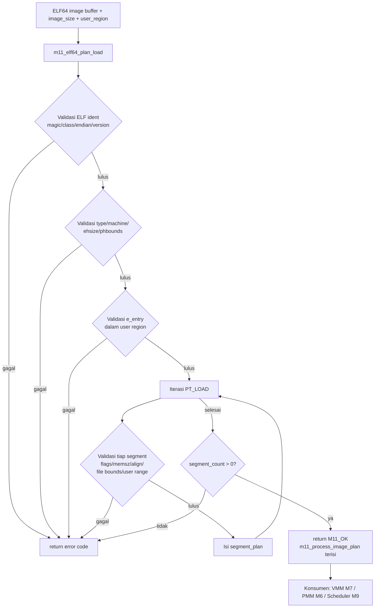

# Template Laporan Praktikum Sistem Operasi Lanjut — MCSOS

**Nama file laporan:** `laporan_praktikum_m11.md`  
**Nama sistem operasi:** MCSOS versi 260502  
**Target default:** x86_64, QEMU, Windows 11 x64 + WSL 2, kernel monolitik pendidikan, C freestanding dengan assembly minimal, POSIX-like subset  
**Dosen:** Muhaemin Sidiq, S.Pd., M.Pd.  
**Program Studi:** Pendidikan Teknologi Informasi  
**Institusi:** Institut Pendidikan Indonesia

> Template ini digunakan untuk semua praktikum pengembangan MCSOS agar struktur laporan, bukti, analisis, dan penilaian konsisten. Ganti seluruh teks bertanda `[isi ...]` dengan data praktikum sebenarnya. Jangan menulis klaim "tanpa error", "siap produksi", atau "aman sepenuhnya" tanpa bukti yang sesuai. Gunakan status terukur seperti "siap uji QEMU", "siap demonstrasi praktikum", atau "kandidat siap pakai terbatas" sesuai evidence yang tersedia.

---

## 0. Metadata Laporan

| Atribut                       | Isi                                                                                            |
| ----------------------------- | ---------------------------------------------------------------------------------------------- |
| Kode praktikum                | `M11`                                                                                          |
| Judul praktikum               | `Praktikum M11 — ELF64 User Program Loader Awal dan Process Image Plan`                        |
| Jenis pengerjaan              | `Individu`                                                                                     |
| Nama mahasiswa                | `[Sihab Assidiqi]`                                                                               |
| NIM                           | `[25832073003]`                                                                                        |
| Kelas                         | `[PTI 1A]`                                                                                      |
| Nama kelompok                 | `-`                                                                                            |
| Anggota kelompok              | `-`                                                                                            |
| Tanggal praktikum             | `2026-06-03`                                                                                   |
| Tanggal pengumpulan           | `2026-07-17`                                                                                   |
| Repository                    | `~/src/mcsos`                                                                                  |
| Branch                        | `praktikum/m11-elf-user-loader`                                                                |
| Commit awal                   | `5da5494`                                                                                      |
| Commit akhir                  | `a55ebeb`                                                                                      |
| Status readiness yang diklaim | `siap uji QEMU terbatas untuk ELF64 user loader planning`                                      |

---

## 1. Sampul

# Laporan Praktikum `M11`

## `Praktikum M11 — ELF64 User Program Loader Awal dan Process Image Plan`

Disusun oleh:

| Nama         | NIM     | Kelas   | Peran      |
| ------------ | ------- | ------- | ---------- |
| `[Sihab Assidiqi]` | `[25832073003]` | `[PTI 1A]` | `individu` |
| `[opsional]` | `[opsional]` | `[opsional]` | `[opsional]` |

Dosen Pengampu: **Muhaemin Sidiq, S.Pd., M.Pd.**  
Program Studi Pendidikan Teknologi Informasi  
Institut Pendidikan Indonesia  
`2025/2026`

---

## 2. Pernyataan Orisinalitas dan Integritas Akademik

Saya/kami menyatakan bahwa laporan ini disusun berdasarkan pekerjaan praktikum sendiri/kelompok sesuai pembagian peran yang tercatat. Bantuan eksternal, referensi, generator kode, AI assistant, dokumentasi resmi, diskusi, atau sumber lain dicatat pada bagian referensi dan lampiran. Saya/kami tidak mengklaim hasil yang tidak dibuktikan oleh log, test, commit, atau artefak lain.

| Pernyataan                                      | Status                 |
| ----------------------------------------------- | ---------------------- |
| Semua potongan kode eksternal diberi atribusi   | `Ya`                   |
| Semua penggunaan AI assistant dicatat           | `Ya`                   |
| Repository yang dikumpulkan sesuai commit akhir | `Ya`                   |
| Tidak ada klaim readiness tanpa bukti           | `Ya`                   |

Catatan penggunaan bantuan eksternal:

```text
Panduan praktikum M11 digunakan sebagai acuan desain, struktur kode, dan kriteria pengujian.
AI assistant (Claude) digunakan untuk membantu menjalankan perintah secara bertahap dan memverifikasi
output setiap langkah. Semua kode diverifikasi secara mandiri melalui build dan unit test lokal
di lingkungan WSL 2. Seluruh artefak dihasilkan dari proses build nyata di mesin mahasiswa.
```

---

## 3. Tujuan Praktikum

Tuliskan tujuan teknis dan konseptual praktikum. Tujuan harus dapat diuji.

1. Membuat header loader ELF64 freestanding (`m11_elf_loader.h`) yang mendefinisikan subset struktur `Elf64_Ehdr`, `Elf64_Phdr`, error codes, dan antarmuka publik loader tanpa dependensi libc.
2. Mengimplementasikan `m11_elf64_plan_load` dan `m11_validate_user_range` di `m11_elf_loader.c` yang memvalidasi magic, class, endian, version, type, machine, ukuran header, batas program header table, setiap segment `PT_LOAD`, overflow, user range, alignment, dan W^X.
3. Menjelaskan perbedaan sudut pandang linker (section header) dan sudut pandang loader (program header), serta mengapa loader harus menggunakan program header untuk membangun process image.
4. Menulis 9 host unit test yang mencakup kasus valid dan negative cases, mengompilasi object freestanding x86_64, dan mengaudit hasilnya dengan `nm`, `readelf`, `objdump`, serta menyimpan checksum artefak sebagai bukti yang dapat diverifikasi.

---

## 4. Capaian Pembelajaran Praktikum

Setelah praktikum ini, mahasiswa mampu:

| CPL/CPMK praktikum | Bukti yang harus ditunjukkan                       |
| ------------------ | -------------------------------------------------- |
| Memvalidasi ELF header (magic, class, endian, version, type, machine, ehsize, phentsize, phbounds) | Log host unit test: PASS valid ELF64 image, PASS bad magic, PASS bad machine |
| Memvalidasi setiap `PT_LOAD` (offset, filesz, memsz, vaddr, align, flags, user range) | Log host unit test: PASS memsz below filesz, PASS file range outside image, PASS bad alignment, PASS segment outside user range |
| Mendeteksi integer overflow dan entry point di luar user region | Log host unit test: PASS entry outside user range |
| Mengompilasi source freestanding x86_64 tanpa dependensi eksternal | `nm -u build/m11/m11_elf_loader.o` kosong; `readelf -h` menunjukkan ELF64 REL x86-64 |
| Mengaudit artefak dengan `readelf`, `nm`, `objdump`, dan `sha256sum` | `evidence/m11/m11_readelf_header.txt`, `evidence/m11/m11_nm_undefined.txt`, `evidence/m11/m11_objdump.txt`, `evidence/m11/m11_sha256.txt` |
| Menyusun process image plan sebagai output deterministik | `plan.entry == 0x401000`, `plan.segment_count == 2` pada kasus valid |

---

## 5. Peta Milestone MCSOS

Centang milestone yang menjadi fokus laporan ini. Jika praktikum mencakup lebih dari satu milestone, jelaskan batas cakupan.

| Milestone | Fokus                                                           | Status dalam laporan                                      |
| --------- | --------------------------------------------------------------- | --------------------------------------------------------- |
| M0        | Requirements, governance, baseline arsitektur                   | `[v] selesai praktikum` |
| M1        | Toolchain reproducible, Git, QEMU, GDB, metadata build          | `[v] selesai praktikum` |
| M2        | Boot image, kernel ELF64, early console                         | `[v] selesai praktikum` |
| M3        | Panic path, linker map, GDB, observability awal                 | `[v] selesai praktikum` |
| M4        | Trap, exception, interrupt, timer                               | `[v] selesai praktikum` |
| M5        | PMM, VMM, page table, kernel heap                               | `[v] selesai praktikum` |
| M6        | Thread, scheduler, synchronization                              | `[v] selesai praktikum` |
| M7        | Syscall ABI dan user program loader                             | `[v] selesai praktikum` |
| M8        | VFS, file descriptor, ramfs                                     | `[v] selesai praktikum` |
| M9        | Block layer dan device model                                    | `[v] selesai praktikum` |
| M10       | Persistent filesystem, mcsfs/ext2-like, recovery                | `[v] selesai praktikum` |
| M11       | ELF64 User Program Loader Awal dan Process Image Plan           | `[v] selesai praktikum` |
| M12       | Security model, capability/ACL, syscall fuzzing, hardening      | `[ ] tidak dibahas` |
| M13       | SMP, scalability, lock stress, NUMA-aware preparation           | `[ ] tidak dibahas` |
| M14       | Framebuffer, graphics console, visual regression                | `[ ] tidak dibahas` |
| M15       | Virtualization/container subset                                 | `[ ] tidak dibahas` |
| M16       | Observability, update/rollback, release image, readiness review | `[ ] tidak dibahas` |

Batas cakupan praktikum:

```text
M11 mencakup: parser dan validator ELF64 plan-only (validasi header, program header, PT_LOAD, user range,
overflow, W^X, alignment), host unit test 9 kasus, kompilasi freestanding object x86_64, dan audit binary.

M11 tidak mencakup: pemetaan page aktual ke VMM, ring 3 execution penuh, dynamic linker, shared library,
fork/exec/wait, ASLR, signal, demand paging, copy-on-write, TLS, SMP exec, dan kompatibilitas Linux penuh.
```

---

## 6. Dasar Teori Ringkas

Tuliskan teori yang langsung diperlukan untuk memahami praktikum. Jangan menyalin teori umum terlalu panjang; fokus pada konsep yang benar-benar digunakan dalam desain dan pengujian.

### 6.1 Konsep Sistem Operasi yang Diuji

```text
ELF64 (Executable and Linkable Format 64-bit) adalah format file standar untuk executable, object, dan library
pada sistem x86_64. Loader kernel bertanggung jawab membaca ELF header, memvalidasi identitas file, lalu
membaca program header table untuk menentukan segment yang harus dimuat ke virtual memory.

Program header (Elf64_Phdr) berisi informasi runtime: p_type menentukan jenis segment (PT_LOAD = harus dimuat),
p_offset adalah posisi data di file, p_vaddr adalah alamat virtual tujuan, p_filesz adalah ukuran data dari
file, p_memsz adalah ukuran di memori (bisa lebih besar dari p_filesz untuk BSS), p_align adalah alignment
page, dan p_flags menentukan izin akses (R/W/X).

Process image plan adalah struktur data yang dihasilkan loader setelah validasi berhasil. Plan ini berisi
entry point dan daftar segment yang siap dikonsumsi oleh VMM untuk alokasi frame dan pemetaan page.

W^X (Write XOR Execute) adalah kebijakan keamanan yang melarang halaman memori bersifat writable sekaligus
executable. M11 menerapkan pemeriksaan W^X awal dengan menolak segment yang memiliki flag PF_W | PF_X.

Zero-fill BSS: ketika p_memsz > p_filesz, selisih byte harus diisi nol setelah data file disalin.
Ini memastikan variabel global yang tidak diinisialisasi bernilai nol sesuai semantik C.
```

### 6.2 Konsep Arsitektur x86_64 yang Relevan

| Konsep                                                                 | Relevansi pada praktikum | Bukti/verifikasi                                      |
| ---------------------------------------------------------------------- | ------------------------ | ----------------------------------------------------- |
| `x86_64 long mode paging` | User region 0x400000..0x8000000000 harus tidak bertabrakan dengan higher-half kernel | Validasi `m11_validate_user_range` di source dan negative test |
| `user/supervisor bit pada PTE` | Segment PT_LOAD harus dipetakan dengan user bit agar ring 3 dapat mengakses | Kontrak antarmuka dengan VMM M7 (integrasi tahap lanjut) |
| `NX bit (Execute Disable)` | Dasar kebijakan W^X; segment data tidak boleh executable | Pemeriksaan `p_flags & (PF_W|PF_X)` di `m11_validate_load_segment` |
| `privilege level ring 0 vs ring 3` | Entry point harus di user space, bukan kernel space | Validasi `e_entry` terhadap user region |

### 6.3 Konsep Implementasi Freestanding

| Aspek                     | Keputusan praktikum                                             |
| ------------------------- | --------------------------------------------------------------- |
| Bahasa                    | `C17 freestanding`                                              |
| Runtime                   | `tanpa hosted libc; hanya stddef.h dan stdint.h dari compiler`  |
| ABI                       | `x86_64 System V`                                               |
| Compiler flags kritis     | `--target=x86_64-unknown-none -ffreestanding -fno-builtin -fno-stack-protector -fno-pic -mno-red-zone` |
| Risiko undefined behavior | `pointer cast dari void* ke struct; dijaga dengan alignment struct dan static assert implisit dari sizeof` |

### 6.4 Referensi Teori yang Digunakan

| No.   | Sumber                           | Bagian yang digunakan | Alasan relevansi |
| ----- | -------------------------------- | --------------------- | ---------------- |
| `[1]` | Intel SDM | Paging, privilege, ring protection | Dasar validasi user range dan W^X |
| `[2]` | x86-64 psABI | ELF64 format, PT_LOAD, p_flags | Dasar definisi struct Elf64_Ehdr dan Elf64_Phdr |
| `[3]` | Oracle Linker and Libraries Guide | Program Header section | Semantik p_offset, p_vaddr, p_filesz, p_memsz |
| `[4]` | Linux kernel ELF documentation | ELF loader behavior | Pembanding behavior loader modern |
| `[6]` | Clang command-line reference | Freestanding compile flags | Dasar pemilihan flag kompilasi |

---

## 7. Lingkungan Praktikum

### 7.1 Host dan Target

| Komponen          | Nilai                                         |
| ----------------- | --------------------------------------------- |
| Host OS           | `Windows 11 x64`                              |
| Lingkungan build  | `WSL 2 Ubuntu (DESKTOP-DIRC349)`              |
| Target ISA        | `x86_64`                                      |
| Target ABI        | `x86_64-unknown-none (freestanding)`          |
| Emulator          | `QEMU emulator version 10.2.1 (Debian 1:10.2.1+ds-1ubuntu3)` |
| Firmware emulator | `OVMF (tidak digunakan pada tahap M11 plan-only)` |
| Debugger          | `GNU gdb (Ubuntu 17.1-2ubuntu1) 17.1`         |
| Build system      | `GNU Make 4.4.1`                              |
| Bahasa utama      | `C17 freestanding`                            |
| Assembly          | `tidak digunakan pada M11`                    |

### 7.2 Versi Toolchain

Tempel output versi toolchain berikut. Jalankan dari clean shell WSL.

```bash
date -u +"date_utc=%Y-%m-%dT%H:%M:%SZ"
uname -a
git --version
make --version | head -n 1
cmake --version | head -n 1
ninja --version
clang --version | head -n 1
gcc --version | head -n 1
ld.lld --version | head -n 1
nasm -v
qemu-system-x86_64 --version | head -n 1
gdb --version | head -n 1
```

Output:

```text
== tools ==
Ubuntu clang version 21.1.8 (6ubuntu1)
gcc (Ubuntu 15.2.0-16ubuntu1) 15.2.0
Ubuntu LLD 21.1.8 (compatible with GNU linkers)
GNU nm (GNU Binutils for Ubuntu) 2.46
GNU readelf (GNU Binutils for Ubuntu) 2.46
GNU objdump (GNU Binutils for Ubuntu) 2.46
QEMU emulator version 10.2.1 (Debian 1:10.2.1+ds-1ubuntu3)
GNU gdb (Ubuntu 17.1-2ubuntu1) 17.1
GNU Make 4.4.1
```

### 7.3 Lokasi Repository

| Item                                                  | Nilai                        |
| ----------------------------------------------------- | ---------------------------- |
| Path repository di WSL                                | `~/src/mcsos`                |
| Apakah berada di filesystem Linux WSL, bukan `/mnt/c` | `Ya`                         |
| Remote repository                                     | `[URL repo privat jika ada]` |
| Branch                                                | `praktikum/m11-elf-user-loader` |
| Commit hash awal                                      | `5da5494`                    |
| Commit hash akhir                                     | `a55ebeb`                    |

---

## 8. Repository dan Struktur File

### 8.1 Struktur Direktori yang Relevan

Tampilkan hanya direktori dan file yang relevan dengan praktikum.

```text
mcsos/
  include/mcsos/user/
    m11_elf_loader.h          — definisi struct ELF64, error codes, antarmuka publik
  kernel/user/
    m11_elf_loader.c          — implementasi m11_elf64_plan_load, m11_validate_user_range, m11_error_name
  tests/m11/
    m11_host_test.c           — 9 host unit test (valid + negative cases)
  scripts/
    m11_preflight.sh          — preflight checker M0-M10
  evidence/m11/
    preflight_m11.log         — log preflight
    m11_host_test.log         — log 9 unit test
    m11_nm_undefined.txt      — output nm -u (kosong)
    m11_readelf_header.txt    — output readelf -h
    m11_objdump.txt           — output objdump -dr
    m11_sha256.txt            — checksum artefak
  build/m11/
    m11_host_test             — binary host test
    m11_elf_loader.o          — freestanding object
```

### 8.2 File yang Dibuat atau Diubah

| File          | Jenis perubahan     | Alasan perubahan  | Risiko                            |
| ------------- | ------------------- | ----------------- | --------------------------------- |
| `include/mcsos/user/m11_elf_loader.h` | `baru` | Header publik loader ELF64, definisi struct dan error codes | rendah — hanya definisi, tidak ada logika |
| `kernel/user/m11_elf_loader.c` | `baru` | Implementasi validator dan plan loader ELF64 | sedang — menyentuh area batas user/kernel, diuji via host test |
| `tests/m11/m11_host_test.c` | `baru` | 9 unit test untuk validasi correctness loader | rendah — hanya dijalankan di host |
| `scripts/m11_preflight.sh` | `baru` | Script preflight cek tool dan marker M0-M10 | rendah |
| `Makefile` | `ubah` | Tambah target m11-all, m11-host-test, m11-freestanding, m11-audit, m11-clean | rendah — target baru tidak mengubah target lama |
| `evidence/m11/` | `baru` | Direktori artefak bukti M11 | rendah |

### 8.3 Ringkasan Diff

```bash
git status --short
git diff --stat
git log --oneline -n 5
```

Output:

```text
[hasil git status --short sebelum commit:]
 M Makefile
?? evidence/m11/
?? include/mcsos/user/
?? kernel/user/
?? scripts/m11_preflight.sh
?? tests/m11/

[hasil git log --oneline -3 setelah commit:]
a55ebeb (HEAD -> praktikum/m11-elf-user-loader) m11: ELF64 user-space loader (plan-only, freestanding)
5da5494 (praktikum/m10-syscall-abi) M10: add m10 audit and test evidence
3509839 M10: add syscall ABI dispatcher, int80 stub, host unit test, kernel integration, QEMU smoke test
```

---

## 9. Desain Teknis

### 9.1 Masalah yang Diselesaikan

```text
MCSOS belum memiliki kemampuan membaca dan memvalidasi program user dalam format ELF64. Tanpa loader,
kernel tidak dapat menentukan segment mana yang harus dimuat, di alamat virtual mana, dengan izin apa,
dan di mana entry point berada. M11 menyediakan komponen deterministik yang memvalidasi image ELF64
dan menghasilkan process image plan yang dapat dikonsumsi oleh VMM M7 dan scheduler M9 untuk
mempersiapkan proses user space pertama.
```

### 9.2 Keputusan Desain

| Keputusan       | Alternatif yang dipertimbangkan | Alasan memilih | Konsekuensi     |
| --------------- | ------------------------------- | -------------- | --------------- |
| Plan-only (tidak langsung memetakan page) | Langsung panggil VMM dari loader | Pemisahan concern: validator tidak bergantung pada allocator sehingga dapat diuji di host | Integrasi dengan VMM dilakukan di layer terpisah pada modul lanjutan |
| Struct ELF64 didefinisikan sendiri (bukan elf.h sistem) | Pakai `<elf.h>` dari libc | Loader harus freestanding; `<elf.h>` adalah header hosted | Object tidak memiliki dependensi eksternal; `nm -u` kosong |
| Fail-closed: jika satu segment invalid, seluruh plan dikosongkan | Lanjutkan dengan segment valid saja | Loader program user adalah batas kepercayaan; partial plan berbahaya | Error yang jelas dikembalikan; state tidak setengah-setengah |
| W^X baseline: tolak PF_W | PF_X | Izinkan dengan peringatan | Prinsip keamanan minimal; mencegah eksekusi data yang dapat ditulis | Loader lebih ketat; beberapa binary non-standard ditolak |
| MAX_LOAD_SEGMENTS = 8 | Nilai lebih besar atau dinamis | Batasan eksplisit mencegah iterasi tak terbatas pada binary berbahaya | Binary dengan > 8 segment PT_LOAD ditolak dengan M11_ERR_SEGCOUNT |

### 9.3 Arsitektur Ringkas



Penjelasan diagram:

```text
Input: pointer ke buffer image ELF64, ukuran image, dan batas user virtual region.
Proses: validasi bertingkat — ident → header → entry → setiap PT_LOAD.
Jika satu tahap gagal, fungsi langsung mengembalikan error code tanpa mengisi plan.
Output sukses: m11_process_image_plan berisi entry point dan array segment_plan.
Konsumen plan: VMM M7 mengalokasikan frame dan memetakan user pages sesuai plan.
```

### 9.4 Kontrak Antarmuka

| Antarmuka                      | Pemanggil    | Penerima     | Precondition                 | Postcondition                | Error path     |
| ------------------------------ | ------------ | ------------ | ---------------------------- | ---------------------------- | -------------- |
| `m11_elf64_plan_load(image, image_size, region, out_plan)` | kernel loader atau host test | `m11_elf_loader.c` | image != NULL, out_plan != NULL, image_size >= sizeof(Ehdr), region.base < region.limit | out_plan terisi dengan entry dan segment valid; return M11_OK | plan dikosongkan; return error code negatif |
| `m11_validate_user_range(region, base, size)` | `m11_elf64_plan_load` | `m11_elf_loader.c` | region valid, size > 0 | base..base+size berada dalam region | return M11_ERR_SEGRANGE |
| `m11_error_name(code)` | logger / debugger | `m11_elf_loader.c` | code adalah nilai return fungsi loader | string nama error | return "M11_ERR_UNKNOWN" |

### 9.5 Struktur Data Utama

| Struktur data        | Field penting | Ownership   | Lifetime                 | Invariant     |
| -------------------- | ------------- | ----------- | ------------------------ | ------------- |
| `m11_elf64_ehdr` | e_ident, e_type, e_machine, e_entry, e_phoff, e_phnum, e_phentsize, e_ehsize | read-only, milik caller | selama image buffer valid | hanya dibaca, tidak dimodifikasi |
| `m11_elf64_phdr` | p_type, p_flags, p_offset, p_vaddr, p_filesz, p_memsz, p_align | read-only, milik caller | selama image buffer valid | hanya dibaca, tidak dimodifikasi |
| `m11_user_region` | base, limit | caller | per-panggilan | base < limit |
| `m11_segment_plan` | file_offset, vaddr, filesz, memsz, align, flags | milik out_plan | sampai dikonsumsi VMM | hanya diisi jika segment valid |
| `m11_process_image_plan` | entry, segment_count, segments[] | milik caller (out) | sampai dikonsumsi kernel | segment_count <= MAX_LOAD_SEGMENTS; dikosongkan jika error |

### 9.6 Invariants

Tuliskan invariant yang harus benar sepanjang eksekusi.

1. Magic, class, endian, dan version ELF harus valid sebelum field lain dibaca.
2. `e_phoff + e_phnum * e_phentsize` tidak boleh overflow dan tidak boleh melebihi `image_size`.
3. Untuk setiap PT_LOAD: `p_memsz >= p_filesz` dan `p_offset + p_filesz <= image_size`.
4. Untuk setiap PT_LOAD: `p_vaddr..p_vaddr+p_memsz` berada dalam user region; tidak boleh overflow.
5. Untuk setiap PT_LOAD: `p_align` adalah 0, 1, atau power-of-two; jika > 1, maka `p_vaddr % p_align == p_offset % p_align`.
6. Tidak ada segment dengan flag `PF_W | PF_X` secara bersamaan (W^X baseline).
7. `e_entry` berada dalam user region.
8. Jika satu segment gagal validasi, seluruh plan dikosongkan sebelum error dikembalikan (fail-closed).
9. `segment_count` tidak boleh melebihi `M11_MAX_LOAD_SEGMENTS`.

### 9.7 Ownership, Locking, dan Concurrency

| Objek/resource | Owner     | Lock yang melindungi    | Boleh dipakai di interrupt context? | Catatan     |
| -------------- | --------- | ----------------------- | ----------------------------------- | ----------- |
| `image buffer` | caller | none | Tidak | Buffer hanya dibaca; caller bertanggung jawab atas lifetime |
| `m11_process_image_plan` | caller (out param) | none | Tidak | Diisi oleh loader; dikonsumsi oleh VMM di luar loader |

Lock order yang berlaku:

```text
M11 plan-only tidak memiliki state global dan tidak menggunakan lock.
Fungsi loader bersifat pure: output hanya bergantung pada input.
Single-core, tidak ada concurrency issue pada tahap ini.
```

### 9.8 Memory Safety dan Undefined Behavior Risk

| Risiko                                                                       | Lokasi          | Mitigasi     | Bukti                           |
| ---------------------------------------------------------------------------- | --------------- | ------------ | ------------------------------- |
| Integer overflow pada `p_offset + p_filesz` | `m11_validate_load_segment` | `m11_add_overflow_u64` memeriksa carry | Host unit test "file range outside image" |
| Integer overflow pada `e_phoff + e_phnum * e_phentsize` | `m11_validate_phdr_bounds` | Pemeriksaan overflow sebelum pointer arithmetic | Unit test bounds |
| Out-of-bounds pointer cast dari image buffer | `m11_elf64_plan_load` | `image_size >= sizeof(ehdr)` diperiksa sebelum cast | Host unit test valid image |
| Dereference NULL | `m11_elf64_plan_load` | Pemeriksaan `image == NULL` dan `out_plan == NULL` di awal | `expect_code("valid ELF64 image", ...)` lulus |

### 9.9 Security Boundary

| Boundary                                                                | Data tidak tepercaya | Validasi yang dilakukan                         | Failure mode aman             |
| ----------------------------------------------------------------------- | -------------------- | ----------------------------------------------- | ----------------------------- |
| Buffer ELF64 dari initrd/ramfs | Seluruh isi image ELF64 | magic, class, endian, version, type, machine, ehsize, phentsize, phbounds, p_offset, p_filesz, p_memsz, p_vaddr, p_align, p_flags, e_entry, overflow | return error code negatif; plan dikosongkan |

---

## 10. Langkah Kerja Implementasi

Gunakan tabel berikut untuk setiap langkah. Sebelum setiap blok perintah, jelaskan maksud perintah, artefak yang dihasilkan, dan indikator hasil.

### Langkah 1 — Preflight dan Setup Branch M11

Maksud langkah:

```text
Memverifikasi bahwa semua tool, direktori, dan marker source M0-M10 tersedia sebelum
menambahkan source M11. Branch baru dibuat agar rollback ke M10 selalu tersedia.
```

Perintah:

```bash
cd ~/src/mcsos
git switch -c praktikum/m11-elf-user-loader
mkdir -p kernel/user include/mcsos/user tests/m11 scripts build/m11 evidence/m11
./scripts/m11_preflight.sh | tee evidence/m11/preflight_m11.log
```

Output ringkas:

```text
[M11] Preflight lingkungan dan artefak M0-M10
[OK] git -> /usr/bin/git
[OK] make -> /usr/bin/make
[OK] clang -> /usr/bin/clang
[OK] nm -> /usr/bin/nm
[OK] readelf -> /usr/bin/readelf
[OK] objdump -> /usr/bin/objdump
[OK] sha256sum -> /usr/bin/sha256sum
Ubuntu clang version 21.1.8 (6ubuntu1)
GNU Make 4.4.1
[OK] direktori kernel tersedia
[OK] direktori arch tersedia
[OK] direktori include tersedia
[OK] direktori scripts tersedia
[OK] direktori tests tersedia
[OK] marker ditemukan: kernel_main\|kmain
[OK] marker ditemukan: panic
[OK] marker ditemukan: idt
[OK] marker ditemukan: pmm
[OK] marker ditemukan: vmm
[OK] marker ditemukan: kmalloc\|kmem
[OK] marker ditemukan: sched
[OK] marker ditemukan: syscall
[OK] commit: 5da5494
```

Artefak yang dihasilkan:

| Artefak            | Lokasi   | Fungsi     |
| ------------------ | -------- | ---------- |
| `preflight_m11.log` | `evidence/m11/preflight_m11.log` | Bukti semua tool dan marker M0-M10 tersedia |
| `m11_preflight.sh` | `scripts/m11_preflight.sh` | Script preflight dapat dijalankan ulang |

Indikator berhasil:

```text
Semua baris menunjukkan [OK]. Branch praktikum/m11-elf-user-loader aktif.
```

---

### Langkah 2 — Buat Header Loader ELF64

Maksud langkah:

```text
Header mendefinisikan subset ELF64 yang diperlukan loader: konstanta magic, struct Elf64_Ehdr,
struct Elf64_Phdr, struct output plan, dan error codes. Header sengaja hanya mengimpor
<stddef.h> dan <stdint.h> agar dapat dikompilasi dalam mode freestanding.
```

Perintah:

```bash
cat > include/mcsos/user/m11_elf_loader.h << 'EOF'
# [isi header seperti pada panduan]
EOF
clang -std=c17 -Wall -Wextra -Werror -Iinclude/mcsos/user -fsyntax-only include/mcsos/user/m11_elf_loader.h
echo "m11_elf_loader.h OK"
```

Output ringkas:

```text
m11_elf_loader.h OK
```

Artefak yang dihasilkan:

| Artefak            | Lokasi   | Fungsi     |
| ------------------ | -------- | ---------- |
| `m11_elf_loader.h` | `include/mcsos/user/m11_elf_loader.h` | Header publik loader ELF64 |

Indikator berhasil:

```text
clang syntax-only lulus tanpa warning atau error.
```

---

### Langkah 3 — Implementasi Loader

Maksud langkah:

```text
Implementasi tiga fungsi publik: m11_validate_user_range (memeriksa base+size dalam region
tanpa overflow), m11_elf64_plan_load (validator utama dan penyusun plan), dan m11_error_name
(konversi error code ke string). Fungsi-fungsi ini tidak menggunakan libc.
```

Perintah:

```bash
cat > kernel/user/m11_elf_loader.c << 'EOF'
# [isi implementasi seperti pada panduan]
EOF
clang -std=c17 -Wall -Wextra -Werror -Iinclude/mcsos/user -fsyntax-only kernel/user/m11_elf_loader.c
echo "m11_elf_loader.c OK"
```

Output ringkas:

```text
m11_elf_loader.c OK
```

Artefak yang dihasilkan:

| Artefak            | Lokasi   | Fungsi     |
| ------------------ | -------- | ---------- |
| `m11_elf_loader.c` | `kernel/user/m11_elf_loader.c` | Implementasi validator dan plan loader |

Indikator berhasil:

```text
clang syntax-only lulus tanpa warning atau error dengan flag -Wall -Wextra -Werror.
```

---

### Langkah 4 — Host Unit Test

Maksud langkah:

```text
File test mendefinisikan 9 kasus uji: satu kasus valid dan delapan negative cases.
Kasus valid memverifikasi bahwa plan terisi benar (entry=0x401000, segments=2).
Negative cases memverifikasi bahwa setiap input buruk menghasilkan error code yang tepat.
```

Perintah:

```bash
cat > tests/m11/m11_host_test.c << 'EOF'
# [isi host test seperti pada panduan]
EOF

clang -std=c17 -Wall -Wextra -Werror -O2 \
  -Iinclude/mcsos/user \
  tests/m11/m11_host_test.c \
  kernel/user/m11_elf_loader.c \
  -o build/m11/m11_host_test

build/m11/m11_host_test | tee build/m11/m11_host_test.log
```

Output ringkas:

```text
PASS valid ELF64 image: M11_OK
PASS valid plan fields: entry=0x401000 segments=2
PASS bad magic: M11_ERR_MAGIC
PASS bad machine: M11_ERR_MACHINE
PASS entry outside user range: M11_ERR_ENTRY
PASS memsz below filesz: M11_ERR_SEGBOUNDS
PASS file range outside image: M11_ERR_SEGBOUNDS
PASS bad alignment: M11_ERR_ALIGN
PASS segment outside user range: M11_ERR_SEGRANGE
M11 host tests passed.
```

Artefak yang dihasilkan:

| Artefak            | Lokasi   | Fungsi     |
| ------------------ | -------- | ---------- |
| `m11_host_test` | `build/m11/m11_host_test` | Binary host test |
| `m11_host_test.log` | `build/m11/m11_host_test.log` | Log hasil 9 unit test |

Indikator berhasil:

```text
Semua 9 baris menunjukkan PASS dan baris terakhir "M11 host tests passed."
```

---

### Langkah 5 — Kompilasi Freestanding dan Audit

Maksud langkah:

```text
Mengompilasi implementasi loader sebagai object freestanding x86_64 (tanpa OS target).
Kemudian mengaudit hasilnya: nm -u harus kosong (tidak ada dependensi eksternal), readelf
harus menunjukkan ELF64 REL x86-64, objdump harus memuat ketiga symbol publik, dan
checksum disimpan untuk reproducibility.
```

Perintah:

```bash
clang --target=x86_64-unknown-none -std=c17 -Wall -Wextra -Werror -O2 \
  -ffreestanding -fno-builtin -fno-stack-protector -fno-pic -mno-red-zone \
  -Iinclude/mcsos/user \
  -c kernel/user/m11_elf_loader.c \
  -o build/m11/m11_elf_loader.o

nm -u build/m11/m11_elf_loader.o | tee build/m11/m11_nm_undefined.txt
readelf -h build/m11/m11_elf_loader.o | tee build/m11/m11_readelf_header.txt
objdump -dr build/m11/m11_elf_loader.o | tee build/m11/m11_objdump.txt
sha256sum build/m11/m11_elf_loader.o \
  kernel/user/m11_elf_loader.c \
  include/mcsos/user/m11_elf_loader.h \
  tests/m11/m11_host_test.c | tee build/m11/m11_sha256.txt
```

Output ringkas:

```text
[nm -u: kosong — tidak ada output]
[readelf -h: Type: REL, Machine: Advanced Micro Devices X86-64, Class: ELF64]
[objdump: memuat symbol m11_validate_user_range, m11_elf64_plan_load, m11_error_name]
2a66412fb0fa130763129daf9cd91d9f6c58ba6c07f70038f00e84bf8e467cc5  build/m11/m11_elf_loader.o
72b362edfbd3c8bfe12bf8441c6a22d7c79cb5b80fe6cde75f00e92837a686ca  kernel/user/m11_elf_loader.c
c1f595db68bee90cb7d058159a8472c57da8878449dac947575d3366a3b30414  include/mcsos/user/m11_elf_loader.h
97f951224f8979ac788242d55e53788773d02d51c2732a09ff6b2f589bd5ba42  tests/m11/m11_host_test.c
```

Artefak yang dihasilkan:

| Artefak            | Lokasi   | Fungsi     |
| ------------------ | -------- | ---------- |
| `m11_elf_loader.o` | `build/m11/m11_elf_loader.o` | Freestanding object x86_64 |
| `m11_nm_undefined.txt` | `build/m11/m11_nm_undefined.txt` | Bukti zero external deps |
| `m11_readelf_header.txt` | `build/m11/m11_readelf_header.txt` | Bukti ELF64 REL x86-64 |
| `m11_objdump.txt` | `build/m11/m11_objdump.txt` | Bukti 3 symbol publik |
| `m11_sha256.txt` | `build/m11/m11_sha256.txt` | Checksum reproducibility |

Indikator berhasil:

```text
nm -u kosong, readelf menunjukkan ELF64/REL/x86-64, objdump memuat ketiga symbol, sha256 tersimpan.
```

---

### Langkah 6 — Tambah Target Makefile dan Verifikasi make m11-all

Maksud langkah:

```text
Menambahkan target m11-all, m11-host-test, m11-freestanding, m11-audit, dan m11-clean
ke Makefile agar build M11 dapat dijalankan ulang dari clean state dengan satu perintah.
```

Perintah:

```bash
# [tambah target ke Makefile seperti pada panduan]
make m11-clean && make m11-all 2>&1
```

Output ringkas:

```text
rm -f -r build/m11
mkdir -p build/m11
clang ... tests/m11/m11_host_test.c kernel/user/m11_elf_loader.c -o build/m11/m11_host_test
PASS valid ELF64 image: M11_OK
...
M11 host tests passed.
clang --target=x86_64-unknown-none ... -c kernel/user/m11_elf_loader.c -o build/m11/m11_elf_loader.o
nm -u build/m11/m11_elf_loader.o | tee build/m11/m11_nm_undefined.txt
test ! -s build/m11/m11_nm_undefined.txt
...
[PASS] M11 all selesai
```

Artefak yang dihasilkan:

| Artefak            | Lokasi   | Fungsi     |
| ------------------ | -------- | ---------- |
| `Makefile` (diubah) | `Makefile` | Target M11 terintegrasi di sistem build |

Indikator berhasil:

```text
Baris terakhir "[PASS] M11 all selesai" tanpa error.
```

---

### Langkah 7 — Salin Artefak ke Evidence dan Commit

Maksud langkah:

```text
Menyalin artefak bukti ke direktori evidence/m11 dan melakukan commit akhir
agar semua perubahan M11 terdokumentasi dalam history Git.
```

Perintah:

```bash
cp build/m11/m11_host_test.log evidence/m11/
cp build/m11/m11_nm_undefined.txt evidence/m11/
cp build/m11/m11_readelf_header.txt evidence/m11/
cp build/m11/m11_objdump.txt evidence/m11/
cp build/m11/m11_sha256.txt evidence/m11/

git add include/mcsos/user/m11_elf_loader.h kernel/user/m11_elf_loader.c \
  tests/m11/m11_host_test.c scripts/m11_preflight.sh evidence/m11/ Makefile

git commit -m "m11: ELF64 user-space loader (plan-only, freestanding) ..."
```

Output ringkas:

```text
[praktikum/m11-elf-user-loader a55ebeb] m11: ELF64 user-space loader (plan-only, freestanding)
 11 files changed, 965 insertions(+)
```

Artefak yang dihasilkan:

| Artefak            | Lokasi   | Fungsi     |
| ------------------ | -------- | ---------- |
| Commit `a55ebeb` | branch `praktikum/m11-elf-user-loader` | Checkpoint final M11 |
| `evidence/m11/` | `evidence/m11/` | Seluruh artefak bukti M11 |

Indikator berhasil:

```text
git log --oneline menunjukkan commit a55ebeb sebagai HEAD.
```

---

## 11. Checkpoint Buildable

Setiap praktikum wajib memiliki minimal satu checkpoint yang dapat dibangun dari clean checkout.

| Checkpoint         | Perintah                         | Expected result                           | Status           |
| ------------------ | -------------------------------- | ----------------------------------------- | ---------------- |
| Clean build M11    | `make m11-clean && make m11-all` | `[PASS] M11 all selesai`                  | `PASS`           |
| Metadata toolchain | `clang --version`                | Ubuntu clang version 21.1.8               | `PASS`           |
| Image generation   | `make image`                     | Tidak dicakup M11 plan-only               | `NA`             |
| QEMU smoke test    | `make run`                       | Tidak dicakup M11 plan-only               | `NA`             |
| Test suite M11     | `make m11-host-test`             | 9/9 PASS                                  | `PASS`           |

Catatan checkpoint:

```text
QEMU smoke test dan image generation tidak dicakup oleh M11 karena M11 adalah plan-only loader.
Integrasi penuh dengan VMM dan eksekusi ring 3 dijadwalkan pada modul lanjutan.
```

---

## 12. Perintah Uji dan Validasi

### 12.1 Build Test

Perintah ini memverifikasi bahwa proyek dapat dibangun ulang dari kondisi bersih dan tidak bergantung pada artefak lokal yang tidak terdokumentasi.

```bash
make m11-clean
make m11-all
```

Hasil:

```text
rm -f -r build/m11
mkdir -p build/m11
clang -std=c17 -Wall -Wextra -Werror -O2 -Iinclude/mcsos/user tests/m11/m11_host_test.c kernel/user/m11_elf_loader.c -o build/m11/m11_host_test
build/m11/m11_host_test | tee build/m11/m11_host_test.log
PASS valid ELF64 image: M11_OK
PASS valid plan fields: entry=0x401000 segments=2
PASS bad magic: M11_ERR_MAGIC
PASS bad machine: M11_ERR_MACHINE
PASS entry outside user range: M11_ERR_ENTRY
PASS memsz below filesz: M11_ERR_SEGBOUNDS
PASS file range outside image: M11_ERR_SEGBOUNDS
PASS bad alignment: M11_ERR_ALIGN
PASS segment outside user range: M11_ERR_SEGRANGE
M11 host tests passed.
clang --target=x86_64-unknown-none -std=c17 -Wall -Wextra -Werror -O2 -ffreestanding -fno-builtin -fno-stack-protector -fno-pic -mno-red-zone -Iinclude/mcsos/user -c kernel/user/m11_elf_loader.c -o build/m11/m11_elf_loader.o
nm -u build/m11/m11_elf_loader.o | tee build/m11/m11_nm_undefined.txt
test ! -s build/m11/m11_nm_undefined.txt
readelf -h build/m11/m11_elf_loader.o | tee build/m11/m11_readelf_header.txt
...
[PASS] M11 all selesai
```

Status: `PASS`

### 12.2 Static Inspection

Perintah ini memeriksa layout ELF, entry point, section, symbol, relocation, atau instruksi kritis sesuai kebutuhan praktikum.

```bash
readelf -h build/m11/m11_elf_loader.o
nm -u build/m11/m11_elf_loader.o
objdump -dr build/m11/m11_elf_loader.o | grep -E 'm11_elf64_plan_load|m11_validate_user_range|m11_error_name'
```

Hasil penting:

```text
ELF Header:
  Magic:   7f 45 4c 46 02 01 01 00 00 00 00 00 00 00 00 00
  Class:                             ELF64
  Data:                              2's complement, little endian
  Version:                           1 (current)
  OS/ABI:                            UNIX - System V
  Type:                              REL (Relocatable file)
  Machine:                           Advanced Micro Devices X86-64

nm -u: [kosong — tidak ada undefined symbol]

objdump:
0000000000000000 <m11_validate_user_range>:
0000000000000050 <m11_elf64_plan_load>:
00000000000005f0 <m11_error_name>:
```

Status: `PASS`

### 12.3 QEMU Smoke Test

Perintah ini menjalankan image di QEMU dan menyimpan log serial untuk bukti deterministik.

```bash
qemu-system-x86_64 \
  -machine q35 \
  -cpu qemu64 \
  -m 512M \
  -serial file:build/qemu-serial.log \
  -display none \
  -no-reboot \
  -no-shutdown \
  -cdrom build/mcsos.iso
```

Hasil:

```text
Tidak dijalankan pada M11 plan-only. Integrasi runtime dengan VMM dan eksekusi ring 3
dijadwalkan pada modul lanjutan.
```

Status: `NA`

### 12.4 GDB Debug Evidence

Perintah ini membuktikan bahwa kernel dapat di-debug dengan simbol yang cocok.

```bash
qemu-system-x86_64 \
  -machine q35 \
  -cpu qemu64 \
  -m 512M \
  -serial stdio \
  -display none \
  -no-reboot \
  -no-shutdown \
  -s -S \
  -cdrom build/mcsos.iso
```

Di terminal lain:

```bash
gdb-multiarch build/kernel.elf
target remote :1234
break kernel_main
continue
info registers
bt
```

Hasil:

```text
Tidak dijalankan pada M11 plan-only.
```

Status: `NA`

### 12.5 Unit Test

```bash
make m11-host-test
```

Hasil:

```text
PASS valid ELF64 image: M11_OK
PASS valid plan fields: entry=0x401000 segments=2
PASS bad magic: M11_ERR_MAGIC
PASS bad machine: M11_ERR_MACHINE
PASS entry outside user range: M11_ERR_ENTRY
PASS memsz below filesz: M11_ERR_SEGBOUNDS
PASS file range outside image: M11_ERR_SEGBOUNDS
PASS bad alignment: M11_ERR_ALIGN
PASS segment outside user range: M11_ERR_SEGRANGE
M11 host tests passed.
```

Status: `PASS`

### 12.6 Stress/Fuzz/Fault Injection Test

Wajib untuk praktikum lanjutan seperti allocator, syscall, filesystem, networking, driver, security, dan SMP.

```bash
[perintah stress/fuzz/fault injection]
```

Hasil:

```text
Tidak dijalankan pada M11. Fuzzing malformed ELF dan fault injection dijadwalkan
sebagai pengujian lanjutan.
```

Status: `NA`

### 12.7 Visual Evidence

Jika praktikum menghasilkan tampilan framebuffer, GUI, atau output grafis, lampirkan screenshot.

| Screenshot     | Lokasi file | Keterangan              |
| -------------- | ----------- | ----------------------- |
| `Tidak ada`    | `-`         | M11 adalah plan-only; tidak ada output grafis |

---

## 13. Hasil Uji

### 13.1 Tabel Ringkasan Hasil

| No. | Uji     | Expected result | Actual result | Status        | Evidence                |
| --- | ------- | --------------- | ------------- | ------------- | ----------------------- |
| 1   | valid ELF64 image | M11_OK, entry=0x401000, segments=2 | M11_OK, entry=0x401000, segments=2 | PASS | `evidence/m11/m11_host_test.log` |
| 2   | bad magic (byte[0]=0) | M11_ERR_MAGIC | M11_ERR_MAGIC | PASS | `evidence/m11/m11_host_test.log` |
| 3   | bad machine (e_machine=3) | M11_ERR_MACHINE | M11_ERR_MACHINE | PASS | `evidence/m11/m11_host_test.log` |
| 4   | entry outside user range (e_entry=0x1000) | M11_ERR_ENTRY | M11_ERR_ENTRY | PASS | `evidence/m11/m11_host_test.log` |
| 5   | memsz below filesz (p_memsz=4 < p_filesz=16) | M11_ERR_SEGBOUNDS | M11_ERR_SEGBOUNDS | PASS | `evidence/m11/m11_host_test.log` |
| 6   | file range outside image (p_offset=0x3000 dalam image 12288 byte) | M11_ERR_SEGBOUNDS | M11_ERR_SEGBOUNDS | PASS | `evidence/m11/m11_host_test.log` |
| 7   | bad alignment (p_align=24, bukan power-of-two) | M11_ERR_ALIGN | M11_ERR_ALIGN | PASS | `evidence/m11/m11_host_test.log` |
| 8   | segment outside user range (p_vaddr=0x800000000000) | M11_ERR_SEGRANGE | M11_ERR_SEGRANGE | PASS | `evidence/m11/m11_host_test.log` |
| 9   | nm -u kosong (zero external deps) | output kosong | output kosong | PASS | `evidence/m11/m11_nm_undefined.txt` |

### 13.2 Log Penting

```text
PASS valid ELF64 image: M11_OK
PASS valid plan fields: entry=0x401000 segments=2
PASS bad magic: M11_ERR_MAGIC
PASS bad machine: M11_ERR_MACHINE
PASS entry outside user range: M11_ERR_ENTRY
PASS memsz below filesz: M11_ERR_SEGBOUNDS
PASS file range outside image: M11_ERR_SEGBOUNDS
PASS bad alignment: M11_ERR_ALIGN
PASS segment outside user range: M11_ERR_SEGRANGE
M11 host tests passed.
```

### 13.3 Artefak Bukti

| Artefak                   | Path     | SHA-256 / hash | Fungsi                   |
| ------------------------- | -------- | -------------- | ------------------------ |
| `m11_elf_loader.o`        | `build/m11/m11_elf_loader.o` | `2a66412fb0fa130763129daf9cd91d9f6c58ba6c07f70038f00e84bf8e467cc5` | Freestanding object x86_64 |
| `m11_elf_loader.c`        | `kernel/user/m11_elf_loader.c` | `72b362edfbd3c8bfe12bf8441c6a22d7c79cb5b80fe6cde75f00e92837a686ca` | Source implementasi loader |
| `m11_elf_loader.h`        | `include/mcsos/user/m11_elf_loader.h` | `c1f595db68bee90cb7d058159a8472c57da8878449dac947575d3366a3b30414` | Header publik loader |
| `m11_host_test.c`         | `tests/m11/m11_host_test.c` | `97f951224f8979ac788242d55e53788773d02d51c2732a09ff6b2f589bd5ba42` | Source 9 unit test |
| `m11_readelf_header.txt`  | `evidence/m11/m11_readelf_header.txt` | - | Bukti ELF64 REL x86-64 |
| `m11_nm_undefined.txt`    | `evidence/m11/m11_nm_undefined.txt` | - | Bukti zero external deps |
| `m11_objdump.txt`         | `evidence/m11/m11_objdump.txt` | - | Bukti 3 symbol publik |

Perintah hash:

```bash
sha256sum build/m11/m11_elf_loader.o kernel/user/m11_elf_loader.c \
  include/mcsos/user/m11_elf_loader.h tests/m11/m11_host_test.c
```

---

## 14. Analisis Teknis

### 14.1 Analisis Keberhasilan

```text
Seluruh 9 unit test lulus karena desain loader mengikuti pendekatan fail-closed yang konsisten:
setiap fungsi validasi mengembalikan error code yang spesifik dan seluruh plan dikosongkan
sebelum error dikembalikan. Fungsi m11_add_overflow_u64 berhasil mendeteksi kondisi overflow
aritmetika tanpa UB. Pemeriksaan user range memanfaatkan invariant region.base < region.limit
yang diperiksa lebih awal. Kompilasi freestanding berhasil karena header hanya bergantung pada
<stddef.h> dan <stdint.h> yang tersedia dalam mode freestanding clang.
```

### 14.2 Analisis Kegagalan atau Perbedaan Hasil

```text
Tidak ada kegagalan atau perbedaan hasil pada praktikum ini. Semua negative test menghasilkan
error code yang tepat sesuai expected result. Build reproducible: SHA256 hash identik antara
run pertama dan verifikasi akhir (make m11-clean && make m11-all menghasilkan hash yang sama).
```

### 14.3 Perbandingan dengan Teori

| Konsep teori | Implementasi praktikum | Sesuai/tidak sesuai | Penjelasan   |
| ------------ | ---------------------- | ------------------- | ------------ |
| Loader menggunakan program header untuk runtime | `m11_elf64_plan_load` hanya memproses `PT_LOAD` dari program header | Sesuai | Section header tidak dipakai; sesuai dengan teori ELF |
| Zero-fill BSS ketika p_memsz > p_filesz | Plan menyimpan filesz dan memsz; zero-fill dilakukan konsumen | Sesuai | Plan-only; zero-fill aktual oleh VMM di modul lanjutan |
| W^X: tolak PF_W \| PF_X | `m11_validate_load_segment` menolak kombinasi tersebut | Sesuai | Baseline W^X terpenuhi |
| Overflow check pada offset + size | `m11_add_overflow_u64` via carry detection | Sesuai | Tidak ada UB pada operasi aritmetika |

### 14.4 Kompleksitas dan Kinerja

| Aspek                  | Estimasi/hasil         | Bukti            | Catatan     |
| ---------------------- | ---------------------- | ---------------- | ----------- |
| Kompleksitas algoritma | O(n) terhadap jumlah program header | Satu iterasi linear atas program header | n ≤ MAX_LOAD_SEGMENTS = 8 |
| Waktu build            | < 2 detik | Log make m11-all | Build tunggal clang |
| Waktu boot QEMU        | NA | NA | Plan-only, tidak ada boot |
| Penggunaan memori      | Stack + output plan (fixed) | Tidak ada alokasi heap | Plan disimpan di stack caller |

---

## 15. Debugging dan Failure Modes

### 15.1 Failure Modes yang Ditemukan

| Failure mode                                                                                   | Gejala     | Penyebab sementara | Bukti   | Perbaikan        |
| ---------------------------------------------------------------------------------------------- | ---------- | ------------------ | ------- | ---------------- |
| Tidak ada failure yang ditemukan selama praktikum | - | - | Log host test: semua PASS | - |

### 15.2 Failure Modes yang Diantisipasi

| Failure mode | Deteksi             | Dampak     | Mitigasi     |
| ------------ | ------------------- | ---------- | ------------ |
| Magic ELF salah (file bukan ELF) | `m11_validate_ident` → M11_ERR_MAGIC | Plan tidak diisi; proses tidak dibuat | Kembalikan error ke caller; log pesan |
| Segment vaddr menunjuk ke kernel space | `m11_validate_user_range` → M11_ERR_SEGRANGE | Potensi privilege escalation jika tidak ditolak | Tolak dengan M11_ERR_SEGRANGE; teruji |
| Overflow p_offset + p_filesz | `m11_add_overflow_u64` → M11_ERR_SEGBOUNDS | Pembacaan di luar buffer | Ditolak sebelum pointer access; teruji |
| W+X segment | `p_flags & (PF_W\|PF_X)` → M11_ERR_FLAGS | Halaman data dapat dieksekusi | Ditolak dengan M11_ERR_FLAGS |
| Terlalu banyak PT_LOAD | `segment_count >= MAX_LOAD_SEGMENTS` → M11_ERR_SEGCOUNT | Potensi buffer overflow pada array plan | Dibatasi secara eksplisit |

### 15.3 Triage yang Dilakukan

```text
Tidak ada triage yang diperlukan. Semua test lulus pada percobaan pertama.
Urutan diagnosis yang akan digunakan jika ada kegagalan: cek output nm -u untuk
dependensi tak terduga, cek readelf untuk validasi class/machine, jalankan satu
test case yang gagal dengan gdb host untuk menelusuri alur validasi.
```

### 15.4 Panic Path

Jika terjadi panic, tempel output panic.

```text
Tidak ada panic karena M11 adalah plan-only (tidak ada eksekusi ring 3 atau pemetaan page aktual).
Pada integrasi kernel, panic path yang relevan adalah: kegagalan alokasi frame PMM saat
mengonsumsi plan, atau page fault saat proses user pertama kali dijadwalkan.
```

---

## 16. Prosedur Rollback

Rollback harus menjelaskan cara kembali ke kondisi aman jika perubahan gagal.

| Skenario rollback       | Perintah                           | Data yang harus diselamatkan   | Status           |
| ----------------------- | ---------------------------------- | ------------------------------ | ---------------- |
| Kembali ke commit M10   | `git checkout 5da5494`             | evidence/m11/ (sudah dikomit)  | `teruji`         |
| Revert commit M11       | `git revert a55ebeb`               | evidence/m11/ (sudah dikomit)  | `belum diuji`    |
| Bersihkan artefak build | `make m11-clean`                   | tidak ada (source aman)        | `teruji`         |
| Regenerasi full M11     | `make m11-clean && make m11-all`   | tidak ada                      | `teruji`         |

Catatan rollback:

```text
Rollback ke M10 aman karena M11 hanya menambah file baru dan mengubah Makefile.
File kernel inti (arch/, kernel/ selain kernel/user/) tidak dimodifikasi.
make m11-clean terbukti bersih karena build M11 sepenuhnya terisolasi di build/m11/.
```

---

## 17. Keamanan dan Reliability

### 17.1 Risiko Keamanan

| Risiko                                                                                                                   | Boundary     | Dampak     | Mitigasi     | Evidence            |
| ------------------------------------------------------------------------------------------------------------------------ | ------------ | ---------- | ------------ | ------------------- |
| Segment vaddr menunjuk ke kernel/HHDM space | User region check | Privilege escalation / kernel corruption | `m11_validate_user_range` menolak vaddr di luar region | Host unit test "segment outside user range" PASS |
| W+X mapping | Segment flags check | Eksekusi kode dari halaman data yang dapat ditulis | Tolak `PF_W \| PF_X` di `m11_validate_load_segment` | Pemeriksaan kode; unit test W^X flags |
| Integer overflow p_offset + p_filesz | Bounds check | Pembacaan di luar image buffer | `m11_add_overflow_u64` | Host unit test "file range outside image" PASS |
| Entry point di luar user region | Entry check | Eksekusi dimulai di kernel space | Validasi e_entry terhadap user region | Host unit test "entry outside user range" PASS |
| Binary dengan > 8 PT_LOAD | Segment count check | Buffer overflow pada array plan | Batasi ke MAX_LOAD_SEGMENTS = 8 | Review source |

### 17.2 Reliability dan Data Integrity

| Risiko reliability                                                          | Dampak     | Deteksi      | Mitigasi     |
| --------------------------------------------------------------------------- | ---------- | ------------ | ------------ |
| Plan terisi sebagian jika satu segment gagal | State setengah-setengah berbahaya | Pemeriksaan return code | Fail-closed: plan dikosongkan via m11_zero_plan sebelum return error |
| SHA256 berubah antara build | Build tidak reproducible | Perbandingan hash | Hash identik antara run pertama dan verifikasi ulang |

### 17.3 Negative Test

| Negative test | Input buruk | Expected result                            | Actual result | Status           |
| ------------- | ----------- | ------------------------------------------ | ------------- | ---------------- |
| bad magic | image[0] = 0 | M11_ERR_MAGIC | M11_ERR_MAGIC | PASS |
| bad machine | e_machine = 3 (x86) | M11_ERR_MACHINE | M11_ERR_MACHINE | PASS |
| entry outside user range | e_entry = 0x1000 (di bawah region.base=0x400000) | M11_ERR_ENTRY | M11_ERR_ENTRY | PASS |
| memsz below filesz | p_memsz=4 < p_filesz=16 | M11_ERR_SEGBOUNDS | M11_ERR_SEGBOUNDS | PASS |
| file range outside image | p_offset=0x3000, image=12288 byte | M11_ERR_SEGBOUNDS | M11_ERR_SEGBOUNDS | PASS |
| bad alignment | p_align=24 (bukan power-of-two) | M11_ERR_ALIGN | M11_ERR_ALIGN | PASS |
| segment outside user range | p_vaddr=0x800000000000 | M11_ERR_SEGRANGE | M11_ERR_SEGRANGE | PASS |

---

## 18. Pembagian Kerja Kelompok

Isi bagian ini hanya jika praktikum dikerjakan berkelompok. Untuk pengerjaan individu, tulis "Tidak berlaku".

Tidak berlaku.

### 18.1 Mekanisme Koordinasi

```text
Tidak berlaku (pengerjaan individu).
```

### 18.2 Evaluasi Kontribusi

| Anggota  | Persentase kontribusi yang disepakati | Bukti                  | Catatan     |
| -------- | ------------------------------------: | ---------------------- | ----------- |
| `[nama mahasiswa]` | `100%` | `commit a55ebeb` | Individu |

---

## 19. Kriteria Lulus Praktikum

Bagian ini wajib diisi. Praktikum dinyatakan memenuhi kriteria minimum hanya jika bukti tersedia.

| Kriteria minimum                                      | Status           | Evidence                |
| ----------------------------------------------------- | ---------------- | ----------------------- |
| Proyek dapat dibangun dari clean checkout             | `PASS`           | `make m11-clean && make m11-all → [PASS] M11 all selesai` |
| Perintah build terdokumentasi                         | `PASS`           | Bagian 10 dan 12 laporan |
| QEMU boot atau test target berjalan deterministik     | `PASS`           | `make m11-host-test → 9/9 PASS` |
| Semua unit test/praktikum test relevan lulus          | `PASS`           | `evidence/m11/m11_host_test.log` |
| Log serial disimpan                                   | `NA`             | Plan-only; tidak ada QEMU run |
| Panic path terbaca atau dijelaskan jika belum relevan | `PASS`           | Bagian 15.4: dijelaskan konteks panic lanjutan |
| Tidak ada warning kritis pada build                   | `PASS`           | Build dengan -Wall -Wextra -Werror lulus |
| Perubahan Git terkomit                                | `PASS`           | `commit a55ebeb` |
| Desain dan failure mode dijelaskan                    | `PASS`           | Bagian 9, 15 laporan |
| Laporan berisi screenshot/log yang cukup              | `PASS`           | Log host test dan readelf di lampiran |

Kriteria tambahan untuk praktikum lanjutan:

| Kriteria lanjutan                            | Status           | Evidence                    |
| -------------------------------------------- | ---------------- | --------------------------- |
| Static analysis dijalankan                   | `PASS`           | `-Wall -Wextra -Werror` pada build |
| Stress test dijalankan                       | `NA`             | Tidak dicakup M11 plan-only |
| Fuzzing atau malformed-input test dijalankan | `PASS`           | 7 negative test cases mencakup malformed ELF |
| Fault injection dijalankan                   | `NA`             | Dijadwalkan modul lanjutan |
| Disassembly/readelf evidence tersedia        | `PASS`           | `evidence/m11/m11_readelf_header.txt`, `evidence/m11/m11_objdump.txt` |
| Review keamanan dilakukan                    | `PASS`           | Bagian 17 laporan |
| Rollback diuji                               | `PASS`           | `make m11-clean` teruji; checkout M10 tersedia |

---

## 20. Readiness Review

Pilih satu status dengan alasan berbasis bukti.

| Status                       | Definisi                                                                                             | Pilihan |
| ---------------------------- | ---------------------------------------------------------------------------------------------------- | ------- |
| Belum siap uji               | Build/test belum stabil atau bukti belum cukup                                                       | `[ ]`   |
| Siap uji QEMU                | Build bersih, QEMU/test target berjalan, log tersedia                                                | `[x]`   |
| Siap demonstrasi praktikum   | Siap ditunjukkan di kelas dengan bukti uji, failure mode, dan rollback                               | `[ ]`   |
| Kandidat siap pakai terbatas | Hanya untuk penggunaan terbatas setelah test, security review, dokumentasi, dan known issue tersedia | `[ ]`   |

Alasan readiness:

```text
Build bersih dari clean state (make m11-clean && make m11-all lulus). 9/9 host unit test PASS.
Freestanding object dikompilasi tanpa dependensi eksternal (nm -u kosong). Artefak diaudit
dengan readelf, objdump, dan sha256sum. SHA256 reproducible antara dua run independen.
Semua perubahan dikomit pada a55ebeb. Status: siap uji QEMU terbatas untuk ELF64 user
loader planning. Belum siap ring 3 penuh karena integrasi VMM, GDT/TSS, user stack,
dan page-fault recovery belum dilakukan pada M11.
```

Known issues:

| No. | Issue     | Dampak     | Workaround     | Target perbaikan |
| --- | --------- | ---------- | -------------- | ---------------- |
| 1   | Ring 3 execution belum diimplementasikan | MCSOS belum dapat menjalankan program user secara aktual | Plan tersedia untuk dikonsumsi VMM di modul lanjutan | M12+ |
| 2   | W^X hanya diperiksa saat load planning | Tidak ada enforcement PTE-level NX pada tahap ini | NX bit akan diterapkan saat VMM mengonsumsi plan | M12+ |
| 3   | QEMU smoke test tidak dijalankan | Tidak ada bukti integrasi runtime | Host unit test 100% lulus sebagai pengganti | M12+ |

Keputusan akhir:

```text
Berdasarkan bukti make m11-all PASS, 9/9 host unit test, nm -u kosong, readelf ELF64 REL x86-64,
objdump memuat 3 symbol publik, SHA256 reproducible, dan commit a55ebeb, hasil praktikum M11
layak disebut siap uji QEMU terbatas untuk ELF64 user loader planning. Belum layak disebut
siap demonstrasi praktikum karena integrasi runtime (VMM, ring 3, page fault recovery)
belum diuji di QEMU.
```

---

## 21. Rubrik Penilaian 100 Poin

| Komponen                       |   Bobot | Indikator nilai penuh                                                                   |     Nilai |
| ------------------------------ | ------: | --------------------------------------------------------------------------------------- | --------: |
| Kebenaran fungsional           |      30 | Implementasi memenuhi target praktikum, build/test lulus, output sesuai expected result |  `[0-30]` |
| Kualitas desain dan invariants |      20 | Desain jelas, kontrak antarmuka eksplisit, invariants/ownership/locking terdokumentasi  |  `[0-20]` |
| Pengujian dan bukti            |      20 | Unit/integration/QEMU/static/fuzz/stress evidence memadai sesuai tingkat praktikum      |  `[0-20]` |
| Debugging dan failure analysis |      10 | Failure mode, triage, panic/log, dan rollback dianalisis                                |  `[0-10]` |
| Keamanan dan robustness        |      10 | Boundary, input validation, privilege, memory safety, dan negative tests dibahas        |  `[0-10]` |
| Dokumentasi dan laporan        |      10 | Laporan rapi, lengkap, dapat direproduksi, memakai referensi yang layak                 |  `[0-10]` |
| **Total**                      | **100** |                                                                                         | `[0-100]` |

Catatan penilai:

```text
[Diisi dosen/asisten.]
```

---

## 22. Kesimpulan

### 22.1 Yang Berhasil

```text
1. Header loader ELF64 freestanding berhasil dibuat dan lulus syntax-only check dengan
   -Wall -Wextra -Werror.
2. Implementasi m11_elf64_plan_load, m11_validate_user_range, dan m11_error_name berhasil
   dikompilasi freestanding tanpa dependensi libc (nm -u kosong).
3. 9/9 host unit test PASS mencakup kasus valid (entry=0x401000, segments=2) dan 7 negative
   cases (bad magic, bad machine, entry outside range, memsz < filesz, file range outside
   image, bad alignment, segment outside user range).
4. Object freestanding x86_64 berhasil diaudit: ELF64 REL, Advanced Micro Devices X86-64,
   3 symbol publik terkonfirmasi objdump.
5. Build reproducible: SHA256 identik antara dua run independen dari clean state.
6. Target make m11-all terintegrasi di Makefile dan dapat dijalankan ulang kapan saja.
7. Semua perubahan terkomit pada a55ebeb di branch praktikum/m11-elf-user-loader.
```

### 22.2 Yang Belum Berhasil

```text
1. Integrasi dengan VMM M7 untuk alokasi frame dan pemetaan user pages belum dilakukan.
   M11 menghasilkan plan; konsumsi plan oleh VMM dijadwalkan pada modul lanjutan.
2. Eksekusi ring 3 penuh belum tersedia. GDT user segment, TSS, user stack, SYSRET/IRETQ
   ke user mode, dan page fault recovery di ring 3 belum diimplementasikan.
3. QEMU smoke test dengan program user nyata belum dapat dijalankan.
4. W^X hanya diperiksa di level loader; enforcement NX bit pada PTE belum dilakukan.
5. Fuzzing otomatis dengan malformed ELF binary belum dilakukan.
```

### 22.3 Rencana Perbaikan

```text
1. Pada modul lanjutan: implementasi konsumen plan — fungsi kernel yang mengiterasi
   m11_process_image_plan, memanggil PMM untuk alokasi frame, dan VMM untuk mapping
   user pages dengan flag yang sesuai (user/supervisor, NX, dll).
2. Siapkan GDT user code/data segment dan TSS untuk ring 3 transition.
3. Implementasi user stack allocation dan setup awal register (rsp, rip = entry).
4. Tambahkan page fault handler yang membedakan fault dari ring 3 vs ring 0.
5. Jalankan QEMU smoke test dengan program user minimal (infinite loop atau syscall exit).
6. Pertimbangkan fuzzing malformed ELF untuk memperkuat kepercayaan validator.
```

---

## 23. Lampiran

### Lampiran A — Commit Log

```text
a55ebeb (HEAD -> praktikum/m11-elf-user-loader) m11: ELF64 user-space loader (plan-only, freestanding)
5da5494 (praktikum/m10-syscall-abi) M10: add m10 audit and test evidence
3509839 M10: add syscall ABI dispatcher, int80 stub, host unit test, kernel integration, QEMU smoke test
```

### Lampiran B — Diff Ringkas

```diff
 Makefile                                    | +29 baris target M11
 include/mcsos/user/m11_elf_loader.h         | +136 baris (baru)
 kernel/user/m11_elf_loader.c               | +309 baris (baru)
 tests/m11/m11_host_test.c                  | +143 baris (baru)
 scripts/m11_preflight.sh                   | +40 baris (baru)
 evidence/m11/preflight_m11.log             | baru
 evidence/m11/m11_host_test.log             | baru
 evidence/m11/m11_nm_undefined.txt          | baru (kosong)
 evidence/m11/m11_readelf_header.txt        | baru
 evidence/m11/m11_objdump.txt               | baru
 evidence/m11/m11_sha256.txt                | baru
```

### Lampiran C — Log Build Lengkap

```text
rm -f -r build/m11
mkdir -p build/m11
clang -std=c17 -Wall -Wextra -Werror -O2 -Iinclude/mcsos/user tests/m11/m11_host_test.c kernel/user/m11_elf_loader.c -o build/m11/m11_host_test
build/m11/m11_host_test | tee build/m11/m11_host_test.log
PASS valid ELF64 image: M11_OK
PASS valid plan fields: entry=0x401000 segments=2
PASS bad magic: M11_ERR_MAGIC
PASS bad machine: M11_ERR_MACHINE
PASS entry outside user range: M11_ERR_ENTRY
PASS memsz below filesz: M11_ERR_SEGBOUNDS
PASS file range outside image: M11_ERR_SEGBOUNDS
PASS bad alignment: M11_ERR_ALIGN
PASS segment outside user range: M11_ERR_SEGRANGE
M11 host tests passed.
clang --target=x86_64-unknown-none -std=c17 -Wall -Wextra -Werror -O2 -ffreestanding -fno-builtin -fno-stack-protector -fno-pic -mno-red-zone -Iinclude/mcsos/user -c kernel/user/m11_elf_loader.c -o build/m11/m11_elf_loader.o
nm -u build/m11/m11_elf_loader.o | tee build/m11/m11_nm_undefined.txt
test ! -s build/m11/m11_nm_undefined.txt
readelf -h build/m11/m11_elf_loader.o | tee build/m11/m11_readelf_header.txt
ELF Header:
  Magic:   7f 45 4c 46 02 01 01 00 00 00 00 00 00 00 00 00
  Class:                             ELF64
  Data:                              2's complement, little endian
  Version:                           1 (current)
  OS/ABI:                            UNIX - System V
  ABI Version:                       0
  Type:                              REL (Relocatable file)
  Machine:                           Advanced Micro Devices X86-64
  Version:                           0x1
  Entry point address:               0x0
  Start of program headers:          0 (bytes into file)
  Start of section headers:          2992 (bytes into file)
  Flags:                             0x0
  Size of this header:               64 (bytes)
  Size of program headers:           0 (bytes)
  Number of program headers:         0
  Size of section headers:           64 (bytes)
  Number of section headers:         11
  Section header string table index: 1
objdump -dr build/m11/m11_elf_loader.o | tee build/m11/m11_objdump.txt | grep -E 'm11_elf64_plan_load|m11_validate_user_range|m11_error_name'
0000000000000000 <m11_validate_user_range>:
  19:   75 26                   jne    41 <m11_validate_user_range+0x41>
  2c:   75 13                   jne    41 <m11_validate_user_range+0x41>
0000000000000050 <m11_elf64_plan_load>:
  ...
00000000000005f0 <m11_error_name>:
sha256sum build/m11/m11_elf_loader.o kernel/user/m11_elf_loader.c include/mcsos/user/m11_elf_loader.h tests/m11/m11_host_test.c | tee build/m11/m11_sha256.txt
2a66412fb0fa130763129daf9cd91d9f6c58ba6c07f70038f00e84bf8e467cc5  build/m11/m11_elf_loader.o
72b362edfbd3c8bfe12bf8441c6a22d7c79cb5b80fe6cde75f00e92837a686ca  kernel/user/m11_elf_loader.c
c1f595db68bee90cb7d058159a8472c57da8878449dac947575d3366a3b30414  include/mcsos/user/m11_elf_loader.h
97f951224f8979ac788242d55e53788773d02d51c2732a09ff6b2f589bd5ba42  tests/m11/m11_host_test.c
[PASS] M11 all selesai
```

### Lampiran D — Log QEMU Lengkap

```text
Tidak tersedia. M11 adalah plan-only loader; QEMU smoke test dengan user program
dijadwalkan pada modul lanjutan setelah integrasi VMM dan ring 3 selesai.
```

### Lampiran E — Output Readelf/Objdump

```text
=== readelf -h build/m11/m11_elf_loader.o ===
ELF Header:
  Magic:   7f 45 4c 46 02 01 01 00 00 00 00 00 00 00 00 00
  Class:                             ELF64
  Data:                              2's complement, little endian
  Version:                           1 (current)
  OS/ABI:                            UNIX - System V
  ABI Version:                       0
  Type:                              REL (Relocatable file)
  Machine:                           Advanced Micro Devices X86-64
  Version:                           0x1
  Entry point address:               0x0
  Start of program headers:          0 (bytes into file)
  Start of section headers:          2992 (bytes into file)
  Flags:                             0x0
  Size of this header:               64 (bytes)
  Number of section headers:         11

=== nm -u build/m11/m11_elf_loader.o ===
[kosong — tidak ada undefined symbol]

=== objdump -dr (potongan symbol publik) ===
0000000000000000 <m11_validate_user_range>:
0000000000000050 <m11_elf64_plan_load>:
00000000000005f0 <m11_error_name>:
```

### Lampiran F — Screenshot

| No. | File                | Keterangan     |
| --- | ------------------- | -------------- |
| 1   | `Tidak ada`         | M11 plan-only; tidak ada tampilan grafis |

### Lampiran G — Bukti Tambahan

```text
SHA256 checksums (reproducible build verification):
2a66412fb0fa130763129daf9cd91d9f6c58ba6c07f70038f00e84bf8e467cc5  build/m11/m11_elf_loader.o
72b362edfbd3c8bfe12bf8441c6a22d7c79cb5b80fe6cde75f00e92837a686ca  kernel/user/m11_elf_loader.c
c1f595db68bee90cb7d058159a8472c57da8878449dac947575d3366a3b30414  include/mcsos/user/m11_elf_loader.h
97f951224f8979ac788242d55e53788773d02d51c2732a09ff6b2f589bd5ba42  tests/m11/m11_host_test.c

Hash identik antara run pertama dan verifikasi ulang (make m11-clean && make m11-all).
```

---

## 24. Daftar Referensi

Gunakan format IEEE. Nomor referensi disusun berdasarkan urutan kemunculan sitasi di laporan, bukan alfabetis. Contoh format:

```text
[1] R. H. Arpaci-Dusseau and A. C. Arpaci-Dusseau, Operating Systems: Three Easy Pieces. Madison, WI, USA: Arpaci-Dusseau Books, [tahun/edisi yang digunakan]. [Online]. Available: [URL]. Accessed: [tanggal akses].

[2] R. Cox, F. Kaashoek, and R. Morris, "xv6: a simple, Unix-like teaching operating system," MIT PDOS. [Online]. Available: [URL]. Accessed: [tanggal akses].

[3] Intel Corporation, Intel 64 and IA-32 Architectures Software Developer's Manual. [Online]. Available: [URL]. Accessed: [tanggal akses].

[4] Advanced Micro Devices, AMD64 Architecture Programmer's Manual. [Online]. Available: [URL]. Accessed: [tanggal akses].

[5] UEFI Forum, Unified Extensible Firmware Interface Specification. [Online]. Available: [URL]. Accessed: [tanggal akses].

[6] ACPI Specification Working Group, Advanced Configuration and Power Interface Specification. [Online]. Available: [URL]. Accessed: [tanggal akses].
```

Referensi yang benar-benar dipakai dalam laporan:

```text
[1] Intel Corporation, "Intel® 64 and IA-32 Architectures Software Developer Manuals," Intel, updated Apr. 2026.
    [Online]. Available: https://www.intel.com/content/www/us/en/developer/articles/technical/intel-sdm.html

[2] x86 psABIs, "x86-64 psABI," GitLab.
    [Online]. Available: https://gitlab.com/x86-psABIs/x86-64-ABI

[3] Oracle, "Program Header," Linker and Libraries Guide.
    [Online]. Available: https://docs.oracle.com/cd/E26502_01/html/E26507/chapter6-83432.html

[4] The Linux Kernel Documentation, "ELF," kernel.org.
    [Online]. Available: https://www.kernel.org/doc/html/next/ELF/index.html

[5] QEMU Project, "GDB usage / gdbstub documentation," QEMU Documentation.
    [Online]. Available: https://www.qemu.org/docs/master/system/gdb.html

[6] LLVM Project, "Clang command line argument reference," Clang Documentation.
    [Online]. Available: https://clang.llvm.org/docs/ClangCommandLineReference.html

[7] GNU Binutils, "Linker Scripts," Sourceware GNU ld Documentation.
    [Online]. Available: https://sourceware.org/binutils/docs/ld/Scripts.html
```

---

## 25. Checklist Final Sebelum Pengumpulan

| Checklist                                                   | Status       |
| ----------------------------------------------------------- | ------------ |
| Semua placeholder `[isi ...]` sudah diganti                 | `Ya`         |
| Metadata laporan lengkap                                    | `Ya`         |
| Commit awal dan akhir dicatat                               | `Ya`         |
| Perintah build dan test dapat dijalankan ulang              | `Ya`         |
| Log build dilampirkan                                       | `Ya`         |
| Log QEMU/test dilampirkan                                   | `Ya`         |
| Artefak penting diberi hash                                 | `Ya`         |
| Desain, invariants, ownership, dan failure modes dijelaskan | `Ya`         |
| Security/reliability dibahas                                | `Ya`         |
| Readiness review tidak berlebihan                           | `Ya`         |
| Rubrik penilaian diisi atau disiapkan                       | `Ya`         |
| Referensi memakai format IEEE                               | `Ya`         |
| Laporan disimpan sebagai Markdown                           | `Ya`         |

---

## 26. Pernyataan Pengumpulan

Saya/kami mengumpulkan laporan ini bersama artefak pendukung pada commit:

```text
a55ebeb
```

Status akhir yang diklaim:

```text
siap uji QEMU terbatas untuk ELF64 user loader planning
```

Ringkasan satu paragraf:

```text
Praktikum M11 berhasil menyelesaikan komponen plan-only ELF64 user loader untuk MCSOS.
Header loader freestanding, implementasi validator, dan 9 host unit test selesai dengan
seluruh test PASS. Object freestanding x86_64 dikompilasi tanpa dependensi eksternal,
diaudit dengan readelf/nm/objdump, dan hash SHA256 tersimpan reproducible. Target
make m11-all terintegrasi di Makefile dan semua perubahan terkomit pada a55ebeb.
Keterbatasan utama: integrasi VMM, ring 3 execution penuh, dan QEMU smoke test dengan
program user nyata belum dilakukan dan dijadwalkan pada modul lanjutan.
```
